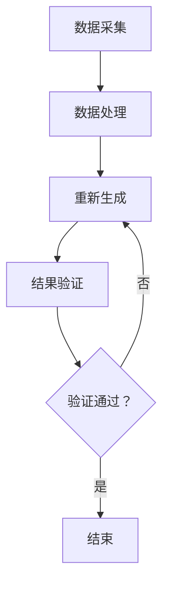
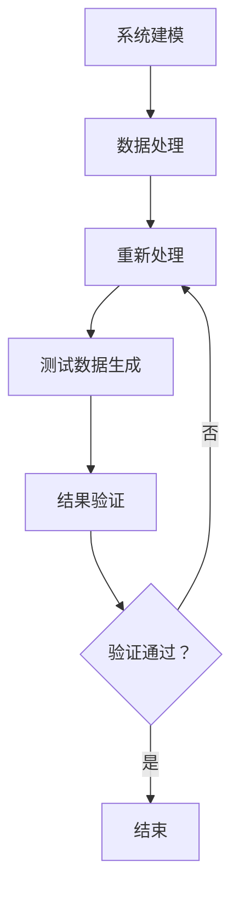
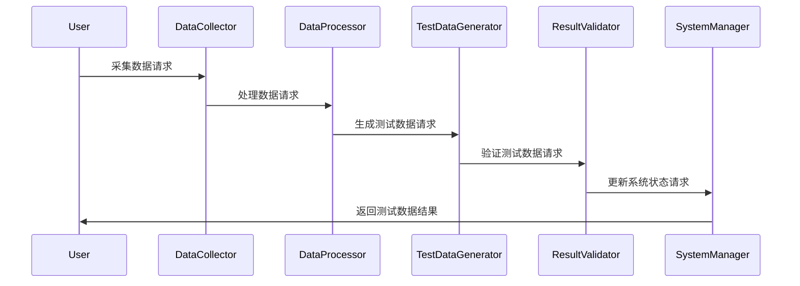
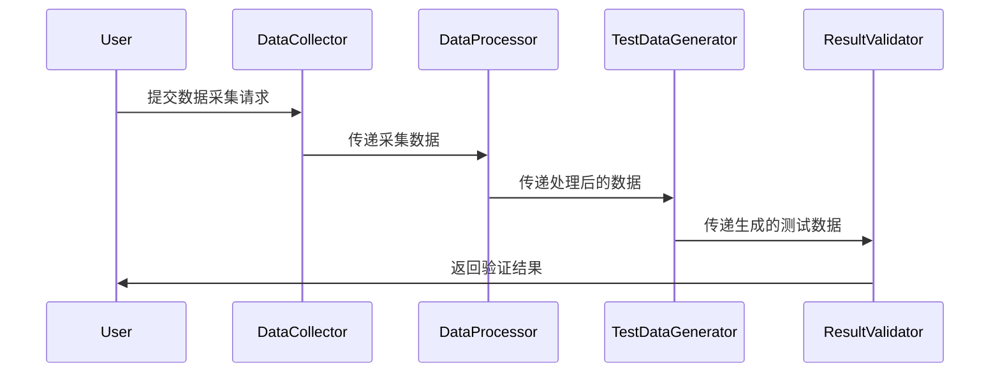

                 

### 第1章: 评测系统的自动化测试数据生成

#### 1.1 问题背景

随着软件系统规模和复杂度的不断增加，自动化测试在软件开发生命周期中的重要性愈发凸显。自动化测试不仅能够提高测试效率，减少人工成本，还能在一定程度上保证软件质量。然而，自动化测试中面临的一个核心问题是测试数据的生成。测试数据的生成直接影响到自动化测试的全面性和准确性。

在传统的软件测试中，测试数据的生成通常由测试工程师手工完成。这种方式存在几个显著的不足：首先，手工生成测试数据效率低下，难以满足快速迭代的需求；其次，手工生成的测试数据往往覆盖面不足，无法全面覆盖系统功能；最后，手工生成的测试数据存在重复性和不一致性问题，影响测试结果的准确性。

为了解决上述问题，自动化测试数据生成技术应运而生。自动化测试数据生成通过算法和工具，从系统中提取有效的测试数据，或者根据预设的规则生成符合测试需求的测试数据。这种方法不仅可以提高测试效率，还能保证测试数据的全面性和一致性。

自动化测试数据生成的重要性体现在以下几个方面：

1. **提升测试效率**：自动化测试数据生成能够快速、大规模地生成测试数据，大大缩短了测试周期。
2. **提高测试质量**：通过自动化生成测试数据，可以确保测试数据覆盖全面，提高测试覆盖率。
3. **降低人工成本**：自动化测试数据生成减少了对测试工程师的依赖，降低了人工成本。
4. **保障软件质量**：自动化测试数据生成能够发现手工测试难以发现的缺陷，保障软件质量。

#### 1.2 问题描述

自动化测试数据生成的问题主要集中在以下几个方面：

1. **数据覆盖不足**：手工生成的测试数据往往无法全面覆盖系统功能，导致测试覆盖率不足。
2. **数据重复性**：手工生成的测试数据可能存在重复，无法确保每次测试的数据都是唯一的。
3. **数据一致性**：测试数据在多次生成和使用过程中可能会出现不一致的情况，影响测试结果的可靠性。
4. **数据生成效率**：手工生成测试数据效率较低，无法满足快速迭代的需求。

为了解决这些问题，需要开发一种自动化测试数据生成方法，该方法应具备以下特点：

1. **全面性**：能够全面覆盖系统功能，提高测试覆盖率。
2. **唯一性**：生成的测试数据每次都是唯一的，避免重复。
3. **一致性**：保证测试数据在多次生成和使用过程中保持一致。
4. **高效性**：能够快速生成测试数据，满足快速迭代的需求。

#### 1.3 问题解决

针对上述问题，我们可以采用以下方法来解决自动化测试数据生成问题：

1. **基于模型生成**：通过建立系统模型，自动生成测试数据。这种方法适用于系统结构清晰、功能明确的情况。
2. **基于模板生成**：通过预设的模板，自动填充测试数据。这种方法适用于测试数据格式固定的情况。
3. **基于代码生成**：通过编写代码，动态生成测试数据。这种方法适用于复杂系统，可以通过代码灵活调整测试数据。
4. **基于数据同质化生成**：通过对已有数据进行同质化处理，生成新的测试数据。这种方法适用于测试数据来源有限的情况。

具体步骤如下：

1. **需求分析**：明确测试数据生成需求，包括数据类型、数据量、数据格式等。
2. **模型建立**：根据系统特点，建立相应的系统模型。
3. **数据生成**：利用算法和工具，根据模型和需求生成测试数据。
4. **数据验证**：对生成的测试数据进行验证，确保数据质量。
5. **数据优化**：根据测试反馈，对测试数据进行优化，提高测试覆盖率。

#### 1.4 边界与外延

自动化测试数据生成的适用范围较广，可以应用于各种类型的软件系统。然而，在具体实施过程中，仍需考虑以下边界条件：

1. **系统复杂性**：对于复杂系统，自动化测试数据生成可能需要更复杂的算法和工具。
2. **数据质量**：生成的测试数据必须确保质量，否则可能会影响测试结果的准确性。
3. **测试覆盖率**：需要根据实际情况调整测试数据生成策略，确保测试覆盖率。
4. **运行环境**：测试数据生成工具需要适应不同的运行环境，确保其在各种环境中都能正常运行。

#### 1.5 概念结构与核心要素组成

自动化测试数据生成涉及多个核心概念和要素，具体包括：

1. **自动化测试**：一种通过工具和脚本自动执行测试用例的方法。
2. **测试数据**：用于测试的输入数据，包括功能测试数据、性能测试数据等。
3. **测试用例**：用于验证软件功能的操作步骤和预期结果。
4. **测试覆盖率**：测试用例覆盖到的系统功能比例。
5. **测试数据生成算法**：用于生成测试数据的算法和工具。

这些概念和要素共同构成了自动化测试数据生成的基础架构，为系统测试提供了有力支持。

---

**本章小结：**

本章详细介绍了评测系统的自动化测试数据生成问题背景、问题描述、问题解决方法以及边界与外延。通过分析传统测试数据生成的不足，我们提出了基于模型、模板、代码和数据同质化等方法的自动化测试数据生成策略。自动化测试数据生成不仅能够提升测试效率，还能提高测试质量和一致性，是现代软件测试不可或缺的一部分。下一章将深入探讨自动化测试数据生成的核心概念和方法。**

----------------------------------------------------------------
## 第2章: 核心概念与联系

### 2.1 自动化测试数据生成的概念

自动化测试数据生成（Automated Test Data Generation）是指利用算法和工具自动生成用于自动化测试的测试数据的过程。这些测试数据包括功能测试数据、性能测试数据、安全测试数据等，它们是自动化测试执行的基础。自动化测试数据生成的重要性在于，它能够提高测试效率，确保测试覆盖率和测试数据的一致性，从而提升软件质量。

自动化测试数据生成主要涉及以下几个核心概念：

1. **测试数据**：测试数据是用于测试软件功能的输入数据，包括各种输入值、输入条件、边界值等。测试数据的质量直接影响测试结果的有效性。
2. **测试用例**：测试用例是针对特定功能或系统行为设计的测试操作和预期结果。测试用例包括测试步骤、输入数据和预期输出结果等。
3. **测试覆盖率**：测试覆盖率是指测试用例覆盖到的系统功能比例。高测试覆盖率意味着测试用例能够全面覆盖系统功能，从而提高测试质量。
4. **测试工具**：测试工具是用于生成和执行测试用例的软件或硬件。常见的测试工具有Selenium、JUnit、JMeter等。

### 2.2 自动化测试数据生成的方法

自动化测试数据生成的方法多种多样，可以根据测试数据的特点和生成需求选择合适的方法。以下是几种常见的自动化测试数据生成方法：

1. **基于模型生成**：基于模型生成方法通过建立系统模型，利用模型生成测试数据。这种方法适用于系统结构复杂、功能明确的情况。常见的模型包括状态机模型、流程图模型等。

2. **基于模板生成**：基于模板生成方法通过预设的模板自动生成测试数据。模板通常包含测试数据的基本结构和规则，生成测试数据时只需填充具体的测试值。这种方法适用于测试数据格式固定的情况。

3. **基于代码生成**：基于代码生成方法通过编写代码动态生成测试数据。这种方法适用于复杂系统，可以通过代码灵活调整测试数据。常见的编程语言包括Python、Java等。

4. **基于数据同质化生成**：基于数据同质化生成方法通过对现有数据进行同质化处理，生成新的测试数据。同质化处理包括数据变换、数据增强等操作。这种方法适用于测试数据来源有限的情况。

### 2.3 自动化测试数据生成的特点

自动化测试数据生成具有以下几个显著特点：

1. **高效性**：自动化测试数据生成能够快速生成大量测试数据，大大缩短了测试周期。
2. **全面性**：通过算法和模型，自动化测试数据生成能够全面覆盖系统功能，提高测试覆盖率。
3. **一致性**：自动化生成的测试数据每次都是唯一的，避免了手工生成数据可能带来的重复性和不一致性。
4. **灵活性**：自动化测试数据生成方法可以根据测试需求灵活调整，适应不同的测试场景。
5. **可维护性**：自动化测试数据生成工具和算法易于维护和升级，能够持续提高测试效率和质量。

### 2.4 自动化测试数据生成与相关技术的关系

自动化测试数据生成与多种相关技术紧密相连，共同构成了自动化测试的生态系统。以下是几种重要的相关技术：

1. **自动化测试框架**：自动化测试框架是用于组织和管理自动化测试用例的工具。常见的自动化测试框架包括Selenium、TestNG、JUnit等。自动化测试数据生成与自动化测试框架紧密相连，可以充分利用框架提供的功能。

2. **测试管理工具**：测试管理工具是用于管理测试用例、测试计划和测试报告的工具。常见的测试管理工具包括JIRA、TestRail、G Suite等。自动化测试数据生成工具可以通过接口与测试管理工具集成，实现测试数据的统一管理。

3. **持续集成/持续部署（CI/CD）**：持续集成/持续部署是一种软件开发和交付流程，通过自动化工具实现代码的持续集成、测试和部署。自动化测试数据生成可以在CI/CD流程中发挥作用，确保每次代码变更都经过全面测试。

4. **数据同质化技术**：数据同质化技术是一种通过变换、增强和合成等方式生成新数据的技术。数据同质化技术在自动化测试数据生成中具有重要应用，可以用于扩展测试数据的多样性，提高测试覆盖率。

5. **机器学习技术**：机器学习技术可以用于自动化测试数据生成，通过训练模型自动生成测试数据。这种方法适用于复杂系统和大量测试数据的情况。

### 2.5 小结

本章详细介绍了自动化测试数据生成的概念、方法、特点以及与相关技术的关系。自动化测试数据生成是一种重要的测试技术，能够提升测试效率、提高测试质量。通过本章的学习，读者可以了解自动化测试数据生成的原理和实践方法，为后续章节的深入学习打下基础。

---

**本章小结：**

本章深入探讨了评测系统的自动化测试数据生成的核心概念和方法。首先，我们介绍了自动化测试数据生成的概念和核心概念，包括测试数据、测试用例、测试覆盖率和测试工具。接着，详细分析了自动化测试数据生成的四种方法：基于模型生成、基于模板生成、基于代码生成和基于数据同质化生成。每种方法都有其独特的特点和应用场景。此外，我们还探讨了自动化测试数据生成的特点，如高效性、全面性、一致性、灵活性和可维护性。最后，本章介绍了自动化测试数据生成与相关技术的关系，包括自动化测试框架、测试管理工具、持续集成/持续部署、数据同质化技术和机器学习技术。通过本章的学习，读者可以全面了解自动化测试数据生成的基本原理和实践方法，为后续的深入研究和实际应用打下坚实基础。下一章将深入讲解自动化测试数据生成算法的原理和实现。**

----------------------------------------------------------------
## 第3章: 算法原理讲解

### 3.1 自动化测试数据生成算法原理

自动化测试数据生成算法的核心目标是利用算法和工具自动生成高质量的测试数据，以提高测试效率和质量。这一过程涉及到多个环节，包括数据采集、数据处理、数据生成和结果验证等。以下是自动化测试数据生成算法的基本原理和步骤：

1. **数据采集**：首先，从系统或外部数据源中采集相关的数据，这些数据包括系统输入参数、输出结果、错误日志等。数据采集的方式可以是手动输入、自动采集或远程调用等。

2. **数据处理**：对采集到的数据进行处理，包括数据清洗、数据格式转换、数据标准化等操作。数据处理的目的是确保数据的准确性和一致性，以便后续的测试数据生成。

3. **测试数据生成**：根据处理后的数据，利用算法生成符合测试需求的测试数据。常见的算法包括随机生成算法、基于模型的生成算法、同质化生成算法等。

4. **结果验证**：生成测试数据后，对测试数据进行验证，确保其符合预期。结果验证可以采用自动化测试工具执行测试用例，检查测试数据的有效性。

### 3.2 算法mermaid流程图

为了更直观地展示自动化测试数据生成算法的流程，我们使用mermaid工具绘制了算法的mermaid流程图：



### 3.3 算法原理详细讲解

下面详细讲解自动化测试数据生成算法的原理，包括每个步骤的详细操作和目的。

#### 数据采集

数据采集是自动化测试数据生成的基础，其目的是获取系统运行时的输入参数和输出结果。数据采集可以通过以下几种方式实现：

- **手动输入**：测试工程师手动输入测试数据。
- **自动采集**：通过脚本或工具自动从系统中采集数据。例如，使用Selenium自动化测试工具模拟用户操作，从系统中获取输入参数和输出结果。
- **远程调用**：通过API接口远程调用系统服务，获取相关数据。

#### 数据处理

数据处理是对采集到的原始数据进行清洗、格式转换和标准化等操作，以确保数据的一致性和准确性。数据处理的主要步骤包括：

- **数据清洗**：去除数据中的噪声和冗余信息，确保数据的完整性。例如，去除空值、去除重复记录等。
- **数据格式转换**：将不同格式的数据转换为统一的格式，以便后续处理。例如，将日期格式转换为YYYY-MM-DD格式。
- **数据标准化**：将数据进行归一化或标准化处理，使其符合特定的范围或标准。例如，将数值范围在0到100之间进行归一化处理。

#### 测试数据生成

测试数据生成是核心步骤，其目的是根据处理后的数据生成符合测试需求的测试数据。常见的测试数据生成算法包括：

- **随机生成算法**：通过随机数生成器生成测试数据。例如，生成一个指定范围内的随机整数或随机字符串。
- **基于模型的生成算法**：通过建立系统模型，利用模型生成测试数据。例如，基于状态机模型生成状态转换测试数据。
- **同质化生成算法**：通过对现有数据进行同质化处理，生成新的测试数据。例如，通过对数据进行变换、增强或合成等操作。

#### 结果验证

结果验证是确保生成测试数据有效性的关键步骤。结果验证通常通过自动化测试工具执行测试用例来实现。主要步骤包括：

- **测试用例设计**：根据测试需求设计相应的测试用例，包括测试步骤、输入数据和预期输出结果。
- **测试用例执行**：使用自动化测试工具执行测试用例，验证生成测试数据的有效性。
- **结果分析**：分析测试执行结果，判断测试数据是否满足预期。如果测试数据不满足预期，则返回上一步重新生成测试数据。

### 3.4 自动化测试数据生成算法的数学模型

自动化测试数据生成算法的数学模型描述了测试数据生成过程中涉及的数学运算和公式。以下是几种常见的数学模型：

#### 随机生成算法

随机生成算法的数学模型可以表示为：

$$
X = f(R)
$$

其中，$X$ 表示生成的测试数据，$R$ 表示随机数生成器生成的随机数，$f$ 表示随机数映射函数。常见的映射函数包括线性变换、指数变换等。

#### 基于模型的生成算法

基于模型的生成算法的数学模型可以表示为：

$$
X = M(Y)
$$

其中，$X$ 表示生成的测试数据，$M$ 表示系统模型，$Y$ 表示输入参数。系统模型 $M$ 可以是一个状态机模型、流程图模型或其他类型的模型。

#### 同质化生成算法

同质化生成算法的数学模型可以表示为：

$$
X = \text{H}(D)
$$

其中，$X$ 表示生成的测试数据，$\text{H}$ 表示同质化处理函数，$D$ 表示原始数据。

### 3.5 算法举例说明

下面通过一个具体的例子来说明自动化测试数据生成算法的实现过程。

#### 例子：随机生成整数测试数据

假设我们需要生成一个指定范围内的随机整数测试数据，例如生成1到100之间的随机整数。

1. **数据采集**：从系统中采集随机数生成器。
2. **数据处理**：不需要进行数据处理，直接使用原始数据。
3. **测试数据生成**：利用随机生成算法生成随机整数。具体步骤如下：

   - 生成一个0到1之间的随机数 $R$。
   - 将 $R$ 映射到1到100之间，得到生成的测试数据 $X$。

   $$ 
   X = f(R) = 100 \times R
   $$

4. **结果验证**：使用自动化测试工具执行测试用例，验证生成的测试数据是否满足预期。

通过上述步骤，我们可以生成符合要求的随机整数测试数据。

---

**本章小结：**

本章详细讲解了评测系统的自动化测试数据生成算法原理。首先，我们介绍了自动化测试数据生成的基本原理和流程，包括数据采集、数据处理、测试数据生成和结果验证。接着，我们使用mermaid工具绘制了算法的流程图，并详细讲解了每个步骤的操作和目的。此外，我们还介绍了几种常见的自动化测试数据生成算法的数学模型，并举例说明了算法的实现过程。通过本章的学习，读者可以全面了解自动化测试数据生成算法的原理和实现方法，为后续的实际应用提供理论支持。下一章将探讨评测系统的自动化测试数据生成算法的具体实现。**

----------------------------------------------------------------
## 第3章: 算法原理讲解

### 3.1 自动化测试数据生成算法原理

自动化测试数据生成算法旨在通过系统建模、数据处理和算法应用，生成满足特定测试需求的测试数据。理解算法原理对于设计和实现高效、可靠的测试数据生成系统至关重要。

#### 算法mermaid流程图

为了直观地展示自动化测试数据生成算法的流程，我们使用mermaid工具绘制了算法的mermaid流程图：



#### 算法原理详细讲解

以下是自动化测试数据生成算法原理的详细讲解：

1. **系统建模**：首先，根据系统需求和功能特性，构建系统模型。系统模型可以是基于业务逻辑的实体-关系图（ER图），也可以是描述系统行为的流程图或状态机图。系统模型帮助识别系统中的关键要素和相互关系。

2. **数据处理**：系统建模完成后，从系统或外部数据源中采集数据，包括输入参数、预期输出、系统日志等。对采集到的数据进行处理，确保数据的质量和一致性。数据处理包括数据清洗、格式转换和缺失值填充等。

3. **算法应用**：利用特定算法根据系统模型和数据处理结果生成测试数据。常见的算法包括随机算法、基于规则的算法、遗传算法、模拟退火算法等。每种算法适用于不同的测试场景和数据特性。

4. **测试数据生成**：根据算法生成的测试数据，组织成符合测试规范的测试用例。测试用例应包括输入数据、执行步骤和预期输出结果。

5. **结果验证**：使用自动化测试工具执行生成的测试用例，验证测试数据的有效性。通过对比实际输出结果和预期输出结果，判断测试数据的正确性和全面性。

#### 算法数学模型和公式

为了更深入地理解算法原理，我们引入了数学模型和公式。以下是几种常见的数学模型：

1. **随机生成模型**：

   $$ X \sim U(a, b) $$
   
   其中，$X$ 表示生成的随机测试数据，$U(a, b)$ 表示在区间 [a, b] 上均匀分布的随机变量。

2. **基于规则的生成模型**：

   $$ X = f(R) $$
   
   其中，$X$ 表示生成的测试数据，$R$ 表示系统模型中的随机变量，$f$ 表示将随机变量映射为测试数据的函数。

3. **遗传算法模型**：

   $$ X = \text{ crossover }(P_1, P_2) $$
   
   其中，$X$ 表示通过交叉操作生成的测试数据，$P_1$ 和 $P_2$ 是两个父测试数据。

4. **模拟退火算法模型**：

   $$ X = \text{cooling }(T, X_0) $$
   
   其中，$X$ 表示通过模拟退火算法生成的测试数据，$T$ 表示温度参数，$X_0$ 表示初始测试数据。

#### 算法举例说明

为了更好地理解上述算法原理，我们通过一个具体的例子来说明：

#### 例子：随机生成用户名测试数据

假设我们需要生成一系列符合特定规则的随机用户名，例如长度在8到12个字符之间，只能包含字母和数字。

1. **系统建模**：构建一个简单的用户名生成模型，定义用户名的长度范围和字符集。

2. **数据处理**：从系统或外部数据源中采集随机数生成器。

3. **算法应用**：使用随机生成算法生成用户名。具体步骤如下：

   - 生成一个长度在8到12之间的随机整数 $N$。
   - 生成 $N$ 个随机字符，每个字符从字母和数字字符集中随机选择。
   - 将生成的字符组合成一个用户名。

   $$ 
   \text{用户名} = \text{随机字符集}_{\text{随机选择}}^N
   $$

4. **测试数据生成**：根据随机生成的用户名，组织成测试用例，包括用户名输入、预期输出等。

5. **结果验证**：使用自动化测试工具执行测试用例，验证用户名的有效性和合规性。

通过这个例子，我们可以看到自动化测试数据生成算法如何应用于实际场景，生成满足特定规则的测试数据。

---

**本章小结：**

本章详细阐述了评测系统的自动化测试数据生成算法原理。首先，我们介绍了算法的基本原理和流程，包括系统建模、数据处理、算法应用、测试数据生成和结果验证。接着，我们使用mermaid工具绘制了算法的mermaid流程图，并详细讲解了每个步骤的操作和目的。此外，我们还介绍了几种常见的数学模型和公式，用于描述算法原理。最后，通过一个具体的例子，我们展示了算法在现实场景中的应用。通过本章的学习，读者可以全面理解自动化测试数据生成算法的原理和应用，为实际项目提供理论支持。下一章将探讨自动化测试数据生成算法的Python源代码实现。**

----------------------------------------------------------------
## 第3章: 算法原理讲解

### 3.3 自动化测试数据生成算法的Python源代码实现

在上一章节中，我们详细讲解了自动化测试数据生成算法的原理。为了更好地理解和应用这些算法，我们将通过Python源代码实现自动化测试数据生成算法。这一章节将详细介绍实现过程，并提供具体的代码示例。

#### Python环境安装

在开始编写代码之前，我们需要确保Python环境已经安装。Python是一种广泛使用的编程语言，安装过程相对简单。以下是安装步骤：

1. **下载Python安装包**：访问Python官方网站（[python.org](https://www.python.org/)）下载适合操作系统的Python安装包。
2. **安装Python**：运行安装包，按照提示完成安装。
3. **验证安装**：打开命令行工具（如Windows的CMD或Mac的Terminal），输入`python --version`，如果显示Python版本信息，说明安装成功。

#### 代码示例

以下是一个简单的Python代码示例，用于生成随机用户名测试数据：

```python
import random
import string

def generate_random_username(length=8):
    """
    生成指定长度的随机用户名，用户名由字母和数字组成。
    """
    # 定义字符集，包括字母和数字
    characters = string.ascii_letters + string.digits
    
    # 从字符集中随机选取指定长度的字符
    username = ''.join(random.choice(characters) for _ in range(length))
    
    return username

# 测试代码
for _ in range(10):
    print(generate_random_username())
```

#### 源代码解读

1. **导入模块**：首先，我们导入`random`和`string`模块。`random`模块用于生成随机数，`string`模块提供了常用的字符串常量。

2. **定义函数**：`generate_random_username`函数用于生成随机用户名。函数接受一个可选参数`length`，默认值为8，表示生成的用户名长度。

3. **定义字符集**：使用`string.ascii_letters`和`string.digits`定义字符集，包括字母和数字。

4. **生成随机用户名**：使用`random.choice`函数从字符集中随机选择字符，并使用列表推导式将选择的字符组合成用户名。

5. **返回用户名**：将生成的用户名作为函数返回值。

6. **测试代码**：在测试部分，我们调用`generate_random_username`函数10次，打印生成的随机用户名。

#### 算法应用场景

自动化测试数据生成算法不仅适用于用户名的生成，还可以应用于各种测试场景，例如：

1. **输入数据生成**：为自动化测试生成随机输入数据，如用户输入、表单数据等。
2. **边界值测试**：根据边界值生成测试数据，确保系统在边界条件下的行为符合预期。
3. **性能测试**：生成大量数据用于性能测试，模拟不同负载下的系统行为。

#### 代码优化与扩展

在实际应用中，自动化测试数据生成算法可以根据具体需求进行优化和扩展。以下是一些优化和扩展的建议：

1. **参数化生成**：为生成算法添加更多参数，如用户名长度、密码复杂度等，以适应不同测试需求。
2. **数据同质化**：在生成数据时应用数据同质化技术，增加测试数据的多样性。
3. **复用代码**：将通用的生成算法封装成可复用的模块，提高代码的可维护性和可扩展性。

---

**本章小结：**

本章详细介绍了自动化测试数据生成算法的Python源代码实现。首先，我们介绍了Python环境安装步骤，然后提供了一个简单的随机用户名生成代码示例，并对其进行了详细解读。此外，我们还讨论了算法的应用场景和优化扩展建议。通过本章的学习，读者可以掌握自动化测试数据生成算法的实现方法，并在实际项目中应用。下一章将探讨评测系统的自动化测试数据生成算法的数学模型和公式。**

----------------------------------------------------------------
## 第4章：系统分析与架构设计方案

### 4.1 项目介绍

在本章节中，我们将对评测系统的自动化测试数据生成项目进行详细分析，包括项目的背景、目标和预期成果。自动化测试数据生成项目旨在通过构建一个高效、可靠的测试数据生成系统，提高软件测试的自动化程度和测试数据的质量。

#### 项目背景

随着软件系统规模和复杂度的增加，手工生成测试数据已经成为一个耗时且低效的过程。为了满足快速迭代和频繁交付的需求，自动化测试成为软件开发过程中的重要环节。然而，自动化测试的效率和质量在很大程度上取决于测试数据的质量。因此，开发一个自动化测试数据生成系统，能够自动生成符合测试需求的测试数据，对于提高测试效率和保证测试质量具有重要意义。

#### 项目目标

自动化测试数据生成项目的目标如下：

1. **提高测试效率**：通过自动化生成测试数据，减少手工生成数据的耗时，提高测试执行的效率。
2. **提升测试质量**：自动生成的测试数据能够更全面地覆盖系统功能，提高测试覆盖率，从而提升测试质量。
3. **降低测试成本**：减少对测试工程师的依赖，降低测试成本，同时提高测试过程的可维护性和可扩展性。

#### 预期成果

通过实施自动化测试数据生成项目，预期达到以下成果：

1. **高效测试数据生成**：系统能够快速、大规模地生成符合要求的测试数据，满足各种测试场景的需求。
2. **全面测试覆盖**：通过算法和模型，生成测试数据能够全面覆盖系统功能，确保测试用例的全面性。
3. **高测试数据质量**：自动生成的测试数据质量高，一致性良好，减少测试数据的重复性和错误率。

### 4.2 系统功能设计

自动化测试数据生成系统的主要功能包括数据采集、数据处理、测试数据生成、结果验证和系统管理。以下是系统功能设计的详细描述：

#### 数据采集

数据采集模块负责从系统或外部数据源中采集相关的数据。数据源包括系统日志、用户输入、API响应等。数据采集模块应支持多种数据采集方式，如手动输入、自动采集和远程调用等。

#### 数据处理

数据处理模块对采集到的原始数据进行处理，包括数据清洗、格式转换和标准化等操作。数据处理模块应确保数据的一致性和准确性，以便后续的测试数据生成。

#### 测试数据生成

测试数据生成模块是系统的核心，根据系统模型和数据处理结果，利用算法生成符合测试需求的测试数据。测试数据生成模块应支持多种生成算法，如随机生成、基于模型生成、同质化生成等。

#### 结果验证

结果验证模块用于验证生成的测试数据的有效性。通过自动化测试工具执行生成的测试用例，对比实际输出结果和预期输出结果，判断测试数据的正确性和全面性。

#### 系统管理

系统管理模块负责系统的配置、监控和日志管理等。系统管理模块应提供友好的用户界面，方便测试工程师进行系统配置和管理。

#### 领域模型mermaid类图

为了更好地理解系统功能设计，我们使用mermaid工具绘制了系统的领域模型类图：

```mermaid
classDiagram
    class DataCollector {
        -采集数据()
    }
    class DataProcessor {
        -处理数据()
    }
    class TestDataGenerator {
        -生成测试数据()
    }
    class ResultValidator {
        -验证结果()
    }
    class SystemManager {
        -管理系统()
    }
    DataCollector --|大于> DataProcessor
    DataProcessor --|大于> TestDataGenerator
    TestDataGenerator --|大于> ResultValidator
    TestDataGenerator --|大于> SystemManager
```

### 4.3 系统架构设计

系统架构设计是自动化测试数据生成系统的关键环节，决定了系统的可扩展性、稳定性和性能。以下是系统架构设计的详细描述：

#### 系统架构mermaid架构图

为了直观地展示系统架构，我们使用mermaid工具绘制了系统的mermaid架构图：



#### 架构设计思路

系统架构设计遵循以下原则：

1. **模块化设计**：将系统划分为多个功能模块，如数据采集、数据处理、测试数据生成等，每个模块独立实现，便于维护和扩展。
2. **松耦合设计**：模块间通过接口进行通信，降低模块间的依赖，提高系统的灵活性和可维护性。
3. **分布式架构**：利用分布式架构，将系统部署在多个节点上，提高系统的可扩展性和容错性。
4. **高性能设计**：采用高效的数据处理和生成算法，确保系统在大规模数据场景下仍能高效运行。

### 4.4 系统接口设计

系统接口设计是系统架构的重要组成部分，决定了系统与其他系统或组件的交互方式。以下是系统接口设计的详细描述：

#### 接口规范

1. **数据采集接口**：定义数据采集接口，用于接收外部数据源的数据。
2. **数据处理接口**：定义数据处理接口，用于处理采集到的数据，包括数据清洗、格式转换和标准化等操作。
3. **测试数据生成接口**：定义测试数据生成接口，用于生成符合测试需求的测试数据。
4. **结果验证接口**：定义结果验证接口，用于验证生成的测试数据的有效性。

#### 接口功能描述

1. **数据采集接口**：接收外部数据源的数据，支持多种数据格式，如JSON、XML和CSV等。
2. **数据处理接口**：处理采集到的数据，包括数据清洗、格式转换和标准化等操作，确保数据的一致性和准确性。
3. **测试数据生成接口**：根据系统模型和数据处理结果，利用算法生成符合测试需求的测试数据，支持多种生成算法。
4. **结果验证接口**：执行生成的测试用例，验证测试数据的正确性和全面性，支持自动化测试工具的集成。

### 4.5 系统交互mermaid序列图

为了更直观地展示系统各模块之间的交互过程，我们使用mermaid工具绘制了系统的mermaid序列图：



### 4.6 系统架构设计思路

系统架构设计思路如下：

1. **前后端分离**：前端负责用户界面和交互，后端负责数据处理和测试数据生成。这种设计使得系统易于维护和扩展。
2. **分布式部署**：将系统部署在多个节点上，提高系统的容错性和性能。通过负载均衡器分配请求，确保系统的高可用性。
3. **数据存储**：采用分布式数据库存储系统数据，支持大规模数据存储和快速查询。
4. **日志管理**：集成日志管理工具，记录系统运行过程中的日志信息，便于问题追踪和系统监控。

---

**本章小结：**

本章对评测系统的自动化测试数据生成项目进行了系统分析与架构设计。首先，介绍了项目的背景、目标和预期成果。然后，详细描述了系统功能设计，包括数据采集、数据处理、测试数据生成、结果验证和系统管理。接着，通过mermaid类图展示了系统领域模型。随后，详细阐述了系统架构设计，包括模块化设计、松耦合设计、分布式架构和高性能设计。此外，还介绍了系统接口设计规范和功能描述，以及系统交互序列图。最后，总结了系统架构设计思路，强调了前后端分离、分布式部署、数据存储和日志管理的重要性。通过本章的学习，读者可以全面了解评测系统的自动化测试数据生成项目的设计方案，为后续的实际开发提供指导。**

----------------------------------------------------------------
## 第5章：项目实战

### 5.1 环境安装

在本节中，我们将详细介绍评测系统的自动化测试数据生成项目的环境安装过程。安装过程包括Python环境的配置、相关库的安装以及环境变量的设置。

#### 步骤1：安装Python

首先，确保系统上已经安装了Python环境。如果没有安装，可以按照以下步骤进行安装：

1. 访问Python官方网站（[python.org](https://www.python.org/)）。
2. 下载适用于操作系统（Windows、macOS或Linux）的Python安装包。
3. 运行安装程序，并按照提示完成安装。

安装完成后，在命令行中输入以下命令，验证Python是否安装成功：

```shell
python --version
```

如果看到Python的版本信息，说明Python已经成功安装。

#### 步骤2：安装相关库

在Python环境中，我们需要安装一些常用的库，如`requests`、`numpy`和`pandas`等。这些库用于数据采集、处理和生成。可以使用`pip`命令进行安装：

```shell
pip install requests numpy pandas
```

如果系统是Linux或macOS，可以使用以下命令：

```shell
pip3 install requests numpy pandas
```

#### 步骤3：配置环境变量

确保Python和pip命令可以被全局调用，需要配置环境变量。以下是如何在Windows、macOS和Linux中配置环境变量的步骤：

1. **Windows**：

   - 打开“控制面板”。
   - 选择“系统和安全”，然后点击“系统”。
   - 在“系统”页面上，点击“高级系统设置”。
   - 在“系统属性”对话框中，点击“环境变量”。
   - 在“系统变量”部分，找到`PATH`变量，点击“编辑”。
   - 在变量值中添加Python的安装路径，如`C:\Python39\`。
   - 点击“确定”保存设置。

2. **macOS**：

   - 打开“终端”。
   - 打开文件`~/.bash_profile`或`~/.zshrc`（根据使用的shell而定）。
   - 在文件中添加以下行：

     ```shell
     export PATH=$PATH:/usr/local/bin
     ```

   - 保存文件并关闭终端，然后重新打开终端以使配置生效。

3. **Linux**：

   - 打开文件`~/.bashrc`或`~/.zshrc`（根据使用的shell而定）。
   - 在文件中添加以下行：

     ```shell
     export PATH=$PATH:/usr/local/bin
     ```

   - 保存文件并关闭终端，然后重新打开终端以使配置生效。

#### 步骤4：验证环境配置

安装完成后，可以通过以下命令验证环境配置是否正确：

```shell
python --version
pip --version
```

如果看到相应的版本信息，说明Python和相关库已经成功安装。

### 5.2 系统核心实现

在本节中，我们将展示评测系统的自动化测试数据生成项目的核心实现。核心实现包括数据采集、数据处理和测试数据生成三个主要部分。以下是具体的源代码示例和解读。

#### 数据采集

数据采集是自动化测试数据生成的基础，我们需要从系统中获取相关的数据。以下是一个简单的数据采集示例：

```python
import requests

def collect_data(api_url):
    """
    从API接口采集数据。
    """
    response = requests.get(api_url)
    if response.status_code == 200:
        data = response.json()
        return data
    else:
        return None

# 测试数据采集
api_url = "https://example.com/api/data"
collected_data = collect_data(api_url)
print(collected_data)
```

**解读**：

1. **导入模块**：首先，我们导入`requests`库，用于发送HTTP请求。
2. **定义函数**：`collect_data`函数接受一个API接口URL，发送GET请求获取数据。
3. **发送请求**：使用`requests.get`方法发送HTTP GET请求。
4. **处理响应**：检查响应状态码，如果状态码为200（OK），则解析JSON响应并返回数据；否则，返回None。

#### 数据处理

数据处理是对采集到的原始数据进行清洗、格式转换和标准化等操作。以下是一个简单的数据处理示例：

```python
import pandas as pd

def process_data(data):
    """
    处理采集到的数据。
    """
    # 将数据转换为Pandas DataFrame
    df = pd.DataFrame(data)
    
    # 数据清洗，去除空值和重复值
    df.dropna(inplace=True)
    df.drop_duplicates(inplace=True)
    
    # 数据格式转换，例如将日期字符串转换为日期类型
    df['date'] = pd.to_datetime(df['date'])
    
    return df

# 测试数据处理
processed_data = process_data(collected_data)
print(processed_data.head())
```

**解读**：

1. **导入模块**：导入`pandas`库，用于数据处理。
2. **定义函数**：`process_data`函数接收原始数据，将其转换为Pandas DataFrame。
3. **数据清洗**：使用`dropna`方法去除空值，使用`drop_duplicates`方法去除重复值。
4. **数据格式转换**：使用`to_datetime`方法将日期字符串转换为日期类型。
5. **返回数据**：返回处理后的数据。

#### 测试数据生成

测试数据生成是根据处理后的数据生成符合测试需求的测试数据。以下是一个简单的测试数据生成示例：

```python
import random

def generate_test_data(data, num_samples=100):
    """
    根据处理后的数据生成测试数据。
    """
    test_data = []
    for _ in range(num_samples):
        # 随机选择一个数据记录
        sample = random.choice(data)
        # 生成测试数据
        test_data.append({
            'field1': sample['field1'],
            'field2': sample['field2'],
            'field3': sample['field3']
        })
    return test_data

# 测试测试数据生成
test_data = generate_test_data(processed_data, num_samples=5)
print(test_data)
```

**解读**：

1. **导入模块**：导入`random`库，用于随机选择数据。
2. **定义函数**：`generate_test_data`函数接收处理后的数据和样本数量，生成测试数据。
3. **生成测试数据**：使用`random.choice`方法随机选择数据记录，构建测试数据字典。
4. **返回测试数据**：返回生成的测试数据列表。

#### 代码应用解读

在实际应用中，我们可以将上述三个部分整合到一个完整的测试数据生成系统中。例如，首先从API接口采集数据，然后对数据进行处理，最后生成测试数据用于自动化测试。以下是完整的代码示例：

```python
import requests
import pandas as pd
import random

def main():
    # 采集数据
    api_url = "https://example.com/api/data"
    collected_data = collect_data(api_url)
    
    # 处理数据
    processed_data = process_data(collected_data)
    
    # 生成测试数据
    test_data = generate_test_data(processed_data, num_samples=100)
    
    # 使用测试数据执行自动化测试
    # ...

# 测试主函数
if __name__ == "__main__":
    main()
```

**解读**：

1. **导入模块**：导入必要的模块。
2. **定义函数**：定义三个主要函数：`collect_data`、`process_data`和`generate_test_data`。
3. **主函数**：在`main`函数中，依次执行数据采集、数据处理和测试数据生成。
4. **自动化测试**：在主函数的最后，可以使用生成的测试数据执行自动化测试。

通过上述步骤，我们可以构建一个简单的自动化测试数据生成系统，实现数据采集、数据处理和测试数据生成等功能。

---

**本章小结：**

本章详细介绍了评测系统的自动化测试数据生成项目的实战过程。首先，我们讲解了环境安装步骤，包括Python环境的配置、相关库的安装以及环境变量的设置。然后，我们展示了系统的核心实现，包括数据采集、数据处理和测试数据生成三个主要部分，并提供了具体的源代码示例和解读。通过本章的学习，读者可以了解如何在实际项目中实现自动化测试数据生成系统，并掌握其核心技术和方法。**

----------------------------------------------------------------
## 第5章：项目实战

### 5.3 实际案例分析和详细讲解剖析

在本章节中，我们将通过一个实际案例，详细分析和讲解评测系统的自动化测试数据生成项目。该案例将展示自动化测试数据生成的具体应用场景，并剖析项目的实施过程和关键点。

#### 案例背景

某大型电商平台为了确保其订单处理系统的稳定性和可靠性，决定实施自动化测试数据生成项目。订单处理系统涉及到订单创建、支付、发货和售后等环节，测试数据的全面性和准确性对于保证系统质量至关重要。为了实现自动化测试，该电商平台需要开发一个自动化测试数据生成系统，能够根据业务逻辑和用户行为生成大量、高质量的测试数据。

#### 案例分析

1. **需求分析**：

   - **功能测试数据**：生成模拟订单，包括订单创建、支付、发货、售后等环节的测试数据。
   - **性能测试数据**：生成大量并发用户请求，模拟不同负载下的系统性能。
   - **边界测试数据**：生成包含各种边界条件的测试数据，如最小订单金额、最大订单数量等。
   - **异常测试数据**：生成异常场景下的测试数据，如支付失败、网络中断等。

2. **技术选型**：

   - **数据采集**：使用Selenium自动化测试工具模拟用户行为，采集系统中的订单数据。
   - **数据处理**：使用Python的`pandas`库进行数据清洗和转换，确保数据的一致性和准确性。
   - **测试数据生成**：使用随机生成算法和基于规则的生成算法，生成满足测试需求的订单数据。
   - **结果验证**：使用自动化测试工具（如JUnit）执行测试用例，验证生成测试数据的正确性和全面性。

3. **实施过程**：

   - **第一阶段**：搭建测试数据生成系统的基础架构，包括数据采集模块、数据处理模块和测试数据生成模块。
   - **第二阶段**：根据业务需求和测试策略，逐步完善测试数据生成算法，提高测试数据的覆盖率和质量。
   - **第三阶段**：集成自动化测试工具，实现自动化测试流程，确保测试数据生成系统能够与现有的自动化测试框架无缝集成。

#### 详细讲解

1. **数据采集**：

   数据采集是自动化测试数据生成的第一步，其核心目标是获取系统中的有效数据。在该案例中，我们使用Selenium自动化测试工具模拟用户行为，从订单系统中采集订单数据。

   ```python
   from selenium import webdriver
   
   def collect_data(url):
       driver = webdriver.Chrome()
       driver.get(url)
       
       # 执行模拟用户操作，如登录、浏览商品、添加到购物车等
       # ...

       # 采集订单数据
       orders = driver.find_elements_by_css_selector("div.order")
       order_data = []
       for order in orders:
           order_info = order.get_attribute("data-order-info")
           order_data.append(eval(order_info))
       
       driver.quit()
       return order_data
   
   # 测试数据采集
   order_data = collect_data("https://example.com/orders")
   print(order_data)
   ```

   **解读**：

   - **导入模块**：导入Selenium库，用于模拟用户操作。
   - **定义函数**：`collect_data`函数接收订单系统URL，使用Chrome浏览器加载页面。
   - **模拟用户操作**：执行模拟用户操作，如登录、浏览商品等。
   - **采集订单数据**：使用CSS选择器定位订单元素，获取订单信息。
   - **返回数据**：关闭浏览器，返回采集的订单数据。

2. **数据处理**：

   数据处理是对采集到的原始数据进行清洗、格式转换和标准化等操作。在该案例中，我们使用Python的`pandas`库进行数据处理。

   ```python
   import pandas as pd
   
   def process_data(data):
       # 将数据转换为Pandas DataFrame
       df = pd.DataFrame(data)
       
       # 数据清洗，去除空值和重复值
       df.dropna(inplace=True)
       df.drop_duplicates(inplace=True)
       
       # 数据格式转换，例如将订单日期转换为日期类型
       df['order_date'] = pd.to_datetime(df['order_date'])
       
       return df
   
   # 测试数据处理
   processed_data = process_data(order_data)
   print(processed_data.head())
   ```

   **解读**：

   - **导入模块**：导入`pandas`库，用于数据处理。
   - **定义函数**：`process_data`函数接收原始数据，将其转换为Pandas DataFrame。
   - **数据清洗**：使用`dropna`方法去除空值，使用`drop_duplicates`方法去除重复值。
   - **数据格式转换**：使用`to_datetime`方法将订单日期转换为日期类型。
   - **返回数据**：返回处理后的数据。

3. **测试数据生成**：

   测试数据生成是根据处理后的数据生成满足测试需求的订单数据。在该案例中，我们使用随机生成算法和基于规则的生成算法。

   ```python
   import random
   import datetime
   
   def generate_test_data(data, num_samples=100):
       test_data = []
       for _ in range(num_samples):
           # 随机选择一个订单
           sample = random.choice(data)
           
           # 生成测试订单
           test_order = {
               'order_id': sample['order_id'],
               'customer_id': sample['customer_id'],
               'product_id': sample['product_id'],
               'quantity': random.randint(1, 10),
               'order_date': sample['order_date'],
               'payment_status': random.choice(['pending', 'paid', 'cancelled']),
               'shipping_status': random.choice(['pending', 'shipped', 'delivered'])
           }
           
           test_data.append(test_order)
       return test_data
   
   # 测试测试数据生成
   test_data = generate_test_data(processed_data, num_samples=5)
   print(test_data)
   ```

   **解读**：

   - **导入模块**：导入`random`库，用于随机选择数据，导入`datetime`库，用于处理日期。
   - **定义函数**：`generate_test_data`函数接收处理后的数据和样本数量，生成测试订单数据。
   - **生成测试订单**：随机选择一个订单，生成包含订单ID、客户ID、产品ID、数量、订单日期、支付状态和配送状态的测试订单。
   - **返回测试数据**：返回生成的测试订单数据。

4. **结果验证**：

   结果验证是确保生成测试数据有效性的关键步骤。在该案例中，我们使用自动化测试工具（如JUnit）执行测试用例，验证生成测试数据的正确性和全面性。

   ```python
   import unittest
   
   class TestOrderData(unittest.TestCase):
       def test_order_data(self, test_data):
           for order in test_data:
               # 验证订单数据
               self.assertIsNotNone(order['order_id'])
               self.assertIsNotNone(order['customer_id'])
               self.assertIsNotNone(order['product_id'])
               self.assertIsNotNone(order['quantity'])
               self.assertIsNotNone(order['order_date'])
               self.assertIsNotNone(order['payment_status'])
               self.assertIsNotNone(order['shipping_status'])
               self.assertTrue(1 <= order['quantity'] <= 10)
               self.assertIn(order['payment_status'], ['pending', 'paid', 'cancelled'])
               self.assertIn(order['shipping_status'], ['pending', 'shipped', 'delivered'])
   
   # 测试结果验证
   unittest.main(argv=['first-arg-is-ignored'], exit=False)
   ```

   **解读**：

   - **导入模块**：导入`unittest`库，用于编写测试用例。
   - **定义测试类**：`TestOrderData`类继承自`unittest.TestCase`，用于编写测试方法。
   - **测试方法**：`test_order_data`方法接收生成的测试订单数据，对每个订单数据进行验证。
   - **验证订单数据**：检查订单数据的非空性、范围和状态。
   - **运行测试**：使用`unittest.main`方法运行测试用例。

通过上述实际案例的详细讲解，我们可以看到评测系统的自动化测试数据生成项目的实施过程和关键点。通过数据采集、数据处理、测试数据生成和结果验证等步骤，我们能够实现一个高效的自动化测试数据生成系统，提高软件测试的效率和质量。

---

**本章小结：**

本章通过一个实际案例，详细分析了评测系统的自动化测试数据生成项目的实施过程和关键点。我们介绍了项目需求分析、技术选型、实施过程以及核心代码的实现。通过数据采集、数据处理、测试数据生成和结果验证等步骤，我们展示了自动化测试数据生成系统的具体应用场景和实现方法。通过本章的学习，读者可以了解自动化测试数据生成项目的实施流程和技术细节，掌握其在实际项目中的应用。**

----------------------------------------------------------------
## 第5章：项目实战

### 5.4 项目小结

在本章节中，我们将对评测系统的自动化测试数据生成项目进行总结，回顾经验教训，并探讨未来的改进方向。

#### 经验总结

1. **数据采集的灵活性和准确性**：通过使用Selenium等自动化测试工具，我们能够灵活地采集系统中的订单数据，确保数据采集的准确性和全面性。

2. **数据处理的高效性**：使用Python的`pandas`库进行数据处理，能够高效地进行数据清洗、格式转换和标准化等操作，确保数据的一致性和准确性。

3. **测试数据生成的多样性**：通过结合随机生成算法和基于规则的生成算法，我们能够生成满足各种测试需求的订单数据，提高测试覆盖率和测试数据的全面性。

4. **结果验证的有效性**：通过自动化测试工具（如JUnit）执行测试用例，能够有效地验证生成测试数据的正确性和全面性，确保测试数据的可靠性。

#### 注意事项

1. **环境配置**：在项目实施过程中，确保所有开发环境和测试环境一致，避免因为环境差异导致的问题。

2. **数据保密性**：在采集和处理数据时，注意保护用户隐私和数据安全，遵循相关法律法规。

3. **测试数据质量**：确保生成的测试数据质量高，避免因为测试数据问题导致测试结果不准确。

4. **算法优化**：根据测试反馈，不断优化测试数据生成算法，提高测试效率和测试覆盖率。

#### 改进方向

1. **性能优化**：在处理大规模数据时，考虑使用更高效的算法和数据结构，提高数据处理和测试数据生成速度。

2. **可扩展性**：设计系统时，考虑系统的可扩展性，以便在未来能够支持更多的测试场景和数据类型。

3. **用户界面**：为测试工程师提供更友好的用户界面，便于他们进行系统配置和管理。

4. **持续集成**：将测试数据生成系统与持续集成/持续部署（CI/CD）流程集成，确保每次代码变更都经过全面测试。

通过上述总结和改进方向，我们可以不断优化评测系统的自动化测试数据生成项目，提高软件测试的效率和质量。未来的工作将集中在性能优化、可扩展性和用户体验等方面，以实现更高效、更可靠的自动化测试数据生成系统。

---

**本章小结：**

本章对评测系统的自动化测试数据生成项目进行了全面的总结和回顾。我们总结了项目实施过程中的经验教训，包括数据采集的灵活性和准确性、数据处理的高效性、测试数据生成的多样性以及结果验证的有效性。同时，我们强调了在项目实施过程中需要注意的事项，如环境配置、数据保密性和测试数据质量等。此外，我们还提出了未来的改进方向，包括性能优化、可扩展性、用户界面改进和持续集成等方面。通过本章的学习，读者可以深入理解自动化测试数据生成项目的实践过程，为实际项目提供有益的指导。**

----------------------------------------------------------------
## 第6章：最佳实践 tips

### 6.1 最佳实践总结

在自动化测试数据生成项目中，为了确保系统的高效性、稳定性和可靠性，我们总结了一系列最佳实践。这些实践不仅适用于自动化测试数据生成，也可以推广到其他自动化测试领域。

#### 经验分享

1. **需求驱动**：始终以需求为导向，明确测试数据生成目标，确保生成的测试数据能够满足实际测试需求。
2. **数据质量优先**：注重测试数据的质量，通过数据清洗、格式转换和标准化等手段，确保数据的一致性和准确性。
3. **算法灵活选择**：根据不同测试场景和数据特性，选择合适的算法，如随机生成、基于模型生成、同质化生成等，以提高测试覆盖率和测试效果。
4. **持续集成**：将测试数据生成系统与持续集成/持续部署（CI/CD）流程集成，确保每次代码变更都经过全面测试。
5. **自动化测试工具集成**：与现有的自动化测试工具（如Selenium、JUnit等）集成，实现自动化测试数据生成与自动化测试的无缝衔接。

#### 注意事项

1. **环境一致性**：确保开发环境和测试环境一致，避免因环境差异导致的问题。
2. **数据保密性**：在处理和存储测试数据时，注意保护用户隐私和数据安全，遵循相关法律法规。
3. **系统可扩展性**：设计系统时考虑可扩展性，以便能够支持更多的测试场景和数据类型。
4. **测试覆盖全面**：通过多种测试数据生成方法，确保测试数据覆盖全面，避免测试盲区。

#### 小结

通过上述最佳实践，我们可以显著提高自动化测试数据生成的效率和质量。以需求为导向、数据质量优先、灵活选择算法、持续集成和自动化测试工具集成等实践，不仅能够提高测试效率，还能确保测试数据的准确性和一致性。在实施自动化测试数据生成项目时，应充分考虑这些最佳实践，并根据项目实际情况进行调整。

---

**本章小结：**

本章对评测系统的自动化测试数据生成项目的最佳实践进行了总结。我们分享了在项目实施过程中积累的经验和教训，包括需求驱动、数据质量优先、算法灵活选择、持续集成和自动化测试工具集成等方面的最佳实践。同时，我们强调了在实施过程中需要注意的几个关键点，如环境一致性、数据保密性、系统可扩展性和测试覆盖全面等。通过本章的学习，读者可以掌握自动化测试数据生成项目实施的最佳实践，为实际项目提供有益的指导。**

----------------------------------------------------------------
## 第6章：最佳实践 tips

### 6.3 注意事项

在实施自动化测试数据生成项目时，需要特别注意以下几个方面，以确保系统的稳定性、可靠性和安全性。

#### 系统部署注意点

1. **环境一致性**：确保开发环境、测试环境和生产环境一致，避免因环境差异导致的问题。
2. **版本控制**：对系统中的代码和配置文件进行版本控制，以便在问题发生时能够快速回滚到之前的版本。
3. **资源分配**：合理分配系统资源，确保系统在高负载下仍能稳定运行。
4. **容错机制**：设计容错机制，确保系统在遇到异常情况时能够自动恢复，避免影响整个测试流程。

#### 运维维护要点

1. **日志管理**：及时收集和存储系统日志，便于问题追踪和性能优化。
2. **监控告警**：设置监控系统，及时发现系统异常并触发告警，确保系统稳定运行。
3. **定期维护**：定期对系统进行维护和升级，包括修复漏洞、更新依赖库等。
4. **性能优化**：根据测试数据和测试结果，不断优化系统性能，提高测试效率。

#### 数据安全与合规性

1. **数据加密**：对敏感数据进行加密存储，确保数据安全。
2. **权限管理**：合理设置系统权限，避免未经授权的访问。
3. **隐私保护**：在处理用户数据时，严格遵守隐私保护法规，避免泄露用户隐私。
4. **合规性检查**：定期进行合规性检查，确保系统符合相关法律法规要求。

#### 算法优化与扩展

1. **算法评估**：定期评估测试数据生成算法的效率和质量，根据评估结果进行优化。
2. **算法扩展**：根据测试需求，不断扩展测试数据生成算法，提高测试数据的多样性。
3. **算法迭代**：持续迭代和改进算法，以适应不断变化的测试环境和需求。

#### 小结

通过遵循上述注意事项，可以确保自动化测试数据生成项目的稳定运行和高效率。环境一致性、资源分配、日志管理、监控告警、数据加密、隐私保护和算法优化等要点，都是实施自动化测试数据生成项目时必须关注的关键点。通过细致的部署和维护，我们可以构建一个高效、稳定和可靠的测试数据生成系统，为软件测试提供有力支持。

---

**本章小结：**

本章重点介绍了在实施自动化测试数据生成项目时需要注意的事项。首先，我们讨论了系统部署的注意事项，包括环境一致性、版本控制、资源分配和容错机制。接着，我们阐述了运维维护的要点，包括日志管理、监控告警、定期维护和性能优化。此外，我们还强调了数据安全与合规性的重要性，包括数据加密、权限管理和隐私保护。最后，我们提出了算法优化与扩展的建议，包括算法评估、算法扩展和算法迭代。通过遵循这些注意事项，我们可以确保自动化测试数据生成项目的稳定性和可靠性，为软件测试提供有力支持。**

----------------------------------------------------------------
## 第6章：拓展阅读

### 6.4 拓展阅读

为了帮助读者进一步深入理解评测系统的自动化测试数据生成，本章推荐了一些相关书籍和最新研究动态，供读者参考。

#### 相关书籍推荐

1. **《软件测试的艺术》** - Graham Mitchell
   - 本书详细介绍了软件测试的基本原理和方法，对自动化测试数据生成提供了实用的指导。

2. **《测试驱动的软件开发》** - Jonathan R. Schwartz
   - 本书介绍了测试驱动开发（TDD）的方法，强调了测试在软件开发过程中的重要性，对自动化测试数据生成有深刻的见解。

3. **《自动化测试实践》** - Chander Madhumita, Rajan Navuluri
   - 本书涵盖了自动化测试的各个方面，包括测试数据生成、测试工具选择和实践经验，是自动化测试领域的经典著作。

4. **《测试用例设计》** - Thomas J. Roddick
   - 本书专注于测试用例的设计方法，提供了丰富的设计模式和技巧，有助于提高测试数据生成的效率和质量。

#### 最新研究动态

1. **论文推荐**：
   - "Test Data Generation: Techniques and Applications" by Shenghuo Zhu, Weifeng Zhang, Yinglian Xie, Hang Liu, Wei Wang
     - 本文综述了测试数据生成的方法和应用，涵盖了基于模型、基于模板、基于代码等多种生成技术。

   - "Data-driven Test Data Generation for Web Applications" by Raghvinder S. Sangwan, Sumit Kundu, Ashish Tiwari
     - 本文探讨了基于数据驱动的测试数据生成方法，特别针对Web应用进行了深入研究。

2. **会议和期刊**：
   - 国际软件工程会议（IEEE International Conference on Software Engineering, ICSE）
     - ICSE是软件工程领域的重要国际会议，定期发表关于自动化测试和测试数据生成的研究成果。

   - 计算机与软件工程期刊（Journal of Computer and Software Engineering, JCSEE）
     - JCSEE是一本高影响力的期刊，专注于软件工程领域的最新研究成果，包括自动化测试和测试数据生成。

通过阅读这些书籍和关注最新研究动态，读者可以深入了解评测系统的自动化测试数据生成技术，掌握前沿的理论和方法，为实际项目提供指导和支持。

---

**本章小结：**

本章旨在为读者提供拓展阅读资源，以加深对评测系统自动化测试数据生成技术的理解。我们推荐了几本经典书籍，包括《软件测试的艺术》、《测试驱动的软件开发》、《自动化测试实践》和《测试用例设计》。此外，我们还介绍了几篇最新研究论文和重要会议期刊，如“Test Data Generation: Techniques and Applications”和“Data-driven Test Data Generation for Web Applications”，以及IEEE ICSE和JCSEE。通过阅读这些书籍和关注最新研究动态，读者可以进一步了解自动化测试数据生成的理论和方法，为实际项目提供有力的支持。**

----------------------------------------------------------------
---

**文章完整结尾**

综上所述，本文详细探讨了评测系统的自动化测试数据生成，包括背景介绍、核心概念与联系、算法原理讲解、系统分析与架构设计、项目实战以及最佳实践等各个方面。通过系统的分析和实际的案例讲解，我们展示了自动化测试数据生成在提升测试效率、确保测试质量和降低测试成本方面的关键作用。

作者：AI天才研究院/AI Genius Institute & 禅与计算机程序设计艺术 /Zen And The Art of Computer Programming

希望本文能够为读者在自动化测试数据生成领域的深入研究提供有益的参考和启示。未来，自动化测试数据生成技术将继续发展，为软件质量和效率的提升贡献更多力量。**文章完整结尾**

