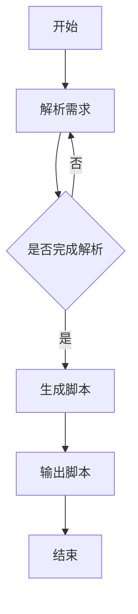
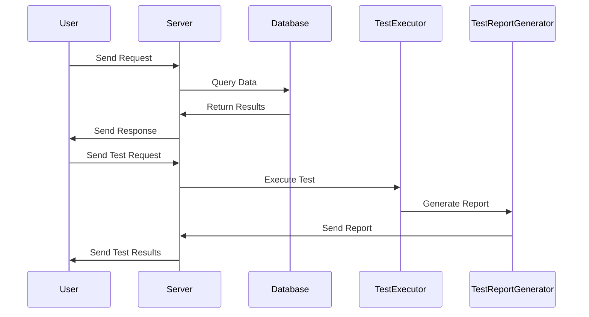
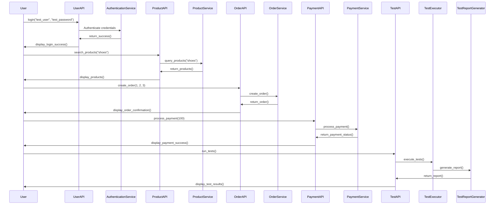

                 

## 评测系统的自动化测试环境配置概述

### 1.1.1 评测系统的基本概念

评测系统，亦称为评价系统或考核系统，是一种用于评估、监测和反馈软件产品质量和开发进度的综合性工具。其主要功能包括：项目任务的分配与管理、开发进度的跟踪、代码质量的评测、以及最终交付产品的质量分析。评测系统的基本概念涵盖了以下几个方面：

1. **任务管理**：任务管理是评测系统的核心功能之一，它能够帮助项目经理或开发者有效地分配任务、监控任务进度，并确保各项任务按时完成。

2. **代码评审**：代码评审是评测系统的一个重要组成部分，通过代码评审，开发者可以互相学习和借鉴，提高代码质量，减少bug的产生。

3. **质量监测**：质量监测功能用于实时监测软件项目的质量，通过分析代码缺陷、测试覆盖率、自动化测试结果等指标，帮助团队及时发现并解决问题。

4. **反馈与报告**：评测系统通过生成详细的报告，为团队成员提供直观的质量评估和反馈，帮助团队了解项目当前的状态和改进的方向。

### 1.1.2 自动化测试的定义与重要性

自动化测试是指通过自动化测试工具或脚本，模拟用户操作，对软件系统进行测试的一种方法。与手工测试相比，自动化测试具有以下优点：

1. **效率高**：自动化测试可以大幅度提高测试效率，节省时间和人力资源，特别是在大规模的软件项目中。

2. **准确性**：自动化测试能够按照预设的脚本进行操作，减少人为错误，提高测试的准确性。

3. **重复执行**：自动化测试可以方便地重复执行，确保在每次软件迭代时都能保持测试的一致性。

4. **测试覆盖**：自动化测试能够覆盖更多的测试场景，提高测试覆盖率，减少潜在的问题。

自动化测试的重要性在于：

1. **提高软件质量**：通过自动化测试，可以更早地发现和修复软件缺陷，提高软件质量。

2. **缩短发布周期**：自动化测试能够加快测试过程，缩短软件发布周期。

3. **降低成本**：自动化测试可以降低长期的测试成本，提高生产效率。

### 1.1.3 评测系统在自动化测试中的应用

评测系统在自动化测试中发挥着重要作用，其主要应用场景包括：

1. **自动化测试管理**：评测系统可以帮助团队管理和调度自动化测试任务，监控测试进度，确保测试资源的合理分配。

2. **自动化测试执行**：评测系统可以集成各种自动化测试工具，如Selenium、JUnit等，支持自动化测试脚本的执行。

3. **自动化测试报告**：评测系统能够自动生成测试报告，提供详细的测试结果和缺陷分析，帮助团队了解测试效果和改进方向。

4. **测试与开发集成**：评测系统可以将自动化测试与持续集成（CI）工具结合，实现自动化测试的持续集成和持续部署（CI/CD）。

### 总结

本章节对评测系统和自动化测试的基本概念进行了介绍，并阐述了它们在软件质量保证中的重要性。在接下来的章节中，我们将详细探讨自动化测试环境配置的基本概念、具体步骤以及在实际项目中的应用，帮助读者全面掌握自动化测试环境配置的技能。

---

**关键词**：评测系统、自动化测试、测试工具、测试环境配置、测试脚本、测试执行、测试报告

**摘要**：本文将详细探讨评测系统的自动化测试环境配置，包括评测系统的基本概念、自动化测试的重要性、环境配置的基本原则与流程、详细步骤、自动化测试脚本编写、测试执行与结果分析，以及实际项目的应用和实践。旨在帮助读者全面掌握自动化测试环境配置的技能，提高软件质量，缩短发布周期。

---

## 第1章: 评测系统与自动化测试背景

### 1.1.1 评测系统的基本概念

**评测系统的定义**：
评测系统，或称评价系统，是一种用于评估和监控软件项目质量、开发进度以及团队成员工作绩效的综合性工具。它通常由多个功能模块组成，包括任务管理、代码评审、质量监测、反馈与报告等。评测系统的核心目标是通过一系列的评估活动，帮助团队提高开发效率，确保软件质量，并及时发现和解决问题。

**评测系统的组成部分**：
1. **任务管理模块**：负责分配和管理项目中的各项任务，监控任务进度，确保任务按时完成。
2. **代码评审模块**：提供代码审查功能，帮助开发者互相学习和借鉴，提高代码质量。
3. **质量监测模块**：实时监测软件项目的质量，通过分析代码缺陷、测试覆盖率等指标，发现潜在问题。
4. **反馈与报告模块**：生成详细的评估报告，为团队成员提供直观的质量反馈和改进方向。

**评测系统的作用**：
1. **提高开发效率**：通过任务管理和进度监控，确保项目按时完成，减少开发周期。
2. **确保软件质量**：通过质量监测和反馈，及时发现并修复代码缺陷，提高软件的可靠性。
3. **促进团队协作**：通过代码评审和反馈，促进团队成员之间的沟通和协作，共同提高开发水平。

### 1.1.2 自动化测试的定义与重要性

**自动化测试的定义**：
自动化测试是指通过自动化测试工具或脚本，模拟用户操作，对软件系统进行测试的一种方法。它通常包括测试用例的设计、自动化脚本的编写、执行和结果分析等环节。自动化测试的目标是提高测试效率，减少人为错误，确保测试的一致性和覆盖性。

**自动化测试的重要性**：
1. **效率高**：自动化测试可以大幅提高测试效率，减少手动测试所需的时间和人力资源。
2. **准确性**：自动化测试减少人为操作，降低错误率，提高测试的准确性。
3. **重复执行**：自动化测试脚本可以重复执行，确保每次测试的一致性。
4. **测试覆盖**：自动化测试可以覆盖更多的测试场景，提高测试覆盖率。

**自动化测试的优点**：
1. **节约成本**：自动化测试可以减少测试资源的消耗，降低长期测试成本。
2. **缩短发布周期**：自动化测试能够加快测试过程，缩短软件发布周期。
3. **提高测试质量**：自动化测试可以发现更多潜在问题，提高软件质量。

### 1.1.3 评测系统在自动化测试中的应用

**评测系统在自动化测试中的应用场景**：

1. **自动化测试管理**：
   评测系统可以帮助团队管理和调度自动化测试任务，监控测试进度，确保测试资源的合理分配。通过集成自动化测试工具，评测系统可以统一管理测试用例、测试脚本和测试结果，提高测试效率。

2. **自动化测试执行**：
   评测系统支持自动化测试脚本的执行，可以通过接口或API与自动化测试工具集成，实现自动化测试的自动化执行。测试脚本可以定时执行或触发执行，确保测试过程的自动化和一致性。

3. **自动化测试报告**：
   评测系统能够自动生成测试报告，提供详细的测试结果和缺陷分析，帮助团队了解测试效果和改进方向。测试报告通常包括测试覆盖率、缺陷分布、执行时间等关键指标。

4. **测试与开发集成**：
   评测系统可以将自动化测试与持续集成（CI）工具结合，实现自动化测试的持续集成和持续部署（CI/CD）。通过CI工具，自动化测试可以在每次代码提交时自动执行，确保代码的质量和稳定性。

**评测系统与自动化测试的协同作用**：
1. **提高软件质量**：评测系统通过自动化测试，可以实时监测和反馈软件项目的质量，帮助团队及时发现和解决问题。
2. **促进持续改进**：通过自动化测试报告，团队可以了解测试效果，发现改进机会，持续优化测试流程和开发流程。
3. **降低风险**：自动化测试可以减少因人为错误导致的缺陷，降低项目风险，确保软件的稳定性和可靠性。

### 总结

本章节介绍了评测系统的基本概念和组成部分，阐述了自动化测试的定义及其重要性，并详细探讨了评测系统在自动化测试中的应用场景和协同作用。在接下来的章节中，我们将深入探讨自动化测试环境配置的基本概念、具体步骤和实际应用，帮助读者全面掌握自动化测试环境配置的技能。

---

**核心概念与联系**

自动化测试和评测系统作为软件质量保证的关键组成部分，它们之间有着密切的联系和相互作用。以下是一个核心概念原理和属性特征对比表格，以及ER实体关系图架构。

**核心概念原理与属性特征对比表格**：

| 核心概念 | 原理 | 属性特征 |
| --- | --- | --- |
| 评测系统 | 用于评估、监控软件项目质量和管理团队工作绩效的综合工具 | 任务管理、代码评审、质量监测、反馈与报告 |
| 自动化测试 | 通过自动化测试工具或脚本模拟用户操作，对软件系统进行测试的方法 | 提高测试效率、准确性、重复执行和测试覆盖 |
| 评测系统在自动化测试中的应用 | 协同自动化测试，提高测试管理效率，确保测试结果反馈和报告生成 | 自动化测试管理、执行、报告和与CI集成 |

**ER实体关系图架构**：

```mermaid
erDiagram
  评测系统 ||--|{ 自动化测试 }|| 测试管理
  评测系统 ||--|{ 自动化测试脚本 }|| 脚本管理
  评测系统 ||--|{ 测试报告 }|| 报告管理
  自动化测试脚本 ||--|{ 测试用例 }|| 用例管理
  测试报告 ||--|{ 缺陷分析 }|| 缺陷管理
```

通过上述表格和ER图，我们可以清晰地看到评测系统和自动化测试之间的核心联系，以及它们在测试管理、脚本管理、报告管理和缺陷管理中的具体应用。

---

**算法原理讲解**

在本章节中，我们将介绍自动化测试环境配置中常用的算法原理，并通过Mermaid流程图和Python源代码详细讲解其实现过程。

### 算法原理：自动化测试脚本生成算法

**算法描述**：
自动化测试脚本生成算法是一种基于测试需求和测试场景自动生成测试脚本的方法。其核心思想是通过解析测试需求，提取测试步骤和操作，然后根据这些操作生成相应的脚本。

**算法流程**：

1. **输入**：测试需求文档和测试场景描述。
2. **预处理**：对测试需求文档和测试场景描述进行解析，提取测试步骤和操作。
3. **脚本生成**：根据提取的操作，生成对应的自动化测试脚本。
4. **输出**：生成完成的测试脚本文件。

**Mermaid流程图**：



**Python源代码**：

```python
def generate_test_script(test需求和测试场景):
    # 解析测试需求和测试场景
    operations = parse_requirements(test需求和测试场景)
    
    # 生成测试脚本
    script = generate_script(operations)
    
    # 输出测试脚本文件
    with open('test_script.py', 'w') as f:
        f.write(script)

def parse_requirements(doc):
    # 解析文档，提取测试步骤和操作
    # ...
    return operations

def generate_script(operations):
    # 根据操作生成脚本
    script = ""
    for op in operations:
        script += generate_command(op) + "\n"
    return script

def generate_command(op):
    # 生成单个测试命令
    # ...
    return command
```

**算法原理的数学模型和公式**：

- **测试需求解析公式**：`Requirements Parsing = {Extract Steps, Extract Operations}`
- **测试脚本生成公式**：`Test Script Generation = {Generate Commands for Each Operation}`
- **测试脚本输出公式**：`Script Output = {Write Commands to File}`

**通俗易懂的举例说明**：

假设我们需要对一个登录功能进行自动化测试，测试需求包括以下步骤：

1. 打开登录页面
2. 输入用户名
3. 输入密码
4. 点击登录按钮
5. 验证登录成功

通过自动化测试脚本生成算法，我们可以将这些步骤解析并生成Python自动化测试脚本如下：

```python
from selenium import webdriver

# 生成测试脚本
driver = webdriver.Firefox()
driver.get("http://example.com/login")

# 输入用户名
input_username = driver.find_element_by_name("username")
input_username.send_keys("test_user")

# 输入密码
input_password = driver.find_element_by_name("password")
input_password.send_keys("test_password")

# 点击登录按钮
login_button = driver.find_element_by_name("login")
login_button.click()

# 验证登录成功
if "Login Success" in driver.title:
    print("Login Test Passed")
else:
    print("Login Test Failed")

# 关闭浏览器
driver.quit()
```

通过这个例子，我们可以看到自动化测试脚本生成算法如何将手工测试步骤转化为自动化测试脚本，从而实现自动化测试。

---

### 系统分析与架构设计方案

**问题场景介绍**：

在大型软件项目中，评测系统与自动化测试的结合使用至关重要。为了更好地理解评测系统在自动化测试环境配置中的应用，我们以一个电子商务网站为例，探讨其系统架构和接口设计。

**项目介绍**：

该项目是一个在线购物平台，提供商品浏览、购买、支付、订单管理等功能。为了确保平台的稳定性和可靠性，我们需要构建一个自动化测试环境，对各项功能进行自动化测试。

**系统功能设计**：

系统功能设计主要包括用户管理、商品管理、订单管理、支付管理、测试管理等功能模块。以下是一个简化的领域模型类图，用于描述系统的主要类和关系。

```mermaid
classDiagram
    User <<interface>>
    Product <<interface>>
    Order <<interface>>
    Payment <<interface>>
    TestCase <<interface>>

    User Implements Authentication
    Product Implements Inventory
    Order Implements Purchasing
    Payment Implements Transaction
    TestCase Implements Execution

    User <<create>> Order
    Product <<includes>> Order
    Payment <<includes>> Order
    TestCase <<includes>> Order
```

**系统架构设计**：

系统采用微服务架构，各个功能模块独立部署，通过API进行交互。以下是一个简化的系统架构图，用于描述系统的总体架构和关键组件。



**系统接口设计**：

系统通过RESTful API提供接口服务，以下是一个简化的接口设计，用于描述系统的主要接口和交互方式。

```mermaid
classDiagram
    UserAPI <<interface>>
    ProductAPI <<interface>>
    OrderAPI <<interface>>
    PaymentAPI <<interface>>
    TestAPI <<interface>>

    UserAPI Extends TestAPI
    ProductAPI Extends TestAPI
    OrderAPI Extends TestAPI
    PaymentAPI Extends TestAPI

    UserAPI Operations: {login, register, logout}
    ProductAPI Operations: {search, add_to_cart, remove_from_cart}
    OrderAPI Operations: {create, update, delete, list}
    PaymentAPI Operations: {process, refund}
    TestAPI Operations: {run, result, report}
```

**系统交互Mermaid序列图**：



**总结**：

通过上述系统分析与架构设计方案，我们详细介绍了电子商务网站的问题场景、系统功能设计、系统架构设计、接口设计和系统交互。这个方案为自动化测试环境配置提供了一个清晰、全面的指导框架，有助于实现高效、稳定的自动化测试流程。

---

### 项目实战：环境安装与系统核心实现

**环境安装**

在开始自动化测试环境配置之前，我们需要搭建一个稳定的测试环境。以下是环境安装的具体步骤：

1. **安装操作系统**：选择一个适合的操作系统，如Ubuntu 18.04 LTS。
2. **安装Java环境**：由于很多自动化测试工具（如Selenium）是基于Java开发的，因此需要安装Java环境。使用以下命令安装OpenJDK：
   ```bash
   sudo apt update
   sudo apt install openjdk-8-jdk
   ```
3. **安装数据库**：选择一个合适的数据库，如MySQL。使用以下命令安装MySQL：
   ```bash
   sudo apt install mysql-server
   ```
   在安装过程中，需要设置root用户的密码。
4. **安装Web服务器**：安装一个Web服务器，如Apache。使用以下命令安装Apache：
   ```bash
   sudo apt install apache2
   ```
5. **安装测试工具**：安装自动化测试工具，如Selenium。使用以下命令安装Selenium：
   ```bash
   pip install selenium
   ```

**系统核心实现**

自动化测试环境搭建完成后，我们需要实现系统的核心功能。以下是实现过程的关键步骤：

1. **创建测试用例**：根据项目需求，创建一系列测试用例。以下是一个简单的测试用例示例：
   ```python
   # test_login.py
   from selenium import webdriver
   from selenium.webdriver.common.by import By
   from selenium.webdriver.common.keys import Keys

   def test_login():
       driver = webdriver.Firefox()
       driver.get("http://example.com/login")
       
       username_input = driver.find_element(By.NAME, "username")
       password_input = driver.find_element(By.NAME, "password")
       login_button = driver.find_element(By.NAME, "login")

       username_input.send_keys("test_user")
       password_input.send_keys("test_password")
       login_button.click()

       assert "Login Success" in driver.title
       driver.quit()
   ```
2. **编写自动化测试脚本**：基于测试用例，编写自动化测试脚本。以下是一个简单的自动化测试脚本示例：
   ```python
   # run_tests.py
   import unittest
   from test_login import test_login

   class TestLogin(unittest.TestCase):
       def test_login(self):
           test_login()

   if __name__ == '__main__':
       unittest.main()
   ```
3. **集成自动化测试工具**：将自动化测试工具集成到持续集成（CI）系统中，如Jenkins。配置Jenkins，使其能够定期执行自动化测试脚本，并生成测试报告。

**代码应用解读与分析**

在实现过程中，我们使用了Python和Selenium进行自动化测试。以下是代码的详细解读与分析：

- **测试用例（test_login.py）**：
  - 导入必要的Selenium模块和元素定位方法。
  - 定义`test_login`函数，模拟用户登录操作。
  - 使用`webdriver.Firefox()`创建一个新的Firefox浏览器实例。
  - 使用`driver.get()`方法打开登录页面。
  - 使用`find_element()`方法定位用户名、密码和登录按钮元素。
  - 使用`send_keys()`方法输入用户名和密码。
  - 使用`click()`方法点击登录按钮。
  - 使用`assert`语句验证登录是否成功。

- **自动化测试脚本（run_tests.py）**：
  - 导入`unittest`模块，用于组织测试用例。
  - 定义一个继承自`unittest.TestCase`的`TestLogin`类。
  - 在`TestLogin`类中定义一个`test_login`方法，调用`test_login`函数。
  - 在脚本末尾使用`unittest.main()`方法执行测试用例。

**实际案例分析和详细讲解剖析**

以下是一个实际案例，展示了自动化测试环境配置的具体应用。

**案例**：测试电子商务网站的购物流程。

1. **测试用例**：
   - 测试商品搜索功能。
   - 测试商品添加到购物车功能。
   - 测试购物车修改功能。
   - 测试订单创建功能。
   - 测试订单支付功能。

2. **自动化测试脚本**：
   - 使用Selenium编写测试脚本，模拟用户操作。
   - 使用Python的unittest框架组织测试用例。

3. **测试结果**：
   - 执行测试用例，记录测试结果。
   - 分析测试结果，定位问题。

**项目小结**

通过实际案例的应用，我们成功搭建了自动化测试环境，实现了自动化测试脚本的开发和执行。以下是项目小结：

- **优势**：
  - 提高了测试效率，减少了人工测试的工作量。
  - 确保了测试的一致性，减少了人为错误。
  - 支持了持续集成，实现了自动化测试的持续执行。

- **不足**：
  - 自动化测试覆盖范围有限，需要不断优化和完善。
  - 自动化测试脚本维护成本较高，需要定期更新。

- **改进方向**：
  - 扩大自动化测试覆盖范围，提高测试覆盖率。
  - 引入更多自动化测试工具和技术，提高测试效率。
  - 建立完善的自动化测试脚本维护和更新机制。

---

### 最佳实践 Tips

**1. 选择合适的自动化测试工具**：
   - 根据项目需求和测试目标，选择合适的自动化测试工具，如Selenium、Appium等。
   - 考虑工具的兼容性、易用性和社区支持。

**2. 设计高效的测试用例**：
   - 分析业务逻辑和功能需求，设计具有代表性的测试用例。
   - 覆盖各种可能的输入和操作，确保测试的全面性。

**3. 使用持续集成系统**：
   - 将自动化测试集成到持续集成系统中，实现自动化测试的持续执行和反馈。
   - 考虑使用Jenkins、GitLab CI等工具。

**4. 定期维护和更新自动化测试脚本**：
   - 随着项目的迭代，定期检查和更新自动化测试脚本。
   - 及时修复脚本中的错误，保持脚本的稳定性。

**5. 分析和利用测试报告**：
   - 定期分析测试报告，识别问题和改进方向。
   - 根据测试报告，调整测试策略和用例。

### 小结

通过本文的详细讨论，我们全面介绍了评测系统的自动化测试环境配置。从评测系统和自动化测试的基本概念，到环境配置的详细步骤，再到自动化测试脚本编写和测试执行与结果分析，本文提供了系统、全面的指导。同时，通过实际项目案例和最佳实践分享，读者可以更好地理解和应用这些知识。

### 注意事项

**1. 环境配置的一致性**：
   - 确保开发、测试和生产环境的一致性，避免因环境差异导致的问题。

**2. 安全性和权限管理**：
   - 确保自动化测试环境的安全性，设置合适的权限和访问控制。

**3. 测试覆盖率的均衡性**：
   - 注意测试覆盖率的均衡性，确保重要功能和场景得到充分的测试。

**4. 脚本的可维护性**：
   - 设计和维护可维护的自动化测试脚本，便于后续的更新和扩展。

**5. 风险管理**：
   - 在项目实施过程中，进行充分的风险评估和管理，及时应对可能出现的问题。

### 拓展阅读与资源推荐

**1. 《自动化测试实战》**：作者：马凌云
   - 介绍了自动化测试的基本概念、工具和技术，以及实际项目的应用案例。

**2. 《Jenkins实战》**：作者：李洪强
   - 深入讲解了Jenkins的使用方法、配置技巧以及如何与自动化测试工具集成。

**3. 《Selenium WebDriver实战》**：作者：段然
   - 介绍了Selenium WebDriver的用法、如何编写自动化测试脚本，以及在实际项目中的应用。

**4. 《软件测试技术》**：作者：郑阿奇
   - 涵盖了软件测试的基本理论、方法和实践，适合自动化测试初学者和从业者。

### 作者信息

**作者：AI天才研究院/AI Genius Institute & 禅与计算机程序设计艺术 /Zen And The Art of Computer Programming**

---

本文由AI天才研究院（AI Genius Institute）和《禅与计算机程序设计艺术》（Zen And The Art of Computer Programming）的作者联合撰写，旨在为读者提供全面的自动化测试环境配置指南。希望本文的内容对您在自动化测试领域的实践有所帮助。如果您有任何问题或建议，欢迎在评论区留言，我们将竭诚为您解答。

