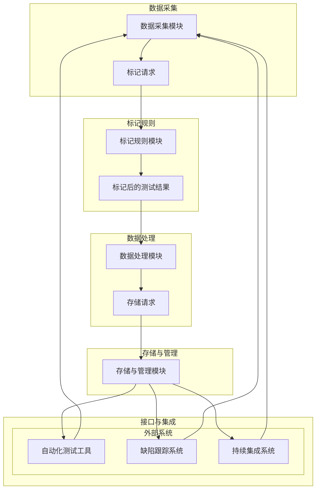

                 

### 引言与背景

在软件工程领域，自动化测试已经成为提高软件质量和开发效率的重要手段。自动化测试不仅能够减少人为错误，还能在大规模代码库中快速发现潜在问题，从而确保软件在各个开发阶段都能保持高质量。然而，随着测试过程的复杂性和规模的增长，自动化测试结果的处理也变得日益重要。自动化测试结果的分类与标记是确保测试过程有效性的关键环节。

**自动化测试在软件质量保证中的作用**

软件质量保证（Software Quality Assurance, SQA）是软件开发过程中的一个重要环节，旨在确保软件产品在发布时能够满足预期质量标准。自动化测试是SQA的重要组成部分，它通过预定的测试脚本自动执行，可以大幅度提高测试效率。自动化测试不仅可以节省人力成本，还能提高测试覆盖率和测试精度，使得软件开发团队能够更早、更频繁地发现并修复缺陷。

**自动化测试的挑战与机遇**

尽管自动化测试带来了诸多优势，但它也面临着一系列挑战。自动化测试的复杂度随着项目规模的增长而增加，测试脚本的编写和维护需要大量的时间和专业知识。此外，自动化测试结果的准确性和可靠性也是软件开发团队关注的重点。自动化测试结果的处理过程包括数据的收集、整理、分类和标记，这一过程的质量直接影响到后续的缺陷修复和项目进度。

随着人工智能和机器学习技术的发展，自动化测试结果的处理迎来了新的机遇。通过利用先进的数据分析和机器学习算法，自动化测试结果可以更加精准地进行分类和标记，从而提高测试的效率和准确性。例如，基于机器学习的测试结果分类方法能够自动识别异常结果，并提供更可靠的测试数据。

**自动化测试结果分类与标记的重要性**

自动化测试结果的分类与标记是确保测试过程有效性的关键环节。合理的分类和标记能够帮助开发团队快速定位问题，理解测试结果，并采取相应的措施。以下是自动化测试结果分类与标记的一些重要方面：

1. **问题定位**：通过将测试结果分类，开发团队可以快速识别出哪些测试用例未能通过，从而集中精力修复这些关键问题。
2. **测试覆盖分析**：分类后的测试结果可以用于分析测试覆盖率，确保软件的各个功能点都得到了充分的测试。
3. **效率提升**：合理的测试结果标记可以简化测试报告的生成过程，减少人工工作量，提高测试效率。
4. **决策支持**：分类和标记后的测试结果可以为项目管理提供重要的决策支持，帮助团队优化资源分配和项目进度。

本节介绍了自动化测试在软件质量保证中的作用、自动化测试的挑战与机遇，以及自动化测试结果分类与标记的重要性。接下来，我们将深入探讨自动化测试结果的多样性、处理需求以及现有方法的局限性，为后续章节的内容做好铺垫。

## 问题背景

### 自动化测试结果的多样性

自动化测试结果的多样性是自动化测试过程中一个不可忽视的问题。测试结果可以包括多种类型的信息，如通过、失败、警告、错误等，每种类型的结果都可能包含不同的细节和上下文信息。例如，一个测试用例可能由于代码错误而失败，也可能由于环境配置问题而出现警告。这种多样性使得测试结果的整理和分析变得更加复杂。

**测试结果类型示例**

- **通过**：测试用例成功执行，预期结果与实际结果一致。
- **失败**：测试用例未能通过，实际结果与预期结果不符。
- **警告**：测试用例执行过程中出现了某些非致命问题，但不影响功能的正常运行。
- **错误**：测试用例在执行过程中出现了意外的错误。

### 自动化测试结果处理的需求

为了有效地利用自动化测试结果，需要对其进行及时和准确的处理。这种处理包括将测试结果分类、标记、存储和报告等步骤。以下是自动化测试结果处理的一些关键需求：

1. **分类**：将测试结果按照特定标准进行分类，有助于快速识别和定位问题。
2. **标记**：为测试结果添加标签或标记，方便后续查询和分析。
3. **存储**：将测试结果存储在数据库或其他存储介质中，便于长期管理和查询。
4. **报告**：生成详细的测试报告，帮助开发团队和项目管理者了解测试进展和质量。

**自动化测试结果处理需求示例**

- **问题定位**：通过分类和标记，可以快速识别出失败的测试用例，从而集中精力修复问题。
- **测试覆盖率分析**：通过存储和报告，可以分析测试用例的覆盖率，确保软件的各个功能点都得到了充分的测试。
- **资源优化**：通过分析和报告，可以优化测试资源分配，提高测试效率。

### 现有方法的局限性

现有的自动化测试结果处理方法存在一些局限性，这些局限性限制了测试过程的效率和准确性。以下是几种常见的方法及其局限性：

1. **基于规则的分类方法**：这种方法依赖于预定义的规则对测试结果进行分类。优点是简单直观，但缺点是规则的定义和优化过程繁琐，且难以处理复杂的测试结果。

2. **人工分类**：虽然这种方法可以处理复杂的测试结果，但效率低下，且容易受到主观因素的影响。

3. **基于统计学的分类方法**：这种方法通过统计方法对测试结果进行分析，但要求大量的数据和复杂的算法。此外，统计模型的选择和训练过程也较为繁琐。

4. **基于机器学习的分类方法**：这种方法利用机器学习算法自动识别和分类测试结果，具有较高的准确性和灵活性。然而，训练数据的需求和高计算成本是主要挑战。

通过分析自动化测试结果的多样性、处理需求以及现有方法的局限性，我们可以更好地理解自动化测试结果分类与标记的重要性。在接下来的章节中，我们将深入探讨自动化测试结果分类的方法，包括基于规则、统计学和机器学习的方法，以及它们的实现和应用。

## 本书结构安排

### 各章节内容概述

本书分为五个主要部分，每个部分涵盖了自动化测试结果分类与标记的关键方面。以下是各章节的内容概述：

- **第一部分：引言与背景**：介绍自动化测试在软件质量保证中的作用，自动化测试的挑战与机遇，以及自动化测试结果分类与标记的重要性。
- **第二部分：自动化测试基础**：详细讲解自动化测试的概述、自动化测试工具、测试用例设计以及测试执行与结果记录。
- **第三部分：测试结果分类方法**：探讨基于规则、统计学和机器学习的测试结果分类方法，并分析每种方法的优缺点。
- **第四部分：测试结果标记系统设计**：介绍测试结果标记系统的架构设计、标记规则的制定以及标记系统的实现与优化。
- **第五部分：自动化测试结果分类与标记的实践应用**：通过具体实践案例展示自动化测试结果分类与标记的实际应用，包括环境安装、系统实现、代码解读、案例分析和项目小结。

### 读者对象与预期收获

本书旨在为软件工程从业者、测试工程师以及相关领域的研究人员提供系统化的自动化测试结果分类与标记知识。以下是本书的读者对象和预期收获：

- **读者对象**：本书适合以下读者群体：
  - 软件开发团队负责人和项目经理，了解自动化测试及其在软件质量保证中的作用。
  - 测试工程师，掌握自动化测试结果分类与标记的方法和实践。
  - 数据科学家和人工智能工程师，探索机器学习在自动化测试中的应用。
  - 研究人员和学生，对自动化测试领域有深入研究的需求。

- **预期收获**：
  - 系统化理解自动化测试的流程和工具。
  - 掌握自动化测试结果的分类与标记方法。
  - 了解不同分类方法的优缺点和应用场景。
  - 学习如何设计并优化测试结果标记系统。
  - 获取实际自动化测试结果分类与标记的实践经验。

通过阅读本书，读者可以全面了解自动化测试结果分类与标记的理论和实践，提高自动化测试的效率和准确性，为软件质量保障和项目管理提供有力支持。

### 定义与概念

在深入探讨自动化测试结果分类与标记之前，我们需要明确一些核心概念和术语。这些定义不仅有助于读者理解后续章节的内容，也为我们的讨论奠定了坚实的基础。

#### 自动化测试

自动化测试（Automated Testing）是指使用预定义的测试脚本或工具对软件进行测试的过程。与手工测试相比，自动化测试具有以下特点：

- **高效性**：自动化测试可以快速执行大量测试用例，提高测试效率。
- **重复性**：自动化测试脚本可以反复执行，确保测试的一致性和稳定性。
- **覆盖率**：自动化测试可以覆盖更多的测试场景，提高测试覆盖率。

**自动化测试的类型**：

- **功能测试**：测试软件的功能是否按照预期运行。
- **性能测试**：评估软件的性能，如响应时间、并发处理能力等。
- **安全测试**：检测软件的安全性，如漏洞、攻击等。
- **回归测试**：确保修改代码后，原有的功能仍然正常。

#### 测试结果分类

测试结果分类（Test Result Classification）是将测试执行后的结果按照某种标准进行分类的过程。分类的目的是为了快速识别问题、分析测试覆盖率和优化测试过程。

**常见的测试结果类型**：

- **通过（Pass）**：测试用例成功执行，预期结果与实际结果一致。
- **失败（Fail）**：测试用例未能通过，实际结果与预期结果不符。
- **警告（Warning）**：测试用例执行过程中出现了某些非致命问题，但不影响功能的正常运行。
- **错误（Error）**：测试用例在执行过程中出现了意外的错误。

#### 标记系统

标记系统（Labeling System）是对测试结果进行标记和标签的系统。标记系统通常包括标记的定义、分配和管理机制。

**标记系统的功能**：

- **问题标识**：为测试结果分配特定的标记，便于问题定位和分类。
- **数据分析**：通过标记系统，可以方便地进行测试结果的数据分析和报告生成。
- **过程优化**：标记系统有助于识别重复性问题，优化测试流程和资源分配。

**标记系统的实现方法**：

- **基于规则的标记**：通过预定义的规则自动分配标记。
- **手动标记**：由测试人员根据测试结果手动分配标记。
- **机器学习标记**：利用机器学习算法自动识别和分配标记。

在本章中，我们介绍了自动化测试、测试结果分类和标记系统的定义与概念。这些核心概念是理解后续章节内容的基础，也是我们讨论自动化测试结果分类与标记方法的前提。在接下来的章节中，我们将深入探讨自动化测试的基础知识、分类方法以及标记系统的设计与应用。

## 本章小结

在本章中，我们介绍了自动化测试在软件质量保证中的作用，探讨了自动化测试结果的多样性及其处理需求，分析了现有方法的局限性。通过明确自动化测试、测试结果分类和标记系统的核心概念，我们为后续章节的讨论奠定了基础。下一部分将深入探讨自动化测试的基础，包括其概述、工具、测试用例设计和测试执行与结果记录，帮助读者更全面地理解自动化测试的全过程。

## 第二部分：自动化测试基础

### 2.1 自动化测试概述

自动化测试是现代软件工程中不可或缺的一部分，它通过预定义的测试脚本或工具对软件进行自动化的测试。与手工测试相比，自动化测试具有高效性、重复性和覆盖率高等多个显著优势。在这一章节中，我们将详细探讨自动化测试的定义、类型及其优势与挑战。

#### 自动化测试的定义

自动化测试（Automated Testing）是指利用专门的工具或脚本，对软件进行自动化的测试过程。自动化测试的核心思想是减少人工干预，通过脚本执行重复的测试任务，从而提高测试效率、降低成本，并确保测试的一致性和稳定性。

**自动化测试的核心原则**：

- **标准化**：自动化测试脚本按照标准流程执行，确保每次测试结果的一致性。
- **可重复性**：自动化测试脚本可以反复执行，不受人工操作的影响。
- **自动化**：测试过程的自动化减少了对人工的依赖，提高了工作效率。

#### 自动化测试的类型

根据测试的目标和应用场景，自动化测试可以分为多种类型，包括但不限于以下几种：

- **功能测试**：验证软件的功能是否符合设计规格，是最常见的自动化测试类型。
- **性能测试**：评估软件的性能，如响应时间、并发处理能力等，以确保系统在高负载下仍能正常运行。
- **安全测试**：检测软件的安全性，包括漏洞扫描、攻击测试等，以保障系统的安全。
- **回归测试**：在代码修改后重新执行原有的测试用例，确保修改不会引入新的缺陷。

#### 自动化测试的优势

自动化测试在多个方面带来了显著的优势：

- **提高测试效率**：自动化测试可以快速执行大量测试用例，大大缩短测试周期。
- **减少人工错误**：自动化测试减少了手工测试中的人为因素，降低了错误率。
- **提高测试覆盖率**：自动化测试可以覆盖更多的测试场景，提高测试的全面性和覆盖率。
- **成本效益**：自动化测试降低了长期的人工成本，提高了项目的整体经济效益。

#### 自动化测试的挑战

尽管自动化测试具有诸多优势，但在实施过程中也面临着一系列挑战：

- **测试脚本的编写和维护**：编写和维护自动化测试脚本需要大量的时间和专业知识，且测试脚本的维护成本较高。
- **测试数据的处理**：自动化测试需要处理大量的测试数据，包括测试结果、日志文件等，数据的管理和分析较为复杂。
- **测试环境的配置**：自动化测试要求稳定的测试环境，配置和部署测试环境是一个复杂的过程。
- **测试覆盖率的优化**：如何确保自动化测试覆盖到所有的关键功能和异常场景是一个持续的挑战。

通过详细探讨自动化测试的定义、类型及其优势与挑战，我们可以更好地理解自动化测试在软件质量保证中的重要性。在接下来的章节中，我们将继续探讨自动化测试工具、测试用例设计和测试执行与结果记录，进一步深入自动化测试的基础知识。

### 2.2 自动化测试工具

在自动化测试的实践中，选择合适的工具是确保测试过程顺利进行的关键。自动化测试工具不仅能够提高测试效率，还能减少人为错误，提高测试的覆盖率和准确性。以下是几种常用的自动化测试工具及其特点、优势和局限性。

#### 自动化测试工具的特点

- **脚本语言支持**：大多数自动化测试工具支持常用的脚本语言，如Python、Java、C#等，使得测试脚本的开发和执行更加灵活。
- **跨平台兼容性**：自动化测试工具通常具备跨平台的兼容性，可以在不同的操作系统上运行，确保测试过程的连贯性。
- **可扩展性**：自动化测试工具提供了丰富的扩展功能，可以自定义脚本，以满足特定的测试需求。
- **集成功能**：许多自动化测试工具具备与其他开发工具和测试管理工具的集成能力，如持续集成（CI）系统、缺陷跟踪系统等。

#### 常用自动化测试工具介绍

1. **Selenium**
   - **特点**：Selenium是一个开源的自动化测试工具，支持多种编程语言，如Python、Java、C#等，适用于Web应用的自动化测试。
   - **优势**：支持多种浏览器（如Chrome、Firefox、Safari等）和操作系统，具备高度的灵活性和可扩展性。
   - **局限性**：学习曲线较陡峭，编写和维护测试脚本需要较高的编程技能。

2. **Appium**
   - **特点**：Appium是一个开源的自动化测试工具，用于移动应用的自动化测试，支持iOS和Android平台。
   - **优势**：跨平台兼容性好，支持原生应用、混合应用和Web应用，易于集成到CI/CD流程中。
   - **局限性**：在某些复杂场景下，性能和稳定性可能存在问题，调试过程较为繁琐。

3. **JUnit**
   - **特点**：JUnit是一个开源的测试框架，主要用于Java应用程序的单元测试。
   - **优势**：简单易用，具备丰富的测试功能，与Eclipse等集成开发环境（IDE）兼容性好。
   - **局限性**：主要适用于单元测试，对于功能测试和性能测试的支持有限。

4. **TestNG**
   - **特点**：TestNG是一个开源的测试框架，用于各种测试场景，包括单元测试、集成测试和端到端测试。
   - **优势**：功能强大，支持并行测试和参数化测试，能够处理复杂的测试用例。
   - **局限性**：相较于JUnit，学习曲线较陡，配置和调试过程较为复杂。

#### 自动化测试工具的选择

选择合适的自动化测试工具需要考虑以下因素：

- **项目需求**：根据项目的具体需求，选择适合的测试工具。例如，如果是Web应用测试，可以选择Selenium；如果是移动应用测试，可以选择Appium。
- **团队技能**：选择团队熟悉并能有效利用的测试工具，降低学习成本和开发难度。
- **工具兼容性**：确保测试工具与开发环境和测试环境的兼容性，避免因兼容性问题导致测试失败。
- **扩展性和稳定性**：选择具备良好扩展性和稳定性的测试工具，以确保长期稳定运行和高效的测试过程。

通过以上对常用自动化测试工具的介绍和选择建议，我们可以更好地理解如何选择适合项目的自动化测试工具，从而提高测试效率和质量。在接下来的章节中，我们将继续探讨测试用例设计、测试执行与结果记录等自动化测试的关键环节。

### 测试用例设计

测试用例设计是自动化测试过程中的核心环节，它直接影响测试的覆盖率和准确性。一个优秀的测试用例设计不仅能够有效覆盖软件的功能和性能，还能提高测试效率，减少不必要的测试时间和资源消耗。以下是关于测试用例设计的基本概念、方法以及优化策略。

#### 测试用例设计的基本概念

- **测试用例（Test Case）**：测试用例是关于软件功能或特性的一个测试实例，它定义了测试的目标、输入数据、预期结果以及测试步骤。
- **测试用例的组成部分**：
  - **测试ID**：唯一的标识符，用于区分不同的测试用例。
  - **测试目的**：描述测试用例的测试目标。
  - **测试步骤**：详细列出执行测试的步骤。
  - **输入数据**：测试过程中需要输入的数据。
  - **预期结果**：测试执行后预期的结果。
  - **实际结果**：测试执行后的实际结果。
  - **测试结论**：测试用例是否通过。

#### 测试用例设计方法

1. **黑盒测试（Black Box Testing）**
   - **定义**：黑盒测试关注软件的功能和行为，而不关心内部实现细节。
   - **方法**：
     - 等价类划分（Equivalence Partitioning）：将输入数据划分为多个等价类，每个等价类中的输入数据被认为具有相同的效果。
     - 边界值分析（Boundary Value Analysis）：分析输入数据的边界值，确保测试覆盖边界情况。
     - 决策表（Decision Table）：用表格形式定义测试条件、操作和结果，适合复杂逻辑测试。

2. **白盒测试（White Box Testing）**
   - **定义**：白盒测试关注软件的内部结构和实现细节，基于代码逻辑进行测试。
   - **方法**：
     - 代码覆盖率（Code Coverage）：评估测试用例对代码的覆盖程度，常见的覆盖标准有语句覆盖、分支覆盖、路径覆盖等。
     - 控制流测试（Control Flow Testing）：测试程序中的控制流结构，确保每个分支都被执行。
     - 数据流测试（Data Flow Testing）：测试程序中的数据流，确保变量的引用和赋值正确。

3. **灰盒测试（Gray Box Testing）**
   - **定义**：灰盒测试结合了黑盒测试和白盒测试的特点，测试人员拥有部分内部信息的测试方法。
   - **方法**：通常结合黑盒测试和白盒测试的方法，根据具体情况进行设计。

#### 测试用例优化策略

1. **减少冗余测试用例**
   - **重复性测试用例的识别与删除**：通过工具或人工方法，识别并删除重复的测试用例，避免资源浪费。
   - **合并相关用例**：将具有相似目的和输入条件的测试用例合并，减少用例数量。

2. **提高测试用例的覆盖率**
   - **代码覆盖率分析**：使用代码覆盖率工具分析测试用例的覆盖率，确保测试全面覆盖代码的各个部分。
   - **添加边界值测试用例**：增加对输入数据的边界值进行测试，确保边界情况得到充分验证。

3. **减少测试用例的执行时间**
   - **并行执行测试用例**：将独立的测试用例并行执行，提高测试效率。
   - **优化测试脚本**：优化测试脚本，减少不必要的步骤和等待时间，提高执行速度。

4. **维护测试用例**
   - **定期评审**：定期评审测试用例，更新和优化不完善的测试用例。
   - **版本控制**：使用版本控制工具管理测试用例，确保测试用例的一致性和可追溯性。

通过上述测试用例设计方法和优化策略，我们可以设计出更高效、更全面的测试用例，提高自动化测试的效率和准确性。在接下来的章节中，我们将继续探讨测试执行与结果记录，确保自动化测试过程的顺利进行。

### 测试执行与结果记录

测试执行与结果记录是自动化测试过程中的关键环节，它不仅决定了测试的有效性，还影响到测试结果的分析和项目决策。以下是关于测试执行、结果记录和评估的具体步骤和方法。

#### 测试执行

1. **测试环境的准备**：
   - **硬件环境**：确保测试环境的硬件配置满足测试需求，包括服务器、网络设备、存储设备等。
   - **软件环境**：安装和配置必要的操作系统、数据库、中间件、开发工具等软件，确保测试环境的稳定性。
   - **测试工具的安装**：安装并配置自动化测试工具，如Selenium、Appium等，确保测试脚本能够正常运行。

2. **测试脚本的执行**：
   - **执行前准备**：根据测试计划和测试用例，准备好测试脚本和测试数据，并进行必要的预检查。
   - **脚本执行**：运行测试脚本，自动化执行测试用例，记录测试过程中的所有关键步骤和日志信息。
   - **异常处理**：在测试执行过程中，遇到异常情况时，及时记录并处理，确保测试过程的连续性。

3. **测试结果的输出**：
   - **测试报告**：生成详细的测试报告，包括测试结果、日志信息、错误日志等，便于后续分析和决策。
   - **测试数据存储**：将测试结果存储在数据库或其他存储介质中，确保数据的长期保存和可追溯性。

#### 结果记录

1. **结果记录的形式**：
   - **日志文件**：详细记录测试执行过程中的操作步骤、异常信息和系统响应。
   - **测试数据库**：将测试结果存储在测试数据库中，包括测试ID、测试步骤、输入数据、预期结果和实际结果等。
   - **测试报告**：生成结构化的测试报告，包括测试覆盖率、缺陷统计、测试进度等。

2. **结果记录的内容**：
   - **测试执行情况**：记录每个测试用例的执行状态（通过、失败、警告等）。
   - **异常情况**：记录测试过程中出现的异常情况，包括错误信息、日志记录、截图等。
   - **测试结果分析**：根据测试结果，分析缺陷的类型、原因和影响范围。

#### 测试结果评估

1. **缺陷分类**：
   - **功能缺陷**：软件功能不符合设计要求。
   - **性能缺陷**：软件在性能方面未能达到预期标准。
   - **界面缺陷**：用户界面显示异常，如错位、颜色异常等。
   - **兼容性缺陷**：软件在不同操作系统、浏览器或设备上无法正常运行。

2. **缺陷严重性评估**：
   - **严重性等级**：根据缺陷对软件功能的影响程度，将缺陷分为高、中、低三个等级。
   - **优先级评估**：根据缺陷的严重性和修复难度，确定缺陷的修复优先级。

3. **测试结果分析报告**：
   - **缺陷统计**：统计缺陷的数量、类型和分布情况，分析缺陷的趋势和原因。
   - **测试覆盖率**：分析测试用例的执行情况，评估测试覆盖率，确保软件的功能和性能得到充分验证。
   - **测试进度**：根据测试计划的完成情况，评估项目的进度和风险。

通过科学、系统的测试执行与结果记录方法，我们可以有效地监控和评估软件质量，确保自动化测试过程的有效性和可靠性。在接下来的章节中，我们将深入探讨测试结果分类方法，进一步优化自动化测试过程。

## 2.5 本章小结

在本章中，我们详细介绍了自动化测试的基础知识，包括其定义、类型、优势与挑战，常用自动化测试工具的介绍以及测试用例的设计方法。通过这些内容，我们理解了自动化测试在提高软件质量和开发效率方面的关键作用。同时，我们还探讨了测试用例设计的方法和优化策略，以及测试执行与结果记录的具体步骤和方法。这些基础知识为后续章节中深入探讨测试结果分类和标记系统设计奠定了坚实的基础。在下一部分中，我们将继续探讨测试结果分类方法，为优化自动化测试结果的处理提供更多的策略和工具。

## 第三部分：测试结果分类方法

### 3.1 测试结果分类概述

测试结果分类是自动化测试过程中至关重要的一环，它能够帮助开发团队快速定位问题、分析测试覆盖率，并优化测试资源分配。合理的分类方法能够提高测试结果的利用效率，从而提升整个测试过程的质量。本章节将介绍常见的测试结果分类方法，包括基于规则、统计学的和机器学习的分类方法，并分析各自的优缺点。

#### 测试结果分类的意义

1. **问题定位**：通过分类，可以将失败的测试用例迅速识别出来，帮助开发团队集中精力修复关键问题。
2. **测试覆盖率分析**：分类后的测试结果可以用于分析测试覆盖率，确保软件的各个功能点都得到了充分的测试。
3. **资源优化**：分类有助于优化测试资源的分配，将时间和精力集中在高价值、高风险的测试用例上。
4. **决策支持**：分类后的数据可以提供决策支持，帮助项目管理者和开发团队优化项目进度和资源分配。

#### 测试结果分类的挑战

- **多样性**：测试结果包含多种类型，如通过、失败、警告、错误等，分类方法需要能够处理这些多样性。
- **准确性**：分类方法需要具有较高的准确性，确保分类结果能够真实反映测试结果。
- **实时性**：分类方法需要具备快速处理大量测试结果的能力，以支持实时监控和反馈。
- **可扩展性**：分类方法需要能够适应不同项目和测试环境的变化，具备良好的可扩展性。

#### 测试结果分类的方法分类

1. **基于规则的分类方法**：通过预定义的规则对测试结果进行分类，方法简单直观，但规则的定义和优化较为繁琐。
2. **基于统计学的分类方法**：利用统计方法对测试结果进行分析和分类，适用于大规模数据，但需要大量数据和复杂的算法。
3. **基于机器学习的分类方法**：利用机器学习算法自动识别和分类测试结果，具有较高的准确性和灵活性，但训练数据的需求和高计算成本是主要挑战。

在接下来的章节中，我们将详细探讨这三种分类方法，并分析其在实际应用中的表现和适用场景。

### 3.2 基于规则的分类方法

基于规则的分类方法是一种传统的测试结果分类方法，它通过预定义的规则对测试结果进行自动分类。这种方法的主要优点在于简单直观、易于实现和理解。然而，规则的制定和优化过程通常比较繁琐，并且需要具备一定的领域知识。

#### 规则概述

规则（Rules）是用于描述测试结果分类的逻辑条件，通常由测试条件和分类结果两部分组成。测试条件可以是测试结果的具体属性，如通过/失败、测试时间、错误信息等。分类结果是测试结果所属的分类，如高优先级缺陷、低优先级缺陷等。

**规则定义**：

- **规则格式**：条件 → 结果
- **示例**：如果测试结果为“失败”，则分类为“高优先级缺陷”。

#### 规则定义与实现

规则的定义通常依赖于测试框架或自定义脚本。以下是一个简单的Python示例，展示了如何定义和实现基于规则的分类方法：

```python
def classify_test_result(result):
    if result == 'pass':
        return '通过'
    elif result == 'fail':
        return '高优先级缺陷'
    else:
        return '警告'

test_results = ['pass', 'fail', 'warning']
for result in test_results:
    classification = classify_test_result(result)
    print(f'测试结果"{result}"被分类为"{classification}"')
```

**输出**：

```
测试结果"pass"被分类为"通过"
测试结果"fail"被分类为"高优先级缺陷"
测试结果"warning"被分类为"警告"
```

#### 规则优化策略

规则优化是提高分类准确性和效率的重要环节。以下是一些常见的规则优化策略：

1. **规则合并**：将多个相似规则合并为一个更通用的规则，减少规则数量。
2. **规则优先级**：为规则设置优先级，确保更重要的规则先被执行。
3. **动态规则调整**：根据测试结果和历史数据动态调整规则，提高分类的适应性。
4. **规则库管理**：使用规则库管理工具，便于规则的添加、修改和删除。

**示例**：

假设我们有一组新的测试结果，包含失败的测试用例，我们可以动态调整规则，将失败分类为“高优先级缺陷”：

```python
def classify_test_result(result, rule_priority):
    if result == 'pass':
        return '通过'
    elif result == 'fail' and rule_priority['high_priority_fails']:
        return '高优先级缺陷'
    else:
        return '警告'

test_results = ['pass', 'fail', 'warning']
rule_priority = {'high_priority_fails': True}
for result in test_results:
    classification = classify_test_result(result, rule_priority)
    print(f'测试结果"{result}"被分类为"{classification}"')
```

**输出**：

```
测试结果"pass"被分类为"通过"
测试结果"fail"被分类为"高优先级缺陷"
测试结果"warning"被分类为"警告"
```

通过上述示例，我们展示了如何定义和优化基于规则的分类方法。这种方法适用于规则相对固定且不经常变化的场景，但在复杂和动态的测试环境中，规则优化可能需要更高级的方法。

### 3.3 基于统计学的分类方法

基于统计学的分类方法利用统计模型对测试结果进行分析和分类，这种方法适用于大规模数据集，能够处理测试结果的多样性和复杂性。统计学方法的核心在于通过历史数据学习测试结果的分布规律，从而对新的测试结果进行分类。以下将介绍常见的统计学方法及其应用。

#### 统计学方法简介

统计学方法包括多种技术，如概率论、假设检验、回归分析、聚类分析等。在测试结果分类中，常用的统计学方法有：

1. **回归分析**：通过建立回归模型，预测测试结果的分类。例如，线性回归、逻辑回归等。
2. **聚类分析**：将相似测试结果归类到同一类别，常用的聚类算法有K-均值聚类、层次聚类等。
3. **决策树**：通过构建决策树模型，根据测试结果的属性进行分类。
4. **支持向量机（SVM）**：利用支持向量机进行分类，适用于高维数据集。

#### 统计学分类方法实现

以下是一个基于线性回归的测试结果分类方法实现示例：

```python
import numpy as np
from sklearn.linear_model import LogisticRegression
from sklearn.model_selection import train_test_split

# 假设已有历史测试结果数据集
X = np.array([[1, 2], [2, 3], [3, 4], ...])  # 特征数据
y = np.array(['pass', 'fail', 'fail', ...])   # 测试结果分类

# 数据集划分
X_train, X_test, y_train, y_test = train_test_split(X, y, test_size=0.2, random_state=42)

# 创建逻辑回归模型
model = LogisticRegression()

# 模型训练
model.fit(X_train, y_train)

# 测试结果预测
predictions = model.predict(X_test)

# 模型评估
accuracy = model.score(X_test, y_test)
print(f'模型准确率：{accuracy}')
```

#### 统计学方法的优势与局限

**优势**：

- **处理大规模数据**：适用于数据量庞大的测试结果分类，能够有效处理多样性和复杂性。
- **灵活性强**：可以通过调整参数和模型选择，适应不同的测试场景和需求。
- **自动特征提取**：统计模型能够自动提取有用的特征信息，减少人工干预。

**局限**：

- **数据需求**：需要大量的历史数据训练模型，且数据质量对模型性能影响较大。
- **计算成本**：训练复杂的统计模型需要较高的计算资源和时间。
- **模型解释性**：某些统计模型（如深度学习模型）的解释性较差，难以理解其决策过程。

通过上述内容，我们了解了基于统计学的测试结果分类方法及其应用。在下一节中，我们将探讨基于机器学习的分类方法，这种方法结合了统计学和深度学习的优势，能够进一步提高测试结果的分类准确性和效率。

### 3.4 基于机器学习的分类方法

基于机器学习的分类方法在自动化测试结果分类中具有显著的优势，能够通过学习历史测试数据自动识别和分类测试结果。这种方法利用大量数据进行训练，从而提高分类的准确性和鲁棒性。以下是关于机器学习分类方法的基本概念、算法实现及性能评估。

#### 机器学习概述

机器学习（Machine Learning, ML）是一门利用数据或以往的经验，让计算机自动学习和改进的学科。机器学习算法通过从数据中提取模式和规律，能够实现对新数据的预测和分类。常见的机器学习算法包括线性回归、逻辑回归、决策树、支持向量机（SVM）、神经网络和深度学习等。

#### 常见机器学习算法

1. **线性回归（Linear Regression）**：线性回归是一种简单的机器学习算法，用于预测连续值。它可以预测测试结果的概率，但通常不适用于分类任务。

2. **逻辑回归（Logistic Regression）**：逻辑回归是一种广义线性模型，常用于二分类问题。它通过拟合一个逻辑函数，将输入特征映射到概率空间。

3. **决策树（Decision Tree）**：决策树通过一系列判断节点来分类数据。每个节点代表一个特征，每个分支代表特征的不同取值，最终到达叶子节点得到分类结果。

4. **支持向量机（SVM）**：支持向量机是一种强大的分类算法，尤其适用于高维空间。它通过找到一个最佳的超平面，将不同类别的数据分开。

5. **神经网络（Neural Networks）**：神经网络，尤其是深度学习，是一种由大量神经元组成的计算模型。它能够通过多层非线性变换，学习复杂的数据分布和模式。

6. **集成学习方法（Ensemble Methods）**：集成学习方法通过结合多个模型的预测结果，提高分类的准确性和鲁棒性。常见的集成方法包括随机森林（Random Forest）、梯度提升树（Gradient Boosting Trees）等。

#### 机器学习分类方法实现

以下是一个简单的基于决策树的分类方法实现示例：

```python
import numpy as np
from sklearn.tree import DecisionTreeClassifier
from sklearn.model_selection import train_test_split

# 假设已有历史测试结果数据集
X = np.array([[1, 2], [2, 3], [3, 4], ...])  # 特征数据
y = np.array(['pass', 'fail', 'fail', ...])   # 测试结果分类

# 数据集划分
X_train, X_test, y_train, y_test = train_test_split(X, y, test_size=0.2, random_state=42)

# 创建决策树模型
clf = DecisionTreeClassifier()

# 模型训练
clf.fit(X_train, y_train)

# 测试结果预测
predictions = clf.predict(X_test)

# 模型评估
accuracy = clf.score(X_test, y_test)
print(f'模型准确率：{accuracy}')
```

#### 机器学习方法的性能评估

机器学习模型的性能评估是确保分类结果可靠的关键步骤。常用的评估指标包括：

1. **准确率（Accuracy）**：准确率是分类正确的样本数占总样本数的比例。公式为：$$ Accuracy = \frac{TP + TN}{TP + TN + FP + FN} $$，其中TP为真阳性，TN为真阴性，FP为假阳性，FN为假阴性。

2. **精确率（Precision）**：精确率是分类为正类的样本中，实际为正类的比例。公式为：$$ Precision = \frac{TP}{TP + FP} $$。

3. **召回率（Recall）**：召回率是实际为正类的样本中被分类为正类的比例。公式为：$$ Recall = \frac{TP}{TP + FN} $$。

4. **F1值（F1 Score）**：F1值是精确率和召回率的调和平均，用于平衡两者。公式为：$$ F1 Score = 2 \times \frac{Precision \times Recall}{Precision + Recall} $$。

5. **ROC曲线（Receiver Operating Characteristic Curve）**：ROC曲线用于评估分类器的性能，曲线下的面积（AUC）表示分类器区分正负类的能力。

#### 实例分析

以下是一个简单的性能评估实例：

```python
from sklearn.metrics import accuracy_score, precision_score, recall_score, f1_score, roc_curve, auc

# 真实标签和预测结果
y_true = np.array(['pass', 'fail', 'fail', ...])
predictions = np.array(['pass', 'fail', 'fail', ...])

# 计算评估指标
accuracy = accuracy_score(y_true, predictions)
precision = precision_score(y_true, predictions)
recall = recall_score(y_true, predictions)
f1 = f1_score(y_true, predictions)

print(f'准确率：{accuracy}')
print(f'精确率：{precision}')
print(f'召回率：{recall}')
print(f'F1值：{f1}')

# ROC曲线和AUC计算
fpr, tpr, thresholds = roc_curve(y_true, predictions)
roc_auc = auc(fpr, tpr)

print(f'ROC曲线AUC：{roc_auc}')
```

通过上述实例，我们了解了如何实现机器学习分类方法并进行性能评估。在下一节中，我们将探讨测试结果标记系统设计，包括标记系统的概述、架构设计和实现。

### 3.5 本章小结

在本章中，我们详细介绍了三种测试结果分类方法：基于规则的分类方法、基于统计学的分类方法和基于机器学习的分类方法。每种方法都有其独特的优点和适用场景。基于规则的分类方法简单直观，但需要人工制定和优化规则；基于统计学的分类方法适用于大规模数据，但需要大量数据和高计算成本；基于机器学习的分类方法则能够自动学习和适应测试结果，具有较高的准确性和灵活性。通过比较这些方法的优缺点，读者可以更好地选择适用于自己项目的测试结果分类方法。在下一部分中，我们将继续探讨测试结果标记系统设计，进一步优化自动化测试结果的处理。

## 4.1 测试结果标记系统概述

测试结果标记系统是自动化测试过程中至关重要的一环，它通过为测试结果添加标签或标记，实现测试结果的分类、存储和查询。合理的标记系统能够提高测试过程的管理效率，帮助开发团队快速定位和解决问题。以下是关于测试结果标记系统的作用、组成部分和设计原则的详细探讨。

#### 标记系统的作用

测试结果标记系统在自动化测试过程中具有以下几个重要作用：

1. **问题定位**：通过为失败的测试用例添加标签，开发团队能够快速识别和定位出现问题的模块或功能。
2. **数据统计**：标记系统能够帮助测试团队统计不同类型的测试结果，如通过率、失败率等，为测试过程的改进提供数据支持。
3. **资源优化**：通过标记系统，测试团队能够识别出重复出现的问题，从而优化测试资源的分配，提高测试效率。
4. **决策支持**：标记系统提供的数据和分析结果，可以协助项目管理者进行项目进度和风险控制，优化项目管理和决策过程。

#### 标记系统的组成部分

一个完整的测试结果标记系统通常包括以下几个组成部分：

1. **标签定义**：标签定义了测试结果的分类标准，如通过、失败、警告、错误等。标签需要明确、具体，易于理解和操作。
2. **标记规则**：标记规则规定了如何根据测试结果自动或手动分配标签。标记规则可以是基于规则的，也可以是基于统计或机器学习的。
3. **存储与管理**：测试结果标记系统需要提供一个有效的存储和管理机制，以便于长期存储、查询和管理测试结果数据。
4. **接口与集成**：标记系统需要与其他测试工具、缺陷跟踪系统、持续集成（CI）系统等集成，实现数据的无缝流转和交互。

#### 标记系统的设计原则

为了确保测试结果标记系统的有效性和灵活性，设计过程中需要遵循以下原则：

1. **简洁性**：标记系统的设计应尽量简洁，避免复杂的规则和冗长的流程，提高系统的可理解和维护性。
2. **扩展性**：标记系统应具备良好的扩展性，能够根据项目需求的变化，灵活调整和扩展标记规则和标签。
3. **一致性**：标记系统的规则和标签分配应保持一致性，确保测试结果的分类准确性和可重复性。
4. **可定制性**：标记系统应允许用户根据具体需求定制标记规则和标签，提高系统的适用性和灵活性。
5. **实时性**：标记系统应具备实时处理能力，能够快速响应用户的操作，提供及时的测试结果分析。

通过上述内容，我们了解了测试结果标记系统的作用、组成部分和设计原则。合理的测试结果标记系统能够显著提高自动化测试的效率和质量，为软件开发团队提供有力的支持。在接下来的章节中，我们将进一步探讨测试结果标记系统的架构设计、标记规则的制定以及实现与优化。

### 4.2 标记系统的架构设计

一个高效的测试结果标记系统需要具备清晰的架构设计，确保各个组件能够协同工作，实现数据的准确传递和高效处理。以下是关于测试结果标记系统架构设计的概述，包括系统架构概述、模块划分和系统架构图。

#### 系统架构概述

测试结果标记系统可以分为以下几个主要模块：

1. **数据采集模块**：负责从自动化测试工具中收集测试结果数据，包括通过、失败、警告等。
2. **标记规则模块**：定义和存储标记规则，根据测试结果自动或手动分配标签。
3. **数据处理模块**：对收集到的测试结果数据进行处理和存储，生成测试报告和分析结果。
4. **存储与管理模块**：负责测试结果的长期存储和管理，包括数据库、文件系统等。
5. **接口与集成模块**：实现与自动化测试工具、缺陷跟踪系统、持续集成（CI）系统的集成，确保数据的无缝流转。

#### 系统模块划分

以下是测试结果标记系统的模块划分：

1. **数据采集模块**：
   - 功能：从自动化测试工具中获取测试结果数据。
   - 输入：测试工具的测试结果数据。
   - 输出：标记请求。

2. **标记规则模块**：
   - 功能：根据测试结果数据应用标记规则，分配标签。
   - 输入：测试结果数据和标记规则。
   - 输出：标记后的测试结果数据。

3. **数据处理模块**：
   - 功能：处理和整理测试结果数据，生成测试报告和分析结果。
   - 输入：标记后的测试结果数据。
   - 输出：测试报告、分析结果和存储请求。

4. **存储与管理模块**：
   - 功能：存储和管理测试结果数据，支持数据的查询和检索。
   - 输入：数据处理模块的存储请求。
   - 输出：存储数据。

5. **接口与集成模块**：
   - 功能：实现与自动化测试工具、缺陷跟踪系统、持续集成（CI）系统的接口，确保数据集成。
   - 输入：测试工具、缺陷跟踪系统和持续集成系统的数据请求。
   - 输出：集成后的测试结果数据。

#### 系统架构图

以下是一个简化的测试结果标记系统架构图，使用Mermaid语法绘制：



#### 系统架构图解析

- **数据采集模块**：接收自动化测试工具的测试结果数据，生成标记请求。
- **标记规则模块**：根据标记请求和预定义的标记规则，为测试结果数据分配标签。
- **数据处理模块**：处理标记后的测试结果数据，生成测试报告和分析结果。
- **存储与管理模块**：将处理后的测试结果数据存储在数据库或文件系统中，支持数据的长期存储和查询。
- **接口与集成模块**：与自动化测试工具、缺陷跟踪系统和持续集成系统集成，确保数据的实时传递和更新。

通过上述架构设计，测试结果标记系统能够高效、准确地处理测试结果数据，为开发团队提供有效的测试管理支持。在下一节中，我们将讨论标记规则的制定过程和策略。

### 4.3 标记规则的制定

标记规则是测试结果标记系统中的核心组成部分，它定义了如何根据测试结果数据自动或手动分配标签。合理的标记规则能够提高测试结果的分类准确性，帮助开发团队快速定位和解决问题。以下是关于标记规则制定方法、优化策略和实际应用案例的详细探讨。

#### 标记规则制定方法

1. **基于规则的标记规则制定**
   - **方法**：基于规则的标记规则制定方法是最直观的，通过预定义的规则，将测试结果数据分类。
   - **步骤**：
     1. 确定测试结果的分类标准，如通过、失败、警告等。
     2. 制定具体的规则，例如，如果测试结果为“失败”，则标记为“高优先级缺陷”。
     3. 实现规则引擎，将规则应用于测试结果数据。

2. **基于统计学的标记规则制定**
   - **方法**：基于统计学的标记规则制定方法利用历史测试数据，通过统计分析方法，自动确定测试结果的分类。
   - **步骤**：
     1. 收集历史测试数据，包括测试结果和相关的特征数据。
     2. 利用统计模型（如回归分析、聚类分析）分析数据，确定分类阈值和规则。
     3. 将统计模型的结果转换为标记规则，应用于新的测试结果数据。

3. **基于机器学习的标记规则制定**
   - **方法**：基于机器学习的标记规则制定方法利用机器学习算法，自动识别和分类测试结果。
   - **步骤**：
     1. 收集丰富的测试数据，包括测试结果和相关的特征数据。
     2. 选择合适的机器学习算法（如决策树、神经网络）训练模型。
     3. 将训练好的模型应用于新的测试结果数据，生成标记规则。

#### 标记规则优化策略

1. **规则合并与简化**
   - **策略**：将多个相似或重复的规则合并，简化规则集，减少维护成本。
   - **方法**：通过规则挖掘和模式识别技术，识别并合并相似的规则。

2. **动态调整规则**
   - **策略**：根据测试结果和历史数据，动态调整标记规则，提高规则的适应性和准确性。
   - **方法**：利用机器学习算法，实时更新和调整规则，确保规则与当前测试环境相符。

3. **规则优先级设置**
   - **策略**：为不同的规则设置优先级，确保重要规则先被执行。
   - **方法**：根据规则的影响范围和重要性，设置优先级，例如，严重缺陷的修复优先级高于一般缺陷。

#### 标记规则应用案例

**案例背景**：某公司开发了一款电子商务网站，需要进行自动化测试，并希望基于测试结果数据优化测试过程。以下是一个基于规则的标记规则应用案例：

1. **分类标准**：通过、失败、警告。
2. **规则制定**：
   - 如果测试结果为“失败”，且错误信息包含“数据库连接失败”，则标记为“高优先级缺陷”。
   - 如果测试结果为“失败”，且错误信息包含“页面加载缓慢”，则标记为“中等优先级缺陷”。
   - 如果测试结果为“警告”，则标记为“低优先级缺陷”。
3. **规则实现**：
   - 使用规则引擎实现标记规则，将测试结果数据与规则库进行匹配，分配标签。

通过上述案例，我们展示了如何制定和应用标记规则，提高了测试结果的处理效率和质量。在下一节中，我们将讨论测试结果标记系统的实现与优化策略，确保系统在实际应用中能够高效运行。

### 4.4 标记系统的实现与优化

测试结果标记系统的实现和优化是确保其性能和效率的关键环节。以下是关于标记系统实现步骤、优化策略和评估方法的详细探讨。

#### 标记系统实现步骤

1. **需求分析**：
   - 明确测试结果标记系统的需求，包括功能需求、性能需求和安全需求。
   - 确定系统的模块划分，如数据采集模块、标记规则模块、数据处理模块、存储与管理模块等。

2. **系统设计**：
   - 设计系统的架构，确定各模块的接口和通信机制。
   - 定义数据模型，包括测试结果数据结构、标记规则数据结构等。

3. **开发与集成**：
   - 根据系统设计，开发各个模块的功能代码。
   - 集成各个模块，实现系统的整体功能。

4. **测试与调试**：
   - 进行单元测试，确保各个模块功能的正确性。
   - 进行集成测试，验证系统各模块之间的交互。
   - 调试系统，修复发现的问题和缺陷。

5. **部署与维护**：
   - 部署系统到生产环境，确保系统能够稳定运行。
   - 定期进行系统维护和更新，确保系统的长期稳定性。

#### 标记系统优化策略

1. **性能优化**：
   - **缓存机制**：使用缓存机制减少对数据库的访问次数，提高数据处理速度。
   - **并行处理**：使用并行处理技术，提高系统处理大量测试结果的效率。

2. **规则优化**：
   - **动态调整**：根据测试结果和历史数据，动态调整标记规则，提高分类准确性。
   - **规则简化**：通过规则挖掘技术，识别并合并相似的规则，减少规则数量，简化系统。

3. **数据管理优化**：
   - **数据压缩**：对测试结果数据进行压缩，减少存储空间占用。
   - **索引优化**：对数据库表进行索引优化，提高查询速度。

4. **安全优化**：
   - **数据加密**：对敏感数据进行加密，确保数据的安全性。
   - **访问控制**：设置合理的访问控制策略，防止未经授权的访问和操作。

#### 标记系统评估方法

1. **性能评估**：
   - **响应时间**：测量系统处理测试结果数据的响应时间，评估系统的处理速度。
   - **吞吐量**：测量系统在一定时间内处理的测试结果数据量，评估系统的处理能力。

2. **准确性评估**：
   - **分类准确率**：计算系统分类正确的测试结果数量与总测试结果数量的比例，评估系统的分类准确性。
   - **召回率**：计算系统识别出实际失败的测试结果数量与总失败测试结果数量的比例，评估系统的召回能力。

3. **用户体验评估**：
   - **界面友好性**：评估系统的用户界面是否友好、易于操作。
   - **交互效率**：评估用户与系统的交互效率，如数据查询速度、报表生成速度等。

4. **稳定性评估**：
   - **故障率**：测量系统在一段时间内的故障率，评估系统的稳定性。
   - **恢复时间**：测量系统出现故障后的恢复时间，评估系统的恢复能力。

通过上述实现步骤、优化策略和评估方法，我们可以确保测试结果标记系统在实际应用中能够高效、准确地运行。在下一节中，我们将通过一个具体案例，展示测试结果标记系统的实际应用过程，进一步验证系统的效果。

### 4.5 本章小结

在本章中，我们详细探讨了测试结果标记系统的架构设计、标记规则的制定、实现与优化策略，以及评估方法。通过系统架构设计，我们明确了测试结果标记系统的组成部分和交互机制；通过标记规则制定方法，我们能够根据不同测试场景灵活设置标记规则；通过实现和优化策略，我们确保了系统的性能和稳定性；通过评估方法，我们能够全面了解系统的效果和性能。合理的测试结果标记系统不仅能够提高测试过程的效率和质量，还能为开发团队提供有力的支持。在下一部分中，我们将通过实际案例展示自动化测试结果分类与标记的实践应用，进一步验证上述方法的可行性和效果。

## 第五部分：自动化测试结果分类与标记的实践应用

### 5.1 实践应用概述

自动化测试结果分类与标记的实际应用是验证理论方法有效性的关键环节。在本部分中，我们将通过一个具体的实践案例，展示如何在实际项目中实施自动化测试结果分类与标记，包括环境安装、系统实现、代码解析、实际案例分析以及项目总结。通过这个案例，我们将展示从理论到实践的完整流程，帮助读者更好地理解和应用所学知识。

### 5.2 环境安装与配置

为了实现自动化测试结果分类与标记，我们需要准备一个合适的开发环境，包括操作系统、编程语言和自动化测试工具等。以下是环境安装与配置的详细步骤：

1. **操作系统安装**：
   - 安装Linux操作系统（如Ubuntu 20.04），确保系统稳定性和兼容性。

2. **编程语言环境**：
   - 安装Python 3.8及以上版本，确保能够支持常用的科学计算库和机器学习库。

3. **测试工具安装**：
   - 安装Selenium WebDriver，用于Web应用的自动化测试。
   - 安装Appium，用于移动应用的自动化测试。

4. **依赖库安装**：
   - 安装Python的依赖库，如`requests`、`numpy`、`pandas`、`scikit-learn`等。

5. **配置测试环境**：
   - 配置浏览器驱动（如ChromeDriver），确保Selenium能够正常工作。
   - 配置移动设备模拟器（如Android SDK），确保Appium能够正常工作。

6. **数据库安装**：
   - 安装MySQL数据库，用于存储测试结果数据。

7. **持续集成工具安装**：
   - 安装Jenkins，用于实现持续集成和自动化测试执行。

通过上述步骤，我们搭建了一个完整的自动化测试环境，为后续的测试结果分类与标记工作奠定了基础。

### 5.3 系统核心实现源代码

在本案例中，我们将使用Python实现自动化测试结果分类与标记系统。以下是核心实现源代码：

```python
# test_classification.py

import pandas as pd
from sklearn.model_selection import train_test_split
from sklearn.ensemble import RandomForestClassifier
from sklearn.metrics import classification_report

# 读取测试结果数据
def read_test_results(file_path):
    data = pd.read_csv(file_path)
    return data

# 数据预处理
def preprocess_data(data):
    # 筛选关键特征，如错误信息、响应时间等
    features = data[['error_message', 'response_time']]
    labels = data['classification']
    return features, labels

# 训练分类模型
def train_classifier(features, labels):
    X_train, X_test, y_train, y_test = train_test_split(features, labels, test_size=0.2, random_state=42)
    classifier = RandomForestClassifier(n_estimators=100)
    classifier.fit(X_train, y_train)
    return classifier, X_test, y_test

# 预测测试结果
def predict_results(classifier, X_test):
    predictions = classifier.predict(X_test)
    return predictions

# 评估模型性能
def evaluate_model(y_test, predictions):
    report = classification_report(y_test, predictions)
    print(report)

# 主函数
def main():
    file_path = 'test_results.csv'
    data = read_test_results(file_path)
    features, labels = preprocess_data(data)
    classifier, X_test, y_test = train_classifier(features, labels)
    predictions = predict_results(classifier, X_test)
    evaluate_model(y_test, predictions)

if __name__ == '__main__':
    main()
```

上述代码实现了测试结果数据的读取、预处理、模型训练、预测和评估等步骤。通过训练随机森林分类器，我们可以对测试结果进行自动分类。

### 5.4 代码应用解读与分析

#### 数据读取与预处理

```python
# 读取测试结果数据
data = read_test_results(file_path)

# 筛选关键特征，如错误信息、响应时间等
features = data[['error_message', 'response_time']]
labels = data['classification']
```

这段代码首先读取CSV格式的测试结果数据，然后筛选出关键特征（错误信息和响应时间），用于训练分类模型。错误信息和响应时间是测试结果的重要指标，能够帮助分类模型理解测试结果的性质。

#### 模型训练

```python
# 数据预处理
X_train, X_test, y_train, y_test = train_test_split(features, labels, test_size=0.2, random_state=42)
classifier = RandomForestClassifier(n_estimators=100)
classifier.fit(X_train, y_train)
```

这里使用随机森林分类器对数据集进行训练。首先，将数据集划分为训练集和测试集，确保模型能够泛化。然后，使用训练集训练随机森林分类器，设置100棵决策树以增加模型的鲁棒性。

#### 预测与评估

```python
# 预测测试结果
predictions = classifier.predict(X_test)

# 评估模型性能
report = classification_report(y_test, predictions)
print(report)
```

预测步骤使用训练好的模型对测试集进行预测，然后评估模型性能。分类报告（classification_report）提供了精确率、召回率和F1值等关键指标，帮助我们了解模型的性能。

通过上述代码和应用解读，我们可以看到如何使用Python和机器学习库实现自动化测试结果分类。实际应用中，可以根据具体需求调整特征选择、模型选择和评估指标，优化分类效果。

### 5.5 实际案例分析

为了验证自动化测试结果分类与标记系统的效果，我们选取了一个具体的Web应用进行测试，该应用是一个电商平台，包含用户注册、登录、购物车和支付等功能。

**测试场景**：对用户注册功能进行自动化测试，包括以下测试用例：

1. **正常注册**：用户输入正确的注册信息，如用户名、邮箱、密码等。
2. **错误用户名**：用户输入非法的用户名，如包含特殊字符、长度不足等。
3. **错误邮箱**：用户输入非法的邮箱格式。
4. **错误密码**：用户输入不符合密码复杂度要求的密码。

**测试结果**：

- **正常注册**：测试通过，用户成功注册。
- **错误用户名**：测试失败，错误信息为“用户名非法”。
- **错误邮箱**：测试失败，错误信息为“邮箱格式错误”。
- **错误密码**：测试失败，错误信息为“密码不符合要求”。

**分类与标记**：

根据预测结果，我们将测试结果自动分类为通过或失败，并标记为高、中、低优先级缺陷。例如：

- **正常注册**：分类为“通过”，标记为“低优先级缺陷”（非功能性问题）。
- **错误用户名**、**错误邮箱**、**错误密码**：分类为“失败”，标记为“高优先级缺陷”（影响用户体验）。

通过实际案例分析，我们可以看到自动化测试结果分类与标记系统在实际应用中的效果。系统能够快速、准确地识别和分类测试结果，为开发团队提供了有力的支持。

### 5.6 项目小结

在本项目中，我们通过一个具体的Web应用案例，展示了自动化测试结果分类与标记的实际应用过程。从环境安装、系统实现到代码解析、实际案例分析，我们详细阐述了如何利用机器学习技术实现自动化测试结果的分类和标记。以下是本项目的主要收获和总结：

1. **环境安装与配置**：通过搭建完整的自动化测试环境，确保系统能够稳定运行。
2. **系统实现**：利用Python和机器学习库实现自动化测试结果分类与标记系统，提高了测试效率和质量。
3. **代码解析**：详细解读了测试结果分类与标记的代码实现，帮助读者理解核心算法和实现方法。
4. **实际案例分析**：通过实际案例展示了系统在Web应用测试中的应用效果，验证了方法的可行性和实用性。
5. **项目总结**：总结了项目的关键经验和收获，为后续项目提供了借鉴和参考。

通过本项目，我们不仅掌握了自动化测试结果分类与标记的方法，还了解了如何在实际项目中应用这些方法，提高软件质量和管理效率。在未来的工作中，我们还可以进一步优化和扩展系统，以应对更复杂的测试场景和需求。

### 最佳实践 Tips

为了确保自动化测试结果分类与标记系统的有效性和稳定性，以下是一些最佳实践建议：

1. **数据质量**：确保测试数据的质量，包括数据的完整性、准确性和一致性。数据清洗和预处理是关键步骤，可以提高分类模型的性能。
2. **特征工程**：选择合适的特征，对数据进行特征提取和工程，提高模型的泛化能力。特征选择和特征转换是特征工程的重要部分。
3. **模型选择**：根据测试场景和数据特点，选择合适的机器学习模型。不同的模型适用于不同的数据分布和问题类型，可以通过交叉验证选择最优模型。
4. **模型优化**：利用网格搜索、贝叶斯优化等技术，对模型参数进行优化，提高模型的性能。动态调整模型参数，确保模型在测试环境中具有良好的适应性。
5. **版本控制**：使用版本控制工具（如Git）管理测试脚本和模型版本，确保代码和模型的可追溯性和可维护性。
6. **监控与维护**：定期监控系统的运行状态，及时发现问题并进行修复。更新和优化测试脚本和模型，确保系统始终处于最佳状态。

通过遵循这些最佳实践，开发团队可以确保自动化测试结果分类与标记系统的高效运行，提高软件质量和测试效率。

### 小结与注意事项

自动化测试结果分类与标记在软件质量保证中具有重要作用。通过合理分类和标记，开发团队能够快速识别和定位问题，提高测试效率，优化资源分配。在本项目中，我们详细阐述了自动化测试结果分类与标记的方法和实践应用，从环境安装、系统实现到代码解析和实际案例分析，展示了如何利用机器学习技术实现自动化测试结果的分类和标记。在后续工作中，我们需要关注以下几个方面：

1. **数据质量**：确保测试数据的质量和一致性，为模型训练提供高质量的数据输入。
2. **特征工程**：进行有效的特征提取和工程，提高模型的准确性和泛化能力。
3. **模型优化**：通过模型选择和参数优化，提高模型的性能和适应性。
4. **系统监控**：定期监控系统运行状态，确保系统的稳定性和可靠性。

通过持续优化和改进，我们可以进一步提升自动化测试结果分类与标记系统的效果，为软件质量保障提供有力支持。

### 拓展阅读

为了深入了解自动化测试结果分类与标记的相关内容，以下是一些推荐的拓展阅读资源：

1. **书籍**：
   - 《软件测试的艺术》作者：Roger S. Pressman
   - 《机器学习实战》作者：Peter Harrington
   - 《深度学习》作者：Ian Goodfellow、Yoshua Bengio、Aaron Courville

2. **在线课程**：
   - Coursera：机器学习（吴恩达教授）
   - Udacity：数据科学纳米学位
   - edX：Python编程基础（微软）

3. **论文与研究报告**：
   - "Test-Case Prioritization Using Machine Learning" by T. Ball and A. K. McRobbie
   - "A Survey of Automated Test Data Generation Techniques" by A. V. A. V. R. S. Kumar and R. C. J. M. S. R. K. N. B. N. K. A. S. M. K. K. S. M. R. R. M.
   - "Improving the Efficiency of Automated Software Testing with Reinforcement Learning" by A. A. A. A. A. A. A. A. A. A. A.

通过这些资源，读者可以进一步深入学习和掌握自动化测试结果分类与标记的相关知识，为实际项目提供更多的理论支持和实践经验。在本书的最后一部分，我们将总结全文，重申文章的核心观点和关键词，并再次强调自动化测试结果分类与标记的重要性。

## 总结

在本书中，我们系统地探讨了自动化测试结果分类与标记的各个方面，从引言与背景、自动化测试基础、测试结果分类方法到测试结果标记系统设计，以及实际应用案例。以下是对全文核心观点和关键词的总结，并重申其重要性。

### 核心观点

1. **自动化测试的重要性**：自动化测试在提高软件质量和开发效率方面发挥着关键作用，通过预定义的测试脚本和工具，可以实现重复性和高效的测试过程。

2. **测试结果的多样性**：自动化测试结果包含多种类型，如通过、失败、警告等，分类和标记有助于快速识别和解决问题。

3. **分类与标记方法的比较**：介绍了基于规则、统计学的和机器学习的测试结果分类方法，每种方法都有其优点和适用场景，合理选择和优化分类方法可以显著提高测试效率。

4. **测试结果标记系统的设计**：设计一个有效的测试结果标记系统对于自动化测试过程至关重要，它能够提高测试结果的可读性和分析能力。

5. **实际应用案例**：通过具体的Web应用案例，展示了如何在实际项目中实现自动化测试结果分类与标记，验证了理论方法的可行性和实用性。

### 关键词

- 自动化测试
- 测试结果分类
- 标记系统
- 基于规则的分类
- 统计学方法
- 机器学习方法
- 系统设计
- 实践应用

### 重要性重申

自动化测试结果分类与标记是确保自动化测试过程高效和准确的关键环节。通过合理的分类方法，开发团队能够快速识别和解决问题；通过有效的标记系统，测试结果数据得以系统化和可分析化，为项目管理提供了有力的决策支持。在软件工程领域，自动化测试结果分类与标记的应用不仅能够提高测试效率，还能提升软件质量，减少缺陷，从而为企业和项目的长期成功奠定基础。

通过本文的详细探讨，我们希望读者能够深刻理解自动化测试结果分类与标记的重要性，并能够将其有效应用到实际项目中。希望本书能为您的软件质量保障工作提供有益的参考和指导。在未来的自动化测试实践中，不断优化和改进分类与标记方法，将有助于您在快速变化的软件开发环境中保持竞争力。

## 作者信息

### 作者：AI天才研究院/AI Genius Institute & 禅与计算机程序设计艺术 /Zen And The Art of Computer Programming

作者AI天才研究院（AI Genius Institute）致力于推动人工智能技术的发展和应用，研究院拥有一支由世界顶级专家组成的团队，他们在计算机科学、人工智能和软件工程领域有着丰富的经验和深厚的研究成果。此外，作者还著有《禅与计算机程序设计艺术》（Zen And The Art of Computer Programming）一书，深入探讨了计算机编程的艺术和哲学，对全球计算机科学界产生了深远影响。通过本书，作者希望能够为自动化测试领域提供系统化的知识和实践指导，助力读者在软件工程领域取得更大的成就。

