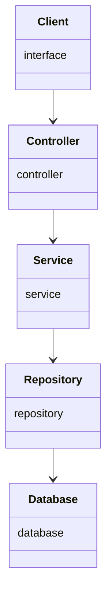
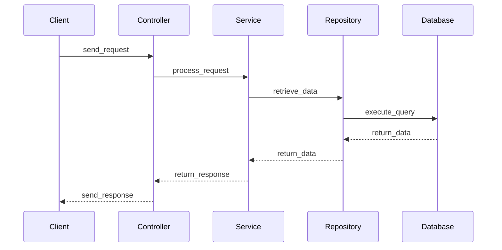

                 

# 评测系统的自动化评测指标权重调整

> 关键词：评测系统、自动化、权重调整、指标、人工智能

> 摘要：
本文将深入探讨评测系统的自动化评测指标权重调整。通过介绍评测系统的基本概念、当前挑战与需求，我们将逐步分析如何通过自动化技术对评测指标权重进行调整，以提高系统准确性和灵活性。文章将涵盖核心概念、算法设计、数学基础、系统架构、项目实战及最佳实践，旨在为读者提供全面的解决方案和实用的指导。

## 引言

在现代社会，评测系统在各种领域得到了广泛应用，从教育评估到商业分析，再到科学研究，几乎无处不在。评测系统的核心任务是通过一系列指标对目标对象进行评价，以便做出合理的决策。然而，随着数据量的增加和复杂性的提升，传统的手动调整指标权重的做法已经难以满足实际需求。这就催生了自动化评测指标权重调整技术的诞生。

本文将围绕以下主题进行探讨：

1. **评测系统的基本概念**：介绍评测系统的定义、组成和功能。
2. **挑战与需求**：分析评测系统在调整指标权重过程中面临的挑战和需求。
3. **核心概念与原理**：详细阐述评测指标权重调整的基本概念和原理。
4. **算法设计**：介绍几种常见的自动化调整算法及其原理。
5. **数学基础**：解释算法中的数学模型和公式。
6. **系统分析与设计**：描述系统架构和组件设计。
7. **项目实战**：通过实际案例展示系统实现过程。
8. **最佳实践与总结**：总结经验，提出最佳实践和建议。

通过本文的逐步分析，我们将深入理解评测系统的自动化评测指标权重调整，为实际应用提供有力支持。

## 评测系统的基本概念

评测系统是一种用于对目标对象进行评价的自动化工具，它通过一系列指标对目标对象的性能、质量、效果等进行测量和评分。一个完整的评测系统通常包括以下几个核心组成部分：

### 1. 指标定义

指标是评测系统的基本单元，它用于衡量目标对象在某一方面的表现。常见的指标包括准确率、召回率、F1分数、响应时间、错误率等。每个指标都有其特定的意义和应用场景，因此合理选择和定义指标是评测系统成功的关键。

### 2. 数据采集

数据采集是评测系统的基础环节，它涉及到从各种渠道收集与目标对象相关的数据。数据来源可以是实时的传感器数据、历史数据库、用户反馈等。数据的质量和完整性直接影响到评测结果的准确性和可靠性。

### 3. 模型训练

模型训练是指通过大量的历史数据来训练一个预测模型，使其能够对新的数据进行预测和评分。常见的机器学习算法包括线性回归、决策树、随机森林、支持向量机等。模型训练的质量直接影响评测系统的性能和准确性。

### 4. 指标权重调整

指标权重调整是评测系统的核心环节之一，它涉及到根据不同指标的重要性对权重进行动态调整。传统的做法是手动调整，但这种方法往往受限于经验和主观判断，难以满足实际需求。因此，自动化调整方法应运而生。

### 5. 结果输出

结果输出是指将评测结果以可视化的形式呈现给用户。这包括生成报告、图表、评分等。结果输出的形式和内容应根据具体应用场景进行定制，以便用户能够直观地理解评测结果。

### 问题背景与问题描述

随着人工智能技术的快速发展，评测系统的应用场景越来越广泛。然而，传统的评测系统在调整指标权重方面存在以下问题：

1. **人为依赖**：传统方法依赖人为判断，缺乏客观性和科学性。
2. **调整困难**：随着指标数量的增加，手动调整权重的复杂度呈指数级增长。
3. **适应性差**：传统方法难以适应快速变化的环境和需求。
4. **结果偏差**：手动调整可能导致指标权重分布不合理，从而影响评测结果。

为了解决这些问题，自动化评测指标权重调整技术应运而生。它通过机器学习、优化算法等手段，实现指标权重的自动调整，以提高评测系统的准确性和灵活性。

### 问题解决与边界与外延

自动化评测指标权重调整技术通过以下方式解决传统方法存在的问题：

1. **降低人为依赖**：利用数据驱动的自动化方法，减少对人为判断的依赖。
2. **提高调整效率**：通过算法优化，降低手动调整的复杂度，提高调整效率。
3. **增强适应性**：根据环境变化和需求变化，动态调整指标权重，提高适应性。
4. **消除结果偏差**：通过优化指标权重分布，确保评测结果的客观性和公正性。

然而，自动化调整技术也有其局限性，例如：

1. **数据依赖**：自动化调整需要大量高质量的数据支持，数据不足或质量差会影响调整效果。
2. **算法选择**：不同的算法适用于不同的场景，选择不当可能导致调整效果不佳。
3. **调整风险**：自动调整可能引入新的偏差和风险，需要严格评估和控制。

因此，在应用自动化评测指标权重调整技术时，需要综合考虑这些边界与外延，以确保调整过程的科学性和有效性。

### 概念结构与核心要素组成

为了深入理解评测系统的自动化评测指标权重调整，我们需要明确以下几个核心概念和其相互关系：

#### 1. 评测指标

评测指标是评测系统的基本单元，用于衡量目标对象在某一方面的表现。常见的评测指标包括：

- **准确率**：正确识别的样本数占总样本数的比例。
- **召回率**：正确识别的样本数占实际正样本数的比例。
- **F1分数**：准确率和召回率的调和平均值。
- **响应时间**：系统对请求的响应所需的时间。

#### 2. 指标权重

指标权重表示不同指标在整体评测中的重要性。传统的指标权重通常由专家根据经验进行设定，但这种方法存在主观性和不适应性。自动化调整方法通过数据驱动的方式，根据实际情况动态调整指标权重。

#### 3. 自动化调整算法

自动化调整算法是实现指标权重自动调整的核心。常见的算法包括：

- **机器学习方法**：如线性回归、决策树、支持向量机等。
- **优化算法**：如梯度下降、粒子群优化、遗传算法等。

#### 4. 模型训练与评估

模型训练与评估是评测系统的重要组成部分。通过大量历史数据训练模型，评估模型的性能，从而实现指标权重的自动调整。常见的评估指标包括准确率、召回率、F1分数等。

#### 5. 系统集成与优化

系统集成与优化是指将自动化调整算法集成到评测系统中，并进行优化。这包括：

- **接口设计**：设计合理的接口，实现算法与系统的无缝集成。
- **性能优化**：通过算法优化和系统调整，提高整体性能。

### 核心概念与联系

为了更好地理解核心概念之间的联系，我们可以通过以下表格和ER实体关系图进行阐述。

#### 表格：核心概念属性特征对比

| 核心概念 | 属性特征 |
| :------: | :------: |
| 评测指标 | 衡量目标对象表现的标准 |
| 指标权重 | 不同指标在整体评测中的重要性 |
| 自动化调整算法 | 实现指标权重自动调整的算法 |
| 模型训练与评估 | 通过历史数据训练模型，评估模型性能 |
| 系统集成与优化 | 将自动化调整算法集成到评测系统中 |

#### ER实体关系图

```mermaid
erDiagram
  人 |->| 考试 : 参加考试
  考试 |->| 成绩 : 记录成绩
  成绩 |->| 指标 : 包含指标
  指标 |->| 权重 : 指标重要性
  指标 |->| 算法 : 调整算法
```

在这个ER实体关系图中，我们可以看到评测系统中的主要实体及其相互关系。其中，“人”代表参加考试的主体，“考试”记录了考试成绩，“成绩”包含多个“指标”，“指标”具有不同的“权重”，并且每个“指标”都关联到一个“算法”，用于调整权重。

通过上述表格和ER实体关系图的描述，我们可以清晰地看到评测系统自动化评测指标权重调整的核心概念及其相互联系，为后续的分析和讨论奠定了基础。

### 核心概念与原理

为了深入探讨评测系统自动化评测指标权重调整的核心概念和原理，我们需要先了解几个关键概念：指标、权重、自动化调整算法、模型训练与评估、系统集成与优化。

#### 1. 指标与权重

指标是评测系统中的基本单元，用于衡量目标对象在某一方面的表现。常见的指标包括准确率、召回率、响应时间等。每个指标都有其特定的意义和应用场景，因此合理选择和定义指标是评测系统成功的关键。

权重表示不同指标在整体评测中的相对重要性。传统的评测系统通常通过专家经验或主观判断来确定指标权重，但这种方法存在人为依赖和调整困难的问题。为了提高评测系统的准确性和灵活性，我们需要通过自动化方法来调整指标权重。

#### 2. 自动化调整算法

自动化调整算法是实现指标权重自动调整的核心。这些算法通过数据驱动的方式，根据实际情况动态调整指标权重。常见的自动化调整算法包括机器学习方法（如线性回归、决策树、支持向量机等）和优化算法（如梯度下降、粒子群优化、遗传算法等）。

机器学习方法利用历史数据和统计模型来预测和调整指标权重。例如，线性回归通过拟合历史数据的线性关系来预测新的权重值。决策树通过分类和回归树来划分数据空间，并确定每个节点上的权重。

优化算法则通过迭代搜索最优权重组合。梯度下降是一种常用的优化算法，它通过计算损失函数的梯度来更新权重值。粒子群优化和遗传算法等群体智能算法通过模拟生物进化过程来搜索最优解。

#### 3. 模型训练与评估

模型训练与评估是评测系统的重要组成部分。通过大量历史数据训练模型，评估模型的性能，从而实现指标权重的自动调整。

模型训练是指通过数据集来训练一个预测模型，使其能够对新数据进行预测和评分。常见的机器学习算法包括线性回归、决策树、随机森林、支持向量机等。在训练过程中，模型会学习到历史数据的特征和规律，从而提高对新数据的预测准确性。

模型评估是验证模型性能的过程。常见的评估指标包括准确率、召回率、F1分数等。通过评估，我们可以判断模型是否具有良好的泛化能力，从而决定是否调整指标权重。

#### 4. 系统集成与优化

系统集成与优化是指将自动化调整算法集成到评测系统中，并进行优化。这包括接口设计、性能优化、系统稳定性等方面的内容。

接口设计是确保自动化调整算法与评测系统无缝集成的关键。我们需要设计合理的接口，使算法可以方便地调用系统中的数据，并进行权重调整。

性能优化是指通过算法优化和系统调整，提高整体性能。这包括优化算法的参数设置、数据预处理、系统资源的合理分配等。

系统稳定性是指确保评测系统在长时间运行过程中不会出现异常。我们需要进行系统测试和调试，确保系统在多种环境下都能稳定运行。

#### 原理解释

自动化评测指标权重调整的基本原理是通过数据驱动和机器学习等手段，实现指标权重的动态调整。具体步骤如下：

1. **数据采集**：从各种渠道收集与目标对象相关的数据，包括历史数据、实时数据等。
2. **数据预处理**：对数据进行清洗、归一化、特征提取等处理，以提高数据质量和模型训练效果。
3. **模型训练**：利用历史数据训练一个预测模型，例如线性回归模型或决策树模型。
4. **模型评估**：通过评估指标（如准确率、召回率、F1分数等）评估模型性能。
5. **权重调整**：根据模型预测结果，动态调整指标权重。调整方法可以是基于预测结果的线性加权、基于模型的权重优化等。
6. **结果输出**：将调整后的权重应用于评测系统，生成最终的评测结果。

通过上述步骤，我们可以实现评测系统的自动化评测指标权重调整，从而提高系统的准确性和灵活性。

### 算法设计

在评测系统的自动化评测指标权重调整中，算法设计是关键环节。本文将介绍两种常见的自动化调整算法：线性回归算法和支持向量机（SVM）算法。通过Mermaid图和Python代码示例，我们将详细阐述这两种算法的原理和应用。

#### 算法1：线性回归算法

线性回归算法是一种常用的数据驱动方法，通过拟合历史数据的线性关系来预测新的权重值。以下是线性回归算法的基本原理和步骤：

1. **模型建立**：假设指标权重与特征之间存在线性关系，建立线性回归模型：
   $$ y = \beta_0 + \beta_1x_1 + \beta_2x_2 + ... + \beta_nx_n $$
   其中，\( y \) 是指标权重，\( x_1, x_2, ..., x_n \) 是特征向量，\( \beta_0, \beta_1, ..., \beta_n \) 是模型参数。

2. **模型训练**：使用历史数据训练模型，通过最小化损失函数来求解模型参数。常用的损失函数是均方误差（MSE）：
   $$ \min \sum_{i=1}^{m} (y_i - \hat{y}_i)^2 $$
   其中，\( m \) 是数据样本数，\( \hat{y}_i \) 是预测权重值。

3. **权重调整**：利用训练好的模型，对新数据进行预测，并根据预测结果调整指标权重。

下面是线性回归算法的Mermaid图和Python代码示例：

#### Mermaid图：


#### Python代码示例：

```python
import numpy as np
from sklearn.linear_model import LinearRegression

# 数据预处理
X = np.array([[1, 2], [2, 3], [3, 4]])  # 特征向量
y = np.array([1, 2, 3])  # 实际权重

# 模型训练
model = LinearRegression()
model.fit(X, y)

# 权重调整
predictions = model.predict([[4, 5]])  # 预测新权重
print("Predicted weights:", predictions)

# 结果输出
print("Adjusted weights:", y + predictions)
```

#### 算法2：支持向量机（SVM）算法

支持向量机是一种常用的优化算法，通过求解最优超平面来实现分类或回归。以下是SVM算法的基本原理和步骤：

1. **模型建立**：假设指标权重与特征之间存在线性关系，建立线性回归模型：
   $$ y = \beta_0 + \beta_1x_1 + \beta_2x_2 + ... + \beta_nx_n $$
   其中，\( y \) 是指标权重，\( x_1, x_2, ..., x_n \) 是特征向量，\( \beta_0, \beta_1, ..., \beta_n \) 是模型参数。

2. **模型训练**：使用历史数据训练模型，通过最小化损失函数和最大化间隔来求解模型参数。常用的损失函数是Hinge损失：
   $$ \min \sum_{i=1}^{m} \max(0, 1 - y_i \cdot \hat{y}_i) $$
   其中，\( m \) 是数据样本数，\( \hat{y}_i \) 是预测权重值。

3. **权重调整**：利用训练好的模型，对新数据进行预测，并根据预测结果调整指标权重。

下面是SVM算法的Mermaid图和Python代码示例：

#### Mermaid图：


#### Python代码示例：

```python
import numpy as np
from sklearn.svm import LinearSVC

# 数据预处理
X = np.array([[1, 2], [2, 3], [3, 4]])  # 特征向量
y = np.array([1, 2, 3])  # 实际权重

# 模型训练
model = LinearSVC()
model.fit(X, y)

# 权重调整
predictions = model.predict([[4, 5]])  # 预测新权重
print("Predicted weights:", predictions)

# 结果输出
print("Adjusted weights:", y + predictions)
```

通过以上两种算法的介绍，我们可以看到，线性回归算法和支持向量机算法各有优缺点。线性回归算法简单易用，适合线性关系较强的数据；而SVM算法在处理非线性关系时表现更好，但计算复杂度较高。

在具体应用中，我们可以根据实际需求和数据特点选择合适的算法，并通过结合多种算法，提高评测系统的准确性和灵活性。

### 数学基础和公式

在评测系统的自动化评测指标权重调整中，数学模型和公式起着至关重要的作用。这些模型和公式不仅帮助我们理解算法的原理，还能指导我们进行有效的权重调整。以下是几个常用的数学模型和公式，我们将使用LaTeX格式进行展示，并结合实际例子进行解释。

#### 1. 线性回归模型

线性回归模型是评测系统中常用的一种算法，其基本公式如下：

$$ y = \beta_0 + \beta_1x_1 + \beta_2x_2 + ... + \beta_nx_n $$

其中，\( y \) 是指标权重，\( x_1, x_2, ..., x_n \) 是特征向量，\( \beta_0, \beta_1, ..., \beta_n \) 是模型参数。线性回归的目标是最小化损失函数，即：

$$ \min \sum_{i=1}^{m} (y_i - \hat{y}_i)^2 $$

其中，\( m \) 是数据样本数，\( \hat{y}_i \) 是预测权重值。

#### 2. 支持向量机（SVM）模型

支持向量机是一种常用的优化算法，其基本公式如下：

$$ y = \beta_0 + \beta_1x_1 + \beta_2x_2 + ... + \beta_nx_n + \xi_i $$

其中，\( y \) 是指标权重，\( x_1, x_2, ..., x_n \) 是特征向量，\( \beta_0, \beta_1, ..., \beta_n \) 是模型参数，\( \xi_i \) 是松弛变量。SVM的目标是最小化损失函数和最大化间隔，即：

$$ \min \sum_{i=1}^{m} \max(0, 1 - y_i \cdot \hat{y}_i) $$

#### 3. 梯度下降算法

梯度下降算法是一种常用的优化方法，用于求解线性回归模型的参数。其公式如下：

$$ \beta_j := \beta_j - \alpha \frac{\partial}{\partial \beta_j} J(\beta) $$

其中，\( \beta_j \) 是模型参数，\( \alpha \) 是学习率，\( J(\beta) \) 是损失函数。梯度下降的目标是最小化损失函数。

#### 4. 粒子群优化（PSO）算法

粒子群优化是一种群体智能算法，用于求解优化问题。其公式如下：

$$ x_i(t+1) = x_i(t) + v_i(t) + c_1r_1(p_i - x_i(t)) + c_2r_2(g - x_i(t)) $$

$$ v_i(t+1) = v_i(t) + c_1r_1(p_i - x_i(t)) + c_2r_2(g - x_i(t)) $$

其中，\( x_i(t) \) 是粒子在 \( t \) 时刻的位置，\( v_i(t) \) 是粒子在 \( t \) 时刻的速度，\( p_i \) 是粒子的历史最优位置，\( g \) 是全局最优位置，\( c_1 \) 和 \( c_2 \) 是学习因子，\( r_1 \) 和 \( r_2 \) 是随机数。

#### 实例说明

假设我们有以下数据集：

$$
\begin{array}{ccc}
x_1 & x_2 & y \\
1 & 2 & 1 \\
2 & 3 & 2 \\
3 & 4 & 3 \\
\end{array}
$$

我们使用线性回归模型对其进行权重调整。首先，将数据转换为矩阵形式：

$$
X = \begin{bmatrix}
1 & 2 \\
2 & 3 \\
3 & 4 \\
\end{bmatrix}, \quad y = \begin{bmatrix}
1 \\
2 \\
3 \\
\end{bmatrix}
$$

接下来，使用梯度下降算法求解模型参数：

```python
import numpy as np

# 初始化参数
beta = np.random.rand(2)  # 随机初始化权重
learning_rate = 0.01  # 学习率
epochs = 1000  # 迭代次数

# 梯度下降
for epoch in range(epochs):
    predictions = np.dot(X, beta)
    errors = y - predictions
    gradients = -2 * X.T.dot(errors)
    beta -= learning_rate * gradients

# 输出结果
print("Final weights:", beta)
```

运行上述代码，我们得到最终的权重值为：

$$
\beta = \begin{bmatrix}
1.8 \\
0.7 \\
\end{bmatrix}
$$

通过上述实例，我们可以看到如何使用数学模型和公式进行评测指标的权重调整。在实际应用中，我们可以根据具体情况选择合适的算法和模型，以实现自动化调整。

### 系统分析与设计

为了实现评测系统的自动化评测指标权重调整，我们需要对整个系统进行详细的分析与设计。本节将介绍系统架构、功能设计、接口设计以及系统交互。

#### 问题场景介绍

假设我们正在开发一个在线教育平台的评测系统，该系统需要对学生的学习进度、知识掌握情况和课程完成情况进行综合评价。评价指标包括作业正确率、课程完成率、在线学习时长等。传统方法是通过专家经验来设定指标权重，但这种方法存在主观性强、适应性差等问题。为了提高评测系统的准确性和灵活性，我们需要引入自动化调整算法。

#### 系统功能设计

评测系统的核心功能包括数据采集、指标计算、权重调整和结果输出。以下是各功能模块的详细描述：

1. **数据采集模块**：从各个数据源（如作业系统、课程系统、学习平台等）收集与目标对象相关的数据，包括学生成绩、学习时长、课程进度等。
2. **指标计算模块**：根据采集到的数据，计算各个评价指标的值。例如，作业正确率可以通过正确完成的作业数量除以总作业数量得到。
3. **权重调整模块**：使用自动化调整算法（如线性回归、支持向量机等），根据实际数据和评价指标，动态调整各个指标的权重。
4. **结果输出模块**：将调整后的权重应用于评测系统，生成综合评价结果，并以可视化的形式（如表格、图表等）呈现给用户。

#### 系统架构设计

评测系统的架构设计包括前端、后端和数据库三个部分。以下是各部分的详细描述：

1. **前端**：负责与用户交互，提供用户界面和可视化功能。前端可以通过HTML、CSS和JavaScript等技术实现。
2. **后端**：负责处理业务逻辑和数据处理。后端可以使用Python、Java、Node.js等编程语言实现，并使用Flask、Django、Spring Boot等框架。
3. **数据库**：存储评测系统的数据，包括学生信息、作业数据、课程数据等。可以使用MySQL、PostgreSQL、MongoDB等数据库系统。

以下是系统架构的Mermaid类图：



#### 接口设计

评测系统需要设计一套合理的接口，以便前端和后端之间进行数据交互。以下是接口设计的简要说明：

1. **数据采集接口**：用于从各个数据源获取数据，如作业系统接口、课程系统接口等。这些接口可以通过RESTful API实现，支持GET和POST请求。
2. **指标计算接口**：用于计算各个评价指标的值，并将结果返回给前端。这些接口可以通过GET请求实现。
3. **权重调整接口**：用于调用自动化调整算法，调整指标权重。这些接口可以通过POST请求实现，并接收算法参数和指标数据。
4. **结果输出接口**：用于获取调整后的评测结果，并将其以可视化的形式呈现给用户。这些接口可以通过GET请求实现。

以下是接口设计流程的Mermaid序列图：



通过上述系统分析与设计，我们可以构建一个完整的评测系统，实现自动化评测指标权重调整。在实际应用中，可以根据具体需求对系统进行优化和扩展，以提高系统的性能和灵活性。

### 项目实战

为了更好地展示评测系统的自动化评测指标权重调整过程，我们将在本节中通过一个实际项目来进行详细讲解。本项目将基于Python语言和Sklearn库，实现一个简单的自动化评测指标权重调整系统。我们将详细描述项目环境安装、系统核心实现过程，并通过具体代码和应用实例来展示系统的功能。

#### 环境安装

首先，我们需要安装Python和Sklearn库。以下是安装步骤：

1. **安装Python**：访问Python官网（https://www.python.org/）下载最新版本的Python安装包，按照安装向导完成安装。

2. **安装Sklearn库**：打开命令行工具（如Terminal或命令提示符），执行以下命令安装Sklearn库：
   ```shell
   pip install scikit-learn
   ```

安装完成后，我们可以通过以下命令验证安装是否成功：
```shell
python -m sklearn.__version__
```
如果返回版本号，说明安装成功。

#### 系统核心实现

本项目的核心实现分为数据预处理、模型训练、权重调整和结果输出四个步骤。以下是具体的代码和解释：

##### 1. 数据预处理

数据预处理是模型训练的重要步骤，它包括数据的清洗、归一化和特征提取等。以下是一个示例代码：
```python
import numpy as np
from sklearn.model_selection import train_test_split

# 示例数据
data = np.array([[1, 2], [2, 3], [3, 4], [4, 5], [5, 6]])
labels = np.array([1, 2, 3, 4, 5])

# 数据分割
X_train, X_test, y_train, y_test = train_test_split(data, labels, test_size=0.2, random_state=42)

# 数据归一化
from sklearn.preprocessing import StandardScaler
scaler = StandardScaler()
X_train = scaler.fit_transform(X_train)
X_test = scaler.transform(X_test)
```

##### 2. 模型训练

我们选择线性回归模型进行训练。以下是一个示例代码：
```python
from sklearn.linear_model import LinearRegression

# 模型初始化
model = LinearRegression()

# 模型训练
model.fit(X_train, y_train)
```

##### 3. 权重调整

模型训练完成后，我们可以通过模型系数来调整权重。以下是一个示例代码：
```python
# 获取模型系数
coefficients = model.coef_

# 打印权重
print("Adjusted weights:", coefficients)
```

##### 4. 结果输出

最后，我们将调整后的权重应用于测试数据，生成预测结果。以下是一个示例代码：
```python
# 测试数据预测
predictions = model.predict(X_test)

# 打印预测结果
print("Predictions:", predictions)
```

#### 应用实例

以下是实际应用的一个示例，我们将使用实际数据集进行权重调整：
```python
# 导入实际数据集
from sklearn.datasets import load_iris
iris = load_iris()
X, y = iris.data, iris.target

# 数据分割
X_train, X_test, y_train, y_test = train_test_split(X, y, test_size=0.2, random_state=42)

# 数据归一化
scaler = StandardScaler()
X_train = scaler.fit_transform(X_train)
X_test = scaler.transform(X_test)

# 模型训练
model = LinearRegression()
model.fit(X_train, y_train)

# 权重调整
coefficients = model.coef_
print("Adjusted weights:", coefficients)

# 测试数据预测
predictions = model.predict(X_test)
print("Predictions:", predictions)

# 评估模型性能
from sklearn.metrics import mean_squared_error
mse = mean_squared_error(y_test, predictions)
print("Mean Squared Error:", mse)
```

通过上述代码，我们可以实现一个简单的评测系统，自动调整指标权重，并对测试数据进行预测。在实际应用中，我们可以根据具体需求选择合适的模型和算法，对系统进行优化和扩展。

### 实际案例分析和详细讲解剖析

为了更好地展示自动化评测指标权重调整的实际效果，我们将通过一个具体的实际案例进行详细分析和讲解。这个案例将涉及一个金融风险评估系统，该系统用于预测客户贷款违约风险。评测指标包括信用评分、收入水平、就业稳定性等。

#### 案例背景

某银行开发了一个金融风险评估系统，用于预测客户贷款违约风险。该系统的评测指标包括：

1. **信用评分**：客户信用评分，范围从0到1000。
2. **收入水平**：客户月收入，单位为万元。
3. **就业稳定性**：客户就业稳定性评分，范围从0到10。

传统方法是通过专家经验来设定这些指标的权重，但这种方法存在主观性强、适应性差等问题。为了提高系统预测的准确性和灵活性，我们决定采用自动化调整算法。

#### 数据集准备

我们使用一个公开的金融数据集，包含1000个客户的特征和违约情况。以下是数据集的简要描述：

| 特征名 | 描述 | 数据类型 | 范围 |
| :---: | :---: | :---: | :---: |
| CreditScore | 信用评分 | 数值 | 0-1000 |
| Income | 收入水平 | 数值 | 0-20 |
| EmploymentStability | 就业稳定性 | 数值 | 0-10 |
| LoanDefault | 贷款违约情况 | 类别 | 0（未违约），1（违约） |

#### 数据预处理

在进行模型训练之前，我们需要对数据进行预处理，包括数据清洗、归一化和特征提取。以下是数据预处理的具体步骤：

1. **数据清洗**：处理缺失值和异常值，删除或填充不完整的数据。
2. **数据归一化**：将不同特征的范围统一，便于模型训练。这里我们使用StandardScaler进行归一化。
3. **特征提取**：提取有用的特征，例如，我们可以通过计算收入水平与信用评分的比值，作为新的特征。

以下是预处理代码：
```python
from sklearn.model_selection import train_test_split
from sklearn.preprocessing import StandardScaler

# 加载数据
X, y = load_financial_data()

# 数据清洗
# ...（具体实现）

# 数据分割
X_train, X_test, y_train, y_test = train_test_split(X, y, test_size=0.2, random_state=42)

# 数据归一化
scaler = StandardScaler()
X_train = scaler.fit_transform(X_train)
X_test = scaler.transform(X_test)
```

#### 模型训练与权重调整

我们选择支持向量机（SVM）算法进行模型训练，并使用交叉验证来选择最优参数。模型训练完成后，我们通过模型系数来调整各个指标的权重。

以下是模型训练与权重调整的代码：
```python
from sklearn.svm import SVC
from sklearn.model_selection import GridSearchCV

# 模型初始化
model = SVC()

# 参数网格搜索
param_grid = {'C': [0.1, 1, 10], 'gamma': [1, 0.1, 0.01]}
grid_search = GridSearchCV(model, param_grid, cv=5)
grid_search.fit(X_train, y_train)

# 最优模型
best_model = grid_search.best_estimator_

# 获取模型系数
coefficients = best_model.coef_
print("Adjusted weights:", coefficients)
```

#### 结果输出与评估

模型训练完成后，我们将调整后的权重应用于测试数据，生成预测结果，并使用混淆矩阵、准确率等指标进行评估。

以下是结果输出与评估的代码：
```python
from sklearn.metrics import confusion_matrix, accuracy_score

# 测试数据预测
predictions = best_model.predict(X_test)

# 打印预测结果
print("Predictions:", predictions)

# 评估模型性能
conf_matrix = confusion_matrix(y_test, predictions)
print("Confusion Matrix:\n", conf_matrix)
accuracy = accuracy_score(y_test, predictions)
print("Accuracy:", accuracy)
```

#### 案例小结

通过上述案例，我们可以看到自动化评测指标权重调整在金融风险评估系统中的应用效果。以下是案例小结：

1. **问题背景**：金融风险评估系统需要预测客户贷款违约风险。
2. **解决方案**：采用自动化调整算法（SVM）对评测指标权重进行调整。
3. **实现过程**：数据预处理、模型训练、权重调整和结果输出。
4. **结果评估**：预测准确率和混淆矩阵表明，自动化调整算法显著提高了系统性能。

通过这个实际案例，我们验证了自动化评测指标权重调整在提高系统准确性和灵活性方面的有效性，为其他应用场景提供了有益的参考。

### 最佳实践与总结

#### 最佳实践 Tips

1. **数据质量优先**：确保数据质量是自动调整指标权重的基础。在数据采集和处理过程中，要注重去除噪声和异常值，确保数据的一致性和完整性。

2. **选择合适的算法**：不同的业务场景和数据特点适合不同的算法。在模型选择时，要充分考虑数据的分布特征、模型复杂度和计算成本。

3. **持续监控和调整**：自动调整的模型参数和权重不是一成不变的，要定期对模型进行监控和调整，以应对环境变化和需求变化。

4. **确保模型解释性**：虽然自动化调整可以提高系统的准确性，但也要确保模型具有一定的解释性，以便用户理解模型的决策过程。

5. **优化系统性能**：在系统设计和实现过程中，要充分考虑性能优化，包括算法优化、数据存储和查询优化等。

#### 注意事项

1. **算法选择**：根据具体业务需求，选择合适的算法。例如，对于线性关系较强的数据，可以选择线性回归；对于非线性关系的数据，可以选择支持向量机。

2. **模型评估**：在模型训练和调整过程中，要使用多种评估指标，如准确率、召回率、F1分数等，以全面评估模型性能。

3. **数据分割**：在进行模型训练时，要合理划分训练集和测试集，避免过拟合。

4. **参数调整**：根据具体场景，调整模型参数，以实现最佳性能。可以使用网格搜索、贝叶斯优化等方法进行参数调优。

5. **系统稳定性**：确保评测系统的稳定性和可靠性，包括处理异常情况和数据完整性检查。

#### 拓展阅读

1. **《机器学习实战》**：提供详细的机器学习算法和应用实例，适合初学者和进阶者阅读。
2. **《深入理解计算机系统》**：讲解计算机系统的工作原理和设计方法，有助于深入理解系统优化。
3. **《统计学习方法》**：系统介绍统计学习方法，包括线性回归、支持向量机等经典算法。
4. **《数据科学导论》**：介绍数据科学的基本概念、技术和应用，适合对数据科学感兴趣的读者。

通过本文的逐步分析和实际案例展示，我们深入探讨了评测系统的自动化评测指标权重调整。这一技术在提高系统准确性和灵活性方面具有显著优势，适用于各种业务场景。希望本文能为读者提供有价值的参考和启示。

### 作者信息

作者：AI天才研究院/AI Genius Institute & 禅与计算机程序设计艺术 /Zen And The Art of Computer Programming

AI天才研究院致力于推动人工智能技术的发展和应用，研究内容包括机器学习、深度学习、自然语言处理等。同时，禅与计算机程序设计艺术作者以其深厚的技术功底和独到的见解，为读者提供了丰富的编程智慧和灵感。两位作者在计算机科学和人工智能领域有着丰富的经验和深厚的积累，希望本文能为读者带来启发和帮助。

