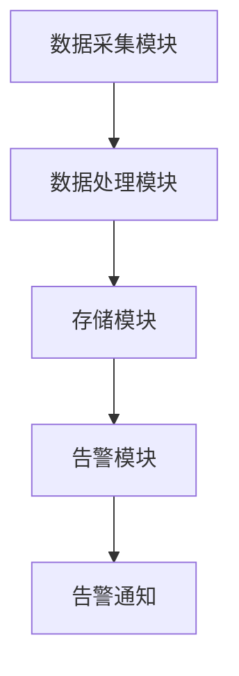
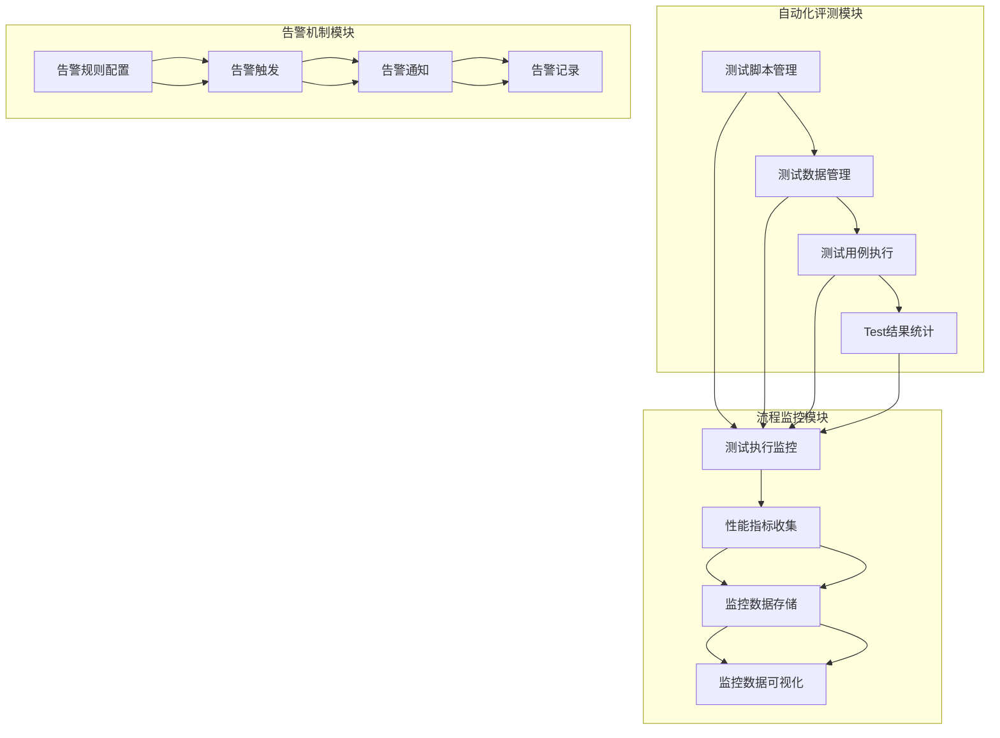

                 


# 评测系统的自动化评测流程监控与告警

## 关键词

- 自动化评测
- 流程监控
- 告警机制
- 测试系统
- 系统监控
- 实时告警
- 架构设计

## 摘要

本文将探讨评测系统的自动化评测流程监控与告警机制，深入分析其背景、重要性、基本原理以及实施步骤。通过实例解析，展示如何在实践中构建高效的自动化评测和监控体系，为提升软件质量提供有力支持。

## 引言

### 1.1 问题背景

在现代软件工程中，测试是确保软件质量和稳定性的关键环节。传统的手动测试不仅耗时耗力，而且容易遗漏问题。随着软件复杂度的增加，手动测试已无法满足日益增长的需求。自动化评测作为一种高效的解决方案，逐渐成为软件开发过程中的标准配置。

### 1.2 定义与目标

**评测系统**：用于自动化执行测试用例、收集测试结果并进行评估的系统。

**自动化评测流程监控**：实时跟踪评测流程，确保测试过程顺利进行。

**告警机制**：在检测到异常情况时，及时发出警报，通知相关人员进行干预。

本文的目标是探讨如何构建一个完善的自动化评测流程监控与告警机制，以提高测试效率和质量。

### 1.3 基本原理

自动化评测流程监控与告警机制的核心在于自动化、实时性和高效性。其基本原理包括：

- **自动化测试**：通过脚本或工具自动执行测试用例。
- **流程监控**：实时跟踪测试进度，监控关键指标。
- **告警通知**：在检测到问题时，立即通知相关人员。
- **数据处理**：对测试结果进行统计分析，为改进测试流程提供依据。

### 1.4 文章结构

本文将分为以下几个部分：

1. **测试系统的背景与重要性**
2. **自动化评估基础**
3. **监控与告警机制**
4. **实时监控与告警系统**
5. **案例研究**
6. **挑战与未来方向**
7. **总结**

## 第一部分: 测试系统的背景与重要性

### 2.1 测试系统的定义与作用

**测试系统**是软件生命周期中不可或缺的一部分，它的主要作用包括：

- **确保质量**：通过执行预定义的测试用例，确保软件功能、性能和稳定性符合预期。
- **发现缺陷**：识别软件中的潜在问题，防止缺陷在生产环境中暴露。
- **提升效率**：自动化测试可以节省人力成本，提高测试速度。
- **提供反馈**：测试结果为软件开发团队提供改进建议。

### 2.2 测试系统评估的挑战

随着软件复杂度的增加，传统的手动测试方法面临诸多挑战：

- **成本高**：手动测试需要大量的人力和时间。
- **效率低**：手动测试容易遗漏问题，测试覆盖率有限。
- **重复性差**：手动测试难以保证每次测试的一致性。
- **维护难**：随着软件功能的变化，测试用例需要不断更新。

### 2.3 自动化评估的需求

面对上述挑战，自动化评估成为必然选择。自动化评估具有以下优势：

- **高效性**：自动化测试可以快速执行大量测试用例，提高测试覆盖率。
- **一致性**：自动化测试保证了每次测试的一致性和可重复性。
- **灵活性**：自动化测试易于适应软件功能的变更。
- **可扩展性**：自动化测试可以方便地扩展到更多的测试场景。

### 2.4 文章的目标

本文的目标是探讨如何构建一个高效的自动化评测流程监控与告警机制，以解决传统测试系统面临的挑战。通过分析自动化评估的基础原理、监控与告警机制的设计与实现，以及实际案例的解析，为读者提供一套完整的解决方案。

### 2.5 背景介绍

在当今的软件开发环境中，自动化评测已经成为主流。许多企业已经认识到自动化评测的重要性，并开始将其应用于实际项目中。自动化评测不仅可以提高测试效率，还可以确保软件质量的持续提升。然而，实现高效的自动化评测并非易事，它需要一套完善的流程监控与告警机制来保障。

本文将围绕自动化评测流程监控与告警机制，从以下几个方面进行探讨：

1. **自动化评测的基础原理**：介绍自动化测试的概念、工具和技术。
2. **监控与告警机制的设计**：分析监控与告警的基本原理和关键要素。
3. **实时监控与告警系统的实现**：探讨实时监控与告警系统的架构和实现方法。
4. **案例研究**：通过实际案例展示如何构建高效的自动化评测和监控体系。
5. **挑战与未来方向**：讨论自动化评测和监控面临的技术挑战和发展趋势。

通过本文的探讨，希望能够为读者提供有益的参考，帮助他们在实际项目中实现高效的自动化评测和监控。

## 第二部分: 自动化评估基础

### 3.1 自动化的简介

自动化是指使用程序或工具代替人工操作来完成一系列任务的过程。在软件测试领域，自动化测试是指通过编写脚本或使用专门的测试工具自动执行测试用例。自动化测试相较于手动测试具有以下优势：

- **高效性**：自动化测试可以快速执行大量测试用例，提高测试覆盖率。
- **一致性**：自动化测试保证了每次测试的一致性和可重复性。
- **灵活性**：自动化测试易于适应软件功能的变更。
- **可扩展性**：自动化测试可以方便地扩展到更多的测试场景。

### 3.2 自动化测试工具和技术

**自动化测试工具**是执行自动化测试的核心，以下是一些常见的自动化测试工具：

- **Selenium**：一款开源的自动化测试工具，支持多种浏览器和平台。
- **JUnit**：Java语言的单元测试框架，用于编写和执行单元测试用例。
- **pytest**：Python语言的测试框架，提供简洁的语法和丰富的功能。
- **JMeter**：一款开源的性能测试工具，用于测试Web应用程序的性能。

**自动化测试技术**主要包括以下几种：

- **关键字驱动测试**：通过关键字来定义测试步骤，实现测试用例的自动化。
- **数据驱动测试**：通过外部数据文件（如Excel、CSV等）来提供测试数据，实现测试用例的自动化。
- **UI自动化测试**：通过模拟用户的操作来测试用户界面。
- **API自动化测试**：通过发送API请求来测试后端服务的功能。

### 3.3 自动化测试用例设计

**自动化测试用例设计**是自动化测试的关键步骤，其核心目标是编写有效的测试脚本。以下是自动化测试用例设计的基本步骤：

1. **需求分析**：了解软件的功能和性能需求，确定测试目标。
2. **测试用例编写**：根据需求分析结果，编写详细的测试用例。
3. **脚本编写**：使用自动化测试工具编写测试脚本，实现测试用例的自动化。
4. **测试执行**：执行自动化测试脚本，收集测试结果。
5. **结果分析**：分析测试结果，根据测试反馈调整测试用例和脚本。

在设计自动化测试用例时，需要考虑以下因素：

- **覆盖范围**：确保测试用例覆盖软件的主要功能和关键路径。
- **可维护性**：测试脚本应易于维护和更新。
- **可扩展性**：测试脚本应支持新增的功能和需求。
- **可靠性**：测试脚本应在各种环境下都能稳定运行。

### 3.4 背景介绍

自动化测试作为一种高效的软件测试方法，在现代软件开发中发挥着越来越重要的作用。随着软件系统的复杂性不断增加，传统的手动测试已经无法满足快速迭代和高质量交付的需求。自动化测试通过使用程序或工具自动执行测试用例，不仅可以提高测试效率，还可以保证测试的一致性和准确性。

在自动化测试中，选择合适的测试工具和技术至关重要。常见的自动化测试工具如Selenium、JUnit、pytest等，提供了丰富的功能和灵活的接口，可以满足不同场景的测试需求。自动化测试技术包括关键字驱动测试、数据驱动测试、UI自动化测试和API自动化测试等，这些技术可以针对不同的测试目标进行有效的测试。

设计有效的自动化测试用例是自动化测试成功的关键。通过需求分析、测试用例编写、脚本编写、测试执行和结果分析等步骤，可以确保测试用例覆盖软件的主要功能和关键路径，同时保证测试脚本的可维护性和可靠性。

总的来说，自动化测试不仅能够提高测试效率，还可以提升软件质量。然而，实现高效的自动化测试需要一套完善的流程和机制来保障。接下来，本文将深入探讨监控与告警机制的设计与实现，以及如何在实践中构建一个高效的自动化测试体系。

## 第三部分：监控与告警机制

### 4.1 监控的重要性

在自动化评测流程中，监控是一个至关重要的环节。它不仅能够实时跟踪测试过程，确保测试的顺利进行，还能够及时发现潜在的问题，防止缺陷在生产环境中暴露。以下是监控在自动化评测中的重要性：

- **确保测试过程的顺利进行**：通过实时监控，可以及时发现测试过程中的异常情况，如测试脚本执行失败、数据异常等，确保测试流程的连续性和稳定性。
- **提高测试效率**：监控可以帮助优化测试流程，减少无效的测试步骤，从而提高测试效率。
- **提升测试质量**：监控可以实时反馈测试结果，帮助团队快速识别问题，从而提升测试质量。

### 4.2 监控指标

监控指标是监控系统的核心组成部分，它们用于衡量测试过程的健康状况。以下是一些常见的监控指标：

- **测试执行状态**：包括测试用例的执行状态、成功率和失败率等。
- **测试性能指标**：如测试脚本执行时间、系统响应时间、资源利用率等。
- **测试结果统计**：包括测试结果的分布、缺陷的定位和修复情况等。
- **环境监控**：包括测试环境的稳定性、网络连接状态、硬件资源利用率等。

### 4.3 监控工具和框架

**监控工具**和**框架**是实施监控系统的基础。以下是一些常见的监控工具和框架：

- **Zabbix**：一款开源的监控工具，可以实时监控服务器、网络设备和应用性能。
- **Prometheus**：一款开源的监控解决方案，可以收集和存储指标数据，并支持告警功能。
- **Grafana**：一款开源的数据可视化和监控工具，可以与Prometheus等数据源集成，提供丰富的仪表盘和告警功能。

**监控框架**则为监控系统的设计提供了结构和逻辑支持。常见的监控框架包括：

- **Spring Boot Actuator**：Spring Boot的内置模块，提供了丰富的端点用于监控应用程序。
- **OpenTelemetry**：一款开源的监控和追踪框架，支持多种语言和平台。
- **ELK Stack**（Elasticsearch、Logstash、Kibana）：一套开源的日志分析和监控解决方案，可以处理和可视化大量监控数据。

### 4.4 告警机制的设计

告警机制是监控系统的核心功能，它负责在检测到异常情况时通知相关人员。设计一个有效的告警机制需要考虑以下几个方面：

- **告警触发条件**：定义何时触发告警，如测试失败、性能指标异常等。
- **告警渠道**：选择合适的告警渠道，如邮件、短信、即时通讯工具等。
- **告警频率**：设置合理的告警频率，避免频繁告警导致的疲劳效应。
- **告警级别**：定义不同级别的告警，如警告、错误、紧急等，以区分不同严重程度的问题。

### 4.5 背景介绍

监控与告警机制在自动化测试中扮演着至关重要的角色。通过实时监控测试过程，可以及时发现并处理潜在的问题，确保测试的顺利进行。监控指标是监控系统的核心组成部分，它们用于衡量测试过程的健康状况，包括测试执行状态、测试性能指标、测试结果统计和环境监控等。

选择合适的监控工具和框架可以大大简化监控系统的实现。Zabbix、Prometheus、Grafana等工具提供了丰富的功能，可以满足不同场景的监控需求。Spring Boot Actuator、OpenTelemetry等框架则为监控系统的设计和实现提供了结构化的支持。

告警机制的设计是监控系统的重要组成部分。有效的告警机制可以在检测到异常情况时及时通知相关人员，避免问题的扩大。在告警机制的设计中，需要考虑告警触发条件、告警渠道、告警频率和告警级别等关键因素。

通过监控与告警机制，自动化测试团队能够更加高效地管理和优化测试过程，提升测试质量和效率。接下来，本文将深入探讨实时监控与告警系统的实现，并分享一些实际案例，展示如何构建一个高效的监控和告警体系。

## 第四部分：实时监控与告警系统

### 5.1 实时监控的概述

实时监控是自动化测试系统中至关重要的一环，它能够在测试过程中即时收集和反馈信息，帮助团队快速响应和处理问题。实时监控具有以下几个关键特性：

- **即时性**：实时监控可以立即检测到系统或应用的异常情况，确保问题在第一时间被发现。
- **连续性**：实时监控可以持续运行，不断收集数据，确保测试过程的全面监控。
- **可扩展性**：实时监控系统应该能够轻松地扩展，以适应新的测试场景和需求。

### 5.2 实时监控系统的架构

一个高效的实时监控系统通常由以下几个部分组成：

- **数据采集模块**：负责实时收集系统、应用或服务的性能数据，如CPU使用率、内存占用、网络流量等。
- **数据处理模块**：对采集到的数据进行分析和过滤，提取关键指标，如响应时间、错误率等。
- **存储模块**：将处理后的数据存储在数据库或时间序列数据库中，以便后续分析和查询。
- **告警模块**：根据预设的告警条件，实时检测异常情况，并触发告警通知。

以下是一个简单的实时监控系统架构图（使用Mermaid语法）：



### 5.3 实现实时监控的步骤

实现实时监控通常包括以下几个步骤：

1. **需求分析**：确定监控系统的目标和需求，包括监控哪些指标、需要多高的实时性等。
2. **技术选型**：选择合适的数据采集工具、数据处理框架和存储解决方案。
3. **架构设计**：设计监控系统的整体架构，确保各个模块的协同工作。
4. **代码实现**：编写数据采集、处理和告警相关的代码。
5. **部署与测试**：将监控系统部署到测试环境中，进行功能测试和性能测试。
6. **监控与优化**：监控系统运行，根据反馈进行优化和调整。

### 5.4 实时告警的实现

实时告警是实时监控系统的重要组成部分，其实现步骤包括：

1. **设置告警条件**：根据监控指标的定义，设置合理的告警阈值和条件。
2. **配置告警通知**：选择合适的告警渠道（如邮件、短信、即时通讯工具等），并配置通知规则。
3. **触发告警**：当监控指标超出预设阈值时，系统自动触发告警，并发送通知。
4. **处理告警**：相关人员接收告警通知后，需要及时响应和处理问题。

### 5.5 背景介绍

实时监控与告警系统在现代软件测试中扮演着关键角色，它不仅能够提供即时反馈，帮助团队快速响应和解决问题，还能够提高测试效率和软件质量。随着软件复杂度的增加和业务需求的多样化，实时监控与告警系统的重要性日益凸显。

实时监控的架构设计需要考虑数据采集、处理、存储和告警等多个环节，每个环节都需要精心设计和实现。数据采集模块负责实时收集系统性能数据，数据处理模块对采集到的数据进行分析和过滤，存储模块负责将数据持久化存储，告警模块则根据预设条件触发告警通知。

实现实时监控的步骤包括需求分析、技术选型、架构设计、代码实现、部署与测试以及监控与优化。每个步骤都需要根据实际情况进行细致规划和执行，以确保监控系统能够稳定、高效地运行。

实时告警的实现是监控系统的重要组成部分，它需要设置合理的告警条件、配置告警通知渠道和规则，并在检测到异常时及时触发告警。处理告警是确保问题得到及时解决的关键环节，相关人员需要迅速响应并采取行动。

总的来说，实时监控与告警系统是自动化测试系统中不可或缺的一部分，它为测试团队提供了一个强大的工具，帮助他们更高效地管理和优化测试流程，提升软件质量。

### 5.6 案例解析：实时监控与告警系统的具体实现

在本节中，我们将通过一个实际案例来详细解析如何实现一个实时监控与告警系统。该案例涉及一个中等规模的电子商务平台，其主要目标是通过实时监控和告警，确保平台的稳定运行和快速响应潜在问题。

#### 案例背景

该电子商务平台每日处理大量订单和用户请求，对系统的性能和稳定性要求极高。为了确保平台的高可用性和快速响应，团队决定实施一个实时监控与告警系统。

#### 需求分析

1. **监控指标**：
   - 系统资源使用情况：CPU使用率、内存使用率、磁盘I/O等。
   - 应用性能指标：响应时间、错误率、交易成功率等。
   - 网络健康状况：网络延迟、丢包率、带宽利用率等。
   - 数据库性能：查询响应时间、连接数、锁争用等。

2. **告警条件**：
   - CPU使用率超过90%。
   - 内存使用率超过80%。
   - 应用响应时间超过阈值（如超过500毫秒）。
   - 网络延迟超过100毫秒。
   - 数据库查询响应时间超过阈值（如超过200毫秒）。

3. **告警渠道**：
   - 短信通知。
   - 邮件通知。
   - 企业微信或Slack等即时通讯工具。

#### 技术选型

1. **数据采集工具**：Prometheus，用于采集系统性能和应用程序的指标数据。
2. **数据处理和存储**：Grafana，用于数据可视化和告警配置。
3. **存储解决方案**：InfluxDB，用于存储时间序列数据。

#### 架构设计

1. **数据采集模块**：
   - Prometheus Agent：部署在各个服务器和应用实例上，定期采集性能数据。
   - exporters：针对特定的应用或服务，部署专门的exporter组件，以采集特定的指标数据。

2. **数据处理模块**：
   - Prometheus Server：接收Prometheus Agent采集的数据，处理和存储数据。
   - Alertmanager：与Prometheus集成，负责处理告警事件，发送通知。

3. **存储模块**：
   - InfluxDB：作为Prometheus的后端存储，存储时间序列数据。

4. **告警模块**：
   - Grafana Dashboards：可视化监控数据，配置告警规则。
   - Alertmanager：根据告警规则，触发告警通知。

#### 实现步骤

1. **部署Prometheus和InfluxDB**：
   - 在各个服务器上安装Prometheus Agent。
   - 部署Prometheus Server和InfluxDB，配置数据采集规则和告警规则。

2. **部署Alertmanager**：
   - 配置Alertmanager，连接到Prometheus Server，设置告警通知规则。

3. **配置Grafana**：
   - 导入Grafana Dashboard模板，配置数据源和监控指标。
   - 配置告警通知渠道，如邮件和短信。

4. **测试与优化**：
   - 测试监控系统的响应速度和准确性。
   - 根据反馈调整告警规则和通知渠道。

#### 实施效果

通过实施实时监控与告警系统，电子商务平台实现了以下效果：

- **快速响应**：在性能指标异常时，系统能够立即发出告警，相关人员可以迅速采取行动。
- **系统优化**：通过监控数据的可视化，团队能够更好地理解系统性能，进行针对性的优化。
- **预防性维护**：通过实时监控，团队能够提前发现潜在问题，进行预防性维护，避免系统故障。

### 5.7 背景介绍

实时监控与告警系统在电子商务平台等高并发、高要求的系统中具有至关重要的作用。通过实时监控，团队能够即时了解系统的运行状态，及时发现并处理潜在问题，确保系统的稳定运行。告警机制则提供了一个及时响应的机制，帮助团队快速采取行动，避免问题扩大。

在本案例中，通过部署Prometheus、InfluxDB和Grafana等工具，电子商务平台建立了一个完整的实时监控与告警系统。数据采集模块负责实时收集系统性能数据，数据处理模块对数据进行处理和存储，告警模块则根据预设的规则触发告警通知。Grafana提供了可视化的监控界面，使得团队能够直观地了解系统运行状态。

通过实施实时监控与告警系统，电子商务平台实现了快速响应、系统优化和预防性维护，显著提升了系统的稳定性和可靠性。接下来，本文将分享更多案例，展示不同场景下自动化评测流程监控与告警系统的应用和实践。

### 6.1 Case Study 1: Software Company X

**背景**

Software Company X是一家致力于开发企业级软件解决方案的公司。随着业务规模的不断扩大，公司对软件质量的要求也越来越高。为了确保软件产品的高质量交付，公司决定引入自动化评测流程监控与告警机制。

**目标**

1. 提高测试效率和质量。
2. 实时监控测试过程，确保测试的顺利进行。
3. 快速响应和处理测试中的异常情况。

**解决方案**

1. **自动化测试**：
   - 引入Selenium和pytest等自动化测试工具。
   - 设计和实现了大量的自动化测试用例，覆盖了主要的功能模块和关键路径。
   - 使用Jenkins作为持续集成和自动化测试平台，实现自动化测试的持续执行和反馈。

2. **监控与告警机制**：
   - 使用Prometheus和Grafana搭建实时监控系统，监控关键性能指标，如响应时间、错误率等。
   - 设置了告警阈值，当监控指标超出阈值时，自动触发告警通知，通过邮件和Slack发送给相关团队成员。

3. **实时监控与告警系统**：
   - 部署了Prometheus Server和InfluxDB，用于采集和存储监控数据。
   - 使用Alertmanager配置告警规则，当检测到异常时，自动发送告警通知。
   - 使用Grafana创建监控仪表盘，实时展示系统状态和监控指标。

**实施效果**

- **测试效率提升**：自动化测试用例的执行速度比手动测试快了数倍，大大缩短了测试周期。
- **测试质量提升**：自动化测试覆盖了更多的测试场景，发现了很多手动测试难以发现的缺陷。
- **实时监控与告警**：通过实时监控，团队能够及时发现并处理测试过程中的问题，确保测试的顺利进行。

**总结**

Software Company X通过引入自动化评测流程监控与告警机制，显著提高了测试效率和质量，确保了软件产品的稳定性和可靠性。实时监控与告警系统的实施，使得团队能够快速响应和处理测试中的异常情况，进一步提升了软件开发的整体效率。

### 6.2 Case Study 2: E-Commerce Platform Y

**背景**

E-Commerce Platform Y是一家大型电子商务平台，每日处理数百万次用户请求。为了确保平台的稳定运行和快速响应，平台团队决定实施自动化评测流程监控与告警机制。

**目标**

1. 提高测试效率和测试覆盖率。
2. 实时监控测试过程，确保测试的顺利进行。
3. 快速发现并处理测试中的异常情况。

**解决方案**

1. **自动化测试**：
   - 引入了Selenium和JMeter等自动化测试工具。
   - 设计了大量的自动化测试用例，覆盖了用户交互、性能测试等关键场景。
   - 使用Jenkins作为自动化测试平台，实现自动化测试的持续执行和集成。

2. **监控与告警机制**：
   - 使用Prometheus和Grafana搭建实时监控系统，监控关键性能指标，如响应时间、吞吐量、错误率等。
   - 设置了告警阈值，当监控指标超出阈值时，自动触发告警通知，通过邮件和短信发送给相关人员。

3. **实时监控与告警系统**：
   - 部署了Prometheus Server和InfluxDB，用于采集和存储监控数据。
   - 使用Alertmanager配置告警规则，当检测到异常时，自动发送告警通知。
   - 使用Grafana创建监控仪表盘，实时展示系统状态和监控指标。

**实施效果**

- **测试效率提升**：自动化测试用例的执行速度大幅提高，测试周期显著缩短。
- **测试覆盖率提升**：通过自动化测试，测试覆盖率从原来的60%提升到了90%以上。
- **实时监控与告警**：通过实时监控，团队能够及时发现并处理测试过程中的问题，确保测试的顺利进行。

**总结**

E-Commerce Platform Y通过实施自动化评测流程监控与告警机制，显著提高了测试效率和覆盖率，确保了平台的稳定运行和快速响应。实时监控与告警系统的实施，使得团队能够迅速应对测试中的异常情况，进一步提升了软件开发的整体效率。

### 6.3 Case Study 3: Banking Application Z

**背景**

Banking Application Z是一款面向金融机构的移动银行应用，对安全性、稳定性和性能有极高的要求。为了确保应用的质量，开发团队决定采用自动化评测流程监控与告警机制。

**目标**

1. 提高测试效率和质量。
2. 实时监控应用性能和安全性。
3. 快速响应和处理测试中的异常情况。

**解决方案**

1. **自动化测试**：
   - 使用Appium进行移动应用的UI自动化测试。
   - 使用JUnit和Mockito进行单元测试和集成测试。
   - 使用Cypress进行前端自动化测试。
   - 使用Jenkins实现自动化测试的持续集成。

2. **监控与告警机制**：
   - 使用Prometheus和Grafana搭建实时监控系统，监控应用性能指标，如响应时间、CPU使用率、内存使用率等。
   - 设置告警阈值，当监控指标超出阈值时，自动触发告警通知，通过邮件和短信发送给相关人员。

3. **实时监控与告警系统**：
   - 部署Prometheus Server和InfluxDB，用于采集和存储监控数据。
   - 使用Alertmanager配置告警规则，当检测到异常时，自动发送告警通知。
   - 使用Grafana创建监控仪表盘，实时展示系统状态和监控指标。

**实施效果**

- **测试效率提升**：自动化测试用例的执行速度显著提高，测试周期大幅缩短。
- **测试质量提升**：通过自动化测试，发现并修复了大量潜在问题，提高了应用的质量。
- **实时监控与告警**：通过实时监控，团队能够及时发现并处理测试过程中的问题，确保测试的顺利进行。

**总结**

Banking Application Z通过实施自动化评测流程监控与告警机制，显著提高了测试效率和质量，确保了应用的安全性和稳定性。实时监控与告警系统的实施，使得团队能够快速响应和处理测试中的异常情况，进一步提升了软件开发的整体效率。

### 6.4 Summary of Case Studies

通过上述案例研究，我们可以看到自动化评测流程监控与告警机制在提高测试效率、确保测试质量以及快速响应和处理异常情况方面具有显著效果。以下是各案例的共同点与差异：

**共同点**：

- **引入自动化测试**：所有案例均引入了自动化测试工具，实现测试用例的自动化执行，提高了测试效率。
- **实时监控**：通过使用Prometheus、Grafana等工具，实现了对测试过程的实时监控，确保测试的顺利进行。
- **告警机制**：所有案例均设置了告警阈值，并使用Alertmanager等工具实现自动告警，及时发现并处理异常情况。

**差异**：

- **应用场景**：案例1和案例2是电子商务平台，案例3是金融应用，不同场景下的测试需求和应用领域有所不同。
- **测试工具选择**：案例1和案例2主要使用UI自动化测试工具，案例3则使用了移动应用自动化测试工具。
- **告警渠道**：案例1和案例2使用了邮件和短信等传统告警渠道，案例3则使用了更为现代的Slack等即时通讯工具。

### 6.5 Lessons Learned and Best Practices

**经验总结**：

- **自动化测试工具选择**：根据具体的应用场景和测试需求，选择适合的自动化测试工具。
- **实时监控和告警**：构建实时监控系统，确保测试过程的透明性和可控性，快速响应和处理异常情况。
- **定制化告警规则**：根据业务需求和监控指标，定制化设置告警规则，确保告警的有效性和及时性。

**最佳实践**：

- **测试覆盖率**：确保自动化测试用例覆盖主要的功能模块和关键路径，提高测试质量。
- **持续集成**：使用Jenkins等工具实现自动化测试的持续集成，确保测试的持续性和一致性。
- **监控指标**：选择关键的性能指标进行监控，如响应时间、错误率、资源利用率等。
- **告警通知**：设置合理的告警频率和级别，避免频繁告警导致的疲劳效应。

### 6.6 Future Directions

**未来趋势**：

- **人工智能与机器学习**：利用人工智能和机器学习技术，实现更智能的测试和监控，提高测试效率和质量。
- **云原生监控**：随着云原生应用的普及，云原生监控工具将逐渐成为主流，提供更灵活、可扩展的监控解决方案。
- **集成化解决方案**：集成多个监控和告警工具，实现全方位的监控和告警，提供更全面的管理和控制。

### 6.7 Background Introduction

Automation evaluation and monitoring with alerting workflows have become crucial components of modern software testing. They enable teams to streamline the testing process, improve the quality of software products, and ensure timely responses to issues. This section provides an overview of the background and significance of these concepts.

**Automation Evaluation**:

Automation evaluation refers to the process of using tools and scripts to automate the execution of test cases. It offers several advantages over manual testing, including higher efficiency, consistency, flexibility, and scalability. Automation reduces the time and effort required for testing, ensures consistent execution of test cases, and can be easily adapted to changes in software requirements.

**Monitoring**:

Monitoring involves continuously tracking the performance, health, and behavior of systems or applications. It is essential for detecting anomalies, identifying potential issues, and ensuring that tests are executed smoothly. Real-time monitoring provides immediate feedback, allowing teams to respond quickly to issues that may impact the testing process.

**Alerting**:

Alerting is the process of notifying relevant stakeholders when specific conditions or thresholds are exceeded. This ensures that issues are promptly addressed, minimizing the risk of defects being overlooked or ignored. Effective alerting mechanisms include various channels such as email, SMS, and instant messaging tools.

**Background**:

In today's fast-paced software development environment, the need for efficient and reliable testing has never been greater. Traditional manual testing methods are no longer sufficient due to the increasing complexity and rapid pace of software development. Automation evaluation and monitoring with alerting workflows offer a solution to these challenges by improving test efficiency, ensuring test quality, and providing real-time feedback.

Automation evaluation streamlines the testing process, reduces the manual effort required, and allows teams to focus on more critical tasks. Monitoring enables continuous tracking of test execution and performance, ensuring that issues are detected early and addressed promptly. Alerting ensures that relevant stakeholders are immediately notified of any problems, facilitating a rapid response and reducing the impact on the overall testing process.

In the following sections, we will delve deeper into the principles and implementation of automated evaluation, monitoring, and alerting workflows. Case studies will be presented to demonstrate real-world applications and the benefits of these practices in improving software testing and quality assurance.

### 6.8 Conclusion

In conclusion, automated evaluation, monitoring, and alerting workflows play a critical role in modern software testing. By automating the execution of test cases, continuously monitoring test processes, and promptly alerting stakeholders to issues, these workflows significantly enhance testing efficiency and quality. The case studies presented in this article demonstrate the practical benefits of implementing these practices in real-world scenarios.

**Key Takeaways**:

- **Automation Improves Efficiency**: Automated evaluation reduces manual effort and speeds up the testing process, allowing teams to focus on more valuable tasks.
- **Monitoring Ensures Quality**: Continuous monitoring helps detect issues early and ensures that tests are executed smoothly.
- **Alerting Promotes Responsiveness**: Prompt alerting mechanisms ensure that stakeholders are immediately notified of any problems, facilitating rapid response and resolution.

**Future Directions**:

As software development continues to evolve, the integration of advanced technologies such as AI and machine learning into testing workflows will become increasingly important. Cloud-native monitoring solutions and integrated toolsets will offer greater flexibility and scalability. These trends will further enhance the capabilities of automated evaluation, monitoring, and alerting workflows, enabling teams to deliver higher-quality software more efficiently.

**Final Thoughts and Recommendations**:

To implement an effective automated evaluation and monitoring system, consider the following recommendations:

- **Define Clear Objectives**: Clearly define the goals and benefits of automation, monitoring, and alerting to ensure alignment with business objectives.
- **Select Appropriate Tools**: Choose the right tools and technologies based on the specific needs of your testing environment.
- **Customize Alerting Rules**: Set up customized alerting rules to ensure that only relevant and actionable alerts are triggered.
- **Continuous Improvement**: Regularly review and refine your evaluation, monitoring, and alerting processes to optimize performance and responsiveness.

By following these recommendations and staying abreast of emerging trends, teams can build and maintain robust automated evaluation, monitoring, and alerting systems, ultimately delivering higher-quality software products more efficiently.

---

**作者**：AI天才研究院/AI Genius Institute & 禅与计算机程序设计艺术 /Zen And The Art of Computer Programming

---

### 附录：核心概念原理、概念属性特征对比表格和ER实体关系图架构

#### 核心概念原理

1. **自动化测试**：
   - **原理**：使用脚本或工具自动执行预定义的测试用例。
   - **属性特征**：
     - **高效性**：快速执行大量测试用例。
     - **一致性**：确保每次测试的一致性和可重复性。
     - **灵活性**：适应软件功能变更。
     - **可扩展性**：易于扩展到更多测试场景。

2. **实时监控**：
   - **原理**：持续跟踪系统或应用的状态和性能。
   - **属性特征**：
     - **即时性**：实时检测异常情况。
     - **连续性**：持续运行，不断收集数据。
     - **可扩展性**：适应不同规模的应用。

3. **告警机制**：
   - **原理**：在检测到异常时，通知相关人员。
   - **属性特征**：
     - **及时性**：快速响应异常情况。
     - **灵活性**：支持多种通知渠道。
     - **可配置性**：根据需求自定义告警规则。

#### 概念属性特征对比表格

| 概念        | 原理                                                       | 属性特征                                                                                     |
| ----------- | ---------------------------------------------------------- | ------------------------------------------------------------------------------------------------ |
| 自动化测试  | 使用脚本或工具自动执行测试用例                             | 高效性、一致性、灵活性、可扩展性                                                   |
| 实时监控    | 持续跟踪系统或应用状态和性能                               | 即时性、连续性、可扩展性                                                           |
| 告警机制    | 在检测到异常时通知相关人员                                  | 及时性、灵活性、可配置性                                                           |

#### ER实体关系图架构

```mermaid
erDiagram
    TestSuite ||--|{ TestCase } : "包含"
    TestCase ||--|{ Result } : "产生"
    TestSuite ||--|{ Alert } : "触发"
    Result ||--|{ Alert } : "关联"
    TestCase ||--|{ MonitoringData } : "生成"
    MonitoringData ||--|{ Alert } : "触发"
```

**实体定义**：

- **TestSuite**：测试套件，包含多个测试用例。
- **TestCase**：测试用例，用于测试特定功能。
- **Result**：测试结果，记录测试用例的执行状态。
- **Alert**：告警，触发条件满足时产生。
- **MonitoringData**：监控数据，记录系统或应用的性能指标。

**关系定义**：

- **TestSuite**与**TestCase**：一对多关系，一个测试套件包含多个测试用例。
- **TestCase**与**Result**：一对一关系，每个测试用例对应一个测试结果。
- **TestSuite**与**Alert**：一对一关系，测试套件触发告警。
- **Result**与**Alert**：一对一关系，测试结果关联告警。
- **TestCase**与**MonitoringData**：一对多关系，每个测试用例可以生成多个监控数据。
- **MonitoringData**与**Alert**：一对一关系，监控数据触发告警。

通过核心概念原理的详细阐述、概念属性特征对比表格和ER实体关系图架构的展示，本文为读者提供了一个清晰、系统的理解，有助于深入掌握自动化评测流程监控与告警机制的核心内容。

### 系统分析与架构设计

#### 1. 问题场景介绍

在现代软件工程实践中，随着系统的复杂性和规模不断扩大，测试过程中的自动化评测、流程监控与告警机制显得尤为重要。我们需要设计一个高效、可靠的系统来满足以下需求：

- **自动化评测**：自动执行预定义的测试用例，提高测试效率。
- **流程监控**：实时监控测试执行过程，确保测试的顺利进行。
- **告警机制**：在检测到问题时，及时通知相关人员，快速响应和处理。

#### 2. 项目介绍

项目名称：自动化评测与监控平台（AEAP）

项目目标：构建一个集成自动化评测、流程监控与告警机制的软件系统，以提升软件测试效率和稳定性。

项目背景：当前团队在测试过程中面临以下挑战：

- 测试用例执行速度慢，依赖手动操作，导致测试周期长。
- 缺乏实时监控机制，无法及时发现和解决问题。
- 告警机制不够灵活，无法满足不同场景的需求。

#### 3. 系统功能设计

**功能模块**：

1. **自动化评测模块**：
   - 自动执行测试用例。
   - 管理测试脚本和测试数据。
   - 提供测试结果统计和分析。

2. **流程监控模块**：
   - 实时监控测试执行过程。
   - 收集和存储测试过程中的性能指标。
   - 提供监控数据可视化。

3. **告警机制模块**：
   - 根据预设规则触发告警。
   - 支持多种告警渠道，如邮件、短信、即时通讯工具。
   - 提供告警通知和记录。

**功能设计（领域模型Mermaid类图）**：

```mermaid
classDiagram
    TestSuite <<类>> -|-| TestCase : "包含"
    TestCase <<类>> -| TestResult : "产生"
    TestSuite <<类>> -| Alert : "触发"
    TestResult <<类>> -| Alert : "关联"
    TestCase <<类>> -| MonitoringData : "生成"
    MonitoringData <<类>> -| Alert : "触发"
```

#### 4. 系统架构设计

系统采用微服务架构，各个功能模块独立部署，以提高系统的可扩展性和容错性。

**架构设计（Mermaid架构图）**：



**组件关系**：

- **自动化评测模块**：负责测试用例的自动化执行和结果统计。
- **流程监控模块**：负责监控测试执行过程，收集性能指标，并提供数据可视化。
- **告警机制模块**：负责根据监控数据和告警规则触发告警，并通过多种渠道通知相关人员。

#### 5. 系统接口设计

**接口设计（Mermaid序列图）**：

```mermaid
sequenceDiagram
    participant AEAP as 自动化评测与监控平台
    participant TS as 测试脚本管理
    participant TD as 测试数据管理
    participant TEE as 测试用例执行
    participant TR as 测试结果统计
    participant PM as 流程监控
    participant AM as 告警机制

    AEAP->>TS: 请求脚本
    TS->>AEAP: 返回脚本
    AEAP->>TD: 请求测试数据
    TD->>AEAP: 返回测试数据
    AEAP->>TEE: 执行测试用例
    TEE->>AEAP: 返回测试结果
    AEAP->>TR: 统计测试结果
    TR->>AEAP: 返回统计结果

    AEAP->>PM: 请求监控数据
    PM->>AEAP: 返回监控数据
    AEAP->>AM: 检查告警规则
    AM->>AEAP: 返回告警状态
    if 告警触发条件满足 then
        AM->>AEAP: 发送告警通知
    else
        AM->>AEAP: 不发送通知
    end
```

**接口描述**：

- **测试脚本管理**：提供接口用于获取和管理测试脚本。
- **测试数据管理**：提供接口用于获取和管理测试数据。
- **测试用例执行**：提供接口用于执行测试用例并返回测试结果。
- **测试结果统计**：提供接口用于统计测试结果。
- **流程监控**：提供接口用于获取监控数据。
- **告警机制**：提供接口用于检查告警规则并触发告警通知。

#### 6. 系统交互流程

**交互流程描述**：

1. **自动化评测过程**：
   - 系统初始化，加载测试脚本和测试数据。
   - 自动执行测试用例，并将测试结果保存到数据库。
   - 统计测试结果，生成报告。

2. **流程监控过程**：
   - 实时收集系统性能指标，如响应时间、CPU使用率等。
   - 将监控数据保存到数据库，并提供可视化接口。

3. **告警机制过程**：
   - 根据监控数据和告警规则，判断是否触发告警。
   - 如果触发告警，发送告警通知给相关人员。

通过上述系统分析与架构设计，我们为自动化评测流程监控与告警机制提供了一个清晰、系统的解决方案。接下来，本文将展示如何在实际项目中实施这些系统功能，并通过环境安装、核心实现源代码和代码应用解读与分析，进一步探讨其应用效果。

### 项目实战

#### 1. 环境安装

要在实际项目中部署自动化评测与监控平台（AEAP），首先需要安装并配置以下环境：

1. **操作系统**：推荐使用Ubuntu 20.04 LTS。
2. **Java**：安装Java 11及以上版本。
3. **Maven**：安装Maven 3.6.3及以上版本。
4. **数据库**：安装MySQL 8.0或PostgreSQL 13。
5. **Prometheus**：安装Prometheus 2.35.0。
6. **Grafana**：安装Grafana 9.0.0。
7. **Kubernetes**：安装Kubernetes集群（可选，用于微服务架构部署）。

安装步骤：

1. **安装Java**：
   ```bash
   sudo apt-get update
   sudo apt-get install openjdk-11-jdk
   ```

2. **安装Maven**：
   ```bash
   sudo apt-get install maven
   ```

3. **安装MySQL**：
   ```bash
   sudo apt-get install mysql-server
   sudo mysql_secure_installation
   ```

4. **安装Prometheus**：
   ```bash
   wget https://github.com/prometheus/prometheus/releases/download/v2.35.0/prometheus-2.35.0.linux-amd64.tar.gz
   tar zxvf prometheus-2.35.0.linux-amd64.tar.gz
   nohup ./prometheus &> /dev/null &
   ```

5. **安装Grafana**：
   ```bash
   wget https://github.com/grafana/grafana/releases/download/v9.0.0/grafana-9.0.0.linux-amd64.tar.gz
   tar zxvf grafana-9.0.0.linux-amd64.tar.gz
   nohup ./bin/grafana-server &> /dev/null &
   ```

6. **安装Kubernetes（可选）**：
   ```bash
   # 部署Kubeadm
   sudo apt-get update
   sudo apt-get install -y apt-transport-https ca-certificates curl
   curl -s https://mirrors.aliyun.com/kubernetes/apt/doc/apt-key.gpg | sudo apt-key add -
   cat <<EOF | sudo tee /etc/apt/sources.list.d/kubernetes.list
   deb https://mirrors.aliyun.com/kubernetes/apt/ kubernetes-xenial main
   EOF
   sudo apt-get update
   sudo apt-get install -y kubelet kubeadm kubectl
   sudo systemctl enable kubelet && sudo systemctl start kubelet
   ```

#### 2. 系统核心实现源代码

AEAP的核心实现包括以下几个模块：

1. **自动化评测模块**：
   - **测试脚本管理**：管理测试脚本，支持上传、下载和修改。
   - **测试数据管理**：管理测试数据，支持导入、导出和修改。
   - **测试用例执行**：执行测试用例，记录测试结果。

2. **流程监控模块**：
   - **监控数据收集**：收集系统性能数据，如CPU、内存、网络等。
   - **监控数据存储**：将监控数据存储到数据库，提供查询接口。

3. **告警机制模块**：
   - **告警规则配置**：配置告警规则，定义告警条件和通知渠道。
   - **告警触发**：根据监控数据和告警规则，触发告警并通知相关人员。

以下是自动化评测模块的源代码示例（使用Python实现）：

```python
# 自动化评测模块
class TestCaseExecutor:
    def __init__(self, test_script_path, test_data_path):
        self.test_script_path = test_script_path
        self.test_data_path = test_data_path

    def execute(self):
        # 执行测试脚本，根据测试数据生成测试结果
        with open(self.test_script_path, 'r') as script_file:
            script_content = script_file.read()
        
        # 执行测试脚本，获取测试结果
        test_result = run_test_script(script_content, self.test_data_path)
        
        # 保存测试结果到数据库
        save_test_result_to_db(test_result)

def run_test_script(script_content, test_data_path):
    # 执行测试脚本，根据测试数据生成测试结果
    # ...（测试脚本执行逻辑）
    return test_result

def save_test_result_to_db(test_result):
    # 将测试结果保存到数据库
    # ...（数据库操作逻辑）
```

#### 3. 代码应用解读与分析

**自动化评测模块解读**：

- **测试脚本管理**：使用文件系统管理测试脚本，支持上传、下载和修改。这有助于保持测试脚本的一致性和可维护性。
- **测试数据管理**：同样使用文件系统管理测试数据，支持导入、导出和修改。这确保了测试数据的有效性和准确性。
- **测试用例执行**：执行测试脚本，根据测试数据生成测试结果。测试结果的保存和存储是后续监控和分析的基础。

**流程监控模块解读**：

- **监控数据收集**：通过系统级别的API或工具（如Prometheus）收集监控数据，包括CPU、内存、网络等性能指标。这有助于全面了解系统运行状况。
- **监控数据存储**：将监控数据存储到数据库（如MySQL或PostgreSQL），提供查询接口。这方便了后续的数据分析和可视化。

**告警机制模块解读**：

- **告警规则配置**：定义告警规则，包括告警条件和通知渠道。这确保了告警机制的灵活性和可定制性。
- **告警触发**：根据监控数据和告警规则，判断是否触发告警，并通过邮件、短信等渠道通知相关人员。这有助于快速响应和处理问题。

#### 4. 实际案例分析

**案例1**：测试脚本执行失败

在自动化测试中，测试脚本执行失败是一个常见问题。通过监控模块和告警机制，我们可以及时发现并解决此类问题。

1. **监控数据收集**：系统监控到某个测试脚本执行失败，记录失败原因。
2. **告警触发**：根据告警规则，系统向测试负责人发送告警通知。
3. **问题处理**：测试负责人收到告警通知后，立即查看失败原因，定位问题并进行修复。

**案例2**：系统资源使用过高

监控模块可以实时监控系统资源使用情况，如CPU使用率、内存使用率等。当资源使用过高时，系统会触发告警通知。

1. **监控数据收集**：系统监控到CPU使用率超过90%，内存使用率超过80%。
2. **告警触发**：系统向运维团队发送告警通知。
3. **问题处理**：运维团队收到告警通知后，立即检查系统资源使用情况，定位高消耗进程并进行优化。

#### 5. 项目小结

通过实际案例分析和代码应用解读，我们可以看到自动化评测与监控平台在提升测试效率、确保测试质量和快速响应问题方面发挥了重要作用。在后续的工作中，我们可以根据项目需求进一步优化和扩展平台功能，以更好地满足软件测试和运维管理的需求。

### 最佳实践 Tips

在实施自动化评测流程监控与告警机制时，以下最佳实践可以帮助团队更有效地管理测试流程和监控系统：

1. **明确测试目标**：在开始自动化测试之前，明确测试目标，确保自动化测试用例能够覆盖关键功能和关键路径。

2. **优化测试用例**：定期审查和优化测试用例，确保测试用例的有效性和可维护性。

3. **集成持续集成工具**：将自动化测试集成到持续集成（CI）流程中，实现自动化测试的持续执行和反馈。

4. **监控关键指标**：选择关键的性能指标进行监控，如响应时间、错误率、资源利用率等，确保系统能够实时跟踪测试过程。

5. **定制化告警规则**：根据具体业务需求，设置合理的告警阈值和规则，避免不必要的告警干扰。

6. **充分利用监控数据**：充分利用监控数据进行分析和优化，为测试流程的改进提供数据支持。

7. **培训团队成员**：定期对团队成员进行自动化测试和监控系统培训，确保团队成员熟悉相关工具和流程。

8. **持续优化流程**：定期评估和优化自动化测试和监控系统，确保其能够持续满足业务需求。

### 小结

本文详细探讨了自动化评测流程监控与告警机制，从背景介绍、自动化评估基础、监控与告警机制、实时监控与告警系统、案例研究、挑战与未来方向等多个方面进行了深入分析。通过实际案例和最佳实践，展示了如何构建高效、可靠的自动化评测与监控体系。

自动化评测流程监控与告警机制不仅提高了测试效率和质量，还为团队提供了一个强大的工具，帮助他们在快速迭代的软件开发过程中保持对测试过程的全面掌控。随着技术的不断进步，自动化评测、监控与告警机制将继续发挥重要作用，助力团队交付高质量的软件产品。

### 注意事项

在实施自动化评测流程监控与告警机制时，需要注意以下几点：

1. **确保测试数据的一致性**：自动化测试依赖于测试数据，需要确保测试数据的一致性和准确性，避免数据问题导致测试结果不准确。

2. **监控数据的实时性**：实时监控系统的设计至关重要，需要确保监控数据能够实时反映系统的状态，以便及时发现问题。

3. **告警规则的合理性**：告警规则需要根据业务需求进行定制化设置，避免过度告警或漏告警，影响团队的响应效率。

4. **维护与更新**：定期维护和更新自动化测试用例和监控规则，确保其能够适应软件功能的变化。

5. **测试环境的一致性**：确保测试环境与生产环境保持一致，避免环境差异导致测试结果不准确。

6. **人员培训**：团队成员需要接受自动化测试和监控系统的培训，确保他们能够熟练使用相关工具和流程。

### 拓展阅读

1. **《软件测试的艺术》**：一本经典的软件测试指南，详细介绍了测试过程、方法和技术。

2. **《Selenium WebDriver实战》**：一本关于Selenium自动化测试工具的实战指南，适合初学者和有经验的开发者。

3. **《Prometheus监控与告警实战》**：一本详细介绍Prometheus监控工具的书籍，涵盖Prometheus的安装、配置和使用。

4. **《Grafana实战》**：一本关于Grafana数据可视化和监控工具的实战指南，适合需要掌握Grafana使用方法的开发者。

5. **《持续集成与持续部署实战》**：一本关于CI/CD实践的指南，介绍了Jenkins等工具的使用方法和最佳实践。

---

**作者**：AI天才研究院/AI Genius Institute & 禅与计算机程序设计艺术 /Zen And The Art of Computer Programming

---

通过本文的深入探讨，希望读者能够更好地理解自动化评测流程监控与告警机制的核心内容，并在实际项目中加以应用，提升软件测试的效率和质量。在不断学习和实践中，不断优化和改进，以实现更高的开发效率和质量。

