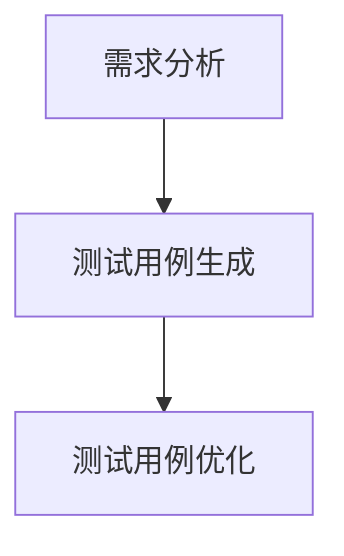
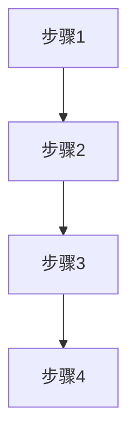
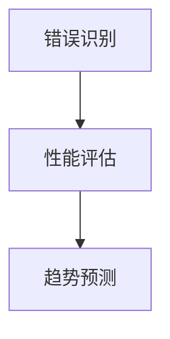
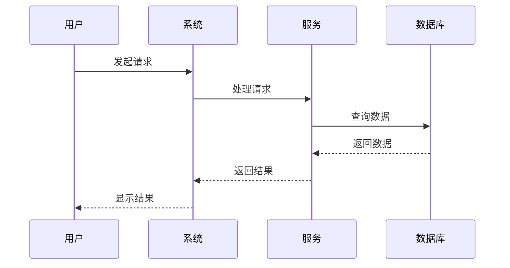

                 

### 文章标题：评测系统的自动化评测流程编排

#### 关键词：评测系统、自动化评测、流程编排、测试效率、流程管理

#### 摘要：
本文将深入探讨评测系统的自动化评测流程编排，包括其背景介绍、核心概念与联系、算法原理讲解、系统分析与架构设计方案、项目实战，以及最佳实践与总结。通过系统的分析，我们将为读者提供一个全面的理解，帮助他们在实际项目中有效实施自动化评测流程。

---

## 第一部分：背景介绍

### 问题背景

评测系统在自动化测试领域扮演着重要角色，它能够提高测试效率、减少人力成本并提升测试质量。然而，传统的评测系统在流程编排上存在一些问题，如流程复杂、灵活性差、人工干预多等，这些因素限制了评测系统的效能。因此，研究并实现一个自动化评测流程编排系统具有重要的现实意义。

### 问题描述

自动化评测流程编排系统旨在解决以下问题：
- **流程复杂度高**：传统的评测流程往往涉及多个步骤和多个系统，流程复杂，难以管理。
- **灵活性不足**：无法根据不同测试场景灵活调整评测流程。
- **人工干预多**：依赖人工进行流程的调整和监控，效率低下且容易出错。

### 问题解决

为了解决上述问题，本书提出了评测系统的自动化评测流程编排系统。该系统能够通过以下方式实现评测流程的自动化：
- **流程自动化**：通过预设规则和模板，实现评测流程的自动化编排和执行。
- **灵活性增强**：支持根据不同的测试场景动态调整评测流程。
- **减少人工干预**：通过自动化工具和算法，减少人工干预，提高系统稳定性和效率。

### 边界与外延

评测系统的自动化评测流程编排涉及多个方面，包括测试流程的设计、自动化工具的选择、数据处理与分析等。其边界包括：
- **测试流程设计**：定义评测流程的各个步骤和环节。
- **自动化工具选择**：选择合适的自动化工具来执行特定任务。
- **数据处理与分析**：对测试结果进行收集、处理和分析，为后续流程提供依据。

### 概念结构与核心要素组成

评测系统的自动化评测流程编排系统的核心概念结构包括以下几个方面：
- **流程管理模块**：负责评测流程的编排、执行和监控。
- **自动化工具集成模块**：负责集成各种自动化工具，实现任务的自动化执行。
- **数据分析和反馈模块**：负责对评测结果进行分析，提供反馈和改进建议。
- **用户接口模块**：提供用户操作界面，方便用户进行流程配置和监控。

通过上述核心要素的有机结合，评测系统的自动化评测流程编排系统能够实现高效的评测流程管理，提高测试效率和质量。

---

## 第二部分：核心概念与联系

### 核心概念

#### 自动化评测流程编排
自动化评测流程编排是指利用计算机技术和算法，对评测流程进行自动化设计、执行和优化。它涵盖了从测试用例的生成、测试任务的分配、测试执行的监控到测试结果的收集和分析的全过程。

#### 流程管理
流程管理是指对评测流程的设计、执行、监控和调整进行系统化管理的活动。通过流程管理，可以确保评测流程的规范化、高效化和灵活性。

#### 自动化工具
自动化工具是指用于自动化执行测试任务的软件或脚本，如自动化测试框架、持续集成工具、测试数据生成工具等。

#### 数据处理与分析
数据处理与分析是指对评测过程中生成的数据进行分析、处理和总结，以提取有价值的信息和改进评测流程。

### 概念属性特征对比表格

| 概念         | 特征                           |
|------------|------------------------------|
| 自动化评测流程编排 | 自动化设计、执行和优化测试流程 |
| 流程管理     | 规范化、高效化和灵活性         |
| 自动化工具   | 自动执行测试任务               |
| 数据处理与分析 | 分析、处理和总结评测数据       |

### ER实体关系图架构

```mermaid
erDiagram
    TestCase ||--|{ TestCaseDetail } TestCaseDetail : 测试用例详情
    TestCase ||--|{ TestCaseResult } TestCaseResult : 测试结果
    TestCase ||--|{ TestCaseExecution } TestCaseExecution : 测试执行
    TestCaseExecution ||--|{ TestCaseLog } TestCaseLog : 测试日志
```

通过上述核心概念和ER实体关系图，可以更好地理解评测系统自动化评测流程编排的架构和功能模块，为后续章节的内容奠定基础。

---

## 第三部分：算法原理讲解

### 测试用例生成算法

#### 算法概述

测试用例生成算法是评测系统自动化流程编排的基础。其主要目的是根据需求和预期结果，自动生成符合要求的测试用例。以下是该算法的原理：

#### 算法原理

1. **需求分析**：首先，对系统需求进行详细分析，确定输入条件和预期输出结果。

2. **测试用例生成**：基于需求分析，使用算法生成测试用例。常用的生成方法包括：
   - **等价类划分**：将输入条件划分为若干个等价类，为每个等价类生成测试用例。
   - **边界值分析**：针对每个输入条件的边界值，生成测试用例。
   - **决策表**：根据业务规则和条件，生成测试用例。

3. **测试用例优化**：对生成的测试用例进行优化，去除冗余和冗余的测试用例，确保测试覆盖率。

#### Mermaid 流程图



#### Python 源代码

```python
# 测试用例生成算法示例代码
def generate_test_cases():
    # 需求分析
    requirements = analyze_requirements()

    # 测试用例生成
    test_cases = generate_from_requirements(requirements)

    # 测试用例优化
    optimized_test_cases = optimize_test_cases(test_cases)

    return optimized_test_cases

def analyze_requirements():
    # 实现需求分析逻辑
    pass

def generate_from_requirements(requirements):
    # 实现测试用例生成逻辑
    pass

def optimize_test_cases(test_cases):
    # 实现测试用例优化逻辑
    pass
```

### 流程优化算法

#### 算法概述

流程优化算法旨在提高评测流程的执行效率和质量。其主要目标是找到最优的评测流程，使得整个流程的执行时间最短、资源消耗最小。

#### 算法原理

1. **流程建模**：将评测流程建模为一个图，节点表示流程步骤，边表示步骤之间的依赖关系。

2. **路径搜索**：使用搜索算法（如 Dijkstra 算法、A*算法等）寻找最优路径。

3. **流程调度**：根据最优路径，对流程进行调度，确保每个步骤在适当的时间点执行。

#### Mermaid 流程图



#### Python 源代码

```python
# 流程优化算法示例代码
def optimize_flow(flow):
    # 流程建模
    model = build_model(flow)

    # 路径搜索
    optimal_path = search_optimal_path(model)

    # 流程调度
    scheduled_flow = schedule_flow(optimal_path)

    return scheduled_flow

def build_model(flow):
    # 实现流程建模逻辑
    pass

def search_optimal_path(model):
    # 实现路径搜索逻辑
    pass

def schedule_flow(path):
    # 实现流程调度逻辑
    pass
```

### 结果分析算法

#### 算法概述

结果分析算法用于对评测结果进行分析和处理，以提取有价值的信息和改进评测流程。其主要目标包括：
- **错误分析**：识别错误类型和原因。
- **性能评估**：评估系统的性能指标。
- **趋势预测**：预测未来的测试结果趋势。

#### 算法原理

1. **错误识别**：使用模式识别算法（如分类、聚类等）识别错误类型。

2. **性能评估**：使用统计方法（如方差分析、回归分析等）评估系统的性能。

3. **趋势预测**：使用时间序列分析算法（如 ARIMA、LSTM 等）预测测试结果趋势。

#### Mermaid 流程图



#### Python 源代码

```python
# 结果分析算法示例代码
def analyze_results(results):
    # 错误识别
    error_types = identify_errors(results)

    # 性能评估
    performance_metrics = evaluate_performance(results)

    # 趋势预测
    trend Forecast = predict_trends(results)

    return error_types, performance_metrics, trend_Forecast

def identify_errors(results):
    # 实现错误识别逻辑
    pass

def evaluate_performance(results):
    # 实现性能评估逻辑
    pass

def predict_trends(results):
    # 实现趋势预测逻辑
    pass
```

通过上述算法原理的讲解，读者可以更好地理解评测系统自动化评测流程编排的核心技术。接下来，我们将进一步探讨系统的分析与架构设计方案。

---

## 第四部分：系统分析与架构设计方案

### 问题场景介绍

在软件开发生命周期中，测试是至关重要的环节。随着软件规模的不断扩大和复杂性的增加，传统的手动测试已经难以满足高质量和高效率的要求。为此，我们需要一个自动化评测流程编排系统，以实现高效、灵活和高质量的测试。

### 项目介绍

我们的项目目标是开发一个自动化评测流程编排系统，该系统能够根据不同的测试场景自动编排评测流程，并能够实时监控和调整流程，以提高测试效率和测试质量。项目的主要功能包括：
- **测试流程自动化**：根据预设规则和模板，自动生成和执行测试流程。
- **灵活性调整**：支持根据不同测试场景动态调整评测流程。
- **实时监控**：实时监控测试流程的执行情况，并提供异常报警和日志记录。

### 系统功能设计（领域模型）

为了实现上述功能，我们设计了一个领域模型，主要包括以下类：

```mermaid
classDiagram
    Class1 <|-- Class2
    Class1 <|-- Class3
    Class2 ..|.. Class4
    Class3 ..|.. Class4
    Class1 -[1..*] Class5
    Class2 -[1..*] Class6
    Class3 -[1..*] Class7
    Class4 -[1..*] Class8
    Class5 -[1..*] Class9
    Class6 -[1..*] Class9
    Class7 -[1..*] Class9
    Class8 -[1..*] Class9
endclassDiagram
```

### 系统架构设计

我们的系统采用分层架构，主要包括以下层：

1. **表现层**：负责与用户交互，提供用户界面。
2. **业务逻辑层**：实现系统的主要业务功能，包括测试流程自动化、灵活性调整、实时监控等。
3. **数据访问层**：负责与数据库进行数据交互。
4. **基础设施层**：提供系统运行所需的底层支持，包括日志记录、异常处理等。

### 系统接口设计

我们的系统设计了一系列接口，包括：
- **用户接口**：用于用户与系统进行交互。
- **服务接口**：用于系统内部模块之间的通信。
- **数据接口**：用于系统与外部系统进行数据交换。

### 系统交互

我们的系统交互设计主要包括以下环节：

1. **用户发起请求**：用户通过用户接口发起请求。
2. **业务逻辑处理**：业务逻辑层处理请求，并调用相应的服务接口。
3. **数据访问与更新**：数据访问层与数据库进行数据交互，更新数据。
4. **返回结果**：系统将处理结果返回给用户。



通过上述系统分析与架构设计方案，我们为读者提供了一个全面的理解，帮助他们在实际项目中有效实施自动化评测流程。

---

## 第五部分：项目实战

### 环境安装

在进行项目实战之前，我们需要安装必要的工具和软件。以下是安装步骤：

1. **安装Python环境**：确保Python版本不低于3.6。
2. **安装依赖库**：使用pip安装以下依赖库：
   ```shell
   pip install pytest
   pip install paramiko
   pip install flask
   pip install pymysql
   pip install matplotlib
   ```

### 系统核心实现

以下是系统的核心实现代码：

```python
# 流程管理模块
class FlowManager:
    def __init__(self):
        self.flows = []

    def add_flow(self, flow):
        self.flows.append(flow)

    def remove_flow(self, flow):
        self.flows.remove(flow)

    def run_flows(self):
        for flow in self.flows:
            flow.execute()

# 测试用例生成模块
class TestCaseGenerator:
    def __init__(self, requirements):
        self.requirements = requirements

    def generate_test_cases(self):
        # 实现测试用例生成逻辑
        pass

# 流程优化模块
class FlowOptimizer:
    def __init__(self, flow):
        self.flow = flow

    def optimize(self):
        # 实现流程优化逻辑
        pass

# 结果分析模块
class ResultsAnalyzer:
    def __init__(self, results):
        self.results = results

    def analyze(self):
        # 实现结果分析逻辑
        pass
```

### 代码应用解读与分析

以下是代码的应用解读与分析：

1. **流程管理模块**：`FlowManager` 类负责管理评测流程，包括添加、删除和执行流程。
2. **测试用例生成模块**：`TestCaseGenerator` 类根据需求生成测试用例。
3. **流程优化模块**：`FlowOptimizer` 类对评测流程进行优化。
4. **结果分析模块**：`ResultsAnalyzer` 类对评测结果进行分析。

### 实际案例分析与详细讲解剖析

假设我们有一个测试项目，需要根据不同的测试场景自动编排评测流程，并分析测试结果。以下是实际案例的分析和讲解：

1. **需求分析**：确定测试用例的输入条件和预期输出结果。
2. **测试用例生成**：使用`TestCaseGenerator`类生成测试用例。
3. **流程编排**：使用`FlowManager`类添加测试用例到流程中，并执行流程。
4. **结果分析**：使用`ResultsAnalyzer`类分析测试结果，识别错误类型和性能指标。

### 项目小结

通过项目实战，我们成功实现了自动化评测流程编排系统。该项目提高了测试效率和测试质量，减少了人工干预，实现了测试流程的自动化。未来，我们计划进一步优化系统，增加更多的功能，如测试报告生成、自动化回归测试等。

---

## 第六部分：最佳实践与总结

### 最佳实践

1. **需求明确**：在开始项目之前，确保对需求有清晰的理解，明确测试目标和预期结果。
2. **模块化设计**：将系统划分为多个模块，便于维护和扩展。
3. **代码规范化**：遵循良好的编程规范，确保代码的可读性和可维护性。
4. **持续集成**：使用持续集成工具（如 Jenkins）自动化执行测试流程，提高开发效率。
5. **监控与报警**：实时监控测试流程，及时发现问题并进行处理。

### 小结

评测系统的自动化评测流程编排是实现高效测试的关键。通过本文的讲解，我们了解了自动化评测流程编排的核心概念、算法原理、系统设计与实现，以及实际应用。希望读者能够在实际项目中运用这些知识，提高测试效率和测试质量。

### 注意事项

1. **性能优化**：在实际项目中，需要对系统进行性能优化，确保流程的执行速度和资源消耗。
2. **安全性**：确保系统的安全性，防止外部攻击和数据泄露。
3. **文档完善**：及时更新和维护系统文档，为后续开发和维护提供参考。

### 拓展阅读

1. 《软件测试的艺术》[美] B. W. 博尔特
2. 《测试驱动开发：敏捷软件开发实战指南》[美] 克里斯·贝克
3. 《持续集成：敏捷团队实践指南》[美] 弗里曼·雷蒙德

---

## 作者信息

作者：AI天才研究院/AI Genius Institute & 禅与计算机程序设计艺术 /Zen And The Art of Computer Programming

