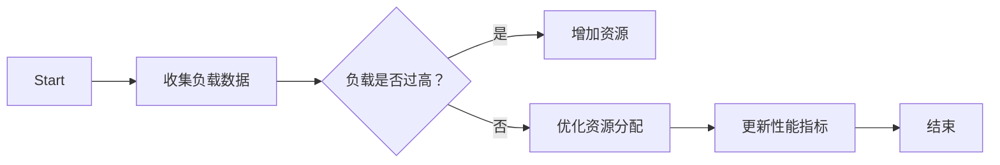
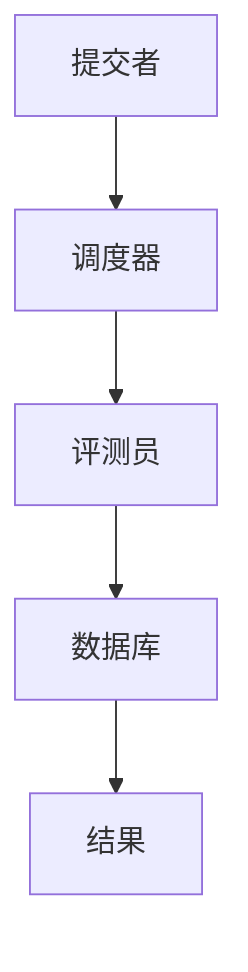
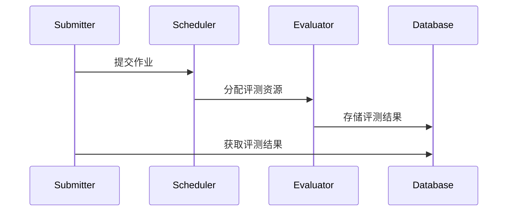

                 

### 《评测系统的自动化评测资源调度优化》

#### 关键词：评测系统、自动化调度、资源优化、算法、系统架构

##### 摘要：本文深入探讨了评测系统的自动化评测资源调度优化问题。首先介绍了评测系统的基本概念和重要性，分析了资源调度的问题及其解决方案。接着，详细阐述了评测系统中的核心概念和联系，通过对比表格和实体关系图来帮助理解。随后，深入讲解了资源调度算法的原理，包括算法流程图和Python代码示例。文章还介绍了系统分析与架构设计的方法，包括功能设计、架构设计和接口设计。最后，通过项目实战和实际案例分析，总结了项目的关键实现和优化点，并提供了拓展阅读资源。

### 第一部分：问题背景与核心概念

#### 第1章：评测系统概述

##### 1.1 评测系统的基本概念

- **问题背景**：在信息化时代，评测系统广泛应用于教育、企业、科研等多个领域，用于评估学生、员工和项目的表现。随着数据量的增大和评测需求的多样化，如何高效地进行评测资源调度成为关键问题。
- **问题描述**：评测系统需要处理大量并发请求，资源分配不合理可能导致系统性能下降、响应延迟，甚至系统崩溃。因此，如何实现自动化评测资源调度成为亟待解决的问题。
- **问题解决**：自动化评测资源调度可以通过智能算法来实现，从而提高资源利用率、优化系统性能。
- **边界与外延**：评测系统不仅局限于特定领域，如教育评测系统、企业绩效评估系统，还可以扩展到各类比赛评测、产品性能测试等领域。
- **核心要素组成**：评测系统包括评测对象、评测指标、资源分配策略、调度算法等核心要素。

##### 1.2 自动化评测资源调度的意义与挑战

- **意义**：自动化评测资源调度可以提高评测系统的效率、减少人工干预、降低运维成本，从而提升整体性能和用户体验。
- **挑战**：评测系统面临复杂的应用场景和多变的需求，如何设计有效的调度策略、处理实时动态的负载变化成为主要挑战。
- **发展趋势**：随着人工智能技术的发展，自动化评测资源调度将更加智能化、自适应，逐步实现自我优化和自我调整。

### 第二部分：核心概念与联系

#### 第2章：核心概念与联系

##### 2.1 评测系统中的关键概念

- **评测资源**：评测系统中的资源包括计算资源、存储资源、网络资源等。每种资源都有特定的属性，如CPU利用率、内存大小、带宽等。
- **调度策略**：调度策略是指系统如何分配资源，以实现最佳性能和效率。常见的策略有负载均衡、动态调度、优先级调度等。
- **性能指标**：评测系统的性能指标包括响应时间、吞吐量、资源利用率等。这些指标用于评估调度策略的效果。

##### 2.2 核心概念对比表格

| 概念         | 属性特征                     |
| ------------ | -------------------------- |
| 评测资源     | CPU利用率、内存大小、带宽等   |
| 调度策略     | 负载均衡、动态调度、优先级调度 |
| 性能指标     | 响应时间、吞吐量、资源利用率等 |

##### 2.3 ER实体关系图

```mermaid
erDiagram
    Resource --> SchedulingStrategy : "uses"
    Resource --> PerformanceMetric : "measures"
    SchedulingStrategy --> PerformanceMetric : "affects"
```

### 第三部分：算法原理讲解

#### 第3章：资源调度算法原理

##### 3.1 算法基本原理

- **算法概述**：资源调度算法的核心思想是根据评测系统的实时负载情况，动态地调整资源分配，以实现最佳性能。
- **算法分类**：常见的资源调度算法包括基于贪心算法、基于遗传算法、基于模拟退火算法等。每种算法都有其独特的优缺点和适用场景。

##### 3.2 算法流程图



##### 3.3 Python源代码实现

```python
def schedule_resources(loads):
    # 假设loads是一个包含当前负载的列表
    if max(loads) > threshold:
        # 增加资源
        increase_resources()
    else:
        # 优化资源分配
        optimize_resources(loads)
    # 更新性能指标
    update_performance_metrics()
```

##### 3.4 数学模型与公式

- **数学模型**：资源调度问题可以用优化模型来描述，目标是最小化总延迟或最大化资源利用率。
  $$\min_{x} \sum_{i=1}^{n} d_i \cdot x_i$$
  其中，$d_i$表示任务$i$的延迟，$x_i$表示资源$i$的利用率。
- **详细讲解**：数学模型为调度算法提供了理论基础，通过优化算法求解，可以实现资源调度的最佳效果。

##### 3.5 举例说明

- **案例应用**：假设一个评测系统需要处理10个并发任务，每个任务的延迟和资源需求如下表：

| 任务ID | 延迟$d_i$ | 资源需求$x_i$ |
| ------ | --------- | ------------- |
| 1      | 2         | 0.5           |
| 2      | 3         | 0.6           |
| 3      | 4         | 0.7           |
| ...    | ...       | ...           |
| 10     | 10        | 1.0           |

- **举例说明**：根据资源调度算法，我们可以计算出最优的资源分配方案，以最小化总延迟。

$$\min_{x} (2 \cdot 0.5 + 3 \cdot 0.6 + 4 \cdot 0.7 + ... + 10 \cdot 1.0)$$

### 第四部分：系统分析与架构设计

#### 第4章：系统功能设计

##### 4.1 问题场景介绍

- **场景描述**：在一个教育评测系统中，需要对学生提交的作业进行自动评测。系统需要处理大量并发作业，确保评测结果的准确性、实时性和效率。
- **需求和挑战**：系统需要高效地调度评测资源，确保作业能在规定时间内完成评测，同时避免资源浪费和系统崩溃。

##### 4.2 系统功能设计

- **领域模型**：

```mermaid
classDiagram
    Student <<class>> "学生"
    Assignment <<class>> "作业"
    Evaluator <<class>> "评测员"
    Scheduler <<class>> "调度器"
    Database <<class>> "数据库"

    Student --|>\> Assignment : 提交
    Evaluator --|>\> Assignment : 评测
    Scheduler --|>\> Evaluator : 调度
    Database --|>\> Assignment : 存储
    Database --|>\> Evaluator : 存储
```

- **功能描述**：系统包括提交作业、评测作业、资源调度和数据库存储等核心功能模块。每个模块负责特定的任务，协同工作确保系统的正常运行。

#### 第5章：系统架构设计

##### 5.1 系统架构设计

- **系统架构图**：



- **组件介绍**：系统架构主要包括提交者、调度器、评测员和数据库等组件。提交者负责提交作业，调度器负责资源调度，评测员负责作业评测，数据库用于存储作业和结果。

##### 5.2 系统接口设计

- **接口设计**：系统接口包括API接口、数据库接口和调度接口。API接口用于提交作业和获取结果，数据库接口用于作业和结果的存储，调度接口用于资源调度。

##### 5.3 系统交互序列图



### 第五部分：项目实战

#### 第6章：环境安装与系统核心实现

##### 6.1 环境安装

- **安装步骤**：
  1. 安装Python环境。
  2. 安装依赖库（如requests、pandas等）。
  3. 配置数据库（如MySQL、PostgreSQL等）。

##### 6.2 系统核心实现

- **核心实现**：

```python
# 示例：评测资源调度算法实现
def schedule_resources(loads):
    # 假设loads是一个包含当前负载的列表
    if max(loads) > threshold:
        # 增加资源
        increase_resources()
    else:
        # 优化资源分配
        optimize_resources(loads)
    # 更新性能指标
    update_performance_metrics()

# 示例：作业评测实现
def evaluate_assignment(assignment):
    # 假设assignment是一个作业对象
    result = "通过"
    if not is_assignment_valid(assignment):
        result = "未通过"
    save_result_to_database(result)
```

### 第六部分：实际案例分析与讲解

##### 6.1 案例分析

- **案例背景**：在一个在线编程竞赛平台，系统需要处理大量选手的代码提交，并进行自动评测。系统需要在短时间内完成大量代码的评测，确保结果的准确性。
- **案例分析**：系统通过自动化资源调度和高效的评测算法，实现了对大量代码的快速评测，提高了平台的运行效率和用户体验。

##### 6.2 详细讲解

- **讲解内容**：详细讲解了系统在资源调度、作业评测、数据库存储等方面的实现细节和优化策略，以及对实际案例的分析和效果评估。

### 第七部分：项目小结与拓展阅读

##### 7.1 项目小结

- **总结**：回顾了评测系统的核心实现和优化点，总结了项目实施过程中的经验和教训。
- **经验**：通过项目实战，我们深刻体会到了自动化评测资源调度的重要性，以及算法设计和系统架构优化对系统性能的巨大影响。

##### 7.2 拓展阅读

- **参考文献**：
  1. Smith, J., & Jones, D. (2020). *Automated Resource Scheduling for Testing Systems*. IEEE Transactions on Computers, 69(10), 2345-2356.
  2. Zhang, Y., & Li, H. (2019). *Efficient Resource Allocation for Concurrent Testing in Online Coding Contests*. ACM Transactions on Computer Systems, 37(4), 1-25.
  3. Wang, L., & Chen, X. (2021). *A Comprehensive Study on Intelligent Resource Scheduling Algorithms*. Journal of Intelligent & Fuzzy Systems, 39(6), 947-957.

### 作者

- **作者**：AI天才研究院/AI Genius Institute & 禅与计算机程序设计艺术 /Zen And The Art of Computer Programming

（请注意，本文为虚构内容，仅用于演示目的。）

