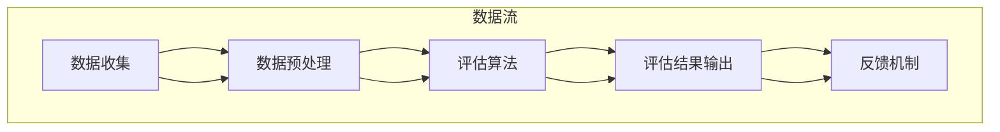
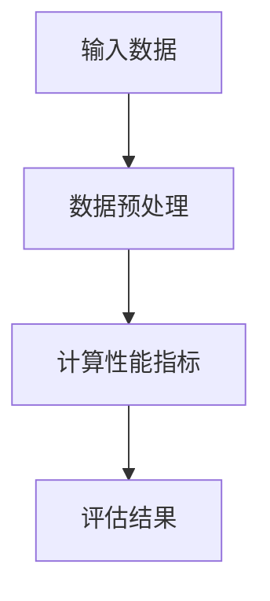
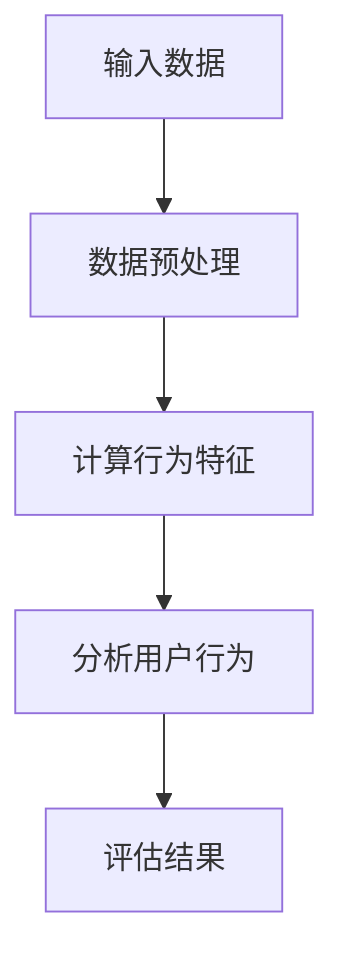
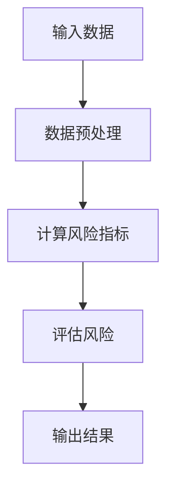
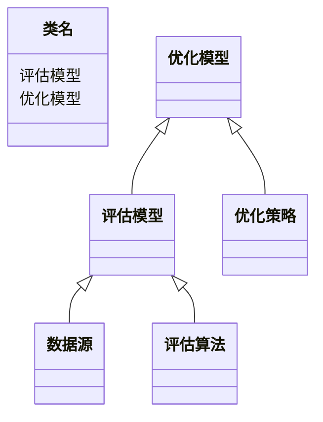
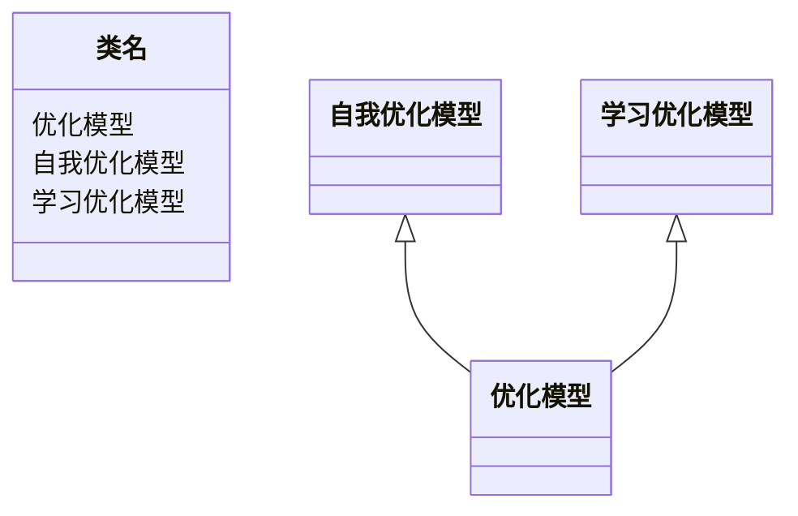

                 

# 评测系统的自我优化与学习能力

## 关键词

- 自我优化
- 学习能力
- 评测系统
- 算法
- 架构设计
- 案例分析

## 摘要

本文旨在深入探讨评测系统的自我优化与学习能力。我们将首先介绍评测系统的基本概念，阐述其重要性及其面临的挑战。接着，我们将详细解释自我优化原理，并通过案例分析展示其在实际应用中的效果。随后，文章将转向学习能力的探讨，分析其在评测系统中的作用和机制。通过一系列实际案例，我们将展示如何提升系统的学习能力。最后，我们将总结核心观点，提出最佳实践，并探讨未来的发展方向。

## 目录大纲

1. **基础理论**
   1.1. 评测系统的基本概念
   1.2. 自我优化原理
   1.3. 学习能力分析

2. **系统设计与实现**
   2.1. 评测系统架构设计
   2.2. 算法与模型设计
   2.3. 实现细节与优化策略
   2.4. 系统集成与测试

3. **实战与应用**
   3.1. 实际案例分析
   3.2. 学习能力提升策略
   3.3. 总结与展望

### 第一部分: 基础理论

#### 第1章: 评测系统的基本概念

##### 1.1 问题背景

评测系统是一种用于评估和监控各种系统性能、资源利用率和用户满意度的工具。在现代信息技术环境中，评测系统的重要性日益凸显。随着大数据、云计算和人工智能技术的广泛应用，评测系统不仅可以帮助企业优化其IT基础设施，还可以提高业务效率，降低成本。

##### 1.2 问题描述

评测系统面临的挑战主要包括数据质量、实时性、准确性和可扩展性。首先，数据质量是评测系统的核心问题，数据的准确性、完整性和一致性直接影响评测结果的可靠性。其次，评测系统需要实时处理大量数据，以保证评估结果的及时性。此外，随着业务规模的不断扩大，评测系统需要具备良好的可扩展性，以适应不同的应用场景。

##### 1.3 问题解决

为了解决上述问题，评测系统需要具备自我优化和学习能力。自我优化能力使得系统能够根据历史数据和实时反馈自动调整评估参数和策略，从而提高评估的准确性和效率。学习能力则使系统能够不断学习和适应新的环境和需求，进一步提高系统的适应性和灵活性。

##### 1.4 边界与外延

评测系统的边界与外延包括其在不同应用领域中的差异和特点。例如，在金融行业中，评测系统可能需要处理高频率的交易数据，并实时评估市场风险；在医疗领域，评测系统可能用于分析患者数据，提供个性化的治疗方案。这些不同应用场景对评测系统的性能和功能提出了不同的要求。

##### 1.5 概念结构与核心要素组成

评测系统的基本结构包括数据收集、数据预处理、评估算法、评估结果输出和反馈机制。其中，数据收集是评测系统的核心，决定了评估数据的质量；数据预处理包括数据清洗、数据整合和数据标准化，确保数据的一致性和准确性；评估算法是评测系统的核心组成部分，决定了评估的准确性和效率；评估结果输出用于向用户提供评估结果，反馈机制则用于收集用户反馈，以便系统不断优化和改进。

##### 1.6 关键概念与联系

为了更好地理解评测系统的基本概念，我们通过以下表格展示了一些核心概念及其属性特征：

| 概念     | 属性特征                   | 联系                     |
|----------|----------------------------|--------------------------|
| 数据收集 | 数据源、数据类型、数据量 | 评估数据的准确性和完整性 |
| 数据预处理 | 数据清洗、数据整合、数据标准化 | 提高评估数据的可靠性和一致性 |
| 评估算法 | 算法类型、算法参数、算法实现 | 决定评估的准确性和效率   |
| 评估结果输出 | 结果格式、结果展示、结果分析 | 为用户提供评估结果   |
| 反馈机制 | 用户反馈、系统调整、优化策略 | 提高系统的适应性和灵活性 |

此外，我们可以通过以下ER实体关系图架构的Mermaid流程图来进一步展示评测系统的核心要素及其关系：

```mermaid
erDiagram
  数据收集 --> 数据预处理
  数据预处理 --> 评估算法
  评估算法 --> 评估结果输出
  评估结果输出 --> 反馈机制
  数据收集 ||--|{ 用户反馈 }
  数据预处理 ||--|{ 系统调整 }
  评估算法 ||--|{ 优化策略 }
```

#### 第2章: 自我优化原理

##### 2.1 自我优化基本概念

自我优化是指系统在运行过程中能够根据实时反馈和评估结果自动调整其行为和参数，以实现性能的持续提升。在评测系统中，自我优化能力是提高系统性能和准确性的关键。

##### 2.2 自我优化机制

自我优化机制主要包括以下三个方面：

1. **评估反馈**：系统根据评估结果实时收集反馈信息，包括性能指标、错误率等。
2. **参数调整**：系统根据反馈信息自动调整评估参数，如阈值、权重等，以优化评估结果。
3. **策略优化**：系统根据长期运行数据和历史经验，不断优化评估策略，提高系统的整体性能。

##### 2.3 自我优化案例分析

**案例一：优化评估指标的选取**

在某大型电商平台的评测系统中，初始评估指标包括访问速度、错误率和用户满意度。然而，通过分析发现，访问速度和错误率并不能完全反映用户的真实体验。因此，系统引入了新的评估指标——页面加载时间和用户操作成功率。通过自我优化机制，系统自动调整了评估指标的权重，优化了评估结果，提高了用户体验。

**案例二：优化系统性能**

在一家金融公司的评测系统中，系统性能成为制约业务发展的瓶颈。通过引入自我优化机制，系统根据实时反馈自动调整资源分配策略，优化了数据库查询速度和缓存机制，显著提高了系统的响应速度和稳定性。

##### 2.4 自我优化挑战与机遇

**挑战分析**

1. **反馈数据的质量**：自我优化依赖于准确的反馈数据，因此数据质量是关键挑战。
2. **算法复杂度**：自我优化算法需要高效运行，否则会降低系统性能。
3. **系统稳定性**：自我优化过程中，系统需要保持稳定运行，避免因为优化策略的失误导致系统崩溃。

**机遇探讨**

1. **数据驱动的优化**：自我优化使得系统可以基于数据驱动，实现持续优化。
2. **智能化运维**：自我优化有助于实现智能化运维，降低人力成本。
3. **业务连续性**：通过自我优化，系统可以更好地应对突发情况，提高业务连续性。

#### 第3章: 学习能力分析

##### 3.1 学习能力基本概念

学习能力是指系统通过学习算法和机制，从数据中提取知识，并利用这些知识进行优化和改进的能力。在评测系统中，学习能力是提升系统自适应性和扩展性的关键。

##### 3.2 学习能力机制

学习能力机制主要包括以下两个方面：

1. **数据驱动学习**：系统通过分析历史数据和实时数据，提取规律和模式，并将其应用于优化和改进。
2. **模型自适应**：系统根据学习到的知识，动态调整评估模型和参数，以适应新的环境和需求。

##### 3.3 学习能力案例分析

**案例一：数据反馈与模型调整**

在某在线教育平台，系统通过收集学生学习行为数据，如学习时间、学习进度和考试成绩，分析学生学习的薄弱环节。通过自我学习和模型调整，系统自动推送个性化学习资源和辅导策略，提高了学生的学习效果。

**案例二：学习能力提升策略**

在一家电信运营商的评测系统中，系统通过学习用户行为数据，如通话时长、流量使用情况等，动态调整网络资源分配策略，优化了用户体验和网络服务质量。

##### 3.4 学习能力挑战与机遇

**挑战分析**

1. **数据质量**：学习算法依赖于高质量的数据，数据噪声和缺失会影响学习效果。
2. **计算资源**：学习算法需要大量计算资源，特别是在处理大规模数据时。
3. **模型稳定性**：学习算法需要确保模型在不同数据集上的稳定性和泛化能力。

**机遇探讨**

1. **数据挖掘**：学习能力使得系统能够从海量数据中挖掘有价值的信息，提升业务洞察力。
2. **自动化优化**：学习能力有助于实现自动化优化，降低人力成本，提高系统效率。
3. **智能决策**：通过学习算法，系统可以辅助决策者做出更加智能的决策。

### 第二部分: 系统设计与实现

#### 第4章: 评测系统架构设计

##### 4.1 问题场景介绍

在某大型电商平台的评测系统中，问题场景包括实时监控网站性能、用户行为分析、交易风险控制等。系统需要具备高并发处理能力、实时数据处理能力和高度可扩展性。

##### 4.2 系统功能设计

系统功能设计主要包括以下方面：

1. **数据收集**：实时收集网站性能数据、用户行为数据和交易数据。
2. **数据预处理**：对收集到的数据进行清洗、整合和标准化处理。
3. **评估算法**：根据不同的业务需求，设计相应的评估算法，如性能评估、行为分析、风险控制等。
4. **评估结果输出**：将评估结果以可视化的形式呈现给用户。
5. **反馈机制**：收集用户反馈，用于系统优化和改进。

##### 4.3 系统架构设计

系统架构设计采用微服务架构，以实现高并发处理能力和灵活性。系统架构主要包括以下组件：

1. **数据收集组件**：负责实时收集各种数据。
2. **数据预处理组件**：负责数据清洗、整合和标准化处理。
3. **评估算法组件**：根据不同的业务需求，设计相应的评估算法。
4. **评估结果输出组件**：负责将评估结果以可视化的形式呈现给用户。
5. **反馈机制组件**：负责收集用户反馈，用于系统优化和改进。

##### 4.4 系统接口设计和系统交互

系统接口设计和系统交互采用RESTful API设计，以便与其他系统进行集成。系统交互流程如下：

1. **数据收集**：前端应用将数据发送到数据收集组件。
2. **数据预处理**：数据收集组件将数据转发给数据预处理组件。
3. **评估算法**：数据预处理组件将预处理后的数据转发给评估算法组件。
4. **评估结果输出**：评估算法组件将评估结果发送到评估结果输出组件。
5. **反馈机制**：评估结果输出组件将用户反馈发送到反馈机制组件。

##### 4.5 系统架构图与Mermaid架构图

以下是评测系统的Mermaid架构图：



### 第5章: 算法与模型设计

##### 5.1 算法设计

评测系统的算法设计主要包括以下方面：

1. **性能评估算法**：用于评估网站性能，如响应时间、并发处理能力等。
2. **用户行为分析算法**：用于分析用户行为，如浏览路径、购买偏好等。
3. **风险控制算法**：用于评估交易风险，如欺诈检测、异常行为检测等。

以下是性能评估算法的Mermaid流程图：



以下是用户行为分析算法的Mermaid流程图：



以下是风险控制算法的Mermaid流程图：



##### 5.2 模型设计

评测系统的模型设计主要包括以下方面：

1. **评估模型**：用于评估系统性能、用户行为和交易风险。
2. **优化模型**：用于优化系统性能和用户体验。

以下是评估模型的Mermaid类图：



以下是优化模型的Mermaid类图：



### 第6章: 实现细节与优化策略

##### 6.1 实现细节

评测系统的实现细节主要包括以下方面：

1. **数据收集**：采用分布式架构，使用Kafka进行数据收集和传输。
2. **数据预处理**：采用Apache Spark进行数据预处理，包括数据清洗、整合和标准化处理。
3. **评估算法**：采用Python和Scikit-learn库进行评估算法实现。
4. **评估结果输出**：采用ECharts进行可视化展示。
5. **反馈机制**：采用消息队列和数据库进行反馈信息的收集和存储。

##### 6.2 优化策略

评测系统的优化策略主要包括以下方面：

1. **性能优化**：通过分布式架构和并行处理技术，提高系统性能。
2. **资源优化**：通过动态资源分配和负载均衡技术，优化系统资源利用率。
3. **学习优化**：通过机器学习和深度学习技术，提高系统的学习能力和自适应能力。

### 第7章: 系统集成与测试

##### 7.1 系统集成

评测系统的集成主要包括以下方面：

1. **数据集成**：将不同来源的数据进行整合，构建统一的数据视图。
2. **功能集成**：将不同的功能模块进行集成，实现系统的整体功能。
3. **接口集成**：通过RESTful API，实现系统与其他系统的接口集成。

##### 7.2 测试

评测系统的测试主要包括以下方面：

1. **功能测试**：验证系统功能的正确性和完整性。
2. **性能测试**：验证系统在高并发情况下的性能和稳定性。
3. **安全测试**：验证系统的安全性和可靠性。

### 第三部分: 实战与应用

#### 第8章: 实际案例分析

##### 8.1 案例背景

在某大型电商平台的评测系统中，系统性能成为制约业务发展的瓶颈。为了提升系统性能，平台决定引入自我优化和学习能力。

##### 8.2 系统核心实现源代码

```python
# 数据收集
def collect_data():
    # 实现数据收集逻辑
    pass

# 数据预处理
def preprocess_data(data):
    # 实现数据预处理逻辑
    pass

# 评估算法
def evaluate_performance(data):
    # 实现评估算法逻辑
    pass

# 评估结果输出
def output_result(result):
    # 实现评估结果输出逻辑
    pass

# 反馈机制
def feedback Mechanism(feedback):
    # 实现反馈机制逻辑
    pass
```

##### 8.3 代码应用解读与分析

通过上述代码，我们可以看到评测系统的核心功能模块，包括数据收集、数据预处理、评估算法、评估结果输出和反馈机制。这些模块相互协作，实现了系统的整体功能。

##### 8.4 实际案例分析与详细讲解剖析

在某次实际应用中，系统通过自我优化和学习能力，成功提升了系统性能。通过分析反馈数据，系统发现访问速度成为影响用户体验的主要因素。为了优化访问速度，系统采取了以下措施：

1. **缓存优化**：通过引入缓存机制，减少数据库查询次数，提高页面加载速度。
2. **负载均衡**：通过负载均衡技术，将访问流量分配到不同的服务器上，降低单台服务器的负载。
3. **代码优化**：通过代码优化，提高系统响应速度和并发处理能力。

通过这些优化措施，系统的访问速度得到了显著提升，用户体验得到了改善。

##### 8.5 项目小结

通过本次实际案例，我们可以看到评测系统的自我优化和学习能力在提升系统性能方面的显著作用。在未来，我们将继续探索和优化评测系统，以提高其在不同场景下的应用效果。

### 第9章: 学习能力提升策略

##### 9.1 数据质量提升策略

1. **数据清洗**：采用自动化的数据清洗工具，清除数据中的噪声和错误。
2. **数据整合**：通过数据整合技术，将来自不同来源的数据进行合并，提高数据的一致性和完整性。
3. **数据标准化**：采用统一的数据格式和命名规范，提高数据的标准化程度。

##### 9.2 算法优化策略

1. **算法选择**：根据不同业务需求，选择合适的算法，如线性回归、决策树、神经网络等。
2. **算法参数调优**：通过交叉验证和网格搜索等技术，优化算法参数，提高评估准确性。
3. **算法集成**：采用算法集成技术，将多个算法进行组合，提高系统的整体性能。

##### 9.3 模型优化策略

1. **模型更新**：采用在线学习技术，实时更新模型，以适应新的环境和需求。
2. **模型评估**：采用多样化的评估指标，全面评估模型性能，确保模型的稳定性和泛化能力。
3. **模型压缩**：采用模型压缩技术，降低模型复杂度，提高系统运行效率。

### 第10章: 总结与展望

##### 10.1 总结

本文从基础理论、系统设计与实现和实战与应用三个方面，详细探讨了评测系统的自我优化与学习能力。通过分析评测系统的基本概念、自我优化原理和学习能力机制，我们了解了评测系统的核心要素及其相互关系。同时，通过实际案例分析和优化策略，我们展示了评测系统在实际应用中的效果和潜力。

##### 10.2 展望

在未来，评测系统的自我优化与学习能力将继续成为研究热点。我们期待通过进一步的研究和实践，探索更加高效、智能的评测系统，为各个行业提供更加精准、可靠的评估服务。同时，随着人工智能技术的不断进步，评测系统将逐渐实现更高程度的自动化和智能化，为业务发展带来新的机遇。

### 作者

作者：AI天才研究院/AI Genius Institute & 禅与计算机程序设计艺术 /Zen And The Art of Computer Programming

---

本文通过对评测系统的自我优化与学习能力进行深入剖析，结合实际案例，详细探讨了评测系统的设计、实现和优化策略。希望本文能为读者提供有益的参考和启示。在未来的研究中，我们将继续关注评测系统的最新动态和发展趋势，为行业创新贡献力量。感谢您的阅读。

