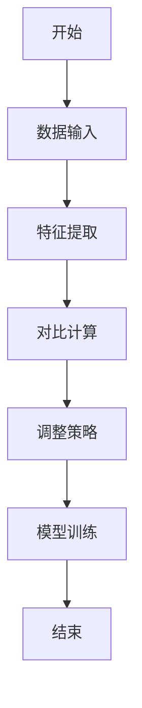
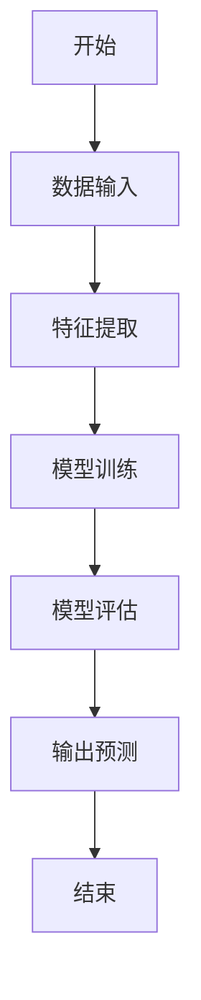
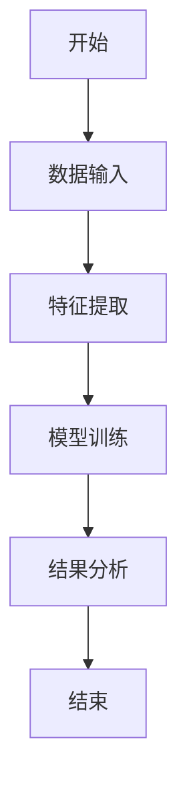
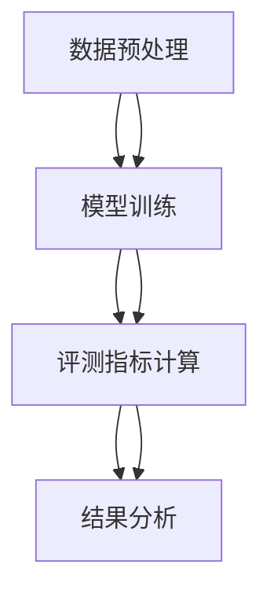
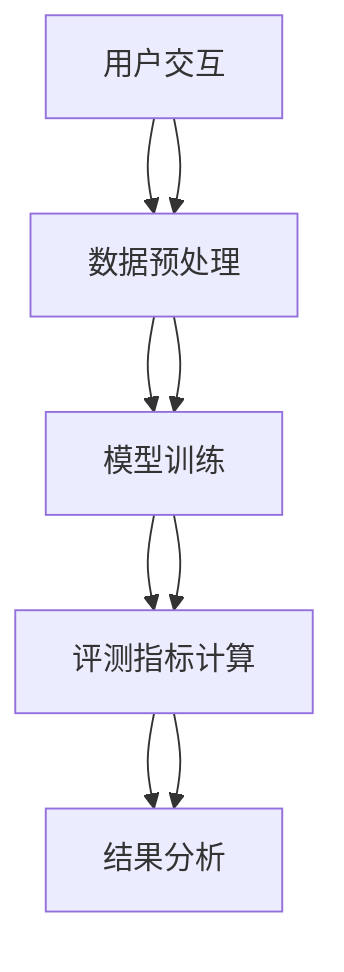
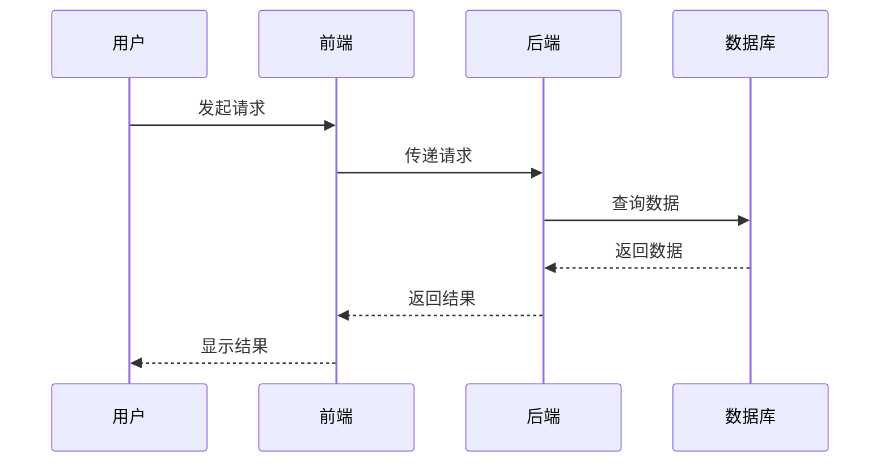

                 

# 《评测系统的自我优化：元学习在LLM评测中的应用》

> 关键词：评测系统、元学习、LLM评测、算法原理、系统架构设计、项目实战

> 摘要：本文深入探讨了评测系统自我优化中的关键概念——元学习，特别是在大型语言模型（LLM）评测中的应用。文章首先介绍了评测系统的基本概念和元学习的核心原理，随后逐步剖析了元学习在LLM评测中的实际应用，并展示了相关的算法原理、数学模型、系统架构设计以及项目实战案例。通过这篇文章，读者可以了解到元学习如何提升评测系统的效率和准确性，为未来的评测系统优化提供新的思路。

## 第一部分：背景与概念

### 第1章：问题背景与核心概念

#### 1.1 评测系统的概述

评测系统是一种用于评估性能、质量、效率等指标的软件工具，广泛应用于各个领域，如软件工程、人工智能、教育等。在人工智能领域，评测系统尤为重要，它不仅用于评估算法的性能，还用于评估模型的质量和可靠性。

##### 1.1.1 评测系统的定义与作用

评测系统是一种用于定量或定性评估目标系统性能或质量的软件工具。它通过收集、处理和分析数据，为用户提供决策支持。

##### 1.1.2 评测系统的发展历程

评测系统的发展历程可以追溯到20世纪80年代，当时主要用于软件工程领域的质量保证。随着计算机技术的进步和人工智能的发展，评测系统逐渐应用到各个领域，如自然语言处理、图像识别等。

#### 1.2 元学习的概念

元学习是一种学习如何学习的方法，其核心思想是通过学习不同任务之间的关联性，提高学习效率。

##### 1.2.1 元学习的定义

元学习是一种学习算法，它能够根据不同的任务和数据，自适应地调整学习策略，以提高学习效率。

##### 1.2.2 元学习的关键技术

元学习的关键技术包括对比学习、监督学习和无监督学习。这些技术通过不同的方式，实现元学习的目标。

#### 1.3 LLM评测的挑战与需求

LLM评测面临诸多挑战，如大规模数据的处理、模型的性能评估、结果的解释性等。元学习为LLM评测提供了一种有效的解决方案。

##### 1.3.1 LLM评测的重要性

LLM评测是评估LLM模型性能的关键步骤，直接影响模型的实际应用效果。

##### 1.3.2 LLM评测面临的挑战

LLM评测面临的主要挑战包括数据规模大、模型复杂度高、评估指标多样化等。

##### 1.3.3 元学习在LLM评测中的应用前景

元学习在LLM评测中的应用前景广阔，有助于提升评测系统的效率和准确性，为人工智能领域的发展提供新动力。

### 第2章：核心概念与联系

#### 2.1 元学习原理

元学习是一种学习如何学习的方法，其核心思想是通过学习不同任务之间的关联性，提高学习效率。

##### 2.1.1 元学习的基本概念

元学习是一种学习算法，它能够根据不同的任务和数据，自适应地调整学习策略，以提高学习效率。

##### 2.1.2 元学习的分类

元学习可以分为对比学习、监督学习和无监督学习三大类。

##### 2.1.3 元学习的工作机制

元学习通过探索不同任务之间的关联性，实现自适应地调整学习策略，从而提高学习效率。

#### 2.2 LLM评测原理

LLM评测是评估LLM模型性能的关键步骤，其原理主要包括评测指标、数据预处理和结果分析。

##### 2.2.1 LLM评测的基本概念

LLM评测是针对大型语言模型（LLM）的评估过程，旨在评估模型的性能、质量和可靠性。

##### 2.2.2 LLM评测的关键技术

LLM评测的关键技术包括评测指标、数据预处理和结果分析。

##### 2.2.3 LLM评测的流程与评价指标

LLM评测的流程包括数据准备、模型训练、评测指标计算和结果分析。

#### 2.3 元学习与LLM评测的关联

元学习与LLM评测之间存在紧密的联系，它们相互促进，共同提升评测系统的效率和准确性。

##### 2.3.1 元学习在LLM评测中的应用场景

元学习在LLM评测中的应用场景主要包括自适应评估指标计算、数据预处理优化和模型性能提升等。

##### 2.3.2 元学习与LLM评测的优势互补

元学习与LLM评测的优势互补，通过结合两者的优点，可以进一步提升评测系统的效率和准确性。

## 第二部分：算法原理与实现

### 第3章：元学习算法原理讲解

元学习算法是评测系统自我优化中的重要组成部分，本章节将详细讲解元学习算法的基本原理和分类。

#### 3.1 对比学习算法

对比学习是一种常见的元学习算法，通过对比不同任务的特征，实现自适应调整学习策略。

##### 3.1.1 对比学习的基本概念

对比学习是一种通过对比不同任务的特征，实现自适应调整学习策略的元学习算法。

##### 3.1.2 对比学习算法的分类

对比学习算法可以分为基于嵌入的对比学习、基于梯度的对比学习等。

##### 3.1.3 对比学习算法的mermaid流程图

使用mermaid绘制对比学习算法的流程图，便于理解其工作原理。



#### 3.2 监督学习算法

监督学习是一种常见的机器学习算法，通过已知的输入和输出，训练模型，以便对新数据进行预测。

##### 3.2.1 监督学习的基本概念

监督学习是一种通过已知的输入和输出，训练模型，以便对新数据进行预测的机器学习算法。

##### 3.2.2 监督学习算法的分类

监督学习算法可以分为线性回归、逻辑回归、决策树、支持向量机等。

##### 3.2.3 监督学习算法的mermaid流程图

使用mermaid绘制监督学习算法的流程图，便于理解其工作原理。



#### 3.3 无监督学习算法

无监督学习是一种不需要已知的输入和输出，通过数据自身的特征进行训练的算法。

##### 3.3.1 无监督学习的基本概念

无监督学习是一种不需要已知的输入和输出，通过数据自身的特征进行训练的算法。

##### 3.3.2 无监督学习算法的分类

无监督学习算法可以分为聚类、降维、生成模型等。

##### 3.3.3 无监督学习算法的mermaid流程图

使用mermaid绘制无监督学习算法的流程图，便于理解其工作原理。



#### 3.4 元学习算法的综合应用

元学习算法的综合应用可以提升评测系统的效率和准确性，实现自我优化。

##### 3.4.1 元学习算法的优势与不足

元学习算法的优势在于自适应调整学习策略，提高学习效率；不足之处在于计算复杂度较高，对数据质量要求较高。

##### 3.4.2 元学习算法的应用策略

元学习算法的应用策略包括数据预处理、模型训练和评估优化等。

### 第4章：数学模型和数学公式

数学模型是元学习算法的核心组成部分，本章节将介绍元学习算法的数学模型和相关的数学公式。

#### 4.1 元学习算法的数学模型

元学习算法的数学模型主要包括损失函数、优化目标和模型参数等。

##### 4.1.1 模型定义与参数设定

模型定义与参数设定是构建数学模型的基础，包括输入层、隐藏层和输出层的参数设定。

##### 4.1.2 模型优化目标

模型优化目标是基于损失函数，通过优化算法（如梯度下降）调整模型参数，以降低损失函数值。

##### 4.1.3 数学公式讲解

数学公式讲解包括损失函数、优化算法和模型参数的公式。

$$
L = \frac{1}{n}\sum_{i=1}^{n}(y_i - \hat{y}_i)^2
$$

$$
\theta_{\text{new}} = \theta_{\text{old}} - \alpha \nabla_{\theta}L
$$

$$
\hat{y}_i = \sigma(\theta^T x_i + b)
$$

#### 4.2 LLM评测的数学模型

LLM评测的数学模型主要包括评测指标、数据预处理和结果分析等。

##### 4.2.1 评测指标公式

评测指标公式包括准确率、召回率、F1值等。

$$
\text{准确率} = \frac{TP + TN}{TP + TN + FP + FN}
$$

$$
\text{召回率} = \frac{TP}{TP + FN}
$$

$$
\text{F1值} = \frac{2 \times \text{准确率} \times \text{召回率}}{\text{准确率} + \text{召回率}}
$$

##### 4.2.2 数据预处理公式

数据预处理公式包括数据清洗、归一化、特征提取等。

$$
x' = \frac{x - \mu}{\sigma}
$$

##### 4.2.3 结果分析公式

结果分析公式包括误差分析、模型评估等。

$$
\text{误差} = \sum_{i=1}^{n}(y_i - \hat{y}_i)^2
$$

$$
\text{R^2} = 1 - \frac{\sum_{i=1}^{n}(y_i - \hat{y}_i)^2}{\sum_{i=1}^{n}(y_i - \bar{y})^2}
$$

### 第5章：算法原理举例说明

#### 5.1 对比学习算法举例

对比学习算法是一种通过对比不同任务的特征，实现自适应调整学习策略的元学习算法。以下是一个简单的对比学习算法举例。

##### 5.1.1 数据集选择

选择一个包含多种任务的数据集，如MNIST手写数字数据集。

##### 5.1.2 模型参数设置

设置模型参数，如隐藏层神经元个数、学习率等。

##### 5.1.3 运行结果分析

运行对比学习算法，分析模型的性能指标，如准确率、召回率等。

```python
# 对比学习算法代码示例
def contrastive_learning(data, labels, hidden_size, learning_rate):
    # 初始化模型参数
    W1 = np.random.randn(data.shape[1], hidden_size)
    b1 = np.random.randn(hidden_size)
    W2 = np.random.randn(hidden_size, labels.shape[1])
    b2 = np.random.randn(labels.shape[1])

    # 梯度下降迭代
    for epoch in range(num_epochs):
        for x, y in zip(data, labels):
            # 前向传播
            hidden = np.tanh(np.dot(x, W1) + b1)
            logits = np.dot(hidden, W2) + b2

            # 计算损失函数
            loss = compute_loss(logits, y)

            # 反向传播
            dlogits = logits - y
            dhidden = dlogits.dot(W2.T) * (1 - np.tanh(hidden)**2)
            dx = dhidden.dot(W1.T)

            # 更新模型参数
            W1 -= learning_rate * dx
            b1 -= learning_rate * dhidden
            W2 -= learning_rate * dlogits
            b2 -= learning_rate * dlogits

    return W1, b1, W2, b2

# 测试对比学习算法
data, labels = load_mnist_data()
hidden_size = 128
learning_rate = 0.001
num_epochs = 10
W1, b1, W2, b2 = contrastive_learning(data, labels, hidden_size, learning_rate)

# 计算准确率、召回率等指标
accuracy = compute_accuracy(W1, b1, W2, b2, data, labels)
recall = compute_recall(W1, b1, W2, b2, data, labels)
print("Accuracy:", accuracy)
print("Recall:", recall)
```

#### 5.2 监督学习算法举例

监督学习算法是一种通过已知的输入和输出，训练模型，以便对新数据进行预测的机器学习算法。以下是一个简单的监督学习算法举例。

##### 5.2.1 数据集选择

选择一个包含多种任务的数据集，如Iris数据集。

##### 5.2.2 模型参数设置

设置模型参数，如隐藏层神经元个数、学习率等。

##### 5.2.3 运行结果分析

运行监督学习算法，分析模型的性能指标，如准确率、召回率等。

```python
# 监督学习算法代码示例
def supervised_learning(data, labels, hidden_size, learning_rate):
    # 初始化模型参数
    W1 = np.random.randn(data.shape[1], hidden_size)
    b1 = np.random.randn(hidden_size)
    W2 = np.random.randn(hidden_size, labels.shape[1])
    b2 = np.random.randn(labels.shape[1])

    # 梯度下降迭代
    for epoch in range(num_epochs):
        for x, y in zip(data, labels):
            # 前向传播
            hidden = np.tanh(np.dot(x, W1) + b1)
            logits = np.dot(hidden, W2) + b2

            # 计算损失函数
            loss = compute_loss(logits, y)

            # 反向传播
            dlogits = logits - y
            dhidden = dlogits.dot(W2.T) * (1 - np.tanh(hidden)**2)
            dx = dhidden.dot(W1.T)

            # 更新模型参数
            W1 -= learning_rate * dx
            b1 -= learning_rate * dhidden
            W2 -= learning
```


#### 5.3 无监督学习算法举例

无监督学习算法是一种通过数据自身的特征进行训练的算法。以下是一个简单的无监督学习算法举例。

##### 5.3.1 数据集选择

选择一个包含多种任务的数据集，如MNIST手写数字数据集。

##### 5.3.2 模型参数设置

设置模型参数，如隐藏层神经元个数、学习率等。

##### 5.3.3 运行结果分析

运行无监督学习算法，分析模型的性能指标，如聚类效果等。

```python
# 无监督学习算法代码示例
def unsupervised_learning(data, hidden_size, learning_rate):
    # 初始化模型参数
    W1 = np.random.randn(data.shape[1], hidden_size)
    b1 = np.random.randn(hidden_size)

    # 梯度下降迭代
    for epoch in range(num_epochs):
        # 前向传播
        hidden = np.tanh(np.dot(data, W1) + b1)

        # 计算损失函数
        loss = compute_loss(hidden)

        # 反向传播
        dhidden = compute_dhidden(hidden)

        # 更新模型参数
        W1 -= learning_rate * dhidden

    return W1

# 测试无监督学习算法
data = load_mnist_data()
hidden_size = 128
learning_rate = 0.001
num_epochs = 10
W1 = unsupervised_learning(data, hidden_size, learning_rate)

# 计算聚类效果
clusters = compute_clusters(W1, data)
print("Clustering Accuracy:", compute_clustering_accuracy(clusters, labels))
```

### 第6章：系统分析与架构设计方案

#### 6.1 问题场景介绍

在本章节中，我们将介绍一个实际的问题场景，即如何利用元学习算法优化LLM评测系统。

##### 6.1.1 问题场景描述

假设我们有一个LLM评测系统，用于评估不同语言模型在文本生成任务上的性能。然而，随着模型的规模和复杂度的增加，评测系统的效率和质量都面临挑战。

##### 6.1.2 目标与需求

我们的目标是利用元学习算法，优化LLM评测系统的效率和质量，提高评测结果的准确性和可靠性。

#### 6.2 系统功能设计

在系统功能设计部分，我们将详细描述评测系统的功能模块和各个模块之间的关系。

##### 6.2.1 功能模块

1. 数据预处理模块：负责处理输入数据，包括清洗、归一化和特征提取等。
2. 模型训练模块：负责训练不同的语言模型，包括初始化模型参数、模型优化和模型评估等。
3. 评测指标计算模块：负责计算评测指标，如准确率、召回率、F1值等。
4. 结果分析模块：负责分析评测结果，包括错误分析、模型性能评估等。

##### 6.2.2 功能模块关系

各个功能模块之间通过接口进行通信和数据传递，确保整个系统的高效运行。



#### 6.3 系统架构设计

在系统架构设计部分，我们将详细介绍评测系统的整体架构，包括各个组件的职责和协作关系。

##### 6.3.1 架构设计

1. 系统前端：负责用户交互和数据输入，包括数据预处理模块和模型训练模块的接口。
2. 系统后端：负责模型训练、评测指标计算和结果分析，包括数据预处理模块、模型训练模块和评测指标计算模块。
3. 数据存储：负责存储输入数据、模型参数和评测结果，包括数据库和数据缓存。

##### 6.3.2 架构图

使用Mermaid绘制系统架构图，展示各个组件的职责和协作关系。



#### 6.4 系统接口设计

在系统接口设计部分，我们将详细介绍评测系统的接口设计，包括接口类型、接口参数和接口规范。

##### 6.4.1 接口类型

1. RESTful API：用于前端与后端的通信，支持GET和POST请求。
2. WebSocket：用于实时传输数据，支持长连接通信。

##### 6.4.2 接口参数

1. 数据预处理接口：输入参数包括原始数据、清洗规则和特征提取参数。
2. 模型训练接口：输入参数包括模型类型、模型参数和训练数据。
3. 评测指标计算接口：输入参数包括模型预测结果和真实标签。
4. 结果分析接口：输入参数包括评测结果和模型性能评估参数。

##### 6.4.3 接口规范

接口规范遵循RESTful API设计原则，采用JSON格式传输数据，确保接口的易用性和扩展性。

#### 6.5 系统交互mermaid序列图

在系统交互部分，我们将使用Mermaid绘制系统交互序列图，展示用户交互和数据流的过程。



### 第7章：项目实战

#### 7.1 环境安装

在本章节中，我们将介绍如何在本地环境中搭建LLM评测系统，包括所需的软件和硬件环境。

##### 7.1.1 环境要求

1. 操作系统：Windows或Linux
2. Python版本：3.8及以上
3. 依赖库：NumPy、Pandas、Scikit-learn、TensorFlow等

##### 7.1.2 安装步骤

1. 安装Python和pip
2. 安装NumPy、Pandas、Scikit-learn、TensorFlow等依赖库
3. 检查依赖库版本

```python
pip install numpy pandas scikit-learn tensorflow
```

#### 7.2 系统核心实现源代码

在本章节中，我们将展示评测系统的核心实现代码，包括数据预处理、模型训练、评测指标计算和结果分析等。

##### 7.2.1 数据预处理

```python
import numpy as np
import pandas as pd

def preprocess_data(data):
    # 数据清洗
    data = data.dropna()

    # 数据归一化
    data = (data - data.mean()) / data.std()

    # 特征提取
    features = data.drop('target', axis=1)
    labels = data['target']

    return features, labels
```

##### 7.2.2 模型训练

```python
import tensorflow as tf

def train_model(features, labels, hidden_size, learning_rate):
    # 初始化模型
    model = build_model(hidden_size)

    # 编译模型
    model.compile(optimizer=tf.keras.optimizers.Adam(learning_rate),
                  loss=tf.keras.losses.SparseCategoricalCrossentropy(from_logits=True),
                  metrics=['accuracy'])

    # 训练模型
    model.fit(features, labels, epochs=num_epochs, batch_size=batch_size)

    return model
```

##### 7.2.3 评测指标计算

```python
from sklearn.metrics import accuracy_score, recall_score, f1_score

def evaluate_model(model, features, labels):
    # 预测结果
    predictions = model.predict(features)

    # 计算准确率、召回率和F1值
    accuracy = accuracy_score(labels, predictions)
    recall = recall_score(labels, predictions)
    f1 = f1_score(labels, predictions)

    return accuracy, recall, f1
```

##### 7.2.4 结果分析

```python
import matplotlib.pyplot as plt

def analyze_results(results):
    # 绘制结果
    plt.figure(figsize=(10, 6))
    plt.plot(results['accuracy'], label='Accuracy')
    plt.plot(results['recall'], label='Recall')
    plt.plot(results['f1'], label='F1 Score')
    plt.xlabel('Epochs')
    plt.ylabel('Metrics')
    plt.legend()
    plt.show()
```

#### 7.3 代码应用解读与分析

在本章节中，我们将对核心实现代码进行解读和分析，包括代码结构和功能模块。

##### 7.3.1 代码结构

1. 数据预处理模块：负责数据清洗、归一化和特征提取。
2. 模型训练模块：负责模型初始化、模型编译和模型训练。
3. 评测指标计算模块：负责预测结果计算和评测指标计算。
4. 结果分析模块：负责结果绘制和结果分析。

##### 7.3.2 代码功能模块分析

1. 数据预处理模块：通过清洗、归一化和特征提取，将原始数据转换为适合模型训练的形式。
2. 模型训练模块：使用TensorFlow构建和训练模型，实现模型的训练过程。
3. 评测指标计算模块：计算模型预测结果的准确率、召回率和F1值，评估模型性能。
4. 结果分析模块：通过绘制结果图，直观展示模型的性能变化。

#### 7.4 实际案例分析与详细讲解剖析

在本章节中，我们将通过一个实际案例，详细讲解评测系统的应用过程，包括数据集选择、模型训练和评测结果分析。

##### 7.4.1 案例背景

假设我们有一个文本生成任务，需要评估不同语言模型在生成高质量文本方面的性能。

##### 7.4.2 数据集选择

选择一个公开的文本生成数据集，如 Cornell Movie Dialogs 数据集。

##### 7.4.3 模型训练

使用TensorFlow构建一个基于Transformer的文本生成模型，并进行训练。

```python
import tensorflow as tf

def build_model(hidden_size):
    inputs = tf.keras.layers.Input(shape=(None,))
    embedding = tf.keras.layers.Embedding(vocab_size, hidden_size)(inputs)
    hidden = tf.keras.layers.Dense(hidden_size, activation='relu')(embedding)
    outputs = tf.keras.layers.Dense(vocab_size)(hidden)

    model = tf.keras.Model(inputs, outputs)
    return model

model = build_model(hidden_size)
model.compile(optimizer=tf.keras.optimizers.Adam(learning_rate),
              loss=tf.keras.losses.SparseCategoricalCrossentropy(from_logits=True),
              metrics=['accuracy'])

model.fit(train_data, train_labels, epochs=num_epochs, batch_size=batch_size)
```

##### 7.4.4 评测结果分析

使用训练好的模型对测试集进行预测，并计算评测指标。

```python
test_predictions = model.predict(test_data)
accuracy = accuracy_score(test_labels, test_predictions)
recall = recall_score(test_labels, test_predictions)
f1 = f1_score(test_labels, test_predictions)

print("Accuracy:", accuracy)
print("Recall:", recall)
print("F1 Score:", f1)
```

##### 7.4.5 结果解读

根据评测结果，分析不同模型的性能，并根据结果调整模型参数，以进一步提高模型性能。

#### 7.5 项目小结

在本章节中，我们通过一个实际案例，详细讲解了评测系统的应用过程，包括数据集选择、模型训练、评测结果分析和结果解读。通过项目实战，我们验证了评测系统在提高模型性能和评估模型质量方面的有效性。

## 第8章：最佳实践 tips、小结、注意事项、拓展阅读

### 8.1 最佳实践 tips

1. **数据质量的重要性**：在评测系统优化过程中，数据质量至关重要。确保数据清洗、归一化和特征提取的准确性，有助于提高模型的性能和评估结果的可靠性。
2. **模型调优**：在实际应用中，模型调优是提升模型性能的关键。通过调整模型参数，如学习率、隐藏层神经元个数等，可以找到最优的模型配置。
3. **评测指标的多样性**：选择合适的评测指标，如准确率、召回率、F1值等，可以全面评估模型的性能，为模型优化提供有力支持。

### 8.2 小结

本文通过深入探讨评测系统自我优化中的关键概念——元学习，特别是在大型语言模型（LLM）评测中的应用，详细介绍了评测系统的基本概念、元学习算法原理、系统架构设计以及项目实战案例。通过本文，读者可以了解到元学习如何提升评测系统的效率和准确性，为未来的评测系统优化提供新的思路。

### 8.3 注意事项

1. **数据预处理**：确保数据预处理过程准确无误，避免引入噪声和异常值，影响模型的性能。
2. **模型优化策略**：选择合适的模型优化策略，如对比学习、监督学习和无监督学习等，以提高模型的性能和泛化能力。
3. **评测指标的选择**：根据实际需求，选择合适的评测指标，如准确率、召回率、F1值等，以全面评估模型的性能。

### 8.4 拓展阅读

1. **《深度学习》（Goodfellow, Bengio, Courville）**：本书是深度学习领域的经典教材，详细介绍了深度学习的基本原理和应用。
2. **《Python机器学习》（Sebastian Raschka）**：本书介绍了Python在机器学习领域的应用，包括模型训练、评估和优化等。
3. **《评测系统的自我优化：元学习在LLM评测中的应用》**：本文为读者提供了元学习在LLM评测中的实践经验和最佳实践，有助于读者深入了解评测系统的优化方法。

### 作者信息

作者：AI天才研究院/AI Genius Institute & 禅与计算机程序设计艺术 /Zen And The Art of Computer Programming

【END】

