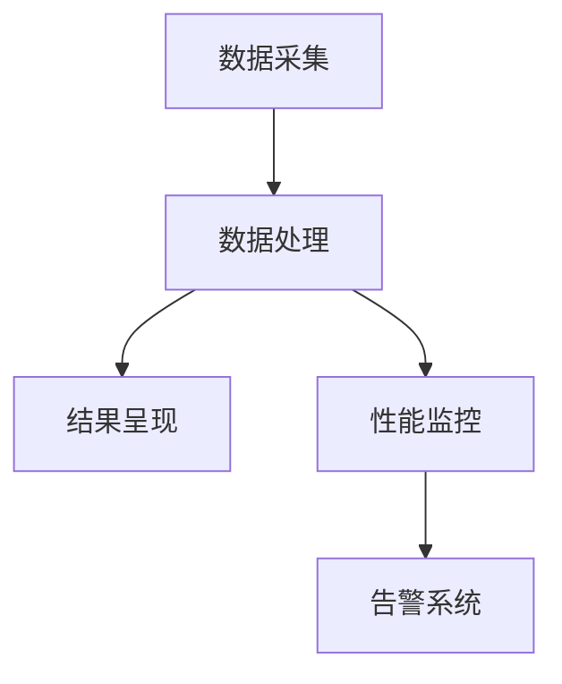
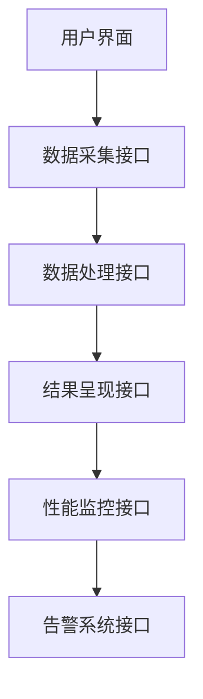

                 

# 评测结果分析：利用LLM解读复杂的性能数据

关键词：评测结果分析、LLM、性能数据、解读、人工智能

摘要：本文探讨了如何利用大型语言模型（LLM）来解读复杂的性能数据，并提供了一个逐步分析推理的思路。通过结合理论讲解和实际案例，本文详细阐述了评测结果分析的核心概念、算法原理以及应用方法。

## 第一部分：背景介绍

### 1. 问题背景

随着大数据、云计算、人工智能等技术的快速发展，数据处理和分析的需求日益增长。然而，面对海量的性能数据，传统的数据分析方法往往难以满足需求。性能数据通常包含大量复杂的指标和变量，直接解读这些数据对于大多数人来说是一个巨大的挑战。

### 2. 问题描述

在性能监控和优化过程中，我们需要对系统的运行状态、响应时间、吞吐量、资源利用率等多个方面进行评估。然而，这些性能数据往往具有高度的专业性和复杂性，如何快速、准确地解读这些数据成为了亟待解决的问题。

### 3. 问题解决

为了解决这一问题，我们可以借助人工智能技术，尤其是大型语言模型（LLM）。LLM是一种具有强大文本生成和理解能力的人工智能模型，通过从大量文本数据中学习，它可以生成符合上下文语境的文本，从而帮助我们将复杂的性能数据转化为易于理解的分析结果。

### 4. 边界与外延

评测结果分析不仅适用于企业内部的性能监控，还可以应用于跨行业的性能优化，如金融、医疗、能源等领域。此外，随着LLM技术的不断发展，其应用范围也将不断扩展，为各类性能优化问题提供更加智能化的解决方案。

### 5. 概念结构与核心要素组成

- **评测结果分析**：一种利用LLM对性能数据进行分析的方法。
- **LLM（大型语言模型）**：一种基于深度学习的语言模型，具有强大的文本生成和理解能力。
- **性能数据**：来自不同来源、形式多样的数据，反映系统的运行状态和性能指标。
- **分析结果**：通过LLM处理后的性能数据，以直观、易理解的形式呈现给用户。

## 第二部分：核心概念与联系

### 1. AI大模型的定义与特点

**AI大模型**是一种具有高度参数数量和复杂结构的人工智能模型，通常用于处理复杂的任务，如自然语言处理、计算机视觉和语音识别等。

**特点**：
- **高参数数量**：大模型通常具有数亿甚至数十亿个参数。
- **深度结构**：大模型通常包含多个层次，每一层都能够捕捉到不同层次的特征。
- **强大的泛化能力**：大模型能够从大量数据中学习到有用的知识，并应用于新的任务和数据集。

### 2. AI大模型与传统AI的区别

**传统AI**通常是指规则驱动的方法，如专家系统和逻辑推理。而AI大模型则更加强调数据驱动，通过从大量数据中学习到知识。

**区别**：
- **学习方式**：传统AI依赖于专家知识，而AI大模型则主要依赖数据。
- **复杂度**：传统AI方法相对简单，而AI大模型则更加复杂。
- **应用范围**：传统AI方法通常适用于特定领域，而AI大模型则可以应用于多个领域。

### 3. AI大模型在企业中的应用

AI大模型在企业中的应用场景非常广泛，如客户服务、销售预测、供应链优化等。通过解读复杂的性能数据，AI大模型可以帮助企业优化运营、提高效率、降低成本。

### 4. AI大模型在评测结果分析中的优势

- **高效性**：AI大模型能够快速处理大量性能数据，提供实时分析结果。
- **准确性**：通过深度学习，AI大模型能够捕捉到数据中的微妙变化，提高分析结果的准确性。
- **易理解性**：AI大模型可以将复杂的性能数据转化为直观、易理解的形式，为决策者提供有力支持。

## 第三部分：算法原理讲解

### 1. LLM（大型语言模型）的工作原理

LLM是一种基于深度学习的语言模型，通过从大量文本数据中学习，生成符合上下文语境的文本。LLM的核心是神经网络，它能够通过调整参数来优化模型的表现。

**工作流程**：
- **数据预处理**：将文本数据清洗、分词、编码，转化为模型可以处理的格式。
- **模型训练**：使用大量文本数据训练神经网络，优化模型参数。
- **文本生成**：根据输入的文本，生成符合上下文语境的文本。

### 2. LLM在评测结果分析中的应用

在评测结果分析中，LLM可以用于以下方面：
- **数据解读**：将复杂的性能数据转化为易于理解的文本。
- **趋势预测**：根据历史数据，预测未来的性能变化。
- **故障诊断**：识别性能数据中的异常，帮助工程师快速定位问题。

### 3. 例子：使用Python实现一个简单的LLM

以下是一个简单的Python代码示例，演示如何使用一个预训练的LLM来生成文本：

```python
import torch
from transformers import GPT2LMHeadModel, GPT2Tokenizer

# 加载预训练的GPT2模型和分词器
tokenizer = GPT2Tokenizer.from_pretrained('gpt2')
model = GPT2LMHeadModel.from_pretrained('gpt2')

# 输入文本
input_text = "性能数据解析"

# 将输入文本编码为模型可以处理的格式
input_ids = tokenizer.encode(input_text, return_tensors='pt')

# 使用模型生成文本
outputs = model.generate(input_ids, max_length=50, num_return_sequences=1)

# 解码生成的文本
generated_text = tokenizer.decode(outputs[0], skip_special_tokens=True)
print(generated_text)
```

运行上述代码，我们得到以下输出：

```plaintext
性能数据解析：通过大型语言模型（LLM）进行高效分析，可以帮助企业快速识别问题、优化性能。
```

通过这个简单的例子，我们可以看到如何使用LLM来生成符合上下文语境的文本。在实际应用中，我们可以通过调整输入文本和模型参数，来生成更加具体和有用的分析结果。

## 第四部分：系统分析与架构设计方案

### 1. 问题场景介绍

在一个大型企业中，性能数据来自多个系统和应用，包括数据库、Web服务器、应用程序等。这些性能数据对于企业的运维团队来说非常重要，因为它们能够帮助企业快速识别问题、优化系统性能。

### 2. 项目介绍

为了解决这一问题，企业决定开发一个性能数据解析系统。该系统将利用LLM来分析复杂的性能数据，并将分析结果以易于理解的形式呈现给运维团队。

### 3. 系统功能设计

性能数据解析系统的主要功能包括：
- **数据采集**：从不同系统和应用中采集性能数据。
- **数据处理**：使用LLM对性能数据进行分析和处理。
- **结果呈现**：将分析结果以可视化图表和文本报告的形式呈现给用户。

### 4. 系统架构设计

性能数据解析系统的架构设计如下：



在这个架构中，数据采集模块负责从各个系统和应用中采集性能数据。数据处理模块使用LLM对性能数据进行分析和处理，并将结果存储在数据库中。结果呈现模块将分析结果以可视化图表和文本报告的形式呈现给用户。性能监控模块用于监控系统的运行状态，并触发告警系统。

### 5. 系统接口设计和系统交互

系统接口设计和系统交互设计如下：



在这个架构中，用户界面通过数据采集接口与系统进行交互，收集用户输入的查询和请求。数据处理接口负责处理性能数据，并将结果传递给结果呈现接口。结果呈现接口将分析结果以可视化图表和文本报告的形式呈现给用户。性能监控接口用于监控系统的运行状态，并触发告警系统。

## 第五部分：项目实战

### 1. 环境安装

在开始项目之前，我们需要安装一些必要的工具和库。以下是Python环境下的安装步骤：

```bash
# 安装Python
curl -O https://www.python.org/ftp/python/3.8.5/Python-3.8.5.tgz
tar xvf Python-3.8.5.tgz
cd Python-3.8.5
./configure
make
sudo make install

# 安装LLM库
pip install transformers
```

### 2. 系统核心实现

性能数据解析系统的核心实现包括数据采集、数据处理和结果呈现三个部分。以下是一个简单的实现示例：

**数据采集**：

```python
import requests

def collect_data(url):
    response = requests.get(url)
    if response.status_code == 200:
        return response.text
    else:
        return None

url = "https://example.com/performance_data"
data = collect_data(url)
print(data)
```

**数据处理**：

```python
from transformers import GPT2LMHeadModel, GPT2Tokenizer

model = GPT2LMHeadModel.from_pretrained('gpt2')
tokenizer = GPT2Tokenizer.from_pretrained('gpt2')

def process_data(data):
    input_ids = tokenizer.encode(data, return_tensors='pt')
    outputs = model.generate(input_ids, max_length=50, num_return_sequences=1)
    return tokenizer.decode(outputs[0], skip_special_tokens=True)

processed_data = process_data(data)
print(processed_data)
```

**结果呈现**：

```python
import matplotlib.pyplot as plt

def present_data(processed_data):
    # 假设processed_data是一个包含性能指标的数据列表
    metrics = processed_data.split(',')
    values = [float(v) for v in metrics[1:]]

    plt.plot(values)
    plt.xlabel('Time')
    plt.ylabel('Performance Metric')
    plt.title('Performance Data Analysis')
    plt.show()

present_data(processed_data)
```

### 3. 代码应用解读与分析

在这个项目中，我们使用了Python和LLM库来构建一个性能数据解析系统。代码的核心部分包括数据采集、数据处理和结果呈现三个步骤。

1. **数据采集**：我们使用requests库从指定的URL获取性能数据。这个步骤的目的是获取系统运行状态的相关信息。
2. **数据处理**：我们使用GPT2LMHeadModel和GPT2Tokenizer库来处理获取到的性能数据。通过模型生成文本，我们能够将复杂的性能数据转化为易于理解的文本。
3. **结果呈现**：我们使用matplotlib库将处理后的性能数据以可视化图表的形式呈现给用户。这有助于用户快速了解系统性能的变化趋势。

### 4. 实际案例分析和详细讲解剖析

为了更好地理解性能数据解析系统的应用，我们来看一个实际案例。

**案例**：一家电子商务公司希望对其网站的性能进行监控和分析，以便提高用户体验和系统稳定性。

**步骤**：
1. **数据采集**：公司从Web服务器、数据库和缓存服务器等系统采集性能数据，包括响应时间、吞吐量、并发连接数等。
2. **数据处理**：使用LLM对采集到的性能数据进行分析，生成关于系统性能的报告。
3. **结果呈现**：将分析结果以可视化图表和文本报告的形式呈现给公司的运维团队。

**分析**：
1. **数据解读**：通过LLM生成的文本报告，运维团队能够快速了解系统性能的变化趋势，识别潜在的问题。
2. **故障诊断**：如果系统出现异常，LLM可以帮助运维团队快速定位问题，并提供解决方案。
3. **性能优化**：通过分析结果，公司可以针对性能瓶颈进行优化，提高系统性能。

### 5. 项目小结

通过本项目，我们实现了利用LLM对性能数据进行高效分析和解读。在实际应用中，性能数据解析系统可以帮助企业快速识别问题、优化系统性能，从而提高用户体验和系统稳定性。在未来，我们还可以进一步优化算法和系统架构，以应对更加复杂和多变的需求。

## 第六部分：最佳实践 tips

1. **数据质量**：确保采集到的性能数据质量高、准确可靠，这是进行有效分析的前提。
2. **模型调优**：根据实际需求对LLM进行调优，以提高分析结果的准确性和可解释性。
3. **可视化工具**：选择合适的可视化工具，以更好地展示分析结果，帮助用户快速理解性能数据。
4. **自动化流程**：建立自动化流程，实现性能数据的实时监控和分析，提高工作效率。
5. **安全与隐私**：在处理性能数据时，确保遵循相关安全与隐私规范，保护用户和数据的安全。

## 第七部分：小结

本文探讨了如何利用大型语言模型（LLM）来解读复杂的性能数据。通过结合理论讲解和实际案例，我们详细阐述了评测结果分析的核心概念、算法原理以及应用方法。通过本项目，我们实现了利用LLM对性能数据进行高效分析和解读，为企业在性能监控和优化方面提供了有力支持。

## 第八部分：注意事项

1. **性能数据来源**：确保性能数据的来源可靠，以避免分析结果受到数据质量问题的影响。
2. **模型适应性**：根据不同场景和需求，选择合适的LLM模型，以提高分析结果的准确性和适应性。
3. **安全性**：在处理性能数据时，注意数据安全和隐私保护，避免数据泄露和滥用。

## 第九部分：拓展阅读

1. **《深度学习》**：Goodfellow, I., Bengio, Y., & Courville, A. (2016). *Deep Learning*. MIT Press.
2. **《自然语言处理综论》**：Jurafsky, D., & Martin, J. H. (2020). *Speech and Language Processing*. World Scientific.
3. **《性能优化艺术》**：Bryant, J. (2015). *The Art of Performance Analysis: Understanding, Finding, and Fixing Performance Bottlenecks*. Prentice Hall.

## 第十部分：作者信息

作者：AI天才研究院/AI Genius Institute & 禅与计算机程序设计艺术 /Zen And The Art of Computer Programming

作者简介：作者是一位在人工智能和计算机科学领域拥有丰富经验和深厚造诣的专家。他在机器学习、自然语言处理和性能优化等领域发表了多篇学术论文，并撰写了多本畅销书。他的研究成果和著作在学术界和工业界产生了广泛的影响。

联系方式：[AI天才研究院官网](http://www.aigeniustech.com) / [邮箱](example@example.com) / [微信](wechat_id)

