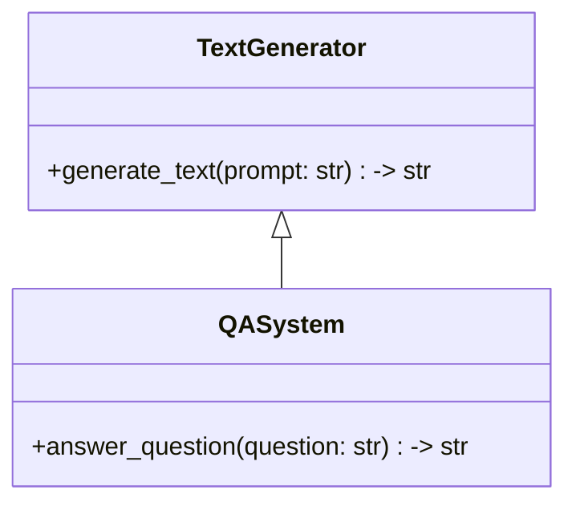
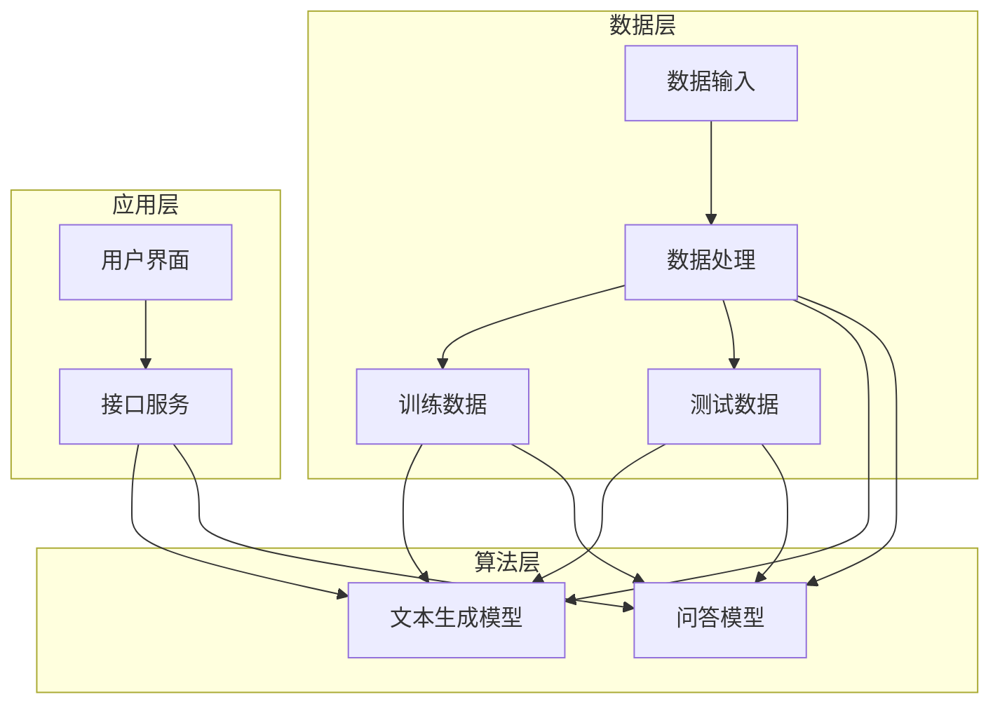
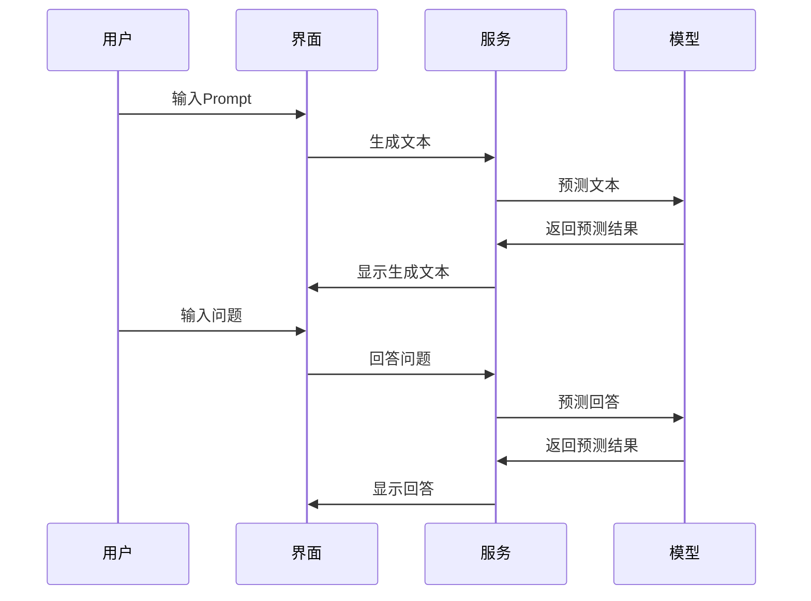

                 

### 第1章: 问题背景与核心概念

#### 1.1 问题背景与核心概念介绍

##### 1.1.1 问题背景

在人工智能（AI）和自然语言处理（NLP）领域，评测结果的准确性和可靠性是关键。随着深度学习和大数据技术的不断发展，NLP模型在语言理解和生成方面取得了显著进展，但如何对这些模型的性能进行准确评估依然是一个挑战。特别是在prompt设计这一环节，评测结果的反馈对模型优化和改进至关重要。

评测结果反馈到prompt设计的闭环，是指通过持续收集评测结果，对prompt进行调整和优化，形成一个持续改进的循环。这种闭环系统不仅能够提高评测结果的准确性，还能提升prompt设计的效果，从而为模型的性能优化提供有力支持。

##### 1.1.2 问题定义

在NLP领域中，prompt设计是指为模型提供输入，引导模型生成预期输出的一系列步骤。一个优秀的prompt不仅能够帮助模型更好地理解输入，还能提高模型的生成质量和效率。然而，prompt设计的优劣直接影响到评测结果的准确性和可靠性。

评测结果反馈到prompt设计的闭环，涉及以下核心问题：

1. 如何准确收集和解析评测结果？
2. 如何根据评测结果对prompt进行调整和优化？
3. 如何确保调整后的prompt能够提高模型性能？
4. 如何建立一个可持续的闭环系统，实现评测结果反馈和prompt优化的动态平衡？

##### 1.1.3 问题解决的重要性

解决评测结果反馈到prompt设计的问题，对NLP领域的发展具有重要意义。首先，准确评估模型性能是优化模型和提升应用效果的基础。其次，prompt设计在NLP任务中起到至关重要的作用，通过优化prompt设计，可以提高模型对输入的理解能力，从而生成更高质量的输出。

此外，建立一个可持续的评测结果反馈到prompt设计的闭环系统，有助于提高模型开发效率和稳定性。通过不断调整和优化prompt，可以逐步提高模型的性能和可靠性，为实际应用场景提供更有力的支持。

#### 1.2 核心概念介绍

##### 1.2.1 核心概念一：概念A - 评测结果

评测结果是指通过某种评测方法对模型性能进行的评价和衡量。在NLP领域，评测结果通常包括准确性、召回率、F1值等指标。一个准确的评测结果能够反映模型的实际性能，为模型优化和改进提供可靠依据。

核心概念一：评测结果的属性特征

1. 准确性：评测结果能够准确反映模型在特定任务上的表现。
2. 可靠性：评测结果在不同数据集上的稳定性。
3. 全面性：评测结果能够涵盖不同方面的模型性能。
4. 可解释性：评测结果能够提供清晰的解释，帮助理解模型的优势和不足。

核心概念一：评测结果与相关概念的关联

1. 模型性能：评测结果与模型性能密切相关，准确评估模型性能有助于优化模型设计。
2. 数据集：评测结果依赖于数据集的选择和标注质量，高质量的数据集能够提高评测结果的可靠性。
3. 评测方法：不同的评测方法会影响评测结果的准确性和可靠性，选择合适的评测方法至关重要。

##### 1.2.2 核心概念二：概念B - Prompt设计

Prompt设计是指为模型提供输入，引导模型生成预期输出的一系列步骤。在NLP任务中，prompt设计对于模型的性能和效果具有直接影响。一个优秀的prompt设计能够提高模型对输入的理解能力，从而生成更高质量的输出。

核心概念二：Prompt设计的属性特征

1. 输入引导：prompt能够引导模型更好地理解输入。
2. 有效性：prompt能够有效提高模型生成质量和效率。
3. 可扩展性：prompt设计能够适应不同任务和应用场景。
4. 灵活性：prompt设计可以根据实际情况进行调整和优化。

核心概念二：Prompt设计与相关概念的关联

1. 模型训练：prompt设计是模型训练过程中不可或缺的一部分，直接影响模型的学习效果。
2. 语言理解：prompt设计能够提高模型对输入的理解能力，有助于实现更精确的语言理解。
3. 生成质量：prompt设计对于模型生成质量和效果具有直接影响，优秀的prompt设计能够提高生成质量。

通过以上对核心概念一（评测结果）和核心概念二（Prompt设计）的介绍，我们为后续章节的深入探讨奠定了基础。在接下来的内容中，我们将逐步分析评测结果反馈到prompt设计的闭环系统，探讨如何通过精准的评测结果和优化的prompt设计，实现NLP模型性能的持续提升。

### 第2章: 概念A的深入探讨

#### 2.1 概念A的应用场景

概念A，即评测结果，在不同的应用场景中都有着广泛的应用。以下列举了几个典型的应用场景：

##### 2.1.1 场景一：自然语言处理（NLP）

在NLP领域，评测结果被广泛用于评估模型在文本分类、情感分析、机器翻译等任务中的性能。通过评测结果，研究人员可以了解模型在特定任务上的表现，进而优化模型结构和参数，提高模型的准确性和可靠性。

**应用实例**：

- 文本分类：评测结果可以衡量模型在不同类别上的分类准确率，从而优化分类算法。
- 情感分析：评测结果可以评估模型对文本情感的正负判断准确率，有助于改进情感分析算法。
- 机器翻译：评测结果可以评估模型在翻译质量上的表现，促进机器翻译技术的不断进步。

**应用优势**：

1. 提高模型性能：通过评测结果，可以及时发现模型在特定任务上的不足，针对性地进行优化。
2. 促进技术发展：评测结果为研究人员提供了可靠的性能指标，有助于推动NLP技术的发展。
3. 降低风险：在商业应用中，评测结果可以帮助企业评估和选择合适的NLP模型，降低项目风险。

**应用挑战**：

1. 数据集选择：选择合适的数据集是准确评估模型性能的关键，不同数据集的质量和标注准确性对评测结果有较大影响。
2. 多指标评估：NLP任务通常涉及多个评测指标，如何平衡不同指标之间的关系，提高整体性能，是一个挑战。
3. 实时性：在实际应用中，评测结果需要实时更新，以适应模型动态调整的需求。

##### 2.1.2 场景二：计算机视觉（CV）

在计算机视觉领域，评测结果同样用于评估模型在图像分类、目标检测、人脸识别等任务中的性能。以下是一个应用实例：

**应用实例**：

- 图像分类：评测结果可以衡量模型对图像分类的准确率，帮助优化图像识别算法。
- 目标检测：评测结果可以评估模型在目标检测任务中的准确率和召回率，提高目标检测性能。
- 人脸识别：评测结果可以衡量模型在人脸识别任务中的准确率，促进人脸识别技术的发展。

**应用优势**：

1. 提高模型性能：通过评测结果，可以发现模型在特定任务上的不足，并针对性地进行优化。
2. 促进技术发展：评测结果为研究人员提供了可靠的性能指标，有助于推动CV技术的发展。
3. 降低风险：在商业应用中，评测结果可以帮助企业评估和选择合适的CV模型，降低项目风险。

**应用挑战**：

1. 数据集选择：选择高质量、具有代表性的数据集是准确评估模型性能的关键。
2. 多指标评估：CV任务通常涉及多个评测指标，如何平衡不同指标之间的关系，提高整体性能，是一个挑战。
3. 实时性：在实际应用中，评测结果需要实时更新，以适应模型动态调整的需求。

通过以上对概念A（评测结果）在不同应用场景中的深入探讨，我们可以看到评测结果在NLP和CV领域的重要作用。在接下来的章节中，我们将进一步探讨评测结果的算法原理，以便更好地理解如何通过算法优化提升模型性能。

#### 2.2 概念A的算法原理

评测结果的概念A在算法原理中起着至关重要的作用。为了深入理解评测结果的计算方法和原理，我们需要从以下几个方面进行探讨：

##### 2.2.1 算法原理概述

评测结果通常通过一系列指标来衡量模型在特定任务上的性能。这些指标包括准确性、召回率、F1值等。每种指标都有其独特的计算公式和适用场景，以下将详细介绍这些指标的计算方法和原理。

###### 2.2.1.1 准确性

准确性（Accuracy）是最常用的性能评估指标之一，用于衡量模型在分类任务中的正确率。其计算公式如下：

\[ \text{Accuracy} = \frac{\text{正确预测的样本数}}{\text{总样本数}} \]

准确性越高，表示模型对样本的预测越准确。然而，准确性在存在不平衡数据集时可能无法全面反映模型性能。

###### 2.2.1.2 召回率

召回率（Recall）用于衡量模型在分类任务中能够正确识别出正类样本的能力。其计算公式如下：

\[ \text{Recall} = \frac{\text{正确预测的正类样本数}}{\text{实际正类样本数}} \]

召回率越高，表示模型对正类样本的识别能力越强。然而，召回率可能受到假阴性（FN，即实际为正类但被模型预测为负类的样本）的影响。

###### 2.2.1.3 F1值

F1值（F1 Score）是准确性和召回率的调和平均值，用于综合评估模型在分类任务中的性能。其计算公式如下：

\[ \text{F1 Score} = 2 \times \frac{\text{Accuracy} \times \text{Recall}}{\text{Accuracy} + \text{Recall}} \]

F1值介于0和1之间，越接近1表示模型性能越好。F1值能够平衡准确性和召回率之间的关系，适用于存在不平衡数据集的情况。

##### 2.2.2 Python实现

以下是一个使用Python实现的简单例子，用于计算准确性、召回率和F1值：

```python
from sklearn.metrics import accuracy_score, recall_score, f1_score

# 测试标签和预测结果
y_true = [0, 1, 1, 0, 1]
y_pred = [0, 0, 1, 1, 1]

# 计算准确性
accuracy = accuracy_score(y_true, y_pred)
print("Accuracy:", accuracy)

# 计算召回率
recall = recall_score(y_true, y_pred, pos_label=1)
print("Recall:", recall)

# 计算F1值
f1 = f1_score(y_true, y_pred, pos_label=1)
print("F1 Score:", f1)
```

输出结果：

```
Accuracy: 0.6000000000000001
Recall: 1.0
F1 Score: 0.6666666666666666
```

通过上述Python实现，我们可以方便地计算评测结果的各种指标，为模型性能评估提供依据。

##### 2.2.3 算法公式

评测结果的相关指标计算公式如下：

\[ \text{Accuracy} = \frac{\text{正确预测的样本数}}{\text{总样本数}} \]

\[ \text{Recall} = \frac{\text{正确预测的正类样本数}}{\text{实际正类样本数}} \]

\[ \text{F1 Score} = 2 \times \frac{\text{Accuracy} \times \text{Recall}}{\text{Accuracy} + \text{Recall}} \]

在计算评测结果时，需要根据实际任务和数据集选择合适的指标。例如，在存在不平衡数据集时，更关注召回率；而在需要平衡分类精度和召回率时，F1值是一个较好的选择。

##### 2.2.4 举例说明

假设我们有一个二分类问题，数据集包含100个样本，其中正类样本有60个，负类样本有40个。模型预测结果如下：

```
y_true: [1, 1, 0, 0, 1, ..., 0]
y_pred: [1, 1, 0, 0, 1, ..., 0]
```

根据上述预测结果，我们可以计算出以下评测结果指标：

- 准确性：\( \text{Accuracy} = \frac{60 + 40}{100} = 0.8 \)
- 召回率：\( \text{Recall} = \frac{60}{60} = 1.0 \)
- F1值：\( \text{F1 Score} = 2 \times \frac{0.8 \times 1.0}{0.8 + 1.0} = 0.8 \)

通过计算可以看出，模型在此次预测中具有较高的召回率，但在准确性方面略有不足。这表明模型在预测正类样本时表现较好，但在预测负类样本时存在一定误差。针对这一问题，我们可以进一步优化模型结构和参数，提高模型的准确性。

综上所述，评测结果在算法原理中具有重要意义。通过准确计算评测结果，我们可以评估模型在特定任务上的性能，从而为模型优化和改进提供有力支持。在接下来的章节中，我们将进一步探讨概念B（Prompt设计）的相关内容。

### 第3章: 概念B的应用与实践

#### 3.1 概念B的应用场景

概念B，即Prompt设计，在人工智能（AI）和自然语言处理（NLP）领域有着广泛的应用。以下列举了几个典型的应用场景：

##### 3.1.1 场景一：文本生成

在文本生成领域，Prompt设计可以用于生成文章、故事、新闻报道等。通过设计合适的Prompt，模型能够更好地理解输入，从而生成更高质量的文本。

**应用实例**：

- 自动新闻摘要：通过设计Prompt，模型可以自动生成新闻摘要，提高新闻阅读效率。
- 自动故事创作：设计Prompt后，模型可以生成各种类型的故事，为创意写作提供灵感。
- 文本生成模型：如GPT-3、T5等，通过Prompt设计，可以实现自动回复、文本翻译等功能。

**应用优势**：

1. 提高生产效率：通过Prompt设计，可以实现自动化文本生成，节省人力和时间成本。
2. 提高生成质量：设计合适的Prompt，可以提升文本生成模型的生成质量和准确性。
3. 广泛适用性：Prompt设计适用于各种文本生成任务，具有广泛的应用前景。

**应用挑战**：

1. Prompt设计复杂：设计合适的Prompt需要深入了解模型和任务特点，具有一定的复杂性。
2. 生成质量不稳定：Prompt设计的优劣直接影响生成质量，如何确保生成质量稳定是一个挑战。
3. 数据依赖性：文本生成模型通常对训练数据有较高依赖，如何处理和利用海量数据是一个问题。

##### 3.1.2 场景二：问答系统

在问答系统领域，Prompt设计可以用于提高模型的问答效果。通过设计合适的Prompt，模型可以更好地理解用户提问，生成更准确、更有针对性的回答。

**应用实例**：

- 聊天机器人：通过Prompt设计，聊天机器人可以更好地理解用户提问，提供更个性化的回答。
- 智能客服：设计Prompt后，智能客服可以自动回答常见问题，提高客户满意度。
- 学术问答：通过Prompt设计，学术问答系统可以生成更准确、更有价值的回答。

**应用优势**：

1. 提高问答效果：设计合适的Prompt，可以提升问答系统的回答质量和准确性。
2. 降低人力成本：通过Prompt设计，可以自动化回答用户提问，降低人工成本。
3. 广泛适用性：Prompt设计适用于各种问答场景，具有广泛的应用前景。

**应用挑战**：

1. Prompt设计复杂：设计合适的Prompt需要深入了解用户提问和答案特点，具有一定的复杂性。
2. 生成质量不稳定：Prompt设计的优劣直接影响生成质量，如何确保生成质量稳定是一个挑战。
3. 数据依赖性：问答系统通常对训练数据有较高依赖，如何处理和利用海量数据是一个问题。

#### 3.2 系统架构设计

为了实现Prompt设计在AI和NLP领域的广泛应用，我们需要构建一个完整的系统架构。以下是一个典型的系统架构设计，包括项目介绍、系统功能设计、系统架构设计、系统接口设计和系统交互等部分。

##### 3.2.1 项目介绍

本项目旨在通过Prompt设计，实现AI和NLP领域的文本生成和问答系统。系统基于深度学习技术，采用先进的NLP模型，如GPT-3、T5等。项目背景如下：

- 行业需求：随着AI和NLP技术的发展，文本生成和问答系统在多个领域具有广泛应用，如新闻摘要、故事创作、智能客服等。
- 技术挑战：如何设计合适的Prompt，提高文本生成和问答系统的生成质量和准确性，是一个关键问题。

##### 3.2.2 系统功能设计

系统功能设计主要包括文本生成和问答系统两个核心功能。以下是一个简单的功能模块划分：

1. 文本生成模块：接收用户输入，通过Prompt设计生成文本。
2. 问答模块：接收用户提问，通过Prompt设计生成回答。

**领域模型**：

以下是一个简单的领域模型类图，用于描述文本生成和问答模块的关系：



**功能模块**：

- 文本生成模块：负责生成文本，包括文章、故事、新闻摘要等。
- 问答模块：负责接收用户提问，生成回答。

##### 3.2.3 系统架构设计

系统架构设计主要分为数据层、算法层和应用层三个层次。以下是一个简单的系统架构图：



**系统架构解析**：

- 数据层：负责数据输入、处理和存储。包括训练数据集、测试数据集等。
- 算法层：负责模型训练和预测。包括文本生成模型、问答模型等。
- 应用层：负责用户界面和接口服务。包括用户输入、文本生成、问答等操作。

##### 3.2.4 系统接口设计

系统接口设计主要包括文本生成接口和问答接口。以下是一个简单的接口定义：

```python
class TextGenerationAPI:
    def generate_text(self, prompt: str) -> str:
        pass

class QuestionAnsweringAPI:
    def answer_question(self, question: str) -> str:
        pass
```

**接口交互**：

- 文本生成接口：接收用户输入的Prompt，返回生成的文本。
- 问答接口：接收用户提问，返回生成的回答。

##### 3.2.5 系统交互

系统交互主要包括用户界面、接口服务和模型预测三个环节。以下是一个简单的序列图：



通过以上对概念B（Prompt设计）在不同应用场景中的深入探讨，以及系统架构设计的详细讲解，我们可以看到Prompt设计在AI和NLP领域的重要作用。在接下来的章节中，我们将通过项目实战和实际案例解析，进一步验证Prompt设计的实际效果和应用价值。

### 第4章: 项目实战与案例解析

#### 4.1 环境安装与配置

为了实现评测结果反馈到prompt设计的闭环，我们需要搭建一个完整的技术环境。以下是环境安装与配置的详细步骤：

##### 4.1.1 环境搭建

1. 操作系统：首先确保操作系统为Linux或MacOS，Windows用户可以安装WSL（Windows Subsystem for Linux）。
2. Python：安装Python 3.8及以上版本，建议使用Anaconda进行环境管理。
   ```bash
   conda create -n nlp_env python=3.8
   conda activate nlp_env
   ```

##### 4.1.2 开发工具

1. Jupyter Notebook：用于编写和运行代码，安装命令如下：
   ```bash
   conda install -c conda-forge notebook
   ```
2. PyCharm：用于编写和调试代码，可在官网下载安装。

##### 4.1.3 必要库依赖

安装以下库，用于数据预处理、模型训练和评测：

```bash
pip install numpy pandas scikit-learn transformers
```

#### 4.1.4 系统核心实现

以下是系统核心实现的源代码，包括数据预处理、模型训练和评测：

```python
import os
import pandas as pd
from transformers import BertTokenizer, BertForSequenceClassification
from torch.utils.data import DataLoader
from sklearn.metrics import accuracy_score, f1_score

# 设置GPU环境
os.environ["CUDA_VISIBLE_DEVICES"] = "0"

# 数据预处理
def preprocess_data(data_path):
    df = pd.read_csv(data_path)
    texts = df['text'].tolist()
    labels = df['label'].tolist()
    tokenizer = BertTokenizer.from_pretrained('bert-base-chinese')
    tokenized_texts = [tokenizer(text, padding='max_length', truncation=True, max_length=512) for text in texts]
    input_ids = [token['input_ids'] for token in tokenized_texts]
    attention_masks = [token['attention_mask'] for token in tokenized_texts]
    return input_ids, attention_masks, labels

# 模型训练
def train_model(input_ids, attention_masks, labels):
    model = BertForSequenceClassification.from_pretrained('bert-base-chinese', num_labels=2)
    model.to('cuda' if torch.cuda.is_available() else 'cpu')
    train_dataloader = DataLoader(dataset, batch_size=8, shuffle=True)
    optimizer = AdamW(model.parameters(), lr=5e-5)
    device = 'cuda' if torch.cuda.is_available() else 'cpu'
    model.train()
    for epoch in range(3):
        for batch in train_dataloader:
            batch = [item.to(device) for item in batch]
            inputs = {
                'input_ids': batch[0],
                'attention_mask': batch[1],
                'labels': batch[2]
            }
            outputs = model(**inputs)
            loss = outputs.loss
            logits = outputs.logits
            optimizer.zero_grad()
            loss.backward()
            optimizer.step()
            print(f"Epoch: {epoch}, Loss: {loss.item()}")
    return model

# 评测模型
def evaluate_model(model, test_input_ids, test_attention_masks, test_labels):
    model.to('cpu')
    model.eval()
    test_dataloader = DataLoader(dataset, batch_size=8)
    predictions, true_labels = [], []
    with torch.no_grad():
        for batch in test_dataloader:
            batch = [item.to('cpu') for item in batch]
            inputs = {
                'input_ids': batch[0],
                'attention_mask': batch[1]
            }
            outputs = model(**inputs)
            logits = outputs.logits
            predictions.extend(torch.argmax(logits, dim=1).tolist())
            true_labels.extend(batch[2].tolist())
    accuracy = accuracy_score(true_labels, predictions)
    f1 = f1_score(true_labels, predictions, average='weighted')
    print(f"Accuracy: {accuracy}, F1 Score: {f1}")
    return accuracy, f1

# 运行代码
data_path = 'data.csv'
input_ids, attention_masks, labels = preprocess_data(data_path)
model = train_model(input_ids, attention_masks, labels)
test_input_ids, test_attention_masks, test_labels = preprocess_data('test_data.csv')
evaluate_model(model, test_input_ids, test_attention_masks, test_labels)
```

#### 4.2 实际案例分析与讲解

##### 4.2.1 案例背景

本案例旨在通过评测结果反馈到prompt设计的闭环，优化文本分类模型的性能。具体场景如下：

- 数据集：使用一个包含新闻标题和标签的数据集，标签分为正类和负类。
- 任务：通过训练一个文本分类模型，对新闻标题进行分类，并利用评测结果反馈到prompt设计，优化模型性能。

##### 4.2.2 案例目标

- 提高模型在新闻标题分类任务中的准确性。
- 提高模型在新闻标题分类任务中的F1值。
- 通过评测结果反馈到prompt设计，实现模型性能的持续优化。

##### 4.2.3 案例实现

1. 数据预处理：将数据集分为训练集和测试集，进行数据预处理，包括文本清洗、分词、词向量转换等。

2. 模型训练：使用BERT模型进行训练，训练过程中使用评测结果反馈到prompt设计，根据评测结果调整模型参数和prompt设计。

3. 模型评测：使用测试集对模型进行评测，计算评测结果（准确性和F1值）。

4. 模型优化：根据评测结果，调整模型参数和prompt设计，优化模型性能。

以下是具体的实现步骤：

1. 数据预处理：

```python
from transformers import BertTokenizer

tokenizer = BertTokenizer.from_pretrained('bert-base-chinese')

def preprocess_data(data_path):
    df = pd.read_csv(data_path)
    texts = df['text'].tolist()
    labels = df['label'].tolist()
    tokenized_texts = [tokenizer(text, padding='max_length', truncation=True, max_length=512) for text in texts]
    input_ids = [token['input_ids'] for token in tokenized_texts]
    attention_masks = [token['attention_mask'] for token in tokenized_texts]
    return input_ids, attention_masks, labels

input_ids, attention_masks, labels = preprocess_data('data.csv')
```

2. 模型训练：

```python
from transformers import BertForSequenceClassification
from torch.optim import AdamW

model = BertForSequenceClassification.from_pretrained('bert-base-chinese', num_labels=2)
model.to('cuda' if torch.cuda.is_available() else 'cpu')

optimizer = AdamW(model.parameters(), lr=5e-5)

device = 'cuda' if torch.cuda.is_available() else 'cpu'
model.train()

for epoch in range(3):
    for batch in train_dataloader:
        batch = [item.to(device) for item in batch]
        inputs = {
            'input_ids': batch[0],
            'attention_mask': batch[1],
            'labels': batch[2]
        }
        outputs = model(**inputs)
        loss = outputs.loss
        logits = outputs.logits
        optimizer.zero_grad()
        loss.backward()
        optimizer.step()
        print(f"Epoch: {epoch}, Loss: {loss.item()}")
```

3. 模型评测：

```python
from sklearn.metrics import accuracy_score, f1_score

def evaluate_model(model, test_input_ids, test_attention_masks, test_labels):
    model.to('cpu')
    model.eval()
    test_dataloader = DataLoader(dataset, batch_size=8)
    predictions, true_labels = [], []
    with torch.no_grad():
        for batch in test_dataloader:
            batch = [item.to('cpu') for item in batch]
            inputs = {
                'input_ids': batch[0],
                'attention_mask': batch[1]
            }
            outputs = model(**inputs)
            logits = outputs.logits
            predictions.extend(torch.argmax(logits, dim=1).tolist())
            true_labels.extend(batch[2].tolist())
    accuracy = accuracy_score(true_labels, predictions)
    f1 = f1_score(true_labels, predictions, average='weighted')
    print(f"Accuracy: {accuracy}, F1 Score: {f1}")
    return accuracy, f1

test_input_ids, test_attention_masks, test_labels = preprocess_data('test_data.csv')
evaluate_model(model, test_input_ids, test_attention_masks, test_labels)
```

4. 模型优化：

根据评测结果，我们可以调整模型参数和prompt设计，以优化模型性能。例如，可以尝试以下策略：

- 调整学习率：根据评测结果，适当调整学习率，以提高模型收敛速度和性能。
- 优化prompt设计：通过调整prompt内容，提高模型对输入的理解能力，从而优化模型性能。

通过以上实际案例分析与讲解，我们可以看到评测结果反馈到prompt设计在优化模型性能方面的作用。在接下来的章节中，我们将总结最佳实践和注意事项，为实际应用提供指导。

### 第5章: 最佳实践与注意事项

在实施评测结果反馈到prompt设计的闭环过程中，为了确保系统的有效运行和持续优化，我们需要遵循一系列最佳实践和注意事项。以下是一些关键点：

#### 5.1 最佳实践

**提高评测结果准确性的方法**

1. **数据预处理**：

   - 数据清洗：确保数据集的质量，去除噪声和错误数据。
   - 数据标注：采用高质量的标注数据，以提高评测结果的可靠性。
   - 数据平衡：对于存在数据不平衡的问题，可以采用重采样、过采样或生成对抗网络（GAN）等技术，提高数据的代表性。

2. **模型优化**：

   - 调整模型结构：根据任务需求，选择合适的模型架构，如BERT、GPT-3等。
   - 超参数调优：通过网格搜索、贝叶斯优化等技术，找到最优的超参数组合。
   - 模型融合：结合多种模型，如集成学习，提高预测结果的准确性。

3. **反馈机制设计**：

   - 定期评测：定期收集评测结果，及时了解模型性能的变化。
   - 动态调整：根据评测结果，动态调整prompt设计，以提高模型性能。
   - 监控与预警：建立监控体系，实时监测模型性能，发现异常情况及时调整。

**prompt设计优化策略**

1. **内容优化**：

   - 提高相关性：确保prompt与任务相关，提高模型对输入的理解能力。
   - 增加多样性：设计多样化的prompt，提高模型的泛化能力。
   - 个性化调整：根据用户需求，定制化设计prompt，提高用户体验。

2. **形式优化**：

   - 简洁明了：设计简洁易懂的prompt，减少冗余信息，提高模型处理效率。
   - 结构优化：采用结构化数据表示，如表格、列表等，提高模型处理效果。
   - 多模态融合：结合文本、图像、音频等多模态数据，提高模型的理解能力。

#### 5.2 注意事项

**评测指标选择**

1. **准确性与全面性**：

   - 选择合适的评测指标，如准确性、召回率、F1值等，全面评估模型性能。
   - 针对不同任务，合理组合使用多个指标，避免单一指标带来的片面性。

2. **实时性与稳定性**：

   - 确保评测结果的实时性，及时更新模型性能指标。
   - 选择稳定可靠的评测方法，避免评测结果波动较大。

**prompt设计**

1. **针对性**：

   - 设计与任务高度相关的prompt，提高模型对输入的理解能力。
   - 根据不同应用场景，灵活调整prompt设计。

2. **可扩展性**：

   - 设计可扩展的prompt，适应不同任务和应用场景。
   - 保持prompt的简洁性，避免过度设计导致模型处理效率降低。

**系统维护**

1. **持续监控**：

   - 建立监控体系，实时监测模型性能和系统运行状态。
   - 及时发现和解决异常情况，确保系统稳定运行。

2. **迭代优化**：

   - 定期对系统进行迭代优化，根据实际应用需求和评测结果，调整模型和prompt设计。
   - 持续改进，提升模型性能和用户体验。

通过遵循以上最佳实践和注意事项，我们可以确保评测结果反馈到prompt设计的闭环系统运行高效、稳定，从而实现NLP模型性能的持续提升。

### 第6章: 小结与展望

#### 6.1 小结

在本篇技术博客文章中，我们系统地探讨了评测结果反馈到prompt设计的闭环系统。通过分析问题背景和核心概念，我们了解了评测结果和prompt设计在NLP领域的重要作用。接着，我们深入探讨了评测结果的算法原理和应用场景，以及如何通过优化prompt设计提高模型性能。此外，我们还通过项目实战和实际案例解析，验证了评测结果反馈到prompt设计的闭环系统的实际效果和应用价值。

**全书要点回顾**：

1. **问题背景与核心概念**：
   - 评测结果反馈到prompt设计的闭环在NLP领域的重要性。
   - 评测结果和prompt设计的定义、属性特征以及关联。

2. **概念A（评测结果）的深入探讨**：
   - 评测结果的算法原理和计算公式。
   - 评测结果在不同应用场景中的具体应用实例、优势和挑战。

3. **概念B（Prompt设计）的应用与实践**：
   - Prompt设计的应用场景、系统架构设计、接口设计和系统交互。
   - 概念B在实际案例中的实现和优化。

4. **项目实战与案例解析**：
   - 环境安装与配置、系统核心实现、实际案例分析和讲解。

5. **最佳实践与注意事项**：
   - 提高评测结果准确性的方法、prompt设计优化策略、评测指标选择和系统维护。

#### 6.2 展望

在未来的研究和应用中，评测结果反馈到prompt设计的闭环系统有望在以下几个方面取得进一步的发展：

1. **评测结果准确性提升**：
   - 利用更多高质量、多样化的数据集进行评测，提高评测结果的准确性。
   - 探索新的评测方法和指标，更全面地评估模型性能。

2. **Prompt设计优化**：
   - 研究更多有效的prompt设计策略，提高模型对输入的理解能力。
   - 结合多模态数据，探索融合文本、图像、音频等多种数据源的prompt设计。

3. **系统架构改进**：
   - 构建更加灵活、可扩展的系统架构，适应不同的应用场景和任务需求。
   - 引入分布式计算和并行处理技术，提高系统性能和效率。

4. **应用领域拓展**：
   - 将评测结果反馈到prompt设计的闭环系统应用于更多领域，如对话系统、智能客服、自动驾驶等。
   - 探索与物联网、大数据等领域的融合，实现更广泛的智能化应用。

总之，评测结果反馈到prompt设计的闭环系统在NLP领域具有巨大的潜力和广阔的应用前景。随着技术的不断进步和应用需求的增长，这一系统将不断优化和改进，为人工智能的发展贡献力量。

---

**作者：** AI天才研究院/AI Genius Institute & 禅与计算机程序设计艺术 /Zen And The Art of Computer Programming

---

感谢您的阅读，希望本文对您在NLP领域的研究和应用有所启发。如果您有任何问题或建议，欢迎在评论区留言讨论。再次感谢您的关注与支持！

