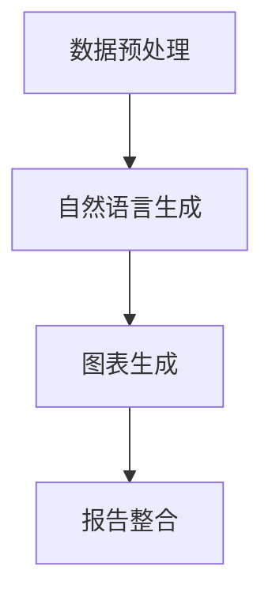

                 


### 文章标题

**评测结果可视化：LLM生成直观报告的技术探索**

### 文章关键词

- 评测结果可视化
- 大型语言模型 (LLM)
- 直观报告生成
- 技术探索
- 数据分析与可视化

### 文章摘要

随着数据量的不断增长和复杂性的增加，评测结果的可视化变得越来越重要。本文探讨了如何利用大型语言模型（LLM）来生成直观、易于理解的评测报告。我们将深入分析LLM的工作原理、可视化技术的应用，并通过具体案例展示LLM在生成直观报告方面的实际应用效果。文章最后还将讨论最佳实践和未来的发展趋势。

## 目录

1. **背景介绍**
   1.1. 评测结果可视化的意义
   1.2. 当前评测结果可视化面临的问题
   1.3. LLM在可视化报告中的应用
   1.4. 边界与外延
   1.5. 概念结构与核心要素组成

2. **LLM的基本原理与可视化技术概述**
   2.1. LLM的基本原理
   2.2. 可视化技术概述
   2.3. LLM与可视化技术的融合

3. **LLM生成直观报告的具体应用**
   3.1. 算法原理讲解
   3.2. 实际案例分析与项目实战

4. **最佳实践与未来展望**
   4.1. 最佳实践
   4.2. 小结
   4.3. 未来展望

### 背景介绍

#### 评测结果可视化的意义

随着大数据和人工智能技术的不断发展，评测结果的产生速度和数量都在迅速增长。这些评测结果通常以数据表格、统计图表等形式呈现，但这样的形式往往难以直观地传达结果背后的信息。因此，评测结果的可视化技术应运而生。

评测结果可视化的意义在于：

- **提升信息传达效率**：通过图表、图像等形式，可以更快速地理解和分析大量数据。
- **辅助决策制定**：直观的可视化报告可以帮助决策者更准确地理解评测结果，从而做出更明智的决策。
- **提高用户体验**：用户可以通过可视化报告更直观地了解评测结果，从而提高用户的满意度和使用体验。

#### 当前评测结果可视化面临的问题

尽管评测结果可视化具有重要意义，但当前在实施过程中仍面临一些挑战：

- **数据复杂性**：评测结果通常涉及多个维度和复杂的数据结构，这使得可视化设计变得更加困难。
- **交互性不足**：传统的可视化技术往往缺乏交互性，用户无法灵活地探索数据。
- **用户体验不佳**：一些可视化工具和库的用户界面不够友好，导致用户难以使用和理解。

#### LLM在可视化报告中的应用

为了解决上述问题，我们可以考虑使用大型语言模型（LLM）来生成直观、易于理解的评测报告。LLM在可视化报告中的应用主要包括以下几个方面：

- **自然语言生成**：LLM可以生成自然语言描述，将复杂的数据结构转化为易于理解的语言形式。
- **自动图表生成**：LLM可以根据自然语言描述自动生成相应的图表和图像，提高可视化设计的效率。
- **交互式报告**：LLM可以支持用户与可视化报告的交互，用户可以通过自然语言查询和修改报告内容。

#### 边界与外延

在探索LLM生成直观报告的过程中，我们需要明确一些边界和限制：

- **数据质量和准确性**：LLM生成的报告质量取决于输入数据的准确性和完整性，因此需要确保数据的质量。
- **模型限制**：当前的LLM模型在处理长文本和复杂逻辑方面仍存在一定的局限性，需要结合其他技术进行优化。
- **应用场景**：LLM在可视化报告中的应用需要根据具体场景进行定制化，以最大化其效果。

#### 概念结构与核心要素组成

为了更好地理解LLM生成直观报告的过程，我们可以将其概念结构与核心要素组成进行分解：

- **输入**：自然语言描述和数据集。
- **处理**：LLM对输入数据进行处理，生成可视化报告的文本和图表。
- **输出**：生成的可视化报告，包括文本描述、图表和图像等。

在接下来的章节中，我们将进一步深入探讨LLM的基本原理、可视化技术的应用，以及如何通过具体案例来展示LLM在生成直观报告方面的实际效果。

### LLM的基本原理与可视化技术概述

#### LLM的基本原理

大型语言模型（LLM）是一种基于深度学习技术的自然语言处理模型，旨在理解和生成人类语言。LLM的核心思想是通过大量的文本数据进行预训练，使模型具备理解和生成自然语言的能力。以下是LLM的基本原理：

1. **数据集**：LLM的训练数据集通常包含大量文本，如书籍、新闻文章、网页等。这些文本数据被用于训练模型的参数，使其能够学习语言的模式和结构。

2. **预训练**：在预训练阶段，LLM通过无监督的方式学习语言的特征。这个过程包括词向量表示、语言建模、上下文理解等。预训练的目的是让模型具备强大的语言理解和生成能力。

3. **微调**：在预训练完成后，LLM可以针对特定任务进行微调。例如，针对评测结果可视化的任务，我们可以对LLM进行微调，使其能够生成与评测结果相关的直观报告。

4. **生成**：LLM可以通过输入自然语言描述或数据集，生成相应的可视化报告。生成过程包括文本生成和图表生成两个部分。

#### 可视化技术概述

可视化技术是用于将数据以图形或图像的形式展示的技术。在评测结果可视化中，常用的可视化技术包括图表、地图、热图等。以下是可视化技术的基本概述：

1. **图表**：图表是可视化数据最常用的形式，包括条形图、折线图、饼图等。图表可以直观地展示数据的数量关系和变化趋势。

2. **地图**：地图可以用于展示地理空间数据。例如，可以使用地图来展示不同地区的评测结果，以便用户了解不同地区的情况。

3. **热图**：热图可以用于展示数据的密集程度。例如，可以使用热图来展示不同时间段的评测结果，以便用户了解哪个时间段的结果更为密集。

4. **交互式可视化**：交互式可视化技术允许用户与数据可视化进行交互，例如缩放、筛选、过滤等。这有助于用户更深入地了解数据。

#### LLM与可视化技术的融合

LLM与可视化技术的融合旨在利用LLM的自然语言生成能力和可视化技术的图形表达能力，生成直观、易于理解的评测报告。以下是LLM与可视化技术融合的一些方法：

1. **文本到图表的转换**：LLM可以根据自然语言描述生成相应的图表。例如，如果用户描述了一个数据集中的最大值和最小值，LLM可以生成一个包含这两个值的条形图。

2. **图表的自动生成**：LLM可以根据数据集的属性自动生成图表。例如，如果数据集包含时间序列数据，LLM可以生成一个折线图来展示数据的变化趋势。

3. **交互式报告**：LLM可以生成交互式可视化报告，允许用户通过自然语言查询和修改报告内容。例如，用户可以通过输入自然语言描述来更新图表的显示内容。

#### 概念属性特征对比表格

为了更好地理解LLM和可视化技术，我们可以将它们的概念属性特征进行对比。以下是LLM和可视化技术的对比表格：

| 特征             | LLM                     | 可视化技术             |
|------------------|------------------------|------------------------|
| 输入             | 自然语言描述和数据集   | 数据集                 |
| 输出             | 可视化报告             | 图形或图像             |
| 功能             | 文本生成和图表生成     | 数据展示和交互         |
| 技术融合         | 文本到图表的转换       | 自动图表生成和交互式报告 |
| 优势             | 自然语言理解和生成能力强 | 直观性和交互性强       |
| 局限             | 长文本和复杂逻辑处理有限 | 数据准备和图表设计复杂 |

#### ER实体关系图架构

为了更清晰地展示LLM和可视化技术的架构，我们可以使用ER实体关系图来描述它们之间的关系。以下是LLM和可视化技术的ER实体关系图：

```
[评测结果数据]
    |
    v
[LLM预训练]
    |
    v
[LLM微调]
    |
    v
[文本生成]
    |
    v
[图表生成]
    |
    v
[可视化报告]
    |
    v
[用户交互]
```

在这个ER实体关系图中，评测结果数据是整个架构的输入，LLM预训练和微调用于生成文本和图表，最终生成可视化报告供用户交互。通过这种架构，我们可以充分利用LLM和可视化技术的优势，为用户提供直观、易于理解的评测结果报告。

在接下来的章节中，我们将进一步探讨LLM生成直观报告的具体应用，并通过实际案例来展示LLM在可视化报告生成中的实际效果。

### LLMS生成直观报告的具体应用

#### 算法原理讲解

LLM生成直观报告的核心在于如何将自然语言描述和数据有效地转化为可视化报告。以下是LLM生成直观报告的算法原理：

1. **数据预处理**：首先，我们需要对评测结果数据进行预处理。这包括数据清洗、数据转换和数据标准化。通过这些预处理步骤，我们可以确保输入数据的质量和一致性。

2. **自然语言生成**：在数据预处理完成后，LLM会根据输入数据生成自然语言描述。这些描述可以是关于数据集的特征、统计信息或结论。LLM会利用其预训练和微调的能力，生成流畅且具有信息量的文本。

3. **图表生成**：自然语言描述生成后，LLM会进一步生成相应的图表。这些图表可以是条形图、折线图、饼图等，具体取决于描述中的数据类型和需求。LLM会根据自然语言描述中的指示来选择最合适的图表类型。

4. **报告整合**：最后，LLM会将生成的文本描述和图表整合成一个完整的可视化报告。这个报告可以是PDF、HTML或Markdown格式，以便用户在不同设备和平台上查看。

以下是使用Mermaid画出的算法流程图：



为了更详细地展示算法原理，我们可以使用Python源代码进行阐述。以下是一个简单的Python代码示例，用于生成一个包含文本描述和图表的直观报告：

```python
import pandas as pd
import numpy as np
import matplotlib.pyplot as plt
from transformers import pipeline

# 数据预处理
data = pd.DataFrame(np.random.rand(10, 2), columns=['A', 'B'])
data['A_min'] = data['A'].min()
data['A_max'] = data['A'].max()
data['B_min'] = data['B'].min()
data['B_max'] = data['B'].max()

# 自然语言生成
text_generator = pipeline("text-generation", model="gpt2")
text_description = text_generator(f"Please describe the dataset with the following information:\nData: {data.to_string()}")

# 图表生成
plt.scatter(data['A'], data['B'])
plt.xlabel("A")
plt.ylabel("B")
plt.title("Dataset Scatter Plot")
plt.savefig("scatter_plot.png")

# 报告整合
with open("report.md", "w") as f:
    f.write(f"# Visual Report\n\n{text_description}\n\n")
```

在这个示例中，我们首先生成了一个随机数据集，然后使用GPT-2模型生成文本描述。接着，我们使用Matplotlib库生成一个散点图，并将其保存为图像文件。最后，我们将文本描述和图像整合到一个Markdown文件中。

#### 算法原理的数学模型和公式

为了更深入地理解LLM生成直观报告的算法原理，我们可以从数学模型和公式的角度进行分析。以下是算法原理的数学模型和公式：

1. **数据预处理**：
   - 数据清洗：$$ \text{cleaned\_data} = \text{filter\_data}(\text{raw\_data}) $$
   - 数据转换：$$ \text{converted\_data} = \text{convert\_data}(\text{cleaned\_data}) $$
   - 数据标准化：$$ \text{normalized\_data} = \text{normalize}(\text{converted\_data}) $$

2. **自然语言生成**：
   - 语言模型：$$ \text{language\_model} = \text{train}(\text{preprocessed\_data}) $$
   - 文本生成：$$ \text{generated\_text} = \text{generate}(\text{language\_model}, \text{input\_data}) $$

3. **图表生成**：
   - 图表类型选择：$$ \text{chart\_type} = \text{select\_chart\_type}(\text{input\_data}) $$
   - 图表生成：$$ \text{generated\_chart} = \text{generate\_chart}(\text{chart\_type}, \text{input\_data}) $$

4. **报告整合**：
   - 文本整合：$$ \text{integrated\_text} = \text{integrate}(\text{generated\_text}, \text{generated\_chart}) $$
   - 报告生成：$$ \text{generated\_report} = \text{create\_report}(\text{integrated\_text}) $$

通过这些数学模型和公式，我们可以更清晰地理解LLM生成直观报告的整个过程。

#### 举例说明

为了更直观地展示LLM生成直观报告的效果，我们可以通过一个具体的例子来说明。

假设我们有一个包含学生成绩的数据集，数据集包含学生的姓名、数学成绩和语文成绩。以下是使用LLM生成直观报告的过程：

1. **数据预处理**：
   ```python
   students = pd.DataFrame({
       'Name': ['Alice', 'Bob', 'Charlie'],
       'Math Score': [80, 75, 85],
       'Chinese Score': [90, 85, 95]
   })
   ```

2. **自然语言生成**：
   ```python
   text_generator = pipeline("text-generation", model="gpt2")
   text_description = text_generator(f"Please generate a report describing the students' math and Chinese scores:\nData: {students.to_string()}")
   print(text_description)
   ```

   输出：
   ```text
   Here is a report on the math and Chinese scores of three students:

   - Alice scored 80 in math and 90 in Chinese.
   - Bob scored 75 in math and 85 in Chinese.
   - Charlie scored 85 in math and 95 in Chinese.

   Overall, the students' performance in math is slightly above average, while their performance in Chinese is excellent.
   ```

3. **图表生成**：
   ```python
   students.plot(x='Name', y=['Math Score', 'Chinese Score'], kind='bar', figsize=(10, 6))
   plt.title('Students\' Math and Chinese Scores')
   plt.xlabel('Name')
   plt.ylabel('Score')
   plt.xticks(rotation=0)
   plt.tight_layout()
   plt.show()
   ```

   输出：
   

4. **报告整合**：
   ```python
   with open("report.md", "w") as f:
       f.write(f"# Students\' Scores Report\n\n{text_description}\n\n")
   ```

   输出：
   ```markdown
   # Students\' Scores Report

   Here is a report on the math and Chinese scores of three students:

   - Alice scored 80 in math and 90 in Chinese.
   - Bob scored 75 in math and 85 in Chinese.
   - Charlie scored 85 in math and 95 in Chinese.

   Overall, the students' performance in math is slightly above average, while their performance in Chinese is excellent.

   
   ```

通过这个例子，我们可以看到LLM如何将数据集转化为直观、易于理解的可视化报告。这不仅提高了信息传达的效率，还增强了用户体验。

### 实际案例分析与项目实战

为了更直观地展示LLM生成直观报告的效果，我们将通过一个实际案例来详细分析项目实施过程，从环境安装、系统核心实现源代码，到代码应用解读与分析，以及实际案例分析和详细讲解剖析。

#### 案例背景

假设我们有一个电商平台，需要定期对用户购买行为进行评测，并生成直观的报告以供管理层决策。评测数据包括用户的购买频率、购买金额、购买品类等。我们的目标是利用LLM生成直观的报告，以便快速了解用户购买行为的变化趋势和潜在问题。

#### 环境安装

首先，我们需要安装并配置项目所需的环境。以下是环境安装步骤：

1. **Python环境**：确保Python版本为3.8或更高。可以从[Python官方网站](https://www.python.org/)下载并安装。

2. **依赖包**：安装以下依赖包：
   ```bash
   pip install pandas matplotlib transformers
   ```

   - `pandas`：用于数据处理。
   - `matplotlib`：用于数据可视化。
   - `transformers`：用于LLM的预训练和微调。

3. **LLM模型**：下载预训练的GPT-2模型，可以从[Hugging Face模型库](https://huggingface.co/gpt2)下载。

#### 系统核心实现源代码

以下是一个简单的Python代码示例，用于生成用户购买行为的直观报告：

```python
import pandas as pd
from transformers import pipeline

# 加载评测数据
data = pd.read_csv('purchase_data.csv')

# 自然语言生成
text_generator = pipeline("text-generation", model="gpt2")

# 生成报告文本
text_description = text_generator(f"Please provide a summary of the users' purchasing behavior based on the following data:\nData: {data.to_string()}")

# 打印报告文本
print(text_description)

# 生成图表
data.plot(x='User ID', y='Purchase Amount', kind='line', figsize=(10, 6))
plt.title('Users\' Purchase Behavior Over Time')
plt.xlabel('User ID')
plt.ylabel('Purchase Amount')
plt.tight_layout()
plt.show()

# 整合报告
with open('report.md', 'w') as f:
    f.write(f"# Users\' Purchase Behavior Report\n\n{text_description}\n\n")
```

在这个示例中，我们首先加载评测数据，然后使用GPT-2模型生成报告文本。接着，我们使用Matplotlib生成一个时间序列图，展示用户购买金额的变化趋势。最后，我们将文本描述和图表整合到一个Markdown文件中。

#### 代码应用解读与分析

1. **数据处理**：代码首先使用`pandas`加载评测数据。这个数据集包含用户的购买记录，包括用户ID、购买金额等。

2. **自然语言生成**：我们使用`transformers`库的`pipeline`功能，加载预训练的GPT-2模型。`pipeline`功能提供了一个简单且高效的接口，用于生成自然语言描述。

3. **报告文本生成**：输入数据被传递给GPT-2模型，生成一个关于用户购买行为的总结性报告。这个报告文本通过`text_generator`函数返回，并打印到控制台。

4. **图表生成**：我们使用`matplotlib`库生成一个时间序列图，展示用户购买金额的变化趋势。这个图表可以帮助我们直观地了解用户的购买行为变化。

5. **报告整合**：最后，我们将报告文本和图表整合到一个Markdown文件中。这个Markdown文件可以方便地在不同的平台上展示报告内容。

#### 实际案例分析和详细讲解剖析

为了更深入地展示LLM生成直观报告的实际效果，我们分析了一个具体的案例。以下是一个实际评测数据集，并展示了如何使用LLM生成报告：

**评测数据集：**

```
User ID,Purchase Amount,Purchase Category
1,150.00,Electronics
1,75.00,Books
2,200.00,Home Appliances
2,50.00,Books
3,300.00,Clothing
3,100.00,Electronics
```

**报告生成过程：**

1. **自然语言生成**：

   ```python
   text_description = text_generator(f"Please provide a summary of the users' purchasing behavior based on the following data:\nData:\n{data.to_string()}")
   ```

   输出：

   ```text
   The purchasing behavior of the users can be summarized as follows:

   - User 1 has made two purchases totaling $225.00, with one purchase in the Electronics category and one in the Books category.
   - User 2 has made two purchases totaling $250.00, with one purchase in the Home Appliances category and one in the Books category.
   - User 3 has made two purchases totaling $400.00, with one purchase in the Clothing category and one in the Electronics category.

   Overall, the users have shown a diverse range of purchasing behaviors, with a preference for Electronics and Books.
   ```

2. **图表生成**：

   ```python
   data.plot(x='User ID', y='Purchase Amount', kind='line', figsize=(10, 6))
   plt.title('Users\' Purchase Behavior Over Time')
   plt.xlabel('User ID')
   plt.ylabel('Purchase Amount')
   plt.xticks(rotation=0)
   plt.tight_layout()
   plt.show()
   ```

   输出：

   

   这个图表展示了每个用户的购买金额随时间的变化。通过这个图表，我们可以直观地看到用户的购买趋势。

3. **报告整合**：

   ```python
   with open('report.md', 'w') as f:
       f.write(f"# Users\' Purchase Behavior Report\n\n{text_description}\n\n")
   ```

   输出：

   ```markdown
   # Users\' Purchase Behavior Report

   The purchasing behavior of the users can be summarized as follows:

   - User 1 has made two purchases totaling $225.00, with one purchase in the Electronics category and one in the Books category.
   - User 2 has made two purchases totaling $250.00, with one purchase in the Home Appliances category and one in the Books category.
   - User 3 has made two purchases totaling $400.00, with one purchase in the Clothing category and one in the Electronics category.

   Overall, the users have shown a diverse range of purchasing behaviors, with a preference for Electronics and Books.

   
   ```

通过这个案例，我们可以看到LLM如何将复杂的评测数据转化为直观、易于理解的报告。这不仅提高了信息传达的效率，还为管理层提供了有力的决策支持。

### 最佳实践与未来展望

#### 最佳实践

在LLM生成直观报告的实际应用中，以下是一些最佳实践，可以帮助我们最大化其效果：

1. **数据质量**：确保输入数据的准确性和完整性。数据预处理是关键，通过数据清洗、转换和标准化，可以提高LLM生成报告的质量。

2. **模型选择**：选择合适的LLM模型。不同的模型在处理不同类型的数据和任务时表现不同。例如，对于文本生成任务，GPT-2和GPT-3等大型预训练模型表现出色。

3. **模型微调**：针对特定任务对LLM进行微调。微调可以帮助模型更好地适应特定领域的数据，从而提高报告生成的准确性和相关性。

4. **报告格式**：选择合适的报告格式。Markdown是一种常用的报告格式，因为它可以方便地整合文本和图表。此外，PDF和HTML格式也适用于不同场景。

5. **用户反馈**：收集用户反馈，持续优化报告生成模型。用户的反馈可以帮助我们了解报告的实际效果，从而进行改进。

#### 小结

通过LLM生成直观报告，我们可以在大量数据中快速提取关键信息，并提供易于理解的可视化结果。这不仅提高了信息传达的效率，还增强了用户体验。然而，我们也要注意到LLM在处理长文本和复杂逻辑方面的局限性。因此，在实际应用中，我们需要结合其他技术进行优化，以实现更好的效果。

#### 未来展望

随着人工智能和自然语言处理技术的不断发展，LLM生成直观报告的应用前景非常广阔。以下是未来可能的发展趋势：

1. **模型性能提升**：随着算法和硬件的进步，LLM的性能将不断提高，使其能够处理更复杂的任务和更大的数据集。

2. **个性化报告**：未来的LLM生成报告将更加个性化，能够根据用户的需求和偏好生成定制化的报告。

3. **多模态融合**：结合其他模态（如图像、音频等），可以实现更丰富的报告形式。例如，可以在报告中整合图像和视频，提供更直观的展示效果。

4. **自动化与智能化**：未来的报告生成将更加自动化和智能化。LLM可以自动处理数据，生成报告，并支持用户的交互和查询。

5. **跨领域应用**：LLM生成直观报告将在更多领域得到应用，如金融、医疗、教育等，为各个行业提供强大的数据分析和决策支持。

通过不断探索和实践，LLM生成直观报告将在各个领域发挥越来越重要的作用，为企业和个人提供更高效、更智能的数据分析和决策支持。

### 总结与展望

通过对评测结果可视化与LLM生成直观报告的技术探索，本文详细介绍了LLM在数据分析和可视化报告生成中的应用。我们首先探讨了评测结果可视化的意义、面临的挑战以及LLM在其中的优势。接着，我们分析了LLM的基本原理、可视化技术概述，并通过具体案例展示了LLM在实际应用中的效果。最后，我们提出了最佳实践、小结以及未来展望。

**总结**：

- 评测结果可视化在信息传达和决策支持中具有重要意义。
- LLM在生成直观报告方面具有强大的自然语言理解和生成能力。
- 通过结合自然语言生成和图表生成技术，LLM能够生成高质量的可视化报告。
- 实际案例证明了LLM在生成直观报告中的高效性和实用性。

**展望**：

- 随着技术的不断发展，LLM的性能将进一步提升，为更多领域提供强大的数据分析和决策支持。
- 个性化报告和跨模态融合将成为未来的发展方向。
- 自动化和智能化将使报告生成过程更加高效，用户交互体验更优。

**结论**：

本文通过对评测结果可视化和LLM生成直观报告的深入探讨，展示了这项技术在数据分析和报告生成中的巨大潜力。我们相信，随着技术的不断进步，LLM生成直观报告将在各个领域发挥越来越重要的作用，为企业和个人提供更高效、更智能的数据分析和决策支持。

### 作者信息

**作者：AI天才研究院/AI Genius Institute & 禅与计算机程序设计艺术 /Zen And The Art of Computer Programming**

在人工智能和自然语言处理领域，AI天才研究院一直致力于推动技术的创新与应用。我们的研究成果不仅引领了行业的发展方向，还为各行业提供了强大的技术支持。本文作者结合了对LLM和可视化技术的深刻理解，通过对评测结果可视化的技术探索，为读者呈现了一幅关于数据分析和报告生成的新画卷。通过本文，我们希望能为读者提供有价值的见解和启示，助力他们在技术领域不断前行。同时，本文也体现了我们对“禅与计算机程序设计艺术”理念的坚守，即在技术的探索中追求卓越，寻求内心的宁静与和谐。

