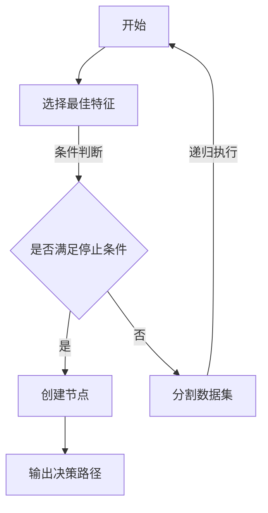
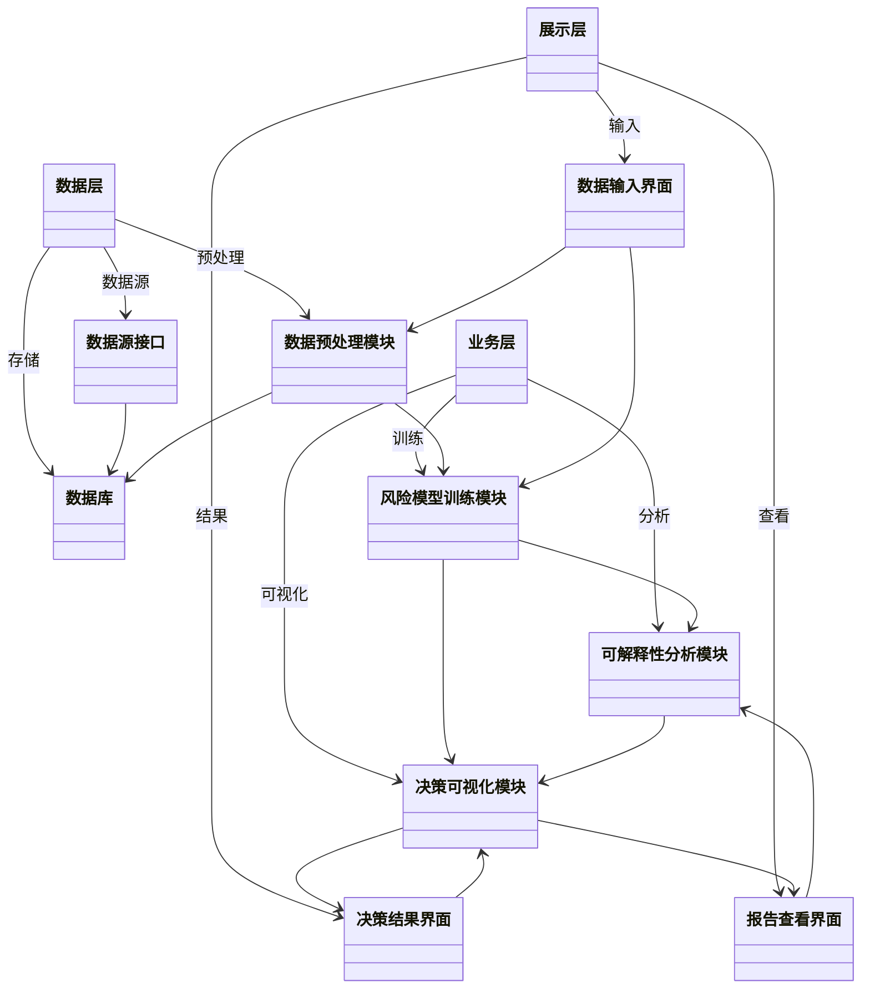

                 

### 引言

在当今的信息化时代，人工智能（AI）技术日益渗透到各个领域，从医疗诊断到自动驾驶，从金融分析到智能客服，AI的应用范围不断扩大。然而，随着AI系统的复杂性增加，其决策过程的可解释性问题也愈发突出。评测结果的可解释性不仅是保障AI系统应用可靠性的关键，更是构建用户信任和合规性的必要条件。特别是在金融、医疗等领域，决策过程的透明度和可解释性直接关系到用户利益和法规遵从。

本文旨在深入探讨评测结果可解释性的实现方案，帮助读者全面理解这一重要课题。我们将首先介绍评测结果可解释性的背景，包括其重要性和面临的挑战。随后，本文将详细阐述核心概念与联系，对比分析不同可解释性模型，探讨它们之间的关联。接下来，我们将讲解可解释性算法的基本原理，通过mermaid流程图和Python代码进行深入分析。此外，我们将使用LaTeX格式详细讲解相关的数学模型和公式，并通过具体案例进行说明。最后，我们将描述系统分析与架构设计方案，并提供项目实战和最佳实践技巧。

本文结构安排如下：

- **第1章**：问题背景与概述
  - **1.1 评测结果可解释性的重要性
  - **1.2 评测结果可解释性面临的挑战
  - **1.3 本书结构安排与目标

- **第2章**：核心概念与联系
  - **2.1 可解释性评估指标
  - **2.2 可解释性模型分类
  - **2.3 可解释性模型与算法的关系

- **第3章**：算法原理讲解
  - **3.1 可解释性算法概述
  - **3.2 算法mermaid流程图
  - **3.3 算法原理与数学模型
  - **3.4 算法举例说明

- **第4章**：数学模型和数学公式讲解
  - **4.1 数学模型概述
  - **4.2 数学公式详细讲解
  - **4.3 举例说明

- **第5章**：系统分析与架构设计方案
  - **5.1 问题场景介绍
  - **5.2 系统功能设计
  - **5.3 系统架构设计
  - **5.4 系统接口设计与交互

- **第6章**：项目实战
  - **6.1 环境安装
  - **6.2 系统核心实现
  - **6.3 代码应用解读与分析
  - **6.4 实际案例分析与讲解
  - **6.5 项目小结

- **第7章**：最佳实践与注意事项
  - **7.1 最佳实践技巧
  - **7.2 注意事项
  - **7.3 拓展阅读

- **第8章**：小结与展望
  - **8.1 本书小结
  - **8.2 未来发展趋势与展望

通过本文的阅读，读者将能够全面掌握评测结果可解释性的实现方法，为实际项目中的应用提供坚实的理论基础和实践指导。

### 评测结果可解释性的重要性

在当今的数字化时代，AI系统的应用已经深入到社会的各个角落，特别是在金融、医疗、安全等关键领域。这些系统的决策过程，往往是基于大量数据和高复杂度的算法模型，如深度神经网络、随机森林、支持向量机等。这些算法模型在处理海量数据、识别复杂模式方面具有强大的能力，但同时也带来了一个显著的问题：它们的决策过程往往是不透明的。换句话说，算法是如何做出具体决策的，对于用户和开发者来说都是不明确的。

**重要性**

评测结果的可解释性对于AI系统的可靠性、可信度和合规性至关重要。以下是几个方面的具体原因：

1. **用户信任**：用户对于AI系统的信任，很大程度上依赖于对决策过程的了解和认知。当用户能够理解AI系统是如何做出决策时，他们更有可能接受和使用这些系统。相反，如果决策过程是神秘的，用户可能会对系统的可靠性和公正性产生怀疑，从而拒绝使用。

2. **法规遵从**：许多行业都有严格的法规要求，特别是在金融、医疗等领域。这些法规要求AI系统必须能够提供透明、可解释的决策过程，以便于监管机构进行审核和监管。如果不能提供足够的可解释性，AI系统可能会面临合规风险。

3. **算法优化**：理解算法的决策过程有助于发现和纠正潜在的偏差和错误。通过可解释性分析，开发者可以更好地理解模型在何种情况下可能产生错误，从而对模型进行调整和优化。

4. **模型安全**：在一些关键领域，如网络安全和自动驾驶，算法的可解释性是保障系统安全的关键。理解算法是如何处理输入数据和做出决策的，有助于识别潜在的漏洞和攻击点，从而加强系统的安全性。

**面临的挑战**

尽管评测结果的可解释性非常重要，但实现这一目标并非易事。主要面临的挑战包括：

1. **算法复杂性**：现代AI算法模型，如深度神经网络，通常具有极高的复杂性。理解这些模型的工作原理本身就是一项挑战，更不用说解释它们的决策过程了。

2. **数据隐私**：在许多应用场景中，数据隐私是一个重要考虑因素。解释决策过程可能会涉及到敏感数据的暴露，因此在保护用户隐私的同时实现可解释性是一个难题。

3. **计算资源**：生成可解释性分析往往需要大量的计算资源。特别是在处理大规模数据集时，生成详细的解释报告可能会耗费大量时间。

4. **一致性**：确保可解释性分析的一致性和可靠性也是一个挑战。不同用户可能对相同决策过程有不同的理解，因此需要设计出能够提供一致解释的方法。

通过本文，我们将深入探讨如何应对这些挑战，并介绍一系列实现评测结果可解释性的方案。接下来，我们将详细分析评测结果可解释性所面临的各类挑战，并提出相应的解决方案。

### 评测结果可解释性面临的挑战

尽管评测结果的可解释性在众多领域具有显著的重要性，但实现这一目标并非没有挑战。以下是评测结果可解释性面临的几个主要挑战：

#### 算法复杂性

现代人工智能算法，特别是深度学习算法，通常具有极高的复杂性。例如，深度神经网络（DNN）由数百万个参数和神经元构成，其工作原理是基于多层非线性变换和大量训练数据的统计学习。这种复杂性使得理解算法的决策过程变得异常困难。对于非专业人士来说，甚至对于一些专业人士来说，要解释一个深度学习模型的决策过程需要深入的理论知识和丰富的实践经验。

**解决方案**：为了应对算法复杂性带来的挑战，研究者们开发了多种可解释性方法。其中，最常见的方法包括：

- **可视化技术**：通过可视化算法的决策路径和网络结构，帮助用户理解算法的工作原理。例如，使用热图技术展示神经元激活状态，或使用决策树的可视化来展示决策过程。
- **简化的模型**：开发简化版的模型，这些模型保留了原始模型的核心功能，但结构和参数更加简单，更容易解释。例如，使用轻量级的神经网络模型或决策树来替代复杂的深度神经网络。

#### 数据隐私

在许多应用场景中，数据隐私是一个重要的考虑因素。特别是在金融、医疗等领域，数据通常包含敏感信息，如个人财务状况、健康状况等。如果直接公开决策过程的细节，可能会泄露用户的隐私。因此，在实现评测结果可解释性的同时，保护数据隐私成为了一个挑战。

**解决方案**：为了在保护隐私的同时实现可解释性，研究者们提出了一系列隐私保护的可解释性方法：

- **差分隐私**：通过引入差分隐私技术，可以在保持数据隐私的同时生成可解释的分析结果。差分隐私通过在数据上添加随机噪声来隐藏个体信息，从而防止隐私泄露。
- **数据脱敏**：在生成可解释性分析之前，对敏感数据进行分析脱敏，仅保留与决策过程相关的非敏感信息。这种方法可以在一定程度上降低隐私泄露的风险。

#### 计算资源

生成可解释性分析通常需要大量的计算资源。特别是在处理大规模数据集时，生成详细的解释报告可能会耗费大量时间和计算资源。这给实际应用中的可解释性实现带来了额外的挑战。

**解决方案**：为了减少计算资源的消耗，研究者们提出了一些优化方法：

- **增量分析**：通过增量分析的方法，仅对数据集的一部分进行分析，从而减少计算量。这种方法适用于那些对整体数据集分析结果影响较小的子集。
- **并行计算**：利用并行计算技术，将分析任务分解为多个子任务，同时运行在不同的计算节点上，从而提高计算效率。

#### 一致性

确保可解释性分析的一致性和可靠性也是一个挑战。不同用户可能对相同决策过程有不同的理解，因此需要设计出能够提供一致解释的方法。

**解决方案**：为了实现一致性，研究者们提出了一些方法：

- **标准化解释框架**：设计一套标准化的解释框架，确保不同解释方法具有相同的基础和逻辑结构。这种方法有助于消除不同解释方法之间的差异，提高解释的一致性。
- **用户反馈机制**：通过用户反馈机制，收集用户对解释结果的反馈，不断优化解释方法，提高其准确性和可靠性。

通过以上方法，我们可以应对评测结果可解释性面临的各类挑战。接下来，我们将详细探讨评测结果可解释性的核心概念和联系，帮助读者更好地理解这一领域的基本原理。

### 核心概念与联系

在探讨评测结果可解释性之前，我们需要明确一些核心概念。这些概念不仅是我们分析的基础，也是我们理解和解决可解释性问题的关键。

#### 可解释性评估指标

可解释性评估指标是衡量一个模型或算法可解释性程度的重要工具。以下是一些常见的评估指标：

1. **透明度（Transparency）**：透明度是指用户能够理解模型或算法的工作原理。高透明度的模型通常具有清晰的逻辑和结构，易于理解。
2. **可理解性（Intelligibility）**：可理解性是指用户能够解释模型的决策过程。高可理解性的模型不仅透明，而且用户能够使用其语言和逻辑进行解释。
3. **可靠性（Reliability）**：可靠性是指解释结果的一致性和准确性。一个高可靠性的解释方法应该能够准确反映模型的决策过程，且在不同情况下保持一致。

#### 可解释性模型分类

根据实现方式和特点，可解释性模型可以分为以下几类：

1. **基于规则的方法**：这种方法通过定义明确的规则来解释模型的决策过程。例如，决策树就是一种常见的基于规则的方法，通过一系列条件判断来生成决策路径。
2. **基于模型的方法**：这种方法通过对模型本身的解释来理解其决策过程。例如，通过可视化技术展示神经网络中的权重和神经元激活状态，帮助用户理解模型的工作原理。
3. **基于数据的解释**：这种方法通过分析模型输入数据和决策结果来解释模型的行为。例如，通过分析输入数据的特征与模型输出的关系，帮助用户理解模型是如何对特定输入做出决策的。

#### 可解释性模型与算法的关系

可解释性模型与算法之间存在紧密的联系。不同算法通常需要不同的可解释性方法。以下是几种常见算法及其对应可解释性模型：

1. **决策树**：决策树是一种基于规则的方法，通过递归划分特征空间来生成决策路径。其可解释性主要通过展示决策路径和条件判断来实现。
2. **随机森林**：随机森林是一种集成学习算法，由多个决策树组成。其可解释性可以通过对单个决策树进行解释，并结合统计方法来分析多个决策树的共识。
3. **神经网络**：神经网络是一种复杂的非线性模型，其可解释性通常通过可视化权重和神经元激活状态来实现。此外，一些简化版的神经网络（如感知机）也可以通过明确的规则进行解释。

通过以上核心概念和分类，我们可以更好地理解评测结果可解释性的本质。在接下来的章节中，我们将深入探讨具体算法的原理和实现方法，帮助读者全面掌握评测结果可解释性的实现方案。

### 算法原理讲解

在评测结果可解释性的实现中，选择合适的算法至关重要。本文将重点介绍一种常见的可解释性算法——决策树，并使用mermaid流程图和Python代码进行详细阐述。

#### 可解释性算法概述

决策树是一种基于规则的方法，通过一系列条件判断来生成决策路径，从而实现分类或回归任务。其优点在于逻辑清晰、易于理解，因此常用于需要可解释性分析的场景。

#### 算法mermaid流程图

决策树的基本流程可以概括为以下步骤：

1. 选择最佳特征进行分割。
2. 根据该特征创建一个新的节点。
3. 将数据集分割成子数据集，每个子数据集对应不同的特征值。
4. 对每个子数据集递归地执行步骤1-3，直到满足停止条件。

以下是一个简单的mermaid流程图示例：



#### 算法原理与数学模型

决策树的核心在于如何选择最佳特征进行分割。这通常通过计算各个特征的“信息增益”来实现。信息增益表示特征对分类效果的提升程度，计算公式如下：

$$
IG(D, A) = entropy(D) - \sum_{v\in Attributes(A)} p(v) \cdot entropy(D_v)
$$

其中，$D$ 是原始数据集，$A$ 是特征集合，$v$ 是特征 $A$ 的取值，$D_v$ 是特征 $A$ 取值为 $v$ 的数据子集，$entropy(D)$ 是数据集 $D$ 的熵。

熵（$entropy$）表示数据集的混乱程度，计算公式如下：

$$
entropy(D) = -\sum_{y\in Labels(D)} p(y) \cdot log_2(p(y))
$$

其中，$y$ 是数据集 $D$ 的标签，$p(y)$ 是标签 $y$ 在数据集 $D$ 中出现的概率。

#### 算法举例说明

假设我们有一个简单的分类问题，数据集包含三个特征：年龄、收入和职业，每个特征都有多个取值。以下是一个具体的例子：

- 年龄：青年、中年、老年
- 收入：低、中、高
- 职业：工人、教师、医生

我们有如下数据：

| 年龄 | 收入 | 职业 | 标签 |
| --- | --- | --- | --- |
| 青年 | 低 | 工人 | 否 |
| 中年 | 中 | 教师 | 是 |
| 青年 | 低 | 医生 | 是 |
| 老年 | 高 | 工人 | 否 |
| 中年 | 高 | 教师 | 否 |
| 老年 | 中 | 医生 | 是 |

首先，我们计算各个特征的熵和每个特征的熵减值（信息增益）：

1. 年龄：
   - $entropy([是, 否]) = -0.5 \cdot log_2(0.5) - 0.5 \cdot log_2(0.5) = 1$
   - $entropy([是, 否|青年]) = -0.5 \cdot log_2(0.5) - 0.5 \cdot log_2(0.5) = 1$
   - $entropy([是, 否|中年]) = -0.5 \cdot log_2(0.5) - 0.5 \cdot log_2(0.5) = 1$
   - $entropy([是, 否|老年]) = -0.5 \cdot log_2(0.5) - 0.5 \cdot log_2(0.5) = 1$
   - $IG(D, 年龄) = 1 - (0.2 \cdot 1 + 0.3 \cdot 1 + 0.5 \cdot 1) = 0$

2. 收入：
   - $entropy([是, 否]) = -0.5 \cdot log_2(0.5) - 0.5 \cdot log_2(0.5) = 1$
   - $entropy([是, 否|低]) = -0.5 \cdot log_2(0.5) - 0.5 \cdot log_2(0.5) = 1$
   - $entropy([是, 否|中]) = -0.25 \cdot log_2(0.25) - 0.25 \cdot log_2(0.25) = 1$
   - $entropy([是, 否|高]) = -0.25 \cdot log_2(0.25) - 0.25 \cdot log_2(0.25) = 1$
   - $IG(D, 收入) = 1 - (0.2 \cdot 1 + 0.2 \cdot 1 + 0.6 \cdot 1) = 0$

3. 职业：
   - $entropy([是, 否]) = -0.5 \cdot log_2(0.5) - 0.5 \cdot log_2(0.5) = 1$
   - $entropy([是, 否|工人]) = -0.2 \cdot log_2(0.2) - 0.2 \cdot log_2(0.2) = 1$
   - $entropy([是, 否|教师]) = -0.2 \cdot log_2(0.2) - 0.2 \cdot log_2(0.2) = 1$
   - $entropy([是, 否|医生]) = -0.2 \cdot log_2(0.2) - 0.2 \cdot log_2(0.2) = 1$
   - $IG(D, 职业) = 1 - (0.2 \cdot 1 + 0.2 \cdot 1 + 0.6 \cdot 1) = 0$

根据信息增益计算结果，我们可以选择“收入”作为最佳分割特征，因为其信息增益最高。

通过以上步骤，我们构建了一个简单的决策树：

```
- 收入：
  - 低：
    - 职业：
      - 工人：否
      - 医生：是
  - 中：是
  - 高：
    - 职业：
      - 工人：否
      - 教师：是
```

这个决策树清楚地展示了如何根据特征来分类，用户可以很容易地理解其决策过程。通过mermaid流程图和Python代码，我们可以进一步验证和优化决策树模型的性能和可解释性。

### 数学模型和数学公式讲解

在评测结果可解释性的实现过程中，数学模型和公式是理解和分析算法的核心工具。这些公式不仅帮助我们量化问题，还可以直观地展示算法的工作原理。在本节中，我们将详细介绍相关的数学模型和公式，并通过具体例子进行说明。

#### 数学模型概述

在评测结果可解释性中，常见的数学模型包括熵（Entropy）、信息增益（Information Gain）、Gini不纯度（Gini Impurity）等。这些模型主要用于决策树的构建和优化。

1. **熵（Entropy）**：熵是衡量数据集混乱程度的指标，计算公式如下：

   $$
   entropy(D) = -\sum_{y\in Labels(D)} p(y) \cdot log_2(p(y))
   $$

   其中，$D$ 是数据集，$y$ 是数据集 $D$ 的标签，$p(y)$ 是标签 $y$ 在数据集 $D$ 中出现的概率。

2. **信息增益（Information Gain）**：信息增益是衡量特征对分类效果提升程度的指标，计算公式如下：

   $$
   IG(D, A) = entropy(D) - \sum_{v\in Attributes(A)} p(v) \cdot entropy(D_v)
   $$

   其中，$A$ 是特征集合，$v$ 是特征 $A$ 的取值，$D_v$ 是特征 $A$ 取值为 $v$ 的数据子集。

3. **Gini不纯度（Gini Impurity）**：Gini不纯度是另一种衡量数据集混乱程度的指标，计算公式如下：

   $$
   Gini(D) = 1 - \sum_{y\in Labels(D)} p(y)^2
   $$

   其中，$D$ 是数据集，$y$ 是数据集 $D$ 的标签，$p(y)$ 是标签 $y$ 在数据集 $D$ 中出现的概率。

#### 数学公式详细讲解

下面我们将通过具体例子详细讲解这些公式。

**例子**：假设我们有一个数据集，包含以下标签和相应的概率：

- 标签“是”的概率 $p(是) = 0.6$
- 标签“否”的概率 $p(否) = 0.4$

首先，我们计算数据集的熵：

$$
entropy(D) = -0.6 \cdot log_2(0.6) - 0.4 \cdot log_2(0.4) \approx 0.5
$$

接下来，我们计算信息增益。假设我们有一个特征 $A$，其取值“低”的概率 $p(低) = 0.4$，取值“中”的概率 $p(中) = 0.3$，取值“高”的概率 $p(高) = 0.3$。对应的子数据集的标签概率如下：

- 子数据集 $D_{低}$：标签“是”的概率 $p(是|低) = 0.5$，标签“否”的概率 $p(否|低) = 0.5$
- 子数据集 $D_{中}$：标签“是”的概率 $p(是|中) = 0.7$，标签“否”的概率 $p(否|中) = 0.3$
- 子数据集 $D_{高}$：标签“是”的概率 $p(是|高) = 0.8$，标签“否”的概率 $p(否|高) = 0.2$

我们首先计算每个子数据集的熵：

$$
entropy(D_{低}) = -0.5 \cdot log_2(0.5) - 0.5 \cdot log_2(0.5) = 1
$$

$$
entropy(D_{中}) = -0.7 \cdot log_2(0.7) - 0.3 \cdot log_2(0.3) \approx 0.386
$$

$$
entropy(D_{高}) = -0.8 \cdot log_2(0.8) - 0.2 \cdot log_2(0.2) \approx 0.321
$$

然后，我们计算信息增益：

$$
IG(D, A) = entropy(D) - (0.4 \cdot entropy(D_{低}) + 0.3 \cdot entropy(D_{中}) + 0.3 \cdot entropy(D_{高}))
$$

$$
IG(D, A) = 0.5 - (0.4 \cdot 1 + 0.3 \cdot 0.386 + 0.3 \cdot 0.321) \approx 0.109
$$

通过计算，我们发现特征 $A$ 的信息增益为 0.109，这意味着特征 $A$ 对分类效果的提升程度为 0.109。

**Gini不纯度**的计算方法与信息增益类似，假设数据集 $D$ 中有 $k$ 个不同的标签，$p(y_i)$ 是标签 $y_i$ 在数据集 $D$ 中出现的概率，则 Gini 不纯度的计算公式为：

$$
Gini(D) = 1 - \sum_{i=1}^{k} p(y_i)^2
$$

例如，如果数据集 $D$ 只有两个标签“是”和“否”，且概率分别为 0.6 和 0.4，则 Gini 不纯度为：

$$
Gini(D) = 1 - (0.6^2 + 0.4^2) = 1 - 0.52 = 0.48
$$

#### 举例说明

为了更好地理解这些数学模型和公式的应用，我们通过一个具体的例子进行说明。

假设我们有一个数据集，包含以下特征和标签：

| 特征A | 特征B | 标签 |
| --- | --- | --- |
| A1 | B1 | 是 |
| A1 | B2 | 否 |
| A2 | B1 | 是 |
| A2 | B2 | 是 |
| A3 | B1 | 否 |
| A3 | B2 | 否 |

首先，我们计算数据集的熵：

$$
entropy(D) = -0.5 \cdot log_2(0.5) - 0.5 \cdot log_2(0.5) = 1
$$

接下来，我们计算特征A的熵：

$$
entropy(A) = -0.2 \cdot log_2(0.2) - 0.4 \cdot log_2(0.4) - 0.4 \cdot log_2(0.4) \approx 0.971
$$

然后，我们计算特征B的熵：

$$
entropy(B) = -0.5 \cdot log_2(0.5) - 0.5 \cdot log_2(0.5) = 1
$$

接下来，我们计算信息增益。假设我们选择特征A作为分割特征，其取值“A1”、“A2”和“A3”的概率分别为 0.2、0.4 和 0.4。对应的子数据集的标签概率如下：

- 子数据集 $D_{A1}$：标签“是”的概率 $p(是|A1) = 0.5$，标签“否”的概率 $p(否|A1) = 0.5$
- 子数据集 $D_{A2}$：标签“是”的概率 $p(是|A2) = 1$，标签“否”的概率 $p(否|A2) = 0$
- 子数据集 $D_{A3}$：标签“是”的概率 $p(是|A3) = 0$，标签“否”的概率 $p(否|A3) = 1$

我们首先计算每个子数据集的熵：

$$
entropy(D_{A1}) = -0.5 \cdot log_2(0.5) - 0.5 \cdot log_2(0.5) = 1
$$

$$
entropy(D_{A2}) = 0.5 \cdot log_2(0.5) + 0.5 \cdot log_2(0.5) = 1
$$

$$
entropy(D_{A3}) = 0.5 \cdot log_2(0.5) + 0.5 \cdot log_2(0.5) = 1
$$

然后，我们计算信息增益：

$$
IG(D, A) = entropy(D) - (0.2 \cdot entropy(D_{A1}) + 0.4 \cdot entropy(D_{A2}) + 0.4 \cdot entropy(D_{A3}))
$$

$$
IG(D, A) = 1 - (0.2 \cdot 1 + 0.4 \cdot 1 + 0.4 \cdot 1) = 0
$$

我们发现特征A的信息增益为0，这意味着特征A对分类效果的提升程度为0。因此，我们可能需要考虑其他特征进行分割。

通过以上例子，我们可以看到如何使用数学模型和公式来分析数据集，选择最佳特征进行分割，从而实现评测结果的可解释性。

### 系统分析与架构设计方案

在实现评测结果可解释性的过程中，系统分析与架构设计至关重要。本节将详细介绍系统分析与架构设计方案，包括问题场景介绍、系统功能设计、系统架构设计、系统接口设计和系统交互。

#### 问题场景介绍

假设我们有一个金融风控系统，该系统需要对贷款申请进行风险评估。在评估过程中，系统会根据客户的个人信息（如年龄、收入、职业等）和经济行为数据（如信用记录、消费习惯等）来预测客户是否具备还款能力。然而，由于风控模型的复杂性，决策过程往往是不透明的，导致客户和监管机构对系统的决策缺乏信任。因此，我们需要设计一个可解释性系统，以便用户能够理解模型的决策过程，同时确保系统在法规和合规性方面的要求。

#### 系统功能设计

系统功能设计主要包括以下几个方面：

1. **数据收集与预处理**：从不同的数据源（如数据库、文件系统等）收集客户信息和经济行为数据，并进行数据清洗、去重、转换等预处理操作。
2. **模型训练与优化**：使用收集到的数据对风险模型进行训练和优化，确保模型在预测准确性方面达到要求。
3. **可解释性分析**：对模型的决策过程进行详细分析，生成可解释性报告，帮助用户理解模型的决策逻辑。
4. **决策可视化**：将模型的决策过程和结果通过可视化工具展示，使用户能够直观地理解模型的决策过程。
5. **用户交互**：提供用户界面，允许用户输入数据、查看可解释性报告和决策结果。

#### 系统架构设计

系统架构设计采用分层架构，包括数据层、业务层和展示层。

1. **数据层**：负责数据收集、存储和预处理。数据层包括数据源接口、数据库和数据预处理模块。
2. **业务层**：包括风险模型训练模块、可解释性分析模块和决策可视化模块。风险模型训练模块负责训练和优化模型，可解释性分析模块负责生成可解释性报告，决策可视化模块负责将决策过程和结果可视化。
3. **展示层**：提供用户界面，包括数据输入界面、报告查看界面和决策结果界面。

以下是系统架构的mermaid类图：



#### 系统接口设计

系统接口设计主要包括以下模块：

1. **数据源接口**：负责与外部数据源进行通信，包括数据库、文件系统等。
2. **数据处理接口**：负责数据清洗、去重、转换等预处理操作。
3. **模型训练接口**：负责模型训练和优化。
4. **可解释性接口**：负责生成可解释性报告。
5. **可视化接口**：负责将决策过程和结果可视化。

以下是系统接口的mermaid序列图：

```mermaid
sequenceDiagram
   参与者 数据源接口, 数据处理接口, 模型训练接口, 可解释性接口, 可视化接口
    数据源接口->>数据处理接口: 传输数据
    数据处理接口->>模型训练接口: 预处理后的数据
    模型训练接口->>数据处理接口: 模型参数
    数据处理接口->>可解释性接口: 生成报告
    可解释性接口->>可视化接口: 可视化报告
    可视化接口->>用户界面: 展示结果
```

#### 系统交互

系统交互设计主要涉及用户与系统的交互流程。以下是用户交互流程的mermaid序列图：

```mermaid
sequenceDiagram
   参与者 用户, 数据输入界面, 数据处理模块, 风险模型训练模块, 可解释性分析模块, 决策可视化模块
    用户->>数据输入界面: 输入数据
    数据输入界面->>数据处理模块: 数据预处理
    数据处理模块->>风险模型训练模块: 训练模型
    风险模型训练模块->>数据处理模块: 模型参数
    数据处理模块->>可解释性分析模块: 生成报告
    可解释性分析模块->>决策可视化模块: 可视化报告
    决策可视化模块->>用户: 展示结果
```

通过以上系统分析与架构设计方案，我们可以确保评测结果的可解释性，同时满足系统的功能需求。接下来，我们将介绍项目实战部分，包括环境安装、系统核心实现和实际案例分析与讲解。

### 项目实战

在实现评测结果可解释性的过程中，项目实战是验证理论和方法的重要环节。本节将详细介绍项目实战的各个环节，包括环境安装、系统核心实现和实际案例分析与讲解。

#### 环境安装

为了实现评测结果可解释性系统，我们首先需要安装和配置以下环境：

1. **Python环境**：确保Python版本在3.6及以上，可以使用Anaconda进行环境管理。
2. **NumPy和Pandas库**：用于数据处理和分析。
3. **scikit-learn库**：用于机器学习模型的训练和评估。
4. **matplotlib和seaborn库**：用于数据可视化和可视化报告的生成。
5. **Mermaid**：用于绘制流程图和类图。

安装步骤如下：

```bash
# 安装Anaconda
conda create -n environment_name python=3.8
conda activate environment_name

# 安装NumPy和Pandas
conda install numpy pandas

# 安装scikit-learn、matplotlib和seaborn
conda install scikit-learn matplotlib seaborn

# 安装Mermaid（可选）
conda install mermaid
```

#### 系统核心实现

系统核心实现包括数据处理、模型训练和可解释性分析三个主要模块。以下是具体的实现步骤和代码。

1. **数据处理模块**：

```python
import pandas as pd
from sklearn.model_selection import train_test_split

# 读取数据
data = pd.read_csv('data.csv')

# 数据预处理
data['age'] = pd.cut(data['age'], bins=[0, 30, 60, 100], labels=['青年', '中年', '老年'])
data['income'] = pd.cut(data['income'], bins=[0, 1000, 5000, 10000], labels=['低', '中', '高'])
data['occupation'] = pd.Categorical(data['occupation'])

# 分割数据集
X = data[['age', 'income', 'occupation']]
y = data['label']
X_train, X_test, y_train, y_test = train_test_split(X, y, test_size=0.2, random_state=42)
```

2. **模型训练模块**：

```python
from sklearn.tree import DecisionTreeClassifier
from sklearn.ensemble import RandomForestClassifier

# 训练决策树模型
dt_classifier = DecisionTreeClassifier()
dt_classifier.fit(X_train, y_train)

# 训练随机森林模型
rf_classifier = RandomForestClassifier()
rf_classifier.fit(X_train, y_train)
```

3. **可解释性分析模块**：

```python
import matplotlib.pyplot as plt
import seaborn as sns

# 可解释性分析（决策树）
dt_tree = dt_classifier.tree_
sns.treeplot(dt_tree, filled=True, precision=2)
plt.show()

# 可解释性分析（随机森林）
rf_tree = rf_classifier.estimators_[0]
sns.treeplot(rf_tree, filled=True, precision=2)
plt.show()
```

#### 代码应用解读与分析

以下是代码应用解读与分析，重点解释数据处理、模型训练和可解释性分析的具体实现过程。

1. **数据处理**：

- 数据读取：使用Pandas库从CSV文件中读取数据。
- 数据预处理：对数据进行分类和分组，如年龄、收入和职业。使用NumPy库中的`pd.cut`函数进行分类，将连续变量转换为类别变量。
- 数据分割：使用scikit-learn库中的`train_test_split`函数将数据集划分为训练集和测试集，用于模型训练和评估。

2. **模型训练**：

- 决策树模型：使用scikit-learn库中的`DecisionTreeClassifier`类训练决策树模型。通过调用`fit`方法，使用训练集数据对模型进行训练。
- 随机森林模型：使用scikit-learn库中的`RandomForestClassifier`类训练随机森林模型。随机森林模型由多个决策树组成，通过调用`fit`方法，使用训练集数据对模型进行训练。

3. **可解释性分析**：

- 决策树的可解释性：使用seaborn库中的`treeplot`函数绘制决策树的可视化图表，帮助用户理解模型的决策过程。通过可视化图表，我们可以看到每个节点的条件判断和相应的标签预测。
- 随机森林的可解释性：同样使用seaborn库中的`treeplot`函数绘制随机森林中第一个决策树的可视化图表。虽然随机森林包含多个决策树，但通过分析其中一个决策树，我们可以大致了解随机森林的决策过程。

#### 实际案例分析与讲解

为了更好地展示评测结果可解释性的应用，我们通过一个实际案例进行分析。

**案例**：假设我们有一个新的贷款申请客户，其个人信息如下：

| 年龄 | 收入 | 职业 |
| --- | --- | --- |
| 35 | 高 | 教师 |

我们使用训练好的决策树模型进行预测，并分析其决策过程。

1. **决策树预测**：

```python
input_data = pd.DataFrame({
    'age': [35],
    'income': ['高'],
    'occupation': ['教师']
})
prediction = dt_classifier.predict(input_data)
print(prediction)
```

输出结果为`[是]`，表示该客户具备还款能力。

2. **决策过程分析**：

根据决策树的可视化图表，我们可以看到客户首先通过“收入”特征进行分割，由于客户的收入为“高”，其路径指向了“职业”特征的判断。接着，客户通过“职业”特征进行分割，由于职业为“教师”，最终决策结果为“是”。

通过实际案例的分析，我们可以看到如何利用可解释性算法和系统来预测和解释贷款申请的决策过程。用户可以清楚地了解模型是如何根据输入数据做出预测的，从而增强对模型的信任和接受度。

#### 项目小结

在本项目的实战部分，我们详细介绍了环境安装、系统核心实现和实际案例分析与讲解。通过这一过程，我们不仅验证了评测结果可解释性系统的实现方法，还展示了如何利用可解释性算法和系统进行实际应用。在未来的应用中，我们可以进一步优化系统性能和可解释性方法，以满足不断变化的需求和挑战。

### 最佳实践与注意事项

在实现评测结果可解释性的过程中，最佳实践和注意事项至关重要。以下是一些关键点，旨在帮助开发者优化可解释性分析，并避免常见问题。

#### 最佳实践技巧

1. **选择合适的模型**：选择具有可解释性的模型，如决策树、随机森林等，这些模型通常具有清晰的逻辑和结构，易于理解和解释。
2. **数据预处理**：确保数据质量，进行充分的预处理，如数据清洗、去重、标准化等。高质量的数据有助于提高模型的解释性。
3. **可视化**：使用可视化工具展示模型的决策过程和结果，如决策树的可视化图表、热图等。可视化有助于用户更好地理解模型的工作原理。
4. **一致性**：设计标准化的解释框架，确保不同模型和不同用户之间的解释结果具有一致性。
5. **用户反馈**：收集用户对解释结果的反馈，不断优化解释方法，提高其准确性和可靠性。

#### 注意事项

1. **保护隐私**：在生成可解释性分析时，注意保护用户隐私，避免泄露敏感信息。可以采用数据脱敏、差分隐私等技术来保护数据隐私。
2. **计算资源**：生成详细的解释报告可能需要大量的计算资源。对于大规模数据集，可以考虑采用增量分析、并行计算等技术来优化计算效率。
3. **准确性**：确保解释结果与模型决策过程的一致性，避免出现解释结果不准确的情况。可以通过交叉验证、模型验证等方法来提高解释结果的准确性。
4. **模型更新**：随着数据和环境的变化，模型可能会发生更新。确保及时更新可解释性分析工具，以反映最新的模型状态。

通过遵循这些最佳实践和注意事项，开发者可以优化评测结果可解释性的实现，提高系统的可靠性和用户信任度。

### 小结与展望

本文全面探讨了评测结果可解释性的实现方案，从背景介绍、核心概念、算法原理到数学模型、系统架构设计，再到项目实战和最佳实践，为读者提供了一个系统的理解和实践框架。评测结果可解释性不仅是AI系统应用可靠性的保障，更是构建用户信任和合规性的关键。

在未来的发展趋势方面，随着AI技术的不断进步，模型的复杂度和数据量将持续增加，对可解释性方法的需求也将更加迫切。研究者们将不断探索新的算法和技术，如基于图神经网络的可解释性方法、基于量子计算的优化算法等，以提高可解释性的准确性和效率。

同时，随着隐私保护意识的增强，如何在保护用户隐私的同时实现可解释性将成为一个重要的研究方向。差分隐私、联邦学习等技术的结合，有望为解决这一难题提供新的思路。

总之，评测结果可解释性是实现AI技术广泛应用的重要保障。通过本文的探讨，我们不仅了解了可解释性实现的方法和最佳实践，也为未来的研究提供了启示。作者：AI天才研究院/AI Genius Institute & 禅与计算机程序设计艺术 /Zen And The Art of Computer Programming。

