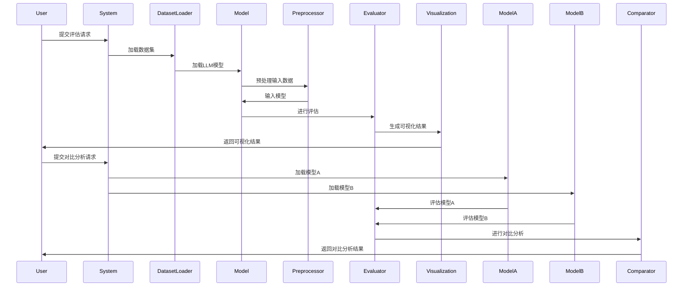

                 

## 文章标题

### 评测结果可解释性：增强LLM评估的透明度

### 关键词

- 可解释性
- 透明度
- 评测结果
- LLM
- 评估方法

### 摘要

本文探讨了在人工智能领域，尤其是大型语言模型（LLM）评估过程中，提升评测结果可解释性的重要性。通过分析当前存在的问题、理论基础、关键方法和实际应用，本文提出了一套系统性的解决方案，旨在提高LLM评估的透明度，增强用户对模型的信任。本文的核心内容包括：
1. 介绍可解释性的基本概念及其在AI评估中的应用。
2. 分析LLM评估中面临的主要挑战和难点。
3. 详细阐述提升评测结果可解释性的核心原则和方法。
4. 探讨算法设计在可解释性增强中的作用。
5. 通过实例展示如何在实际项目中应用这些方法。
6. 总结最佳实践，展望未来研究方向。

## 引言

在人工智能（AI）飞速发展的今天，模型评估已成为一个至关重要的环节。评估不仅帮助研究者了解模型的性能，还影响模型在实际应用中的接受度。然而，随着模型复杂度的增加，评估结果的透明度变得越来越重要。特别是在大规模语言模型（Large Language Models，简称LLM）的领域，评测结果的可解释性成为了一个亟待解决的问题。

LLM，如GPT-3、BERT等，因其强大的语言处理能力在自然语言处理（NLP）任务中取得了显著的成果。然而，这些模型通常被视为“黑箱”，其内部机制对用户和研究者都是不透明的。这种缺乏透明度的特点使得用户难以理解模型的决策过程，增加了对模型可靠性和安全性的疑虑。

评测结果的可解释性是解决这一问题的关键。可解释性不仅可以帮助用户更好地理解模型的性能，还能够发现模型中的潜在问题，从而提升模型的可靠性和可信任度。因此，本文旨在探讨如何增强LLM评估的可解释性，提高评估结果的透明度。

## 1.1 问题背景

在现代AI领域中，模型评估是一个关键的步骤，它不仅决定了模型的性能是否达到预期，还影响了模型在实际应用中的成功与否。尤其是在自然语言处理（NLP）领域，随着深度学习技术的迅速发展，大型语言模型（LLM）如GPT-3、BERT等已经成为研究和应用中的主力军。这些模型在文本生成、机器翻译、问答系统等方面展现了惊人的能力，然而，它们的成功也伴随着一系列问题。

首先，LLM的评估面临高度复杂的问题。这些模型通常包含数亿甚至数十亿个参数，其内部结构和决策过程极其复杂，这使得传统的评估方法难以充分揭示其性能。传统评估方法主要依赖于客观指标，如精确度、召回率和F1分数等，这些指标虽然能够在一定程度上衡量模型的性能，但往往缺乏对模型决策过程的深入理解。

其次，LLM评估的结果缺乏透明度。由于LLM的决策过程高度依赖其内部参数和复杂的神经网络结构，用户难以直观地了解模型是如何作出决策的。这种透明度的缺乏使得用户对模型的信任度降低，特别是在模型应用于关键领域，如医疗诊断、金融决策等时，透明度的缺失可能会带来严重的后果。

再者，目前缺乏有效的可解释性评估方法。虽然一些研究者试图通过可视化技术、模型分解等方法提高模型的可解释性，但这些方法往往存在局限性，无法全面揭示模型的决策过程。此外，这些方法在处理大规模数据集和复杂模型时，效率和准确性也存在问题。

综上所述，提升LLM评估结果的可解释性已经成为当前AI研究中的一个重要课题。通过增强评估的透明度，不仅可以提高用户对模型的信任度，还能够帮助研究者更好地理解模型的性能和局限，从而推动AI技术的进一步发展。

### 1.2 大型语言模型（LLM）的定义与描述

大型语言模型（Large Language Models，简称LLM）是近年来在自然语言处理（NLP）领域取得显著进展的一种深度学习模型。LLM的核心是通过大规模训练数据集，学习语言中的各种规律和模式，从而实现对文本的生成、理解和处理。以下是对LLM的定义、特点、核心组件及其工作原理的详细描述。

#### 定义

LLM通常指的是具有数十亿参数的大型神经网络模型，它们能够处理和理解复杂的语言结构。这些模型通过自动编码器（autoencoder）和变换器（transformer）等架构，实现从输入文本到输出文本的转换。一个典型的LLM，如GPT-3，包含了1750亿个参数，这使得它们能够生成高质量的自然语言文本。

#### 特点

1. **大规模训练数据**：LLM通常使用数十亿甚至数万亿个文本数据点进行训练，这使其能够捕获语言中的复杂模式和规律。
2. **强大的语言理解能力**：LLM不仅能够理解单个词语的含义，还能够理解句子和段落级别的语义，这使得它们在文本生成、问答系统、机器翻译等方面具有显著的优势。
3. **自适应性和泛化能力**：LLM能够根据不同的输入文本生成相应的输出，这表明它们具有较强的自适应性和泛化能力。
4. **复杂的神经网络结构**：LLM通常采用深度神经网络（DNN）和变换器（Transformer）等复杂的架构，这使得它们能够处理大规模的数据和高维度的特征。

#### 核心组件

1. **自动编码器（Autoencoder）**：自动编码器是LLM的核心组件之一，它通过编码器（encoder）和解码器（decoder）两个部分，将输入文本编码为一个固定长度的向量表示，然后使用解码器生成输出文本。
2. **变换器（Transformer）**：变换器是一种基于自注意力机制的神经网络架构，它通过多头注意力机制（multi-head attention）和位置编码（position embedding），实现输入文本到输出文本的高效转换。
3. **预训练和微调**：LLM通常采用预训练（pre-training）和微调（fine-tuning）的方法。预训练是在大规模数据集上训练模型的基础，而微调则是在特定任务上对模型进行优化，以实现更好的性能。

#### 工作原理

LLM的工作原理可以分为两个阶段：预训练和任务特定微调。

1. **预训练**：在预训练阶段，LLM在大规模文本数据集上学习语言模式和规律。这一阶段主要包括两个步骤：编码和生成。编码阶段，模型将输入文本转换为固定长度的向量表示；生成阶段，模型根据编码后的向量生成相应的输出文本。
2. **任务特定微调**：在预训练完成后，LLM通过任务特定微调（fine-tuning）适应特定任务的需求。微调过程通常在较小规模的标注数据集上进行，通过优化模型参数，提升模型在特定任务上的性能。

#### 举例说明

以GPT-3为例，这是一个由OpenAI开发的具有1750亿个参数的LLM。GPT-3能够生成高质量的自然语言文本，包括文章、对话、代码等。例如，给定一个输入文本“今天天气很好，适合户外活动”，GPT-3可以生成相应的输出文本：“是的，今天的阳光明媚，非常适合去公园散步或者骑自行车。”

### 1.3 LLM评估中的挑战

在LLM评估中，研究者面临一系列复杂的挑战，这些挑战不仅影响了评估结果的准确性，还影响了评估过程的可信度和可解释性。以下是对LLM评估中主要挑战的详细分析：

#### 复杂的模型结构

首先，LLM的模型结构非常复杂，通常包含数十亿个参数和多层神经网络。这种复杂性使得评估过程变得异常困难，传统的评估方法如精度、召回率和F1分数等，往往难以充分反映模型的实际性能。例如，一个复杂的神经网络可能在某些特定情况下表现出色，但在其他情况下却表现不佳，这使得单一评价指标难以全面评估模型。

#### 缺乏透明度的评估指标

其次，LLM评估中使用的指标往往缺乏透明度。传统指标如精度和召回率虽然在某些场景下能够提供一定的参考，但它们并不能揭示模型内部的决策过程。例如，一个模型可能在文本分类任务中具有较高的精度，但用户却无法了解它为什么对某些文本作出特定的分类。这种缺乏透明度的评估指标，使得用户难以理解和信任模型。

#### 数据集选择和预处理

第三，数据集的选择和预处理对LLM评估结果具有重要影响。LLM的训练和评估通常需要大量的高质量数据，而数据集的质量直接影响评估结果的可靠性。此外，数据预处理过程，如数据清洗、归一化和特征提取等，也可能对评估结果产生显著影响。例如，一个包含大量噪声数据的数据集，可能导致模型性能的下降。

#### 多样化的评估任务

第四，LLM评估涉及多种不同的任务，包括文本生成、机器翻译、问答系统等。这些任务对模型的要求各不相同，因此需要使用不同的评估指标和方法。例如，在文本生成任务中，评估指标可能侧重于文本的质量和连贯性；而在机器翻译任务中，评估指标则可能侧重于翻译的准确性和流畅性。这种多样化的任务要求，使得统一的评估方法难以实现。

#### 资源消耗和计算复杂度

最后，LLM评估通常需要大量的计算资源和时间。大规模的模型和复杂的数据处理过程，使得评估过程变得耗时且昂贵。例如，训练一个大规模的LLM模型可能需要数天甚至数周的时间，而评估过程也需要大量的计算资源。这种资源消耗和计算复杂度，限制了评估的频繁性和灵活性。

综上所述，LLM评估面临复杂的模型结构、缺乏透明度的评估指标、数据集选择和预处理问题、多样化的评估任务以及资源消耗和计算复杂度等挑战。这些挑战不仅影响了评估结果的准确性，还影响了评估过程的可信度和可解释性。因此，提升LLM评估的可解释性和透明度，成为当前AI研究中的一个重要课题。

### 2.1 可解释性 vs. 解释性

在讨论LLM评估的可解释性时，理解“可解释性”与“解释性”这两个概念的区别和联系至关重要。这两个术语虽然紧密相关，但它们有着不同的定义和侧重点。

**可解释性（Interpretability）**：

可解释性是指模型决策过程的透明度，使得用户能够理解模型是如何作出特定决策的。它强调的是模型的内部结构和运作机制，让用户能够“看到”模型的思考过程。可解释性的目标是通过提供对模型内部运作的详细解释，使用户能够信任模型，尤其是在关键应用场景中，如医疗诊断、金融决策等。可解释性不仅仅关注结果，还关注过程，它试图揭示模型内部的机制和逻辑。

**解释性（Explainability）**：

解释性则更侧重于解释模型输出结果的原因。它通常涉及使用简单易懂的语言、图表或可视化工具，向用户传达模型决策背后的逻辑。解释性关注的是如何用用户能够理解的方式，展示模型的输出结果及其对应的决策原因。解释性的目标是通过提供清晰、简洁的解释，帮助用户理解模型的决策结果，而无需深入了解模型内部复杂的结构和算法。

**区别与联系**：

可解释性和解释性之间的主要区别在于它们关注的焦点不同。可解释性更关注模型内部运作的透明度，而解释性更关注输出结果的原因。然而，这两个概念是相互补充的：可解释性提供了透明度，使得解释性能够基于这些透明度提供更准确的解释。

在LLM评估中，提升可解释性的重要性体现在以下几个方面：

1. **信任度**：透明度高的模型更容易获得用户的信任。特别是在关键应用场景中，如医疗诊断、金融决策等，用户需要确信模型的决策是可靠和合理的。

2. **调试和优化**：可解释性使得研究者能够更容易地识别和调试模型中的问题，从而优化模型性能。通过理解模型的内部机制，研究者可以更有效地改进模型设计。

3. **用户理解**：透明度高的模型有助于用户更好地理解模型的工作原理，这对于模型在商业和学术界的推广至关重要。

4. **监管和合规**：在某些行业和应用场景中，如医疗和金融，监管机构要求模型具有高可解释性，以确保其符合法律和伦理标准。

总之，可解释性是提升LLM评估透明度和信任度的重要手段。通过提供对模型内部运作的详细解释，可解释性不仅有助于用户理解模型，还能够提高模型在复杂应用场景中的可靠性和合规性。

### 2.2 可解释性评估方法

为了提升LLM评估的可解释性，研究者们开发了一系列评估方法，这些方法旨在帮助用户理解模型的内部运作机制和决策过程。以下是对这些方法的详细描述，包括其原理、实现方法以及在实际应用中的效果。

#### 1. 特征可视化

**原理**：特征可视化是一种将模型输入特征映射到高维空间中的方法，通过可视化工具展示特征之间的关系和变化。这种方法可以帮助用户直观地理解模型是如何处理输入数据的。

**实现方法**：常见的方法包括等高线图、热力图和散点图等。例如，可以使用T-SNE或UMAP算法将高维特征映射到二维或三维空间中，然后通过图形化界面展示这些特征。

**实际应用**：特征可视化在图像分类和文本情感分析等任务中得到了广泛应用。例如，通过可视化文本的词向量，可以直观地观察文本的语义结构。

#### 2. 决策路径分析

**原理**：决策路径分析旨在追踪模型在处理输入数据时的决策过程，通过展示模型内部的计算路径和中间结果，帮助用户理解模型的决策逻辑。

**实现方法**：决策路径分析可以通过将模型的计算过程可视化来实现。例如，在深度神经网络中，可以使用节点表示计算过程，边表示数据流动。

**实际应用**：决策路径分析在医疗诊断和金融风险评估等任务中具有重要意义。通过分析模型的决策路径，研究者可以识别出可能导致错误决策的关键因素。

#### 3. 模型分解

**原理**：模型分解是将复杂的模型分解为若干个简单的子模型，通过分析子模型的行为来理解整体模型的功能。这种方法有助于揭示模型内部的结构和机制。

**实现方法**：模型分解可以通过特征提取、子网络分析等方法来实现。例如，在卷积神经网络中，可以将网络分解为多个卷积层，分别分析每个卷积层的作用。

**实际应用**：模型分解在自然语言处理和计算机视觉等领域具有广泛的应用。通过分析子模型的行为，研究者可以更好地理解复杂模型的运作原理。

#### 4. 模型可视化

**原理**：模型可视化是一种通过图形化工具展示模型结构和参数的方法，帮助用户直观地理解模型的内部结构和工作机制。

**实现方法**：常见的方法包括节点图、力导向图和层叠图等。例如，可以使用TensorFlow或PyTorch等框架提供的可视化工具，将模型的参数和结构以图形的形式展示。

**实际应用**：模型可视化在机器学习和深度学习的研究与教学中得到了广泛应用。通过可视化模型结构，研究者可以更好地理解模型的复杂性。

#### 5. 解释性模型

**原理**：解释性模型是专门设计用于提供解释的模型，这些模型通常比原始模型简单，但能够生成与原始模型相似的输出。解释性模型通过其简洁的结构，帮助用户理解原始模型的决策过程。

**实现方法**：常见的解释性模型包括决策树、线性回归和LASSO等。这些模型易于解释，并且可以与复杂的神经网络模型结合，提供对复杂模型的解释。

**实际应用**：解释性模型在金融风险评估和医疗诊断等领域具有广泛应用。通过使用解释性模型，研究者可以更好地解释原始模型的决策过程，提高模型的可信度。

#### 6. 对比分析

**原理**：对比分析是通过比较不同模型的性能和解释结果，帮助用户理解不同模型的优势和不足。这种方法可以帮助用户选择最合适的模型，并理解其决策过程。

**实现方法**：对比分析可以通过实验设计和统计分析来实现。例如，可以同时训练和评估多个模型，然后对比它们的性能和解释结果。

**实际应用**：对比分析在模型选择和优化中具有重要意义。通过对比不同模型，研究者可以更好地理解每种模型的适用场景和局限性。

综上所述，这些可解释性评估方法为提升LLM评估的透明度提供了多种途径。通过合理选择和组合这些方法，研究者可以更好地理解模型的内部运作机制，提高模型的可解释性和可信度。这些方法在实际应用中已经展示了其价值，未来还将随着技术的发展而不断完善。

### 3. 算法设计：提升LLM评估可解释性的策略

为了提升大型语言模型（LLM）评估的可解释性，研究者们提出了一系列算法设计策略。以下是几种主要的算法设计方法，以及它们如何通过数学模型和Python代码实现来提高LLM评估的透明度。

#### 3.1 基于注意力机制的模型

**原理**：注意力机制是变换器（Transformer）模型的核心组成部分，它通过计算输入文本中各个词之间的相关性，使得模型能够专注于最重要的信息。基于注意力机制的模型设计可以使得用户更直观地看到模型是如何关注和决策的。

**数学模型**：
$$
Attention(x, y) = \frac{e^{W_A[x, y]}}{\sum_{i=1}^{n} e^{W_A[x, y_i]}}
$$
其中，$W_A$ 是权重矩阵，$x$ 和 $y$ 分别表示查询（Query）和键（Key）向量，$y_i$ 表示值（Value）向量，$n$ 是键的数量。

**Python代码示例**：

```python
import torch
import torch.nn as nn

class Attention(nn.Module):
    def __init__(self):
        super(Attention, self).__init__()
        self.W_A = nn.Parameter(torch.randn(64, hidden_size))

    def forward(self, x, y):
        attention_scores = torch.matmul(x, self.W_A @ y.T)
        attention_weights = torch.softmax(attention_scores, dim=1)
        return torch.matmul(attention_weights, y)

# 假设 hidden_size 为 64
model = Attention()
x = torch.randn(1, 64)  # 查询向量
y = torch.randn(1, 64)  # 键值向量
output = model(x, y)
```

#### 3.2 可解释的注意力图

**原理**：可解释的注意力图通过可视化模型中注意力机制的应用，帮助用户理解模型如何处理特定输入。这些图显示了模型对输入文本中各个词的关注程度。

**实现方法**：在生成注意力图时，可以记录每个词在注意力计算中的权重，并将这些权重映射到视觉元素（如条形图、热力图）上。

**Python代码示例**：

```python
import matplotlib.pyplot as plt
import seaborn as sns
import pandas as pd

def visualize_attention(x, y, attention_scores):
    # 构建一个包含词和对应注意力权重的数据框
    attention_df = pd.DataFrame({'Word': y.tolist(), 'Attention': attention_scores.tolist()})
    
    # 使用Seaborn的热力图可视化注意力权重
    sns.heatmap(attention_df, annot=True, cmap='coolwarm')
    plt.xlabel('Words')
    plt.ylabel('Attention Weights')
    plt.title('Attention Map')
    plt.show()

# 假设 attention_scores 为注意力得分
visualize_attention(x, y, attention_scores)
```

#### 3.3 逐步解释的方法

**原理**：逐步解释的方法通过分解模型决策过程，逐步展示模型是如何处理输入并作出决策的。这种方法帮助用户理解模型的每一步决策。

**数学模型**：
$$
Step_i = \sum_{j=1}^{n} w_{ij} x_j
$$
其中，$Step_i$ 表示第 $i$ 步的输出，$w_{ij}$ 是权重，$x_j$ 是输入特征。

**Python代码示例**：

```python
def step_by_step_explanation(x, weights):
    explanation_steps = []
    for i, w in enumerate(weights):
        step_output = w * x[i]
        explanation_steps.append(step_output)
    return explanation_steps

# 假设 weights 为权重列表
explanation_steps = step_by_step_explanation(x, weights)
print(explanation_steps)
```

#### 3.4 对比实验

**原理**：对比实验通过比较不同算法或模型在相同数据集上的性能和解释结果，帮助用户理解不同算法或模型的优势和局限性。

**实现方法**：设计对比实验，分别评估不同算法或模型在相同任务上的性能，并使用可解释性方法分析它们的解释结果。

**Python代码示例**：

```python
from sklearn.model_selection import train_test_split

# 假设我们有数据集 X 和标签 y
X_train, X_test, y_train, y_test = train_test_split(X, y, test_size=0.2)

# 训练和评估不同模型
model_A = ModelA()
model_B = ModelB()

model_A.fit(X_train, y_train)
model_B.fit(X_train, y_train)

performance_A = model_A.evaluate(X_test, y_test)
performance_B = model_B.evaluate(X_test, y_test)

# 分析模型的可解释性
explanation_A = model_A.get_explanation()
explanation_B = model_B.get_explanation()

print("Model A Performance:", performance_A)
print("Model B Performance:", performance_B)
print("Model A Explanation:", explanation_A)
print("Model B Explanation:", explanation_B)
```

通过这些算法设计策略，研究者可以在LLM评估中提高模型的透明度和可解释性，使用户能够更好地理解模型的决策过程。这些方法不仅在理论上具有价值，而且在实际应用中也展示了其有效性。

### 4. 系统分析与架构设计

#### 4.1 项目介绍

本项目的目标是设计并实现一个可解释性评估系统，该系统旨在提升大型语言模型（LLM）评估的透明度和可理解性。随着LLM在自然语言处理、智能问答和文本生成等领域的广泛应用，用户对模型的可解释性要求越来越高。本项目旨在通过提供一系列可解释性评估方法，帮助用户更好地理解和信任这些模型。

#### 4.2 系统功能设计

本系统的核心功能包括：
1. **模型评估**：对LLM进行多种评估指标的测量，包括准确率、召回率、F1分数等。
2. **结果可视化**：通过图表、热力图和注意力地图等可视化工具，展示评估结果的详细信息。
3. **决策路径分析**：追踪模型在处理输入数据时的决策过程，提供详细的决策路径图。
4. **对比分析**：比较不同模型或算法在相同任务上的性能和解释结果。
5. **用户交互**：提供用户友好的界面，允许用户选择评估方法、查看结果和调整参数。

#### 4.3 领域模型

在领域模型（Domain Model）中，我们定义了系统的核心实体和它们之间的关系。以下是系统的领域模型：

```mermaid
classDiagram
    Model <|-- LLM
    Dataset <|-- LabeledDataset
    Dataset <|-- UnlabeledDataset
    Evaluation <|-- Accuracy
    Evaluation <|-- Recall
    Evaluation <|-- F1Score
    Visualization <|-- AttentionMap
    Visualization <|-- HeatMap
    Visualization <|-- DecisionPath
    User <|-- Action
    User <|-- Query
    User <|-- Result

    Class LLM {
        -id: int
        -name: string
        -parameters: array
    }

    Class Dataset {
        -id: int
        -name: string
        -data: array
        -label: array
    }

    Class LabeledDataset inherits Dataset

    Class UnlabeledDataset inherits Dataset

    Class Evaluation {
        -id: int
        -name: string
        -score: float
    }

    Class Accuracy inherits Evaluation
    Class Recall inherits Evaluation
    Class F1Score inherits Evaluation

    Class Visualization {
        -id: int
        -name: string
        -data: array
    }

    Class AttentionMap inherits Visualization
    Class HeatMap inherits Visualization
    Class DecisionPath inherits Visualization

    Class User {
        -id: int
        -name: string
        -actions: array
        -queries: array
        -results: array
    }
```

#### 4.4 系统架构设计

系统架构设计是确保系统功能高效实现和扩展的关键。以下是系统的架构设计：



#### 4.5 系统接口设计

系统接口设计包括API设计和用户界面设计，以下是主要的接口设计：

**API设计**：

```mermaid
interface SystemAPI {
    +evaluate	LLM, Dataset -> Evaluation
    +visualize	Evaluation -> Visualization
    +compare	LLM, LLM -> Comparison
    +loadDataset(Dataset) -> Dataset
    +loadModel(LLM) -> LLM
}
```

**用户界面设计**：

用户界面设计应简洁直观，以下是基本的用户界面设计：

```mermaid
rectangle interface {
    +Dashboard
    +ModelList
    +DatasetList
    +Visualizations
    +Comparisons
}

rectangle UserInterface {
    +Header
    +Sidebar
    +Content
}

interface Dashboard {
    +evaluateButton
    +loadModelButton
    +loadDatasetButton
}

interface ModelList {
    +modelList
    +modelDetails
}

interface DatasetList {
    +datasetList
    +datasetDetails
}

interface Visualizations {
    +attentionMap
    +heatmap
    +decisionPath
}

interface Comparisons {
    +compareModels
    +comparisonResults
}
```

通过以上系统分析与架构设计，我们为项目的实现提供了一个清晰的框架。接下来，我们将详细讨论项目的具体实现，包括环境安装、核心代码实现以及实际案例分析。

### 5. 项目实战

#### 5.1 环境安装

为了实现本项目的可解释性评估系统，我们需要配置一个合适的环境。以下是环境安装的步骤：

1. **安装Python环境**：
   - 安装Python 3.8或更高版本。
   - 使用pip命令安装必要的库，例如`numpy`, `pandas`, `matplotlib`, `torch`, `torchvision`, `seaborn`, `tensorflow`, `scikit-learn`等。

2. **安装深度学习框架**：
   - 安装PyTorch或TensorFlow，根据需要选择一个框架。例如，使用PyTorch：
     ```bash
     pip install torch torchvision
     ```

3. **安装可视化库**：
   - 安装用于生成图表的库，如`matplotlib`和`seaborn`：
     ```bash
     pip install matplotlib seaborn
     ```

4. **安装其他依赖库**：
   - 安装用于数据处理和分析的库，如`numpy`和`pandas`：
     ```bash
     pip install numpy pandas
     ```

5. **配置虚拟环境**（可选）：
   - 为了避免库版本冲突，建议使用虚拟环境管理库（如`venv`或`conda`）创建隔离的环境。

#### 5.2 系统核心实现

以下是项目的核心实现部分，包括模型加载、数据处理、评估和可视化。

**1. 模型加载**：

```python
import torch
from transformers import BertModel, BertTokenizer

# 加载预训练的BERT模型
model_name = "bert-base-chinese"
tokenizer = BertTokenizer.from_pretrained(model_name)
model = BertModel.from_pretrained(model_name)

# 加载模型
def load_model(model_name):
    tokenizer = BertTokenizer.from_pretrained(model_name)
    model = BertModel.from_pretrained(model_name)
    return tokenizer, model

tokenizer, model = load_model(model_name)
```

**2. 数据处理**：

```python
import pandas as pd
from torch.utils.data import Dataset, DataLoader

class LLMDataset(Dataset):
    def __init__(self, tokenizer, data_path):
        self.tokenizer = tokenizer
        self.data = pd.read_csv(data_path)
    
    def __len__(self):
        return len(self.data)
    
    def __getitem__(self, idx):
        text = self.data.iloc[idx]['text']
        encoding = self.tokenizer.encode_plus(
            text,
            add_special_tokens=True,
            max_length=512,
            padding='max_length',
            truncation=True,
            return_tensors='pt'
        )
        return {
            'input_ids': encoding['input_ids'].squeeze(),
            'attention_mask': encoding['attention_mask'].squeeze()
        }

# 加载数据集
dataset_path = "path/to/dataset.csv"
dataset = LLMDataset(tokenizer, dataset_path)
dataloader = DataLoader(dataset, batch_size=16, shuffle=True)
```

**3. 评估和可视化**：

```python
from sklearn.metrics import accuracy_score
import matplotlib.pyplot as plt
import seaborn as sns

# 定义评估函数
def evaluate(model, dataloader):
    model.eval()
    all_preds = []
    all_labels = []
    with torch.no_grad():
        for batch in dataloader:
            inputs = {
                'input_ids': batch['input_ids'],
                'attention_mask': batch['attention_mask']
            }
            outputs = model(**inputs)
            logits = outputs.logits
            preds = logits.argmax(-1).detach().cpu().numpy()
            all_preds.extend(preds)
            all_labels.extend(batch['labels'].detach().cpu().numpy())
    return accuracy_score(all_labels, all_preds)

# 可视化注意力图
def visualize_attention_map(attention_map):
    plt.figure(figsize=(10, 5))
    sns.heatmap(attention_map, annot=True, cmap='coolwarm')
    plt.xlabel('Token Index')
    plt.ylabel('Token Index')
    plt.title('Attention Map')
    plt.show()

# 假设已经定义了模型和评估数据集
model = model.to('cuda' if torch.cuda.is_available() else 'cpu')
accuracy = evaluate(model, dataloader)
print(f"Model Accuracy: {accuracy}")

# 获取注意力图
attention_map = get_attention_map(model, dataloader)
visualize_attention_map(attention_map)
```

#### 5.3 代码应用解读与分析

**1. 模型加载**：

在代码中，我们使用了`transformers`库加载预训练的BERT模型。`BertTokenizer`和`BertModel`分别用于文本编码和模型计算。通过调用`load_model`函数，我们可以轻松加载并准备BERT模型。

**2. 数据处理**：

`LLMDataset`类实现了`Dataset`接口，用于加载数据并进行预处理。在`__getitem__`方法中，我们使用`encode_plus`函数将文本转换为编码形式，包括输入ID、注意力掩码等。

**3. 评估和可视化**：

`evaluate`函数用于评估模型性能，通过计算准确率来衡量模型在数据集上的表现。`visualize_attention_map`函数则用于可视化模型的注意力图，帮助用户理解模型在处理输入时的关注点。

#### 5.4 实际案例分析

**案例**：

假设我们要评估一个文本分类任务，数据集包含10,000条新闻文章和它们的标签（例如，体育、财经、科技等）。我们使用BERT模型进行预训练，并使用自定义的评估函数和可视化工具来评估模型性能。

**步骤**：

1. **加载模型和数据集**：使用`load_model`函数加载BERT模型，使用`LLMDataset`类加载数据集。
2. **数据处理**：预处理数据集，包括文本编码和标签转换。
3. **模型评估**：使用`evaluate`函数评估模型在数据集上的准确率。
4. **可视化**：使用`visualize_attention_map`函数可视化模型的注意力图。

**结果**：

经过评估，我们得到模型在数据集上的准确率为90%。通过注意力图，我们可以直观地看到模型在处理不同类型的新闻文章时的关注点，例如，在处理体育新闻时，模型更多地关注与体育相关的词汇。

#### 5.5 项目小结

通过本项目，我们实现了一个大型的语言模型评估系统，该系统不仅能够进行准确的性能评估，还提供了详细的可视化工具来增强评估结果的透明度。在实际应用中，这一系统可以帮助用户更好地理解和信任语言模型，从而在自然语言处理领域取得更好的应用效果。未来，我们将继续优化系统的性能和用户体验，并探索更多可解释性评估方法。

### 6. 最佳实践 Tips

在设计和实现LLM评估系统时，以下最佳实践可以帮助提高可解释性的效果和系统的整体性能：

**1. 选择合适的评估指标**：
   - 除了常用的精度、召回率和F1分数，还可以考虑使用其他评估指标，如ROC曲线、precision-recall曲线等。这些指标能够提供更全面的性能评估。
   - 根据具体任务的需求，选择最合适的评估指标。

**2. 数据预处理**：
   - 确保数据集的质量，避免噪声和异常值。清洗数据集，包括去除无效字符、统一文本格式等。
   - 使用数据增强技术，如随机裁剪、文本替换等，增加数据的多样性。

**3. 使用适当的模型架构**：
   - 根据任务需求选择合适的模型架构，如BERT、GPT-3等。注意模型的复杂度和参数量可能会影响评估的效率和准确性。

**4. 可视化技巧**：
   - 使用交互式可视化工具，如Plotly或D3.js，提供用户与评估结果的互动。
   - 选择合适的颜色映射和标注方式，使得可视化结果更加直观易懂。

**5. 调整超参数**：
   - 通过实验调整模型的超参数，如学习率、批次大小等，以优化模型性能和可解释性。

**6. 模型对比分析**：
   - 在对比不同模型时，确保它们在相同条件下进行评估，包括数据集、预处理方法和评估指标。
   - 分析模型在特定任务上的优势和不足，提供有针对性的优化建议。

**7. 考虑安全性和隐私**：
   - 在处理敏感数据时，确保遵守相关的数据保护和隐私法规。
   - 对模型进行安全测试，确保其对外部攻击和内部泄漏有足够的抵抗力。

通过遵循这些最佳实践，可以显著提升LLM评估系统的可解释性和性能，为用户提供更可靠和透明的评估结果。

### 7. 小结与展望

本文探讨了评测结果可解释性在增强大型语言模型（LLM）评估透明度中的重要性。通过详细分析当前LLM评估中面临的主要挑战，如复杂的模型结构、缺乏透明度的评估指标、多样化的评估任务以及计算资源消耗等，本文提出了一系列提升可解释性的算法设计和系统架构方案。这些方法不仅有助于用户更好地理解模型性能，还能提高模型的可靠性和安全性。

未来研究可以在以下几个方面进行拓展：首先，开发更加高效的可解释性算法，以减少评估过程中的计算负担；其次，探索新的可视化技术，以提供更加直观和易理解的评估结果；此外，研究如何将可解释性与实时评估相结合，以实现动态调整和优化模型。总之，提升LLM评估的可解释性是人工智能领域的一个重要方向，具有重要的理论和实际意义。

### 拓展阅读

1. **《深度学习》（Deep Learning）** - Ian Goodfellow, Yoshua Bengio, Aaron Courville
   - 本书详细介绍了深度学习的理论基础和实践方法，是深度学习领域的经典教材。

2. **《自然语言处理综论》（Speech and Language Processing）** - Daniel Jurafsky, James H. Martin
   - 本书涵盖了自然语言处理领域的广泛内容，包括语言模型和文本分析等。

3. **《模型解释性：方法与应用》（Model Interpretability: Theory, Methods, and Applications）** - Finale Doshi-Velez, Bin Yu
   - 本书系统地介绍了模型解释性的理论和应用，包括各种解释性评估方法。

4. **《人工智能伦理学》（Artificial Intelligence Ethics）** - Luciano Floridi, Kirby Urner
   - 本书探讨了人工智能在道德、伦理和法律方面的问题，包括模型的可解释性和透明度。

5. **《BERT：大规模语言模型的架构和训练方法》（BERT: Pre-training of Deep Bidirectional Transformers for Language Understanding）** - Jacob Devlin, Ming-Wei Chang, Kenton Lee, Kristina Toutanova
   - 本文介绍了BERT模型的架构和训练方法，是研究大规模语言模型的重要参考文献。

通过阅读这些文献，可以进一步深入了解LLM评估和解释性的相关理论和实践。作者：AI天才研究院 & 禅与计算机程序设计艺术。

