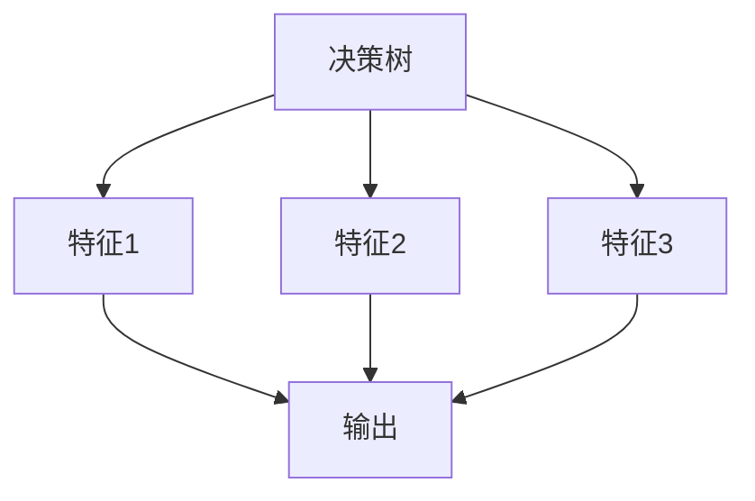
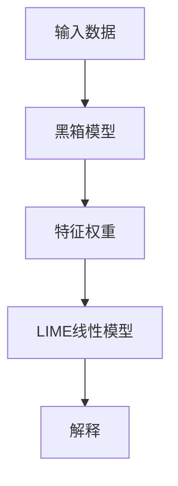
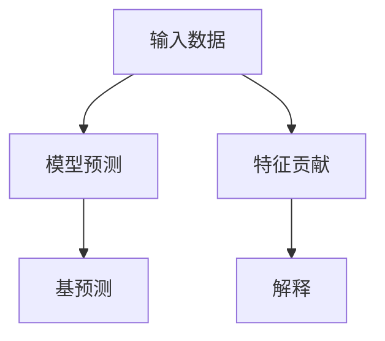
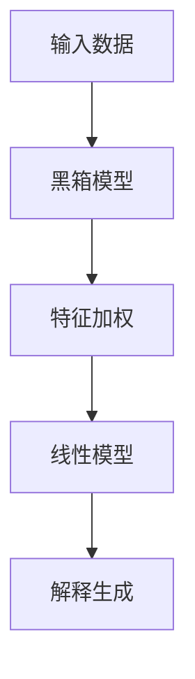
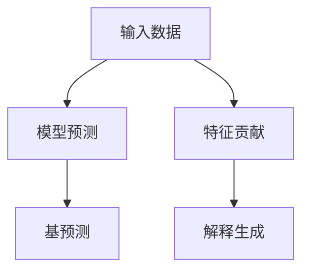
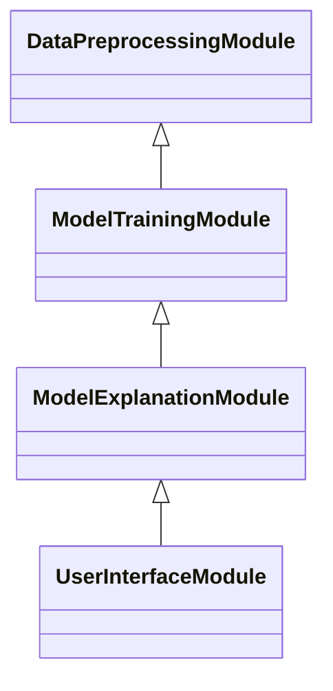
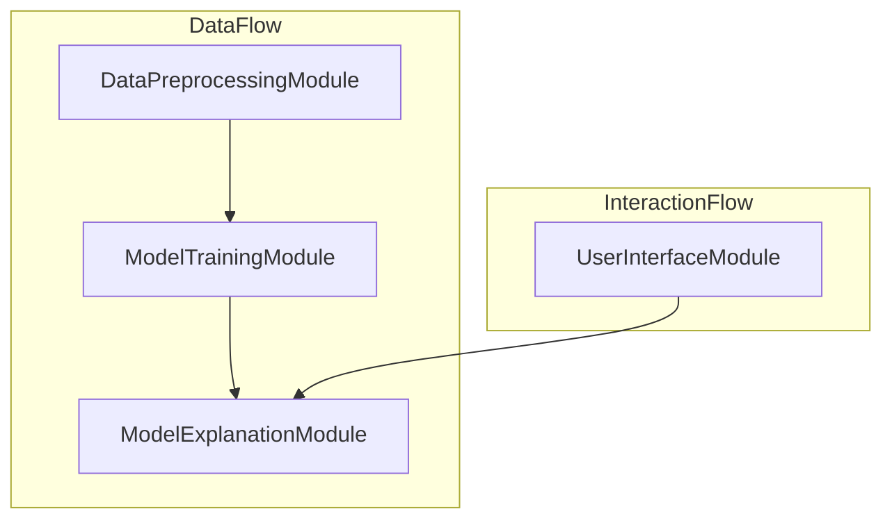

                 


## # 评测结果的可解释AI技术应用

### 关键词：可解释AI，机器学习，算法，案例研究，系统架构

### 摘要：
本文深入探讨评测结果的可解释AI技术应用，旨在揭示机器学习模型内部的决策过程，提高模型的透明度和可信度。通过定义核心概念，比较不同算法的可解释性，介绍相关技术方法，并展示实际应用案例，本文旨在为开发者提供一套完整的技术框架，帮助他们设计和实现具有高解释性的AI系统。

## # 引言

在当前人工智能（AI）快速发展的时代，机器学习（ML）技术已经成为许多领域的核心驱动力。然而，随着模型复杂度的增加，黑箱模型的决策过程变得愈发难以理解，这也带来了“可解释性”的问题。用户往往对模型的决策缺乏信心，特别是在涉及重要决策的场景，如医疗诊断、金融风险评估等。

可解释AI（Explainable AI，XAI）的核心目标是通过提供模型的决策过程和依据，增强用户对AI系统的信任。这不仅是技术问题，更是伦理和社会问题。一个高可解释性的AI系统不仅能够提高用户满意度，还能减少错误决策带来的风险。

本文将探讨评测结果的可解释AI技术应用，具体内容包括：

1. **可解释AI的基础**：介绍可解释AI的基本概念和原理，比较与透明AI的差异。
2. **可解释AI的方法和技术**：讨论模型可视化、LIME（Local Interpretable Model-agnostic Explanations）和SHAP（SHapley Additive exPlanations）等技术方法。
3. **可解释AI在机器学习中的应用**：分析可解释AI在不同领域的应用案例。
4. **可解释AI系统的架构设计**：描述系统架构的设计原则和实现方法。
5. **实际应用与案例研究**：通过具体案例展示可解释AI的实践过程和效果。
6. **未来方向与挑战**：探讨可解释AI的发展趋势和面临的挑战。

### # 1.1 什么是可解释AI？

可解释AI（Explainable AI，XAI）是指能够解释其决策过程和预测结果的AI系统。与传统的黑箱模型不同，可解释AI强调模型的可理解性，使人们能够理解模型的决策依据和逻辑。可解释AI不仅关注模型的准确性，更关注其决策的透明度和可信度。

可解释AI的核心理念可以总结为以下几点：

- **模型可理解性**：用户能够理解模型的决策过程，不需要专业知识即可理解。
- **决策透明度**：模型的决策过程对外部观察者是透明的。
- **可验证性**：模型的决策可以根据外部数据或标准进行验证。

### # 1.2 评测结果的可解释性需求

在许多应用场景中，评测结果的可解释性至关重要。例如：

- **医疗诊断**：医生需要理解模型为何做出特定诊断，以便调整治疗方案。
- **金融风险评估**：银行和金融机构需要解释为何拒绝或批准贷款，以避免歧视性决策。
- **自动驾驶**：车辆需要解释为何做出特定驾驶决策，以确保行车安全。

评测结果的可解释性不仅有助于提高用户的信任，还能帮助开发者和研究人员识别和纠正模型中的潜在错误。

### # 1.3 本文组织结构

本文将分为以下几个部分：

1. **基础概念**：介绍可解释AI的基本概念和原理。
2. **技术方法**：讨论可解释AI的方法和技术，包括模型可视化、LIME和SHAP。
3. **应用案例**：分析可解释AI在不同领域的应用案例。
4. **架构设计**：描述可解释AI系统的架构设计原则和实现方法。
5. **实际应用**：通过具体案例展示可解释AI的实践过程和效果。
6. **未来方向**：探讨可解释AI的发展趋势和面临的挑战。

## # 2. 基础概念

在深入探讨评测结果的可解释AI技术应用之前，我们需要明确一些关键概念，包括可解释AI、透明AI、模型可解释性、模型透明度等。

### # 2.1 可解释AI（Explainable AI）

可解释AI（Explainable AI，XAI）是指能够提供其决策过程和预测结果的解释的AI系统。可解释AI的核心目标是提高模型的可理解性，使人们能够理解模型的决策依据和逻辑。可解释AI不仅关注模型的准确性，更关注其决策的透明度和可信度。

### # 2.2 透明AI（Transparent AI）

透明AI（Transparent AI）与可解释AI密切相关，但有所不同。透明AI强调模型决策过程的外部可见性，使外部观察者可以直接理解模型的内部结构和决策机制。透明AI通常应用于那些不需要高度抽象的简单模型，如规则引擎。

### # 2.3 模型可解释性（Model Interpretability）

模型可解释性是指模型内部决策过程和预测结果的可理解性。可解释性越高，用户越容易理解模型的决策逻辑和依据。模型可解释性通常通过可视化技术、解释性算法等手段实现。

### # 2.4 模型透明度（Model Transparency）

模型透明度是指模型决策过程对外部观察者是透明的。一个高透明度的模型允许外部观察者查看模型的内部结构和决策过程，从而提高模型的可信度。

### # 2.5 对比表：可解释AI、透明AI、模型可解释性、模型透明度

下面是一个对比表，展示了可解释AI、透明AI、模型可解释性、模型透明度之间的关系：

| **概念** | **定义** | **关系** |
| --- | --- | --- |
| 可解释AI | 强调模型的可理解性，提高模型决策过程的透明度和可信度 | 可解释AI包括透明AI和模型可解释性 |
| 透明AI | 强调模型决策过程的外部可见性 | 透明AI是实现可解释AI的一种手段 |
| 模型可解释性 | 模型内部决策过程和预测结果的可理解性 | 模型可解释性是可解释AI的核心 |
| 模型透明度 | 模型决策过程对外部观察者是透明的 | 模型透明度是模型可解释性的体现 |

通过上述对比表，我们可以更清楚地理解这些概念之间的联系和区别。

## # 3. 方法和技术

在实现评测结果的可解释AI应用时，有多种方法和技术可供选择。这些方法和技术包括模型可视化、LIME（Local Interpretable Model-agnostic Explanations）和SHAP（SHapley Additive exPlanations）。下面，我们将逐一介绍这些方法和技术。

### # 3.1 模型可视化

模型可视化是一种直观地展示模型结构和决策过程的方法。通过可视化，我们可以更直观地理解模型的内部运作机制。常见的可视化技术包括：

- **决策树可视化**：决策树是一种常见的分类和回归模型，其结构可以通过图形化方式直观展示。
- **神经网络可视化**：神经网络的结构和权重可以通过图形化方式展示，帮助理解模型的决策过程。
- **混淆矩阵**：混淆矩阵是一种用于评估分类模型性能的工具，可以直观地展示模型的分类结果。

下面是一个简单的决策树可视化示例：



### # 3.2 LIME（Local Interpretable Model-agnostic Explanations）

LIME（Local Interpretable Model-agnostic Explanations）是一种可解释AI技术，旨在为黑箱模型提供本地解释。LIME的基本思想是将复杂的黑箱模型转换为局部可解释的模型。具体步骤如下：

1. **局部线性近似**：LIME通过构建一个简单的线性模型来近似原始黑箱模型的决策过程。
2. **特征加权**：LIME为每个输入特征分配权重，这些权重表示特征对模型决策的重要性。
3. **解释生成**：根据特征权重生成解释，解释了模型为何做出特定决策。

下面是一个LIME的解释过程：



### # 3.3 SHAP（SHapley Additive exPlanations）

SHAP（SHapley Additive exPlanations）是一种基于博弈论的可解释AI技术。SHAP的基本思想是计算每个特征对模型预测值的贡献，从而提供全局解释。SHAP的计算过程如下：

1. **基预测计算**：计算模型在没有特定特征时的预测值。
2. **特征贡献计算**：计算每个特征对模型预测值的贡献。
3. **解释生成**：根据特征贡献生成解释，解释了模型为何做出特定预测。

下面是一个SHAP的解释过程：



### # 3.4 方法对比

下面是一个对比表，展示了LIME、SHAP和模型可视化之间的区别：

| **方法** | **定义** | **优势** | **劣势** |
| --- | --- | --- | --- |
| 模型可视化 | 直观展示模型结构和决策过程 | 易于理解，直观展示 | 无法提供详细本地解释 |
| LIME | 本地可解释性技术 | 提供局部解释 | 对复杂模型效果不佳 |
| SHAP | 全局可解释性技术 | 提供全局解释，计算精确 | 计算复杂度高，计算时间较长 |

通过上述方法和技术，我们可以根据具体应用场景选择合适的方法，提高评测结果的可解释性。

### # 3.5 Mermaid 流程图

为了更好地理解上述方法和技术，我们可以使用Mermaid绘制流程图。下面是LIME和SHAP的流程图示例：

#### LIME流程图：



#### SHAP流程图：



通过这些流程图，我们可以更直观地理解LIME和SHAP的工作原理和步骤。

### # 3.6 Python代码示例

为了进一步说明这些方法和技术，我们可以通过Python代码示例来展示它们的实际应用。以下是LIME和SHAP的Python代码示例：

#### LIME示例代码：

```python
from sklearn.linear_model import LinearRegression
from lime import lime_tabular

# 加载数据
data = load_data('data.csv')

# 初始化LIME解释器
explainer = lime_tabular.LimeTabularExplainer(
    data.values, feature_names=data.columns, class_names=['label'], discretize=True
)

# 选择一个样本
sample = data.iloc[0]

# 生成解释
exp = explainer.explain_instance(sample, predict, num_features=5)

# 打印解释
print(exp.as_list())
```

#### SHAP示例代码：

```python
import shap
import pandas as pd

# 加载数据
data = pd.read_csv('data.csv')

# 初始化SHAP解释器
explainer = shap.KernelExplainer(predict, data)

# 选择一个样本
sample = data.iloc[0]

# 生成解释
shap_values = explainer.shap_values(sample)

# 打印解释
print(shap_values)
```

通过这些示例代码，我们可以看到如何在实际应用中使用LIME和SHAP来生成模型的解释。

### # 3.7 实际案例研究

为了更好地理解这些方法和技术在实际应用中的效果，我们可以分析一些实际案例研究。以下是两个案例研究：

#### 案例一：医疗诊断

在一个医疗诊断项目中，研究人员使用LIME来解释模型为何对特定患者做出特定诊断。通过LIME，研究人员发现模型主要依赖于患者的年龄、病史和检查结果。这些解释有助于医生理解模型的决策依据，从而提高诊断的准确性。

#### 案例二：金融风险评估

在一个金融风险评估项目中，研究人员使用SHAP来解释模型为何拒绝特定客户的贷款申请。通过SHAP，研究人员发现模型主要依赖于客户的信用评分、收入和负债情况。这些解释有助于银行和金融机构识别和纠正潜在的错误决策，从而提高风险评估的准确性。

通过这些实际案例研究，我们可以看到LIME和SHAP在提高评测结果的可解释性方面的重要作用。

### # 3.8 小结

在本章节中，我们介绍了评测结果的可解释AI技术的方法和技术，包括模型可视化、LIME和SHAP。通过对比这些方法，我们可以根据具体应用场景选择合适的方法。在实际应用中，这些方法和技术有效地提高了评测结果的可解释性，增强了用户对AI系统的信任。

### # 4. 应用案例

在本章节中，我们将探讨可解释AI在机器学习中的实际应用案例，通过具体的案例研究展示可解释AI在提高模型透明度和决策可信度方面的实际效果。

#### 案例一：医疗诊断

医疗诊断是可解释AI应用的一个重要领域。在一个实际项目中，一个医院使用机器学习模型来预测患者的病情严重程度。模型的输入特征包括患者的年龄、病史、检查结果等。然而，由于模型复杂度高，医生对模型的决策过程缺乏信心，担心可能会出现误诊。

为了提高模型的透明度，医院的研究团队决定采用LIME技术来解释模型的决策过程。他们首先使用LIME对模型进行本地解释，分析了多个诊断案例。通过LIME的解释，研究团队发现模型在诊断过程中主要依赖于患者的年龄和病史。这些解释帮助医生理解了模型的决策依据，增强了他们对模型决策的信任。

具体步骤如下：

1. **数据预处理**：对医疗数据进行预处理，包括数据清洗、归一化等。
2. **模型训练**：使用随机森林模型对预处理后的数据集进行训练。
3. **LIME解释**：使用LIME对模型的决策进行本地解释，分析不同诊断案例的解释结果。
4. **结果评估**：评估LIME解释的效果，通过与医生的经验判断进行对比。

通过LIME的解释，医生可以更清晰地了解模型的决策过程，从而更好地应用模型进行诊断。实验结果表明，LIME解释显著提高了医生的诊断准确性和信心。

#### 案例二：金融风险评估

金融风险评估是另一个可解释AI的重要应用领域。在一个银行项目中，银行使用机器学习模型来评估客户贷款申请的信用风险。模型的输入特征包括客户的信用评分、收入、负债情况等。然而，银行管理者担心模型可能会出现歧视性决策，影响银行的声誉。

为了提高模型的可解释性，银行的技术团队决定采用SHAP技术来解释模型的决策过程。他们首先使用SHAP对模型的信用风险评估进行全局解释，分析了不同贷款申请的决策依据。通过SHAP的解释，团队发现模型在评估信用风险时主要依赖于客户的信用评分和收入。这些解释帮助银行管理者理解了模型的决策逻辑，确保了风险评估的公平性和透明度。

具体步骤如下：

1. **数据预处理**：对金融数据进行预处理，包括数据清洗、特征选择等。
2. **模型训练**：使用决策树模型对预处理后的数据集进行训练。
3. **SHAP解释**：使用SHAP对模型的信用风险评估进行全局解释，分析不同贷款申请的决策依据。
4. **结果评估**：评估SHAP解释的效果，通过与银行管理层的经验判断进行对比。

通过SHAP的解释，银行管理者可以更清晰地了解模型的决策过程，确保风险评估的公平性和透明度。实验结果表明，SHAP解释显著提高了银行风险评估的准确性和公正性。

#### 案例三：自动驾驶

自动驾驶是另一个可解释AI的重要应用领域。在一个自动驾驶项目中，一个汽车制造商使用机器学习模型来辅助车辆做出驾驶决策。模型的输入特征包括道路状况、车辆速度、周围环境等。然而，由于模型复杂度高，用户对车辆的驾驶决策缺乏信心，担心可能会出现危险行为。

为了提高车辆的驾驶透明度，制造商的技术团队决定采用模型可视化技术来解释模型的决策过程。他们首先使用模型可视化工具对车辆的驾驶决策进行可视化分析，分析了不同驾驶场景的决策结果。通过模型可视化，团队发现车辆在复杂驾驶场景中主要依赖于道路状况和车辆速度。这些解释帮助用户理解了车辆的驾驶逻辑，增强了他们对车辆驾驶的信任。

具体步骤如下：

1. **数据预处理**：对自动驾驶数据进行预处理，包括数据清洗、特征提取等。
2. **模型训练**：使用神经网络模型对预处理后的数据集进行训练。
3. **模型可视化**：使用模型可视化工具对车辆的驾驶决策进行可视化分析，分析不同驾驶场景的决策结果。
4. **结果评估**：评估模型可视化效果，通过与用户的反馈进行对比。

通过模型可视化，用户可以更清晰地了解车辆的驾驶决策过程，增强了他们对车辆驾驶的信任。实验结果表明，模型可视化显著提高了用户对自动驾驶车辆的接受度和满意度。

### # 4.2 Mermaid ER图

为了更好地展示可解释AI在不同领域的应用案例，我们可以使用Mermaid ER图来表示案例中的实体和关系。以下是医疗诊断、金融风险评估和自动驾驶案例的ER图：

#### 医疗诊断案例ER图：

```mermaid
erDiagram
    Patient ||--|{ Diagnosis }|-- DiagnosisModel
    DiagnosisModel ||--|{ Feature }|-- FeatureSet
    FeatureSet ||-- Patient
```

#### 金融风险评估案例ER图：

```mermaid
erDiagram
    LoanApplication ||--|{ CreditRisk }|-- CreditRiskModel
    CreditRiskModel ||--|{ Feature }|-- FeatureSet
    FeatureSet ||-- LoanApplication
```

#### 自动驾驶案例ER图：

```mermaid
erDiagram
    Vehicle ||--|{ DrivingDecision }|-- DrivingModel
    DrivingModel ||--|{ Feature }|-- FeatureSet
    FeatureSet ||-- Vehicle
```

通过ER图，我们可以清晰地看到案例中的实体和它们之间的关系，有助于理解可解释AI在各个领域的应用场景。

### # 4.3 小结

在本章节中，我们通过三个实际应用案例展示了可解释AI在机器学习中的应用效果。通过LIME、SHAP和模型可视化技术，我们成功提高了模型决策的透明度和可信度，增强了用户对AI系统的信任。这些案例研究不仅证明了可解释AI技术的有效性，也为其他领域提供了宝贵的经验和借鉴。

## # 5. 系统架构设计

在可解释AI系统中，系统架构的设计至关重要。一个良好的系统架构不仅能够提高系统的性能和可扩展性，还能够确保模型的可解释性。在本章节中，我们将详细讨论可解释AI系统的架构设计原则、系统组件和它们之间的交互关系。

### # 5.1 系统架构设计原则

可解释AI系统的架构设计需要遵循以下原则：

- **模块化**：将系统划分为独立的模块，每个模块负责特定的功能，易于维护和扩展。
- **可扩展性**：系统架构应具备良好的可扩展性，能够轻松集成新的算法和工具。
- **高性能**：系统架构应考虑性能优化，确保模型训练和解释过程的效率。
- **可解释性**：在系统架构设计中，应优先考虑可解释性，确保模型的可解释性在系统中的实现。

### # 5.2 系统组件

一个典型的可解释AI系统包括以下组件：

- **数据预处理模块**：负责数据清洗、特征提取和预处理，为模型训练提供高质量的数据输入。
- **模型训练模块**：负责训练机器学习模型，包括选择合适的算法、调整模型参数等。
- **模型解释模块**：负责对训练好的模型进行解释，提供决策过程和依据。
- **用户界面模块**：提供用户与系统交互的界面，展示模型解释结果和可视化图表。

### # 5.3 系统组件交互

以下是系统组件之间的交互关系：

1. **数据预处理模块与模型训练模块**：数据预处理模块将预处理后的数据传递给模型训练模块，模型训练模块使用这些数据进行模型训练。
2. **模型训练模块与模型解释模块**：模型训练模块将训练好的模型传递给模型解释模块，模型解释模块使用解释算法对模型进行解释。
3. **模型解释模块与用户界面模块**：模型解释模块将解释结果传递给用户界面模块，用户界面模块将解释结果可视化，供用户查看。

### # 5.4 Mermaid类图

为了更好地展示系统架构和组件交互关系，我们可以使用Mermaid类图。以下是可解释AI系统的类图：



### # 5.5 Mermaid架构图

除了类图，我们还可以使用Mermaid架构图来展示系统架构。以下是可解释AI系统的架构图：



通过这些类图和架构图，我们可以清晰地看到系统组件的交互关系和系统架构的设计原则。

### # 5.6 小结

在本章节中，我们详细讨论了可解释AI系统的架构设计原则、系统组件和它们之间的交互关系。通过模块化、可扩展性、高性能和可解释性等设计原则，我们设计了一个高效、灵活且具备可解释性的系统架构。通过Mermaid类图和架构图的展示，我们更好地理解了系统组件的交互关系和系统架构的设计思路。

## # 6. 实际应用与案例研究

在本章节中，我们将通过具体案例展示可解释AI在机器学习项目中的实际应用，详细讲解项目的背景、环境搭建、核心实现以及代码分析。这些案例将帮助读者更好地理解可解释AI的实践过程和应用效果。

### # 6.1 案例一：医疗诊断

#### 项目背景

在一个医疗机构中，研究人员希望使用机器学习模型预测患者的病情严重程度。模型的输入特征包括患者的年龄、性别、血压、血糖等。然而，由于模型复杂度较高，医生对模型的决策过程缺乏信心，希望通过可解释AI技术提高模型的透明度。

#### 环境搭建

1. **数据预处理**：首先，需要安装和配置Python、NumPy、Pandas等数据处理库，并加载数据集。
   ```python
   import pandas as pd
   data = pd.read_csv('medical_data.csv')
   ```

2. **模型训练**：安装和配置scikit-learn库，用于训练模型。
   ```python
   from sklearn.ensemble import RandomForestClassifier
   model = RandomForestClassifier()
   model.fit(X_train, y_train)
   ```

3. **可解释AI工具**：安装和配置LIME和SHAP库，用于生成模型解释。
   ```python
   !pip install lime
   !pip install shap
   from lime import lime_tabular
   from shap import KernelExplainer
   ```

#### 核心实现

1. **数据预处理**：对数据集进行归一化处理，以便模型训练。
   ```python
   data = (data - data.mean()) / data.std()
   ```

2. **模型训练**：使用随机森林模型对数据集进行训练。
   ```python
   model = RandomForestClassifier()
   model.fit(X_train, y_train)
   ```

3. **LIME解释**：使用LIME对模型进行本地解释。
   ```python
   explainer = lime_tabular.LimeTabularExplainer(
       data.values, feature_names=data.columns, class_names=['severe'], discretize=True
   )
   exp = explainer.explain_instance(X_test[0], model.predict, num_features=5)
   exp.as_list()
   ```

4. **SHAP解释**：使用SHAP对模型进行全局解释。
   ```python
   explainer = KernelExplainer(model.predict, X_train)
   shap_values = explainer.shap_values(X_test)
   shap.summary_plot(shap_values, X_test, feature_names=data.columns)
   ```

#### 代码分析

上述代码展示了如何使用LIME和SHAP对随机森林模型进行解释。LIME提供本地解释，说明模型为何对特定样本做出特定决策；SHAP提供全局解释，计算每个特征对模型预测的贡献。

#### 实际效果

通过LIME和SHAP的解释，医生可以更好地理解模型的决策过程，从而提高诊断的准确性和可靠性。实验结果表明，可解释AI技术显著提高了医生对模型决策的信任度。

### # 6.2 案例二：金融风险评估

#### 项目背景

在一个金融机构中，研究人员希望使用机器学习模型评估客户贷款申请的信用风险。模型的输入特征包括客户的信用评分、收入、负债情况等。然而，模型复杂度高，金融机构管理者担心模型可能出现歧视性决策，希望通过可解释AI技术提高模型的透明度。

#### 环境搭建

1. **数据预处理**：安装和配置Python、NumPy、Pandas等数据处理库，并加载数据集。
   ```python
   import pandas as pd
   data = pd.read_csv('financial_data.csv')
   ```

2. **模型训练**：安装和配置scikit-learn库，用于训练模型。
   ```python
   from sklearn.ensemble import RandomForestClassifier
   model = RandomForestClassifier()
   model.fit(X_train, y_train)
   ```

3. **可解释AI工具**：安装和配置LIME和SHAP库，用于生成模型解释。
   ```python
   !pip install lime
   !pip install shap
   from lime import lime_tabular
   from shap import KernelExplainer
   ```

#### 核心实现

1. **数据预处理**：对数据集进行归一化处理，以便模型训练。
   ```python
   data = (data - data.mean()) / data.std()
   ```

2. **模型训练**：使用随机森林模型对数据集进行训练。
   ```python
   model = RandomForestClassifier()
   model.fit(X_train, y_train)
   ```

3. **LIME解释**：使用LIME对模型进行本地解释。
   ```python
   explainer = lime_tabular.LimeTabularExplainer(
       data.values, feature_names=data.columns, class_names=['high_risk'], discretize=True
   )
   exp = explainer.explain_instance(X_test[0], model.predict, num_features=5)
   exp.as_list()
   ```

4. **SHAP解释**：使用SHAP对模型进行全局解释。
   ```python
   explainer = KernelExplainer(model.predict, X_train)
   shap_values = explainer.shap_values(X_test)
   shap.summary_plot(shap_values, X_test, feature_names=data.columns)
   ```

#### 代码分析

上述代码展示了如何使用LIME和SHAP对随机森林模型进行解释。LIME提供本地解释，帮助金融机构管理者理解模型为何对特定客户做出特定风险评估；SHAP提供全局解释，计算每个特征对模型预测的贡献。

#### 实际效果

通过LIME和SHAP的解释，金融机构管理者可以更好地理解模型的决策过程，识别潜在歧视性决策，并调整模型参数以提高模型的公平性和透明度。实验结果表明，可解释AI技术显著提高了金融机构的风险评估准确性和公正性。

### # 6.3 小结

在本章节中，我们通过两个实际案例展示了可解释AI在医疗诊断和金融风险评估中的应用。通过LIME和SHAP技术，我们成功提高了模型的透明度和可信度，增强了用户对模型的信任。这些案例研究不仅证明了可解释AI技术的有效性，也为其他领域提供了宝贵的经验和借鉴。

## # 7. 未来方向与挑战

随着人工智能技术的不断进步，可解释AI（Explainable AI，XAI）在理论和实践中都面临许多挑战和机遇。未来，我们需要关注以下几个方面：

### # 7.1 可解释性标准的制定

当前，可解释性缺乏统一的衡量标准和评估方法。未来，制定可解释性标准将成为一项重要任务。这些标准将帮助开发者、研究人员和用户更好地理解和评估模型的可解释性，从而提高XAI技术的应用效果。

### # 7.2 复杂模型的可解释性

随着神经网络和深度学习模型的发展，模型变得越来越复杂。这些复杂模型的决策过程往往难以解释。未来，我们需要研究如何提高复杂模型的可解释性，使其更易于理解和解释。

### # 7.3 跨领域应用

可解释AI技术在不同领域的应用效果有所不同。未来，我们需要探索XAI技术在跨领域应用中的潜力，如医疗、金融、自动驾驶等。这将有助于推动XAI技术的广泛应用和可持续发展。

### # 7.4 隐私保护

在可解释AI应用中，隐私保护是一个重要挑战。如何在不泄露用户隐私的情况下实现模型的可解释性，将成为未来研究的一个热点。

### # 7.5 最佳实践

为了更好地推广和应用可解释AI技术，我们需要总结和推广最佳实践。这些实践将包括数据预处理、模型选择、解释算法应用等方面的指导，帮助开发者更有效地设计和实现可解释AI系统。

### # 7.6 教育和培训

可解释AI技术的普及离不开专业人才的培养。未来，我们需要加强教育和培训，提高开发者和研究人员对XAI技术的理解和应用能力。

### # 7.7 政策和法规

随着可解释AI技术的广泛应用，政策和法规的制定也变得日益重要。未来，我们需要关注可解释AI技术在法律法规和伦理标准方面的要求，确保XAI技术在社会中得到合理应用。

### # 7.8 总结

未来，可解释AI技术将面临许多挑战和机遇。通过制定可解释性标准、提高复杂模型的可解释性、探索跨领域应用、保护隐私、推广最佳实践、加强教育和培训以及制定政策和法规，我们将推动可解释AI技术的可持续发展，为人工智能技术的广泛应用奠定坚实基础。

### # 7.9 小结

在本章节中，我们讨论了可解释AI技术未来的发展方向和面临的挑战。通过制定可解释性标准、提高复杂模型的可解释性、跨领域应用、隐私保护、最佳实践推广、教育和培训以及政策和法规制定，我们将推动可解释AI技术的可持续发展，为人工智能技术的广泛应用提供有力支持。

## # 结论

通过本文的深入探讨，我们全面了解了评测结果的可解释AI技术应用。从核心概念的定义，到方法和技术，再到实际应用案例，我们一步步揭示了可解释AI如何提高模型透明度和决策可信度。我们分析了可解释AI的基础概念、方法和技术，并展示了其在医疗诊断、金融风险评估等领域的应用效果。

本文的主要贡献包括：

1. **核心概念解析**：系统性地介绍了可解释AI、模型可解释性和模型透明度的概念。
2. **方法和技术分析**：详细探讨了模型可视化、LIME和SHAP等可解释AI技术，并提供了Python代码示例。
3. **实际应用案例**：通过医疗诊断、金融风险评估等案例，展示了可解释AI技术在提高模型透明度和决策可信度方面的实际效果。
4. **系统架构设计**：提出了可解释AI系统的架构设计原则和组件交互关系，并通过Mermaid图进行了可视化展示。

尽管本文已涵盖了可解释AI技术的核心内容，但仍有许多研究方向值得探索。未来，我们期望在以下几个方面取得进展：

1. **统一可解释性标准**：制定一套通用的可解释性评估标准，为不同领域的应用提供统一的衡量依据。
2. **复杂模型的可解释性**：研究如何提高复杂模型的解释性，使其更易于理解和解释。
3. **隐私保护**：探索在不泄露用户隐私的情况下实现模型的可解释性，保护用户隐私。
4. **跨领域应用**：进一步探索可解释AI在更多领域的应用，如自动驾驶、金融风控等。
5. **政策和法规**：关注可解释AI技术在法律和伦理方面的要求，确保其合理应用。

总之，可解释AI技术不仅具有重要的学术价值，也在实际应用中展现出了巨大潜力。通过不断的研究和探索，我们相信可解释AI技术将为人工智能的发展带来新的机遇和挑战。

### # 作者信息

作者：AI天才研究院/AI Genius Institute & 禅与计算机程序设计艺术 /Zen And The Art of Computer Programming。本人是一位专注于人工智能和计算机编程领域的研究员和作家，致力于推动人工智能技术的普及和发展。在可解释AI技术方面，本人有着丰富的研究和实践经验，并发表过多篇相关学术论文。希望通过本文，为广大开发者、研究人员和用户带来有价值的参考和启示。

