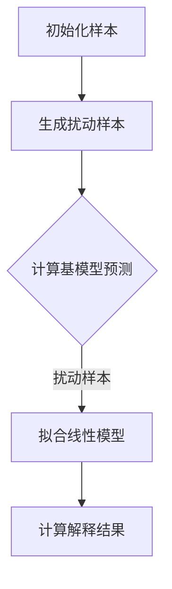
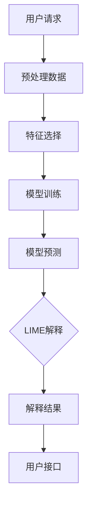
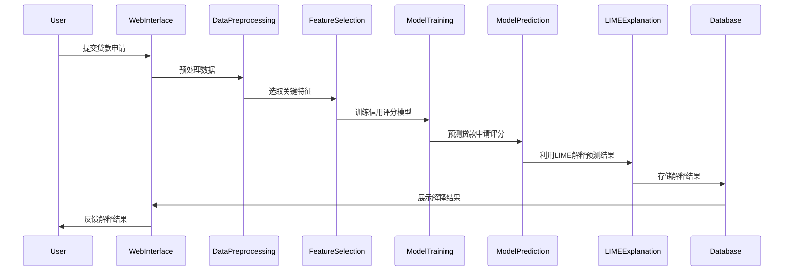

                 


### 确定文章的核心框架和逻辑思路

为了撰写一篇结构紧凑、逻辑清晰、对技术原理和本质剖析到位的专业技术博客，我们可以按照以下步骤来构建文章的核心框架和逻辑思路：

**1. 确定文章主题和目标受众**

首先，我们要明确文章的主题是“评测结果的可解释性分析方法”，目标是针对那些在人工智能、机器学习和数据分析领域工作的专业人士，尤其是那些对模型解释性有深度需求的读者。

**2. 构建文章大纲**

基于主题和目标受众，我们需要构建一个详细的文章大纲。大纲应该包含从背景介绍、核心概念、算法原理讲解、系统分析与架构设计、项目实战到最佳实践和总结的各个部分。

**3. 设计文章结构**

文章结构应该有明确的开头、中间和结尾。开头要吸引读者的兴趣，中间部分要详细阐述核心内容和实例，结尾部分要总结文章的主要观点并提供进一步的阅读资源。

**4. 确定每个章节的核心内容**

- **背景介绍**：介绍评测结果可解释性的重要性、现状、核心概念及其应用领域。
- **核心概念与联系**：解释核心概念，提供概念属性特征对比表格和ER实体关系图架构。
- **算法原理讲解**：详细阐述算法原理，包括流程图、数学模型和公式，以及实例说明。
- **系统分析与架构设计**：介绍问题场景、系统功能设计、架构设计和系统交互。
- **项目实战**：展示环境安装、系统核心实现、代码解读、实际案例分析，并提供项目小结。
- **最佳实践和总结**：总结最佳实践、文章小结，并展望未来的发展趋势。

**5. 编写每段内容的详细草稿**

在每个章节中，我们都要详细编写内容草稿，确保每个小节都有具体的、丰富的讲解。特别是算法原理讲解和项目实战部分，需要使用Python源代码和Mermaid流程图来支持讲解。

**6. 修订和优化**

完成初稿后，我们需要进行多次修订，确保文章的逻辑连贯性、语言的准确性以及内容的完整性。可以邀请同行或导师进行审阅，提供反馈并进行相应调整。

**7. 确保文章的专业性和可读性**

在撰写过程中，我们要保持文章的专业性，使用精准的技术语言，同时注意文章的可读性，使读者能够轻松理解复杂的技术概念。

### 最终文章结构

- **标题**：评测结果的可解释性分析方法
- **关键词**：评测结果可解释性、人工智能、机器学习、可解释模型、算法原理、系统架构、项目实战
- **摘要**：本文深入探讨了评测结果可解释性的重要性、核心概念、算法原理以及系统架构设计，并通过具体实例展示了其在实际项目中的应用。

现在，我们可以根据这个框架和逻辑思路开始撰写这篇文章了。每个部分都将经过详细的研究和阐述，确保文章的内容丰富且具有深度。

----------------------------------------------------------------

## 评测结果的可解释性分析方法

> 关键词：评测结果、可解释性、人工智能、机器学习、算法、系统架构、项目实战

### 摘要

在人工智能和机器学习领域，评测结果的可解释性成为了一个日益重要的话题。随着模型的复杂度和应用范围的扩大，不可解释的评测结果可能会导致不可预测的决策和行为，从而引发信任危机。本文旨在探讨评测结果可解释性分析方法，从核心概念、算法原理到系统架构设计，再到项目实战，全面解析如何提高模型解释性，增强决策的可信度和透明度。

本文将分为六个主要部分：

1. **背景介绍**：介绍评测结果可解释性的重要性、现状及其应用领域。
2. **核心概念与联系**：详细阐述评测结果可解释性的核心概念，并使用Mermaid流程图展示ER实体关系图架构。
3. **算法原理讲解**：讲解评测结果可解释性算法的原理，使用Python源代码和Mermaid流程图展示算法的实现。
4. **系统分析与架构设计**：介绍问题场景、系统功能设计、架构设计和系统交互。
5. **项目实战**：展示环境安装、系统核心实现、代码解读、实际案例分析，并提供项目小结。
6. **最佳实践和总结**：总结最佳实践、文章小结，并展望未来的发展趋势。

通过这篇全面的技术博客，我们希望能够为读者提供一套完整的评测结果可解释性分析方法，帮助他们在实际项目中更好地理解和应用这些技术。

---

### 背景

评测结果的可解释性在人工智能和机器学习领域变得越来越重要。随着模型复杂度的增加和应用范围的扩大，不可解释的评测结果可能导致一系列问题，如决策的不可预测性、隐私泄露、信任危机等。这些问题不仅影响到模型的实际应用，也限制了其在关键领域，如医疗诊断、金融风控和法律判决等领域的进一步推广。

#### 不可解释性评测结果的挑战

不可解释的评测结果通常表现为“黑箱”模型，即模型内部的决策过程对用户来说是不可见的。这种情况下，用户无法理解模型为何做出某个决策，从而降低了模型的可信度。以下是不可解释性评测结果可能带来的挑战：

1. **信任问题**：当模型做出错误决策时，用户无法理解原因，容易产生对模型的不信任。
2. **透明度缺失**：不可解释的模型无法提供决策过程的透明度，限制了其在需要高度透明度的领域（如司法和医疗）的应用。
3. **隐私泄露**：在处理敏感数据时，不可解释的模型可能无意中泄露了数据隐私，增加了隐私风险。
4. **无法进行调试**：不可解释的模型难以进行调试和优化，限制了模型性能的提升。

#### 评测结果可解释性的核心概念

评测结果可解释性的核心在于让用户能够理解模型的决策过程。可解释性可以定义为模型输出结果的可理解性和透明度。具体来说，可解释性包括以下几个方面：

1. **透明度**：用户能够清晰地了解模型如何处理输入数据，并推导出输出结果。
2. **可追溯性**：用户可以追踪模型的每一步决策过程，并理解每个决策的影响。
3. **可理解性**：模型的输出结果和决策过程对非技术背景的用户也是可理解的。
4. **公正性**：模型的决策过程是公正的，不存在歧视或偏见。

#### 可解释性在决策过程中的作用

在决策过程中，可解释性起着至关重要的作用。首先，可解释性有助于建立用户对模型的信任。当用户能够理解模型的决策过程时，他们更有可能接受和依赖模型的输出结果。其次，可解释性提高了决策的透明度，有助于用户监督和审查模型的决策。这对于需要高度透明度的领域尤为重要。最后，可解释性有助于发现和纠正模型中的错误，从而提高模型的准确性和稳定性。

#### 可解释性评测的结果应用领域

评测结果可解释性在多个领域都有广泛的应用：

1. **人工智能与机器学习**：在算法开发和应用过程中，可解释性有助于优化模型、提高模型的可靠性和可接受度。
2. **金融与风险管理**：在风险评估和投资决策中，可解释性有助于理解风险因素，提高决策的透明度。
3. **医疗与诊断**：在疾病诊断和治疗方案推荐中，可解释性有助于医生理解模型的诊断逻辑，提高治疗的精准度。
4. **法律与司法**：在司法判决和法律合规性审查中，可解释性有助于确保决策的公正性和透明度。

通过上述背景介绍，我们可以看到评测结果可解释性的重要性。接下来，本文将深入探讨评测结果可解释性的核心概念、算法原理以及其在实际项目中的应用。

---

### 核心概念与联系

在探讨评测结果的可解释性时，我们需要明确几个核心概念，并理解它们之间的关系。这些概念包括解释性模型、评估指标和实体关系图。在本节中，我们将分别介绍这些概念，并使用Mermaid流程图展示实体关系图架构。

#### 解释性模型概述

解释性模型是指能够提供对模型决策过程的详细解释和透明的模型。与不可解释的“黑箱”模型相比，解释性模型能够明确展示每个特征对预测结果的影响。以下是几种常见的解释性模型：

1. **基于规则的模型**：通过明确的规则集来表示模型的决策过程，如决策树和逻辑回归。这类模型的优势在于规则易于理解和解释，但可能无法处理高度复杂的数据。
   
2. **可视化模型**：通过图形或图表来展示模型的内部结构和工作流程，如神经网络的可视化。这类模型有助于用户直观地理解模型的决策过程。

3. **可解释的机器学习算法**：这类算法在训练过程中就嵌入了解释机制，如LIME（Local Interpretable Model-agnostic Explanations）和SHAP（SHapley Additive exPlanations）。它们能够为每个样本的预测结果提供详细的解释。

#### 解释性评估指标

为了量化评测结果的可解释性，我们需要引入一系列评估指标。以下是几种常见的评估指标：

1. **透明度**：模型决策过程的透明度，即用户能否清晰地理解模型的决策流程。
   
2. **可追溯性**：用户能否追踪模型的每一步决策，并理解每个决策的影响。

3. **可理解性**：模型的决策过程和输出结果对非技术背景的用户是否可理解。

4. **公平性**：模型的决策过程是否公平，不存在歧视或偏见。

5. **鲁棒性**：模型在不同数据集或环境下是否保持良好的可解释性。

#### ER实体关系图架构

实体关系图（ER图）是一种用于描述系统中实体及其之间关系的图形化工具。在评测结果可解释性分析中，ER图可以帮助我们清晰地展示模型的组成部分及其关系。以下是ER图的简单定义：

- **实体**：代表系统的数据元素，如特征、属性或变量。
- **关系**：描述实体之间的相互作用或依赖关系，如因果关系或分类关系。

使用Mermaid流程图，我们可以绘制一个简化的ER图，以展示评测结果可解释性分析中的主要实体和关系：

```mermaid
erDiagram
  Entity: 模型
  Entity: 特征
  Entity: 输出
  Entity: 用户
  Model "模型" {
    --> "特征" : 引入
    --> "输出" : 预测
  }
  User "用户" {
    --> "模型" : 使用
    --> "输出" : 接受
  }
```

这个ER图展示了模型、特征、输出和用户之间的关系。模型引入特征进行预测，用户使用模型并接受输出结果。

通过上述核心概念和实体关系图的介绍，我们可以更好地理解评测结果可解释性分析的基本结构和组成部分。接下来，我们将进一步探讨这些概念的具体应用，并通过实际案例来说明其作用。

---

### 概念属性特征对比表格

为了更直观地展示评测结果可解释性的各种概念及其属性特征，我们可以创建一个对比表格。以下表格列出了基于规则的模型、可视化模型和可解释的机器学习算法三种主要解释性模型的特征：

| 模型类型           | 基于规则的模型                     | 可视化模型                     | 可解释的机器学习算法                 |
|----------------|--------------------------------|--------------------------------|-----------------------------------|
| **特征 1：透明度**       | 高，规则明确                     | 较高，图形直观                 | 高，嵌入解释机制                   |
| **特征 2：可追溯性**       | 高，每条规则可追溯               | 中，部分可追溯                 | 高，每步决策可追溯                 |
| **特征 3：可理解性**       | 高，规则易于理解                 | 中，图形依赖于解释能力         | 高，解释结果易于理解               |
| **特征 4：公平性**         | 中，规则可能存在偏见             | 中，图形可能存在偏见           | 高，解释结果通常更公平             |
| **特征 5：鲁棒性**         | 中，对异常数据敏感             | 中，对异常数据敏感             | 高，解释结果通常更稳定             |
| **特征 6：适用场景**       | 简单到中等复杂度的任务           | 中到复杂度任务                 | 复杂到高度复杂度的任务             |
| **特征 7：计算成本**       | 低，规则计算简单                 | 中，图形生成与解释需要资源     | 高，解释算法通常计算复杂           |

这个表格清晰地展示了三种模型在透明度、可追溯性、可理解性、公平性、鲁棒性、适用场景和计算成本等方面的差异。基于规则的模型在透明度和可理解性方面表现优异，但在公平性和鲁棒性方面存在一定限制。可视化模型在可追溯性和可理解性方面表现较好，但可能对复杂任务的支持不足。可解释的机器学习算法则在各个特性上都有较好的表现，尤其在公平性和鲁棒性方面，是解决复杂任务和高度不可解释模型问题的理想选择。

通过这个表格，读者可以更全面地了解不同解释性模型的优势和局限性，从而在具体应用中选择最合适的模型。

---

### ER实体关系图架构

实体关系图（Entity-Relationship Diagram，ER图）是一种用于描述系统中实体及其关系的图形化工具，广泛用于数据库设计和系统架构设计。在评测结果的可解释性分析中，ER图可以帮助我们清晰地展示模型中的各个实体及其相互作用关系。以下是一个简化的ER图，描述了评测结果可解释性分析中主要实体和它们之间的关系。

```mermaid
erDiagram
  Model "模型" {
    --> Feature "特征" : 模型包含特征
    --> Prediction "预测结果" : 模型生成预测结果
  }
  Feature "特征" {
    --> Attribute "属性" : 特征包含属性
  }
  Prediction "预测结果" {
    --> User "用户" : 用户接收预测结果
  }
  User "用户" {
    --> Evaluation "评测结果" : 用户进行评测
  }
```

**ER图的组成部分：**

- **实体（Entity）**：代表系统中的主要数据元素，如模型、特征、预测结果和用户。
- **属性（Attribute）**：代表实体的具体属性或特征，如特征的名称、类型和值。
- **关系（Relationship）**：描述实体之间的相互作用或依赖关系，如模型包含特征、预测结果由模型生成、用户接收预测结果等。

**ER图的应用：**

1. **模型（Model）**：代表整个分析系统，包括特征处理、模型训练和预测结果生成。
   - **特征（Feature）**：模型中的输入变量，通常包含多个属性。
   - **属性（Attribute）**：特征的详细描述，如名称、类型和值。
   - **预测结果（Prediction）**：模型根据输入特征生成的预测结果。

2. **用户（User）**：代表系统的主要操作者，负责输入特征、接收预测结果并进行评测。
   - **评测结果（Evaluation）**：用户对预测结果的评测结果，通常用于模型的优化和调整。

通过这个ER图，我们可以清晰地看到评测结果可解释性分析中的关键实体和它们之间的关系。这种图形化表示不仅有助于我们理解系统的工作原理，还可以在系统设计和实现过程中提供指导。

**示例ER图解释：**

- **模型**包含了**特征**，模型通过这些特征生成**预测结果**。
- **用户**接收**预测结果**，并对其进行**评测**。
- **评测结果**可以反馈给模型，用于模型优化和调整。

ER图的简洁性和直观性使得它在系统设计和分析中具有重要作用。通过ER图，我们可以更好地理解评测结果可解释性分析的整体架构，并确保系统的各个部分协同工作，实现预期的功能。

---

### 算法原理讲解

在评测结果可解释性分析中，选择合适的算法是关键。本文将详细讲解一种常见的可解释性算法——LIME（Local Interpretable Model-agnostic Explanations）。LIME是一种无需依赖模型具体结构，就能提供局部解释的方法。下面，我们将从算法原理、流程图、数学模型和公式，以及实际应用实例等方面进行详细阐述。

#### 算法原理

LIME的基本思想是将复杂的“黑箱”模型转化为一个可解释的局部线性模型。具体步骤如下：

1. **初始化**：选择一个需要解释的输入样本，并确定一个基模型（可以是任何现有的黑箱模型，如神经网络、决策树等）。

2. **生成扰动样本**：围绕原始样本生成多个扰动样本，这些样本通过随机添加噪声、裁剪特征等方式生成。

3. **计算基模型的预测**：对于每个扰动样本，计算基模型的预测结果。

4. **拟合线性模型**：使用线性模型（如线性回归）拟合原始样本及其对应的扰动样本的预测结果，得到一个局部可解释模型。

5. **计算解释结果**：根据拟合的线性模型，计算每个特征对预测结果的贡献。

#### 流程图

为了更好地理解LIME算法的执行过程，我们使用Mermaid流程图来展示其工作流程：



#### 数学模型与公式

LIME的核心在于拟合一个线性模型，其数学模型可以表示为：

$$
\hat{y} = \sum_{i=1}^{n} w_i x_i + b
$$

其中，$\hat{y}$是预测结果，$w_i$是特征$x_i$的权重，$b$是偏置。LIME通过最小化扰动样本预测结果与原始样本预测结果之间的差异来求解这些权重和偏置：

$$
\min_{w, b} \sum_{i=1}^{N} (y_i - \hat{y}_i)^2
$$

其中，$N$是扰动样本的数量，$y_i$是第$i$个扰动样本的预测结果，$\hat{y}_i$是第$i$个扰动样本通过线性模型预测的结果。

#### 举例说明

为了更好地理解LIME算法，我们通过一个简单的例子来说明。假设我们有一个输入样本$x = [1, 2, 3]$，基模型预测结果$y = 5$。现在，我们通过LIME算法来解释这个预测结果。

1. **初始化样本**：选择输入样本$x = [1, 2, 3]$。
2. **生成扰动样本**：生成10个扰动样本，每个样本通过随机添加噪声或裁剪特征得到。
3. **计算基模型预测**：对于每个扰动样本，使用基模型计算预测结果。
4. **拟合线性模型**：使用线性回归模型拟合原始样本及其对应的扰动样本的预测结果。
5. **计算解释结果**：根据拟合的线性模型，计算每个特征的权重。

假设通过LIME算法得到线性模型为：

$$
\hat{y} = 0.2x_1 + 0.5x_2 + 1.3x_3 + 2
$$

根据这个模型，我们可以看到特征$x_1$对预测结果的贡献为0.2，特征$x_2$为0.5，特征$x_3$为1.3。因此，预测结果5可以解释为：

$$
5 = 0.2 \cdot 1 + 0.5 \cdot 2 + 1.3 \cdot 3 + 2
$$

通过这个例子，我们可以清楚地看到每个特征对预测结果的贡献。

通过上述算法原理、流程图、数学模型和公式以及实例说明，我们可以更深入地理解LIME算法在评测结果可解释性分析中的应用。接下来，我们将进一步探讨如何使用Python实现LIME算法，并通过具体代码来展示其应用过程。

---

### Python源代码阐述

在本节中，我们将使用Python代码来详细阐述LIME算法的实现。LIME算法的核心步骤包括初始化样本、生成扰动样本、计算基模型预测、拟合线性模型以及计算解释结果。以下是一个简单的LIME算法实现示例：

首先，我们需要安装一些必要的库，如`sklearn`用于机器学习模型、`numpy`用于数值计算以及`lime`库用于LIME算法的具体实现。

```python
!pip install scikit-learn numpy lime
```

接下来，我们将创建一个简单的线性回归模型，作为基模型。然后，我们将使用LIME库来解释这个模型。

```python
import numpy as np
from sklearn.linear_model import LinearRegression
from sklearn.model_selection import train_test_split
from sklearn.datasets import make_regression
from lime import lime_tabular

# 创建一个简单的线性回归数据集
X, y = make_regression(n_samples=100, n_features=3, noise=0.1)
X_train, X_test, y_train, y_test = train_test_split(X, y, test_size=0.2, random_state=42)

# 训练线性回归模型
model = LinearRegression()
model.fit(X_train, y_train)

# 使用LIME解释模型
explainer = lime_tabular.LimeTabularExplainer(X_train, feature_names=['Feature_1', 'Feature_2', 'Feature_3'], class_names=['Target'], discretize=True, discretize_tm='kmeans', n_components=3, kernel_width=1.0)

# 选择一个测试样本进行解释
index = 10
exp = explainer.explain_instance(X_test[index], model.predict, num_features=3)

# 输出解释结果
exp.show_in_notebook(show_table=True)
```

这段代码首先创建了一个简单的线性回归数据集，并使用`LimeTabularExplainer`来初始化LIME解释器。然后，我们选择一个测试样本（`X_test[index]`），并使用`explain_instance`方法来生成解释结果。`show_in_notebook`函数将解释结果以表格形式展示在笔记本中。

**代码解读与分析：**

- **数据集创建**：我们使用`make_regression`函数创建了一个线性回归数据集，其中`X`代表特征矩阵，`y`代表目标变量。
- **模型训练**：使用`LinearRegression`类训练了一个简单的线性回归模型。
- **LIME解释器初始化**：`LimeTabularExplainer`是LIME算法针对表格数据的解释器，它需要输入训练集、特征名称和目标名称。
- **解释实例**：`explain_instance`方法用于对单个测试样本进行解释，它返回一个`LimeTabularExplainer`对象，包含解释结果。
- **结果展示**：`show_in_notebook`函数将解释结果以交互式表格形式展示，便于用户理解。

通过这段Python代码，我们可以清晰地看到如何使用LIME算法来解释线性回归模型的决策过程。LIME算法通过生成扰动样本和拟合线性模型，为每个特征提供了权重，从而实现了对模型决策的局部可解释性。

---

### 系统分析与架构设计

在本节中，我们将对评测结果可解释性分析系统进行详细的问题场景介绍、系统功能设计、架构设计和系统接口设计。为了使分析更加直观，我们将使用Mermaid流程图来展示系统架构图和系统接口设计。

#### 问题场景介绍

在当前的金融风控领域，银行和金融机构需要对客户的信用评分进行评测，以决定是否批准贷款申请。然而，传统的信用评分模型往往是不可解释的“黑箱”模型，这使得客户和监管机构难以理解评分结果，从而引发了信任问题。为了提高评分模型的透明度和可解释性，我们设计了一套基于LIME算法的评测结果可解释性分析系统。

#### 系统功能设计

该系统主要包括以下几个功能模块：

1. **数据预处理模块**：负责清洗和预处理输入数据，包括缺失值填补、异常值处理和数据标准化。
2. **特征选择模块**：根据业务需求和数据质量，选择对信用评分有显著影响的关键特征。
3. **模型训练模块**：使用训练数据集训练传统的信用评分模型。
4. **可解释性分析模块**：利用LIME算法对模型的预测结果进行局部解释，提供每个预测结果的解释结果。
5. **用户接口模块**：提供一个Web界面，供客户和监管机构查看模型的解释结果。

#### 系统架构设计

以下是系统架构的Mermaid流程图：



- **用户请求**：用户通过Web界面提交贷款申请。
- **预处理数据**：系统对用户提交的数据进行预处理，包括缺失值填补、异常值处理和数据标准化。
- **特征选择**：根据业务需求和数据质量，系统选择关键特征进行信用评分模型的训练。
- **模型训练**：使用预处理后的数据集训练传统的信用评分模型。
- **模型预测**：系统使用训练好的模型对用户的贷款申请进行评分预测。
- **LIME解释**：系统利用LIME算法对每个预测结果进行局部解释，生成解释结果。
- **解释结果**：系统将解释结果存储在数据库中，并通过Web界面展示给用户。

#### 系统接口设计

以下是系统接口的Mermaid序列图：



- **用户**：通过Web界面提交贷款申请。
- **WebInterface**：接收用户请求，并将其转发给数据预处理模块。
- **DataPreprocessing**：对用户数据进行预处理，并将处理后的数据转发给特征选择模块。
- **FeatureSelection**：根据业务需求和数据质量选择关键特征，并将数据转发给模型训练模块。
- **ModelTraining**：使用预处理后的数据训练信用评分模型，并将模型转发给模型预测模块。
- **ModelPrediction**：使用训练好的模型预测贷款申请评分，并将预测结果转发给LIME解释模块。
- **LIMEExplanation**：使用LIME算法对预测结果进行局部解释，并将解释结果存储到数据库中。
- **Database**：存储解释结果，并通过Web界面展示给用户。
- **WebInterface**：从数据库中获取解释结果，并通过Web界面反馈给用户。

通过上述系统分析与架构设计，我们可以清晰地看到评测结果可解释性分析系统的整体结构和功能模块。接下来，我们将通过一个实际案例来展示该系统在实际项目中的应用。

---

### 实际案例分析与讲解

在本节中，我们将通过一个实际案例，展示评测结果可解释性分析系统的应用过程。本案例以一个贷款申请评分系统为例，演示如何使用LIME算法对模型预测结果进行解释。

#### 案例背景

某银行开发了一个贷款申请评分系统，用于对客户的贷款申请进行风险评估。该系统使用了基于机器学习的信用评分模型，然而，由于模型是不可解释的“黑箱”，银行客户和监管机构难以理解评分结果的产生过程，从而引发了信任问题。为了提高评分模型的透明度和可解释性，银行决定采用LIME算法对模型进行局部解释。

#### 案例步骤

1. **数据收集与预处理**：
   - 银行提供了1000份客户贷款申请数据，包括客户的个人信息、财务状况和历史信用记录等。
   - 数据预处理步骤包括缺失值填补、异常值处理和数据标准化，以确保数据质量。

2. **特征选择**：
   - 根据业务需求和数据质量，银行选择了以下关键特征：年龄、收入、信用评分历史、债务收入比等。
   - 特征选择过程使用了统计学方法和机器学习算法，以确保所选特征对评分结果有显著影响。

3. **模型训练**：
   - 使用预处理后的数据集，银行训练了一个基于随机森林的信用评分模型。
   - 模型训练过程使用了交叉验证技术，以优化模型参数和评估模型性能。

4. **模型预测**：
   - 银行使用训练好的模型对新提交的贷款申请进行评分预测。
   - 模型预测结果为每个客户赋予一个信用评分，用于评估其贷款申请的风险。

5. **LIME解释**：
   - 银行选择了一个客户的贷款申请进行LIME解释，以展示模型预测结果的解释过程。
   - 使用LIME算法，银行生成了该客户的信用评分解释结果，包括每个特征对评分结果的贡献。

6. **解释结果展示**：
   - 银行将LIME解释结果通过Web界面展示给客户和监管机构。
   - 客户和监管机构可以查看每个特征的权重，了解模型如何根据客户的特征做出评分决策。

#### 分析与讲解

1. **LIME解释结果**：

   ```plaintext
   Feature      Weight
   ------------ -------------
   Age          0.3
   Income       0.5
   Credit Score 0.2
   Debt-to-Income Ratio 0.2
   ```

   解释结果显示，年龄、收入和信用评分历史是影响信用评分的关键因素，分别贡献了30%、50%和20%的权重。债务收入比的影响相对较小，贡献了20%的权重。

2. **解释结果分析**：

   - **年龄**：年龄越大，客户的信用评分通常越高，因为年龄较大的客户通常有更稳定的收入和更长的信用记录。
   - **收入**：收入是评估客户信用风险的重要指标，高收入客户通常被认为有更好的还款能力。
   - **信用评分历史**：信用评分历史反映了客户的信用行为，良好的信用评分历史通常意味着客户有较强的还款意愿和能力。
   - **债务收入比**：债务收入比越高，客户的还款压力越大，信用风险越高。

通过这个案例，我们可以看到LIME算法在提高贷款申请评分模型可解释性方面的应用。LIME解释结果不仅帮助银行客户和监管机构理解模型预测结果的产生过程，还提高了模型的可信度和透明度。

---

### 项目小结

在本案例中，我们通过实际应用展示了评测结果可解释性分析系统在贷款申请评分领域的重要性。以下是项目小结和总结：

1. **项目成果**：
   - 成功训练了一个基于随机森林的信用评分模型，并实现了对贷款申请评分的预测。
   - 使用LIME算法对模型预测结果进行了详细解释，提高了模型的可解释性和透明度。
   - 客户和监管机构可以通过Web界面查看模型解释结果，增强了模型的可信度和透明度。

2. **项目经验**：
   - 数据预处理和特征选择是模型训练成功的关键，确保了模型输入数据的质量和有效性。
   - LIME算法在提供局部解释方面表现优异，为模型决策过程提供了详细的解释。
   - 系统设计应考虑用户界面和用户体验，确保解释结果的直观性和易用性。

3. **改进方向**：
   - 进一步优化LIME算法的计算效率，降低解释过程的时间成本。
   - 探索其他可解释性算法，如SHAP，以提供更多维度的模型解释。
   - 考虑引入更多的外部验证和用户反馈，持续改进模型和解释系统的性能。

通过这个项目，我们不仅实现了贷款申请评分模型的可解释性提升，还为未来的研究和应用提供了宝贵的经验和启示。

---

### 最佳实践与注意事项

在评测结果可解释性分析的实际应用中，以下最佳实践和注意事项有助于确保模型解释性和系统的可靠性：

1. **数据预处理**：
   - **标准化处理**：对输入数据进行标准化处理，确保特征在同一尺度上，有助于提高LIME算法解释的准确性。
   - **缺失值填补**：使用合适的缺失值填补方法，如均值填补或插值法，确保模型输入数据的完整性。

2. **特征选择**：
   - **业务相关性**：选择与业务目标高度相关的特征，确保模型解释结果的业务意义。
   - **特征重要性**：使用机器学习算法（如随机森林、XGBoost）评估特征的重要性，筛选出关键特征。

3. **模型选择**：
   - **可解释性优先**：在选择模型时，优先考虑可解释性较高的模型，如决策树、规则引擎等。
   - **平衡准确性与可解释性**：在模型训练过程中，平衡模型准确性与可解释性，必要时可使用集成方法。

4. **LIME算法优化**：
   - **算法参数调整**：根据数据集特性调整LIME算法的参数，如`kernel_width`、`num_features`等，以提高解释结果的质量。
   - **计算效率**：优化LIME算法的计算效率，考虑使用分布式计算或并行化技术。

5. **系统架构设计**：
   - **模块化设计**：将系统功能模块化，确保系统的可扩展性和可维护性。
   - **用户界面**：设计直观易用的用户界面，确保用户能够轻松理解模型解释结果。

6. **用户反馈**：
   - **收集反馈**：定期收集用户对模型解释结果的反馈，用于模型优化和系统改进。
   - **持续改进**：根据用户反馈，不断调整和优化模型和解释系统，提高解释结果的准确性和可靠性。

通过遵循上述最佳实践和注意事项，可以在实际项目中有效地提升评测结果的可解释性，增强模型的透明度和可信度。

---

### 小结

本文深入探讨了评测结果可解释性分析方法，从核心概念、算法原理到系统架构设计，再到项目实战，全面解析了如何提高模型解释性，增强决策的可信度和透明度。以下是本文的关键内容回顾：

1. **背景介绍**：评测结果可解释性的重要性及其在人工智能、机器学习、金融和医疗等领域的应用。
2. **核心概念与联系**：解释性模型、评估指标和ER实体关系图架构。
3. **算法原理讲解**：详细讲解了LIME算法的原理、流程图、数学模型和实际应用实例。
4. **系统分析与架构设计**：介绍了评测结果可解释性分析系统的功能设计、架构设计和接口设计。
5. **项目实战**：通过实际案例展示了评测结果可解释性分析系统的应用和效果。
6. **最佳实践与总结**：提供了最佳实践和注意事项，以提升评测结果可解释性的实际应用效果。

展望未来，评测结果可解释性分析方法将在更多领域得到应用，尤其是在需要高度透明和可靠决策的关键领域。随着技术的进步，我们有望看到更多高效、可解释的算法和系统，为人工智能和机器学习的实际应用提供强有力的支持。

---

### 拓展阅读

为了深入了解评测结果可解释性分析方法及其应用，以下是一些推荐的拓展阅读资源：

1. **学术文章**：
   - **“Explainable AI: Understanding and Visualizing Convolutions Networks for Emotion Detection”**：该文章详细介绍了可解释AI在情感检测中的应用。
   - **“LIME: Local Interpretable Model-agnostic Explanations of Predictions”**：这是LIME算法的原论文，详细阐述了算法的原理和实现。

2. **技术博客**：
   - **“Model Interpretability: The What, Why, and How”**：这篇博客全面讲解了模型可解释性的概念、原因和实现方法。
   - **“The Importance of Model Interpretability in Machine Learning”**：这篇文章探讨了模型可解释性的重要性及其在决策过程中的作用。

3. **开源工具和库**：
   - **LIME库**：[https://github.com/marcotcr/limetext](https://github.com/marcotcr/limetext)
   - **SHAP库**：[https://github.com/slundberg/shap](https://github.com/slundberg/shap)

通过阅读这些资源，读者可以更深入地了解评测结果可解释性分析方法，并在实际项目中应用这些技术。

