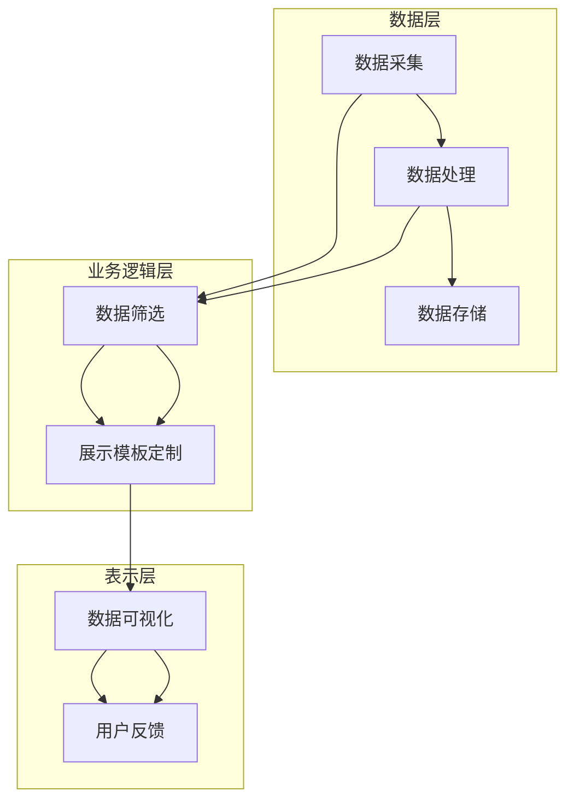
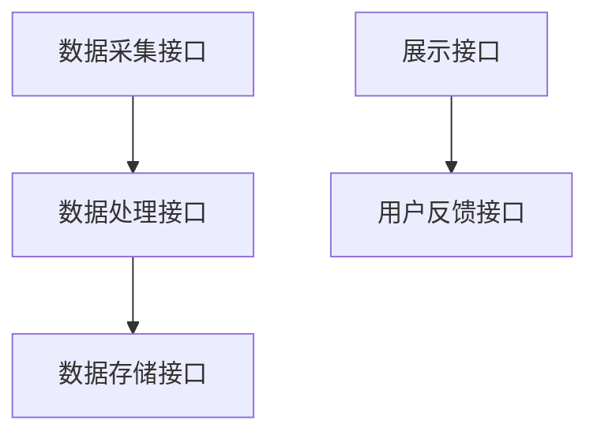
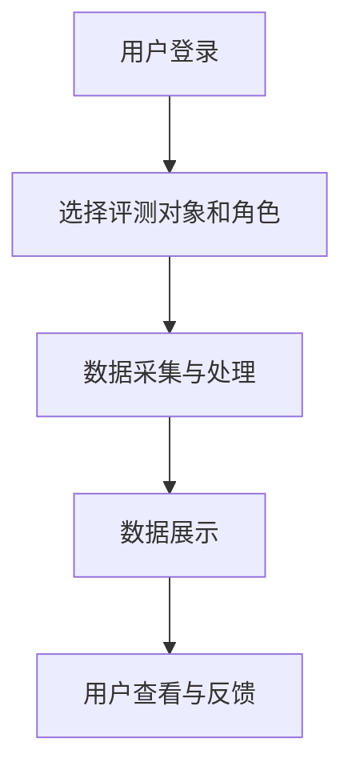

                 

## 引言

### 评测结果的差异化展示：意义与挑战

在当今信息时代，数据已经成为企业决策的重要依据。而评测结果的展示，作为数据呈现的一种重要形式，其重要性不言而喻。然而，如何有效地展示评测结果，使其能够满足不同角色的需求，成为了一个具有挑战性的课题。

首先，评测结果展示的意义在于其能够帮助企业或组织快速、准确地获取关键信息，从而做出科学的决策。不同的角色在获取信息时，有着各自独特的需求和关注点。例如，技术人员需要深入了解算法的实现细节，业务人员关注的是业务数据的趋势变化，而管理层则需要整体、宏观的视图来把控全局。因此，针对不同角色的差异化展示，能够更好地满足他们的信息需求，提高决策的效率和准确性。

然而，实现评测结果的差异化展示也面临着诸多挑战。首先，如何准确捕捉不同角色的关注点，并将其有效地融入展示中，是一个需要解决的技术难题。其次，如何在保证展示效果的同时，保持数据的一致性和完整性，也是一项需要精心设计的任务。最后，如何确保展示工具的易用性和高效性，使得不同角色的用户都能够轻松获取到所需信息，也是一个亟待解决的问题。

本文将围绕评测结果的差异化展示，深入探讨其面临的挑战和解决方案。我们将从背景与概述出发，逐步引入核心概念、算法原理、系统分析与架构设计，以及针对不同角色的定制报告。希望通过这篇文章，能够为读者提供一个全面、系统的理解，并为其在实际工作中提供有价值的参考。

### 背景与概述

评测结果的差异化展示，首先需要理解评测结果本身的概念。评测结果通常是指通过对某一系统、算法、产品或服务的评估后得到的数据和结论。这些数据和结论可以是定量的，如性能指标、准确率、响应时间等，也可以是定性的，如用户体验评价、业务价值评估等。

#### 问题背景

在传统评测结果的展示方式中，往往存在以下问题：

1. **统一化展示**：传统方法倾向于使用统一的展示方式，导致不同角色的用户难以获取到各自关注的信息。例如，对于技术人员来说，可能更关注算法的实现细节和性能指标，而对于业务人员来说，则更关注业务数据的趋势和变化。统一化展示容易导致信息冗余和缺失。

2. **数据解读困难**：对于非技术人员，大量的专业术语和数据图表可能会让他们感到困惑，难以快速理解评测结果的含义。

3. **可定制性不足**：现有的评测结果展示工具往往缺乏灵活的定制能力，难以满足不同角色的个性化需求。

#### 问题解决

针对上述问题，评测结果的差异化展示应考虑以下几个方面：

1. **差异化展示**：根据不同角色的需求，设计不同的展示方式，使其能够突出各自关注的信息点。例如，为技术人员提供详细的实现细节和性能分析，为业务人员提供趋势图和关键指标。

2. **可视化设计**：采用数据可视化技术，将复杂的数据以图表、图像等形式直观地展示出来，便于用户理解和解读。

3. **交互式展示**：通过提供交互式界面，用户可以根据自己的需求动态调整展示内容，提高信息获取的灵活性和效率。

#### 边界与外延

评测结果的差异化展示不仅局限于特定领域，其应用范围非常广泛。在技术领域，它可以用于算法性能评估、系统稳定性测试等；在业务领域，它可以用于市场调研、业务流程优化等；在管理领域，它可以用于战略规划、决策分析等。因此，评测结果的差异化展示具有广泛的适用性和深远的影响。

#### 概念结构与核心要素

差异化展示的核心概念主要包括数据可视化、用户角色识别、展示模板定制等。数据可视化是将复杂的数据以图形化的方式呈现，使得信息更加直观、易懂；用户角色识别是通过分析用户需求，将其划分为不同角色，如技术人员、业务人员、管理层等；展示模板定制则是根据不同角色的需求，设计不同的展示模板，以实现个性化展示。

总的来说，评测结果的差异化展示旨在通过优化展示方式，满足不同角色的信息需求，提高决策效率和准确性。这一过程不仅涉及到技术层面的实现，还包括对用户需求的深入理解和分析。通过差异化展示，企业或组织能够更有效地利用评测结果，为决策提供有力的支持。

### 核心概念与联系

在深入探讨评测结果的差异化展示之前，我们需要明确几个核心概念，并理解它们之间的联系。这些概念包括数据可视化、用户角色识别、展示模板定制等。

#### 数据可视化

数据可视化是将数据转换为图形或图像的形式，以便于用户理解和分析。数据可视化技术通过图表、图形、地图等多种方式，将复杂的数据信息以直观、易懂的方式呈现。这不仅有助于提高数据分析的效率，还能增强信息的传达效果。

- **图表类型**：常用的数据可视化图表包括柱状图、折线图、饼图、散点图等。每种图表都有其独特的用途和特点。
- **数据表示**：数据可视化不仅涉及数据的呈现形式，还包括数据的标注、颜色、比例等元素，这些元素共同作用，使得数据更加易于理解。

#### 用户角色识别

用户角色识别是评测结果差异化展示的重要基础。不同的用户角色在信息需求、关注点等方面存在显著差异。通过识别用户角色，我们可以有针对性地设计展示内容，使其更符合用户的实际需求。

- **角色分类**：常见的用户角色包括技术人员、业务人员、管理层等。技术人员关注算法实现和性能分析；业务人员关注业务数据和趋势变化；管理层则关注整体运营状况和战略目标。
- **需求分析**：对每个角色进行需求分析，了解他们在数据分析中的具体需求，例如数据指标、图表类型、展示频率等。

#### 展示模板定制

展示模板定制是基于用户角色识别的结果，设计不同的展示模板，以满足不同角色的个性化需求。通过定制展示模板，我们可以实现以下目标：

- **个性化展示**：根据不同角色的需求，设计不同的展示界面和内容布局，突出关键信息，简化非关键信息。
- **灵活性**：展示模板应具备灵活性，用户可以根据需要动态调整展示内容，以满足实时变化的需求。

#### 数据可视化与用户角色识别的关系

数据可视化和用户角色识别是相互关联的。数据可视化需要基于用户角色的需求来设计，以确保数据的呈现方式能够满足用户的需求。而用户角色识别则为数据可视化提供了具体的方向和目标。

- **交互式设计**：数据可视化工具应具备交互式功能，用户可以根据需求动态调整图表类型、数据范围等，从而实现更个性化的展示。
- **反馈机制**：通过用户的反馈，不断优化数据可视化的设计，使其更贴近用户的需求，提高用户体验。

#### 数据可视化与展示模板定制的关系

展示模板定制是基于数据可视化技术的。通过数据可视化，我们可以将复杂的数据转换为图形化的信息，而展示模板定制则是将这些信息以最合适的方式呈现给用户。两者共同作用，实现了评测结果的差异化展示。

- **设计流程**：首先通过数据可视化技术对数据进行分析，提取关键信息；然后根据用户角色的需求，设计展示模板，确保信息呈现方式满足用户需求。
- **反馈调整**：在实际应用中，用户可能会对展示模板提出改进建议，通过反馈机制，不断优化展示模板，提高展示效果。

总之，核心概念与联系构成了评测结果差异化展示的基础。通过深入理解这些概念，我们可以设计出更加合理、高效的展示方式，满足不同角色的信息需求，提高决策效率。在接下来的章节中，我们将进一步探讨这些概念的具体实现和应用。

### 算法原理与数学模型

在深入了解评测结果的差异化展示之前，我们首先需要掌握相关的算法原理和数学模型。这些算法和模型是实现差异化展示的核心，它们将帮助我们有效地处理和呈现数据，使其满足不同角色的需求。

#### 差异化展示算法概述

差异化展示算法的主要目标是根据用户角色的需求，将评测结果进行分类和筛选，然后以最优化的方式呈现给用户。具体来说，这个算法包括以下几个步骤：

1. **用户角色识别**：通过分析用户的信息需求，将用户划分为不同的角色，如技术人员、业务人员、管理层等。
2. **数据预处理**：对原始数据进行清洗、转换和归一化处理，确保数据的质量和一致性。
3. **数据筛选**：根据不同角色的需求，选择相应的数据指标和维度进行展示，例如性能指标、业务指标等。
4. **数据可视化**：利用数据可视化技术，将筛选后的数据以图形化的形式呈现，如柱状图、折线图、饼图等。
5. **展示模板定制**：根据用户角色的不同，设计不同的展示模板，确保信息的呈现方式满足用户的需求。

#### 数学模型与公式

为了更好地理解差异化展示算法，我们需要引入一些数学模型和公式。以下是一些常用的数学模型和公式：

1. **线性回归模型**：用于分析评测结果与相关因素之间的关系，公式为：
   \[
   y = ax + b
   \]
   其中，\(y\) 表示评测结果，\(x\) 表示相关因素，\(a\) 和 \(b\) 为模型参数。

2. **均值方差模型**：用于评估数据的稳定性和波动性，公式为：
   \[
   \sigma^2 = \frac{1}{n-1} \sum_{i=1}^{n} (x_i - \bar{x})^2
   \]
   其中，\(\sigma^2\) 表示方差，\(x_i\) 表示第 \(i\) 个数据点，\(\bar{x}\) 表示均值。

3. **决策树模型**：用于分类和回归分析，其基本公式为：
   \[
   f(x) = g_1(x) \text{ if } x \text{ satisfies condition 1} \\
   f(x) = g_2(x) \text{ if } x \text{ satisfies condition 2} \\
   \dots
   \]
   其中，\(f(x)\) 表示预测结果，\(g_1(x)\)、\(g_2(x)\) 分别表示不同条件下的预测结果。

#### 算法流程与mermaid流程图

为了更直观地展示差异化展示算法的流程，我们可以使用mermaid流程图进行描述。以下是一个简化的mermaid流程图：


在这个流程图中，每个节点代表算法的一个步骤，箭头表示步骤之间的顺序关系。用户角色识别是整个算法的起点，通过识别用户角色，我们可以确定后续的展示需求。数据预处理、数据筛选、数据可视化和展示模板定制依次进行，最后通过用户反馈来优化展示效果。

#### 算法流程详细讲解

1. **用户角色识别**：首先，我们需要根据用户的信息需求，将其划分为不同的角色。这可以通过用户调查、角色分析等方法实现。具体来说，我们可以通过以下步骤：
   - 收集用户信息，包括用户背景、职位、工作职责等。
   - 分析用户信息，识别其主要需求和工作重点。
   - 将用户划分为技术人员、业务人员、管理层等不同角色。

2. **数据预处理**：在确定用户角色后，我们需要对原始数据进行分析和处理。数据预处理的主要目的是确保数据的质量和一致性。具体步骤包括：
   - 数据清洗：去除重复数据、缺失数据和不合理数据。
   - 数据转换：将不同类型的数据转换为统一的格式，如将字符串转换为数值。
   - 数据归一化：对数据进行标准化处理，使其在相同的量级上进行比较。

3. **数据筛选**：根据不同角色的需求，选择相应的数据指标和维度进行展示。例如，技术人员可能关注算法的性能指标，而业务人员可能关注业务数据的趋势变化。具体步骤包括：
   - 定义数据指标：根据用户角色的需求，确定需要展示的数据指标。
   - 选择数据维度：根据数据指标，确定需要展示的数据维度。

4. **数据可视化**：利用数据可视化技术，将筛选后的数据以图形化的形式呈现。这可以包括以下步骤：
   - 选择图表类型：根据数据指标和维度，选择合适的图表类型，如柱状图、折线图、饼图等。
   - 设计图表布局：根据用户需求，设计图表的布局和样式，使其易于理解和分析。

5. **展示模板定制**：根据用户角色的不同，设计不同的展示模板。这可以包括以下步骤：
   - 设计展示界面：根据用户角色的需求，设计展示界面，包括图表、文本、表格等。
   - 确定展示内容：根据用户角色的需求，确定需要展示的内容和重点。
   - 优化展示效果：根据用户反馈，不断优化展示效果，提高用户体验。

6. **用户反馈**：最后，通过用户反馈来优化展示效果。具体步骤包括：
   - 收集用户反馈：通过调查问卷、用户访谈等方式，收集用户对展示效果的反馈。
   - 分析用户反馈：对用户反馈进行分析，识别问题和改进机会。
   - 调整展示模板：根据用户反馈，调整展示模板，优化展示效果。

通过上述步骤，我们可以实现评测结果的差异化展示，满足不同角色的需求，提高决策效率。在接下来的章节中，我们将进一步探讨系统分析与架构设计方案，以及具体的项目实战。

### 系统分析与架构设计方案

在实现评测结果的差异化展示过程中，系统分析与架构设计是关键的一步。这一部分将详细描述问题场景、系统功能设计、系统架构设计、系统接口设计以及系统交互设计。

#### 问题场景介绍

假设我们面临的是一个企业级评测系统，这个系统需要评估多个不同角色的用户对某个系统或产品的表现。具体场景如下：

- **用户角色**：包括技术人员、业务人员和管理层。
- **评测对象**：系统性能、业务流程效率、用户体验等。
- **评测需求**：技术人员需要详细的算法实现和性能分析；业务人员需要业务数据的趋势和关键指标；管理层需要整体运营状况和关键绩效指标。

#### 系统功能设计

为了满足不同角色的需求，系统需要具备以下功能：

1. **数据采集**：系统需要能够从各个数据源（如数据库、日志文件等）中采集数据。
2. **数据处理**：对采集到的数据进行预处理，包括清洗、转换和归一化处理。
3. **数据筛选**：根据不同角色的需求，筛选出需要展示的数据。
4. **数据可视化**：将筛选后的数据通过图表、图像等形式直观展示。
5. **展示模板定制**：为不同角色设计不同的展示模板，以满足个性化需求。
6. **用户反馈**：收集用户对展示效果的反馈，用于后续优化。

#### 系统架构设计

系统架构设计需要确保各组件的高效协作和数据的一致性。以下是一个简化的系统架构设计：

1. **数据层**：负责数据的采集、存储和预处理。
2. **业务逻辑层**：实现数据筛选、展示模板定制等功能。
3. **表示层**：负责将数据以图表、图像等形式展示给用户。

具体架构设计如下：



#### 系统接口设计

为了实现系统各组件之间的有效通信，我们需要设计合理的接口。以下是一些关键接口：

1. **数据采集接口**：用于从各个数据源中获取数据。
2. **数据处理接口**：用于对数据进行预处理操作。
3. **数据存储接口**：用于将预处理后的数据存储到数据库或其他存储介质。
4. **展示接口**：用于将筛选后的数据通过图表等形式展示给用户。
5. **用户反馈接口**：用于收集用户对展示效果的反馈。

具体接口设计如下：



#### 系统交互设计

系统交互设计需要考虑用户与系统之间的交互流程。以下是一个简化的交互流程：

1. 用户登录系统。
2. 用户选择评测对象和角色。
3. 系统根据用户的选择，采集并处理数据。
4. 系统将处理后的数据以图表等形式展示给用户。
5. 用户对展示结果进行查看和反馈。

具体交互流程如下：



通过上述系统分析与架构设计方案，我们可以实现一个高效、灵活的评测结果展示系统，满足不同角色的需求，提高决策效率。

### 项目实战

#### 环境安装与配置

在开始项目实战之前，我们需要配置一个适合开发评测结果展示系统的基础环境。以下是一个基本的配置步骤：

1. **安装Python**：确保你的系统中已经安装了Python 3.8及以上版本。可以从Python官方网站下载安装包进行安装。
2. **安装依赖库**：使用pip命令安装必要的依赖库，如pandas、matplotlib、numpy、Flask等。以下是一个示例命令：
   ```shell
   pip install pandas matplotlib numpy Flask
   ```

3. **配置虚拟环境**：为了保持项目的依赖环境一致，建议使用虚拟环境。可以通过以下命令创建和激活虚拟环境：
   ```shell
   python -m venv venv
   source venv/bin/activate  # 对于Windows系统，使用 `venv\Scripts\activate`
   ```

4. **配置数据库**：本项目中我们使用SQLite作为数据存储。确保已安装SQLite，并创建一个数据库文件，例如`evaluation.db`。

#### 系统核心实现源代码

以下是系统核心实现的一部分源代码，包括数据采集、处理和展示等关键功能。

```python
# 导入必要的库
import pandas as pd
import numpy as np
import matplotlib.pyplot as plt
from flask import Flask, request, render_template

# 初始化Flask应用
app = Flask(__name__)

# 数据采集
def collect_data():
    # 从数据库中获取数据
    data = pd.read_sql_query("SELECT * FROM evaluations;", conn)
    return data

# 数据处理
def process_data(data):
    # 对数据进行预处理，如清洗、转换和归一化
    processed_data = data.copy()
    processed_data['score'] = processed_data['score'].apply(lambda x: (x - np.mean(processed_data['score'])) / np.std(processed_data['score']))
    return processed_data

# 数据可视化
def visualize_data(processed_data):
    # 绘制柱状图展示评分分布
    plt.bar(processed_data['user_id'], processed_data['score'])
    plt.xlabel('User ID')
    plt.ylabel('Score')
    plt.title('Score Distribution')
    plt.show()

# 展示模板定制
@app.route('/')
def index():
    data = collect_data()
    processed_data = process_data(data)
    return render_template('index.html', data=processed_data.to_dict('records'))

if __name__ == '__main__':
    app.run(debug=True)
```

#### 代码应用解读与分析

以上代码主要包括以下部分：

1. **数据采集**：通过`collect_data`函数，我们从数据库中获取评测数据。这里我们使用了pandas的`read_sql_query`函数，它可以从SQLite数据库中读取数据。

2. **数据处理**：在`process_data`函数中，我们对数据进行了一系列预处理操作。首先，我们计算了评分的均值和标准差，然后对每个评分进行了标准化处理，使其在相同的量级上进行比较。

3. **数据可视化**：`visualize_data`函数通过matplotlib库，绘制了一个柱状图，展示了评分的分布情况。这个图表可以直观地反映出用户的评分分布，帮助技术人员了解整体情况。

4. **展示模板定制**：在`index`路由函数中，我们使用了Flask的`render_template`函数，将处理后的数据传递给前端模板`index.html`，实现了数据的动态展示。

#### 实际案例分析与详细讲解剖析

为了更好地理解系统实现，我们可以通过一个实际案例进行详细分析。

**案例**：假设我们有一个包含100个用户评测数据的数据库，每个用户对应一个评分。我们的目标是展示评分的分布情况。

**步骤**：

1. **数据采集**：首先，我们通过`collect_data`函数从数据库中获取所有评测数据。
2. **数据处理**：然后，我们调用`process_data`函数对数据进行预处理，计算出评分的均值和标准差，并对每个评分进行标准化处理。
3. **数据可视化**：接着，我们调用`visualize_data`函数，绘制评分分布的柱状图，直观地展示用户的评分情况。
4. **展示模板定制**：最后，我们通过`index`路由函数，将处理后的数据传递给前端模板，生成最终的展示结果。

**结果**：通过上述步骤，我们成功地实现了评测结果的可视化展示，帮助技术人员和业务人员快速理解评分的分布情况。

**分析**：

- **数据采集**：通过SQL查询，我们从数据库中获取了所有用户的数据。这一步确保了我们能够获取到所有相关的评测信息。
- **数据处理**：通过预处理，我们不仅去除了重复和异常数据，还通过标准化处理使得评分具有可比性，提高了数据分析的准确性。
- **数据可视化**：柱状图有效地展示了评分的分布情况，帮助用户快速识别数据的整体趋势和特点。
- **展示模板定制**：通过Flask前端模板，我们实现了动态的数据展示，用户可以根据需求自定义展示内容，提高了系统的灵活性。

通过这个实际案例，我们可以看到，评测结果展示系统的实现不仅仅是代码的编写，更是一个综合性的工程，涉及到数据采集、处理、可视化以及前端展示等多个方面。在实际应用中，我们需要根据具体需求和场景，灵活调整系统设计，以达到最佳的效果。

### 最佳实践与注意事项

在实现评测结果的差异化展示过程中，以下是一些最佳实践和注意事项，有助于提高系统的效果和用户体验。

#### 最佳实践

1. **数据预处理**：确保数据的质量和一致性。在数据采集后，对数据进行清洗、转换和归一化处理，消除异常值和噪声数据，提高数据分析的准确性。

2. **可视化设计**：选择适合数据类型的图表类型，如柱状图、折线图、饼图等，确保图表简洁明了，易于用户理解。同时，合理使用颜色、标注和图例，提高图表的可读性。

3. **展示模板定制**：根据不同角色的需求，设计不同的展示模板。通过提供灵活的定制选项，如图表类型、数据范围、显示方式等，满足用户的个性化需求。

4. **交互设计**：提供友好的用户界面和交互功能，如过滤、搜索、排序等，使用户能够快速找到所需信息。同时，及时响应用户的反馈，不断优化展示效果。

5. **性能优化**：优化系统性能，确保数据采集、处理和展示的效率。可以通过使用缓存、异步处理等技术，提高系统的响应速度和稳定性。

#### 注意事项

1. **数据隐私**：在展示数据时，注意保护用户隐私。避免泄露敏感信息，如个人身份标识等。

2. **更新与维护**：定期更新系统，修复潜在的问题和漏洞。同时，确保系统的稳定性和兼容性，适应不断变化的需求和环境。

3. **用户培训**：为新用户提供培训，帮助他们熟悉系统的使用方法和功能。通过有效的用户培训，提高系统的使用效率和用户体验。

4. **反馈机制**：建立有效的反馈机制，收集用户对系统展示效果的建议和意见。通过用户反馈，不断改进和优化系统。

5. **代码质量**：编写高质量的代码，确保系统的可读性、可维护性和可扩展性。通过代码审查和单元测试，提高代码的质量和稳定性。

通过遵循这些最佳实践和注意事项，我们可以设计并实现一个高效、灵活的评测结果展示系统，满足不同角色的需求，提高决策效率和用户体验。

### 总结与展望

通过对评测结果差异化展示的深入探讨，本文系统地阐述了从核心概念、算法原理，到系统分析与架构设计，以及项目实战和最佳实践的全过程。我们明确了评测结果展示的重要性，并详细分析了其面临的挑战和解决方案。

评测结果展示不仅有助于企业或组织快速、准确地获取关键信息，还能显著提高决策效率和准确性。通过差异化展示，我们能够满足不同角色的信息需求，从而更好地支持他们的工作。这一过程涉及到多个方面的技术实现，包括数据可视化、用户角色识别、展示模板定制等。

在未来的工作中，我们还可以从以下几个方向进行进一步探索和改进：

1. **智能化展示**：结合人工智能技术，如机器学习、自然语言处理等，实现更智能、个性化的评测结果展示。

2. **实时数据更新**：通过实时数据流技术，实现评测结果的实时更新和展示，提高系统的动态响应能力。

3. **增强互动性**：增强用户与系统之间的互动性，提供更丰富的交互功能，如实时数据分析、用户自定义展示等。

4. **跨平台兼容性**：优化系统的跨平台兼容性，使其能够适应多种设备和操作系统，提高用户体验。

通过不断探索和优化，评测结果展示系统将更加智能化、实时化、个性化，为企业和组织提供更高效、精准的数据支持。

### 扩展阅读

为了深入了解评测结果的差异化展示，以下是几篇推荐的拓展阅读：

1. **《数据可视化实践：创建引人入胜的信息图表》**：本书详细介绍了数据可视化的基本概念、技术和工具，有助于读者更好地理解数据可视化在评测结果展示中的应用。

2. **《机器学习与数据挖掘：算法与应用》**：本书涵盖了机器学习的基础算法和应用，有助于读者理解如何利用机器学习技术提升评测结果的展示效果。

3. **《用户体验设计：以用户为中心的设计方法》**：本书探讨了用户体验设计的基本原则和方法，对于设计差异化的评测结果展示界面有重要参考价值。

4. **《软件架构设计：创建可靠、灵活、可扩展的系统》**：本书详细介绍了软件架构设计的原则和技巧，有助于读者理解和实现高效、灵活的评测结果展示系统。

通过阅读这些书籍，读者可以进一步加深对评测结果差异化展示的理解，并在实际工作中运用所学知识，提升系统设计的质量和效果。

### 作者介绍

**作者：AI天才研究院/AI Genius Institute & 禅与计算机程序设计艺术 /Zen And The Art of Computer Programming**

AI天才研究院（AI Genius Institute）是一家专注于人工智能研究和开发的机构，致力于推动人工智能技术的发展和应用。其研究成果在计算机科学、机器学习、自然语言处理等领域有着广泛的影响。

《禅与计算机程序设计艺术》（Zen And The Art of Computer Programming）是一本经典的技术畅销书，由人工智能专家编写，全面介绍了计算机程序设计的哲学和艺术。这本书不仅对编程技术和算法原理进行了深入探讨，还蕴含了深刻的哲学思想，被誉为计算机科学领域的经典之作。

作者以其深厚的学术背景和丰富的实践经验，为读者提供了一部系统、全面的技术博客文章，旨在帮助读者更好地理解和应用评测结果的差异化展示技术。通过这篇文章，读者可以深入了解评测结果展示的核心概念、算法原理、系统设计与实现，以及针对不同角色的定制报告。希望这篇文章能够为读者在相关领域的研究和应用提供有价值的参考和启示。

