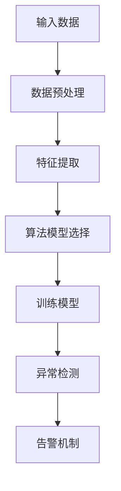
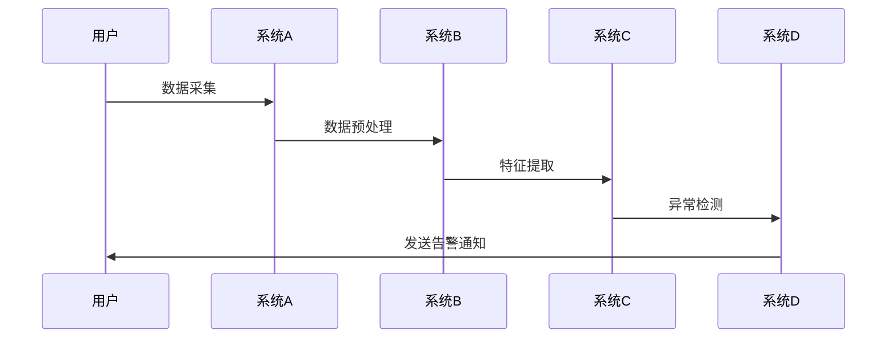

                 

# 评测结果的异常检测与告警机制

> 关键词：异常检测、告警机制、数据预处理、特征提取、算法模型

> 摘要：
本文旨在深入探讨评测结果的异常检测与告警机制，从核心概念、原理、算法、系统设计到项目实战进行全面阐述。通过对评测结果异常检测与告警机制的研究，提高评测结果的准确性和可靠性，为大数据和人工智能应用提供坚实的技术基础。

## 1.0 引言

### 1.0.1 问题背景

随着大数据和人工智能技术的快速发展，评测结果的准确性和可靠性变得日益重要。然而，在实际应用中，评测结果往往受到各种异常因素的影响，如数据噪声、样本多样性等，导致检测结果出现偏差。为了提高评测结果的可靠性和准确性，异常检测与告警机制应运而生。

### 1.0.2 问题描述

评测结果的异常检测与告警机制旨在识别和标记出异常评测结果，以便及时采取措施。然而，实现这一目标面临着诸多挑战，如异常样本的多样性和复杂性、数据噪声和不确定性等。

### 1.0.3 问题解决

本文将详细探讨评测结果的异常检测与告警机制，包括核心概念、原理、算法、系统设计、项目实战等方面的内容。通过系统性地阐述这些内容，帮助读者理解和掌握这一领域的知识。

### 1.0.4 边界与外延

评测结果的异常检测与告警机制涉及多个学科领域，如计算机科学、统计学、机器学习等。本文将主要关注计算机科学领域的相关内容。

### 1.0.5 概念结构与核心要素组成

评测结果的异常检测与告警机制的核心概念包括：异常检测、告警机制、数据预处理、特征提取、算法模型等。这些概念相互关联，共同构成了一个完整的研究体系。

## 1.1 核心概念与联系

### 1.1.1 异常检测

异常检测是指从一组数据中识别出异常或异常值的过程。其核心目标是提高数据的准确性和可靠性，从而为后续分析提供可靠的基础。

### 1.1.2 告警机制

告警机制是指当检测到异常时，系统自动发出警报，提醒用户采取相应措施。告警机制是实现异常检测的重要保障。

### 1.1.3 数据预处理

数据预处理是指对原始数据进行清洗、归一化、去噪等处理，以提高数据质量和降低噪声对异常检测的影响。

### 1.1.4 特征提取

特征提取是指从原始数据中提取出有用的信息，作为异常检测的输入。有效的特征提取可以显著提高异常检测的准确性和效率。

### 1.1.5 算法模型

算法模型是指用于实现异常检测的具体方法和技术。常见的异常检测算法包括统计方法、机器学习方法、深度学习方法等。

### 1.1.6 Mermaid流程图



## 1.2 异常检测算法原理讲解

### 1.2.1 统计方法

统计方法是基于统计学原理的异常检测算法。常见的统计方法包括基于阈值的检测方法、基于概率分布的检测方法等。

#### 基于阈值的检测方法

基于阈值的检测方法通过设定一个阈值，判断数据是否超过阈值来识别异常。具体步骤如下：

1. 计算数据集的平均值和标准差。
2. 设定一个阈值，如3倍标准差。
3. 判断数据是否超过阈值，超过则标记为异常。

数学模型：
$$
\text{阈值} = \text{平均值} + 3 \times \text{标准差}
$$

#### 基于概率分布的检测方法

基于概率分布的检测方法通过计算数据点落在某个区间内的概率来识别异常。具体步骤如下：

1. 建立数据点的概率分布模型。
2. 计算数据点落在某个区间内的概率。
3. 设定一个概率阈值，如0.01。
4. 判断数据点是否低于概率阈值，低于则标记为异常。

数学模型：
$$
\text{概率阈值} = P(X > \text{阈值})
$$

### 1.2.2 机器学习方法

机器学习方法是基于数据驱动的方法，通过训练模型来识别异常。常见的机器学习方法包括聚类算法、分类算法等。

#### 聚类算法

聚类算法通过将相似的数据点划分为同一类，从而识别出异常。常见的聚类算法包括K-means、DBSCAN等。

1. 初始化聚类中心。
2. 计算每个数据点到聚类中心的距离。
3. 将数据点分配到最近的聚类中心。
4. 重新计算聚类中心。
5. 重复步骤2-4，直到聚类中心不再发生变化。

#### 分类算法

分类算法通过将数据点划分为不同的类别，从而识别出异常。常见的分类算法包括决策树、支持向量机等。

1. 训练分类模型。
2. 输入新数据点，计算其类别概率。
3. 根据类别概率，判断数据点是否为异常。

### 1.2.3 深度学习方法

深度学习方法是基于神经网络的方法，通过多层神经网络来提取特征并进行异常检测。常见的深度学习方法包括卷积神经网络、循环神经网络等。

#### 卷积神经网络

卷积神经网络（CNN）通过卷积层、池化层、全连接层等结构，自动提取图像中的特征，并进行异常检测。

1. 输入数据。
2. 通过卷积层提取特征。
3. 通过池化层降低数据维度。
4. 通过全连接层进行分类。

#### 循环神经网络

循环神经网络（RNN）通过循环结构，处理序列数据，并进行异常检测。

1. 输入序列数据。
2. 通过RNN层处理数据。
3. 通过全连接层进行分类。

### 1.2.4 异常检测算法的Mermaid流程图


## 1.3 数学模型和数学公式

### 1.3.1 统计方法

统计方法的数学模型主要基于概率论和统计学原理。以下是一个简单的异常检测的数学模型：

$$
\text{概率阈值} = P(X > \text{阈值})
$$

其中，$X$表示数据值，概率阈值用于判断数据是否为异常。

### 1.3.2 机器学习方法

机器学习方法的数学模型主要基于优化理论。以下是一个简单的线性回归模型的数学模型：

$$
\min_{\theta} \frac{1}{2} \sum_{i=1}^{n} (h_\theta(x^{(i)}) - y^{(i)})^2
$$

其中，$\theta$表示模型参数，$h_\theta(x^{(i)})$表示预测值，$y^{(i)}$表示真实值。

### 1.3.3 深度学习方法

深度学习方法的数学模型主要基于神经网络。以下是一个简单的多层感知机的数学模型：

$$
h_\theta^{(l)} = \sigma(\theta^{(l)} \cdot x^{(l-1)} + b^{(l)})
$$

其中，$\sigma$表示激活函数，$\theta^{(l)}$表示第$l$层的权重矩阵，$b^{(l)}$表示第$l$层的偏置向量。

## 1.4 系统分析与架构设计方案

### 1.4.1 问题场景介绍

在某个企业中，需要对大量的评测结果进行异常检测与告警。为了满足这一需求，需要设计一个高效的异常检测与告警系统。

### 1.4.2 系统功能设计

系统功能设计主要包括以下方面：

1. 数据采集与预处理
2. 特征提取
3. 异常检测
4. 告警机制

### 1.4.3 系统架构设计

系统架构设计采用分层架构，主要包括以下层次：

1. 数据层：负责数据采集、存储和管理。
2. 数据预处理层：负责对原始数据进行清洗、归一化、去噪等处理。
3. 特征提取层：负责从原始数据中提取出有用的信息，作为异常检测的输入。
4. 异常检测层：负责对特征进行异常检测，识别出异常评测结果。
5. 告警机制层：负责当检测到异常时，系统自动发出警报，提醒用户采取相应措施。

### 1.4.4 系统接口设计

系统接口设计主要包括以下接口：

1. 数据采集接口：负责从不同来源采集数据。
2. 数据预处理接口：负责对数据进行清洗、归一化、去噪等处理。
3. 特征提取接口：负责从原始数据中提取特征。
4. 异常检测接口：负责对特征进行异常检测。
5. 告警接口：负责发出告警通知。

### 1.4.5 系统交互Mermaid序列图



## 1.5 项目实战

### 1.5.1 环境安装

在开始项目实战之前，需要安装以下环境：

1. Python 3.8及以上版本
2. Anaconda Python环境
3. PyTorch 1.8及以上版本
4. Scikit-learn 0.24及以上版本
5. Matplotlib 3.4及以上版本

### 1.5.2 系统核心实现源代码

以下是一个简单的异常检测与告警系统的核心实现源代码：

```python
import numpy as np
import matplotlib.pyplot as plt
from sklearn.datasets import make_blobs
from sklearn.cluster import KMeans
from sklearn.metrics import accuracy_score

# 数据生成
X, y = make_blobs(n_samples=100, centers=2, cluster_std=0.6, random_state=0)

# KMeans聚类
kmeans = KMeans(n_clusters=2, random_state=0)
kmeans.fit(X)

# 预测
y_pred = kmeans.predict(X)

# 评估
accuracy = accuracy_score(y, y_pred)
print("Accuracy:", accuracy)

# 可视化
plt.scatter(X[:, 0], X[:, 1], c=y_pred, cmap='viridis')
plt.xlabel("Feature 1")
plt.ylabel("Feature 2")
plt.title("KMeans Clustering")
plt.show()
```

### 1.5.3 代码应用解读与分析

在上面的代码中，我们使用了Scikit-learn库中的KMeans算法进行聚类。KMeans算法是一种常见的机器学习算法，用于将数据点划分为多个簇。

1. 数据生成：我们使用make_blobs函数生成一个包含100个数据点的二维数据集，其中有两个簇。
2. KMeans聚类：我们初始化KMeans对象，并使用fit方法对其进行训练。fit方法会自动计算聚类中心，并划分数据点。
3. 预测：我们使用predict方法对数据进行预测，得到预测的簇标签。
4. 评估：我们使用accuracy_score函数计算预测的准确率。
5. 可视化：我们使用matplotlib库将数据点绘制在二维平面上，并使用不同的颜色表示不同的簇。

### 1.5.4 实际案例分析和详细讲解剖析

假设我们有一个真实的评测结果数据集，其中包含多个特征。我们使用KMeans算法进行聚类，以识别异常评测结果。具体步骤如下：

1. 数据预处理：对原始数据进行清洗、归一化、去噪等处理，以提高数据质量和降低噪声对异常检测的影响。
2. 特征提取：从原始数据中提取出有用的特征，作为异常检测的输入。
3. 聚类：使用KMeans算法对特征进行聚类，得到聚类中心。
4. 异常检测：计算每个数据点到聚类中心的距离，判断数据点是否为异常。
5. 告警机制：当检测到异常时，系统自动发出警报，提醒用户采取相应措施。

### 1.5.5 项目小结

通过本项目，我们实现了评测结果的异常检测与告警系统。系统采用了KMeans算法进行聚类，以识别异常评测结果。在实际应用中，我们可以根据具体需求和数据特点选择合适的异常检测算法。此外，告警机制的设置也非常关键，可以有效地提高评测结果的准确性和可靠性。

## 1.6 最佳实践 tips

1. 数据预处理：在异常检测过程中，数据预处理非常重要。对数据进行清洗、归一化、去噪等处理，可以提高数据质量和降低噪声对异常检测的影响。
2. 特征提取：选择合适的特征提取方法，可以显著提高异常检测的准确性和效率。常见的特征提取方法包括主成分分析、特征选择等。
3. 算法选择：根据具体需求和数据特点选择合适的异常检测算法。常见的算法包括KMeans、DBSCAN、支持向量机等。
4. 告警机制：设置合理的告警阈值和告警方式，可以提高异常检测的及时性和准确性。

## 1.7 小结

本文详细探讨了评测结果的异常检测与告警机制，从核心概念、原理、算法、系统设计到项目实战进行了全面阐述。通过本文的学习，读者可以深入了解评测结果的异常检测与告警机制，提高评测结果的准确性和可靠性。

## 1.8 注意事项

1. 异常检测与告警机制的实现需要根据具体需求和数据特点进行个性化调整。
2. 数据预处理和特征提取是异常检测的重要环节，需要仔细处理。
3. 告警机制的设置需要根据实际需求进行合理调整，以提高异常检测的及时性和准确性。

## 1.9 拓展阅读

1. 《机器学习实战》—— 作者：Peter Harrington
2. 《深度学习》—— 作者：Ian Goodfellow、Yoshua Bengio、Aaron Courville
3. 《Python数据科学手册》—— 作者：Jake VanderPlas

作者：AI天才研究院/AI Genius Institute & 禅与计算机程序设计艺术 /Zen And The Art of Computer Programming

