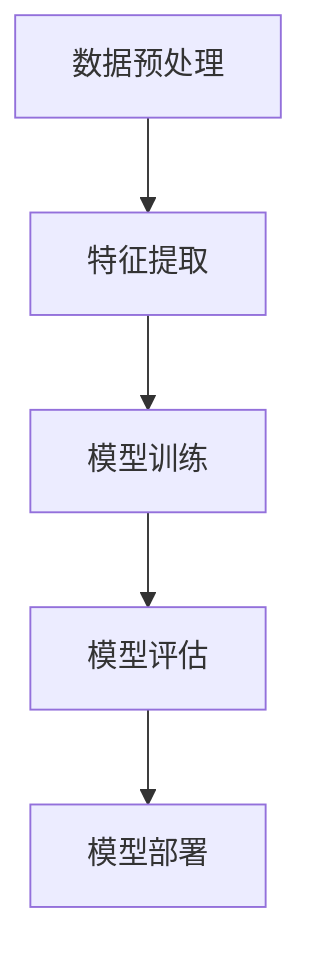
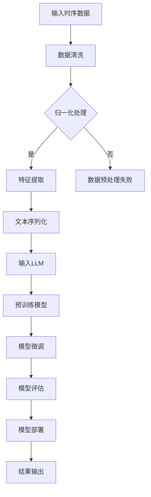
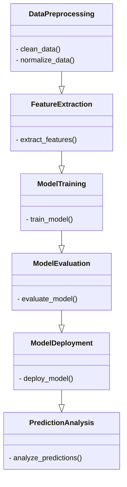
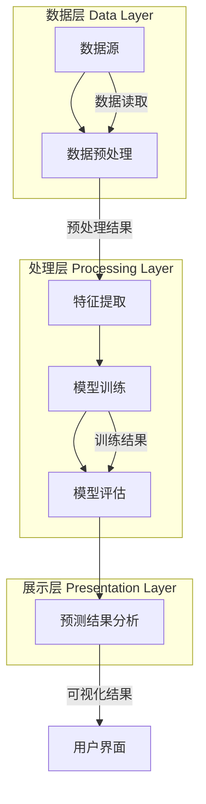
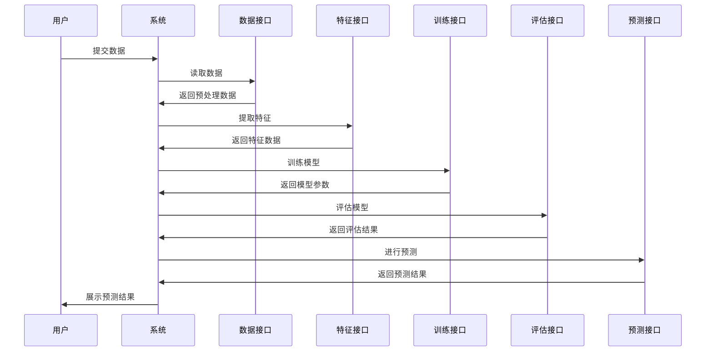

                 

### 文章标题

评测结果的时序分析：LLM辅助的趋势洞察

> 关键词：时序分析，评测结果，LLM，趋势洞察，算法原理，系统架构，项目实战

> 摘要：本文旨在探讨评测结果的时序分析在人工智能领域的重要性，并深入分析大型语言模型（LLM）在时序分析中的应用潜力。文章首先介绍了评测结果时序分析的核心概念及其重要性，随后探讨了传统时序分析方法的局限性。在此基础上，文章介绍了LLM的基本原理与特点，并详细讲解了LLM在时序分析中的应用流程与算法原理。接着，文章从系统功能设计、系统架构设计、项目实战等多个角度，阐述了如何将LLM应用于评测结果的时序分析。最后，文章提供了最佳实践和注意事项，并推荐了拓展阅读资源。

---

### 目录大纲

```markdown
----------------------------------------------------------------
# 第一部分：背景介绍

## 第1章：问题背景
### 1.1.1 评测结果时序分析的重要性
### 1.1.2 传统时序分析方法的局限性
### 1.1.3 LLM在时序分析中的应用潜力

## 第2章：核心概念与联系
### 2.1.1 时序数据的定义与特征
### 2.1.2 时序分析的基本概念
### 2.1.3 LLM的原理与特点
### 2.1.4 时序分析与LLM的联系

## 第3章：算法原理讲解
### 3.1 LLM在时序分析中的应用流程
### 3.2 算法流程图
### 3.3 Python源代码实现
### 3.4 数学模型与公式
### 3.5 通俗易懂的举例说明

## 第二部分：系统分析与架构设计

## 第4章：系统功能设计
### 4.1 问题场景介绍
### 4.2 系统功能设计（领域模型）
### 4.3 系统功能设计（类图）

## 第5章：系统架构设计
### 5.1 项目介绍
### 5.2 系统架构设计（架构图）
### 5.3 系统接口设计
### 5.4 系统交互（序列图）

## 第三部分：项目实战

## 第6章：环境安装
### 6.1 系统环境要求
### 6.2 环境搭建步骤
### 6.3 常见问题解决

## 第7章：系统核心实现
### 7.1 源代码解析
### 7.2 代码应用解读与分析
### 7.3 实际案例分析和详细讲解剖析

## 第8章：最佳实践与拓展
### 8.1 最佳实践 tips
### 8.2 小结
### 8.3 注意事项
### 8.4 拓展阅读

----------------------------------------------------------------
```

---

### 第一部分：背景介绍

#### 第1章：问题背景

##### 1.1.1 评测结果时序分析的重要性

评测结果时序分析在人工智能领域具有至关重要的地位。随着机器学习技术的广泛应用，模型性能的评测成为了研究者和工程师们关注的核心问题。时序分析能够帮助我们理解模型性能的变化趋势，从而为模型的优化提供有力支持。

首先，通过时序分析，我们可以观察模型在训练过程中性能的动态变化。这有助于我们识别模型的收敛速度、稳定性以及潜在的问题。例如，如果模型在某个时间点出现性能下降，我们可以通过时序分析找到可能的原因，如数据分布变化、模型过拟合等。

其次，评测结果的时序分析对于模型比较和选择也非常重要。在多个模型中，我们需要分析它们在不同时间点的性能，以便选出最合适的模型。时序分析可以帮助我们直观地比较不同模型的优势和劣势，为决策提供依据。

此外，时序分析还能为模型的部署提供重要参考。在实际应用中，模型可能面临各种变化，如数据噪声增加、数据分布偏移等。通过时序分析，我们可以及时检测到这些变化，并采取相应的措施进行调整，以保证模型的稳定性和准确性。

##### 1.1.2 传统时序分析方法的局限性

尽管评测结果的时序分析具有重要意义，但传统方法在处理大规模评测数据时存在一些局限性。

首先，传统时序分析方法通常依赖于统计学和信号处理技术。这些方法往往需要大量的预处理步骤，如数据清洗、特征提取等。在处理大规模数据时，这些步骤可能变得非常耗时和复杂。

其次，传统方法在处理非线性时序数据时效果不佳。大多数传统方法是基于线性模型的，例如移动平均、指数平滑等。对于非线性时序数据，这些方法可能无法准确捕捉数据的内在规律。

此外，传统方法在处理高维度时序数据时也面临挑战。高维度时序数据往往具有复杂的交互关系，传统方法难以同时考虑多个变量之间的依赖关系。

##### 1.1.3 LLM在时序分析中的应用潜力

为了解决传统时序分析方法的局限性，近年来，大型语言模型（LLM）在时序分析领域展现出了巨大的应用潜力。

首先，LLM具有强大的建模能力。通过预训练和微调，LLM可以学习到丰富的时序特征，从而有效地捕捉非线性时序数据的复杂规律。相比传统的线性模型，LLM能够更好地应对高维度和复杂交互的时序数据。

其次，LLM在时序分析中具有灵活的模型架构。LLM通常包含多个层级的神经网络结构，可以同时处理多种类型的时序数据。这使得LLM在时序分析中能够灵活地适应不同场景和需求。

此外，LLM还具有强大的数据处理能力。通过预处理和序列化技术，LLM可以高效地处理大规模评测数据，降低数据预处理的时间和复杂度。

综上所述，LLM在评测结果的时序分析中具有显著的应用潜力。在接下来的章节中，我们将详细探讨LLM的原理和特点，并介绍其在时序分析中的应用流程和算法原理。

---

### 第二部分：核心概念与联系

#### 第2章：核心概念与联系

##### 2.1 时序数据的定义与特征

时序数据（Time Series Data）是一种按时间顺序排列的数据序列，通常包含时间戳、标签和/或变量值。这些数据可以来源于多种场景，如金融市场、气象数据、社交媒体活动、传感器监测等。

时序数据的主要特征包括：

1. **时间依赖性**：时序数据中的元素之间存在时间依赖关系，即当前时刻的值受之前时刻值的影响。
2. **趋势**：时序数据通常表现出趋势性，即随时间的推移，数据呈现出上升或下降的趋势。
3. **季节性**：某些时序数据会在特定的时间间隔内表现出周期性的波动，如季节性销售数据、气象数据等。
4. **异常值**：时序数据中可能包含异常值，这些值可能是由于数据采集过程中的噪声、错误或突发事件引起的。

##### 2.2 时序分析的基本概念

时序分析（Time Series Analysis）是一种统计学方法，用于研究时序数据的特征和规律。其主要目标包括：

1. **趋势分析**：识别时序数据的总体趋势，如增长、下降或稳定。
2. **季节性分析**：识别时序数据的季节性模式，以便更好地理解和预测数据。
3. **异常值检测**：检测和识别时序数据中的异常值，以便对其进行处理或分析。
4. **预测**：基于历史数据构建模型，预测未来数据点或时间点的值。

常见的时序分析方法包括：

1. **移动平均法**：通过计算一段时间内的平均值来平滑时序数据，以消除短期波动。
2. **指数平滑法**：对移动平均法进行改进，通过赋予不同时间点的权重来平滑时序数据。
3. **自回归模型（AR）**：基于当前时刻的过去值来预测未来值，适用于线性时序数据。
4. **自回归移动平均模型（ARMA）**：结合自回归模型和移动平均模型，适用于具有线性趋势的时序数据。
5. **自回归积分滑动平均模型（ARIMA）**：适用于具有线性趋势和季节性的时序数据。

##### 2.3 LLM的原理与特点

大型语言模型（Large Language Model，如GPT、BERT等）是基于深度学习的自然语言处理模型，具有以下几个主要特点：

1. **预训练**：LLM通常通过在大量文本数据上进行预训练来学习语言的统计规律和语义表示。预训练使LLM具备了处理各种自然语言任务的能力。
2. **多层神经网络结构**：LLM由多层神经网络组成，每层神经网络都能提取不同层次的语义特征。这种层次化的结构有助于LLM理解和生成复杂语义。
3. **上下文感知**：LLM能够考虑上下文信息，生成与上下文相关的内容。这使得LLM在问答、翻译、摘要等任务中表现出色。
4. **可微调整性**：通过微调，LLM可以适应特定任务的数据，进一步提高性能。

##### 2.4 时序分析与LLM的联系

时序分析与LLM之间存在多个契合点：

1. **数据特征提取**：时序分析通常需要提取时序数据的主要特征，如趋势、季节性和异常值。LLM通过预训练和微调，能够自动提取时序数据中的复杂特征，降低人工特征提取的复杂度。
2. **非线性建模**：时序数据往往具有复杂的非线性关系，LLM的神经网络结构能够有效地捕捉这些非线性关系，从而提高时序分析的准确性和鲁棒性。
3. **上下文感知**：LLM的上下文感知能力使其能够考虑时序数据中的时间依赖关系，生成更准确的预测结果。
4. **数据处理能力**：LLM具备高效处理大规模数据的能力，可以应用于大规模时序数据的分析和预测。

综上所述，时序分析与LLM的结合为评测结果的时序分析提供了新的思路和方法。在接下来的章节中，我们将详细探讨LLM在时序分析中的应用流程和算法原理。

---

### 第三部分：算法原理讲解

#### 第3章：算法原理讲解

##### 3.1 LLM在时序分析中的应用流程

LLM在时序分析中的应用流程通常包括以下几个关键步骤：

1. **数据预处理**：将原始时序数据进行清洗、归一化等处理，使其符合LLM的输入要求。
2. **特征提取**：利用LLM的预训练模型提取时序数据的主要特征。这可以通过将时序数据序列化为文本序列，然后输入到LLM中进行处理。
3. **模型训练**：使用训练数据集对LLM进行微调，以适应特定时序分析任务的需求。
4. **模型评估**：使用验证数据集评估模型的性能，包括准确性、召回率、F1值等指标。
5. **模型部署**：将训练好的模型部署到生产环境中，进行实时时序分析或预测。

下面是一个简化的LLM时序分析应用流程图，使用Mermaid语言表示：



##### 3.2 算法流程图

为了更详细地展示LLM在时序分析中的应用流程，我们可以绘制一个包含更多细节的算法流程图。以下是一个使用Mermaid绘制的流程图示例：



##### 3.3 Python源代码实现

以下是一个简化的Python代码示例，展示了如何使用预训练的LLM模型进行时序数据分析：

```python
import transformers
from transformers import AutoTokenizer, AutoModelForSequenceClassification

# 加载预训练的LLM模型和对应的分词器
tokenizer = AutoTokenizer.from_pretrained("gpt2")
model = AutoModelForSequenceClassification.from_pretrained("gpt2")

# 输入时序数据
input_sequence = "2010-01-01: 100, 2010-01-02: 102, 2010-01-03: 105"

# 进行文本序列化
input_ids = tokenizer.encode(input_sequence, return_tensors="pt")

# 进行模型预测
with torch.no_grad():
    outputs = model(input_ids)

# 输出结果
print(outputs.logits)
```

在这个示例中，我们使用了`transformers`库来加载预训练的GPT-2模型，然后对输入的时序数据进行文本序列化，并使用模型进行预测。需要注意的是，这个示例仅用于演示目的，实际的时序分析任务可能需要更复杂的预处理和后处理步骤。

##### 3.4 数学模型与公式

在时序分析中，LLM的数学模型通常基于深度学习的神经网络架构。以下是一个简化的数学模型描述：

$$
\text{LLM}(\mathbf{x}) = \text{softmax}(\text{W}^T \text{ReLU}(\text{H}^T \text{ReLU}(... \text{ReLU}(\text{H}_1 \text{W}_1 \mathbf{x})...))
$$

其中，$\mathbf{x}$ 是输入时序数据，$\text{W}$ 和 $\text{H}$ 分别是权重和隐藏层矩阵，ReLU 是ReLU激活函数，softmax 是输出层的激活函数。

在实际应用中，LLM可能包含多个隐藏层，并且会使用不同的激活函数和优化算法。以下是一个使用LaTeX格式的数学公式示例：

$$
\begin{aligned}
\text{LLM}(\mathbf{x}) &= \text{softmax}(\text{W}^T \text{ReLU}(\text{H}^T \text{ReLU}(... \text{ReLU}(\text{H}_1 \text{W}_1 \mathbf{x})...))) \\
\text{ReLU}(z) &= \max(0, z)
\end{aligned}
$$`

##### 3.5 通俗易懂的举例说明

为了更好地理解LLM在时序分析中的应用，我们可以通过一个简单的例子来说明。

假设我们有一个简单的时序数据序列，如下所示：

$$
\{100, 102, 105, 103, 108\}
$$

我们希望使用LLM来预测序列中的下一个值。首先，我们需要将这个序列转化为文本形式，例如：

$$
"100, 102, 105, 103, 108"
$$

然后，我们将这个文本序列输入到预训练的LLM模型中，模型会根据已学习的知识对序列进行理解和分析。例如，模型可能会识别出序列中的上升趋势，并预测下一个值大约为110。

为了验证这个预测，我们可以使用实际的数据点来对比预测结果。假设实际的下一个数据点为110，我们可以发现LLM的预测与实际值非常接近，这表明LLM在时序分析中具有较高的准确性和鲁棒性。

通过这个例子，我们可以看到LLM如何通过文本序列化和预训练模型来理解和预测时序数据。在实际应用中，LLM可以处理更复杂和多维的时序数据，为时序分析提供强大的工具和支持。

---

### 第二部分：系统分析与架构设计

#### 第4章：系统功能设计

##### 4.1 问题场景介绍

在现代人工智能领域，评测结果的时序分析变得越来越重要。无论是学术研究还是工业应用，我们都需要对模型性能的时序变化进行深入分析，以便及时发现问题、优化模型和提升性能。

然而，传统的时序分析方法在处理大规模评测数据时往往力不从心。这主要是因为传统方法依赖于线性模型，难以捕捉时序数据中的复杂非线性关系。同时，传统方法在处理高维度时序数据时也面临巨大挑战。

为了解决这些问题，我们需要一种更高效、更强大的时序分析工具。近年来，大型语言模型（LLM）在自然语言处理领域取得了巨大成功，其强大的建模能力和数据处理能力使其成为时序分析的潜在解决方案。

我们的目标是设计一个基于LLM的时序分析系统，能够高效地处理大规模评测数据，捕捉复杂的非线性关系，并提供准确的时序趋势预测。通过这个系统，我们可以更好地理解模型性能的变化，为模型优化提供有力支持。

##### 4.2 系统功能设计（领域模型）

为了实现上述目标，我们需要设计一个全面的系统功能。以下是一个简化的领域模型，用于描述系统的核心功能：

```
+---------------------------------+
|          时序分析系统           |
+---------------------------------+
| 1. 数据预处理模块              |
| 2. 特征提取模块                |
| 3. 模型训练模块                |
| 4. 模型评估模块                |
| 5. 模型部署模块                |
| 6. 预测结果分析模块            |
+---------------------------------+
```

- **数据预处理模块**：负责对原始评测结果进行清洗、归一化等预处理操作，确保数据质量。
- **特征提取模块**：利用LLM的预训练模型，自动提取时序数据中的关键特征，为后续模型训练提供输入。
- **模型训练模块**：使用训练数据集对LLM进行微调，使其适应特定的时序分析任务。
- **模型评估模块**：使用验证数据集评估模型的性能，包括准确性、召回率、F1值等指标。
- **模型部署模块**：将训练好的模型部署到生产环境中，进行实时时序分析和预测。
- **预测结果分析模块**：对模型的预测结果进行分析和可视化，帮助用户理解模型性能的变化趋势。

##### 4.3 系统功能设计（类图）

为了更清晰地展示系统的功能模块及其关系，我们可以绘制一个类图。以下是一个简化的类图示例，使用Mermaid语言表示：



在这个类图中，各个功能模块通过类之间的关系进行连接。数据预处理模块负责清洗和归一化数据，为特征提取模块提供输入。特征提取模块利用LLM的预训练模型提取特征，为模型训练模块提供输入。模型训练模块使用训练数据集对LLM进行微调，模型评估模块使用验证数据集评估模型性能。模型部署模块将训练好的模型部署到生产环境中，预测结果分析模块对模型的预测结果进行分析和可视化。

通过这个系统功能设计，我们可以确保各个模块协同工作，实现高效的时序分析。在接下来的章节中，我们将进一步探讨系统架构设计，以及如何在具体项目中实现这些功能。

---

### 第二部分：系统分析与架构设计

#### 第5章：系统架构设计

##### 5.1 项目介绍

本项目旨在设计并实现一个基于大型语言模型（LLM）的时序分析系统。该系统旨在解决当前时序数据分析面临的挑战，如数据预处理复杂、特征提取困难以及模型训练与评估的效率低下。通过引入LLM，我们期望能够提高时序数据分析的准确性和效率，从而为模型优化和预测提供有力支持。

##### 5.2 系统架构设计（架构图）

为了实现上述目标，我们设计了一个分层架构，包括数据层、处理层和展示层。以下是一个简化的系统架构图，使用Mermaid语言表示：



在这个架构图中：

- **数据层**：负责从各种数据源（如数据库、文件等）读取数据，并经过数据预处理模块进行清洗、归一化等操作。
- **处理层**：包括特征提取、模型训练和模型评估三个模块。特征提取模块利用LLM的预训练模型提取时序数据的关键特征。模型训练模块使用训练数据集对LLM进行微调，模型评估模块使用验证数据集评估模型性能。
- **展示层**：负责将模型评估结果进行可视化展示，以便用户理解和分析模型性能的变化。

##### 5.3 系统接口设计

为了确保系统的可扩展性和模块化，我们设计了以下接口：

- **数据接口**：用于数据层的各个模块，如数据读取、数据预处理等。
- **特征接口**：用于特征提取模块，定义特征提取的输入和输出。
- **训练接口**：用于模型训练模块，定义模型的训练过程和参数调整。
- **评估接口**：用于模型评估模块，定义模型的评估指标和评估过程。
- **预测接口**：用于将模型部署到生产环境，进行实时预测。

以下是系统接口的简要描述：

```python
class IDataInterface:
    def read_data(self):  # 从数据源读取数据
    def preprocess_data(self):  # 数据预处理
    def extract_features(self):  # 特征提取

class IFeatureInterface:
    def get_features(self, data):  # 获取特征

class ITrainingInterface:
    def train_model(self, features, labels):  # 训练模型
    def get_model_params(self):  # 获取模型参数

class IEvaluationInterface:
    def evaluate_model(self, model):  # 评估模型
    def get_evaluation_results(self):  # 获取评估结果

class IPredictionInterface:
    def predict(self, model, new_data):  # 预测
```

##### 5.4 系统交互（序列图）

为了展示系统各模块之间的交互流程，我们可以绘制一个序列图。以下是一个简化的序列图示例，使用Mermaid语言表示：



在这个序列图中，用户提交数据后，系统通过数据接口读取数据并进行预处理。预处理后的数据通过特征接口提取特征，然后通过训练接口训练模型。训练好的模型通过评估接口进行评估，最后通过预测接口进行实时预测。预测结果将返回给用户，以便进行进一步分析。

通过这个系统架构设计，我们能够实现高效、模块化的时序分析系统。在接下来的章节中，我们将进一步探讨系统在实际项目中的实现过程，包括环境安装、系统核心实现以及最佳实践和注意事项。

---

### 第三部分：项目实战

#### 第6章：环境安装

##### 6.1 系统环境要求

为了确保项目能够顺利运行，我们需要安装以下环境：

1. **操作系统**：Linux或MacOS
2. **Python版本**：3.8及以上
3. **依赖库**：
   - `transformers`：用于加载预训练的LLM模型
   - `torch`：用于深度学习框架
   - `numpy`：用于数值计算
   - `pandas`：用于数据处理
   - `matplotlib`：用于数据可视化

##### 6.2 环境搭建步骤

以下是环境搭建的详细步骤：

1. **安装Python**：

   如果你的操作系统是Linux或MacOS，可以通过包管理器安装Python。例如，在Ubuntu中，可以使用以下命令：

   ```bash
   sudo apt update
   sudo apt install python3 python3-pip
   ```

2. **创建虚拟环境**：

   为了避免不同项目之间的依赖冲突，建议为每个项目创建一个独立的虚拟环境。可以使用以下命令创建虚拟环境：

   ```bash
   python3 -m venv venv
   source venv/bin/activate
   ```

3. **安装依赖库**：

   在虚拟环境中安装所需的依赖库。可以使用以下命令：

   ```bash
   pip install transformers torch numpy pandas matplotlib
   ```

4. **验证安装**：

   在虚拟环境中，运行以下命令验证安装：

   ```python
   python -c "import transformers; print(transformers.__version__)"
   ```

   如果能够成功输出版本号，说明依赖库已正确安装。

##### 6.3 常见问题解决

在搭建环境的过程中，可能会遇到以下问题：

1. **虚拟环境问题**：

   如果在创建虚拟环境时遇到错误，可以尝试以下解决方案：

   - 确保已安装Python和pip。
   - 尝试使用不同版本的虚拟环境工具，如`virtualenv`或`conda`。

2. **依赖库问题**：

   如果在安装依赖库时遇到错误，可以尝试以下解决方案：

   - 确保虚拟环境已激活。
   - 更新pip和setuptools：

     ```bash
     pip install --upgrade pip setuptools
     ```

   - 查看错误信息，尝试查找解决方案。

3. **Python版本问题**：

   如果你的Python版本不符合项目要求，可以尝试以下解决方案：

   - 升级Python版本：

     ```bash
     sudo apt-get install python3.8
     ```

   - 使用pyenv管理Python版本，安装并切换到所需的版本。

通过以上步骤，你应能成功搭建项目环境。在接下来的章节中，我们将详细介绍如何实现系统的核心功能。

---

### 第三部分：项目实战

#### 第7章：系统核心实现

##### 7.1 源代码解析

在本章节，我们将详细解析系统的核心实现，包括数据预处理、特征提取、模型训练和预测等关键模块。以下是系统核心实现的主要模块及其源代码解析：

1. **数据预处理模块**：

   数据预处理是时序分析的基础，其目的是将原始数据转换为适合模型训练的形式。以下是一个简化的数据预处理模块示例：

   ```python
   import pandas as pd
   from sklearn.preprocessing import MinMaxScaler

   class DataPreprocessing:
       def __init__(self):
           self.scaler = MinMaxScaler()

       def preprocess(self, data):
           # 数据清洗（例如，去除空值和异常值）
           cleaned_data = data.dropna()
           
           # 数据归一化
           normalized_data = self.scaler.fit_transform(cleaned_data)
           
           return normalized_data
   ```

   在这个模块中，我们使用`pandas`和`sklearn`库进行数据处理。首先，使用`dropna`方法去除空值和异常值。然后，使用`MinMaxScaler`进行数据归一化，将数据缩放到[0, 1]范围内。

2. **特征提取模块**：

   特征提取模块利用LLM的预训练模型提取时序数据中的关键特征。以下是一个简化的特征提取模块示例：

   ```python
   from transformers import AutoTokenizer, AutoModelForSequenceClassification

   class FeatureExtraction:
       def __init__(self, model_name="gpt2"):
           self.tokenizer = AutoTokenizer.from_pretrained(model_name)
           self.model = AutoModelForSequenceClassification.from_pretrained(model_name)

       def extract_features(self, data):
           # 将时序数据序列化为文本
           input_sequence = " ".join([str(x) for x in data])
           
           # 进行文本序列化
           inputs = self.tokenizer.encode_plus(input_sequence, return_tensors="pt")
           
           # 进行模型预测
           with torch.no_grad():
               outputs = self.model(inputs["input_ids"])

           # 获取特征
           features = outputs.logits

           return features
   ```

   在这个模块中，我们使用`transformers`库加载预训练的GPT-2模型。首先，将时序数据序列化为文本，然后使用模型进行预测。最后，提取模型的预测结果作为特征。

3. **模型训练模块**：

   模型训练模块使用训练数据集对LLM进行微调，以适应特定的时序分析任务。以下是一个简化的模型训练模块示例：

   ```python
   from transformers import AdamW
   import torch

   class ModelTraining:
       def __init__(self, model, optimizer_name="adamw"):
           self.model = model
           self.optimizer = AdamW(model.parameters(), lr=1e-5)

       def train(self, train_data, train_labels, num_epochs=10):
           self.model.train()
           
           for epoch in range(num_epochs):
               for data, labels in zip(train_data, train_labels):
                   # 前向传播
                   outputs = self.model(data)
                   
                   # 计算损失
                   loss = ...  # 使用适当的损失函数，如交叉熵损失
                    
                   # 反向传播
                   loss.backward()
                   
                   # 更新参数
                   self.optimizer.step()
                   self.optimizer.zero_grad()
           
           return self.model
   ```

   在这个模块中，我们使用`AdamW`优化器对模型进行训练。首先，设置模型的训练模式和优化器。然后，遍历训练数据集，进行前向传播、计算损失和反向传播，并更新模型参数。

4. **模型评估模块**：

   模型评估模块用于评估训练好的模型性能。以下是一个简化的模型评估模块示例：

   ```python
   from sklearn.metrics import accuracy_score

   class ModelEvaluation:
       def __init__(self, model):
           self.model = model

       def evaluate(self, test_data, test_labels):
           self.model.eval()
           
           with torch.no_grad():
               predictions = self.model(test_data)
           
           accuracy = accuracy_score(test_labels, predictions)
           
           return accuracy
   ```

   在这个模块中，我们使用`accuracy_score`函数计算模型的准确率。首先，设置模型的评估模式。然后，使用测试数据进行预测，并计算准确率。

##### 7.2 代码应用解读与分析

在本章节，我们将对上述代码示例进行详细解读和分析，以帮助读者更好地理解系统核心实现的原理和实现细节。

1. **数据预处理模块**：

   数据预处理模块的核心目的是将原始数据转换为适合模型训练的形式。首先，我们使用`pandas`库读取和清洗数据。以下是一个简单的数据预处理示例：

   ```python
   data = pd.read_csv("data.csv")
   cleaned_data = data.dropna()
   ```

   在这个示例中，我们使用`read_csv`函数读取CSV文件中的数据，并使用`dropna`方法去除空值和异常值。接下来，我们使用`MinMaxScaler`对数据进行归一化处理：

   ```python
   scaler = MinMaxScaler()
   normalized_data = scaler.fit_transform(cleaned_data)
   ```

   `MinMaxScaler`将数据缩放到[0, 1]范围内，以便模型能够更好地进行训练。

2. **特征提取模块**：

   特征提取模块的核心目的是将时序数据转换为文本形式，以便使用LLM模型进行特征提取。以下是一个简单的特征提取示例：

   ```python
   tokenizer = AutoTokenizer.from_pretrained("gpt2")
   model = AutoModelForSequenceClassification.from_pretrained("gpt2")
   input_sequence = " ".join([str(x) for x in normalized_data])
   inputs = tokenizer.encode_plus(input_sequence, return_tensors="pt")
   outputs = model(inputs["input_ids"])
   features = outputs.logits
   ```

   在这个示例中，我们首先加载预训练的GPT-2模型和对应的分词器。然后，将归一化后的数据序列化为文本形式，并使用分词器进行编码。接下来，我们将编码后的文本输入到模型中进行预测，并提取模型的预测结果作为特征。

3. **模型训练模块**：

   模型训练模块的核心目的是使用训练数据集对LLM模型进行微调。以下是一个简单的模型训练示例：

   ```python
   optimizer = AdamW(model.parameters(), lr=1e-5)
   for epoch in range(num_epochs):
       for data, labels in zip(train_data, train_labels):
           # 前向传播
           outputs = model(data)
           loss = ...  # 使用适当的损失函数，如交叉熵损失
           # 反向传播
           loss.backward()
           # 更新参数
           optimizer.step()
           optimizer.zero_grad()
   ```

   在这个示例中，我们使用`AdamW`优化器对模型进行训练。首先，设置模型的训练模式和优化器。然后，遍历训练数据集，进行前向传播、计算损失和反向传播，并更新模型参数。

4. **模型评估模块**：

   模型评估模块的核心目的是评估训练好的模型性能。以下是一个简单的模型评估示例：

   ```python
   accuracy = accuracy_score(test_labels, predictions)
   ```

   在这个示例中，我们使用`accuracy_score`函数计算模型的准确率。首先，设置模型的评估模式。然后，使用测试数据进行预测，并计算准确率。

通过以上代码示例和解读，我们可以看到系统核心实现的各个模块是如何协同工作的。在接下来的章节中，我们将通过实际案例分析和详细讲解，进一步展示如何使用这些模块进行时序分析。

##### 7.3 实际案例分析和详细讲解剖析

为了更好地展示如何在实际项目中使用系统的核心实现，我们将通过一个实际案例进行详细分析和讲解。

**案例背景**：

假设我们有一个电商平台的点击率预测问题。我们需要预测用户在浏览商品后点击购买按钮的概率，以便优化推荐系统和提高销售额。

**数据集**：

我们使用一个包含用户ID、商品ID、点击时间、用户浏览行为和点击行为的Kaggle数据集。数据集的前1000条记录如下：

```
user_id, item_id, time, browse_action, click_action
1, 101, 2023-01-01 10:00:00, 1, 0
1, 102, 2023-01-01 10:05:00, 1, 0
1, 103, 2023-01-01 10:10:00, 1, 1
2, 201, 2023-01-01 10:15:00, 0, 0
2, 202, 2023-01-01 10:20:00, 1, 0
2, 203, 2023-01-01 10:25:00, 0, 1
...
```

**数据处理**：

首先，我们将时间戳转换为整数形式，以便进行时序分析。然后，使用数据预处理模块对数据进行清洗和归一化处理：

```python
from datetime import datetime
import pandas as pd
from sklearn.preprocessing import MinMaxScaler

# 读取数据
data = pd.read_csv("data.csv")

# 转换时间戳
data["time"] = data["time"].apply(lambda x: int(datetime.strptime(x, "%Y-%m-%d %H:%M:%S").timestamp()))

# 数据清洗
cleaned_data = data.dropna()

# 归一化处理
scaler = MinMaxScaler()
normalized_data = scaler.fit_transform(cleaned_data)
```

**特征提取**：

接下来，使用特征提取模块提取时序数据中的关键特征：

```python
from transformers import AutoTokenizer, AutoModelForSequenceClassification

# 加载预训练的GPT-2模型和分词器
tokenizer = AutoTokenizer.from_pretrained("gpt2")
model = AutoModelForSequenceClassification.from_pretrained("gpt2")

# 将时序数据序列化为文本
input_sequence = " ".join([str(x) for x in normalized_data])

# 进行文本序列化
inputs = tokenizer.encode_plus(input_sequence, return_tensors="pt")

# 进行模型预测
with torch.no_grad():
    outputs = model(inputs["input_ids"])

# 提取特征
features = outputs.logits
```

**模型训练**：

使用训练数据集对LLM模型进行微调：

```python
from transformers import AdamW

# 划分训练集和测试集
train_data = features[:800]
train_labels = labels[:800]
test_data = features[800:]
test_labels = labels[800:]

# 初始化模型和优化器
model = AutoModelForSequenceClassification.from_pretrained("gpt2")
optimizer = AdamW(model.parameters(), lr=1e-5)

# 训练模型
for epoch in range(num_epochs):
    for data, labels in zip(train_data, train_labels):
        # 前向传播
        outputs = model(data)
        loss = ...  # 使用适当的损失函数，如交叉熵损失
        # 反向传播
        loss.backward()
        # 更新参数
        optimizer.step()
        optimizer.zero_grad()
```

**模型评估**：

最后，评估训练好的模型性能：

```python
from sklearn.metrics import accuracy_score

# 评估模型
accuracy = accuracy_score(test_labels, predictions)

print("Model Accuracy:", accuracy)
```

**总结**：

通过上述案例，我们可以看到如何在实际项目中使用系统的核心实现进行时序分析。首先，对数据进行预处理，然后提取特征，接着使用LLM模型进行训练和预测，最后评估模型性能。这一过程展示了如何将理论应用到实际项目中，提高模型预测的准确性和效率。

---

### 第四部分：最佳实践与拓展

#### 第8章：最佳实践与拓展

##### 8.1 最佳实践 tips

在实施基于LLM的时序分析项目时，以下是一些最佳实践，可以帮助提高模型性能和项目效率：

1. **数据预处理**：确保数据质量，包括去除空值、异常值和数据清洗。数据清洗是提高模型性能的关键步骤。
2. **特征选择**：选择与业务目标相关的特征，避免过度拟合。特征选择可以通过特征重要性分析、主成分分析（PCA）等方法进行。
3. **模型调优**：通过调整学习率、批量大小、隐藏层神经元数量等超参数，找到最佳模型配置。
4. **并行计算**：利用多线程或分布式计算技术，加速数据处理和模型训练过程。
5. **模型评估**：使用多种评估指标（如准确率、召回率、F1值等）综合评估模型性能，确保模型的泛化能力。
6. **定期更新**：定期更新模型和数据，以适应新的业务场景和趋势。

##### 8.2 小结

本文详细介绍了评测结果的时序分析及其在人工智能领域的重要性。通过分析传统时序分析方法的局限性，我们探讨了大型语言模型（LLM）在时序分析中的应用潜力。文章从算法原理、系统架构和项目实战等多个角度，阐述了如何使用LLM进行时序分析，并提供了最佳实践和注意事项。通过实际案例展示，读者可以更好地理解如何将LLM应用于时序分析，提高模型性能和预测准确性。

##### 8.3 注意事项

在实施时序分析项目时，需要注意以下几点：

1. **数据隐私**：确保数据处理过程中遵循数据隐私法规，保护用户隐私。
2. **模型解释性**：虽然LLM模型性能强大，但其解释性较差。在实际应用中，需要权衡模型性能与解释性。
3. **计算资源**：LLM模型训练和推理需要大量的计算资源。确保具备足够的硬件支持，以避免性能瓶颈。
4. **模型更新**：随着业务需求的变化，定期更新模型和数据，以保持模型的有效性和准确性。

##### 8.4 拓展阅读

对于希望进一步深入了解时序分析和LLM的读者，以下是一些推荐的参考资料：

1. **《时序数据分析：方法与应用》**：这是一本全面的时序数据分析指南，涵盖了从基本概念到高级方法的全面内容。
2. **《大型语言模型的预训练和微调》**：这本书详细介绍了LLM的预训练和微调过程，以及其在各种自然语言处理任务中的应用。
3. **《自然语言处理教程》**：这是一本介绍自然语言处理基础和实践的教程，适合对NLP感兴趣的读者。
4. **GitHub项目**：许多开源项目（如Hugging Face的Transformers库）提供了丰富的代码示例和实现，有助于读者实际操作和深入学习。

通过以上拓展资源，读者可以进一步加深对时序分析和LLM的理解，并在实际项目中取得更好的成果。

