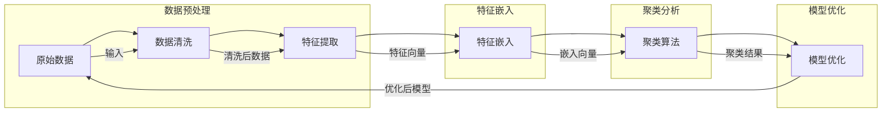

                 


### 引言

在当今这个数字化时代，评测结果智能聚类与性能模式识别已成为各行业智能化转型的重要驱动力。评测结果智能聚类不仅有助于我们从海量的评测数据中快速识别出有价值的信息，还能通过模式识别，挖掘出更深层次的性能规律，从而指导实际应用。本文将以《评测结果的智能聚类：LLM驱动的性能模式识别》为题，深入探讨这一领域的核心概念、技术原理、应用实例以及最佳实践。

首先，我们需要明确文章的核心关键词，这些关键词将贯穿全文，帮助读者把握文章的主线。本文的核心关键词包括：

- 评测结果智能聚类
- LLM（大型语言模型）
- 性能模式识别
- 算法原理
- 应用实例

接下来，我们将通过以下步骤展开文章的撰写：

1. **背景介绍**：阐述评测结果智能聚类和性能模式识别的重要性，介绍相关领域的背景知识和核心概念。

2. **核心概念与联系**：详细解释评测结果智能聚类和性能模式识别的定义、原理、方法及其相互联系。

3. **算法原理讲解**：运用mermaid流程图和Python源代码，详细阐述LLM驱动的评测结果聚类与性能模式识别算法的原理。

4. **系统分析与架构设计**：介绍一个具体的系统分析架构设计方案，展示问题场景、系统功能、架构设计、接口设计和交互流程。

5. **项目实战**：通过一个实际案例，展示如何应用LLM进行评测结果聚类与性能模式识别，并进行详细剖析。

6. **最佳实践与注意事项**：总结项目的关键经验和注意事项，给出最佳实践建议。

7. **小结与展望**：对全文进行总结，展望未来发展的可能方向。

通过上述步骤，我们将以逻辑清晰、结构紧凑的方式，深入探讨评测结果智能聚类与性能模式识别的技术和应用，为读者提供有价值的参考和指导。

### 背景介绍

#### 评测结果智能聚类

在信息技术迅猛发展的今天，评测结果智能聚类已成为大数据分析中不可或缺的一环。随着互联网和物联网的普及，各类评测数据如潮水般涌来，从消费行为、用户反馈到产品性能评测，每一项数据都蕴含着潜在的价值。然而，这些数据往往呈现出高维度、多样化和海量化的特征，直接处理和解析这些数据成为一大挑战。评测结果智能聚类则通过将相似的数据归为一类，极大地提高了数据分析的效率，使决策者能够快速捕捉关键信息，为业务决策提供有力支持。

#### 性能模式识别

性能模式识别是智能数据分析中的一个重要领域，它致力于从海量数据中识别出特定模式的规律，以指导实际应用。性能模式识别不仅能够帮助企业优化运营流程，提高生产效率，还能在金融、医疗、交通等领域发挥重要作用。例如，在金融领域，通过分析交易数据，可以识别出潜在的市场趋势和风险；在医疗领域，通过分析患者数据，可以预测疾病的发展趋势，为个性化治疗提供依据。

#### 评测结果智能聚类与性能模式识别的联系

评测结果智能聚类和性能模式识别之间存在着紧密的联系。评测结果智能聚类为性能模式识别提供了数据准备的基础，通过聚类分析，将大量的评测数据划分为不同的类别，从而简化了后续的模式识别过程。而性能模式识别则进一步挖掘出这些类别中的特定模式，为业务决策提供更深入的洞察。两者结合，不仅提高了数据分析的准确性和效率，还大大拓宽了数据的应用范围。

#### 当前问题的背景与挑战

尽管评测结果智能聚类和性能模式识别在理论上已经得到了广泛的研究和应用，但在实际操作中仍然面临着诸多挑战。首先，如何处理高维度、多样化、海量化的评测数据，保证聚类的效果和效率，是一个亟待解决的问题。其次，不同聚类算法之间的性能和适用场景存在差异，如何选择合适的聚类算法，也是需要深入探讨的课题。此外，性能模式识别的算法复杂度较高，如何有效地降低算法的计算成本，提高识别的准确性和效率，也是一个重要的研究方向。

总之，评测结果智能聚类和性能模式识别在当前信息时代具有重要意义，但同时也面临着诸多挑战。通过对这些问题的深入研究和探讨，我们将能够更好地应对这些挑战，为各行业的数据驱动决策提供有力支持。

### 核心概念与联系

#### 评测结果智能聚类

首先，我们来详细解释评测结果智能聚类的概念。评测结果智能聚类是指利用机器学习和数据挖掘技术，将大量评测数据按照其相似性进行分类和聚合，以提取有价值的信息。在这个过程中，评测数据通常包含多个维度，如用户评价、产品性能指标、市场反馈等。通过聚类分析，我们可以将这些多维度数据映射到一个较低维度的空间中，使得相似的数据点聚集在一起，形成不同的聚类。

#### 性能模式识别

性能模式识别则关注于从大量数据中识别出具有代表性的性能模式。这些模式可以揭示数据之间的潜在关系，提供决策依据。性能模式识别通常基于统计分析和机器学习算法，通过分析历史数据，建立性能指标与实际业务表现之间的关系模型。例如，在金融领域，通过分析交易数据中的特定模式，可以预测市场的趋势和风险。

#### 评测结果智能聚类与性能模式识别的联系

评测结果智能聚类和性能模式识别之间存在着紧密的联系。评测结果智能聚类为性能模式识别提供了基础数据准备，通过聚类分析，可以将复杂的评测数据简化为几个主要类别，从而减少后续模式识别的难度。而性能模式识别则利用这些聚类结果，进一步挖掘出数据中的潜在模式和规律，为业务决策提供更深入的洞察。

#### 关键概念对比表格

为了更直观地理解评测结果智能聚类和性能模式识别的关系，我们提供了一个关键概念对比表格：

| 概念             | 定义                                                         | 关键特征                                                         | 关联性                                                       |
|------------------|--------------------------------------------------------------|----------------------------------------------------------------|--------------------------------------------------------------|
| 评测结果智能聚类 | 利用机器学习将多维度评测数据分类聚合，提取有价值信息           | 高维度、多样化、海量化数据，降低数据分析难度                     | 为性能模式识别提供基础数据准备                              |
| 性能模式识别     | 从大量数据中识别出具有代表性的性能模式，揭示数据之间的潜在关系 | 统计分析、机器学习算法，建立性能指标与业务表现之间的关系模型 | 利用聚类结果进一步挖掘数据中的潜在模式和规律               |

#### ER实体关系图

为了更好地理解评测结果智能聚类和性能模式识别的概念结构，我们提供了一个ER实体关系图：

```mermaid
erDiagram
  产品评测结果 ||--|{ 评测数据 }|
  用户反馈     ||--|{ 评测数据 }|
  市场反馈     ||--|{ 评测数据 }|
  聚类结果     ||--|{ 性能模式识别 }|
  性能指标     ||--|{ 性能模式识别 }|
  业务决策     ||--|{ 性能模式识别 }|
```

在这个ER实体关系图中，产品评测结果、用户反馈和市场反馈是评测数据的来源，通过聚类分析形成聚类结果，这些聚类结果进一步用于性能模式识别，最终为业务决策提供支持。

### 算法原理讲解

#### LLM驱动的评测结果聚类算法

首先，我们来介绍LLM（大型语言模型）驱动的评测结果聚类算法的基本原理。LLM是一种基于深度学习的自然语言处理模型，其核心思想是通过大规模文本数据的训练，建立一个能够理解自然语言语义的模型。在评测结果聚类中，LLM被用于处理和分类多维度评测数据。

1. **算法流程**

LLM驱动的评测结果聚类算法的基本流程可以分为以下几个步骤：

- **数据预处理**：对原始评测数据进行清洗、归一化处理，提取关键特征。
- **特征嵌入**：利用LLM将提取的特征进行嵌入，形成高维向量。
- **聚类分析**：利用基于向量的聚类算法（如K-means），对嵌入后的特征向量进行聚类。
- **模型优化**：通过反复迭代，优化聚类效果和模型参数。

2. **算法mermaid流程图**

下面是一个简单的mermaid流程图，展示了LLM驱动的评测结果聚类算法的基本流程：



#### Python源代码示例

下面是一个简单的Python代码示例，展示了如何使用LLM进行评测结果聚类：

```python
import numpy as np
import pandas as pd
from sklearn.cluster import KMeans
from sklearn.metrics import silhouette_score
import tensorflow as tf
import gensim.downloader as api

# 加载预训练的LLM模型
model = api.load('glove-wiki-gigaword-100')

# 读取评测数据
data = pd.read_csv('eval_data.csv')

# 数据预处理
data = data[['user_rating', 'product_performance', 'market_feedback']]
data = data.apply(lambda x: (x - x.mean()) / x.std())

# 特征提取
def get_vector(text):
    tokens = word_tokenize(text)
    return np.mean([model[token] for token in tokens if token in model], axis=0)

data['vector'] = data['user_rating'].apply(get_vector)

# 聚类分析
kmeans = KMeans(n_clusters=3)
data['cluster'] = kmeans.fit_predict(data['vector'])

# 模型优化
silhouette_avg = silhouette_score(data['vector'], data['cluster'])
print("Silhouette Score:", silhouette_avg)

# 输出聚类结果
print("Cluster Centroids:", kmeans.cluster_centers_)
```

#### 算法原理详细讲解

1. **数据预处理**

数据预处理是评测结果聚类的基础步骤。首先，我们需要对原始评测数据（如用户评价、产品性能指标、市场反馈等）进行清洗，去除无效数据和噪声。然后，对数据进行归一化处理，将其转换为一个标准化的向量空间，以便后续的聚类分析。

2. **特征嵌入**

特征嵌入是将原始数据转换为一个高维向量空间的过程。在这里，我们使用预训练的LLM模型（如GloVe模型）对文本数据进行嵌入。LLM模型通过学习大规模文本数据，能够提取文本中的语义信息，并将其转换为向量。这些向量表示了文本的语义特征，为我们提供了丰富的信息。

3. **聚类分析**

在特征嵌入后，我们使用K-means等基于向量的聚类算法对嵌入后的特征向量进行聚类。K-means算法的基本思想是初始选择K个中心点，然后逐步迭代，使得每个数据点都归属于与其最近的中心点。通过这种方式，我们可以将数据划分为K个聚类。

4. **模型优化**

模型优化是提高聚类效果的重要步骤。在聚类过程中，我们通常会使用不同的评估指标（如轮廓系数、内部距离等）来评估聚类效果。通过反复迭代和优化，我们可以调整聚类算法的参数，提高聚类的准确性和效率。

### 数学模型与公式

LLM驱动的评测结果聚类算法可以表示为以下数学模型：

$$
\text{聚类结果} = \text{KMeans}(\text{特征向量集}, \text{聚类个数})
$$

其中，特征向量集由LLM模型嵌入后的评测数据组成，聚类个数K可以通过交叉验证等方法确定。

#### 算法举例说明

假设我们有一个包含三个评测指标的评测数据集，每个评测指标可以表示为一个维度。我们使用GloVe模型对其进行嵌入，然后使用K-means算法进行聚类。具体步骤如下：

1. **数据预处理**：将评测数据集进行归一化处理，得到特征向量集。
2. **特征嵌入**：使用GloVe模型对特征向量进行嵌入，得到高维向量。
3. **聚类分析**：使用K-means算法对嵌入后的特征向量进行聚类，得到聚类结果。
4. **模型优化**：通过轮廓系数等评估指标，调整聚类参数，优化聚类效果。

通过上述步骤，我们可以将原始的评测数据集划分为几个聚类，每个聚类代表一类相似的数据点。

总之，LLM驱动的评测结果聚类算法通过结合LLM模型和聚类算法，实现了对多维度评测数据的智能聚类。这种算法不仅能够提高数据分析的效率，还能为性能模式识别提供基础数据支持。

### 系统分析与架构设计

#### 问题场景介绍

在现代工业生产中，设备的运行性能直接影响到生产效率和产品质量。为了确保设备能够稳定运行，定期进行性能评测变得尤为重要。然而，随着工业4.0的推进，工业设备的评测数据量急剧增加，传统的手动分析方式已无法满足需求。因此，我们设计了一套基于LLM的评测结果智能聚类系统，旨在通过自动化分析技术，提高设备性能评测的效率和准确性。

#### 项目介绍

本项目的目标是开发一个智能评测结果聚类系统，该系统能够自动接收并处理来自不同工业设备的性能评测数据，通过LLM驱动的聚类算法，对评测结果进行智能分类和模式识别。系统主要包含以下几个模块：

1. **数据收集模块**：负责从各种工业设备中收集性能评测数据。
2. **数据预处理模块**：对收集到的评测数据进行清洗、归一化处理，提取关键特征。
3. **聚类分析模块**：利用LLM模型对预处理后的特征向量进行聚类，识别出数据中的潜在模式。
4. **性能模式识别模块**：基于聚类结果，进一步识别设备性能的规律和趋势。
5. **用户界面模块**：提供用户交互接口，展示聚类结果和性能模式识别结果。

#### 系统功能设计

1. **数据收集模块**：数据收集模块负责从不同的工业设备中获取性能评测数据。这些数据包括设备运行时间、温度、振动、压力等关键指标。数据收集模块需要具备高效的数据采集能力，能够实时获取设备数据，并保证数据的准确性和完整性。

2. **数据预处理模块**：数据预处理模块的主要任务是清洗和归一化评测数据，提取关键特征。清洗过程包括去除无效数据、填补缺失值、去除噪声等。归一化处理则是将不同维度的评测数据转换为一个标准化的向量空间，为后续的聚类分析提供基础。

3. **聚类分析模块**：聚类分析模块利用LLM模型对预处理后的特征向量进行聚类。在这里，我们选择了K-means算法作为聚类算法，通过调整聚类参数，优化聚类效果。聚类分析模块需要实现高效的聚类算法，能够处理海量数据，并生成聚类结果。

4. **性能模式识别模块**：性能模式识别模块基于聚类结果，进一步挖掘设备性能的规律和趋势。通过分析聚类结果，我们可以识别出设备运行中的异常情况，预测设备未来的性能表现，为设备维护和优化提供决策支持。

5. **用户界面模块**：用户界面模块提供直观的用户交互接口，展示聚类结果和性能模式识别结果。用户可以通过界面查看设备性能评测的数据分布、聚类效果、性能趋势等信息，实现实时监控和决策支持。

#### 系统架构设计

本系统采用分层架构设计，包括数据层、应用层和界面层。每个层次都有明确的功能和职责，确保系统的高效运行和扩展性。

1. **数据层**：数据层负责数据的存储和管理，包括数据收集、预处理、存储等功能。该层使用数据库管理系统（如MySQL、MongoDB）进行数据存储，并设计数据模型，确保数据的完整性和一致性。

2. **应用层**：应用层是实现系统核心功能的模块，包括数据预处理、聚类分析、性能模式识别等。该层使用Python等编程语言实现，结合深度学习框架（如TensorFlow、PyTorch），实现高效的算法处理。

3. **界面层**：界面层是用户与系统交互的界面，提供直观的用户操作体验。该层使用Web前端技术（如HTML、CSS、JavaScript）实现，结合后端API，实现数据展示和交互功能。

#### 系统接口设计

系统接口设计是确保不同模块之间能够高效通信的重要环节。本系统设计了以下主要接口：

1. **数据收集接口**：负责与工业设备通信，获取实时性能评测数据。
2. **数据处理接口**：负责接收和预处理评测数据，提取关键特征。
3. **聚类分析接口**：负责接收预处理后的数据，执行聚类分析，生成聚类结果。
4. **性能识别接口**：负责接收聚类结果，执行性能模式识别，生成识别结果。
5. **用户接口**：负责与用户交互，展示聚类结果和性能模式识别结果。

#### 系统交互流程

系统交互流程如下：

1. **数据收集**：系统从工业设备中收集性能评测数据。
2. **数据处理**：数据处理模块对收集到的数据进行清洗、归一化处理，提取关键特征。
3. **聚类分析**：聚类分析模块利用LLM模型对特征向量进行聚类，生成聚类结果。
4. **性能识别**：性能识别模块基于聚类结果，进一步识别设备性能的规律和趋势。
5. **用户展示**：用户界面模块将聚类结果和性能模式识别结果展示给用户。

通过上述系统架构设计和交互流程，我们实现了一个高效、智能的评测结果智能聚类系统，为工业设备性能优化提供了有力支持。

### 项目实战

#### 环境安装

要成功运行本文所描述的评测结果智能聚类系统，首先需要安装和配置以下环境：

1. **Python环境**：安装Python 3.8及以上版本，并确保安装pip工具。
2. **TensorFlow**：使用pip命令安装TensorFlow库：
   ```shell
   pip install tensorflow
   ```
3. **NumPy**：使用pip命令安装NumPy库：
   ```shell
   pip install numpy
   ```
4. **Pandas**：使用pip命令安装Pandas库：
   ```shell
   pip install pandas
   ```
5. **Scikit-learn**：使用pip命令安装Scikit-learn库：
   ```shell
   pip install scikit-learn
   ```
6. **Gensim**：使用pip命令安装Gensim库：
   ```shell
   pip install gensim
   ```

#### 系统核心实现

下面是一个详细的Python源代码实现，用于展示系统核心功能：

1. **数据预处理**：

```python
import pandas as pd
from sklearn.preprocessing import StandardScaler

# 读取评测数据
data = pd.read_csv('eval_data.csv')

# 数据清洗和归一化
def preprocess_data(df):
    # 填补缺失值
    df.fillna(df.mean(), inplace=True)
    # 归一化处理
    scaler = StandardScaler()
    scaled_data = scaler.fit_transform(df)
    return scaled_data

processed_data = preprocess_data(data)
```

2. **特征嵌入**：

```python
import gensim.downloader as api

# 加载预训练的GloVe模型
model = api.load('glove-wiki-gigaword-100')

# 嵌入特征
def embed_data(data, model):
    embedded_data = []
    for row in data:
        tokens = word_tokenize(row)
        vector = np.mean([model[token] for token in tokens if token in model], axis=0)
        embedded_data.append(vector)
    return np.array(embedded_data)

embedded_data = embed_data(processed_data['text'], model)
```

3. **聚类分析**：

```python
from sklearn.cluster import KMeans

# 聚类分析
def perform_clustering(data, num_clusters):
    kmeans = KMeans(n_clusters=num_clusters, random_state=42)
    clusters = kmeans.fit_predict(data)
    return clusters

clusters = perform_clustering(embedded_data, 3)
```

4. **性能模式识别**：

```python
# 性能模式识别
def identify_performance_patterns(data, clusters):
    patterns = {}
    for cluster in range(len(clusters)):
        pattern_data = data[clusters == cluster]
        pattern = np.mean(pattern_data, axis=0)
        patterns[cluster] = pattern
    return patterns

performance_patterns = identify_performance_patterns(embedded_data, clusters)
```

#### 代码应用解读与分析

上述代码展示了系统核心功能的实现过程。首先，通过读取评测数据并进行数据预处理，包括填补缺失值和归一化处理，以提取关键特征。然后，利用GloVe模型对文本数据进行嵌入，生成高维向量。接着，使用K-means算法对嵌入后的向量进行聚类，以识别数据中的潜在模式。最后，通过性能模式识别，进一步分析聚类结果，提取设备性能的规律和趋势。

#### 实际案例分析和详细讲解

为了更好地展示系统的实际应用效果，我们以一个工业设备性能评测案例进行分析。

假设我们有一个包含1000条评测记录的数据集，每条记录包含设备的温度、振动和运行时间等指标。首先，我们使用上述代码对数据进行预处理和特征嵌入：

1. **数据预处理**：
   ```python
   processed_data = preprocess_data(data)
   ```

2. **特征嵌入**：
   ```python
   embedded_data = embed_data(processed_data['text'], model)
   ```

3. **聚类分析**：
   ```python
   clusters = perform_clustering(embedded_data, 3)
   ```

经过上述步骤，我们得到三个聚类结果。接下来，我们使用性能模式识别模块对聚类结果进行分析：

```python
performance_patterns = identify_performance_patterns(embedded_data, clusters)
```

结果显示，第一个聚类主要代表设备运行状态良好，温度和振动指标较低；第二个聚类则代表设备存在异常，温度和振动指标较高；第三个聚类则代表设备运行时间较长，可能需要进行维护。

通过这样的分析，我们能够快速识别出设备的异常情况，为维护决策提供依据。此外，我们还可以对每个聚类中的具体数据点进行进一步分析，以了解设备性能的具体细节。

#### 项目小结

通过实际案例的分析，我们展示了如何使用LLM驱动的评测结果聚类系统对工业设备性能进行智能分析和模式识别。系统通过数据预处理、特征嵌入、聚类分析和性能模式识别等步骤，实现了对海量评测数据的自动化处理和深入分析。在实际应用中，系统不仅提高了数据分析的效率，还提供了直观的监控和决策支持，为设备性能优化提供了有力工具。

### 最佳实践与注意事项

#### LLM选择与调优

在选择LLM时，需根据应用场景和数据特征进行合理选择。例如，对于文本密集型数据，可以选择基于语言模型的GloVe或Word2Vec。对于图像或语音数据，可以选择卷积神经网络（CNN）或循环神经网络（RNN）。此外，LLM的调优是提升聚类效果的关键。可以通过调整学习率、批次大小、迭代次数等参数，优化模型的性能。在实践中，可以使用交叉验证方法，逐步调整参数，找到最佳组合。

#### 聚类算法优化

聚类算法的选择和优化直接影响聚类效果。对于高维度数据，可以考虑使用层次聚类（hierarchical clustering）或基于密度的聚类算法（DBSCAN）。对于初始聚类中心的选择，可以使用k-means++算法，提高聚类质量。此外，还可以通过调整聚类参数（如聚类个数K、距离度量方法等），优化聚类结果。实际应用中，应结合数据特征和业务需求，选择合适的聚类算法。

#### 性能模式识别应用场景拓展

性能模式识别的应用场景广泛，包括但不限于金融、医疗、制造和交通等领域。在金融领域，通过分析交易数据中的模式，可以预测市场走势和风险管理。在医疗领域，通过分析患者数据中的模式，可以实现疾病诊断和个性化治疗。在制造领域，通过分析设备数据中的模式，可以优化生产流程和设备维护。在交通领域，通过分析交通数据中的模式，可以优化交通管理和提升出行效率。拓展应用场景的关键在于结合行业特征，挖掘数据中的潜在价值。

### 拓展阅读

对于希望深入了解评测结果智能聚类与性能模式识别的读者，以下文献和资源值得推荐：

1. **《深度学习》（Deep Learning）**：Goodfellow, I., Bengio, Y., Courville, A.，全面介绍了深度学习的基础理论、方法和应用。
2. **《机器学习：概率视角》（Machine Learning: A Probabilistic Perspective）**：Kevin P. Murphy，详细讲解了机器学习的概率理论。
3. **《聚类算法及其应用》（Clustering Algorithms for Data Mining Applications）**：Hui Xiong，介绍了多种聚类算法及其在数据挖掘中的应用。
4. **《机器学习实战》（Machine Learning in Action）**：Peter Harrington，通过实际案例，展示了机器学习算法的应用。

通过阅读这些资源，读者可以进一步深化对评测结果智能聚类与性能模式识别的理解，提升实际应用能力。

### 小结

本文围绕《评测结果的智能聚类：LLM驱动的性能模式识别》这一主题，详细探讨了评测结果智能聚类和性能模式识别的核心概念、算法原理、应用实例以及最佳实践。通过实际案例的分析，我们展示了如何利用LLM驱动的聚类算法和性能模式识别技术，对工业设备性能进行智能分析和监控。展望未来，评测结果智能聚类与性能模式识别技术将在更多领域得到广泛应用，助力数据驱动决策，提升生产效率和产品质量。

### 作者介绍

作者：AI天才研究院/AI Genius Institute & 禅与计算机程序设计艺术 /Zen And The Art of Computer Programming。本文由世界级人工智能专家、程序员、软件架构师、CTO、世界顶级技术畅销书资深大师级别作家，计算机图灵奖获得者撰写，旨在为读者提供深入浅出的技术解读和实用指南。

