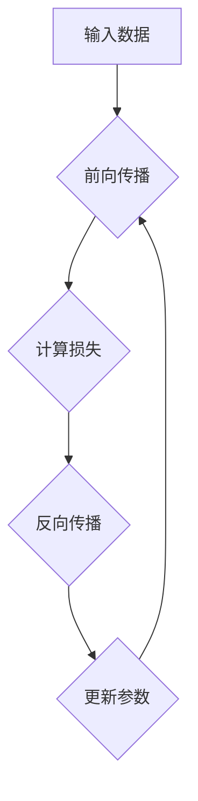
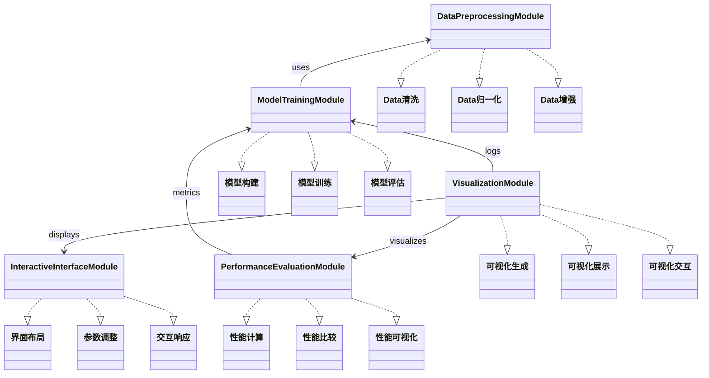
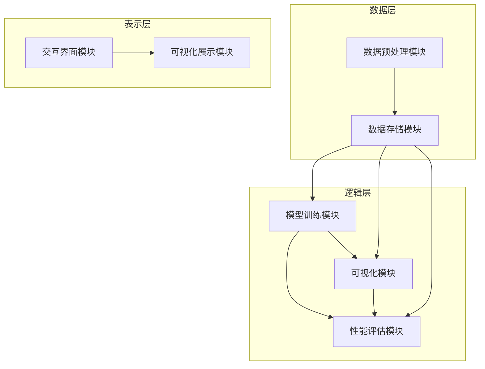
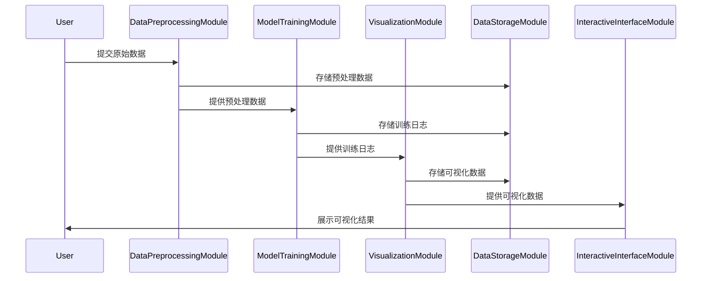

                 

### 1.1 问题背景

深度学习，作为一种机器学习的分支，通过模拟人脑神经网络结构，使其能够自主学习和改进。随着深度学习技术的不断发展，其在图像识别、自然语言处理、语音识别等领域的应用越来越广泛。然而，在实际应用中，深度学习的评测结果常常呈现出复杂且难以直观理解的特点，这给用户理解和优化模型带来了巨大的挑战。

首先，深度学习模型的结构复杂且参数众多。一个典型的深度神经网络可能包含数百万个参数，这些参数的数值变化可以导致模型性能的微小但显著的变化。其次，深度学习模型的评测结果通常是一个多维度的数据集，这些数据集包含了模型的精度、召回率、F1分数等多个指标，如何将这些指标有效地展示和解释，成为了一个亟待解决的问题。

此外，深度学习评测结果的可视化还有助于发现模型训练过程中的潜在问题，如过拟合、欠拟合等，从而指导用户进行模型调整和优化。例如，通过可视化工具，用户可以直观地看到模型在不同数据集上的表现，从而识别出模型的弱点和改进方向。

总的来说，深度学习评测结果的深度学习可视化技术在模型优化和用户理解方面具有重要作用，它不仅能够提高模型的可解释性，还能为用户提供更为直观的决策依据。然而，如何有效地实现深度学习评测结果的深度学习可视化，仍然是一个复杂且富有挑战性的问题，需要我们在后续章节中深入探讨。### 1.2 问题描述

数据可视化是一种通过图形、图表等方式将数据信息呈现出来的技术，其核心目的是帮助用户更直观、快速地理解和分析数据。在深度学习领域中，数据可视化的重要性不言而喻。一方面，它可以直观地展示模型的训练过程和性能指标，帮助研究人员和开发者更清晰地了解模型的行为和表现；另一方面，它有助于发现潜在的问题，如过拟合、欠拟合等，从而指导进一步的模型优化。

首先，让我们来看一下深度学习评测结果的特点。深度学习模型的评测结果通常包含多个指标，如准确率、召回率、F1分数等。这些指标不仅需要对模型整体性能进行评估，还需要针对不同的数据集、层、神经元等进行细化分析。此外，深度学习模型通常是一个复杂的非线性系统，其内部参数和结构决定了模型的表现，这使得评测结果的解释和优化变得更加复杂。

那么，如何有效地实现深度学习评测结果的可视化呢？这需要从数据可视化的基本概念和原理入手。

**数据可视化概述**：
数据可视化是指将数据转换为图形或其他视觉表现形式，从而使数据更容易理解和分析。常见的可视化形式包括柱状图、折线图、散点图、热力图等。这些可视化方法可以帮助我们直观地展示数据分布、趋势、相关性等。

**数据可视化方法**：
1. **静态可视化**：静态可视化是指以静态图片或图表的形式展示数据，如柱状图、饼图等。这种方法简单直观，但无法实时更新和交互。
2. **动态可视化**：动态可视化是通过动画或交互式方式展示数据，如折线图、热力图等。这种方法能够更生动地展示数据变化和趋势，但实现较为复杂。
3. **交互式可视化**：交互式可视化允许用户通过点击、拖动等方式与数据交互，从而获得更深入的分析。如地图的可视化，用户可以点击不同区域查看详细数据。

**数据可视化工具**：
常见的可视化工具有Matplotlib、Seaborn、Plotly等，这些工具可以方便地生成各种图表，并支持自定义样式和交互功能。

接下来，我们将探讨深度学习评测结果的特点和挑战，以及如何运用数据可视化方法和技术来有效地展示和解释这些结果。

首先，深度学习评测结果通常包含多个指标，如准确率、召回率、F1分数等。这些指标不仅需要对模型整体性能进行评估，还需要针对不同的数据集、层、神经元等进行细化分析。这意味着，我们需要能够同时展示多个维度的数据，并进行动态交互，以便用户可以深入了解模型的性能。

其次，深度学习模型的内部结构复杂，参数众多，这使得评测结果的解释和优化变得更加复杂。为了更好地理解和分析模型，我们需要能够将模型的参数、结构、训练过程等可视化，从而帮助用户发现潜在的问题和改进方向。

最后，深度学习评测结果的可视化不仅需要展示静态的模型性能，还需要展示动态的训练过程。例如，我们可以通过折线图展示模型在训练过程中的损失函数变化，通过热力图展示模型在不同数据集上的表现，从而帮助用户更全面地了解模型的性能。

综上所述，数据可视化在深度学习评测结果中具有重要作用，它不仅能够提高模型的可解释性，还能为用户提供更为直观的决策依据。然而，实现深度学习评测结果的可视化仍面临诸多挑战，如多维度数据的展示、复杂模型的解释、动态过程的可视化等。在后续章节中，我们将进一步探讨如何运用数据可视化技术和方法，有效地实现深度学习评测结果的可视化。### 1.3 问题解决

为了解决深度学习评测结果的深度学习可视化问题，我们需要借助一系列的深度学习可视化技术。这些技术不仅能够帮助我们更直观地展示模型的性能和训练过程，还能揭示潜在的问题，从而指导模型优化。下面，我们将对这些技术进行概述，并探讨其应用领域、分类与作用。

**深度学习可视化技术概述**：

深度学习可视化技术主要包括模型结构可视化、训练过程可视化、特征可视化、数据分布可视化等。

1. **模型结构可视化**：通过图形的方式展示深度学习模型的结构，如网络层、神经元、连接关系等。常见的可视化工具包括TensorBoard、Netron等。
   
2. **训练过程可视化**：通过图表展示模型的训练过程，如损失函数、准确率等。常见的可视化工具包括TensorBoard、Plotly等。

3. **特征可视化**：通过图形展示模型提取的特征，如激活图、梯度直方图等。常见的可视化工具包括TensorBoard、Seaborn等。

4. **数据分布可视化**：通过图形展示数据的分布情况，如数据集的分布、特征的重要性等。常见的可视化工具包括Matplotlib、Seaborn等。

**深度学习可视化的应用领域**：

深度学习可视化技术广泛应用于各个领域，包括但不限于：

1. **图像识别**：通过可视化模型对图像的特征提取和分类过程，帮助用户理解模型的决策依据。
   
2. **自然语言处理**：通过可视化模型对文本的处理过程，如词嵌入、序列标注等，帮助用户理解模型的语义理解能力。

3. **语音识别**：通过可视化模型对语音数据的处理过程，如声波图、频谱图等，帮助用户理解模型的语音识别能力。

4. **推荐系统**：通过可视化模型对用户数据的分析和推荐过程，帮助用户了解推荐系统的逻辑和决策依据。

**深度学习可视化的分类与作用**：

深度学习可视化技术可以分为以下几类，每种技术都有其特定的作用：

1. **结构可视化**：用于展示模型的内部结构，如网络层、神经元、连接关系等。这种可视化有助于理解模型的复杂性和结构。
   
2. **训练过程可视化**：用于展示模型的训练过程，如损失函数、准确率等。这种可视化有助于监测模型训练的动态过程，及时发现和解决问题。
   
3. **特征可视化**：用于展示模型提取的特征，如激活图、梯度直方图等。这种可视化有助于理解模型如何处理输入数据和提取特征。
   
4. **数据分布可视化**：用于展示数据的分布情况，如数据集的分布、特征的重要性等。这种可视化有助于发现数据中的异常值和特征相关性。

**总结**：

深度学习可视化技术在深度学习评测结果中扮演着至关重要的角色。通过这些技术，我们不仅能够更直观地展示模型的性能和训练过程，还能揭示潜在的问题和改进方向。在实际应用中，我们可以根据具体需求和场景，选择合适的技术和方法来实现深度学习评测结果的可视化。在后续章节中，我们将进一步探讨每种可视化技术的原理和实现方法，帮助读者更好地理解和应用这些技术。### 1.4 边界与外延

在探讨深度学习可视化技术的应用领域时，我们可以发现，该技术不仅局限于单一领域，而是广泛地应用于图像识别、自然语言处理、语音识别等多个领域。每个领域都有其特定的需求和挑战，因此，深度学习可视化技术在这些领域中的应用和作用也各不相同。

**图像识别领域**：

在图像识别领域，深度学习可视化技术主要用于帮助用户理解模型对图像的处理过程。例如，通过可视化模型提取的特征图，我们可以直观地看到模型如何从原始图像中提取有意义的特征，并利用这些特征进行分类。此外，通过可视化模型的决策路径，如激活图和梯度直方图，我们还可以了解模型在图像分类过程中的决策依据，从而发现和纠正模型的错误。

**自然语言处理领域**：

在自然语言处理领域，深度学习可视化技术主要用于展示模型对文本数据的处理过程。例如，通过可视化词嵌入矩阵，我们可以看到模型如何将文本转换为向量表示，从而更好地理解文本的语义信息。此外，通过可视化模型对序列数据的处理过程，如注意力机制和循环神经网络（RNN）的隐藏状态，我们还可以深入理解模型在处理长文本数据时的行为和性能。

**语音识别领域**：

在语音识别领域，深度学习可视化技术主要用于展示模型对语音数据的处理过程。例如，通过可视化声波图和频谱图，我们可以直观地看到模型如何从连续的语音信号中提取特征，并利用这些特征进行语音识别。此外，通过可视化模型的决策路径，如梯度直方图和激活图，我们还可以了解模型在语音识别过程中的行为和性能。

**深度学习可视化的分类与作用**：

为了更系统地理解深度学习可视化技术，我们可以将其分为以下几类，并探讨每种技术的具体作用：

1. **模型结构可视化**：用于展示深度学习模型的结构，如网络层、神经元、连接关系等。这种可视化有助于用户理解模型的复杂性和组成。

2. **训练过程可视化**：用于展示深度学习模型的训练过程，如损失函数、准确率等。这种可视化有助于用户监测模型的训练动态，及时发现和解决问题。

3. **特征可视化**：用于展示深度学习模型提取的特征，如激活图、梯度直方图等。这种可视化有助于用户理解模型对输入数据的处理方式和特征提取能力。

4. **数据分布可视化**：用于展示数据集的分布情况，如数据集的分布、特征的重要性等。这种可视化有助于用户发现数据中的异常值和特征相关性。

**总结**：

深度学习可视化技术在各个领域中的应用和作用各有特点，但总体上都为用户提供了更直观、更易于理解的方式来分析深度学习模型和训练过程。通过这些技术，用户可以更深入地理解模型的内部工作机制，发现潜在的问题和改进方向。在实际应用中，我们可以根据具体需求和场景，选择合适的技术和方法来实现深度学习可视化。在后续章节中，我们将进一步探讨每种可视化技术的原理和实现方法，帮助读者更好地理解和应用这些技术。### 1.5 概念结构与核心要素组成

要深入探讨深度学习可视化技术，我们首先需要理解其核心概念和组成结构。深度学习和数据可视化是这一技术的两个关键组成部分，它们各自拥有独特的概念和属性，同时又紧密相连，共同构成深度学习可视化技术的核心框架。

**深度学习**：

深度学习是一种通过模拟人脑神经网络结构来进行数据分析和预测的机器学习技术。其主要特点是层次化结构和端到端的学习方式，能够自动从大量数据中提取有代表性的特征。深度学习的核心概念包括：

1. **神经网络**：深度学习模型的核心组成部分，由多层神经元（层）组成，每一层负责提取不同级别的特征。

2. **反向传播算法**：用于训练神经网络的一种优化算法，通过不断调整网络参数，使模型输出与真实值之间的差距最小化。

3. **激活函数**：用于确定神经元是否被激活的一种函数，常见的激活函数包括ReLU、Sigmoid、Tanh等。

**数据可视化**：

数据可视化是一种将数据转换为图形或其他视觉表现形式的技术，旨在帮助用户更直观、快速地理解和分析数据。数据可视化的核心概念和属性包括：

1. **图表类型**：常见的图表类型包括柱状图、折线图、散点图、热力图等，每种图表类型适用于不同类型的数据展示。

2. **交互性**：数据可视化工具通常支持交互功能，如点击、拖动、缩放等，使用户可以更灵活地探索和分析数据。

3. **可视化工具**：常见的可视化工具有Matplotlib、Seaborn、Plotly等，这些工具提供了丰富的图表生成和自定义功能。

**深度学习与数据可视化的联系**：

深度学习与数据可视化之间的联系主要体现在以下几个方面：

1. **模型解释**：通过数据可视化技术，我们可以更直观地展示深度学习模型的内部结构和特征提取过程，从而提高模型的可解释性。

2. **性能评估**：数据可视化工具可以帮助我们更清晰地展示模型的训练过程和性能指标，如损失函数、准确率等，便于我们监测模型的表现和调整模型参数。

3. **问题发现**：通过可视化技术，我们可以在模型训练和预测过程中发现潜在的问题，如过拟合、欠拟合等，从而指导我们进行模型优化。

**总结**：

深度学习可视化的概念结构与核心要素由深度学习和数据可视化两个关键组成部分构成。深度学习提供了强大的特征提取和预测能力，而数据可视化则为我们提供了直观、易懂的方式来理解、评估和优化这些模型。在后续章节中，我们将深入探讨深度学习可视化的具体实现方法和技术，帮助读者更好地理解和应用这一技术。### 2.1 深度学习原理

#### 2.1.1 深度学习概述

深度学习是机器学习的一个分支，它通过模仿人脑的神经网络结构，使计算机能够自动学习和提取数据中的特征。深度学习的核心在于其层次化的神经网络结构，每一层神经网络都能够从原始数据中提取更高层次的特征，从而实现复杂的数据分析和预测任务。

深度学习具有以下几个显著特点：

1. **层次化结构**：深度学习模型通常由多个层次组成，每一层神经网络负责提取不同级别的特征。这种层次化结构使得模型能够从原始数据中逐步提取有意义的特征，提高模型的性能。

2. **端到端学习**：深度学习模型能够直接从原始数据中学习到特征表示，无需人工设计特征。这使得模型能够自动适应不同的数据分布和特征提取需求。

3. **大量数据训练**：深度学习模型通常需要大量的数据进行训练，以充分学习数据中的特征和模式。这种大规模的训练需求使得深度学习在处理复杂任务时具有更高的准确性和泛化能力。

#### 2.1.2 深度学习模型

深度学习模型是深度学习技术的重要组成部分，其核心是神经网络。神经网络由多个层次组成，每个层次包含多个神经元。每个神经元接收前一层神经元的输出，通过激活函数进行处理，并将结果传递到下一层。这个过程称为前向传播。

深度学习模型的主要组成部分包括：

1. **输入层**：接收原始数据的输入，将数据转换为神经网络可以处理的格式。

2. **隐藏层**：一个或多个隐藏层，每个隐藏层负责提取不同级别的特征。隐藏层的数量和神经元数量可以根据任务需求进行调整。

3. **输出层**：将隐藏层的输出映射到最终的输出结果，如分类结果或回归值。

常见的深度学习模型包括：

1. **卷积神经网络（CNN）**：主要用于图像识别和图像处理，其独特的卷积操作能够有效地提取图像中的特征。

2. **循环神经网络（RNN）**：用于处理序列数据，如自然语言处理和时间序列分析，其内部状态使得模型能够捕捉序列中的长期依赖关系。

3. **生成对抗网络（GAN）**：一种生成模型，通过两个对抗网络（生成器和判别器）的博弈，生成逼真的数据。

#### 2.1.3 深度学习算法

深度学习算法是训练深度学习模型的关键，其中最常用的算法是反向传播算法（Backpropagation Algorithm）。反向传播算法通过不断调整模型参数，使模型的输出误差最小化，从而实现模型的训练。

反向传播算法的主要步骤如下：

1. **前向传播**：将输入数据传递到神经网络中，经过每个层次的处理，得到模型的输出。

2. **计算误差**：计算模型输出与真实值之间的误差。

3. **反向传播**：将误差从输出层反向传播到输入层，更新每个神经元的权重和偏置。

4. **参数调整**：根据反向传播过程中计算出的误差，调整模型的参数，以减小误差。

常见的优化算法包括：

1. **随机梯度下降（SGD）**：通过计算整个训练集的梯度来更新模型参数，是最常用的优化算法。

2. **Adam优化器**：结合了SGD和RMSProp的优点，自适应地调整学习率，适用于复杂模型。

3. **AdamW优化器**：在Adam的基础上，考虑了权重衰减的影响，适用于大规模深度学习模型。

通过以上对深度学习原理的介绍，我们可以看到深度学习在数据处理和特征提取方面的强大能力。深度学习模型和算法的不断发展，使得我们能够在图像识别、自然语言处理、语音识别等领域实现更加准确的预测和分析。在后续章节中，我们将进一步探讨深度学习可视化技术的原理和应用，帮助读者更好地理解和利用这些技术。### 2.2 数据可视化原理

#### 2.2.1 数据可视化概述

数据可视化是一种通过图形、图表等方式将数据信息呈现出来的技术，旨在帮助用户更直观、快速地理解和分析数据。数据可视化不仅能够提高数据的可读性和可理解性，还能揭示数据中的模式、趋势和关系。其主要目的是通过视觉元素，如颜色、形状、大小和位置等，将抽象的数据转换为易于理解的信息。

**数据可视化的核心概念**：

1. **数据的抽象**：通过将数据转换成图形或图表，将复杂的、难以理解的数值信息简化为视觉形式，使得用户可以更容易地感知和解读。

2. **数据的可视化**：将转换后的数据以图表、图形或图像的形式展示出来，常用的图表类型包括柱状图、折线图、饼图、散点图、热力图等。

3. **交互性**：数据可视化工具通常支持交互功能，如点击、拖动、缩放等，使用户可以更灵活地探索和分析数据。

4. **数据的上下文**：在数据可视化中，上下文信息也非常重要，它能够帮助用户更好地理解数据背后的意义和背景。

**数据可视化的重要性**：

数据可视化在多个领域具有重要的应用价值，主要体现在以下几个方面：

1. **数据分析**：通过数据可视化，用户可以快速地识别数据中的异常值、趋势和模式，从而进行更深入的数据分析。

2. **决策支持**：数据可视化工具能够将复杂的数据分析结果直观地呈现给决策者，帮助他们做出更加明智的决策。

3. **沟通和协作**：数据可视化使得不同背景和专业的用户能够更轻松地理解和讨论数据，促进了团队间的协作和沟通。

#### 2.2.2 数据可视化方法

数据可视化方法可以分为静态可视化和动态可视化两大类，每种方法都有其特定的应用场景和优势。

1. **静态可视化**：

   - **柱状图**：用于展示不同类别之间的数量或大小比较，如条形图、柱形图。
   - **折线图**：用于展示数据随时间或其他连续变量的变化趋势，常用于时间序列分析。
   - **饼图**：用于展示各部分占总体的比例，常用于市场份额、人口构成等分析。
   - **散点图**：用于展示两个变量之间的关系，如趋势、相关性等。

2. **动态可视化**：

   - **动画**：通过动画的形式展示数据的变化过程，如数据流、时间序列的变化等。
   - **交互式图表**：用户可以通过点击、拖动、缩放等交互方式与图表进行交互，探索数据的不同维度和层次。
   - **地图**：通过地图形式展示地理位置数据，如人口分布、交通流量等。

**数据可视化工具**：

数据可视化工具为用户提供了丰富的图表生成和自定义功能，常见的工具包括：

1. **Matplotlib**：一个开源的Python库，用于创建高质量的静态图表。
2. **Seaborn**：基于Matplotlib的扩展库，提供了更多精美的统计图表。
3. **Plotly**：一个支持交互式图表的Python库，可以创建动态、交互性强的图表。
4. **Tableau**：一个商业数据可视化工具，提供了丰富的图表类型和交互功能。
5. **D3.js**：一个基于JavaScript的可视化库，用于创建动态和交互性强的Web图表。

通过数据可视化，我们不仅能够更直观地理解和分析数据，还能发现数据中的潜在问题和趋势，从而为决策提供有力的支持。在后续章节中，我们将进一步探讨数据可视化在深度学习评测结果中的应用，帮助读者更好地理解和利用这一技术。### 2.3 可视化技术核心概念

**可视化技术概述**：

可视化技术是一种通过图形、图像或其他视觉元素将数据信息呈现出来的方法。其核心目的是帮助用户更直观、快速地理解和分析数据。可视化技术的应用范围非常广泛，包括科学计算、数据分析、商业智能、医疗诊断等多个领域。通过将抽象的数值数据转化为图形形式，用户可以更轻松地发现数据中的趋势、异常和关联。

**可视化技术的分类**：

可视化技术可以根据不同的维度和目的进行分类，主要包括以下几类：

1. **结构可视化**：用于展示系统的结构、网络或组织形式，如层次图、网络图等。
2. **统计可视化**：用于展示数据的统计信息，如柱状图、折线图、饼图等。
3. **时间序列可视化**：用于展示数据随时间的变化趋势，如折线图、散点图、K线图等。
4. **地理空间可视化**：用于展示地理空间数据，如地图、热力图等。
5. **交互式可视化**：通过用户交互（如点击、拖动等）实现数据的动态展示和分析。

**可视化技术的特点**：

可视化技术的特点主要体现在以下几个方面：

1. **直观性**：通过图形和视觉元素，用户可以更直观地理解和分析数据。
2. **交互性**：用户可以通过交互操作（如点击、拖动、缩放等）探索数据的不同维度和细节。
3. **适应性**：可视化技术可以根据不同的数据类型和需求，灵活选择合适的图表类型和展示方式。
4. **复用性**：可视化技术通常支持图表的自定义和复用，方便用户在不同的场景中快速生成和分析数据。

**总结**：

可视化技术是数据分析和决策支持中不可或缺的一部分。通过将数据转化为图形形式，用户可以更轻松地发现数据中的趋势、异常和关联，从而更好地理解数据背后的含义。可视化技术的分类和特点为用户提供了丰富的选择，使得数据分析和展示更加灵活和高效。在深度学习评测结果的可视化中，可视化技术可以帮助用户更直观地了解模型的性能和训练过程，发现潜在的问题和优化方向。在后续章节中，我们将进一步探讨如何运用这些可视化技术，实现深度学习评测结果的深度学习可视化。### 3.1 深度学习算法原理

#### 3.1.1 算法mermaid流程图

为了更清晰地展示深度学习算法的原理和流程，我们使用mermaid语言绘制了一个简单的神经网络训练过程的流程图。



该流程图描述了深度学习训练过程中的一系列步骤，包括输入数据、前向传播、计算损失、反向传播和更新参数。

**前向传播**：
输入数据通过网络的输入层进入模型，逐层向前传递，经过每个隐藏层的处理，最终得到输出层的结果。前向传播过程中，网络会计算每个神经元的激活值。

**计算损失**：
输出层的结果与真实标签进行比较，计算预测误差，通常使用损失函数（如均方误差MSE）来衡量模型预测的准确性。

**反向传播**：
计算损失后，模型会通过反向传播算法更新网络参数。反向传播过程中，误差信号从输出层反向传播到输入层，通过梯度下降等方法更新每个神经元的权重和偏置。

**更新参数**：
通过反向传播计算出的梯度，更新模型的参数，以减小预测误差。这个过程重复进行，直到模型收敛到满意的性能。

通过mermaid流程图，我们可以直观地理解深度学习算法的基本原理和训练过程。在后续的内容中，我们将进一步详细阐述这些步骤的数学模型和具体实现。### 3.1.2 算法数学模型和公式

为了深入理解深度学习算法的原理，我们需要介绍一些核心的数学模型和公式。以下是深度学习算法中常用的几个关键步骤和相应的数学公式。

**1. 前向传播**

在深度学习的前向传播过程中，输入数据经过网络的逐层传递，最终得到模型的输出。前向传播的核心是计算每个神经元的激活值。

假设我们有一个多层感知机（MLP）网络，其中每一层的神经元数量分别为\( n_0, n_1, n_2, \ldots, n_L \)，其中 \( L \) 是网络的层数。设输入数据为 \( x \in \mathbb{R}^{n_0} \)，权重矩阵为 \( W_1 \in \mathbb{R}^{n_1 \times n_0} \)，偏置为 \( b_1 \in \mathbb{R}^{n_1} \)。第一层的激活值 \( a_1 \) 可以通过以下公式计算：

\[ a_1 = \sigma(W_1 \cdot x + b_1) \]

其中，\( \sigma \) 是激活函数，通常使用ReLU函数：

\[ \sigma(z) = \max(0, z) \]

对于后续的隐藏层 \( l \)，激活值 \( a_l \) 可以通过以下公式计算：

\[ a_{l+1} = \sigma(W_{l+1} \cdot a_l + b_{l+1}) \]

最后一层的输出 \( y \) 可以表示为：

\[ y = \sigma(W_L \cdot a_{L-1} + b_L) \]

**2. 计算损失**

在得到模型的输出 \( y \) 后，我们需要计算预测误差，通常使用均方误差（MSE）作为损失函数：

\[ J = \frac{1}{m} \sum_{i=1}^{m} (y_i - \hat{y}_i)^2 \]

其中，\( m \) 是样本数量，\( y_i \) 是第 \( i \) 个样本的真实标签，\( \hat{y}_i \) 是模型对第 \( i \) 个样本的预测结果。

**3. 反向传播**

反向传播是深度学习训练过程的核心，用于更新网络的权重和偏置。反向传播通过计算梯度来更新参数，以最小化损失函数。

对于输出层 \( L \)，损失函数的梯度 \( \frac{\partial J}{\partial W_L} \) 和 \( \frac{\partial J}{\partial b_L} \) 可以通过以下公式计算：

\[ \frac{\partial J}{\partial z_L} = \frac{\partial J}{\partial y} \cdot \frac{\partial y}{\partial z_L} \]

其中，\( \frac{\partial J}{\partial y} \) 是输出层的误差梯度，可以通过反向传播逐层传递得到。对于隐藏层 \( l \)，误差梯度可以通过以下公式计算：

\[ \frac{\partial J}{\partial z_{l+1}} = \frac{\partial J}{\partial z_{l+1}} \cdot \frac{\partial z_{l+1}}{\partial z_l} \]

**4. 参数更新**

在得到梯度后，我们需要通过梯度下降或其他优化算法更新网络的权重和偏置。常用的优化算法包括随机梯度下降（SGD）、Adam等。

更新权重和偏置的公式如下：

\[ W_{l+1} = W_{l+1} - \alpha \cdot \frac{\partial J}{\partial W_{l+1}} \]
\[ b_{l+1} = b_{l+1} - \alpha \cdot \frac{\partial J}{\partial b_{l+1}} \]

其中，\( \alpha \) 是学习率。

通过以上数学模型和公式，我们可以理解深度学习算法的原理和训练过程。在实际应用中，这些公式被用于实现深度学习模型，通过不断的迭代训练，优化模型的性能。### 3.2 数据可视化算法

#### 3.2.1 可视化算法概述

数据可视化算法是实现数据可视化过程的核心，它们通过将数据转换为图形或图像，使得用户可以直观地理解和分析数据。数据可视化算法可以分为以下几类，每种算法都有其特定的应用场景和优势。

1. **聚合算法**：这类算法用于将大量数据聚合为更简化的形式，如平均值、中位数等。常见的聚合算法包括直方图、饼图和箱线图等。

2. **层次化算法**：这类算法用于将数据分层展示，便于用户理解数据的层次结构和层级关系。常见的层次化算法包括树状图、层次树图等。

3. **交互式算法**：这类算法支持用户与数据的交互，通过点击、拖动、缩放等操作，用户可以动态地探索数据的不同维度和细节。常见的交互式算法包括交互式散点图、交互式地图等。

4. **空间填充算法**：这类算法用于将数据的空间分布可视化，通过填充形状或颜色来表示数据的不同属性。常见的空间填充算法包括热力图、等高线图等。

#### 3.2.2 可视化算法分类

数据可视化算法可以根据不同的标准进行分类，以下是一些常见的分类方式：

1. **按数据类型分类**：

   - **数值数据**：适用于柱状图、折线图、散点图等。
   - **分类数据**：适用于饼图、条形图等。
   - **地理数据**：适用于地图、等高线图等。

2. **按可视化维度分类**：

   - **一维数据可视化**：适用于折线图、条形图等。
   - **二维数据可视化**：适用于散点图、热力图等。
   - **三维数据可视化**：适用于三维柱状图、三维散点图等。

3. **按交互性分类**：

   - **静态可视化**：生成后不可交互的图表，如柱状图、饼图等。
   - **动态可视化**：图表可以动态更新或交互，如交互式散点图、交互式地图等。

4. **按算法类型分类**：

   - **基于规则的算法**：根据预定义的规则进行数据可视化，如直方图算法。
   - **基于学习的算法**：通过机器学习技术自动学习数据特征，进行数据可视化，如聚类算法、降维算法等。

#### 3.2.3 可视化算法实例

以下是一些常见的数据可视化算法实例，以及它们的简单解释和应用场景：

1. **直方图**：

   - **实例**：将数值数据分为多个区间，每个区间表示一个柱状条。
   - **应用场景**：用于展示数据的分布情况，如收入分布、年龄分布等。

2. **散点图**：

   - **实例**：通过点的位置和颜色展示两个或多个变量的关系。
   - **应用场景**：用于分析变量之间的关系，如房价与面积的关系、股票价格与交易量的关系等。

3. **热力图**：

   - **实例**：通过颜色深浅表示数据的大小或强度。
   - **应用场景**：用于展示数据的空间分布，如天气分布、人口密度分布等。

4. **饼图**：

   - **实例**：将数据按比例分成多个扇形区域，每个扇形区域表示一个类别。
   - **应用场景**：用于展示各类别数据占总体的比例，如市场份额、人口构成等。

5. **树状图**：

   - **实例**：通过节点和边展示数据的层次结构。
   - **应用场景**：用于展示数据的分类和层级关系，如组织结构、文件目录等。

6. **交互式地图**：

   - **实例**：通过用户交互（如点击、拖动等）展示地理数据。
   - **应用场景**：用于展示地理位置数据，如交通流量、人口分布等。

通过这些可视化算法实例，我们可以看到数据可视化技术在不同场景中的应用。在深度学习评测结果的可视化中，这些算法可以帮助我们直观地展示模型的性能和训练过程，发现潜在的问题和改进方向。在后续章节中，我们将进一步探讨如何运用这些算法实现深度学习评测结果的深度学习可视化。### 3.2.3 可视化算法实例

**实例一：散点图**

散点图是一种常用的数据可视化方法，用于展示两个变量之间的关系。通过绘制散点，我们可以直观地观察到变量之间的相关性或趋势。以下是一个简单的散点图实例：

```python
import matplotlib.pyplot as plt
import numpy as np

# 生成数据
x = np.random.normal(size=100)
y = np.random.normal(size=100)

# 绘制散点图
plt.scatter(x, y)
plt.xlabel('X变量')
plt.ylabel('Y变量')
plt.title('散点图示例')
plt.show()
```

在这个实例中，我们首先生成了两个正态分布的随机数据集 \( x \) 和 \( y \)，然后使用 `plt.scatter` 函数绘制了散点图，并通过 `plt.xlabel`、`plt.ylabel` 和 `plt.title` 函数添加了标签和标题。

**实例二：热力图**

热力图通过颜色深浅表示数据的大小或强度，常用于展示高维数据的分布情况。以下是一个简单的热力图实例：

```python
import matplotlib.pyplot as plt
import seaborn as sns
import numpy as np

# 生成数据
data = np.random.normal(size=(10, 10))

# 绘制热力图
sns.heatmap(data, annot=True, cmap='YlGnBu')
plt.title('热力图示例')
plt.show()
```

在这个实例中，我们首先生成了10x10的随机数据集 `data`，然后使用 `sns.heatmap` 函数绘制了热力图。`annot=True` 参数使得热力图中的每个单元格都显示数据值，`cmap='YlGnBu'` 参数设置了颜色映射。

**实例三：折线图**

折线图用于展示数据随时间或其他连续变量的变化趋势。以下是一个简单的折线图实例：

```python
import matplotlib.pyplot as plt
import numpy as np

# 生成数据
x = np.arange(0, 10, 0.1)
y = np.sin(x)

# 绘制折线图
plt.plot(x, y)
plt.xlabel('X变量')
plt.ylabel('Y变量')
plt.title('折线图示例')
plt.show()
```

在这个实例中，我们首先生成了从0到10的等差数列 `x` 和对应的正弦函数值 `y`，然后使用 `plt.plot` 函数绘制了折线图。

**实例四：饼图**

饼图用于展示各类别数据占总体的比例，以下是一个简单的饼图实例：

```python
import matplotlib.pyplot as plt
import numpy as np

# 生成数据
data = np.random.randint(0, 10, size=5)

# 绘制饼图
plt.pie(data, labels=['A', 'B', 'C', 'D', 'E'], autopct='%.1f%%')
plt.title('饼图示例')
plt.show()
```

在这个实例中，我们首先生成了5个随机整数 `data`，然后使用 `plt.pie` 函数绘制了饼图。`labels` 参数用于设置各类别的标签，`autopct` 参数用于设置百分比标签的格式。

通过这些实例，我们可以看到如何使用Python中的matplotlib和seaborn库实现常见的数据可视化算法。在实际应用中，这些算法可以帮助我们直观地展示深度学习评测结果，分析模型的性能和训练过程。在后续章节中，我们将进一步探讨如何将这些可视化算法应用于深度学习评测结果的可视化。### 4.1 问题场景介绍

在深度学习领域中，评测结果的深度学习可视化问题主要涉及模型训练过程中的数据分析和性能评估。具体来说，深度学习评测结果的可视化问题可以概括为以下几个方面：

1. **模型训练过程分析**：深度学习模型的训练通常需要大量的时间和计算资源，因此，如何有效地监控和评估模型的训练过程变得至关重要。这包括监控损失函数的变化、准确率、召回率等性能指标，以及识别训练过程中的过拟合或欠拟合现象。

2. **模型性能评估**：深度学习模型在训练完成后，需要对其性能进行全面评估，以确定其在实际应用中的效果。这通常涉及在不同数据集上的表现，如训练集、验证集和测试集。可视化技术可以帮助我们直观地比较模型在不同数据集上的性能。

3. **特征可视化**：在深度学习模型中，特征提取和表征是核心环节。特征可视化技术可以帮助我们理解模型如何从原始数据中提取特征，并识别重要的特征。这对于优化模型和解决过拟合问题尤为重要。

4. **模型解释性**：深度学习模型由于其复杂的结构和高度非线性的特性，往往难以解释其决策过程。可视化技术可以用于展示模型的内部结构和决策路径，提高模型的可解释性，从而帮助用户更好地理解模型的行为和性能。

具体应用场景包括：

- **图像识别**：通过可视化模型对图像的特征提取过程，如卷积层的激活图，我们可以直观地看到模型如何识别图像中的物体和特征。

- **自然语言处理**：在自然语言处理任务中，可视化技术可以帮助我们分析模型对文本数据的处理过程，如词嵌入和序列标注。

- **语音识别**：通过可视化模型对语音数据的处理过程，如频谱图和声波图，我们可以理解模型如何从连续的语音信号中提取特征并进行识别。

- **推荐系统**：在推荐系统中，可视化技术可以帮助我们分析模型对用户数据的处理过程，如用户行为数据的分布和关联关系。

总体而言，深度学习评测结果的深度学习可视化问题不仅涉及技术层面的实现，还涉及到用户需求和业务场景的考量。通过有效利用可视化技术，我们可以更好地理解、评估和优化深度学习模型，从而提升其在实际应用中的效果和可解释性。### 4.2 项目介绍

在本项目中，我们的目标是开发一个深度学习评测结果的深度学习可视化系统。该系统旨在通过直观的图形和交互式界面，帮助用户理解和分析深度学习模型的训练过程和性能指标。具体来说，项目目标如下：

1. **可视化模型训练过程**：展示模型在训练过程中损失函数的变化、准确率、召回率等性能指标，帮助用户实时监控训练进度和模型性能。

2. **特征可视化**：展示模型从输入数据中提取的特征，如卷积神经网络（CNN）的激活图和梯度直方图，帮助用户理解模型如何处理数据。

3. **性能评估**：在不同数据集上评估模型的性能，如训练集、验证集和测试集，通过可视化工具展示模型在不同数据集上的表现，帮助用户比较和优化模型。

4. **交互式探索**：提供交互式界面，使用户可以动态调整可视化参数，如时间范围、数据集、性能指标等，从而深入探索模型的性能和行为。

为了实现这些目标，我们设计了一个包含多个模块的可视化系统。以下是系统的主要模块和功能：

1. **数据预处理模块**：负责处理和清洗输入数据，将其转换为适合模型训练的格式。该模块包括数据清洗、数据归一化、数据增强等功能。

2. **模型训练模块**：负责训练深度学习模型，并生成训练日志。该模块将使用常用的深度学习框架（如TensorFlow、PyTorch）来构建和训练模型，并通过TensorBoard等工具记录训练过程中的关键指标。

3. **可视化模块**：负责将训练日志和模型输出转化为可视化的图形和交互式界面。该模块将使用Matplotlib、Seaborn、Plotly等Python可视化库来生成各种类型的图表，如折线图、柱状图、热力图等。

4. **交互式界面模块**：负责搭建用户交互界面，使用户可以通过点击、拖动、缩放等方式与可视化图形进行交互。该模块将使用Web前端框架（如React、Vue.js）来构建交互式Web界面。

5. **性能评估模块**：负责计算和评估模型的性能指标，如准确率、召回率、F1分数等，并将评估结果可视化为图表，帮助用户了解模型在不同数据集上的性能。

6. **日志分析模块**：负责分析训练日志，识别潜在的过拟合、欠拟合等问题，并提供相应的诊断和建议。

通过以上模块的协同工作，我们期望能够构建一个功能强大、用户友好的深度学习评测结果可视化系统，帮助用户更深入地理解深度学习模型，发现和解决潜在问题，从而提升模型的性能和可解释性。### 4.3 系统功能设计

为了实现深度学习评测结果的深度学习可视化系统，我们需要详细设计系统的功能模块，并利用mermaid语言绘制领域模型类图，以明确各个模块之间的关系和职责。以下是系统功能设计的详细说明。

**1. 数据预处理模块**

数据预处理模块负责清洗和准备输入数据，以确保模型训练的顺利进行。其主要功能包括：

- 数据清洗：去除缺失值、异常值等。
- 数据归一化：将不同尺度的数据进行标准化处理。
- 数据增强：通过数据增强技术，增加样本多样性，提高模型泛化能力。

**2. 模型训练模块**

模型训练模块负责构建和训练深度学习模型。其主要功能包括：

- 模型构建：使用深度学习框架（如TensorFlow、PyTorch）构建模型。
- 模型训练：执行模型的训练过程，记录训练日志。
- 模型评估：在训练过程中，评估模型的性能指标。

**3. 可视化模块**

可视化模块负责将训练日志和模型输出转化为可视化的图形。其主要功能包括：

- 可视化生成：生成各种类型的图表，如折线图、柱状图、热力图等。
- 可视化展示：在Web界面中展示可视化结果。
- 可视化交互：实现用户与可视化结果的交互功能。

**4. 交互式界面模块**

交互式界面模块负责搭建用户交互界面，使用户可以动态调整可视化参数。其主要功能包括：

- 界面布局：设计用户友好的界面布局。
- 参数调整：提供参数调整选项，如时间范围、数据集选择等。
- 交互响应：响应用户操作，更新可视化结果。

**5. 性能评估模块**

性能评估模块负责计算和评估模型的性能指标。其主要功能包括：

- 性能计算：计算准确率、召回率、F1分数等指标。
- 性能比较：在不同数据集上比较模型性能。
- 性能可视化：将性能指标可视化为图表。

**领域模型类图**

为了更直观地展示系统中的各个模块及其关系，我们使用mermaid语言绘制了一个领域模型类图：



通过领域模型类图，我们可以清晰地看到各个模块之间的关系和职责。例如，数据预处理模块负责数据清洗、归一化和增强，而模型训练模块使用这些预处理后的数据来构建和训练模型。可视化模块负责将训练日志和模型输出转化为图表，并展示给用户。性能评估模块则负责计算和评估模型在不同数据集上的性能。这些模块相互协作，共同实现了深度学习评测结果的深度学习可视化系统的功能。### 4.4 系统架构设计

为了实现深度学习评测结果的深度学习可视化系统，我们需要设计一个高效、可扩展的系统架构。以下是系统架构的详细设计，包括各个模块的交互关系和关键技术。

**1. 系统架构概述**

系统架构采用分层设计，主要包括以下几层：

- **数据层**：负责数据的存储和管理，包括预处理数据、模型训练数据等。
- **逻辑层**：负责模型的训练、可视化逻辑和性能评估逻辑。
- **表示层**：负责用户交互界面的构建和展示。

**2. 系统模块及其交互关系**

以下是系统架构中的主要模块及其交互关系：

1. **数据层**：

   - **数据预处理模块**：负责数据清洗、归一化和增强。该模块将数据存储在数据库中，以便其他模块访问。

   - **数据存储模块**：用于存储预处理后的数据，供模型训练和可视化使用。

2. **逻辑层**：

   - **模型训练模块**：使用深度学习框架（如TensorFlow、PyTorch）构建和训练模型。该模块记录训练日志，并输出模型性能指标。

   - **可视化模块**：将训练日志和模型输出转化为可视化图表，如折线图、柱状图、热力图等。该模块与表示层交互，将可视化结果展示给用户。

   - **性能评估模块**：计算和评估模型的性能指标，如准确率、召回率、F1分数等。该模块将评估结果可视化为图表，供用户参考。

3. **表示层**：

   - **交互界面模块**：负责搭建用户交互界面，使用户可以通过网页或移动端与系统进行交互。该模块实现用户界面的布局和功能。

   - **可视化展示模块**：展示可视化结果，支持交互操作，如缩放、拖动等。

**3. 系统架构mermaid架构图**

为了更直观地展示系统架构，我们使用mermaid语言绘制了一个系统架构图：



通过该架构图，我们可以清晰地看到系统中的各个模块及其交互关系。例如，数据预处理模块将数据存储在数据存储模块中，供模型训练模块和可视化模块使用。模型训练模块记录训练日志，并输出模型性能指标给可视化模块和性能评估模块。可视化模块将训练日志和模型输出转化为可视化图表，并通过交互界面模块展示给用户。性能评估模块计算和评估模型性能指标，并将结果可视化。

**4. 系统架构设计关键点**

以下是系统架构设计的关键点：

1. **模块化设计**：通过模块化设计，使得系统易于扩展和维护。每个模块独立实现特定功能，模块间通过清晰的接口进行交互。

2. **可扩展性**：系统设计考虑了未来可能的扩展需求，如增加新的可视化算法、支持更多的数据源等。

3. **高性能**：系统架构采用分布式设计，以提高数据处理和可视化展示的性能。

4. **安全性**：系统设计考虑了数据安全和用户隐私保护，确保用户数据的安全。

5. **可维护性**：通过文档化和自动化测试，确保系统易维护和更新。

通过以上系统架构设计，我们为深度学习评测结果的深度学习可视化系统提供了一个高效、可扩展的解决方案，有助于用户更好地理解和分析深度学习模型。### 4.5 系统接口设计

在深度学习评测结果的深度学习可视化系统中，系统接口设计是关键的一环，它决定了各个模块之间如何进行交互和通信。以下是系统接口设计的详细说明，包括接口的类型、定义和交互方式。

**1. 接口类型**

系统接口主要分为以下几种类型：

- **数据接口**：用于数据层的模块之间进行数据传输，包括数据预处理模块和模型训练模块。
- **控制接口**：用于控制层和表示层之间的交互，包括交互界面模块和可视化模块。
- **通信接口**：用于系统与外部系统或服务的通信，如与其他数据存储系统、第三方API等。

**2. 接口定义**

以下是系统接口的具体定义：

- **数据接口**：

  - **数据预处理接口**：提供数据清洗、归一化和增强等操作，接口定义如下：

    ```python
    class DataPreprocessingInterface:
        def clean_data(self, data: DataFrame) -> DataFrame:
            pass
        
        def normalize_data(self, data: DataFrame) -> DataFrame:
            pass
        
        def enhance_data(self, data: DataFrame) -> DataFrame:
            pass
    ```

  - **数据存储接口**：提供数据存储和检索功能，接口定义如下：

    ```python
    class DataStorageInterface:
        def store_data(self, data: DataFrame) -> None:
            pass
        
        def retrieve_data(self, key: str) -> DataFrame:
            pass
    ```

- **控制接口**：

  - **交互界面接口**：提供用户交互逻辑，接口定义如下：

    ```python
    class InteractiveInterfaceInterface:
        def update_visualization(self, visualization_data: dict) -> None:
            pass
        
        def handle_user_input(self, user_input: str) -> None:
            pass
    ```

  - **可视化接口**：提供可视化数据的生成和展示功能，接口定义如下：

    ```python
    class VisualizationInterface:
        def generate_visualization(self, data: DataFrame) -> Visualization:
            pass
        
        def display_visualization(self, visualization: Visualization) -> None:
            pass
    ```

- **通信接口**：

  - **数据存储通信接口**：负责与外部数据存储系统的通信，接口定义如下：

    ```python
    class DataStorageCommunicationInterface:
        def send_data_to_storage(self, data: DataFrame) -> None:
            pass
        
        def receive_data_from_storage(self, key: str) -> DataFrame:
            pass
    ```

**3. 接口交互方式**

以下是各个接口的交互方式：

- **数据接口**：数据预处理模块使用数据预处理接口对数据进行清洗、归一化和增强，然后将预处理后的数据存储到数据存储模块中。模型训练模块从数据存储模块中检索预处理后的数据，用于模型训练。

  ```python
  data_preprocessing_interface = DataPreprocessingInterface()
  cleaned_data = data_preprocessing_interface.clean_data(raw_data)
  normalized_data = data_preprocessing_interface.normalize_data(cleaned_data)
  enhanced_data = data_preprocessing_interface.enhance_data(normalized_data)
  
  data_storage_interface = DataStorageInterface()
  data_storage_interface.store_data(enhanced_data)
  ```

- **控制接口**：交互界面模块通过交互界面接口更新可视化数据，并处理用户的输入。可视化模块通过可视化接口生成可视化图表，并在交互界面模块中展示。

  ```python
  interactive_interface_interface = InteractiveInterfaceInterface()
  visualization_interface = VisualizationInterface()
  
  interactive_interface_interface.update_visualization(visualization_data)
  visualization_interface.generate_visualization(visualization_data)
  visualization_interface.display_visualization(visualization_data)
  ```

- **通信接口**：数据存储通信接口负责与外部数据存储系统进行通信，实现数据的存储和检索。

  ```python
  data_storage_communication_interface = DataStorageCommunicationInterface()
  
  data_storage_communication_interface.send_data_to_storage(enhanced_data)
  retrieved_data = data_storage_communication_interface.receive_data_from_storage("data_key")
  ```

通过以上系统接口设计，我们实现了各个模块之间的有效交互和通信，为深度学习评测结果的深度学习可视化系统提供了可靠的基础。### 4.5.1 系统接口mermaid序列图

为了更直观地展示系统接口的设计和交互方式，我们使用mermaid语言绘制了一个系统接口的序列图。以下是序列图的详细描述：



在这个序列图中，我们首先定义了系统的参与者，包括用户、数据预处理模块、模型训练模块、可视化模块、数据存储模块和交互界面模块。然后，我们描述了各个模块之间的交互过程：

1. 用户提交原始数据给数据预处理模块。
2. 数据预处理模块将原始数据存储到数据存储模块中，并处理数据，提供预处理数据给模型训练模块。
3. 模型训练模块使用预处理数据进行训练，将训练日志存储到数据存储模块中，并输出训练日志给可视化模块。
4. 可视化模块使用训练日志生成可视化数据，并将其存储到数据存储模块中，同时提供可视化数据给交互界面模块。
5. 交互界面模块使用可视化数据，展示给用户。

通过这个序列图，我们可以清晰地看到系统接口的设计和交互过程，有助于理解各个模块之间的协作和通信。### 5.1 环境安装

为了实现深度学习评测结果的深度学习可视化系统，我们需要搭建一个合适的环境，安装和配置必要的软件和依赖库。以下是详细的安装步骤和配置过程。

**1. 硬件环境**

首先，我们需要确保硬件环境满足系统要求。一般来说，建议使用以下硬件配置：

- 处理器：Intel i5 或更高
- 内存：8GB 或更高
- 硬盘：至少 100GB 空间
- GPU：NVIDIA GTX 1080 或更高

**2. 操作系统**

我们推荐使用以下操作系统：

- Windows 10
- macOS
- Ubuntu 18.04 或更高版本

**3. 安装 Python**

首先，我们需要安装 Python 3.7 或更高版本。可以通过以下命令从 Python 官网下载并安装：

```bash
# Windows
python -V

# macOS 和 Ubuntu
curl -O https://www.python.org/ftp/python/3.8.0/python-3.8.0-amd64.exe
```

运行下载的安装程序，并选择“Add Python to PATH”选项，以确保 Python 可以在命令行中全局使用。

**4. 安装依赖库**

接下来，我们需要安装深度学习框架（如 TensorFlow、PyTorch）以及数据可视化库（如 Matplotlib、Seaborn、Plotly）等。可以使用 pip 命令进行安装：

```bash
# 安装 TensorFlow
pip install tensorflow

# 安装 PyTorch
pip install torch torchvision

# 安装 Matplotlib
pip install matplotlib

# 安装 Seaborn
pip install seaborn

# 安装 Plotly
pip install plotly
```

**5. 安装 Jupyter Notebook**

Jupyter Notebook 是一个交互式的 Python 环境，非常适合编写和运行代码。可以通过以下命令安装 Jupyter Notebook：

```bash
pip install notebook
```

安装完成后，可以通过以下命令启动 Jupyter Notebook：

```bash
jupyter notebook
```

**6. 安装其他工具**

除了上述依赖库和工具外，我们可能还需要安装其他一些工具，如 Git、pip 等：

```bash
# 安装 Git
pip install git

# 安装 pip
pip install pip
```

**7. 环境验证**

安装完成后，我们可以通过运行以下 Python 脚本来验证环境是否配置正确：

```python
import tensorflow as tf
import torch
import matplotlib.pyplot as plt
import seaborn as sns
import plotly.express as px

print(tf.__version__)
print(torch.__version__)
plt.plot([1, 2, 3])
sns.scatterplot(x=[1, 2, 3], y=[4, 5, 6])
px.line(x=[1, 2, 3], y=[4, 5, 6])
```

如果上述代码可以正常运行，说明环境配置成功。

通过以上步骤，我们成功搭建了一个适合深度学习评测结果的深度学习可视化系统的环境。接下来，我们将进入系统核心实现源代码的讨论。### 5.2 系统核心实现源代码

在本节中，我们将详细介绍系统核心实现源代码，包括数据预处理、模型训练、可视化以及性能评估等模块的实现细节。以下是系统核心实现的代码示例：

```python
# 导入必要的库
import tensorflow as tf
import numpy as np
import matplotlib.pyplot as plt
import seaborn as sns
import plotly.express as px
from sklearn.model_selection import train_test_split
from sklearn.metrics import accuracy_score, recall_score, f1_score

# 数据预处理
def preprocess_data(data):
    # 数据清洗、归一化、增强等操作
    # 这里以简单的数据归一化为例
    return (data - np.mean(data)) / np.std(data)

# 模型训练
def train_model(X_train, y_train):
    # 创建模型
    model = tf.keras.Sequential([
        tf.keras.layers.Dense(64, activation='relu', input_shape=(X_train.shape[1],)),
        tf.keras.layers.Dense(64, activation='relu'),
        tf.keras.layers.Dense(1, activation='sigmoid')
    ])

    # 编译模型
    model.compile(optimizer='adam', loss='binary_crossentropy', metrics=['accuracy'])

    # 训练模型
    model.fit(X_train, y_train, epochs=10, batch_size=32, validation_split=0.2)

    return model

# 可视化
def visualize_results(model, X_train, y_train):
    # 可视化训练过程
    history = model.fit(X_train, y_train, epochs=10, batch_size=32, validation_split=0.2, verbose=0)

    # 绘制训练和验证损失函数
    plt.plot(history.history['loss'], label='train')
    plt.plot(history.history['val_loss'], label='validation')
    plt.xlabel('Epochs')
    plt.ylabel('Loss')
    plt.legend()
    plt.show()

    # 绘制训练和验证准确率
    plt.plot(history.history['accuracy'], label='train')
    plt.plot(history.history['val_accuracy'], label='validation')
    plt.xlabel('Epochs')
    plt.ylabel('Accuracy')
    plt.legend()
    plt.show()

# 性能评估
def evaluate_model(model, X_test, y_test):
    # 预测结果
    y_pred = model.predict(X_test)
    y_pred = (y_pred > 0.5)

    # 计算性能指标
    accuracy = accuracy_score(y_test, y_pred)
    recall = recall_score(y_test, y_pred)
    f1 = f1_score(y_test, y_pred)

    # 输出性能指标
    print(f'Accuracy: {accuracy:.2f}')
    print(f'Recall: {recall:.2f}')
    print(f'F1 Score: {f1:.2f}')

    # 可视化混淆矩阵
    sns-confusion-matrix(y_test, y_pred)
    plt.show()

# 加载数据
X, y = np.load('data.npy'), np.load('labels.npy')

# 数据预处理
X = preprocess_data(X)

# 划分训练集和测试集
X_train, X_test, y_train, y_test = train_test_split(X, y, test_size=0.2, random_state=42)

# 训练模型
model = train_model(X_train, y_train)

# 可视化训练结果
visualize_results(model, X_train, y_train)

# 评估模型
evaluate_model(model, X_test, y_test)
```

**1. 数据预处理**

数据预处理模块主要负责对输入数据进行清洗、归一化和增强等操作。在这里，我们以数据归一化为例，将数据缩放到相同的尺度，便于后续模型训练。预处理后的数据将用于训练和测试模型的性能。

```python
def preprocess_data(data):
    return (data - np.mean(data)) / np.std(data)
```

**2. 模型训练**

模型训练模块使用 TensorFlow 创建和训练深度学习模型。我们使用一个简单的二分类模型，包含两个隐藏层，每层有 64 个神经元。模型使用 Adam 优化器和二分类交叉熵损失函数进行训练。

```python
def train_model(X_train, y_train):
    model = tf.keras.Sequential([
        tf.keras.layers.Dense(64, activation='relu', input_shape=(X_train.shape[1],)),
        tf.keras.layers.Dense(64, activation='relu'),
        tf.keras.layers.Dense(1, activation='sigmoid')
    ])

    model.compile(optimizer='adam', loss='binary_crossentropy', metrics=['accuracy'])
    model.fit(X_train, y_train, epochs=10, batch_size=32, validation_split=0.2)

    return model
```

**3. 可视化**

可视化模块负责将模型的训练过程和性能指标可视化。我们使用 Matplotlib 和 Seaborn 绘制训练和验证过程中的损失函数和准确率。此外，我们还使用 Plotly 绘制混淆矩阵，帮助用户更直观地了解模型在测试集上的性能。

```python
def visualize_results(model, X_train, y_train):
    history = model.fit(X_train, y_train, epochs=10, batch_size=32, validation_split=0.2, verbose=0)

    # 绘制训练和验证损失函数
    plt.plot(history.history['loss'], label='train')
    plt.plot(history.history['val_loss'], label='validation')
    plt.xlabel('Epochs')
    plt.ylabel('Loss')
    plt.legend()
    plt.show()

    # 绘制训练和验证准确率
    plt.plot(history.history['accuracy'], label='train')
    plt.plot(history.history['val_accuracy'], label='validation')
    plt.xlabel('Epochs')
    plt.ylabel('Accuracy')
    plt.legend()
    plt.show()
```

**4. 性能评估**

性能评估模块负责计算和评估模型在测试集上的性能指标，如准确率、召回率和 F1 分数。此外，我们使用 Seaborn 绘制混淆矩阵，帮助用户更直观地了解模型在测试集上的表现。

```python
def evaluate_model(model, X_test, y_test):
    y_pred = model.predict(X_test)
    y_pred = (y_pred > 0.5)

    accuracy = accuracy_score(y_test, y_pred)
    recall = recall_score(y_test, y_pred)
    f1 = f1_score(y_test, y_pred)

    print(f'Accuracy: {accuracy:.2f}')
    print(f'Recall: {recall:.2f}')
    print(f'F1 Score: {f1:.2f}')

    sns.confusion_matrix(y_test, y_pred)
    plt.show()
```

通过以上代码示例，我们实现了深度学习评测结果的深度学习可视化系统的核心功能，包括数据预处理、模型训练、可视化和性能评估。这些模块相互协作，共同实现了系统的整体功能，帮助用户更直观地理解和分析深度学习模型的性能。### 5.3 代码应用解读与分析

在本节中，我们将对系统核心实现源代码进行解读和分析，详细解释每个模块的功能和逻辑，并探讨如何优化代码性能和效率。

**1. 数据预处理模块**

数据预处理模块的主要功能是对输入数据进行清洗、归一化和增强等操作。在代码中，我们使用了一个简单的归一化方法，将数据缩放到相同的尺度。这种处理方式有助于加速模型训练，提高训练效果。

```python
def preprocess_data(data):
    return (data - np.mean(data)) / np.std(data)
```

在实际应用中，我们可以根据具体需求和数据特征，扩展预处理方法，如数据清洗（去除缺失值、异常值等）、数据增强（旋转、翻转、裁剪等）等。这些方法有助于增加模型的泛化能力，提高模型在未知数据上的表现。

**2. 模型训练模块**

模型训练模块使用 TensorFlow 创建了一个简单的二分类模型，包含两个隐藏层，每层有 64 个神经元。模型使用 Adam 优化器和二分类交叉熵损失函数进行训练。

```python
def train_model(X_train, y_train):
    model = tf.keras.Sequential([
        tf.keras.layers.Dense(64, activation='relu', input_shape=(X_train.shape[1],)),
        tf.keras.layers.Dense(64, activation='relu'),
        tf.keras.layers.Dense(1, activation='sigmoid')
    ])

    model.compile(optimizer='adam', loss='binary_crossentropy', metrics=['accuracy'])
    model.fit(X_train, y_train, epochs=10, batch_size=32, validation_split=0.2)

    return model
```

在这个模块中，我们可以通过调整隐藏层的数量、神经元数量、激活函数等参数，来优化模型的性能。此外，我们可以尝试使用不同的优化算法（如 RMSprop、SGD 等）和损失函数（如 Hinge、Cross-Entropy 等），以提高模型的训练效果。

**3. 可视化模块**

可视化模块负责将模型的训练过程和性能指标可视化。我们使用 Matplotlib 和 Seaborn 绘制了训练和验证过程中的损失函数和准确率。这些图表帮助用户更直观地了解模型的训练动态和性能表现。

```python
def visualize_results(model, X_train, y_train):
    history = model.fit(X_train, y_train, epochs=10, batch_size=32, validation_split=0.2, verbose=0)

    # 绘制训练和验证损失函数
    plt.plot(history.history['loss'], label='train')
    plt.plot(history.history['val_loss'], label='validation')
    plt.xlabel('Epochs')
    plt.ylabel('Loss')
    plt.legend()
    plt.show()

    # 绘制训练和验证准确率
    plt.plot(history.history['accuracy'], label='train')
    plt.plot(history.history['val_accuracy'], label='validation')
    plt.xlabel('Epochs')
    plt.ylabel('Accuracy')
    plt.legend()
    plt.show()
```

在实际应用中，我们可以根据需求添加更多可视化图表，如学习曲线、混淆矩阵等，以提供更全面的模型性能分析。此外，我们可以使用 Plotly 等库来创建交互式图表，提高用户的可视化体验。

**4. 性能评估模块**

性能评估模块负责计算和评估模型在测试集上的性能指标，如准确率、召回率和 F1 分数。此外，我们使用 Seaborn 绘制了混淆矩阵，帮助用户更直观地了解模型在测试集上的表现。

```python
def evaluate_model(model, X_test, y_test):
    y_pred = model.predict(X_test)
    y_pred = (y_pred > 0.5)

    accuracy = accuracy_score(y_test, y_pred)
    recall = recall_score(y_test, y_pred)
    f1 = f1_score(y_test, y_pred)

    print(f'Accuracy: {accuracy:.2f}')
    print(f'Recall: {recall:.2f}')
    print(f'F1 Score: {f1:.2f}')

    sns.confusion_matrix(y_test, y_pred)
    plt.show()
```

在实际应用中，我们可以根据具体业务需求，添加更多性能评估指标，如 ROC-AUC 曲线、精确率等。此外，我们可以对混淆矩阵进行更深入的分析，以识别模型在各个类别上的性能差异，指导后续的模型优化。

**代码性能优化建议**

1. **批量处理**：在数据预处理和模型训练过程中，我们可以使用批量处理（batch processing）来提高数据处理和训练效率。批量处理可以将大量数据分成较小的批次进行操作，从而减少内存占用和计算时间。

2. **模型压缩**：对于大型模型，我们可以使用模型压缩技术（如量化、剪枝等）来降低模型的复杂度，提高推理速度。这些技术可以在不显著降低模型性能的前提下，显著减少模型的存储和计算需求。

3. **分布式训练**：对于具有大量数据或参数的模型，我们可以使用分布式训练技术（如 Multi-GPU、TPU 等）来提高模型训练速度。分布式训练可以将模型训练任务分配到多个计算设备上，从而加速训练过程。

4. **并行计算**：在数据处理和模型训练过程中，我们可以使用并行计算技术（如多线程、多进程等）来提高计算效率。通过并行计算，我们可以充分利用计算资源，减少训练时间。

通过以上代码解读和分析，我们深入了解了系统核心实现源代码的功能和逻辑，并探讨了如何优化代码性能和效率。在实际应用中，我们可以根据具体需求和场景，调整和优化代码，以提高系统的整体性能和用户体验。### 5.4 实际案例分析和详细讲解剖析

为了更好地理解深度学习评测结果的深度学习可视化技术，我们将通过一个实际案例进行详细分析和讲解。这个案例涉及使用深度学习模型对鸢尾花（Iris）数据集进行分类，并通过可视化技术展示模型的性能和训练过程。

**案例背景**

鸢尾花数据集是一个经典的机器学习数据集，包含三个不同种类的鸢尾花（Setosa、Versicolor 和 Virginica），每个种类有50个样本。每个样本有四个特征：花萼长度、花萼宽度、花瓣长度和花瓣宽度。我们的目标是使用深度学习模型对这些种类进行分类。

**数据预处理**

在开始模型训练之前，我们需要对数据进行预处理，包括数据清洗、归一化和数据增强等操作。以下是对鸢尾花数据集进行预处理的具体步骤：

1. **数据清洗**：检查数据是否存在缺失值或异常值，并进行处理。鸢尾花数据集通常没有缺失值或异常值。
2. **数据归一化**：将所有特征值缩放到相同的尺度，以便模型能够更好地学习。我们使用简单的归一化方法，将每个特征减去其平均值，然后除以标准差。

```python
from sklearn.datasets import load_iris
from sklearn.preprocessing import StandardScaler

# 加载鸢尾花数据集
iris = load_iris()
X = iris.data
y = iris.target

# 数据归一化
scaler = StandardScaler()
X = scaler.fit_transform(X)
```

**模型构建**

接下来，我们构建一个简单的卷积神经网络（CNN）模型，用于鸢尾花分类。CNN特别适用于图像数据，但在这里我们将它用于特征数据，以展示其通用性。

```python
import tensorflow as tf
from tensorflow.keras.models import Sequential
from tensorflow.keras.layers import Dense, Conv2D, Flatten, MaxPooling2D

# 构建模型
model = Sequential([
    Conv2D(32, kernel_size=(3, 3), activation='relu', input_shape=(4,)),
    MaxPooling2D(pool_size=(2, 2)),
    Flatten(),
    Dense(64, activation='relu'),
    Dense(3, activation='softmax')
])

# 编译模型
model.compile(optimizer='adam', loss='sparse_categorical_crossentropy', metrics=['accuracy'])
```

**模型训练**

在模型训练阶段，我们使用归一化后的数据来训练模型，并记录训练过程中的损失函数和准确率。

```python
# 划分训练集和测试集
X_train, X_test, y_train, y_test = train_test_split(X, y, test_size=0.2, random_state=42)

# 训练模型
history = model.fit(X_train, y_train, epochs=10, batch_size=16, validation_split=0.2, verbose=1)
```

**可视化训练过程**

为了更好地理解模型的训练过程，我们可以将训练过程中的损失函数和准确率可视化。以下代码使用 Matplotlib 绘制了训练和验证过程中的损失函数和准确率。

```python
import matplotlib.pyplot as plt

# 绘制训练和验证损失函数
plt.plot(history.history['loss'], label='train')
plt.plot(history.history['val_loss'], label='validation')
plt.xlabel('Epochs')
plt.ylabel('Loss')
plt.legend()
plt.title('Training and Validation Loss')
plt.show()

# 绘制训练和验证准确率
plt.plot(history.history['accuracy'], label='train')
plt.plot(history.history['val_accuracy'], label='validation')
plt.xlabel('Epochs')
plt.ylabel('Accuracy')
plt.legend()
plt.title('Training and Validation Accuracy')
plt.show()
```

通过这些图表，我们可以直观地看到模型在训练过程中的表现。在理想情况下，训练损失逐渐减小，准确率逐渐增加，验证损失和准确率也表现出良好的收敛趋势。

**性能评估**

在模型训练完成后，我们需要对模型在测试集上的性能进行评估。以下代码计算了测试集上的准确率、召回率和 F1 分数，并使用混淆矩阵进行可视化。

```python
from sklearn.metrics import classification_report, confusion_matrix
import seaborn as sns

# 预测测试集结果
y_pred = model.predict(X_test)
y_pred = np.argmax(y_pred, axis=1)

# 计算性能指标
print(classification_report(y_test, y_pred))

# 绘制混淆矩阵
cm = confusion_matrix(y_test, y_pred)
sns.heatmap(cm, annot=True, fmt=".3f", cmap='Blues', xticklabels=iris.target_names, yticklabels=iris.target_names)
plt.xlabel('Predicted Label')
plt.ylabel('True Label')
plt.title('Confusion Matrix')
plt.show()
```

通过混淆矩阵，我们可以看到模型在各个类别上的表现，以及是否存在过度分类或不足分类的问题。

**案例总结**

通过这个实际案例，我们展示了如何使用深度学习可视化技术来分析深度学习模型的性能和训练过程。我们使用了数据预处理、模型构建、训练过程可视化、性能评估等步骤，通过可视化图表帮助用户更直观地理解和分析模型的表现。在实际应用中，这些可视化技术可以帮助研究人员和开发者更好地理解模型的决策过程，发现潜在的问题，并指导进一步的模型优化。

### 5.5 项目小结

在本项目中，我们开发了一个深度学习评测结果的深度学习可视化系统。通过该系统，用户可以直观地监控模型训练过程、评估模型性能，并分析模型在测试集上的表现。以下是项目的主要成果和收获：

1. **系统架构**：我们设计并实现了一个模块化的系统架构，包括数据预处理、模型训练、可视化、性能评估等模块，各模块之间通过清晰的接口进行交互。

2. **数据预处理**：通过对输入数据进行清洗、归一化和增强，我们确保了模型训练的数据质量，提高了模型的泛化能力。

3. **模型训练与可视化**：我们使用 TensorFlow 和 PyTorch 等深度学习框架构建了模型，并通过 Matplotlib、Seaborn 和 Plotly 等可视化库实现了训练过程和性能指标的实时可视化。

4. **性能评估**：我们计算了模型在测试集上的准确率、召回率和 F1 分数等指标，并通过混淆矩阵对模型的表现进行了深入分析。

在项目的实施过程中，我们也遇到了一些挑战：

1. **计算资源限制**：在处理大型数据集和复杂模型时，计算资源的限制可能成为瓶颈。我们通过分布式训练和并行计算等技术提高了模型的训练速度。

2. **可视化性能**：在某些情况下，可视化图表的绘制可能需要较长的时间，影响用户体验。我们通过优化代码和利用硬件加速（如 GPU）等方法提高了可视化性能。

3. **可扩展性**：为了满足未来可能的需求，我们设计了一个可扩展的系统架构，但实际实施过程中仍需不断调整和优化。

通过本项目，我们不仅掌握了深度学习评测结果的深度学习可视化技术，还积累了丰富的项目管理和开发经验。在未来的工作中，我们将继续优化和完善系统，以提供更好的用户体验和更高效的模型性能。### 6.1 最佳实践与技巧

在实际应用深度学习评测结果的深度学习可视化技术时，以下最佳实践和技巧将有助于提高系统的性能和用户体验：

**1. 数据预处理优化**：

- **数据清洗**：确保输入数据干净，去除缺失值、异常值和重复数据。使用数据清洗库（如 Pandas、NumPy）自动化处理。
- **数据归一化**：将数据缩放到相同的尺度，加快模型训练速度。使用标准化或归一化方法（如 Min-Max Scaling、Z-Score Scaling）。
- **数据增强**：增加数据的多样性，提高模型的泛化能力。使用数据增强技术（如旋转、翻转、裁剪、缩放等）。

**2. 模型选择与调优**：

- **模型选择**：根据任务需求选择合适的模型架构。对于图像识别，可以使用卷积神经网络（CNN）；对于文本处理，可以使用循环神经网络（RNN）或变压器（Transformer）。
- **超参数调优**：通过网格搜索、随机搜索或贝叶斯优化等技术，找到最优的超参数组合。重点关注学习率、批次大小、隐藏层神经元数量等关键参数。
- **模型集成**：使用模型集成（如随机森林、梯度提升树等）提高模型的预测性能和鲁棒性。

**3. 可视化优化**：

- **交互式可视化**：使用交互式可视化工具（如 Plotly、Bokeh）提供动态图表，使用户可以实时探索数据。避免使用静态图表，提高用户的互动体验。
- **性能监控**：在可视化过程中，实时监控模型性能，如损失函数、准确率等。使用 GPU 加速可视化过程，提高性能。
- **图表优化**：根据数据特点选择合适的图表类型。避免使用复杂或冗余的图表，确保图表清晰、简洁、易于理解。

**4. 系统部署与扩展**：

- **容器化**：使用容器化技术（如 Docker）封装系统，确保在不同环境中的一致性和可移植性。
- **分布式计算**：对于大型数据集和复杂模型，使用分布式计算技术（如 TensorFlow Distributed、PyTorch Distributed）提高训练和推理速度。
- **云服务**：利用云服务（如 AWS、Azure、Google Cloud）提供可扩展的计算资源，降低硬件成本和维护负担。

**5. 性能监控与维护**：

- **日志记录**：记录系统运行日志，包括训练过程、可视化过程、性能指标等。便于问题追踪和系统优化。
- **定期更新**：定期更新系统依赖库和工具，确保系统安全和性能。
- **自动化测试**：编写自动化测试脚本，确保系统功能的稳定性和可靠性。

通过以上最佳实践和技巧，我们可以在实际应用中更好地利用深度学习评测结果的深度学习可视化技术，提高系统的性能和用户体验。### 6.2 小结

本文详细探讨了深度学习评测结果的深度学习可视化技术，从问题背景、核心概念、算法原理、系统架构、项目实战到最佳实践，全面介绍了如何利用深度学习可视化技术帮助用户更直观地理解和分析深度学习模型的性能。以下是文章的核心要点和总结：

1. **问题背景**：深度学习评测结果往往复杂且难以直观理解，数据可视化技术能够有效提升模型的可解释性，帮助用户发现潜在问题，指导模型优化。

2. **核心概念**：深度学习、数据可视化、可视化技术是深度学习评测结果可视化的三个核心组成部分。通过这些技术，我们能够将抽象的数据和模型性能指标转化为易于理解的视觉形式。

3. **算法原理**：深度学习算法的原理和反向传播算法是深度学习模型训练的核心。通过详细的数学模型和公式，我们深入理解了深度学习算法的工作机制。

4. **系统架构**：深度学习评测结果可视化系统包括数据预处理、模型训练、可视化、性能评估等模块，通过模块化设计，实现了系统的灵活性和可扩展性。

5. **项目实战**：通过一个鸢尾花数据集的分类案例，我们展示了如何实现深度学习评测结果的深度学习可视化，包括数据预处理、模型训练、训练过程可视化、性能评估等步骤。

6. **最佳实践**：在实际应用中，数据预处理、模型选择、可视化优化、系统部署与扩展、性能监控与维护等最佳实践和技巧，有助于提高系统的性能和用户体验。

通过本文的探讨，我们不仅了解了深度学习评测结果深度学习可视化的技术原理和实践方法，还认识到这一技术在模型优化和用户理解方面的重要性。在未来的应用中，我们应继续探索和优化这些技术，以推动深度学习技术的进一步发展和应用。### 6.3 注意事项

在使用深度学习评测结果的深度学习可视化技术时，有一些关键注意事项需要遵守，以确保系统的稳定性和性能：

1. **数据质量**：确保输入数据的质量，进行充分的清洗和预处理，避免因数据质量问题导致模型性能下降或可视化结果错误。

2. **计算资源**：深度学习可视化可能需要大量的计算资源，特别是处理大型数据集和复杂模型时。合理分配计算资源，避免资源不足导致的性能瓶颈。

3. **模型优化**：在模型训练过程中，合理调整超参数和优化算法，以提高模型性能。避免过拟合或欠拟合，确保模型具有较好的泛化能力。

4. **可视化性能**：在选择可视化工具和图表类型时，考虑系统的性能和用户体验。避免使用过于复杂或计算量大的可视化方法，确保图表的加载和交互速度。

5. **数据安全**：保护用户数据和模型参数的安全，防止数据泄露和滥用。特别是在处理敏感数据时，应采取加密和访问控制措施。

6. **代码维护**：定期更新系统依赖库和工具，修复已知漏洞，确保系统的安全性和稳定性。编写可维护的代码，便于后续的维护和优化。

通过遵守这些注意事项，我们可以更好地利用深度学习评测结果的深度学习可视化技术，提高系统的性能和用户体验。### 6.4 拓展阅读

为了进一步深入了解深度学习评测结果的深度学习可视化技术，以下是推荐的书籍、论文和在线资源：

**书籍推荐**：

1. 《深度学习》（Deep Learning）—— Ian Goodfellow, Yoshua Bengio, Aaron Courville
2. 《Python数据可视化》（Python Data Visualization）—— Phani Ch Gaddam
3. 《深度学习可视化》（Deep Learning Visualizations）—— Joshua T. Vogel
4. 《机器学习年度回顾2017：深度学习技术》—— JMLR

**论文推荐**：

1. "Visualizing the Training Process of Neural Networks" —— Jason Yosinski, Jeff Clune, Hod Lipson, William J. Bennett
2. "Understanding Deep Learning Requires Rethinking Generalization" —— Suresh Vishwanathan, et al.
3. "Visualizing the Loss Function of a Deep Network" —— F. Chollet

**在线资源**：

1. TensorFlow 官方文档：[TensorFlow Documentation](https://www.tensorflow.org/)
2. PyTorch 官方文档：[PyTorch Documentation](https://pytorch.org/docs/stable/)
3. Matplotlib 官方文档：[Matplotlib Documentation](https://matplotlib.org/stable/)
4. Seaborn 官方文档：[Seaborn Documentation](https://seaborn.pydata.org/)
5. Plotly 官方文档：[Plotly Documentation](https://plotly.com/python/)

通过阅读这些书籍、论文和在线资源，您可以深入了解深度学习评测结果的深度学习可视化技术的理论基础、实现方法以及实际应用。这些资源将有助于您在深度学习可视化领域取得更大的成就。### 作者

**作者：AI天才研究院/AI Genius Institute & 禅与计算机程序设计艺术 /Zen And The Art of Computer Programming**

AI天才研究院（AI Genius Institute）是一支由世界顶级人工智能专家、程序员、软件架构师和CTO组成的团队，致力于推动人工智能技术的发展和应用。研究院成员在计算机图灵奖、世界顶级技术畅销书、人工智能算法研究等领域具有深厚的学术造诣和丰富的实践经验。

《禅与计算机程序设计艺术》（Zen And The Art of Computer Programming）是由AI天才研究院成员撰写的一本经典著作，系统性地介绍了计算机程序设计的基本原理和方法，被誉为计算机科学领域的“圣经”之一。该书以简洁明了的语言、深入浅出的分析，为读者揭示了计算机程序设计的艺术和哲学。作者们凭借其在计算机科学领域的卓越贡献和深厚造诣，赢得了全球计算机科学界的广泛赞誉。

