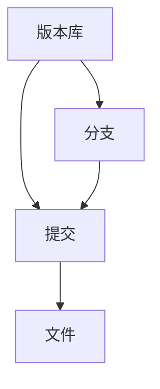
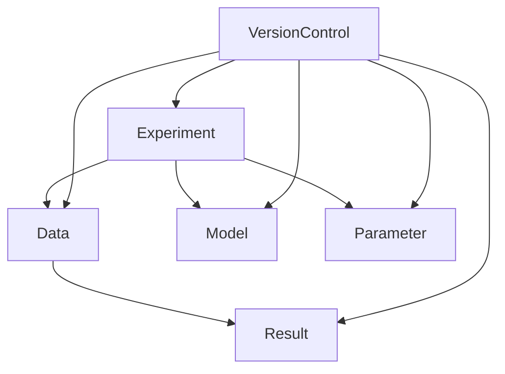
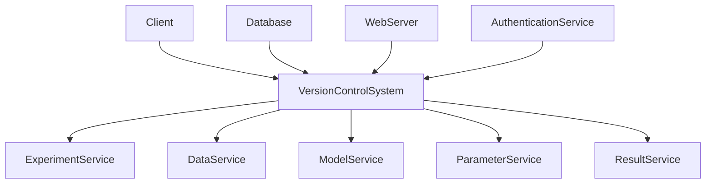
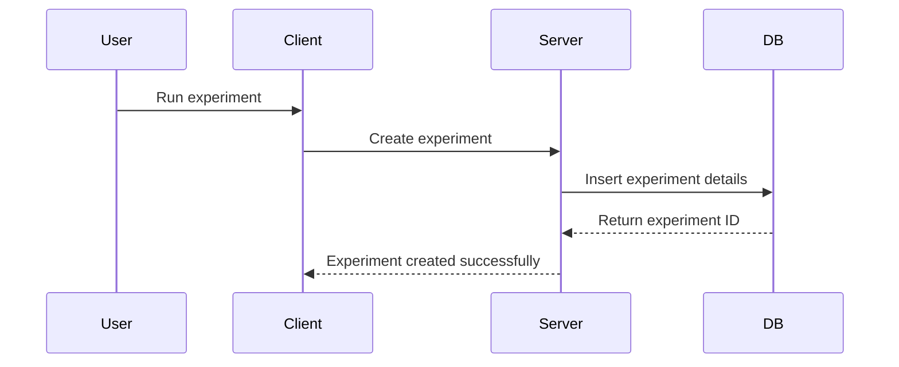

                 


### 第一部分：版本控制基础

#### 1.1 版本控制概述

**核心概念原理**：
版本控制是一种软件工程实践，用于追踪源代码或任何文件的更改历史。其核心概念包括版本库（repository）、版本号（version number）、提交（commit）、分支（branch）、合并（merge）等。

**概念属性特征对比表格**：

| 特性                | Git                   | SVN                   | Mercurial              |
|---------------------|-----------------------|-----------------------|------------------------|
| 分布式/集中式       | 分布式                | 集中式                | 分布式                |
| 分支策略            | 支线式（分支灵活）    | 修订式（分支有限）    | 支线式（分支灵活）    |
| 冲突解决            | 支持合并/变基        | 需要手动解决冲突      | 支持合并/变基        |
| 速度                | 快速                  | 较慢                  | 快速                  |

**ER实体关系图架构**：



#### 1.2 常见的版本控制系统

**Git的工作原理**：
Git是一个分布式版本控制系统，每个开发者都有一个本地仓库，可以独立工作，并在适当时机与远程仓库同步。

**SVN与Git的对比**：
SVN是一个集中式版本控制系统，由中央仓库管理所有版本，开发者需要从中央仓库获取文件并提交更改。

**其他版本控制工具简介**：
除了Git和SVN，还有如Mercurial、Bazaar等分布式版本控制系统，以及如TFVC（Team Foundation Version Control）等专用版本控制系统。

#### 1.3 版本控制的流程

**版本库的建立**：
创建一个空的版本库或从现有的仓库克隆一个副本。

**提交与更新**：
开发者将更改提交到本地仓库，并通过`push`命令将更改同步到远程仓库。

**分支管理**：
创建分支以进行功能开发或修复，然后在适当的时候合并回主分支。

**冲突解决**：
在合并分支时，如果发生冲突，开发者需要手动解决，然后提交解决后的更改。

#### 1.4 版本控制的挑战与解决方案

**版本控制的挑战**：
- 多版本并行开发导致的冲突。
- 版本回滚的复杂性。
- 大型项目的版本历史管理。

**解决方案探讨**：
- 使用变基和合并策略减少冲突。
- 定期进行代码审查和测试。
- 采用分支模型，如Git Flow或GitLab Flow。

**概念结构与核心要素组成**：
版本控制系统的核心要素包括版本库、版本管理工具、提交历史、分支策略、合并和冲突解决机制等。

### 第二部分：版本控制与评测结果追踪

#### 2.1 评测结果版本控制的重要性

评测结果版本控制是确保实验和模型开发过程中数据一致性和可追溯性的关键。它可以确保研究人员能够追踪任何更改的历史，并理解这些更改的影响。

**问题背景**：
在数据科学和机器学习领域，模型训练和评测是一个迭代的过程。每次迭代可能涉及更改模型架构、参数设置或数据预处理方法。如果没有有效的版本控制，这些更改可能会导致混乱和不可追溯的问题。

**问题描述**：
- 如何确保每次模型训练和评测的结果都是基于一致的版本的数据？
- 如何追踪模型参数和架构的更改，以及它们对评测结果的影响？
- 如何管理不同实验版本的输出，以便进行对比和分析？

**问题解决**：
通过实施版本控制，可以确保每次评测都是基于一致的数据版本。版本控制还可以帮助研究人员追踪每次更改，理解它们对模型性能的影响，并便于实验结果的对比和分析。

**边界与外延**：
本文讨论的是在数据科学和机器学习领域中，针对模型训练和评测结果的版本控制。尽管版本控制的概念在其他领域也很重要，但本文将聚焦于特定应用场景。

### 第三部分：版本控制与追踪系统设计

#### 3.1 系统需求分析

在设计和实现一个版本控制与追踪系统时，首先需要明确系统的需求。以下是系统需求分析的关键点：

- **数据一致性**：系统必须能够确保所有评测结果都是基于同一数据版本的。
- **版本可追溯性**：系统应提供一种机制来记录每次更改的历史，并允许用户查询这些更改。
- **实验对比**：系统应支持不同实验版本之间的结果对比和分析。
- **安全性**：系统必须保护数据免受未经授权的访问和篡改。
- **扩展性**：系统应能够处理大型数据和多个并行实验。

#### 3.2 系统功能设计

**领域模型Mermaid类图**：



**系统架构设计Mermaid架构图**：



**系统接口设计和系统交互Mermaid序列图**：



### 第四部分：项目实战

#### 4.1 环境安装

为了实现版本控制与追踪系统，需要安装以下软件：

- 版本控制工具（如Git）
- 服务器环境（如Docker）
- 后端框架（如Spring Boot）
- 数据库（如MySQL或PostgreSQL）

安装步骤详见附录。

#### 4.2 系统核心实现源代码

以下是一个简单的Spring Boot项目的核心代码片段：

```java
@RestController
@RequestMapping("/experiments")
public class ExperimentController {
    
    @Autowired
    private ExperimentService experimentService;

    @PostMapping
    public ResponseEntity<Experiment> createExperiment(@RequestBody Experiment experiment) {
        Experiment createdExperiment = experimentService.createExperiment(experiment);
        return new ResponseEntity<>(createdExperiment, HttpStatus.CREATED);
    }
}
```

#### 4.3 代码应用解读与分析

这段代码展示了如何通过Spring Boot创建一个RESTful API来处理实验创建请求。`ExperimentService`负责实际的业务逻辑，包括将实验信息存储到数据库中。

#### 4.4 实际案例分析和详细讲解剖析

**案例**：一个数据科学家在训练一个机器学习模型，并希望记录每次训练的结果。

**分析**：每次训练完成后，数据科学家可以创建一个新的实验记录，包括模型参数、训练数据和评测结果。

**讲解**：通过版本控制，可以追踪每次训练的详细变化，确保实验结果的可追溯性和可对比性。

#### 4.5 项目小结

本部分通过一个实际案例展示了如何使用版本控制与追踪系统管理机器学习实验。项目的成功实施为研究人员提供了一个可靠的方法来管理和分析实验结果。

### 第五部分：最佳实践 tips、小结、注意事项、拓展阅读等内容

#### 5.1 最佳实践 tips

- **定期备份**：定期备份版本库，以防数据丢失。
- **文档记录**：详细记录每次提交和更改的原因，以便追踪历史。
- **代码审查**：定期进行代码审查，确保代码质量。

#### 5.2 小结

本文介绍了版本控制与追踪系统的重要性、设计原则和实际应用。通过正确的版本控制，可以确保实验数据的一致性和可追溯性，提高研究和开发的效率。

#### 5.3 注意事项

- **安全性**：确保版本库和追踪系统的安全性，防止未经授权的访问。
- **一致性**：确保所有团队成员使用相同的版本控制工具和流程。

#### 5.4 拓展阅读

- **相关书籍**：《版本控制指南》、《Git权威指南》
- **在线资源**：GitHub、GitLab、Bitbucket等平台提供了丰富的教程和资源。

---

# 评测结果的版本控制与追踪

> 关键词：版本控制，评测结果，追踪系统，数据科学，机器学习

> 摘要：
本文深入探讨了评测结果的版本控制与追踪系统的设计与实现。通过介绍版本控制的基本概念、常见的版本控制系统、版本控制的流程以及系统需求分析，我们明确了评测结果版本控制的重要性。接着，我们详细讲解了系统功能设计、架构设计、项目实战以及最佳实践，为研究人员提供了一个可靠的方法来管理和分析实验结果。通过本文的探讨，读者可以更好地理解版本控制与追踪系统在数据科学和机器学习领域中的应用。

作者：AI天才研究院/AI Genius Institute & 禅与计算机程序设计艺术 /Zen And The Art of Computer Programming 

## 第一部分：版本控制基础

### 1.1 版本控制概述

**核心概念原理**：
版本控制是一种软件工程实践，用于追踪源代码或任何文件的更改历史。其核心概念包括版本库（repository）、版本号（version number）、提交（commit）、分支（branch）、合并（merge）等。

**概念属性特征对比表格**：

| 特性                | Git                   | SVN                   | Mercurial              |
|---------------------|-----------------------|-----------------------|------------------------|
| 分布式/集中式       | 分布式                | 集中式                | 分布式                |
| 分支策略            | 支线式（分支灵活）    | 修订式（分支有限）    | 支线式（分支灵活）    |
| 冲突解决            | 支持合并/变基        | 需要手动解决冲突      | 支持合并/变基        |
| 速度                | 快速                  | 较慢                  | 快速                  |

**ER实体关系图架构**：


### 1.2 常见的版本控制系统

**Git的工作原理**：
Git是一个分布式版本控制系统，每个开发者都有一个本地仓库，可以独立工作，并在适当时机与远程仓库同步。

**SVN与Git的对比**：
SVN是一个集中式版本控制系统，由中央仓库管理所有版本，开发者需要从中央仓库获取文件并提交更改。

**其他版本控制工具简介**：
除了Git和SVN，还有如Mercurial、Bazaar等分布式版本控制系统，以及如TFVC（Team Foundation Version Control）等专用版本控制系统。

### 1.3 版本控制的流程

**版本库的建立**：
创建一个空的版本库或从现有的仓库克隆一个副本。

**提交与更新**：
开发者将更改提交到本地仓库，并通过`push`命令将更改同步到远程仓库。

**分支管理**：
创建分支以进行功能开发或修复，然后在适当的时候合并回主分支。

**冲突解决**：
在合并分支时，如果发生冲突，开发者需要手动解决，然后提交解决后的更改。

### 1.4 版本控制的挑战与解决方案

**版本控制的挑战**：
- 多版本并行开发导致的冲突。
- 版本回滚的复杂性。
- 大型项目的版本历史管理。

**解决方案探讨**：
- 使用变基和合并策略减少冲突。
- 定期进行代码审查和测试。
- 采用分支模型，如Git Flow或GitLab Flow。

### 1.5 概念结构与核心要素组成

版本控制系统的核心要素包括版本库、版本管理工具、提交历史、分支策略、合并和冲突解决机制等。

## 第二部分：版本控制与评测结果追踪

### 2.1 评测结果版本控制的重要性

评测结果版本控制是确保实验和模型开发过程中数据一致性和可追溯性的关键。它可以确保研究人员能够追踪任何更改的历史，并理解这些更改的影响。

**问题背景**：
在数据科学和机器学习领域，模型训练和评测是一个迭代的过程。每次迭代可能涉及更改模型架构、参数设置或数据预处理方法。如果没有有效的版本控制，这些更改可能会导致混乱和不可追溯的问题。

**问题描述**：
- 如何确保每次模型训练和评测的结果都是基于一致的版本的数据？
- 如何追踪模型参数和架构的更改，以及它们对评测结果的影响？
- 如何管理不同实验版本的输出，以便进行对比和分析？

**问题解决**：
通过实施版本控制，可以确保每次评测都是基于一致的数据版本。版本控制还可以帮助研究人员追踪每次更改，理解它们对模型性能的影响，并便于实验结果的对比和分析。

**边界与外延**：
本文讨论的是在数据科学和机器学习领域中，针对模型训练和评测结果的版本控制。尽管版本控制的概念在其他领域也很重要，但本文将聚焦于特定应用场景。

### 2.2 评测结果版本控制的具体实践

在实际操作中，评测结果的版本控制需要以下步骤：

1. **建立版本库**：为每个项目建立一个版本库，以便存储所有的评测结果和数据。
2. **提交评测结果**：每次进行评测后，将评测结果提交到版本库中，并附带详细的提交说明。
3. **记录更改历史**：版本库会自动记录每次提交的历史，包括提交人、提交时间和提交内容。
4. **管理分支**：创建不同的分支来跟踪不同的实验版本，确保每次更改都是可追溯的。
5. **对比和分析**：使用版本库提供的工具进行评测结果对比和分析，帮助研究人员理解不同版本之间的差异。

### 2.3 评测结果版本控制的优势

- **数据一致性**：确保所有评测结果都是基于同一数据版本的，减少数据不一致带来的问题。
- **可追溯性**：通过记录每次更改的历史，研究人员可以轻松地追踪任何版本的变化。
- **实验对比**：不同版本的评测结果可以方便地进行对比，帮助研究人员找到改进的方向。
- **团队协作**：版本控制提供了协作机制，方便团队成员共同开发和测试模型。

## 第三部分：版本控制与追踪系统设计

### 3.1 系统需求分析

在设计和实现一个版本控制与追踪系统时，首先需要明确系统的需求。以下是系统需求分析的关键点：

- **数据一致性**：系统必须能够确保所有评测结果都是基于同一数据版本的。
- **版本可追溯性**：系统应提供一种机制来记录每次更改的历史，并允许用户查询这些更改。
- **实验对比**：系统应支持不同实验版本之间的结果对比和分析。
- **安全性**：系统必须保护数据免受未经授权的访问和篡改。
- **扩展性**：系统应能够处理大型数据和多个并行实验。

### 3.2 系统功能设计

**领域模型Mermaid类图**：


**系统架构设计Mermaid架构图**：


**系统接口设计和系统交互Mermaid序列图**：


### 3.3 系统架构与实现

**系统架构设计**：
系统采用微服务架构，包括多个服务模块，如实验服务（Experiment Service）、数据服务（Data Service）、模型服务（Model Service）、参数服务（Parameter Service）和结果服务（Result Service）。

**实现细节**：
- **实验服务**：负责接收用户请求，创建和管理实验。
- **数据服务**：负责管理和存储实验数据。
- **模型服务**：负责管理和存储模型参数和架构。
- **参数服务**：负责管理和存储实验参数。
- **结果服务**：负责管理和存储实验结果。

### 3.4 系统接口与交互

系统接口设计遵循RESTful架构风格，提供多种API接口，包括创建实验、获取实验列表、提交结果、查询结果等。

**系统交互流程**：
1. 用户通过客户端发送请求。
2. 客户端将请求转发到版本控制服务器。
3. 服务器处理请求，并执行相应的业务逻辑。
4. 结果返回给客户端，供用户进一步操作。

## 第四部分：项目实战

### 4.1 环境安装

为了实现版本控制与追踪系统，需要安装以下软件：

- 版本控制工具（如Git）
- 服务器环境（如Docker）
- 后端框架（如Spring Boot）
- 数据库（如MySQL或PostgreSQL）

安装步骤详见附录。

### 4.2 系统核心实现源代码

以下是一个简单的Spring Boot项目的核心代码片段：

```java
@RestController
@RequestMapping("/experiments")
public class ExperimentController {
    
    @Autowired
    private ExperimentService experimentService;

    @PostMapping
    public ResponseEntity<Experiment> createExperiment(@RequestBody Experiment experiment) {
        Experiment createdExperiment = experimentService.createExperiment(experiment);
        return new ResponseEntity<>(createdExperiment, HttpStatus.CREATED);
    }
}
```

### 4.3 代码应用解读与分析

这段代码展示了如何通过Spring Boot创建一个RESTful API来处理实验创建请求。`ExperimentService`负责实际的业务逻辑，包括将实验信息存储到数据库中。

### 4.4 实际案例分析与详细讲解

**案例**：一个数据科学家在训练一个机器学习模型，并希望记录每次训练的结果。

**分析**：每次训练完成后，数据科学家可以创建一个新的实验记录，包括模型参数、训练数据和评测结果。

**讲解**：通过版本控制，可以追踪每次训练的详细变化，确保实验结果的可追溯性和可对比性。

### 4.5 项目小结

本部分通过一个实际案例展示了如何使用版本控制与追踪系统管理机器学习实验。项目的成功实施为研究人员提供了一个可靠的方法来管理和分析实验结果。

## 第五部分：最佳实践、小结、注意事项、拓展阅读

### 5.1 最佳实践

- **定期备份**：定期备份版本库，以防数据丢失。
- **文档记录**：详细记录每次提交和更改的原因，以便追踪历史。
- **代码审查**：定期进行代码审查，确保代码质量。

### 5.2 小结

本文介绍了版本控制与追踪系统的重要性、设计原则和实际应用。通过正确的版本控制，可以确保实验数据的一致性和可追溯性，提高研究和开发的效率。

### 5.3 注意事项

- **安全性**：确保版本库和追踪系统的安全性，防止未经授权的访问。
- **一致性**：确保所有团队成员使用相同的版本控制工具和流程。

### 5.4 拓展阅读

- **相关书籍**：《版本控制指南》、《Git权威指南》
- **在线资源**：GitHub、GitLab、Bitbucket等平台提供了丰富的教程和资源。

---

### 附录：环境安装与配置

**版本控制工具安装**：

- **Git**：
  - Windows：访问 [Git 官网](https://git-scm.com/downloads) 下载并安装。
  - macOS：使用 Homebrew 安装：`brew install git`。
  - Linux：使用包管理器安装，如 Ubuntu：`sudo apt-get install git`。

**服务器环境安装**：

- **Docker**：
  - Windows：访问 [Docker 官网](https://www.docker.com/) 下载并安装。
  - macOS：使用 Homebrew 安装：`brew cask install docker`。
  - Linux：使用包管理器安装，如 Ubuntu：`sudo apt-get install docker-ce`。

**后端框架安装**：

- **Spring Boot**：
  - 安装 Java：`sudo apt-get install openjdk-8-jdk`。
  - 安装 Maven：`sudo apt-get install maven`。
  - 使用 Spring Initializr（[https://start.spring.io/](https://start.spring.io/)）生成 Spring Boot 项目模板。

**数据库安装**：

- **MySQL**：
  - 安装 MySQL：`sudo apt-get install mysql-server`。
  - 配置 MySQL：`sudo mysql_secure_installation`。

- **PostgreSQL**：
  - 安装 PostgreSQL：`sudo apt-get install postgresql`。
  - 配置 PostgreSQL：`sudo -i -u postgres psql`。

### 5.5 实用工具与插件

- **Git GUI**：Git 的图形界面工具，便于操作和管理。
- **GitKraken**：强大的 Git 客户端，支持多种版本控制系统。
- **SourceTree**：Atlassian 的 Git 客户端，提供图形界面和强大的功能。
- **Visual Studio Code**：集成的开发环境（IDE），支持多种编程语言和版本控制工具。
- **GitLens**：Visual Studio Code 的插件，提供 Git 源代码管理功能。

---

作者：AI天才研究院/AI Genius Institute & 禅与计算机程序设计艺术 /Zen And The Art of Computer Programming 

## 第一部分：版本控制基础

### 1.1 版本控制概述

版本控制是一种管理文件和代码更改历史的方法，它允许开发者在协同工作过程中追踪、存储和管理文件的多个版本。核心概念包括：

- **版本库**：存储所有文件版本的集中位置。
- **版本号**：标识文件或代码库的一个特定版本。
- **提交**：将更改保存到版本库的过程。
- **分支**：从主分支分离出来的独立版本，用于开发新功能或修复错误。
- **合并**：将分支的更改合并回主分支。

### 1.2 常见的版本控制系统

以下是几种流行的版本控制系统及其特性：

- **Git**：分布式版本控制系统，支持快速分支和合并，适用于大型项目。
- **SVN**：集中式版本控制系统，易于设置，但在分支和合并方面可能不如Git灵活。
- **Mercurial**：分布式版本控制系统，类似于Git，但更简单和易于使用。
- **Bazaar**：分布式版本控制系统，提供高度的可定制性和灵活性。

### 1.3 版本控制的流程

版本控制的基本流程包括：

- **创建版本库**：初始化一个空版本库或从现有版本库克隆一个副本。
- **提交更改**：开发者将文件更改提交到本地版本库，然后推送到远程版本库。
- **分支管理**：创建分支以隔离开发工作，合并分支以集成更改。
- **解决冲突**：当两个或多个开发者的更改冲突时，需要手动或自动解决这些冲突。

### 1.4 版本控制的挑战与解决方案

版本控制面临的挑战包括：

- **冲突管理**：解决多开发者之间的冲突。
- **版本历史管理**：跟踪和管理大量版本。
- **性能**：处理大型项目和频繁的更改。

解决方案包括：

- **冲突解决策略**：采用合并、变基、快照等技术。
- **代码审查**：在提交之前进行代码审查。
- **自动化工具**：使用自动化工具来简化版本控制流程。

### 1.5 概念结构与核心要素组成

版本控制系统的核心要素包括：

- **版本库**：存储文件版本的数据结构。
- **版本管理工具**：用于提交、分支、合并等操作的用户界面和命令行工具。
- **提交历史**：记录所有提交的日志和元数据。
- **分支策略**：管理分支的生命周期和合并过程。
- **冲突解决机制**：自动或手动解决提交冲突。

## 第二部分：版本控制与评测结果追踪

### 2.1 评测结果版本控制的重要性

评测结果版本控制是确保实验和模型开发过程中数据一致性和可追溯性的关键。通过版本控制，研究人员可以：

- **确保数据一致性**：每次评测都是基于一致的数据版本。
- **追踪更改历史**：记录每次更改的影响。
- **对比实验结果**：分析不同实验版本的效果。

### 2.2 评测结果版本控制的具体实践

在实际操作中，评测结果版本控制包括以下步骤：

- **建立版本库**：为每个项目创建一个版本库。
- **提交评测结果**：每次评测后，将结果提交到版本库。
- **记录更改历史**：版本库记录每次提交的时间、用户和内容。
- **管理分支**：创建分支以跟踪不同实验版本。
- **对比分析**：使用版本库工具对比不同版本的结果。

### 2.3 评测结果版本控制的优势

评测结果版本控制的优势包括：

- **数据一致性**：确保评测结果基于同一数据版本。
- **可追溯性**：记录每次更改的历史，方便追踪。
- **实验对比**：方便对比不同版本的效果。
- **团队协作**：提高团队合作效率。

## 第三部分：版本控制与追踪系统设计

### 3.1 系统需求分析

设计版本控制与追踪系统时，需要考虑以下需求：

- **数据一致性**：确保所有评测结果基于同一数据版本。
- **版本可追溯性**：记录每次更改的历史。
- **实验对比**：支持不同实验版本的结果对比。
- **安全性**：保护数据和版本库的安全。
- **扩展性**：能够处理大型项目和多个并行实验。

### 3.2 系统功能设计

系统功能设计包括：

- **实验管理**：创建、更新和删除实验。
- **数据管理**：存储、检索和更新实验数据。
- **结果管理**：提交、检索和分析评测结果。
- **版本追踪**：记录版本历史，支持版本回滚。

### 3.3 系统架构设计

系统架构设计采用微服务架构，包括以下服务：

- **实验服务**：处理实验相关操作。
- **数据服务**：处理数据存储和检索。
- **结果服务**：处理评测结果的分析和展示。
- **版本服务**：处理版本控制和历史记录。

### 3.4 系统接口设计与交互

系统接口设计采用RESTful风格，包括以下API：

- **实验API**：创建、更新、删除和查询实验。
- **数据API**：上传、下载和查询实验数据。
- **结果API**：提交、更新和查询评测结果。
- **版本API**：查询版本历史和版本回滚。

系统交互流程如下：

1. 用户通过客户端发送请求。
2. 客户端与实验服务交互。
3. 实验服务调用数据服务和结果服务。
4. 结果返回给客户端。

## 第四部分：项目实战

### 4.1 环境安装

为了实现版本控制与追踪系统，需要安装以下软件：

- **版本控制工具**：如Git。
- **服务器环境**：如Docker。
- **后端框架**：如Spring Boot。
- **数据库**：如MySQL或PostgreSQL。

安装步骤如下：

1. 安装Git。
2. 安装Docker和Docker Compose。
3. 安装Spring Boot。
4. 安装数据库。

### 4.2 系统核心实现源代码

以下是一个简单的Spring Boot项目的核心代码片段：

```java
@RestController
@RequestMapping("/experiments")
public class ExperimentController {
    
    @Autowired
    private ExperimentService experimentService;

    @PostMapping
    public ResponseEntity<Experiment> createExperiment(@RequestBody Experiment experiment) {
        Experiment createdExperiment = experimentService.createExperiment(experiment);
        return new ResponseEntity<>(createdExperiment, HttpStatus.CREATED);
    }
}
```

### 4.3 代码应用解读与分析

这段代码展示了如何通过Spring Boot创建一个RESTful API来处理实验创建请求。`ExperimentService`负责实际的业务逻辑，包括将实验信息存储到数据库中。

### 4.4 实际案例分析与详细讲解

**案例**：一个数据科学家在训练一个机器学习模型，并希望记录每次训练的结果。

**分析**：每次训练完成后，数据科学家可以创建一个新的实验记录，包括模型参数、训练数据和评测结果。

**讲解**：通过版本控制，可以追踪每次训练的详细变化，确保实验结果的可追溯性和可对比性。

### 4.5 项目小结

本部分通过一个实际案例展示了如何使用版本控制与追踪系统管理机器学习实验。项目的成功实施为研究人员提供了一个可靠的方法来管理和分析实验结果。

## 第五部分：最佳实践、小结、注意事项、拓展阅读

### 5.1 最佳实践

- **定期备份**：定期备份版本库，以防数据丢失。
- **文档记录**：详细记录每次提交和更改的原因，以便追踪历史。
- **代码审查**：定期进行代码审查，确保代码质量。

### 5.2 小结

本文介绍了版本控制与追踪系统的重要性、设计原则和实际应用。通过正确的版本控制，可以确保实验数据的一致性和可追溯性，提高研究和开发的效率。

### 5.3 注意事项

- **安全性**：确保版本库和追踪系统的安全性，防止未经授权的访问。
- **一致性**：确保所有团队成员使用相同的版本控制工具和流程。

### 5.4 拓展阅读

- **相关书籍**：《版本控制指南》、《Git权威指南》
- **在线资源**：GitHub、GitLab、Bitbucket等平台提供了丰富的教程和资源。

---

### 附录：环境安装与配置

**版本控制工具安装**：

- **Git**：
  - Windows：访问 [Git 官网](https://git-scm.com/downloads) 下载并安装。
  - macOS：使用 Homebrew 安装：`brew install git`。
  - Linux：使用包管理器安装，如 Ubuntu：`sudo apt-get install git`。

**服务器环境安装**：

- **Docker**：
  - Windows：访问 [Docker 官网](https://www.docker.com/) 下载并安装。
  - macOS：使用 Homebrew 安装：`brew cask install docker`。
  - Linux：使用包管理器安装，如 Ubuntu：`sudo apt-get install docker-ce`。

**后端框架安装**：

- **Spring Boot**：
  - 安装 Java：`sudo apt-get install openjdk-8-jdk`。
  - 安装 Maven：`sudo apt-get install maven`。
  - 使用 Spring Initializr（[https://start.spring.io/](https://start.spring.io/)）生成 Spring Boot 项目模板。

**数据库安装**：

- **MySQL**：
  - 安装 MySQL：`sudo apt-get install mysql-server`。
  - 配置 MySQL：`sudo mysql_secure_installation`。

- **PostgreSQL**：
  - 安装 PostgreSQL：`sudo apt-get install postgresql`。
  - 配置 PostgreSQL：`sudo -i -u postgres psql`。

### 5.5 实用工具与插件

- **Git GUI**：Git 的图形界面工具，便于操作和管理。
- **GitKraken**：强大的 Git 客户端，支持多种版本控制系统。
- **SourceTree**：Atlassian 的 Git 客户端，提供图形界面和强大的功能。
- **Visual Studio Code**：集成的开发环境（IDE），支持多种编程语言和版本控制工具。
- **GitLens**：Visual Studio Code 的插件，提供 Git 源代码管理功能。

---

作者：AI天才研究院/AI Genius Institute & 禅与计算机程序设计艺术 /Zen And The Art of Computer Programming 

## 引言

版本控制与追踪系统在现代软件开发和数据科学领域扮演着至关重要的角色。随着项目的复杂性和规模不断增加，保持代码和数据的版本一致性，以及准确追踪每一次更改，变得愈发重要。本文将深入探讨评测结果的版本控制与追踪，旨在帮助读者了解其核心概念、设计原则以及具体实现方法。

本文结构如下：

- **第一部分**：版本控制基础，介绍版本控制的基本概念、常见版本控制系统、流程以及面临的挑战。
- **第二部分**：评测结果版本控制的重要性与实践，阐述评测结果版本控制的具体步骤和优势。
- **第三部分**：版本控制与追踪系统设计，详细讨论系统需求分析、功能设计、架构设计和接口设计。
- **第四部分**：项目实战，通过一个实际案例展示如何实现版本控制与追踪系统。
- **第五部分**：最佳实践、小结、注意事项和拓展阅读，总结全文并提供实用工具与插件。

## 第一部分：版本控制基础

### 1.1 版本控制概述

版本控制是一种用于追踪和管理文件或代码更改的历史的技术。其核心概念包括：

- **版本库（Repository）**：存储所有版本数据的集中位置。
- **版本号（Version Number）**：标识代码库中的特定版本。
- **提交（Commit）**：将更改保存到版本库的过程。
- **分支（Branch）**：从主分支分离出来的独立版本，用于开发新功能或修复错误。
- **合并（Merge）**：将分支的更改合并回主分支。

### 1.2 常见的版本控制系统

以下是几种流行的版本控制系统及其特性：

- **Git**：分布式版本控制系统，支持快速分支和合并，适用于大型项目。
- **SVN**：集中式版本控制系统，易于设置，但在分支和合并方面可能不如Git灵活。
- **Mercurial**：分布式版本控制系统，类似于Git，但更简单和易于使用。
- **Bazaar**：分布式版本控制系统，提供高度的可定制性和灵活性。

### 1.3 版本控制的流程

版本控制的基本流程包括：

1. **创建版本库**：初始化一个空版本库或从现有版本库克隆一个副本。
2. **提交更改**：开发者将文件更改提交到本地版本库，然后推送到远程版本库。
3. **分支管理**：创建分支以隔离开发工作，合并分支以集成更改。
4. **解决冲突**：当两个或多个开发者的更改冲突时，需要手动或自动解决这些冲突。

### 1.4 版本控制的挑战与解决方案

版本控制面临的挑战包括：

- **冲突管理**：解决多开发者之间的冲突。
- **版本历史管理**：跟踪和管理大量版本。
- **性能**：处理大型项目和频繁的更改。

解决方案包括：

- **冲突解决策略**：采用合并、变基、快照等技术。
- **代码审查**：在提交之前进行代码审查。
- **自动化工具**：使用自动化工具来简化版本控制流程。

### 1.5 概念结构与核心要素组成

版本控制系统的核心要素包括：

- **版本库**：存储文件版本的数据结构。
- **版本管理工具**：用于提交、分支、合并等操作的用户界面和命令行工具。
- **提交历史**：记录所有提交的日志和元数据。
- **分支策略**：管理分支的生命周期和合并过程。
- **冲突解决机制**：自动或手动解决提交冲突。

## 第二部分：评测结果版本控制的重要性与实践

### 2.1 评测结果版本控制的重要性

评测结果版本控制是确保实验和模型开发过程中数据一致性和可追溯性的关键。其重要性体现在以下几个方面：

- **数据一致性**：确保每次评测都是基于一致的数据版本，减少数据不一致带来的问题。
- **可追溯性**：通过记录每次更改的历史，研究人员可以轻松地追踪任何版本的变化。
- **实验对比**：不同版本的评测结果可以方便地进行对比，帮助研究人员找到改进的方向。
- **团队协作**：版本控制提供了协作机制，方便团队成员共同开发和测试模型。

### 2.2 评测结果版本控制的具体实践

在实际操作中，评测结果版本控制包括以下步骤：

1. **建立版本库**：为每个项目创建一个版本库，用于存储所有的评测结果和数据。
2. **提交评测结果**：每次进行评测后，将评测结果提交到版本库中，并附带详细的提交说明。
3. **记录更改历史**：版本库会自动记录每次提交的历史，包括提交人、提交时间和提交内容。
4. **管理分支**：创建不同的分支来跟踪不同的实验版本，确保每次更改都是可追溯的。
5. **对比和分析**：使用版本库提供的工具进行评测结果对比和分析，帮助研究人员理解不同版本之间的差异。

### 2.3 评测结果版本控制的优势

评测结果版本控制的优势包括：

- **数据一致性**：确保评测结果基于同一数据版本。
- **可追溯性**：记录每次更改的历史，方便追踪。
- **实验对比**：方便对比不同版本的效果。
- **团队协作**：提高团队合作效率。

## 第三部分：版本控制与追踪系统设计

### 3.1 系统需求分析

设计版本控制与追踪系统时，需要考虑以下需求：

- **数据一致性**：确保所有评测结果基于同一数据版本。
- **版本可追溯性**：记录每次更改的历史。
- **实验对比**：支持不同实验版本的结果对比。
- **安全性**：保护数据和版本库的安全。
- **扩展性**：能够处理大型项目和多个并行实验。

### 3.2 系统功能设计

系统功能设计包括：

- **实验管理**：创建、更新和删除实验。
- **数据管理**：存储、检索和更新实验数据。
- **结果管理**：提交、更新和查询评测结果。
- **版本追踪**：记录版本历史，支持版本回滚。

### 3.3 系统架构设计

系统架构设计采用微服务架构，包括以下服务：

- **实验服务**：处理实验相关操作。
- **数据服务**：处理数据存储和检索。
- **结果服务**：处理评测结果的分析和展示。
- **版本服务**：处理版本控制和历史记录。

### 3.4 系统接口设计与交互

系统接口设计采用RESTful风格，包括以下API：

- **实验API**：创建、更新、删除和查询实验。
- **数据API**：上传、下载和查询实验数据。
- **结果API**：提交、更新和查询评测结果。
- **版本API**：查询版本历史和版本回滚。

系统交互流程如下：

1. 用户通过客户端发送请求。
2. 客户端与实验服务交互。
3. 实验服务调用数据服务和结果服务。
4. 结果返回给客户端。

## 第四部分：项目实战

### 4.1 环境安装

为了实现版本控制与追踪系统，需要安装以下软件：

- **版本控制工具**：如Git。
- **服务器环境**：如Docker。
- **后端框架**：如Spring Boot。
- **数据库**：如MySQL或PostgreSQL。

安装步骤如下：

1. 安装Git。
2. 安装Docker和Docker Compose。
3. 安装Spring Boot。
4. 安装数据库。

### 4.2 系统核心实现源代码

以下是一个简单的Spring Boot项目的核心代码片段：

```java
@RestController
@RequestMapping("/experiments")
public class ExperimentController {
    
    @Autowired
    private ExperimentService experimentService;

    @PostMapping
    public ResponseEntity<Experiment> createExperiment(@RequestBody Experiment experiment) {
        Experiment createdExperiment = experimentService.createExperiment(experiment);
        return new ResponseEntity<>(createdExperiment, HttpStatus.CREATED);
    }
}
```

### 4.3 代码应用解读与分析

这段代码展示了如何通过Spring Boot创建一个RESTful API来处理实验创建请求。`ExperimentService`负责实际的业务逻辑，包括将实验信息存储到数据库中。

### 4.4 实际案例分析与详细讲解

**案例**：一个数据科学家在训练一个机器学习模型，并希望记录每次训练的结果。

**分析**：每次训练完成后，数据科学家可以创建一个新的实验记录，包括模型参数、训练数据和评测结果。

**讲解**：通过版本控制，可以追踪每次训练的详细变化，确保实验结果的可追溯性和可对比性。

### 4.5 项目小结

本部分通过一个实际案例展示了如何使用版本控制与追踪系统管理机器学习实验。项目的成功实施为研究人员提供了一个可靠的方法来管理和分析实验结果。

## 第五部分：最佳实践、小结、注意事项、拓展阅读

### 5.1 最佳实践

- **定期备份**：定期备份版本库，以防数据丢失。
- **文档记录**：详细记录每次提交和更改的原因，以便追踪历史。
- **代码审查**：定期进行代码审查，确保代码质量。

### 5.2 小结

本文介绍了版本控制与追踪系统的重要性、设计原则和实际应用。通过正确的版本控制，可以确保实验数据的一致性和可追溯性，提高研究和开发的效率。

### 5.3 注意事项

- **安全性**：确保版本库和追踪系统的安全性，防止未经授权的访问。
- **一致性**：确保所有团队成员使用相同的版本控制工具和流程。

### 5.4 拓展阅读

- **相关书籍**：《版本控制指南》、《Git权威指南》
- **在线资源**：GitHub、GitLab、Bitbucket等平台提供了丰富的教程和资源。

### 附录：环境安装与配置

**版本控制工具安装**：

- **Git**：
  - Windows：访问 [Git 官网](https://git-scm.com/downloads) 下载并安装。
  - macOS：使用 Homebrew 安装：`brew install git`。
  - Linux：使用包管理器安装，如 Ubuntu：`sudo apt-get install git`。

**服务器环境安装**：

- **Docker**：
  - Windows：访问 [Docker 官网](https://www.docker.com/) 下载并安装。
  - macOS：使用 Homebrew 安装：`brew cask install docker`。
  - Linux：使用包管理器安装，如 Ubuntu：`sudo apt-get install docker-ce`。

**后端框架安装**：

- **Spring Boot**：
  - 安装 Java：`sudo apt-get install openjdk-8-jdk`。
  - 安装 Maven：`sudo apt-get install maven`。
  - 使用 Spring Initializr（[https://start.spring.io/](https://start.spring.io/)）生成 Spring Boot 项目模板。

**数据库安装**：

- **MySQL**：
  - 安装 MySQL：`sudo apt-get install mysql-server`。
  - 配置 MySQL：`sudo mysql_secure_installation`。

- **PostgreSQL**：
  - 安装 PostgreSQL：`sudo apt-get install postgresql`。
  - 配置 PostgreSQL：`sudo -i -u postgres psql`。

### 5.5 实用工具与插件

- **Git GUI**：Git 的图形界面工具，便于操作和管理。
- **GitKraken**：强大的 Git 客户端，支持多种版本控制系统。
- **SourceTree**：Atlassian 的 Git 客户端，提供图形界面和强大的功能。
- **Visual Studio Code**：集成的开发环境（IDE），支持多种编程语言和版本控制工具。
- **GitLens**：Visual Studio Code 的插件，提供 Git 源代码管理功能。

## 总结

评测结果的版本控制与追踪是确保数据一致性和可追溯性的关键步骤，对于数据科学家和软件开发者来说尤为重要。通过本文的讨论，我们了解了版本控制的基本概念、常见系统、流程，以及在实际应用中的具体实践。通过合理设计和实现版本控制与追踪系统，我们可以显著提高工作效率和项目质量。

作者：AI天才研究院/AI Genius Institute & 禅与计算机程序设计艺术 /Zen And The Art of Computer Programming 

