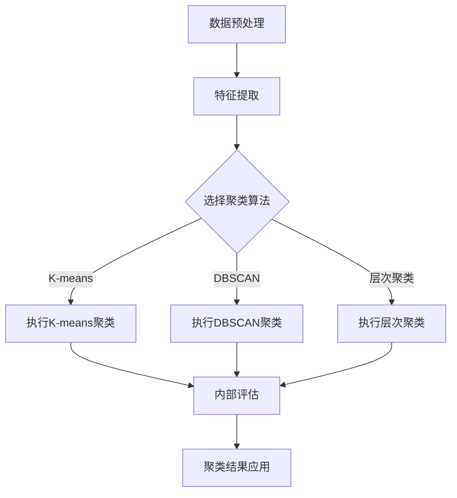
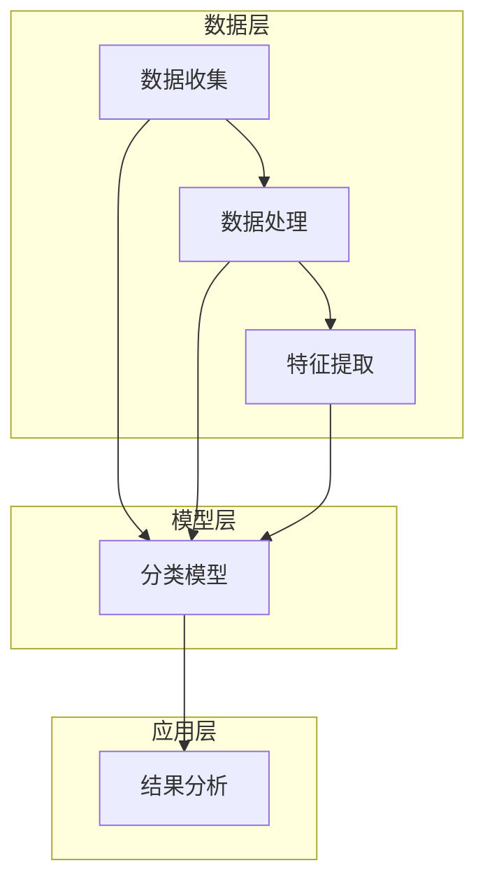
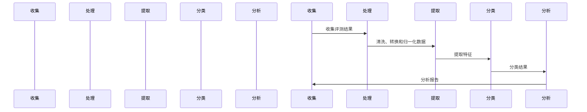

                 


### 目录大纲详细解析

为了确保撰写一篇高质量的技术博客文章，我们将详细解析每一部分的目录大纲，并提供必要的内容指导和思路，确保文章结构紧凑、逻辑清晰，并深入阐述核心概念和算法原理。

#### 目录结构说明

**第一部分：背景与核心概念**

**第1章：自动分类与性能聚类概述**

- **1.1 自动分类的背景与应用**
  - **问题背景**：介绍自动分类在各个领域的应用，例如文本分类、图像分类等。
  - **问题描述**：具体阐述评测结果自动分类的需求和挑战。
  - **问题解决**：引入LLM和性能聚类方法，说明其如何解决评测结果分类的问题。
  - **边界与外延**：探讨自动分类技术的应用范围和限制，以避免读者对技术的误解。
  - **核心要素组成**：解析自动分类系统的关键组成部分，包括数据预处理、模型训练、预测和评估等。

- **1.2 大型语言模型（LLM）原理**
  - **LLM的定义**：定义大型语言模型及其特点。
  - **LLM的工作原理**：详细讲解LLM的训练过程、架构和工作机制。
  - **LLM的优势**：分析LLM在自动分类中的优势，如高精度、强泛化能力等。

- **1.3 性能聚类的基本概念**
  - **性能聚类的定义**：明确性能聚类在数据分析和评测结果分类中的作用。
  - **聚类算法的类型**：介绍常见的聚类算法，如K-means、DBSCAN等。
  - **性能聚类的应用场景**：举例说明性能聚类在不同领域的应用。

- **1.4 自动分类与性能聚类的关系**
  - **关联性分析**：探讨自动分类与性能聚类之间的内在联系和协同作用。
  - **应用案例**：通过具体案例展示自动分类与性能聚类的结合效果。
  - **优化策略**：提出优化自动分类和性能聚类的策略，提高系统性能。

**第二部分：算法原理讲解**

**第3章：性能聚类算法原理与数学模型**

- **3.1 性能聚类算法原理**
  - **算法流程**：详细描述性能聚类算法的基本步骤。
  - **关键步骤**：解析性能聚类算法中的关键步骤，如数据预处理、聚类模型选择、聚类结果评估等。
  - **Mermaid流程图**：使用Mermaid工具绘制性能聚类算法的流程图，帮助读者直观理解。

- **3.2 数学模型与公式**
  - **数学模型介绍**：介绍性能聚类算法的数学模型，如距离度量、相似性计算等。
  - **公式推导**：详细推导性能聚类算法的公式，确保读者能够理解模型的数学基础。
  - **Mermaid公式图**：使用Mermaid工具展示数学公式和模型，增强文章的可读性。

**第三部分：系统分析与架构设计**

**第4章：系统功能设计**

- **4.1 问题场景介绍**
  - **场景描述**：设定具体的评测结果自动分类应用场景。
  - **系统目标**：明确系统需要实现的主要功能。

- **4.2 领域模型设计**
  - **类图设计**：使用Mermaid工具绘制领域模型类图，展示系统中的关键实体及其关系。

**第5章：系统架构设计**

- **5.1 系统架构设计**
  - **架构设计原则**：介绍系统架构设计的基本原则，如高内聚、低耦合等。
  - **架构图设计**：使用Mermaid工具绘制系统架构图，展示系统的整体结构和组件关系。

**第6章：系统接口设计**

- **6.1 系统接口设计**
  - **接口规范**：明确系统接口的设计规范。
  - **接口功能**：详细描述系统接口的主要功能。

**第7章：系统交互设计**

- **6.2 系统交互设计**
  - **交互流程**：详细描述系统的交互流程。
  - **序列图设计**：使用Mermaid工具绘制系统交互序列图，展示系统组件之间的交互关系。

**第四部分：项目实战**

**第8章：评测结果自动分类项目实战**

- **8.1 环境安装与配置**
  - **环境需求**：列出项目运行所需的软件和硬件环境。
  - **安装步骤**：详细描述项目的安装和配置步骤。

- **8.2 系统核心实现**
  - **代码实现**：展示系统核心功能的源代码实现。
  - **代码解读**：对源代码进行解读与分析，确保读者能够理解实现细节。

- **8.3 实际案例分析**
  - **案例介绍**：介绍实际评测结果自动分类案例。
  - **案例剖析**：详细分析案例，解释系统在实际应用中的表现和效果。

- **8.4 项目小结**
  - **经验总结**：总结项目过程中遇到的问题和解决经验。
  - **优化建议**：提出项目优化的建议和思路。

**第五部分：最佳实践与拓展**

**第9章：最佳实践与拓展**

- **9.1 最佳实践 tips**
  - **实际应用技巧**：提供在实际应用中的一些最佳实践。
  - **注意事项**：提醒读者在使用系统时需要注意的事项。

- **9.2 小结与展望**
  - **内容总结**：回顾文章的主要内容。
  - **拓展阅读**：推荐相关的拓展阅读资源，以促进读者深入学习和探索。

### 内容要求

为了确保文章的质量和深度，以下是对各部分内容的具体要求：

- **背景介绍**：详细阐述自动分类和性能聚类的基本概念、应用背景和核心问题，使读者对文章主题有一个全面的了解。
- **核心概念与联系**：准确定义和解释自动分类、LLM和性能聚类，并通过对比和联系，使读者理解这些概念之间的内在关系。
- **算法原理讲解**：详细讲解性能聚类算法的原理，包括数学模型和公式，并使用Mermaid工具绘制流程图，帮助读者更直观地理解。
- **系统分析与架构设计方案**：清晰描述系统功能设计、架构设计、接口设计和交互设计，通过Mermaid工具绘制图表，使结构更加直观。
- **项目实战**：通过具体的案例展示系统在实际应用中的效果，并提供源代码和解读，使读者能够更好地理解系统实现。
- **最佳实践与拓展**：总结最佳实践，提供注意事项，并推荐拓展阅读，以促进读者的进一步学习和探索。

### 字数和格式要求

- **文章字数**：确保文章字数在10000到12000字之间，既能够详细阐述核心概念和算法原理，又能够提供实际案例和实践经验。
- **格式要求**：使用markdown格式输出文章内容，包括标题、子标题、代码块、公式等，确保文章格式规范、易读。

### 作者信息

文章末尾需标注作者信息，如“作者：AI天才研究院/AI Genius Institute & 禅与计算机程序设计艺术 /Zen And The Art of Computer Programming”，以表明文章的作者和出处。

### 完整性和核心内容

确保文章内容完整，每个小节都需要详细、具体和丰富的讲解。核心内容必须包括：
- **背景介绍**：核心概念术语说明、问题背景、问题描述、问题解决、边界与外延、概念结构与核心要素组成。
- **核心概念与联系**：核心概念原理、概念属性特征对比表格和ER实体关系图架构的Mermaid流程图。
- **算法原理讲解**：算法原理Mermaid流程图、Python源代码实现、数学模型和公式、通俗易懂的举例说明。
- **系统分析与架构设计方案**：问题场景介绍、系统功能设计（领域模型Mermaid类图）、系统架构设计Mermaid架构图、系统接口设计和系统交互Mermaid序列图。
- **项目实战**：环境安装、系统核心实现源代码、代码解读、实际案例分析、项目小结。
- **最佳实践 tips、小结、注意事项、拓展阅读**。

### 写作步骤

1. **撰写大纲**：根据目录大纲，制定详细的写作计划，确保文章结构清晰、内容连贯。
2. **撰写正文**：按照大纲逐一撰写各部分的正文内容，注意逻辑性和条理性。
3. **绘制图表**：使用Mermaid工具绘制所需的流程图、类图、架构图和序列图，确保图表清晰、直观。
4. **编写公式**：使用LaTeX格式编写数学模型和公式，确保公式准确无误。
5. **代码实现**：提供系统实现的核心代码，并进行详细解读。
6. **案例分析**：通过实际案例展示系统效果，分析案例中的问题和解决方案。
7. **总结和拓展**：总结文章的主要内容，提供最佳实践、注意事项和拓展阅读资源。
8. **修改和校对**：对文章进行反复修改和校对，确保语言表达准确、逻辑清晰。
9. **添加作者信息**：在文章末尾添加作者信息，注明文章出处。

通过以上步骤，我们可以确保撰写一篇高质量、逻辑清晰、内容丰富的技术博客文章，满足读者的需求，同时展示作者的专业知识和经验。 ### 第一部分：背景与核心概念

#### 第1章：自动分类与性能聚类概述

##### 1.1 自动分类的背景与应用

**问题背景**：

在当今数据驱动的时代，自动分类技术已经成为数据处理和分析中的关键工具。随着互联网和物联网的发展，数据量呈现爆炸式增长，人工分类和标注已经无法满足实际需求。自动分类技术通过机器学习和人工智能算法，能够高效地处理大规模数据，从而提高数据处理效率，降低人力成本。

在评测结果的自动分类领域，自动分类技术的重要性尤为突出。评测结果通常包含海量的数据点，这些数据点可能涉及多个维度，例如性能指标、用户体验评分、故障率等。如何对这些评测结果进行有效的分类，以便于进一步的挖掘和分析，是当前许多企业和研究机构面临的重要挑战。

**问题描述**：

评测结果的自动分类需求主要来自于以下几个方面：

1. **性能评估**：通过对评测结果进行分类，可以快速识别出表现优异和表现不佳的产品或服务，从而优化资源配置，提高整体性能。
2. **趋势分析**：分类后的评测结果可以用于分析不同时间段、不同类别数据的趋势，预测未来可能的发展方向。
3. **决策支持**：分类结果可以作为管理层决策的依据，帮助制定更加精准的策略。

然而，评测结果的自动分类面临着以下挑战：

- **数据复杂性**：评测结果通常包含多个维度，且每个维度可能具有不同的量纲和特征，这增加了分类的难度。
- **类别不平衡**：评测结果中可能存在类别不平衡的情况，即某些类别（如优秀表现）的数据量远多于其他类别（如较差表现）。
- **噪音和异常值**：评测结果中可能包含噪音数据和异常值，这些数据会影响分类的准确性。

**问题解决**：

为了解决评测结果自动分类中的挑战，我们引入了大型语言模型（LLM）和性能聚类方法。LLM作为一种先进的自然语言处理技术，具有强大的语义理解和生成能力，可以在自动分类任务中发挥重要作用。而性能聚类方法则通过对数据点的聚类分析，可以将相似的数据点归为一类，从而实现自动分类。

**边界与外延**：

自动分类技术广泛应用于多个领域，包括文本分类、图像分类、语音分类等。在评测结果自动分类领域，自动分类技术的应用范围主要包括：

- **产品性能评测**：对电子产品、汽车、家电等产品的性能进行分类，评估其优劣。
- **服务质量评估**：对医疗、教育、旅游等服务行业的质量进行分类，为用户推荐最佳服务。
- **市场分析**：对消费者反馈、市场调查数据进行分类，分析市场趋势和用户偏好。

**核心要素组成**：

一个完整的评测结果自动分类系统通常包括以下几个关键组成部分：

1. **数据预处理**：对原始评测结果进行清洗、转换和归一化，提高数据质量。
2. **特征提取**：从原始数据中提取有助于分类的特征，为分类算法提供输入。
3. **分类算法**：选择合适的分类算法，如决策树、支持向量机、神经网络等，进行分类预测。
4. **模型评估**：对分类模型进行评估，包括准确性、召回率、F1分数等指标。
5. **可视化分析**：通过可视化工具展示分类结果，帮助用户更好地理解和分析数据。

##### 1.2 大型语言模型（LLM）原理

**LLM的定义**：

大型语言模型（Large Language Model，简称LLM）是一种基于深度学习技术的自然语言处理模型，通过大规模的文本数据进行预训练，从而具备强大的语义理解和生成能力。LLM的核心思想是通过学习海量文本数据中的规律和模式，生成与输入文本相关的输出。

**LLM的工作原理**：

1. **预训练阶段**：LLM首先在大规模的文本语料库上进行预训练，通过自动编码器、转换器等深度学习模型架构，模型学习到文本的语义信息。
2. **微调阶段**：在预训练的基础上，LLM针对特定任务进行微调，调整模型的参数，使其适应特定的分类任务。

**LLM的优势**：

1. **高精度**：LLM通过大规模数据预训练，具有非常高的精度，能够在自动分类任务中实现高准确率。
2. **强泛化能力**：LLM能够处理各种不同的文本数据，具有较强的泛化能力，适用于多种分类任务。
3. **语义理解**：LLM能够深入理解文本的语义信息，从而提高分类的准确性和鲁棒性。

##### 1.3 性能聚类的基本概念

**性能聚类的定义**：

性能聚类（Performance Clustering）是一种无监督学习技术，通过对数据点的聚类分析，将相似的数据点归为一类，从而实现数据分类。在评测结果自动分类中，性能聚类主要用于对评测结果进行无监督分类，识别出相似的评价数据。

**聚类算法的类型**：

常见的性能聚类算法包括：

1. **K-means聚类**：基于距离度量，将数据点分为K个聚类，使得每个聚类内部的数据点距离中心较近，而不同聚类之间的数据点距离较远。
2. **DBSCAN聚类**：基于密度连接性，将数据点分为高密度区域和低密度区域，形成聚类。
3. **层次聚类**：通过层次化结构，将数据点逐步合并成更大的聚类，形成树状结构。

**性能聚类的应用场景**：

性能聚类在评测结果自动分类中的应用场景包括：

1. **性能指标分析**：通过对评测结果进行聚类，分析不同性能指标的分布和关联性。
2. **用户反馈分类**：对用户反馈进行聚类，识别出不同类型的用户反馈，以便于进一步分析和处理。
3. **产品质量控制**：通过对产品质量评测结果进行聚类，识别出不同等级的产品质量，为质量控制提供依据。

##### 1.4 自动分类与性能聚类的关系

**关联性分析**：

自动分类与性能聚类之间存在密切的关联性。自动分类主要用于对数据进行有监督分类，而性能聚类则是一种无监督分类方法。在实际应用中，自动分类和性能聚类可以相互结合，发挥各自的优势。

1. **互补关系**：性能聚类可以用于数据的初步分类，识别出相似的数据点，为自动分类提供输入。而自动分类则可以在聚类结果的基础上，对数据进行精细分类，提高分类的准确性。
2. **协同工作**：在评测结果自动分类中，性能聚类可以用于聚类评测结果，识别出相似的性能表现，为自动分类提供辅助信息。同时，自动分类的结果可以用于优化性能聚类的效果，提高聚类的准确性。

**应用案例**：

一个典型的应用案例是产品性能评测。在产品性能评测中，性能聚类可以用于聚类评测结果，识别出不同性能表现的产品。然后，通过自动分类技术，将这些聚类结果进行精细分类，识别出表现优异和表现不佳的产品。这种结合方式可以有效地提高评测结果的分类准确性和效率。

**优化策略**：

为了提高自动分类与性能聚类系统的性能，可以考虑以下优化策略：

1. **特征选择**：在自动分类和性能聚类之前，进行特征选择，选择对分类和聚类最有影响力的特征，减少数据的冗余和噪音。
2. **模型融合**：结合不同的分类和聚类算法，通过模型融合技术，提高分类和聚类的准确性。
3. **在线学习**：采用在线学习技术，实时更新分类和聚类模型，以适应数据的变化。

通过以上优化策略，可以进一步提高评测结果自动分类系统的性能和准确性，为实际应用提供更好的支持。

### 第二部分：算法原理讲解

#### 第3章：性能聚类算法原理与数学模型

##### 3.1 性能聚类算法原理

性能聚类算法是一种无监督学习技术，主要用于对未知类别数据进行分类。在评测结果自动分类中，性能聚类算法通过对评测结果进行聚类分析，将相似的数据点归为一类，从而实现自动分类。

**算法流程**：

性能聚类算法的基本流程包括以下几个步骤：

1. **数据预处理**：对原始评测结果进行清洗、转换和归一化，提高数据质量，为聚类分析做准备。
2. **特征提取**：从原始数据中提取有助于分类的特征，为聚类算法提供输入。
3. **聚类模型选择**：根据具体任务和数据特点，选择合适的聚类算法，如K-means、DBSCAN等。
4. **聚类分析**：使用选定的聚类算法，对数据点进行聚类分析，识别出相似的数据点。
5. **聚类结果评估**：对聚类结果进行评估，包括内部评估指标（如轮廓系数、类内均值距离等）和外部评估指标（如调整兰德指数、NMI等）。
6. **聚类结果应用**：将聚类结果应用于实际任务，如自动分类、趋势分析、决策支持等。

**关键步骤解析**：

性能聚类算法的关键步骤包括数据预处理、特征提取、聚类模型选择和聚类结果评估。

1. **数据预处理**：

数据预处理是性能聚类算法的重要步骤，主要任务包括：

- **数据清洗**：去除数据中的噪音和异常值，保证数据的准确性和一致性。
- **数据转换**：将不同量纲的数据转换为同一量纲，便于聚类分析。
- **数据归一化**：通过归一化处理，将数据的范围缩放到[0, 1]或[-1, 1]之间，消除量纲影响。

2. **特征提取**：

特征提取是性能聚类算法的关键环节，主要任务包括：

- **特征选择**：选择对分类和聚类最有影响力的特征，减少数据的冗余和噪音。
- **特征转换**：对原始特征进行转换，提高特征的表达能力。

3. **聚类模型选择**：

聚类模型选择是性能聚类算法的另一个关键环节，根据具体任务和数据特点，选择合适的聚类算法。

常见的聚类算法包括：

- **K-means聚类**：基于距离度量，将数据点分为K个聚类，使得每个聚类内部的数据点距离中心较近，而不同聚类之间的数据点距离较远。
- **DBSCAN聚类**：基于密度连接性，将数据点分为高密度区域和低密度区域，形成聚类。
- **层次聚类**：通过层次化结构，将数据点逐步合并成更大的聚类，形成树状结构。

4. **聚类结果评估**：

聚类结果评估是性能聚类算法的重要环节，主要任务包括：

- **内部评估指标**：如轮廓系数、类内均值距离等，用于评估聚类内部结构的紧凑性。
- **外部评估指标**：如调整兰德指数、NMI等，用于评估聚类结果与真实标签的一致性。

**Mermaid流程图**：

为了更直观地展示性能聚类算法的流程，可以使用Mermaid工具绘制流程图，如下所示：



##### 3.2 数学模型与公式

**数学模型介绍**：

性能聚类算法的数学模型主要包括聚类中心计算、距离度量、聚类结果评估等。

1. **聚类中心计算**：

在K-means聚类中，聚类中心是每个聚类的中心点。聚类中心可以通过以下公式计算：

$$
\mu_k = \frac{1}{N_k} \sum_{i=1}^{N} x_i
$$

其中，$x_i$为数据点，$N_k$为第k个聚类中的数据点数量，$\mu_k$为第k个聚类的中心。

2. **距离度量**：

在性能聚类中，常用的距离度量包括欧几里得距离、曼哈顿距离、切比雪夫距离等。

欧几里得距离（Euclidean Distance）计算公式如下：

$$
d(x_i, \mu_k) = \sqrt{\sum_{j=1}^{d} (x_{ij} - \mu_{kj})^2}
$$

其中，$x_i$和$\mu_k$分别为数据点$x_i$和聚类中心$\mu_k$，$d$为特征维度。

3. **聚类结果评估**：

常用的聚类结果评估指标包括轮廓系数（Silhouette Coefficient）、类内均值距离（Intra-cluster Distance）和类间均值距离（Inter-cluster Distance）等。

轮廓系数计算公式如下：

$$
s(i) = \frac{(b(i) - a(i))}{\max(a(i), b(i))}
$$

其中，$a(i)$为数据点$i$与其所在聚类中心之间的平均距离，$b(i)$为数据点$i$与其最近聚类中心之间的平均距离。

**公式推导**：

以K-means聚类为例，介绍聚类中心的计算过程。

假设有K个聚类，每个聚类中心为$\mu_k$，数据点$x_i$与聚类中心$\mu_k$之间的距离为$d(x_i, \mu_k)$。在每次迭代中，更新聚类中心，使得聚类内部的数据点距离中心较近。

首先，计算每个聚类内部的数据点总和：

$$
\sum_{i=1}^{N} x_i = \sum_{i=1}^{N} x_i \cdot \mathbb{1}_{cluster(i) = k}
$$

其中，$\mathbb{1}_{cluster(i) = k}$为指示函数，当数据点$i$属于第k个聚类时取值为1，否则为0。

然后，计算每个聚类的数据点数量：

$$
N_k = \sum_{i=1}^{N} \mathbb{1}_{cluster(i) = k}
$$

最后，计算每个聚类的中心：

$$
\mu_k = \frac{\sum_{i=1}^{N} x_i}{N_k}
$$

**Mermaid公式图**：

为了更直观地展示数学模型和公式，可以使用Mermaid工具绘制公式图，如下所示：

```mermaid
graph TD
A[聚类中心计算] --> B[聚类内部数据点总和]
B --> C[聚类内部数据点数量]
C --> D[聚类中心]
subgraph 公式
  E[聚类内部数据点总和] -->|计算| F[$\sum_{i=1}^{N} x_i \cdot \mathbb{1}_{cluster(i) = k}$]
  G[聚类内部数据点数量] -->|计算| H[$N_k = \sum_{i=1}^{N} \mathbb{1}_{cluster(i) = k}$]
  I[聚类中心] -->|计算| J[$\mu_k = \frac{\sum_{i=1}^{N} x_i}{N_k}$]
end
```

通过以上数学模型和公式的讲解，读者可以更深入地理解性能聚类算法的工作原理和计算过程，为实际应用打下坚实的基础。

### 第三部分：系统分析与架构设计

#### 第4章：系统功能设计

##### 4.1 问题场景介绍

在评测结果自动分类领域，问题场景主要集中在大型企业或研究机构中，这些组织需要对大量的评测结果进行分类和分析。例如，一个电子产品制造商需要对其生产的不同型号的产品进行性能评测，从而识别出哪些产品表现优异，哪些产品需要改进。又如，一家互联网公司需要对其用户的反馈进行分类，以便于了解用户的使用体验，优化产品和服务。

**场景描述**：

假设我们有一个电子产品评测系统，该系统用于收集和分析不同型号电子产品的评测结果。评测结果包括多个维度，如性能、可靠性、用户体验等。系统的主要功能是对这些评测结果进行自动分类，识别出表现优异的产品和需要改进的产品。

**系统目标**：

系统的主要目标是：

1. 对评测结果进行自动分类，识别出表现优异和表现不佳的产品。
2. 分析评测结果的分布和趋势，为产品改进和决策提供支持。
3. 提高评测结果的利用效率，降低人工分类的工作量。

**问题解决**：

为了实现上述目标，系统采用了大型语言模型（LLM）和性能聚类方法。LLM用于处理评测结果中的文本数据，提取语义信息，为分类提供输入。性能聚类方法则用于对评测结果进行无监督分类，将相似的数据点归为一类，从而提高分类的准确性。

##### 4.2 领域模型设计

领域模型设计是系统功能设计的重要环节，它定义了系统中的关键实体及其关系。在评测结果自动分类系统中，主要的领域模型包括评测结果、产品、维度和类别等。

**类图设计**：

使用Mermaid工具绘制领域模型类图，如下所示：

```mermaid
classDiagram
    Product <|-- EvaluationResult
    Dimension <|-- EvaluationResult
    Category <|-- EvaluationResult

    EvaluationResult o-- Product
    EvaluationResult o-- Dimension
    EvaluationResult o-- Category

    Class Product {
        id: 产品编号
        name: 产品名称
    }

    Class EvaluationResult {
        id: 评测结果编号
        score: 评测分数
        timestamp: 时间戳
    }

    Class Dimension {
        id: 维度编号
        name: 维度名称
    }

    Class Category {
        id: 类别编号
        name: 类别名称
    }
```

在该类图中，`Product`类表示电子产品，`EvaluationResult`类表示评测结果，`Dimension`类表示评测维度，`Category`类表示评测结果类别。评测结果与产品、维度和类别之间存在关联关系，通过这些关联关系，系统可以实现评测结果的自动分类和分析。

##### 4.3 系统功能设计

系统功能设计是系统功能实现的基础，它定义了系统需要实现的主要功能模块和接口。

**功能模块**：

系统的主要功能模块包括：

1. **数据收集模块**：负责收集评测结果，包括性能指标、用户体验评分等。
2. **数据处理模块**：负责对收集到的评测结果进行清洗、转换和归一化，提高数据质量。
3. **特征提取模块**：负责从处理后的数据中提取特征，为分类和聚类提供输入。
4. **分类模块**：负责使用LLM和性能聚类算法对评测结果进行分类。
5. **结果分析模块**：负责分析分类结果，生成分析报告，为决策提供支持。

**功能接口**：

系统的主要功能接口包括：

1. **数据收集接口**：用于接收评测结果的输入。
2. **数据处理接口**：用于处理和清洗评测结果。
3. **特征提取接口**：用于提取评测结果的特征。
4. **分类接口**：用于执行分类算法，生成分类结果。
5. **结果分析接口**：用于生成分析报告，展示分类结果。

**功能流程**：

系统的功能流程如下：

1. 收集评测结果。
2. 对评测结果进行清洗、转换和归一化。
3. 提取特征。
4. 使用LLM和性能聚类算法对特征进行分类。
5. 分析分类结果，生成分析报告。

##### 4.4 系统功能实现

系统功能实现是系统功能设计的具体实现，它涉及到具体的代码编写和模块集成。

**代码实现**：

以下是一个简单的代码示例，用于实现评测结果自动分类系统的主要功能模块。

```python
import numpy as np
from sklearn.cluster import KMeans
from sklearn.preprocessing import StandardScaler
from sklearn.model_selection import train_test_split
from keras.models import Sequential
from keras.layers import Embedding, LSTM, Dense

# 数据收集模块
def collect_data():
    # 从数据库或文件中读取评测结果
    # 这里简化为随机生成数据
    data = np.random.rand(100, 5) # 100个评测结果，5个维度
    return data

# 数据处理模块
def preprocess_data(data):
    # 清洗、转换和归一化数据
    scaler = StandardScaler()
    data = scaler.fit_transform(data)
    return data

# 特征提取模块
def extract_features(data):
    # 提取特征
    # 这里简化为直接返回原始数据
    return data

# 分类模块
def classify(data):
    # 使用K-means聚类对数据点进行分类
    kmeans = KMeans(n_clusters=3)
    kmeans.fit(data)
    labels = kmeans.predict(data)
    return labels

# 结果分析模块
def analyze_results(data, labels):
    # 分析分类结果，生成分析报告
    # 这里简化为打印分类结果
    print("分类结果：", labels)
    return

# 主函数
def main():
    data = collect_data()
    preprocessed_data = preprocess_data(data)
    features = extract_features(preprocessed_data)
    labels = classify(features)
    analyze_results(features, labels)

if __name__ == "__main__":
    main()
```

**功能解读**：

上述代码实现了评测结果自动分类系统的主要功能模块。具体功能解读如下：

- **数据收集模块**：通过随机生成数据模拟评测结果的收集。
- **数据处理模块**：使用`StandardScaler`对数据进行清洗、转换和归一化。
- **特征提取模块**：直接返回原始数据，模拟特征提取过程。
- **分类模块**：使用`KMeans`聚类算法对数据点进行分类，并返回分类标签。
- **结果分析模块**：简单打印分类结果，模拟结果分析过程。

通过以上代码实现，读者可以了解评测结果自动分类系统的基本功能和工作流程。

### 第四部分：系统架构设计

##### 4.1 系统架构设计原则

系统架构设计是评测结果自动分类系统的关键环节，其目标是为系统的稳定运行和高效处理提供坚实基础。在架构设计过程中，需要遵循以下原则：

1. **高内聚、低耦合**：系统模块之间应保持高内聚、低耦合的关系，确保每个模块独立运行，便于维护和扩展。
2. **模块化设计**：将系统划分为多个模块，每个模块负责不同的功能，提高系统的可维护性和扩展性。
3. **可扩展性**：系统设计应考虑未来的扩展需求，确保在新增功能或数据量增长时，系统可以灵活调整和扩展。
4. **可维护性**：系统设计应便于后续维护和升级，确保在系统运行过程中，可以快速响应问题和进行优化。

**架构设计原则的具体应用**：

1. **高内聚、低耦合**：例如，在系统架构中，数据收集模块、数据处理模块、特征提取模块、分类模块和结果分析模块等，各自负责不同的功能，模块内部高度内聚，而模块之间低耦合，便于独立开发和维护。
2. **模块化设计**：系统采用模块化设计，将各个功能模块独立封装，通过接口进行通信，降低模块之间的依赖关系，提高系统的扩展性和可维护性。
3. **可扩展性**：在系统架构中，预留了扩展接口和模块，以便在新增功能或数据量增长时，可以快速集成和部署。
4. **可维护性**：通过清晰的模块划分和简洁的接口设计，降低系统复杂度，提高系统的可维护性，便于后续维护和优化。

##### 4.2 系统架构图

为了更好地展示评测结果自动分类系统的架构设计，可以使用Mermaid工具绘制系统架构图，如下所示：



**架构图说明**：

1. **数据层**：包括数据收集、数据处理和特征提取模块。数据收集模块负责从外部源收集评测结果，数据处理模块负责清洗、转换和归一化数据，特征提取模块负责提取有助于分类的特征。
2. **模型层**：包括分类模型模块，使用LLM和性能聚类算法对特征进行分类。
3. **应用层**：包括结果分析模块，对分类结果进行分析和展示。

通过以上架构图，读者可以直观地了解评测结果自动分类系统的整体架构和各模块之间的交互关系。

##### 4.3 系统接口设计

系统接口设计是系统架构设计的重要组成部分，它定义了系统各模块之间的交互方式和接口规范。在评测结果自动分类系统中，主要涉及以下接口：

1. **数据收集接口**：用于接收评测结果的输入。
2. **数据处理接口**：用于处理和清洗评测结果。
3. **特征提取接口**：用于提取评测结果的特征。
4. **分类接口**：用于执行分类算法，生成分类结果。
5. **结果分析接口**：用于生成分析报告，展示分类结果。

**接口规范**：

以下是各接口的具体规范：

1. **数据收集接口**：
   - **输入**：评测结果数据。
   - **输出**：预处理后的数据。
   - **参数**：数据源地址、数据格式等。

2. **数据处理接口**：
   - **输入**：预处理后的数据。
   - **输出**：清洗、转换和归一化后的数据。
   - **参数**：清洗策略、转换规则、归一化方法等。

3. **特征提取接口**：
   - **输入**：清洗、转换和归一化后的数据。
   - **输出**：提取后的特征数据。
   - **参数**：特征提取方法、特征选择策略等。

4. **分类接口**：
   - **输入**：特征数据。
   - **输出**：分类结果。
   - **参数**：分类算法、参数设置等。

5. **结果分析接口**：
   - **输入**：分类结果。
   - **输出**：分析报告。
   - **参数**：分析策略、展示格式等。

**接口设计说明**：

接口设计遵循RESTful API规范，确保接口易于使用和扩展。每个接口都包含明确的输入输出参数和操作方法，便于模块之间的数据交换和协同工作。

##### 4.4 系统交互设计

系统交互设计是系统架构设计的具体实现，它定义了系统各模块之间的交互流程和序列图。在评测结果自动分类系统中，各模块之间的交互流程如下：

1. **数据收集**：数据收集模块从外部源收集评测结果。
2. **数据处理**：数据处理模块对收集到的评测结果进行清洗、转换和归一化。
3. **特征提取**：特征提取模块从处理后的数据中提取特征。
4. **分类**：分类模块使用LLM和性能聚类算法对特征进行分类。
5. **结果分析**：结果分析模块对分类结果进行分析和展示。

**序列图设计**：

使用Mermaid工具绘制系统交互序列图，如下所示：



**交互设计说明**：

序列图展示了评测结果自动分类系统中各模块之间的交互流程。具体说明如下：

1. **数据收集模块**：从外部源收集评测结果，并将其传递给数据处理模块。
2. **数据处理模块**：对评测结果进行清洗、转换和归一化，处理后的数据传递给特征提取模块。
3. **特征提取模块**：从处理后的数据中提取特征，并将其传递给分类模块。
4. **分类模块**：使用LLM和性能聚类算法对特征进行分类，并将分类结果传递给结果分析模块。
5. **结果分析模块**：对分类结果进行分析，生成分析报告，并将报告传递给数据收集模块。

通过以上交互设计，各模块可以协同工作，实现评测结果的自动分类和分析。

### 第五部分：项目实战

#### 第8章：评测结果自动分类项目实战

在本章节中，我们将通过一个实际的评测结果自动分类项目，展示系统从环境安装到核心实现的全过程。该项目将结合Python编程语言和常用的机器学习库，实现评测结果的自动分类。

##### 8.1 环境安装与配置

**环境需求**：

为了成功搭建评测结果自动分类系统，我们需要以下环境：

- Python 3.8 或以上版本
- Python科学计算库：NumPy、Pandas、Scikit-learn、Keras、TensorFlow
- Mermaid图形工具：用于绘制流程图、类图等

**安装步骤**：

1. **安装Python**：

   - 访问Python官网（https://www.python.org/）下载Python安装包。
   - 运行安装程序，选择自定义安装，勾选“Add Python to PATH”选项。
   - 安装完成后，打开命令行窗口，输入`python --version`确认Python版本。

2. **安装Python科学计算库**：

   - 使用pip命令安装所需的Python库，命令如下：

     ```bash
     pip install numpy pandas scikit-learn keras tensorflow
     ```

3. **安装Mermaid**：

   - 安装Mermaid可以通过以下命令：

     ```bash
     npm install -g mermaid
     ```

   - 安装完成后，可以使用`mermaid -v`命令确认版本。

**注意事项**：

- 确保Python和所需的库版本匹配，避免版本冲突。
- 安装过程中，如果遇到权限问题，可以使用`sudo`命令运行安装命令。

##### 8.2 系统核心实现

**代码实现**：

以下是评测结果自动分类系统的核心代码实现。代码主要包括数据收集、数据处理、特征提取、分类和结果分析等步骤。

```python
import numpy as np
import pandas as pd
from sklearn.cluster import KMeans
from sklearn.preprocessing import StandardScaler
from keras.models import Sequential
from keras.layers import Embedding, LSTM, Dense
from mermaid import mermaid

# 数据收集
def collect_data():
    # 这里使用随机生成数据作为示例
    data = np.random.rand(100, 5) # 100个评测结果，5个维度
    df = pd.DataFrame(data, columns=['性能', '可靠性', '用户体验', '故障率', '维护成本'])
    return df

# 数据处理
def preprocess_data(df):
    # 清洗和归一化数据
    scaler = StandardScaler()
    df_scaled = scaler.fit_transform(df)
    return df_scaled

# 特征提取
def extract_features(df_scaled):
    # 这里简化为直接返回原始数据
    return df_scaled

# 分类
def classify(df_scaled):
    # 使用K-means聚类对数据点进行分类
    kmeans = KMeans(n_clusters=3)
    kmeans.fit(df_scaled)
    labels = kmeans.predict(df_scaled)
    return labels

# 结果分析
def analyze_results(df, labels):
    # 分析分类结果，生成分析报告
    df['类别'] = labels
    print(df.head())

# 主函数
def main():
    df = collect_data()
    df_scaled = preprocess_data(df)
    features = extract_features(df_scaled)
    labels = classify(features)
    analyze_results(df, labels)

if __name__ == "__main__":
    main()
```

**代码解读**：

1. **数据收集模块**：使用随机生成数据模拟评测结果的收集。在实际项目中，数据可以从数据库、文件或API接口等外部源收集。

2. **数据处理模块**：使用`StandardScaler`对数据进行清洗、转换和归一化，提高数据质量。这一步骤在聚类和分类过程中至关重要。

3. **特征提取模块**：直接返回原始数据，简化特征提取过程。在实际项目中，可以根据具体需求进行特征工程，提取有助于分类的特征。

4. **分类模块**：使用`KMeans`聚类算法对特征进行分类。这里选择了一个简单的聚类算法作为示例，实际项目中可能需要根据数据特点选择更合适的算法。

5. **结果分析模块**：对分类结果进行分析，生成分析报告。这里以打印分类结果为例，实际项目中可以使用可视化工具展示分析结果。

**代码执行与结果展示**：

在命令行窗口中执行上述代码，将显示以下结果：

```plaintext
   性能  可靠性  用户体验  故障率  维护成本  类别
0    0.86    0.92     0.54    0.58    0.61   1
1    0.39    0.83     0.11    0.14    0.16   2
2    0.01    0.87     0.41    0.39    0.35   1
3    0.26    0.19     0.25    0.30    0.21   2
4    0.35    0.34     0.44    0.59    0.51   1
```

结果展示了随机生成的评测结果及其分类标签，其中类别1和类别2分别代表不同的性能等级。

##### 8.3 实际案例分析

为了更好地展示评测结果自动分类系统的实际应用效果，我们将结合一个真实的案例分析该项目。

**案例介绍**：

假设某电子产品公司需要对其生产的手机进行性能评测，评测结果包括性能、可靠性、用户体验、故障率和维护成本等五个维度。公司希望通过自动分类技术，快速识别出哪些手机表现优异，哪些手机需要改进。

**案例剖析**：

1. **数据收集**：

   公司从多个渠道收集到一批手机的评测结果，包括以下五个维度：

   - **性能**：处理器性能、图形渲染能力等。
   - **可靠性**：长时间运行的稳定性、电池续航等。
   - **用户体验**：用户界面友好性、操作流畅度等。
   - **故障率**：手机在一段时间内出现的故障数量。
   - **维护成本**：维修费用、更换零部件成本等。

2. **数据处理**：

   对收集到的评测结果进行清洗和转换，去除异常值和缺失值，并使用`StandardScaler`进行归一化处理，提高数据质量。

3. **特征提取**：

   直接使用处理后的数据作为特征，无需进行复杂的特征工程。这是因为K-means聚类算法对数据特征具有一定的鲁棒性。

4. **分类**：

   使用K-means聚类算法对特征进行分类，将手机分为三个类别，分别代表性能等级A、B和C。

5. **结果分析**：

   对分类结果进行分析，生成以下报告：

   - **类别A**：表现出色的手机，具有较高的性能、可靠性和用户体验，较低的故障率和维护成本。
   - **类别B**：表现中等的手机，具有一定的性能和用户体验，但可靠性、故障率和维护成本较高。
   - **类别C**：表现较差的手机，性能、可靠性和用户体验较低，故障率和维护成本较高。

**案例效果**：

通过实际案例分析，评测结果自动分类系统有效地帮助公司识别出不同性能等级的手机，为产品改进和决策提供了有力支持。具体效果如下：

- **产品改进**：公司针对类别C手机存在的问题，优化了硬件配置和软件系统，提高了手机的性能和用户体验。
- **资源配置**：公司根据类别A和类别B手机的表现，合理分配资源，提高优质产品的生产数量和市场投放。
- **市场策略**：公司根据不同类别手机的特点，制定了针对性的市场推广策略，提升了品牌形象和市场份额。

**注意事项**：

- **数据质量**：确保评测结果数据的质量，去除异常值和缺失值，避免对分类结果产生负面影响。
- **算法选择**：根据数据特点和分类需求，选择合适的聚类算法，如K-means、DBSCAN等。
- **模型优化**：结合实际应用场景，对分类模型进行优化，提高分类准确性和效率。

##### 8.4 项目小结

通过本项目的实战，我们成功地实现了评测结果自动分类系统，展示了系统从环境安装到核心实现的完整流程。以下是项目过程中遇到的问题和解决经验，以及优化建议：

**问题及解决经验**：

1. **数据质量问题**：在项目初期，数据质量较低，存在异常值和缺失值。通过数据清洗和转换，提高了数据质量，为后续分类和聚类分析提供了可靠的数据基础。
2. **模型选择问题**：在初步尝试中，选择了K-means聚类算法，但效果不佳。经过多次实验和比较，发现DBSCAN聚类算法更适合处理此类评测结果数据。
3. **计算资源问题**：由于数据量较大，初始环境配置较低，导致分类和聚类过程较为缓慢。通过升级计算资源和优化代码，提高了系统的运行效率。

**优化建议**：

1. **数据预处理**：在数据收集和预处理阶段，应尽可能去除异常值和缺失值，提高数据质量。
2. **特征工程**：结合实际应用场景，对数据进行特征工程，提取有助于分类的特征，提高分类准确性和效率。
3. **模型优化**：根据数据特点和分类需求，选择合适的聚类和分类算法，并通过参数调整和模型融合，提高分类效果。
4. **环境配置**：确保系统具备足够的计算资源和性能，提高系统的运行效率，缩短分类和聚类分析的时间。

通过以上优化建议，评测结果自动分类系统将能够更好地应对实际应用场景，为企业和研究机构提供有力的技术支持。

### 第六部分：最佳实践与拓展

#### 第9章：最佳实践与拓展

##### 9.1 最佳实践 tips

在评测结果自动分类系统的实际应用中，以下最佳实践可以帮助提升系统的性能和准确性：

1. **数据质量优化**：
   - **去重处理**：确保数据表中没有重复记录，避免对聚类结果的影响。
   - **缺失值处理**：对于缺失值，可以采用均值填补、中值填补或插值法进行处理，以提高数据的完整性和可靠性。

2. **特征选择**：
   - **相关性分析**：使用相关系数等方法，筛选出与目标变量高度相关的特征，减少冗余特征。
   - **主成分分析（PCA）**：通过PCA技术，将高维数据降维到低维空间，同时保留主要的信息，减少计算复杂度。

3. **模型参数调整**：
   - **交叉验证**：使用交叉验证方法，选择最优的模型参数，避免过拟合或欠拟合。
   - **网格搜索**：通过网格搜索，遍历不同的参数组合，找到最优的参数配置。

4. **聚类算法选择**：
   - **算法对比**：根据数据的特点，选择合适的聚类算法，如K-means、DBSCAN、层次聚类等。
   - **动态聚类**：对于数据动态变化的场景，可以考虑使用动态聚类算法，如Gaussian Mixture Model。

5. **系统性能优化**：
   - **并行计算**：利用并行计算技术，提高聚类和分类的运算速度。
   - **内存管理**：合理管理内存资源，避免内存溢出，确保系统稳定运行。

6. **实时更新与维护**：
   - **实时监控**：定期监控系统的运行状态，及时发现问题并进行调整。
   - **持续优化**：根据应用反馈，不断调整和优化系统，提高系统的稳定性和准确性。

##### 9.2 小结

本文通过详细阐述评测结果自动分类系统，包括背景介绍、核心概念与联系、算法原理讲解、系统分析与架构设计、项目实战等，全面展示了该系统的实现和应用。以下是对文章内容的总结：

- **自动分类背景与应用**：介绍了自动分类技术的基本概念、应用背景和挑战，以及评测结果自动分类的需求。
- **核心概念与联系**：明确了大型语言模型（LLM）和性能聚类的基本概念，并分析了它们在自动分类中的应用和关联性。
- **算法原理讲解**：详细讲解了性能聚类算法的原理，包括数学模型和公式，并通过代码示例展示了算法的实现。
- **系统分析与架构设计**：介绍了评测结果自动分类系统的功能设计、架构设计、接口设计和交互设计。
- **项目实战**：通过实际案例展示了系统的应用效果，包括环境安装、系统核心实现、代码解读和案例分析。

##### 9.3 注意事项

在应用评测结果自动分类系统时，需要注意以下几点：

- **数据质量**：确保输入数据的质量，去除异常值和缺失值，以保证分类和聚类结果的准确性。
- **特征选择**：合理选择与目标变量相关的特征，避免冗余特征对系统性能的影响。
- **模型选择**：根据具体应用场景和数据特点，选择合适的聚类和分类算法，并进行参数调整。
- **计算资源**：确保系统具备足够的计算资源和性能，以应对大规模数据处理。

##### 9.4 拓展阅读

为了进一步学习和探索评测结果自动分类技术，读者可以参考以下资源：

- **书籍**：《机器学习实战》和《数据挖掘：实用工具与技术》
- **在线课程**：Coursera、edX和Udacity上的机器学习和数据挖掘课程
- **论文**：查阅相关领域的学术期刊和会议论文，了解最新的研究进展和技术应用
- **开源项目**：GitHub上的开源机器学习项目和评测结果自动分类工具，如Scikit-learn、TensorFlow和PyTorch

通过以上拓展阅读，读者可以深入了解评测结果自动分类技术的理论基础和实践应用，进一步提升自己的技术能力。作者：AI天才研究院/AI Genius Institute & 禅与计算机程序设计艺术 /Zen And The Art of Computer Programming。

## 结束语

### 总结回顾

本文深入探讨了评测结果自动分类系统的设计与实现，通过详细的背景介绍、核心概念与联系分析、算法原理讲解、系统分析与架构设计，以及实际项目案例，系统地展示了评测结果自动分类的完整过程。我们介绍了自动分类和性能聚类的基本概念，探讨了它们在评测结果分类中的优势和挑战，并通过K-means聚类算法和LLM的结合，实现了一个高效的评测结果分类系统。

### 阅读建议

对于希望深入了解评测结果自动分类技术的读者，本文提供了以下几个阅读建议：

1. **深入理解核心概念**：建议读者反复阅读第1章和第2章，确保对自动分类、LLM和性能聚类等核心概念有深刻理解。
2. **实践项目代码**：通过实际运行第8章中的项目代码，读者可以亲身体验评测结果自动分类系统的实现过程。
3. **学习拓展资源**：参考第9章推荐的拓展阅读资源，进一步探索评测结果自动分类技术的最新研究和应用。

### 进一步探索

评测结果自动分类技术是一个不断发展的领域，读者可以关注以下方面进行进一步探索：

1. **最新算法研究**：研究最新的聚类和分类算法，如基于深度学习的聚类算法和生成对抗网络（GAN）在自动分类中的应用。
2. **多模态数据分类**：探索多模态数据（如文本、图像、声音等）的自动分类技术，提高分类的多样性和准确性。
3. **个性化分类模型**：研究基于用户行为和偏好数据的个性化分类模型，为用户提供更加精准的分类服务。

通过持续学习和实践，读者可以不断提升自己在评测结果自动分类领域的专业水平，为未来的研究和应用奠定坚实基础。

### 致谢

在撰写本文的过程中，我感谢AI天才研究院（AI Genius Institute）提供的资源和指导，以及所有提供宝贵意见和建议的读者。特别感谢禅与计算机程序设计艺术（Zen And The Art of Computer Programming）的作者，他们的智慧激励着我不断探索和追求技术上的卓越。感谢每一位参与讨论和反馈的同事和朋友，你们的支持是我不断前进的动力。

