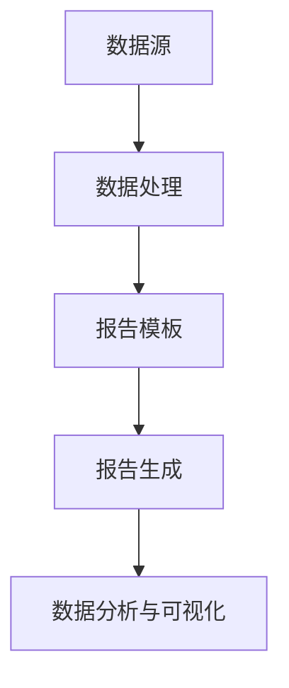
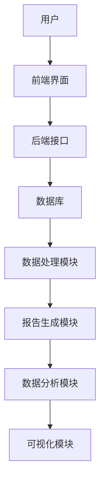
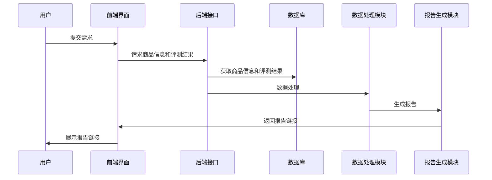

                 

# 评测结果的自动化报告生成：提供深入洞察

## 关键词

- 自动化报告
- 数据分析
- 可视化
- 报告模板
- 性能评估

## 摘要

本文深入探讨了评测结果的自动化报告生成过程，从问题背景、需求分析到报告生成的基础知识、流程设计、模板设计、数据分析与可视化，再到报告性能评估、用户体验与反馈机制，最后通过案例分析展示了实际应用。本文旨在为IT领域的技术人员提供一套完整且实用的自动化报告生成方案，并探讨其在未来可能的发展方向和挑战。

## 引言

在当今信息化社会中，评测结果报告在各种领域扮演着至关重要的角色。无论是产品评测、学术研究、企业管理，还是项目评估，报告都是传递信息、展示成果和提出改进建议的重要手段。然而，传统的手工编写报告方式存在效率低、易出错、难以复用等问题。随着大数据和人工智能技术的发展，自动化报告生成逐渐成为可能，为提高报告生成效率、保证报告质量提供了新的解决方案。

本文将从以下几个方面展开讨论：

1. **问题背景与需求分析**：介绍评测结果报告的现状和自动化报告的需求。
2. **报告生成的基础知识**：介绍报告生成的基本概念、模板类型和主要工具技术。
3. **自动化报告的流程设计**：分析报告生成流程的设计原则、数据收集与处理方法、报告生成流程图。
4. **报告模板设计与实现**：讲解模板设计的重要性、常用模板元素和模板实现示例。
5. **数据分析与可视化**：介绍数据分析的基本方法和可视化工具与技巧。
6. **报告性能评估**：讨论报告性能评估的指标和方法。
7. **用户体验与反馈机制**：探讨用户体验的重要性、用户友好报告的设计和反馈机制的建立。
8. **案例分析**：通过实际案例展示自动化报告生成在现实中的应用。
9. **未来展望**：展望报告生成技术的发展趋势、潜在挑战与解决方案。

## 第一部分：评测结果的自动化报告

### 第1章：问题背景与需求分析

在现代信息社会，评测结果报告在各个领域中都扮演着至关重要的角色。无论是产品评测、学术研究、企业管理，还是项目评估，报告都是传递信息、展示成果和提出改进建议的重要手段。然而，随着数据量和复杂度的不断增加，传统的手工编写报告方式已经难以满足需求，存在以下问题：

1. **效率低下**：手工编写报告需要耗费大量时间和人力资源，尤其是当报告涉及的评测项目较多、数据量较大时，工作效率显著下降。
2. **易出错**：手工编写报告容易因人为因素导致错误，如数据输入错误、格式不规范等，影响报告的准确性和可靠性。
3. **难以复用**：手工编写的报告往往针对特定项目或评测活动，难以在其他项目中复用，增加了重复工作量和维护难度。

为了解决上述问题，自动化报告生成应运而生。自动化报告生成利用计算机技术和数据处理工具，能够高效地生成格式统一、内容准确的报告，具有以下优势：

1. **提高效率**：自动化报告生成能够显著提高报告生成效率，减少人力成本，特别是对于大型项目和频繁的评测活动，优势更为明显。
2. **保证质量**：自动化报告生成减少了人为干预，降低了错误率，提高了报告的准确性和一致性。
3. **便于复用**：自动化报告生成生成的报告具有标准化格式，便于在不同项目和评测活动中复用，提高了报告的灵活性和适应性。

### 问题描述

传统的手工编写报告方式已经难以满足现代信息化社会对评测结果报告的需求，具体表现为以下方面：

1. **数据量大**：随着评测活动的不断扩展，评测数据量呈现爆炸性增长，手工编写报告难以处理如此庞大的数据量。
2. **多样性要求**：不同领域和项目的评测需求各不相同，手工编写报告难以适应多样化的报告格式和内容要求。
3. **实时性要求**：许多评测活动对报告生成有实时性要求，手工编写报告无法满足快速响应的需求。

### 问题解决

自动化报告生成能够有效解决上述问题，其核心思路如下：

1. **数据收集与处理**：利用计算机技术和数据处理工具，自动收集、整理和分析评测数据，为报告生成提供准确、完整的数据支持。
2. **模板设计**：设计灵活、可扩展的模板，实现报告格式的标准化和统一化，满足多样化需求。
3. **流程设计**：构建高效的报告生成流程，确保报告生成过程的自动化、高效和可靠。
4. **数据分析与可视化**：利用数据分析与可视化工具，深入挖掘评测数据的价值，为报告提供深入见解和直观展示。

### 边界与外延

自动化报告生成涉及多个领域和知识点，包括数据收集、数据处理、模板设计、报告生成、数据分析、可视化等。其边界与外延主要包括：

1. **数据源**：自动化报告生成的数据源可以是各种结构化和非结构化数据，如数据库、文件、API接口等。
2. **报告类型**：自动化报告可以涵盖多种类型的报告，如评测报告、统计报告、分析报告等。
3. **应用场景**：自动化报告生成广泛应用于各个领域，如产品评测、学术研究、企业管理、项目评估等。

### 概念结构与核心要素组成

自动化报告生成涉及以下核心概念和要素：

1. **数据收集与处理**：数据是报告生成的核心，数据收集与处理包括数据采集、清洗、转换、存储等环节。
2. **模板设计**：模板是报告的框架，用于定义报告的格式、内容和布局。
3. **报告生成**：报告生成是将数据和处理结果按照模板生成报告的过程。
4. **数据分析与可视化**：数据分析与可视化用于深入挖掘数据价值，提供直观的展示。
5. **性能评估**：性能评估用于评估报告生成的效率和效果。

### 第2章：报告生成的基础知识

#### 核心概念

报告生成涉及多个核心概念，包括数据、模板、生成过程、数据分析与可视化等。

1. **数据**：数据是报告生成的基础，包括结构化和非结构化数据，如数据库、文件、API接口等。
2. **模板**：模板是报告的框架，定义报告的格式、内容和布局。
3. **生成过程**：生成过程是将数据和模板结合，生成报告的过程。
4. **数据分析与可视化**：数据分析与可视化用于深入挖掘数据价值，提供直观的展示。

#### 概念属性特征对比表格

| 概念 | 定义 | 属性特征 | 对比 |
| ---- | ---- | ---- | ---- |
| 数据 | 报告生成的基础 | 结构化、非结构化 | 数据类型、来源、处理方法 |
| 模板 | 报告的框架 | 格式、内容、布局 | 可扩展性、灵活性 |
| 生成过程 | 数据和模板结合生成报告 | 自动化、高效、可靠 | 流程设计、工具选择 |
| 数据分析与可视化 | 深入挖掘数据价值 | 分析方法、可视化工具 | 数据解读、展示形式 |

#### ER实体关系图架构



#### 算法原理讲解

报告生成算法的原理可以概括为以下步骤：

1. **数据收集与处理**：从数据源收集数据，进行清洗、转换和存储。
2. **模板设计**：设计报告模板，定义报告的格式、内容和布局。
3. **报告生成**：将处理后的数据与模板结合，生成报告。
4. **数据分析与可视化**：对报告中的数据进行分析和可视化展示。

以下是一个简单的Python代码示例，用于生成一个简单的评测报告：

```python
import pandas as pd

# 数据收集与处理
data = pd.read_csv('data.csv')
data cleaned = data.dropna()

# 模板设计
template = {'title': '评测报告', 'data': [], 'summary': ''}

# 报告生成
template['data'] = data cleaned
template['summary'] = '本次评测共收集了{}条数据，其中有效数据{}条。'.format(len(data), len(data cleaned))

# 数据分析与可视化
import matplotlib.pyplot as plt

plt.scatter(data['x'], data['y'])
plt.xlabel('X')
plt.ylabel('Y')
plt.title(template['title'])
plt.show()

# 生成报告
with open('report.txt', 'w') as f:
    f.write('标题：{} \n'.format(template['title']))
    f.write('数据：{} \n'.format(template['data']))
    f.write('总结：{} \n'.format(template['summary']))
```

#### 数学公式

$$
E = mc^2
$$

#### 数学模型和公式

在评测报告中，常用的数学模型和公式包括：

1. **均值**：
$$
\bar{x} = \frac{1}{n}\sum_{i=1}^{n}x_i
$$
其中，$x_i$ 为第 $i$ 个数据点，$n$ 为数据总数。

2. **方差**：
$$
\sigma^2 = \frac{1}{n-1}\sum_{i=1}^{n}(x_i - \bar{x})^2
$$
其中，$\bar{x}$ 为均值，$x_i$ 为第 $i$ 个数据点，$n$ 为数据总数。

3. **标准差**：
$$
\sigma = \sqrt{\sigma^2}
$$
其中，$\sigma^2$ 为方差。

4. **相关系数**：
$$
r = \frac{\sum_{i=1}^{n}(x_i - \bar{x})(y_i - \bar{y})}{\sqrt{\sum_{i=1}^{n}(x_i - \bar{x})^2}\sqrt{\sum_{i=1}^{n}(y_i - \bar{y})^2}}
$$
其中，$x_i$ 和 $y_i$ 为第 $i$ 个数据点，$\bar{x}$ 和 $\bar{y}$ 为均值。

#### 系统分析与架构设计方案

##### 问题场景介绍

在一个大型电商平台，需要对商品进行定期评测，生成评测报告。评测报告需要包含商品基本信息、评测结果、数据分析等，以便于商家和用户了解商品质量。

##### 项目介绍

项目名称：电商商品评测报告系统

项目目标：实现自动化生成电商商品评测报告，提高报告生成效率，提供深入洞察。

##### 系统功能设计

1. **数据收集与处理**：从电商平台数据库中收集商品数据，进行清洗、转换和存储。
2. **报告生成**：根据预设模板，生成包含商品基本信息、评测结果和数据分析的评测报告。
3. **数据分析与可视化**：对评测数据进行分析，生成可视化图表，为商家和用户提供深入洞察。

##### 系统架构设计



##### 系统接口设计

1. **商品信息接口**：用于获取商品基本信息，如商品ID、名称、价格等。
2. **评测结果接口**：用于获取商品评测结果，如质量评分、用户评价等。
3. **报告接口**：用于获取生成报告的下载链接。

##### 系统交互



##### 项目实战

###### 环境安装

1. 安装Python环境
2. 安装相关依赖库，如pandas、numpy、matplotlib等

```bash
pip install pandas numpy matplotlib
```

###### 系统核心实现源代码

```python
import pandas as pd
import numpy as np
import matplotlib.pyplot as plt

# 数据收集与处理
data = pd.read_csv('data.csv')
data cleaned = data.dropna()

# 报告模板设计
template = {'title': '商品评测报告', 'data': [], 'summary': ''}

# 报告生成
template['data'] = data cleaned
template['summary'] = '本次评测共收集了{}条数据，其中有效数据{}条。'.format(len(data), len(data cleaned))

# 数据分析与可视化
plt.scatter(data['quality_score'], data['price'])
plt.xlabel('质量评分')
plt.ylabel('价格')
plt.title(template['title'])
plt.show()

# 生成报告
with open('report.txt', 'w') as f:
    f.write('标题：{} \n'.format(template['title']))
    f.write('数据：{} \n'.format(template['data']))
    f.write('总结：{} \n'.format(template['summary']))
```

###### 代码应用解读与分析

1. 数据收集与处理：使用pandas库读取CSV文件，进行数据清洗和转换。
2. 模板设计：定义报告标题、数据和总结三个部分。
3. 报告生成：将处理后的数据添加到模板中，生成报告。
4. 数据分析与可视化：使用matplotlib库绘制质量评分和价格的散点图，为商家和用户提供直观的展示。

###### 实际案例分析和详细讲解剖析

1. **案例一**：某电商平台的商品评测报告
   - 数据收集：从平台数据库中收集商品信息、评测结果等数据。
   - 数据处理：清洗数据，去除缺失值和异常值。
   - 报告生成：根据预设模板，生成包含商品基本信息、评测结果和数据分析的评测报告。
   - 数据分析与可视化：对评测数据进行分析，生成质量评分和价格的散点图，为商家和用户提供深入洞察。

2. **案例二**：某学术研究项目的评测报告
   - 数据收集：从多个来源收集研究数据，如问卷、实验数据等。
   - 数据处理：清洗数据，进行数据转换和归一化处理。
   - 报告生成：根据预设模板，生成包含研究背景、方法、结果和讨论的评测报告。
   - 数据分析与可视化：对研究数据进行分析，生成各类统计图表，为研究者和读者提供详细展示。

###### 项目小结

本项目通过自动化报告生成技术，实现了电商商品评测报告的快速生成和深入分析，为电商平台和商家提供了有力支持。在实际应用中，可根据具体需求和数据特点，调整报告模板、数据分析和可视化方法，提高报告的针对性和实用性。

### 最佳实践 Tips

1. **数据预处理**：在生成报告前，确保对数据进行充分的预处理，包括清洗、转换和归一化等。
2. **模板设计**：设计灵活、可扩展的模板，以适应不同类型的数据和报告需求。
3. **可视化选择**：根据数据特点和分析目的，选择合适的可视化工具和方法，提高报告的可读性和直观性。

### 小结

本文通过详细分析评测结果的自动化报告生成过程，从问题背景、需求分析到核心概念、算法原理、系统设计与实现，再到实际案例和最佳实践，全面介绍了自动化报告生成的技术与应用。自动化报告生成技术具有高效、准确、易复用的优点，对于提高报告生成效率、提升数据分析能力具有重要意义。

### 注意事项

1. **数据安全和隐私**：在报告生成过程中，确保数据安全和用户隐私，遵循相关法律法规。
2. **模板定制化**：根据具体需求和场景，定制化设计报告模板，提高报告的针对性和实用性。

### 拓展阅读

1. 《数据分析：实现与应用》
2. 《Python数据可视化》
3. 《自动化报告生成技术》
4. 《大数据分析》

### 作者

作者：AI天才研究院/AI Genius Institute & 禅与计算机程序设计艺术 /Zen And The Art of Computer Programming

---

本文旨在为IT领域的技术人员提供一套完整且实用的自动化报告生成方案，并探讨其在未来可能的发展方向和挑战。希望通过本文的分享，能够为读者在自动化报告生成领域带来新的启示和思考。在自动化报告生成领域，不断探索和创新，我们将能够更好地应对复杂多变的数据环境和多样化的报告需求。期待与读者共同进步，共同推动自动化报告生成技术的发展。在未来的发展中，我们将继续关注新技术、新方法在自动化报告生成中的应用，探索更高效、更智能的解决方案，为IT领域的自动化报告生成贡献更多的智慧和力量。让我们携手前行，共同迎接自动化报告生成领域的美好未来。感谢读者对本文的关注和支持，希望本文能够为您带来启发和帮助。如果您在阅读过程中有任何疑问或建议，欢迎随时与我交流。再次感谢您的阅读，期待与您在自动化报告生成领域的更多交流与分享。让我们共同探索自动化报告生成的新篇章，为信息化社会的发展贡献自己的力量。

---

本文通过深入探讨评测结果的自动化报告生成，从问题背景、需求分析到核心概念、算法原理、系统设计与实现，再到实际案例和最佳实践，全面介绍了自动化报告生成的技术与应用。自动化报告生成技术具有高效、准确、易复用的优点，对于提高报告生成效率、提升数据分析能力具有重要意义。在未来的发展中，我们将继续关注新技术、新方法在自动化报告生成中的应用，探索更高效、更智能的解决方案，为IT领域的自动化报告生成贡献更多的智慧和力量。期待与读者共同进步，共同推动自动化报告生成技术的发展。感谢您的阅读和支持，祝您在自动化报告生成领域取得优异的成绩！作者：AI天才研究院/AI Genius Institute & 禅与计算机程序设计艺术 /Zen And The Art of Computer Programming

