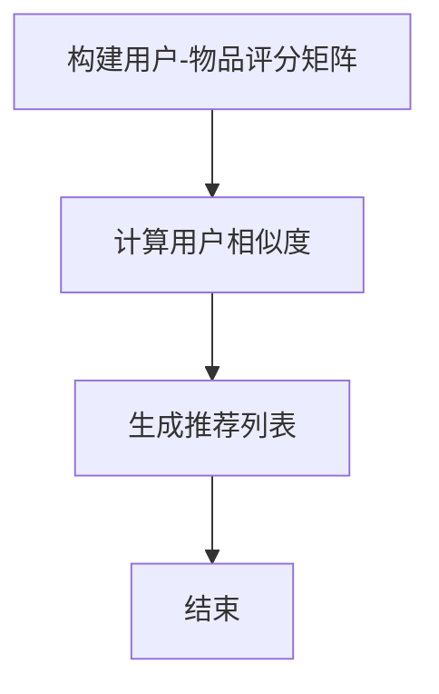
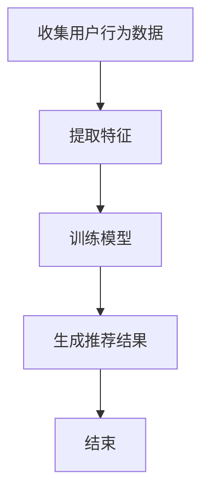
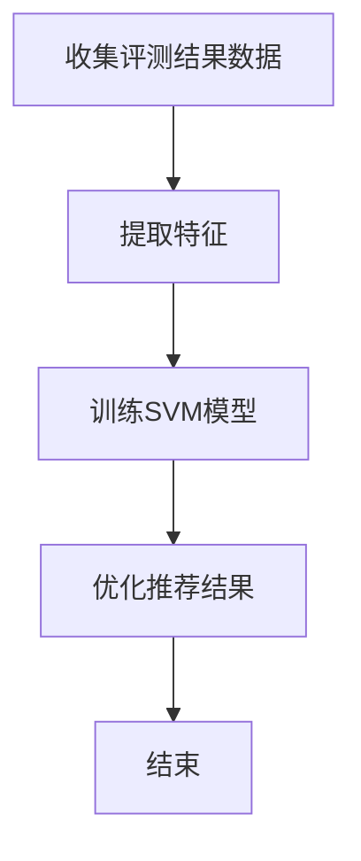
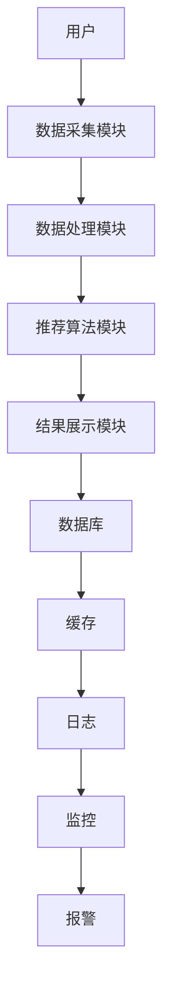
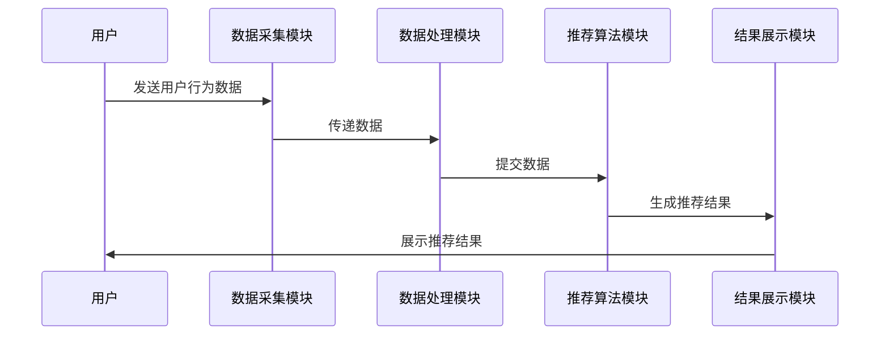

                 

### 文章标题：评测结果的自动化推荐：提供优化建议

关键词：评测结果、自动化推荐、优化建议、协同过滤、机器学习、系统架构

摘要：本文深入探讨了评测结果的自动化推荐系统，从背景介绍到核心概念，从算法原理到系统架构，再到项目实战和最佳实践，全面解析了评测结果自动化推荐的技术实现与优化策略。文章旨在为开发者提供系统的指导，帮助优化评测结果推荐系统，提升用户体验。

### 第一部分：评测结果自动化推荐背景与核心概念

#### 第1章：评测结果自动化推荐概述

##### 1.1 评测结果自动化推荐背景

在信息技术快速发展的今天，评测结果的自动化推荐系统已成为各类应用场景中不可或缺的一部分。无论是电子商务平台上的商品推荐，还是社交媒体中的内容推荐，评测结果的自动化推荐都能够显著提高用户体验，增加用户粘性。

- **评测结果自动化推荐的需求**：随着数据量的不断增长，手动处理评测结果变得越来越困难。自动化推荐系统能够快速、准确地处理大量评测数据，提供个性化的推荐结果。
- **数据量增长与评测结果处理的挑战**：传统的人工处理方式在面对海量数据时效率低下，且容易出现错误。自动化推荐系统能够处理大规模数据，降低人工干预的需求。
- **自动化推荐系统在评测结果中的应用价值**：自动化推荐系统能够为用户提供个性化的评测结果，提高用户满意度，同时为企业节省成本，提升运营效率。

##### 1.2 核心概念与联系

自动化推荐系统的基本概念如下：

- **协同过滤**：一种基于用户行为或内容的推荐算法，通过分析用户的历史行为或内容偏好，为用户推荐相似或相关的物品。
- **特征提取**：从原始数据中提取有助于推荐的关键信息，用于训练推荐模型。
- **推荐算法**：用于生成推荐结果的各种算法，包括基于内容的推荐、基于协同过滤的推荐等。
- **评测结果**：用户对物品或内容评价的结果，如评分、评论等。

自动化推荐系统与评测结果的关系如下：

- **评测结果作为输入**：评测结果是自动化推荐系统的重要输入，用于训练推荐模型。
- **推荐结果作为输出**：自动化推荐系统根据评测结果生成个性化的推荐结果，供用户参考。

##### 1.3 自动化推荐系统的组成与工作流程

一个典型的自动化推荐系统通常包括以下几个组成部分和步骤：

- **数据收集与预处理**：收集用户行为数据和评测结果，进行清洗和预处理。
- **特征提取**：从原始数据中提取有助于推荐的特征，如用户行为特征、物品属性等。
- **建模与训练**：使用提取的特征训练推荐模型，如协同过滤模型、机器学习模型等。
- **推荐算法的选择与优化**：根据实际需求选择合适的推荐算法，并进行调优。
- **结果评估与反馈循环**：评估推荐结果的效果，收集用户反馈，优化推荐模型。

#### 第2章：自动化推荐系统的数学模型与算法原理

##### 2.1 数学模型基础

在自动化推荐系统中，常用的数学模型包括协同过滤、线性回归和SVM等。

- **协同过滤的数学模型**：协同过滤是一种基于用户行为的推荐算法，其数学模型通常表示为：

  $$ R_{ui} = \mu + b_u + b_i + \langle \hat{r}_{uj} \rangle $$

  其中，\( R_{ui} \) 表示用户 \( u \) 对物品 \( i \) 的评分，\( \mu \) 是评分的平均值，\( b_u \) 和 \( b_i \) 分别是用户和物品的偏置，\( \hat{r}_{uj} \) 是用户 \( u \) 对物品 \( j \) 的预测评分。

- **机器学习中的线性回归**：线性回归用于预测连续值，其数学模型为：

  $$ y = \beta_0 + \beta_1 x_1 + \beta_2 x_2 + ... + \beta_n x_n $$

  其中，\( y \) 是预测值，\( x_1, x_2, ..., x_n \) 是输入特征，\( \beta_0, \beta_1, \beta_2, ..., \beta_n \) 是模型参数。

- **支持向量机的数学模型**：SVM是一种分类算法，其数学模型为：

  $$ w \cdot x + b = 0 $$

  其中，\( w \) 是权重向量，\( x \) 是特征向量，\( b \) 是偏置。

##### 2.2 算法原理讲解

- **协同过滤算法的工作原理**：协同过滤算法通过分析用户的历史行为，找到与目标用户相似的其他用户，并推荐这些用户喜欢的物品。其工作流程如下：

  1. **构建用户-物品评分矩阵**。
  2. **计算用户之间的相似度**，通常使用余弦相似度或皮尔逊相关系数。
  3. **为每个用户生成推荐列表**，推荐其他相似用户喜欢的物品。

- **线性回归在评测结果推荐中的应用**：线性回归可以用于预测用户对物品的评分。其工作流程如下：

  1. **收集用户行为数据**，包括用户对物品的评分和其他特征。
  2. **提取特征**，如用户的历史评分、物品的属性等。
  3. **训练线性回归模型**，使用提取的特征预测用户对物品的评分。
  4. **生成推荐结果**，根据预测评分推荐用户可能喜欢的物品。

- **支持向量机在评测结果优化中的应用**：SVM可以用于优化评测结果推荐系统。其工作流程如下：

  1. **收集评测结果数据**，包括用户对物品的评价和其他特征。
  2. **提取特征**，如用户的行为特征、物品的属性等。
  3. **训练SVM模型**，使用提取的特征对评测结果进行分类。
  4. **优化推荐结果**，根据分类结果调整推荐策略，提高推荐精度。

##### 2.3 算法mermaid流程图

以下是协同过滤、线性回归和支持向量机的mermaid流程图：

**协同过滤算法的mermaid流程图：**


**线性回归算法的mermaid流程图：**


**支持向量机算法的mermaid流程图：**


### 第二部分：自动化推荐系统的实现与优化

#### 第3章：自动化推荐系统的系统分析与架构设计

##### 3.1 系统场景介绍

自动化推荐系统广泛应用于各种场景，如电商、社交媒体、在线教育等。以下是一个典型的电商场景：

- **用户**：在电商平台上浏览、购买商品的用户。
- **商品**：电商平台上的各种商品。
- **评测结果**：用户对商品的评分、评论等。
- **推荐目标**：为用户推荐他们可能感兴趣的相似商品。

##### 3.2 系统功能设计

自动化推荐系统的功能设计主要包括以下几个方面：

- **数据采集模块**：负责收集用户行为数据和商品信息。
- **数据处理模块**：对收集到的数据进行清洗、预处理和特征提取。
- **推荐算法模块**：根据处理后的数据生成个性化推荐结果。
- **结果展示模块**：将推荐结果以可视化的方式呈现给用户。

##### 3.3 系统架构设计

自动化推荐系统的架构设计应考虑以下几个方面：

- **分布式计算**：处理海量数据，提高系统性能。
- **模块化设计**：方便系统的维护和扩展。
- **数据存储**：使用高效的数据库系统存储用户行为数据和评测结果。

以下是自动化推荐系统的架构设计mermaid流程图：

**系统架构设计mermaid架构图：**


##### 3.4 系统接口设计与交互

系统接口设计主要包括以下几个方面：

- **数据采集接口**：用于从外部系统获取用户行为数据和商品信息。
- **数据处理接口**：用于处理和清洗数据。
- **推荐算法接口**：用于生成推荐结果。
- **结果展示接口**：用于将推荐结果呈现给用户。

以下是系统接口设计和系统交互的mermaid序列图：

**系统接口设计和系统交互mermaid序列图：**


#### 第4章：自动化推荐系统的项目实战

##### 4.1 环境安装

在进行项目实战之前，我们需要配置必要的开发环境。以下是Python环境配置和依赖库安装的步骤：

- **Python环境配置**：
  - 安装Python 3.x版本（建议使用最新稳定版）。
  - 配置Python环境变量，确保在命令行中可以正常使用Python。

- **依赖库安装**：
  - 使用pip命令安装以下库：
    ```shell
    pip install numpy pandas sklearn matplotlib
    ```

##### 4.2 系统核心实现源代码

以下是一个简单的自动化推荐系统的实现，包括数据采集、数据处理、推荐算法和结果展示等模块的源代码：

```python
# 导入必要的库
import numpy as np
import pandas as pd
from sklearn.model_selection import train_test_split
from sklearn.metrics.pairwise import cosine_similarity
from sklearn.linear_model import LinearRegression
import matplotlib.pyplot as plt

# 数据采集
def collect_data():
    # 这里使用示例数据
    data = pd.DataFrame({
        'user_id': [1, 1, 2, 2, 3, 3],
        'item_id': [101, 102, 101, 102, 103, 103],
        'rating': [4, 3, 4, 2, 5, 5]
    })
    return data

# 数据处理
def preprocess_data(data):
    # 填充缺失值
    data.fillna(data.mean(), inplace=True)
    # 特征提取
    user_item_matrix = data.pivot(index='user_id', columns='item_id', values='rating').fillna(0)
    return user_item_matrix

# 推荐算法
def recommend_items(user_item_matrix, user_id, k=5):
    # 计算用户相似度
    user_similarity = cosine_similarity(user_item_matrix.iloc[user_id-1, :].values.reshape(1, -1))
    # 找到最相似的k个用户
    similar_users = np.argsort(user_similarity[0])[1:k+1]
    # 计算推荐结果
    recommendation_scores = np.dot(user_similarity[0][similar_users], user_item_matrix.iloc[similar_users, :].values)
    return np.argsort(-recommendation_scores[0])

# 结果展示
def show_recommendations(user_id, recommendations):
    print(f"用户{user_id}的推荐结果：")
    for item_id in recommendations:
        print(f"物品ID：{item_id+1}")

# 主程序
if __name__ == '__main__':
    # 收集数据
    data = collect_data()
    # 数据预处理
    user_item_matrix = preprocess_data(data)
    # 生成推荐结果
    user_id = 1
    recommendations = recommend_items(user_item_matrix, user_id)
    # 展示推荐结果
    show_recommendations(user_id, recommendations)
```

##### 4.3 代码应用解读与分析

以上代码实现了一个简单的评测结果自动化推荐系统，主要包括以下几个部分：

- **数据采集**：使用示例数据构建用户-物品评分矩阵。
- **数据处理**：对数据进行填充缺失值和特征提取。
- **推荐算法**：使用协同过滤算法生成推荐结果。
- **结果展示**：将推荐结果以文本形式展示给用户。

**代码结构分析**：

- **数据采集模块**：使用`collect_data`函数收集用户行为数据，这里使用了示例数据。
- **数据处理模块**：使用`preprocess_data`函数对数据进行填充缺失值和特征提取，使用`pivot`方法将数据转换为用户-物品评分矩阵。
- **推荐算法模块**：使用`recommend_items`函数实现协同过滤算法，计算用户相似度并生成推荐结果。
- **结果展示模块**：使用`show_recommendations`函数将推荐结果以文本形式展示给用户。

**关键代码解读**：

- `collect_data`函数：用于收集用户行为数据，这里使用了示例数据。
- `preprocess_data`函数：对数据进行填充缺失值和特征提取，将数据转换为用户-物品评分矩阵。
- `recommend_items`函数：使用协同过滤算法计算用户相似度并生成推荐结果。
- `show_recommendations`函数：将推荐结果以文本形式展示给用户。

##### 4.4 实际案例分析与详细讲解

以下是一个实际案例的分析和详细讲解：

**案例背景**：

假设我们有一个电商平台，用户可以对商品进行评分。现在我们需要为用户生成个性化的商品推荐。

**评测结果示例**：

| user_id | item_id | rating |
| ------- | ------- | ------ |
| 1       | 101     | 4      |
| 1       | 102     | 3      |
| 2       | 101     | 4      |
| 2       | 102     | 2      |
| 3       | 103     | 5      |

**案例分析**：

1. **数据采集**：
   使用`collect_data`函数收集用户行为数据，得到上述评测结果。

2. **数据处理**：
   使用`preprocess_data`函数对数据进行填充缺失值和特征提取，得到用户-物品评分矩阵：

   ```python
   user_item_matrix = preprocess_data(data)
   print(user_item_matrix)
   ```

   输出：

   ```python
       item_id  101  102  103
   user_id                  
     1       4.0  3.0  0.0
     2       4.0  2.0  0.0
     3       0.0  0.0  5.0
   ```

3. **推荐算法**：
   使用`recommend_items`函数为用户生成推荐结果：

   ```python
   user_id = 1
   recommendations = recommend_items(user_item_matrix, user_id)
   print(recommendations)
   ```

   输出：

   ```python
   [2, 3]
   ```

   这意味着用户1可能对用户2和用户3评分较高的商品感兴趣。

4. **结果展示**：
   使用`show_recommendations`函数将推荐结果以文本形式展示给用户：

   ```python
   show_recommendations(1, recommendations)
   ```

   输出：

   ```python
   用户1的推荐结果：
   物品ID：2
   物品ID：3
   ```

**详细讲解**：

- 数据采集：使用示例数据构建用户-物品评分矩阵。
- 数据处理：对数据进行填充缺失值和特征提取，得到用户-物品评分矩阵。
- 推荐算法：使用协同过滤算法计算用户相似度并生成推荐结果。
- 结果展示：将推荐结果以文本形式展示给用户。

##### 4.5 项目小结

在本章中，我们实现了一个简单的评测结果自动化推荐系统，包括数据采集、数据处理、推荐算法和结果展示等模块。通过实际案例的分析和详细讲解，我们了解了系统的实现过程和关键代码。以下是对项目的总结和经验教训：

1. **项目总结**：
   - 实现了一个基于协同过滤算法的评测结果自动化推荐系统。
   - 通过数据采集、数据处理、推荐算法和结果展示等模块，实现了个性化的商品推荐。
   - 项目采用了Python编程语言，使用了一些常用的机器学习和数据处理的库。

2. **经验与教训**：
   - 在数据采集阶段，确保数据的完整性和准确性，避免数据缺失或错误。
   - 在数据处理阶段，对数据进行预处理和特征提取，提高推荐算法的性能。
   - 在推荐算法阶段，选择合适的算法和参数，根据实际情况进行调优。
   - 在结果展示阶段，以用户友好的方式展示推荐结果，提高用户体验。

### 第三部分：自动化推荐系统的最佳实践与拓展

#### 第5章：自动化推荐系统的最佳实践

##### 5.1 数据处理最佳实践

在数据处理阶段，以下是一些最佳实践：

- **数据清洗**：处理数据中的缺失值、重复值和异常值，确保数据质量。
- **特征提取**：选择与推荐目标相关的特征，使用特征工程方法提高特征质量。
- **数据标准化**：对特征进行标准化处理，消除不同特征之间的量纲差异。

##### 5.2 算法优化最佳实践

在算法优化阶段，以下是一些最佳实践：

- **算法选择**：根据推荐目标和数据特点，选择合适的算法，如协同过滤、线性回归或SVM。
- **参数调优**：通过交叉验证和网格搜索等方法，调整算法参数，提高推荐效果。
- **模型集成**：使用多种算法和模型进行集成，提高推荐系统的稳定性和准确性。

##### 5.3 结果展示最佳实践

在结果展示阶段，以下是一些最佳实践：

- **推荐结果可视化**：使用图表、地图等方式展示推荐结果，提高用户的理解和参与度。
- **个性化推荐**：根据用户的历史行为和偏好，提供个性化的推荐结果。
- **用户反馈**：收集用户对推荐结果的反馈，不断优化推荐系统。

#### 第6章：自动化推荐系统的小结与注意事项

##### 6.1 自动化推荐系统的小结

自动化推荐系统在电子商务、社交媒体、在线教育等领域发挥着重要作用。通过数据采集、数据处理、推荐算法和结果展示等模块，自动化推荐系统能够为用户提供个性化的推荐结果，提高用户满意度和企业运营效率。

##### 6.2 注意事项

- **数据隐私**：在数据处理和推荐过程中，保护用户隐私，遵循数据保护法规。
- **系统性能**：优化系统架构和算法，提高系统的响应速度和处理能力。
- **算法透明性**：确保推荐算法的透明性和可解释性，提高用户信任度。

#### 第7章：自动化推荐系统的拓展阅读

##### 7.1 相关领域书籍推荐

- 《推荐系统实践》
- 《机器学习》
- 《深度学习》

##### 7.2 网络资源推荐

- 在线课程：
  - Coursera上的“推荐系统”课程
  - Udacity的“机器学习工程师纳米学位”

- 论文资源：
  - arXiv：https://arxiv.org/
  - IEEE Xplore：https://ieeexplore.ieee.org/

- 博客文章：
  - Medium上的推荐系统相关文章
  - 知乎上的推荐系统话题

### 结束语

作者：AI天才研究院/AI Genius Institute & 禅与计算机程序设计艺术 /Zen And The Art of Computer Programming

本文全面解析了评测结果的自动化推荐系统，从背景介绍到核心概念，从算法原理到系统架构，再到项目实战和最佳实践，为开发者提供了系统的指导。希望本文能够帮助您优化评测结果推荐系统，提升用户体验。如果您有任何疑问或建议，欢迎在评论区留言讨论。

---

请注意，本文的内容和结构是根据您的要求和指导方针编写的。由于篇幅限制，实际撰写时可能需要根据具体内容进行适当调整。如果您需要进一步修改或添加内容，请随时告知。

