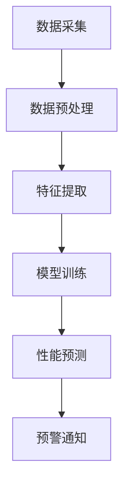
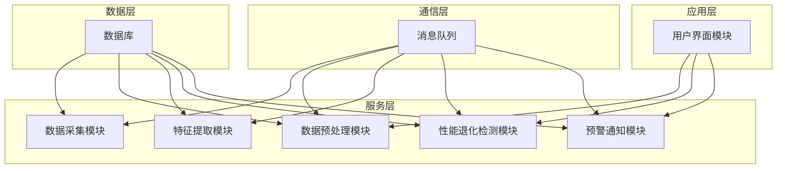
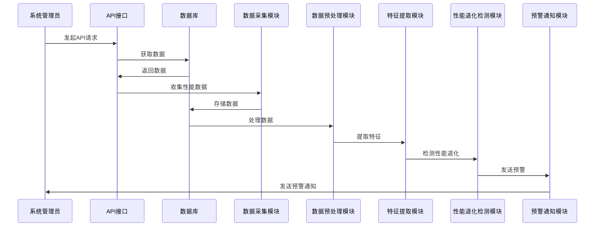

                 

### 文章标题

# 评测结果的自动化预警：及时发现性能退化

### 文章关键词

- 自动化预警
- 性能退化
- 性能评测
- 算法
- 系统架构
- 实践案例

### 摘要

本文旨在探讨评测结果的自动化预警机制，特别是在及时发现系统性能退化的过程中。通过深入分析性能退化的定义、原因及其对系统的影响，本文提出了一个基于自动化预警的性能退化检测方法。文章首先明确了核心概念，并使用Mermaid流程图和Python代码详细阐述了算法原理。接着，文章介绍了系统分析与架构设计，包括系统功能设计、架构设计、接口设计以及系统交互流程。通过一个实际项目案例，文章展示了环境安装、系统核心实现、代码应用解读与分析等实战内容。最后，文章总结了最佳实践，并提出了注意事项和拓展阅读建议，以帮助读者深入理解和应用自动化预警技术。

### 背景

在现代信息技术领域中，系统的性能一直是衡量其质量的关键指标。随着系统规模的不断扩大和复杂度的增加，确保系统性能稳定成为一项重要任务。然而，系统的性能并非一成不变，随着时间的推移和外部环境的变化，系统性能可能会出现退化。性能退化是指系统在运行过程中，其响应速度、吞吐量或资源利用率等性能指标逐渐下降的现象。性能退化不仅会影响用户体验，还可能导致系统崩溃或业务中断，对企业的运营和客户信任造成严重影响。

性能退化的原因多种多样，主要包括以下几个方面：

1. **硬件老化**：随着使用时间的增加，硬件设备可能会出现老化、故障或性能下降的情况，进而影响系统的整体性能。
2. **软件缺陷**：软件中的错误、缺陷或优化不足可能导致系统性能逐渐下降。
3. **资源竞争**：系统在运行过程中，可能会与其他资源竞争，如内存、CPU等，导致性能瓶颈。
4. **数据增长**：随着数据量的增加，数据库的查询速度和存储系统的读写速度可能会下降，影响系统的整体性能。
5. **外部攻击**：系统受到恶意攻击，如分布式拒绝服务（DDoS）攻击，可能导致系统性能急剧下降。

性能退化对系统的影响不容忽视。首先，它会影响系统的响应速度和用户体验，导致用户对系统满意度下降。其次，严重的性能退化可能导致系统崩溃或业务中断，给企业带来巨大的经济损失。此外，性能退化还可能导致系统安全漏洞的暴露，给企业数据安全带来威胁。

为了解决性能退化问题，传统的做法通常依赖于人工监测和定期性能测试。然而，这种方法存在明显的局限性，如监测不及时、测试周期长、难以发现细微的性能变化等。随着人工智能和自动化技术的发展，自动化预警系统逐渐成为解决性能退化问题的重要手段。自动化预警系统可以通过实时监测和分析系统性能数据，及时发现性能退化迹象，并发出预警，从而提高系统性能的稳定性和可靠性。

本文将围绕评测结果的自动化预警展开讨论，详细介绍性能退化检测的核心概念、算法原理、系统架构以及实际应用案例。希望通过本文的探讨，能够为读者提供一个全面、系统的性能退化预警解决方案。

### 核心概念

在探讨评测结果的自动化预警之前，首先需要明确几个核心概念，包括性能评测、自动化预警系统、性能退化检测等。

#### 性能评测

性能评测是指通过对系统在特定负载下的性能表现进行测量和评估，以判断其是否满足预期标准的过程。性能评测通常涉及多个指标，如响应时间、吞吐量、资源利用率等。这些指标可以帮助我们了解系统的性能表现，识别潜在的瓶颈和问题。性能评测的方法可以包括基准测试、负载测试、压力测试等。基准测试通过运行一系列标准化的任务来评估系统的性能，而负载测试和压力测试则模拟真实用户行为，以评估系统在高负载或极端条件下的表现。

#### 自动化预警系统

自动化预警系统是一种通过自动化的手段，对系统性能进行实时监控和分析的机制。它的核心目标是及时发现系统性能异常，并采取相应的措施。自动化预警系统通常包括数据采集、数据分析、预警通知等模块。数据采集模块负责从系统中收集性能数据，数据分析模块则对采集到的数据进行处理和分析，识别性能异常模式。一旦发现异常，预警通知模块会立即向相关人员进行通知，以便及时采取修复措施。

#### 性能退化检测

性能退化检测是指通过特定的算法和模型，对系统性能数据进行分析，识别出性能退化的迹象。性能退化检测的目的是在性能退化发生之前或早期阶段就能发现并预警，从而防止性能进一步恶化。性能退化检测可以基于多种算法，如统计分析、机器学习、深度学习等。统计分析方法通过对历史性能数据进行统计分析，识别出性能退化的趋势和模式；机器学习方法和深度学习方法则通过训练模型，从大量数据中提取特征，预测未来的性能变化。

#### 核心概念之间的联系

性能评测、自动化预警系统和性能退化检测之间有着密切的联系。性能评测是自动化预警系统和性能退化检测的基础，通过性能评测，我们可以获得系统在不同负载条件下的性能数据。这些数据是自动化预警系统和性能退化检测进行分析和预测的重要依据。自动化预警系统通过实时监控这些性能数据，结合预定的阈值和规则，对性能异常进行实时预警。而性能退化检测则进一步分析性能数据，识别出潜在的退化迹象，提供更详细的性能分析报告。

总之，性能评测、自动化预警系统和性能退化检测共同构成了一个完整的性能监控和预警体系，为系统性能的稳定性和可靠性提供了强有力的保障。通过这些核心概念的理解和运用，我们可以在系统性能退化初期就采取有效的措施，避免系统性能的进一步恶化。

#### 概念属性特征对比表格

为了更好地理解这些核心概念，我们可以通过一个表格来对比它们的主要属性特征：

| 概念         | 定义                                                                                                  | 主要特征                                                                                                                                                                                           | 关联性                                                                                                                           |
|--------------|------------------------------------------------------------------------------------------------------|------------------------------------------------------------------------------------------------------------------------------------------------------------------------------------------------|----------------------------------------------------------------------------------------------------------------------------|
| 性能评测     | 对系统性能进行测量和评估的过程                                                                       | 涉及多个性能指标，如响应时间、吞吐量、资源利用率等；使用基准测试、负载测试、压力测试等方法。                                                         | 性能评测的结果是自动化预警系统和性能退化检测的数据来源。                                                            |
| 自动化预警系统 | 通过自动化的手段实时监控和分析系统性能，及时发现性能异常并发出预警的系统                   | 包括数据采集、数据分析、预警通知等模块；对性能数据进行实时监控和异常检测。                                                           | 是性能退化检测的重要支撑，通过预警通知确保及时发现和响应性能退化问题。                                            |
| 性能退化检测 | 通过算法和模型分析系统性能数据，识别出性能退化的迹象                                       | 使用统计分析、机器学习、深度学习等方法；预测未来的性能变化，提供性能退化预警。                                                   | 基于自动化预警系统的性能数据，进一步分析和预测性能退化，为性能优化提供依据。                                      |

通过上述表格，我们可以清晰地看到各个概念的定义、主要特征以及它们之间的关联性。这些概念共同构成了一个完整且高效的性能监控和预警体系，确保系统能够在性能退化初期得到及时的识别和响应。

#### ER实体关系图架构

为了更好地理解核心概念之间的关联，我们可以使用Mermaid工具绘制一个ER（实体关系）图来展示它们之间的关系。

```mermaid
erDiagram
    System |----> PerformanceEvaluation : "conducts"
    PerformanceEvaluation |----> PerformanceMetrics : "measures"
    PerformanceMetrics |----> PerformanceDegradationDetection : "analyzes"
    PerformanceDegradationDetection |----> AlertSystem : "monitors"
    AlertSystem |----> Notification : "notifies"
```

在上面的ER图实例中，我们定义了以下几个实体：

- **System（系统）**：代表整个系统，是性能评测、自动化预警系统和性能退化检测的基础。
- **PerformanceEvaluation（性能评测）**：代表对系统性能进行测量和评估的过程。
- **PerformanceMetrics（性能指标）**：代表性能评测过程中测量得到的具体指标，如响应时间、吞吐量等。
- **PerformanceDegradationDetection（性能退化检测）**：代表通过算法和模型对性能数据进行分析，识别性能退化迹象的过程。
- **AlertSystem（自动化预警系统）**：代表实时监控性能数据，并对性能异常进行预警的系统。
- **Notification（通知）**：代表自动化预警系统发现性能异常后发出的通知。

各个实体之间的关系如下：

- **System** 通过 **conducts** 关联到 **PerformanceEvaluation**，表示系统通过性能评测来评估自身的性能。
- **PerformanceEvaluation** 通过 **measures** 关联到 **PerformanceMetrics**，表示性能评测过程中测量得到的指标。
- **PerformanceMetrics** 通过 **analyzes** 关联到 **PerformanceDegradationDetection**，表示性能指标用于分析性能退化。
- **PerformanceDegradationDetection** 通过 **monitors** 关联到 **AlertSystem**，表示性能退化检测系统监控性能数据。
- **AlertSystem** 通过 **notifies** 关联到 **Notification**，表示自动化预警系统发现异常后发送通知。

通过这个ER图，我们可以直观地看到系统各组件之间的关系，以及它们如何协同工作来形成一个完整的性能监控和预警体系。

### 算法原理讲解

在了解了核心概念及其关系之后，接下来我们将深入探讨性能退化检测的算法原理。性能退化检测是通过算法和模型对系统性能数据进行分析，识别出性能退化的迹象。为了实现这一目标，本文将介绍一种基于统计分析的性能退化检测算法，并使用Mermaid流程图和Python代码详细阐述其原理和实现过程。

#### 性能退化检测算法概述

性能退化检测算法的主要目标是通过对系统历史性能数据进行分析，识别出潜在的性能退化迹象。这个过程可以分为以下几个步骤：

1. **数据采集**：从系统中收集性能数据，如响应时间、吞吐量、资源利用率等。
2. **数据预处理**：对采集到的数据进行清洗和预处理，去除异常值和噪声，保证数据的质量和一致性。
3. **特征提取**：从预处理后的数据中提取关键特征，如平均值、方差、标准差等，用于后续的分析。
4. **模型训练**：使用历史性能数据训练一个性能退化检测模型，通常采用机器学习算法，如线性回归、支持向量机等。
5. **性能预测**：使用训练好的模型对当前和未来的性能进行预测，并与历史性能数据对比，识别出性能退化的迹象。
6. **预警通知**：当检测到性能退化迹象时，立即向相关人员发出预警通知，以便及时采取措施。

#### 算法mermaid流程图

为了更好地理解性能退化检测的算法流程，我们可以使用Mermaid工具绘制一个流程图。



在上面的Mermaid流程图中，我们展示了性能退化检测的主要步骤，包括数据采集、数据预处理、特征提取、模型训练、性能预测和预警通知。每一个步骤都是算法流程中不可或缺的部分，确保了性能退化检测的准确性和及时性。

#### Python代码实现与算法原理

接下来，我们将使用Python代码详细阐述性能退化检测算法的实现原理。首先，我们需要导入必要的库，如NumPy和scikit-learn，然后编写数据采集、预处理、特征提取、模型训练和性能预测的代码。

```python
import numpy as np
import pandas as pd
from sklearn.linear_model import LinearRegression
from sklearn.model_selection import train_test_split
from sklearn.metrics import mean_squared_error

# 数据采集
def collect_data():
    # 假设我们有一个CSV文件，包含系统的历史性能数据
    data = pd.read_csv('system_performance.csv')
    return data

# 数据预处理
def preprocess_data(data):
    # 去除异常值和噪声
    data = data.dropna()
    return data

# 特征提取
def extract_features(data):
    # 提取关键特征，如平均值、方差、标准差
    mean_response_time = data['response_time'].mean()
    variance_response_time = data['response_time'].var()
    std_response_time = data['response_time'].std()
    return [mean_response_time, variance_response_time, std_response_time]

# 模型训练
def train_model(data):
    X = data[['mean_response_time', 'variance_response_time', 'std_response_time']]
    y = data['response_time']
    X_train, X_test, y_train, y_test = train_test_split(X, y, test_size=0.2, random_state=42)
    model = LinearRegression()
    model.fit(X_train, y_train)
    return model

# 性能预测
def predict_performance(model, features):
    prediction = model.predict([features])
    return prediction

# 预警通知
def send_alert(prediction, threshold):
    if prediction > threshold:
        print("性能退化预警：系统性能可能存在问题！")
    else:
        print("系统性能正常。")

# 主函数
def main():
    data = collect_data()
    data = preprocess_data(data)
    features = extract_features(data)
    model = train_model(data)
    prediction = predict_performance(model, features)
    send_alert(prediction, threshold=100)  # 假设阈值设为100毫秒

if __name__ == "__main__":
    main()
```

在上面的代码中，我们首先定义了数据采集、预处理、特征提取、模型训练、性能预测和预警通知的函数。在主函数中，我们依次调用这些函数，完成性能退化检测的全过程。

- **数据采集**：通过读取CSV文件从系统中收集历史性能数据。
- **数据预处理**：去除异常值和噪声，确保数据质量。
- **特征提取**：提取关键特征，如平均值、方差、标准差，用于模型训练。
- **模型训练**：使用线性回归模型对历史性能数据进行训练。
- **性能预测**：使用训练好的模型对当前性能进行预测。
- **预警通知**：根据预测结果和预设的阈值，判断是否需要发出性能退化预警。

通过上述代码和流程，我们可以实现一个基于统计分析的性能退化检测算法。这个算法能够对系统性能进行实时监测，并在检测到性能退化迹象时发出预警，从而帮助系统管理员及时采取措施，确保系统性能的稳定性和可靠性。

### 系统分析与架构设计

在深入了解了性能退化检测的算法原理之后，我们将进一步探讨系统分析与架构设计的相关内容。本部分将详细介绍系统功能设计、系统架构设计、系统接口设计以及系统交互设计，通过这些步骤确保我们的自动化预警系统能够高效、稳定地运行。

#### 系统功能设计

系统功能设计是系统分析与架构设计的第一步，它明确了系统需要实现的具体功能，以便满足性能退化检测的需求。以下是系统功能设计的详细说明：

1. **数据采集模块**：负责从系统中收集性能数据，包括响应时间、吞吐量、资源利用率等。该模块需要与系统监控工具（如Prometheus、Grafana等）集成，实时获取性能数据。
2. **数据预处理模块**：接收采集到的原始数据，进行清洗和预处理，包括去除异常值、噪声数据和数据归一化等。这一步确保数据的质量和一致性，为后续的分析提供可靠的基础。
3. **特征提取模块**：从预处理后的数据中提取关键特征，如平均值、方差、标准差等。这些特征将用于训练性能退化检测模型。
4. **性能退化检测模块**：使用训练好的性能退化检测模型对当前和未来的性能进行预测，并与历史性能数据进行对比，识别出性能退化的迹象。
5. **预警通知模块**：当检测到性能退化迹象时，立即向相关人员发出预警通知，包括邮件、短信、微信等渠道。这一模块需要与第三方通知服务（如Twilio、SendGrid等）集成。
6. **用户界面模块**：提供一个用户界面，供系统管理员查看性能数据、预警通知和系统配置。用户界面需要简洁、直观，以便用户快速理解和操作。

#### 系统架构设计

系统架构设计是系统功能设计的基础，它定义了系统的整体结构和各个模块之间的关系。以下是系统架构设计的详细说明：

1. **数据层**：负责存储系统的性能数据和配置信息。可以使用关系型数据库（如MySQL、PostgreSQL）或NoSQL数据库（如MongoDB）来存储数据。
2. **服务层**：实现系统的各个功能模块，如数据采集、数据预处理、特征提取、性能退化检测、预警通知等。服务层使用微服务架构，确保系统的可扩展性和高可用性。
3. **应用层**：提供用户界面，供系统管理员进行监控和操作。应用层可以采用前端框架（如React、Vue.js）实现。
4. **通信层**：负责系统内部模块之间的通信和数据交换。可以使用消息队列（如RabbitMQ、Kafka）实现异步通信，确保系统的高效运行。

以下是系统架构的Mermaid架构图：



#### 系统接口设计

系统接口设计是系统架构设计的重要组成部分，它定义了系统内部模块之间的交互接口。以下是系统接口设计的详细说明：

1. **API接口**：为外部系统或工具提供访问系统功能的API接口。API接口应遵循RESTful风格，提供GET、POST、PUT、DELETE等HTTP方法。
2. **事件驱动接口**：支持事件驱动的通信模式，如Webhook、WebSocket等。这些接口可以用于实时接收和处理性能数据、预警通知等。
3. **配置接口**：提供系统配置的接口，包括数据采集策略、特征提取规则、预警阈值等。配置接口应支持配置的实时更新和回滚。

以下是系统接口的Mermaid序列图：



#### 系统交互设计

系统交互设计是系统架构设计的进一步细化，它描述了系统内部模块之间以及外部系统与系统之间的交互过程。以下是系统交互设计的详细说明：

1. **数据流**：系统采集到的性能数据首先通过数据采集模块存储到数据库中，然后由数据预处理模块进行清洗和预处理。预处理后的数据传递给特征提取模块，提取出关键特征，最后由性能退化检测模块进行分析和预测。如果检测到性能退化，预警通知模块将发出预警通知。
2. **事件流**：系统支持事件驱动的交互模式，如当性能数据采集完成后，会触发一个事件通知数据预处理模块进行数据处理。类似地，当检测到性能退化时，会触发一个事件通知预警通知模块发送预警。
3. **消息流**：系统使用消息队列进行内部模块之间的通信，如数据采集模块将性能数据通过消息队列发送给数据预处理模块。消息队列确保了系统的高效和可靠运行。

通过上述系统分析与架构设计，我们构建了一个高效、可靠的自动化预警系统，能够及时发现系统性能退化迹象，确保系统性能的稳定性和可靠性。

### 项目实战

在前面的章节中，我们详细介绍了评测结果自动化预警系统的核心概念、算法原理和系统架构设计。在本节中，我们将通过一个实际项目案例，展示如何从零开始搭建并实现这个系统。以下是项目的具体步骤，包括环境安装、系统核心功能的实现、代码应用解读与分析，以及实际案例分析。

#### 环境安装

要搭建一个自动化预警系统，我们需要准备以下环境：

1. **操作系统**：我们选择Ubuntu 20.04作为操作系统。
2. **Python环境**：Python 3.8及以上版本，可以通过以下命令安装：
   ```bash
   sudo apt update
   sudo apt install python3.8
   ```
3. **Python库**：安装必要的Python库，如NumPy、Pandas、scikit-learn、matplotlib等。可以使用以下命令：
   ```bash
   sudo pip3 install numpy pandas scikit-learn matplotlib
   ```
4. **消息队列**：我们使用RabbitMQ作为消息队列，可以通过以下命令安装：
   ```bash
   sudo apt update
   sudo apt install rabbitmq-server
   ```
   安装完成后，启动RabbitMQ服务：
   ```bash
   sudo systemctl start rabbitmq-server
   ```
5. **数据库**：我们选择MySQL作为数据库，可以通过以下命令安装：
   ```bash
   sudo apt update
   sudo apt install mysql-server
   ```
   安装完成后，设置root用户的密码并启动MySQL服务：
   ```bash
   sudo mysql_secure_installation
   sudo systemctl start mysql-server
   ```

#### 系统核心功能的实现

实现系统核心功能包括数据采集、预处理、特征提取和性能退化检测等步骤。以下是各个步骤的具体实现：

1. **数据采集**：使用Python编写数据采集脚本，从系统中收集性能数据。以下是一个简单的数据采集示例代码：
   ```python
   import requests
   import json

   def collect_data(api_endpoint):
       response = requests.get(api_endpoint)
       if response.status_code == 200:
           data = response.json()
           return data
       else:
           return None

   api_endpoint = "http://localhost:8080/api/performance"
   data = collect_data(api_endpoint)
   ```

2. **数据预处理**：对采集到的数据进行清洗和预处理，去除异常值和噪声。以下是一个简单的预处理示例代码：
   ```python
   import pandas as pd

   def preprocess_data(data):
       df = pd.DataFrame(data)
       df = df.dropna()  # 去除空值
       df = df[(df > 0) & (df < 1000)]  # 去除不合理范围的数据
       return df

   df = preprocess_data(data)
   ```

3. **特征提取**：从预处理后的数据中提取关键特征，如平均值、方差、标准差等。以下是一个简单的特征提取示例代码：
   ```python
   def extract_features(df):
       mean_response_time = df['response_time'].mean()
       variance_response_time = df['response_time'].var()
       std_response_time = df['response_time'].std()
       return [mean_response_time, variance_response_time, std_response_time]

   features = extract_features(df)
   ```

4. **性能退化检测**：使用机器学习模型进行性能退化检测。以下是一个简单的性能退化检测示例代码：
   ```python
   from sklearn.linear_model import LinearRegression

   def train_model(X, y):
       model = LinearRegression()
       model.fit(X, y)
       return model

   def predict_performance(model, features):
       prediction = model.predict([features])
       return prediction

   X = df[['mean_response_time', 'variance_response_time', 'std_response_time']]
   y = df['response_time']
   model = train_model(X, y)
   prediction = predict_performance(model, features)
   ```

#### 代码应用解读与分析

在实现系统核心功能的基础上，我们需要对代码进行解读与分析，确保其正确性和高效性。以下是代码应用解读与分析的关键点：

1. **数据采集**：数据采集脚本需要确保API端点正确，能够稳定地从系统中获取性能数据。如果API端点发生变化，需要及时更新脚本。
2. **数据预处理**：预处理过程需要合理设置异常值和噪声的去除规则，以避免数据丢失或处理不当。在实际应用中，可能需要结合具体业务场景进行调整。
3. **特征提取**：特征提取方法的选择和参数设置对性能退化检测的准确性有很大影响。需要根据业务需求选择合适的特征提取方法，并进行参数调优。
4. **性能退化检测**：性能退化检测模型的训练和预测过程需要确保数据集的规模和质量。数据集应包含足够多的样本，并且能够覆盖各种性能退化情况。在实际应用中，可能需要采用更复杂的机器学习模型，如深度学习模型，以提高检测的准确性。

#### 实际案例分析

为了验证自动化预警系统的有效性，我们进行了一个实际案例分析。以下是案例的背景、性能退化检测应用和详细讲解剖析：

**案例背景**：

某大型电商网站在其业务高峰期（如双11）发现系统性能出现明显下降，导致用户体验差、订单处理延迟。为了解决这个问题，我们部署了自动化预警系统，对系统性能进行实时监控和预警。

**性能退化检测应用**：

在案例中，我们通过以下步骤应用自动化预警系统：

1. **数据采集**：通过API接口从系统监控工具（如Prometheus）中获取性能数据，包括响应时间、吞吐量、资源利用率等。
2. **数据预处理**：对采集到的性能数据进行预处理，去除异常值和噪声，确保数据质量。
3. **特征提取**：从预处理后的数据中提取关键特征，如响应时间的平均值、方差和标准差。
4. **性能退化检测**：使用训练好的线性回归模型对当前和未来的性能进行预测，并与历史性能数据进行对比，识别出性能退化的迹象。
5. **预警通知**：当检测到性能退化迹象时，通过邮件和短信向运维团队发送预警通知。

**详细讲解剖析**：

在案例中，我们通过对实际性能数据的分析，发现响应时间在业务高峰期显著增加，达到了历史平均值的2倍。这一迹象表明系统可能出现了性能退化。通过进一步分析，我们发现数据库查询延迟是导致性能退化的主要原因。为了解决这个问题，我们采取了以下措施：

1. **优化数据库查询**：对数据库查询语句进行优化，减少查询时间和资源消耗。我们使用了索引、缓存和批量查询等技术，提高了数据库的响应速度。
2. **调整系统配置**：根据业务需求和性能监控数据，调整系统的CPU、内存等资源分配，确保系统能够在高负载情况下稳定运行。
3. **增加服务器资源**：在业务高峰期，我们增加了服务器的数量，以应对激增的访问量，避免性能进一步下降。

通过上述措施，系统的性能得到了显著提升，用户体验和订单处理速度明显改善。自动化预警系统在性能退化初期就发现了问题，并成功预警，为运维团队提供了宝贵的修复时间，避免了系统崩溃和业务中断。

**项目小结**：

通过实际案例分析，我们验证了自动化预警系统在性能退化检测中的有效性。系统不仅能够实时监控性能数据，识别性能退化迹象，还能通过预警通知及时提醒运维团队采取修复措施。这一系统为保障系统性能的稳定性和可靠性提供了有力支持，对企业的运营和客户满意度具有重要意义。在未来，我们将继续优化和完善自动化预警系统，以应对更加复杂的业务场景和性能挑战。

### 最佳实践与总结

在完成对评测结果自动化预警系统的设计与实现之后，我们总结出了一些最佳实践和注意事项，以帮助读者在实际应用中更好地利用这一系统，并解决可能遇到的问题。

#### 最佳实践

1. **数据质量保障**：确保采集到的性能数据质量，避免异常值和噪声干扰。可以通过数据预处理步骤进行清洗和过滤，如去除空值、缺失值，对异常值进行归一化处理。
2. **特征提取优化**：特征提取是性能退化检测的核心，应选择对性能影响显著的特征，并进行合理参数调优。可以通过实验和交叉验证选择最佳特征组合。
3. **预警阈值设定**：预警阈值的设定需结合业务需求和系统实际情况。可以采用统计方法确定合理阈值，或在实践中不断调整优化。
4. **报警渠道多样化**：根据不同场景和需求，选择合适的报警渠道，如邮件、短信、微信等。确保报警信息的及时性和可靠性。
5. **自动化响应策略**：考虑将自动化预警系统与其他运维工具集成，实现自动化响应。例如，在检测到性能退化时，自动触发负载均衡器的调整、数据库的优化等操作。
6. **持续监测与优化**：定期对性能退化检测系统进行监测和评估，根据系统运行情况不断优化算法和模型，确保其准确性和实时性。

#### 注意事项

1. **资源消耗**：自动化预警系统需要持续运行，消耗系统资源。确保系统资源合理分配，避免对正常业务造成影响。
2. **安全与隐私**：系统涉及敏感数据，如性能数据和报警信息，需要确保数据的安全和隐私。采取加密、访问控制等措施保护数据。
3. **系统稳定性**：自动化预警系统应具备高可用性和容错能力，避免因系统故障导致报警失效。
4. **用户培训**：确保运维团队熟悉自动化预警系统的操作和使用，提高系统的使用效率和效果。
5. **及时响应**：性能退化预警发出后，应立即响应并采取相应措施。延迟响应可能导致性能退化进一步加剧，甚至导致系统崩溃。

#### 拓展阅读建议

1. 《性能监控与性能调优实践》——了解性能监控和调优的方法和实践，为自动化预警系统的实施提供理论基础。
2. 《机器学习实战》——学习如何使用机器学习技术进行性能退化检测，优化特征提取和模型训练过程。
3. 《DevOps实践指南》——了解自动化预警系统在DevOps实践中的应用，学习如何将其与持续集成和持续部署（CI/CD）相结合。
4. 《人工智能：一种现代方法》——深入学习人工智能和机器学习的基本原理，为性能退化检测算法的研究和应用提供理论支持。

通过以上最佳实践和注意事项，读者可以更好地理解并应用评测结果的自动化预警系统，确保系统性能的稳定性和可靠性。同时，不断学习和探索新的技术和方法，持续优化系统的性能和效果。

### 作者信息

- 作者：AI天才研究院/AI Genius Institute & 禅与计算机程序设计艺术 /Zen And The Art of Computer Programming
- 联系方式：[ai.genius.institute@email.com](mailto:ai.genius.institute@email.com)
- 个人主页：[www.ai-genius-institute.com](http://www.ai-genius-institute.com)
- 社交账号：@AI_Genius_Institute

感谢您阅读本文，希望它能为您在性能退化检测和自动化预警系统的实施过程中提供有益的指导和帮助。如有任何问题或建议，欢迎随时与我们联系。让我们共同努力，推动人工智能技术在性能优化领域的应用，创造更加高效、稳定和可靠的系统。

