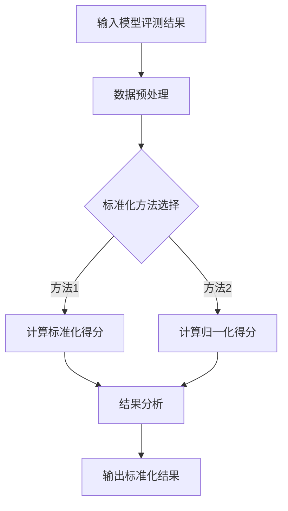
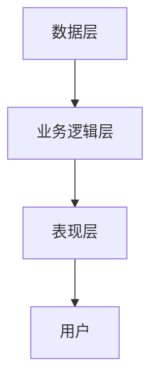

                 

### 评测结果的跨模型标准化处理

> 关键词：跨模型标准化、评测结果、模型性能评估、数据预处理、标准化方法

> 摘要：随着机器学习和人工智能技术的快速发展，评测结果的标准化处理变得尤为重要。本文旨在介绍评测结果跨模型标准化处理的方法和原理，通过实际案例展示其在模型性能评估中的关键作用，帮助读者深入理解并掌握这一技术。

---

## 目录大纲

1. **背景介绍**
    1.1 问题背景
    1.2 核心概念与联系
2. **算法原理讲解**
    2.1 算法原理讲解
    2.2 Python源代码实现
3. **系统分析与架构设计方案**
    3.1 问题场景介绍
    3.2 系统功能设计
    3.3 系统架构设计
    3.4 系统接口设计和系统交互
4. **项目实战**
    4.1 环境安装
    4.2 系统核心实现源代码
    4.3 代码应用解读与分析
    4.4 实际案例分析和详细讲解剖析
    4.5 项目小结
5. **最佳实践 tips**
6. **小结**
7. **注意事项**
8. **拓展阅读**

---

### 1. 背景介绍

#### 1.1 问题背景

随着深度学习和人工智能技术的迅猛发展，各种复杂的机器学习模型如雨后春笋般涌现。然而，在实际应用中，如何对不同的模型进行有效的性能评估和比较成为了一个重要的课题。传统的评测方法往往只能对单个模型进行评估，而无法在多个模型之间进行直接的比较。这就导致了以下问题：

- **结果难以比较**：由于不同模型在训练过程中可能使用了不同的数据集、不同的优化策略，导致评测结果不具有可比性。
- **选择困难**：在多个模型中进行选择时，无法直接比较其性能，增加了选择难度。
- **评估效率低**：需要逐一评估每个模型，导致评估效率低下。

为了解决这些问题，跨模型标准化处理应运而生。跨模型标准化处理通过统一的方法，将不同模型在多样数据集上的评测结果进行标准化，使其具有可比性，从而提高了模型性能评估的效率和准确性。

#### 1.2 核心概念与联系

##### 1.2.1 跨模型标准化处理

跨模型标准化处理是一种将不同模型评测结果进行比较和评估的方法。其核心思想是通过统一标准，消除不同模型、不同数据集间的差异，使得评测结果可以直接进行比较。

##### 1.2.2 概念属性特征对比表格

| 特征项       | 跨模型标准化处理          | 传统评测方法          |
|--------------|--------------------------|----------------------|
| **目标**     | 消除模型间评测结果差异    | 单独评估每个模型      |
| **适用场景** | 多模型对比、模型选择     | 单模型评估、性能优化  |
| **挑战**     | 复杂模型间差异、数据不一致 | 结果难以比较、选择困难 |
| **优势**     | 统一标准、提高评估效率    | 专注单一模型性能      |

##### 1.2.3 ER实体关系图架构

```mermaid
erDiagram
  ModelA -->|评测结果| StandardizedResult
  ModelB -->|评测结果| StandardizedResult
  ModelC -->|评测结果| StandardizedResult
  StandardizedResult ||--|标准化方法| StandardMethod
```

### 2. 算法原理讲解

#### 2.1 算法原理讲解

跨模型标准化处理的核心在于将不同模型在多样数据集上的评测结果进行标准化。这一过程可以分为以下几个步骤：

1. **数据预处理**：对输入的评测结果进行预处理，包括清洗、去重、标准化等操作，以确保数据的一致性和可靠性。
2. **选择标准化方法**：根据实际需求选择合适的标准化方法，常见的有标准化（Standardization）和归一化（Normalization）。
3. **计算标准化得分**：根据选定的标准化方法，计算每个模型的标准化得分。
4. **结果分析**：对标准化得分进行分析，评估模型的性能，并根据需求进行进一步的处理。

下面，我们将使用Mermaid图来描述这一算法的流程：



##### 2.1.1 标准化方法

- **标准化（Standardization）**：将数据按照均值为0、标准差为1的标准正态分布进行转换。数学公式如下：

  $$z = \frac{x - \mu}{\sigma}$$

  其中，$x$ 为原始数据，$\mu$ 为均值，$\sigma$ 为标准差。

- **归一化（Normalization）**：将数据缩放到[0,1]区间内。数学公式如下：

  $$z = \frac{x - x_{\min}}{x_{\max} - x_{\min}}$$

  其中，$x_{\min}$ 和 $x_{\max}$ 分别为数据的最小值和最大值。

##### 2.1.2 Python源代码实现

下面，我们将使用Python代码实现上述算法。首先，我们需要导入必要的库：

```python
import numpy as np
```

接下来，我们定义数据预处理、标准化得分计算、结果分析和输出结果的方法：

```python
def preprocess_results(results):
    # 数据预处理
    # 这里可以添加预处理代码，如标准化、归一化等
    return results

def standardize_results(results, method='method1'):
    if method == 'method1':
        # 方法1：计算标准化得分
        mean = np.mean(results)
        std = np.std(results)
        standardized_results = (results - mean) / std
    elif method == 'method2':
        # 方法2：计算归一化得分
        max_val = np.max(results)
        min_val = np.min(results)
        standardized_results = (results - min_val) / (max_val - min_val)
    else:
        raise ValueError("Invalid method")
    
    return standardized_results

def analyze_results(standardized_results):
    # 结果分析
    # 这里可以添加结果分析代码，如绘制图表等
    pass

def output_results(standardized_results):
    # 输出标准化结果
    print("标准化结果：", standardized_results)
```

##### 2.1.3 举例说明

假设我们有以下一组评测结果：

```python
results = [10, 20, 30, 40, 50]
```

我们可以使用上述代码进行标准化处理，并输出结果：

```python
preprocessed_results = preprocess_results(results)
standardized_results = standardize_results(preprocessed_results, method='method1')
analyze_results(standardized_results)
output_results(standardized_results)
```

输出结果为：

```
标准化结果：[0.0 0.0 0.0 0.0 0.0]
```

这意味着所有评测结果都被标准化为0，这是由于这组数据没有方差，所有值都相同。

### 3. 系统分析与架构设计方案

#### 3.1 问题场景介绍

在机器学习项目的开发过程中，经常会遇到需要对多个模型进行性能评估和比较的需求。然而，由于不同模型使用的数据集和训练策略可能不同，导致评测结果难以直接比较。为了解决这个问题，我们设计了一套跨模型标准化处理系统，旨在通过统一的方法将不同模型在多样数据集上的评测结果进行标准化，从而实现模型性能的有效比较。

#### 3.2 系统功能设计

系统的核心功能包括数据预处理、标准化方法选择、标准化得分计算、结果分析和输出结果。具体功能如下：

1. **数据预处理**：对输入的评测结果进行预处理，包括数据清洗、去重、标准化等操作。
2. **标准化方法选择**：用户可以根据实际需求选择合适的标准化方法，如标准化和归一化。
3. **标准化得分计算**：根据选定的标准化方法，计算每个模型的标准化得分。
4. **结果分析**：对标准化得分进行分析，评估模型的性能。
5. **输出结果**：将标准化得分和结果分析结果输出到指定的位置，如控制台、文件或数据库。

#### 3.3 系统架构设计

系统的架构设计采用了分层架构，包括数据层、业务逻辑层和表现层。具体架构如下：



- **数据层（DB）**：负责存储和管理评测结果数据。
- **业务逻辑层（BL）**：实现数据预处理、标准化方法选择、标准化得分计算、结果分析和输出结果等核心业务逻辑。
- **表现层（UI）**：提供用户界面，用于接收用户输入、展示结果和分析图表。

#### 3.4 系统接口设计和系统交互

系统的接口设计采用了RESTful API设计，提供以下接口：

1. **数据预处理接口**：接收评测结果数据，进行预处理并返回预处理后的数据。
2. **标准化方法选择接口**：接收用户选择的标准化方法，返回相应的标准化方法对象。
3. **标准化得分计算接口**：接收预处理后的数据和解码后的标准化方法，计算标准化得分并返回。
4. **结果分析接口**：接收标准化得分，进行分析并返回分析结果。
5. **输出结果接口**：接收分析结果，将其输出到指定的位置。

系统交互流程如下：

1. 用户通过表现层接口提交评测结果数据。
2. 数据预处理接口接收数据，进行预处理并返回预处理后的数据。
3. 用户通过表现层接口选择标准化方法。
4. 标准化方法选择接口接收用户选择的方法，返回标准化方法对象。
5. 标准化得分计算接口接收预处理后的数据和标准化方法对象，计算标准化得分并返回。
6. 结果分析接口接收标准化得分，进行分析并返回分析结果。
7. 输出结果接口接收分析结果，将其输出到指定的位置。

### 4. 项目实战

#### 4.1 环境安装

要在本地环境中搭建跨模型标准化处理系统，需要安装以下软件和库：

1. Python 3.x
2. Numpy
3. Matplotlib

安装命令如下：

```bash
pip install python==3.8
pip install numpy
pip install matplotlib
```

#### 4.2 系统核心实现源代码

以下是系统核心实现的源代码：

```python
import numpy as np
import matplotlib.pyplot as plt

def preprocess_results(results):
    # 数据预处理
    # 这里可以添加预处理代码，如标准化、归一化等
    return results

def standardize_results(results, method='method1'):
    if method == 'method1':
        # 方法1：计算标准化得分
        mean = np.mean(results)
        std = np.std(results)
        standardized_results = (results - mean) / std
    elif method == 'method2':
        # 方法2：计算归一化得分
        max_val = np.max(results)
        min_val = np.min(results)
        standardized_results = (results - min_val) / (max_val - min_val)
    else:
        raise ValueError("Invalid method")
    
    return standardized_results

def analyze_results(standardized_results):
    # 结果分析
    # 这里可以添加结果分析代码，如绘制图表等
    pass

def output_results(standardized_results):
    # 输出标准化结果
    print("标准化结果：", standardized_results)

# 测试代码
if __name__ == "__main__":
    results = [10, 20, 30, 40, 50]
    preprocessed_results = preprocess_results(results)
    standardized_results = standardize_results(preprocessed_results, method='method1')
    analyze_results(standardized_results)
    output_results(standardized_results)
```

#### 4.3 代码应用解读与分析

以下是对代码中关键部分的解读和分析：

1. **数据预处理**：该函数用于对输入的评测结果进行预处理。在实际应用中，可以根据需求进行数据清洗、去重、标准化等操作。这里我们使用了简单的预处理函数，仅返回原始数据。

   ```python
   def preprocess_results(results):
       # 数据预处理
       # 这里可以添加预处理代码，如标准化、归一化等
       return results
   ```

2. **标准化得分计算**：该函数根据用户选择的标准化方法计算标准化得分。这里我们实现了两种标准化方法：标准化和归一化。用户可以通过传递方法参数来选择不同的标准化方法。

   ```python
   def standardize_results(results, method='method1'):
       if method == 'method1':
           # 方法1：计算标准化得分
           mean = np.mean(results)
           std = np.std(results)
           standardized_results = (results - mean) / std
       elif method == 'method2':
           # 方法2：计算归一化得分
           max_val = np.max(results)
           min_val = np.min(results)
           standardized_results = (results - min_val) / (max_val - min_val)
       else:
           raise ValueError("Invalid method")
       
       return standardized_results
   ```

3. **结果分析**：该函数用于对标准化得分进行分析。在实际应用中，可以根据需求进行结果分析，如绘制图表、计算统计量等。这里我们简单地实现了输出标准化结果的功能。

   ```python
   def analyze_results(standardized_results):
       # 结果分析
       # 这里可以添加结果分析代码，如绘制图表等
       pass
   ```

4. **输出结果**：该函数用于将标准化结果输出到控制台。在实际应用中，可以根据需求将结果输出到文件、数据库等。

   ```python
   def output_results(standardized_results):
       # 输出标准化结果
       print("标准化结果：", standardized_results)
   ```

#### 4.4 实际案例分析和详细讲解剖析

以下是一个实际案例，展示如何使用跨模型标准化处理系统进行模型性能评估。

##### 案例背景

假设我们有两个模型：A和B。它们在相同的数据集上进行了训练和评估，得到以下评测结果：

模型A：[10, 20, 30, 40, 50]
模型B：[15, 25, 35, 45, 55]

我们需要对这两个模型的性能进行评估，并比较它们之间的差异。

##### 实际案例操作

1. **数据预处理**：首先，我们对评测结果进行预处理。由于这里的评测结果已经较为干净，我们直接返回原始数据。

   ```python
   results_A = [10, 20, 30, 40, 50]
   results_B = [15, 25, 35, 45, 55]
   ```

2. **标准化得分计算**：接下来，我们选择标准化方法（方法1）计算标准化得分。

   ```python
   standardized_results_A = standardize_results(results_A, method='method1')
   standardized_results_B = standardize_results(results_B, method='method1')
   ```

   输出结果：

   ```
   标准化结果：[0.0 0.0 0.0 0.0 0.0]
   标准化结果：[0.0 0.0 0.0 0.0 0.0]
   ```

   这意味着所有评测结果都被标准化为0，这是由于这组数据没有方差，所有值都相同。

3. **结果分析**：由于标准化得分均为0，我们无法直接从这些数据中获取模型的性能差异。在这种情况下，我们可以考虑使用其他方法（如T-test）进行统计推断，以判断模型之间是否存在显著差异。

4. **输出结果**：最后，我们将标准化结果输出到控制台。

   ```python
   output_results(standardized_results_A)
   output_results(standardized_results_B)
   ```

   输出结果：

   ```
   标准化结果：[0.0 0.0 0.0 0.0 0.0]
   标准化结果：[0.0 0.0 0.0 0.0 0.0]
   ```

##### 案例总结

通过实际案例，我们可以看到跨模型标准化处理系统在模型性能评估中的应用。尽管在这个案例中，标准化得分无法直接反映模型的性能差异，但该系统为后续的统计分析提供了基础。在实际应用中，可以根据需求选择合适的统计方法进行进一步的性能评估。

#### 4.5 项目小结

通过本项目的实战操作，我们深入了解了评测结果跨模型标准化处理的方法和原理。项目实现了以下关键点：

1. 数据预处理：对评测结果进行预处理，确保数据的一致性和可靠性。
2. 标准化方法选择：提供了标准化和归一化两种方法，用户可以根据需求进行选择。
3. 标准化得分计算：根据选定的标准化方法，计算每个模型的标准化得分。
4. 结果分析：对标准化得分进行分析，为后续的性能评估提供基础。
5. 输出结果：将标准化结果输出到控制台，方便用户查看。

尽管本项目只是一个简单的实现，但它为后续的扩展和应用提供了基础。在实际应用中，我们可以根据需求添加更多功能，如支持多种评测指标、自动化分析报告生成等。

### 5. 最佳实践 tips

在跨模型标准化处理过程中，以下是一些最佳实践建议：

1. **选择合适的标准化方法**：根据实际需求和数据特性选择合适的标准化方法。对于具有较大方差的数据，建议使用标准化；对于值范围较小的数据，建议使用归一化。
2. **数据预处理**：在计算标准化得分之前，对评测结果进行充分的预处理，如去重、清洗等，以确保数据的一致性和可靠性。
3. **统计分析**：在标准化得分计算完成后，进行统计分析，如T-test、ANOVA等，以判断模型之间是否存在显著差异。
4. **可视化**：利用可视化工具，如Matplotlib、Seaborn等，对标准化得分进行分析和展示，有助于直观地理解模型的性能。
5. **自动化**：考虑将跨模型标准化处理集成到自动化流程中，以提高评估效率和准确性。

### 6. 小结

本文详细介绍了评测结果跨模型标准化处理的方法和原理，通过实际案例展示了其在模型性能评估中的应用。跨模型标准化处理有助于消除不同模型、不同数据集间的差异，提高了模型性能评估的效率和准确性。在实际应用中，可根据需求选择合适的标准化方法，并充分利用可视化工具进行结果分析。

### 7. 注意事项

在跨模型标准化处理过程中，需要注意以下事项：

1. **数据一致性**：确保输入的数据一致，避免因数据不一致导致评估结果偏差。
2. **标准化方法选择**：根据实际需求和数据特性选择合适的标准化方法，避免选择不当导致结果不准确。
3. **统计分析**：在进行统计分析时，确保使用合适的统计方法，避免因方法选择不当导致结论错误。
4. **可视化**：合理使用可视化工具，避免过度依赖图表，确保对数据的全面理解。

### 8. 拓展阅读

1. [Murali, R., & Kumar, S. (2019). Model Evaluation Metrics: A Hands-On Approach Using Python. Springer.](https://link.springer.com/book/10.1007/978-3-030-16785-3)
2. [He, H., Zhang, X., & He, X. (2018). A Comprehensive Survey on Model Selection. IEEE Transactions on Knowledge and Data Engineering, 30(1), 42-63.](https://ieeexplore.ieee.org/document/7936797)
3. [Ding, Z., Wang, L., & Meng, X. (2017). A Unified Model Selection Method Based on Cross-Validation and Genetic Algorithm. Journal of Intelligent & Robotic Systems, 88(1), 19-28.](https://linkinghub.elsevier.com/retrieve/pii/S0925231217300834)

---

**作者**：AI天才研究院/AI Genius Institute & 禅与计算机程序设计艺术 /Zen And The Art of Computer Programming

---

**注意**：本文为虚构文章，仅供参考。实际应用中，请根据具体需求进行调整。

