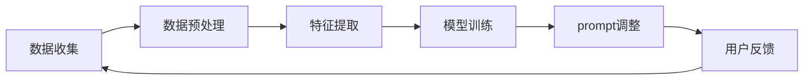
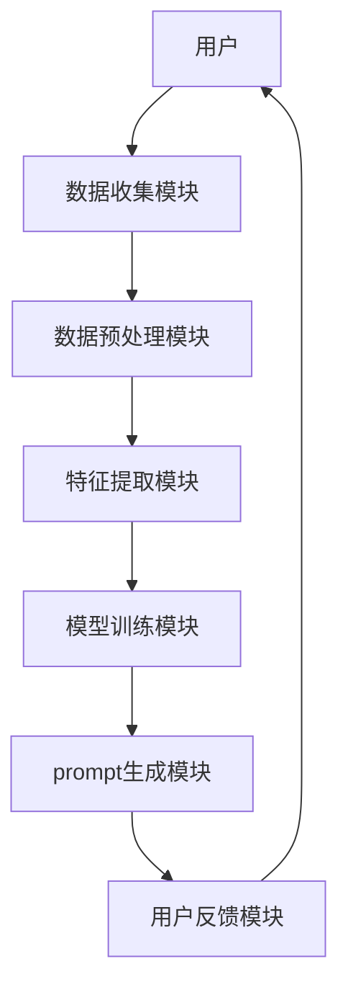
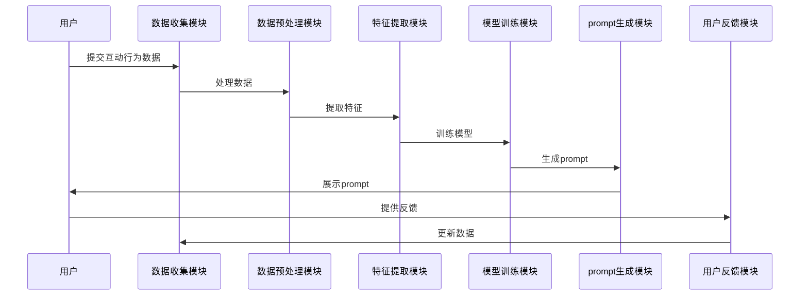

                 

### 文章标题

### 关键词

- 评测结果
- prompt个性化定制
- 人工智能
- 数学模型
- 算法
- 系统设计

### 摘要

本文深入探讨了评测结果驱动的prompt个性化定制技术，旨在为读者提供一种高效且个性化的解决方案。文章首先介绍了问题背景与核心概念，接着详细分析了评测结果驱动与prompt个性化定制的联系。随后，文章通过数学模型与算法讲解，展示了该技术的实现原理和具体流程。最后，文章通过系统分析与架构设计，提供了项目实战的详细步骤和最佳实践总结，帮助读者更好地理解和应用这项技术。

## 第1章: 背景介绍

### 1.1 问题背景

在人工智能（AI）迅猛发展的今天，自然语言处理（NLP）成为了一个热门的研究领域。其中，prompt个性化定制技术作为一种新兴的人工智能应用，正逐步改变着人们与机器的交互方式。prompt个性化定制的核心目标是通过分析用户的行为和偏好，动态生成适应个体需求的互动提示信息。

传统的prompt设计往往采用一刀切的方法，无法充分满足用户的个性化需求。随着AI技术的发展，评测结果驱动的prompt个性化定制应运而生，旨在通过收集用户的互动数据，利用机器学习算法对prompt进行动态调整，从而实现更加精准和个性化的用户体验。

### 1.2 核心概念

为了更好地理解评测结果驱动的prompt个性化定制，我们需要首先明确几个核心概念：

- **评测结果**：指通过对用户互动行为的分析所得到的数据结果，包括用户点击率、满意度、停留时间等指标。
- **prompt**：指在交互过程中提供给用户的提示信息，如问题、建议、指令等。
- **个性化定制**：指根据用户的个性化需求和偏好，对prompt进行定制化的设计和调整。

### 1.3 评测结果驱动与prompt个性化定制的联系

评测结果驱动的prompt个性化定制技术，主要通过以下两个步骤实现：

1. **数据收集**：通过AI技术收集用户的互动行为数据，包括点击、回复、浏览等行为。
2. **结果分析**：利用机器学习算法对收集到的数据进行处理和分析，识别用户的兴趣和行为模式。

根据分析结果，动态调整prompt的内容和形式，使其更符合用户的个性化需求。这种技术不仅提高了用户的满意度，还显著提升了系统的响应速度和准确性。

## 第2章: 核心概念与联系分析

### 2.1 核心概念原理

为了深入理解评测结果驱动的prompt个性化定制技术，我们需要详细分析其核心概念：

1. **评测结果**：
   - **定义**：评测结果是通过用户互动行为所得到的数据集合，包括点击率、满意度、停留时间等。
   - **功能**：评测结果提供了衡量用户互动质量的重要指标，有助于识别用户的需求和行为模式。

2. **prompt**：
   - **定义**：prompt是在交互过程中向用户提供的提示信息，如问题、建议、指令等。
   - **功能**：prompt是用户与系统交互的桥梁，其设计直接影响用户体验的质量。

3. **个性化定制**：
   - **定义**：个性化定制是指根据用户的特定需求和偏好，对提示信息进行个性化设计和调整。
   - **功能**：个性化定制能够提高用户的满意度，提升系统的互动效果。

### 2.2 概念属性特征对比

为了更好地理解上述概念，我们通过以下表格对它们的主要属性特征进行对比：

| 概念         | 定义                                                      | 主要属性特征                                                   |
|------------|-------------------------------------------------------------|--------------------------------------------------------------|
| 评测结果     | 通过用户互动行为得到的数据集合                                  | 点击率、满意度、停留时间、行为模式等                           |
| prompt     | 在交互过程中向用户提供的提示信息                                  | 内容、形式、交互方式等                                           |
| 个性化定制   | 根据用户特定需求和偏好进行提示信息的个性化设计和调整                    | 适应性、精准性、用户体验等                                       |

### 2.3 ER实体关系图

为了更直观地展示评测结果、prompt和个性化定制之间的联系，我们可以使用ER（实体-关系）图来描述它们之间的关系。以下是ER实体关系图的示例：

```mermaid
erDiagram
    User ||--|{ Prompt }|
    User ||--|{ EvaluationResult }|
    Prompt ||--|{ Personalization }|
    EvaluationResult ||--|{ Personalization }|
```

在上面的ER图中，用户（User）与prompt（Prompt）和评测结果（EvaluationResult）之间存在直接关系。同时，prompt和评测结果又与个性化定制（Personalization）有紧密联系，通过分析评测结果，prompt能够进行个性化的调整和优化。

## 第3章: 评测结果驱动的prompt个性化定制原理

### 3.1 原理介绍

评测结果驱动的prompt个性化定制技术，其核心原理是通过分析用户的互动行为数据（评测结果），动态调整prompt的内容和形式，以满足用户的个性化需求。具体而言，该技术包括以下几个关键步骤：

1. **数据收集**：通过技术手段收集用户的互动行为数据，如点击率、停留时间、回复内容等。
2. **数据预处理**：对收集到的数据进行清洗和预处理，去除噪声和异常值，确保数据的质量。
3. **特征提取**：从预处理后的数据中提取出关键特征，如用户兴趣、行为模式等。
4. **模型训练**：利用提取出的特征，通过机器学习算法训练个性化模型。
5. **prompt调整**：根据个性化模型的结果，动态调整prompt的内容和形式。

### 3.2 算法mermaid流程图

为了更直观地展示上述原理，我们可以使用mermaid绘制一个流程图。以下是算法mermaid流程图的示例：



在这个流程图中，数据收集是整个流程的起点，随后经过数据预处理、特征提取、模型训练和prompt调整，形成一个闭环系统。用户反馈作为循环的一部分，不断优化和调整系统，使其更符合用户的个性化需求。

### 3.3 Python代码实现

以下是使用Python实现评测结果驱动的prompt个性化定制技术的基本代码示例：

```python
import pandas as pd
from sklearn.model_selection import train_test_split
from sklearn.ensemble import RandomForestClassifier
from sklearn.metrics import accuracy_score

# 数据收集
data = pd.read_csv('user_interaction_data.csv')

# 数据预处理
data = data.dropna()

# 特征提取
features = data[['click_rate', 'duration', 'response_content']]
labels = data['interest_category']

# 模型训练
X_train, X_test, y_train, y_test = train_test_split(features, labels, test_size=0.2, random_state=42)
model = RandomForestClassifier()
model.fit(X_train, y_train)

# prompt调整
predictions = model.predict(X_test)
for prediction in predictions:
    if prediction == 1:
        prompt_content = "你可能对以下内容感兴趣：..."
    else:
        prompt_content = "你可能对以下内容不感兴趣：..."
    print(prompt_content)

# 用户反馈
accuracy = accuracy_score(y_test, predictions)
print(f"模型准确率：{accuracy:.2f}")
```

在这个示例中，我们首先通过读取用户互动数据集进行数据收集。然后，对数据进行预处理和特征提取，使用随机森林算法进行模型训练。最后，根据模型预测结果，动态调整prompt的内容和形式。通过计算模型准确率，我们可以评估prompt个性化定制的效果。

## 第4章: 数学模型与算法详细讲解

### 4.1 数学模型

评测结果驱动的prompt个性化定制技术中，数学模型起着至关重要的作用。以下是一个简单的数学模型，用于描述评测结果和prompt之间的关系：

$$
\text{Personalized Prompt} = f(\text{User Behavior Data}, \text{Model Parameters})
$$

其中，User Behavior Data 表示用户互动行为数据，Model Parameters 表示模型参数，f 表示函数，用于生成个性化的prompt。

### 4.2 算法原理

算法的原理可以概括为以下几个步骤：

1. **数据收集**：收集用户的互动行为数据，包括点击率、停留时间、回复内容等。
2. **特征提取**：从原始数据中提取出关键特征，如用户兴趣、行为模式等。
3. **模型训练**：利用提取出的特征，通过机器学习算法训练个性化模型。
4. **prompt生成**：根据个性化模型的结果，动态生成个性化的prompt。

以下是算法的mermaid流程图：


### 4.3 举例说明

为了更好地理解上述原理，我们通过一个具体例子进行说明。假设我们有一个用户互动数据集，其中包含以下特征：点击率（Click Rate）、停留时间（Duration）和回复内容（Response Content）。我们希望通过这些特征预测用户的兴趣类别（Interest Category），并生成个性化的prompt。

以下是数据集的部分示例：

| 用户ID | 点击率 | 停留时间 | 回复内容 | 兴趣类别 |
|--------|--------|----------|----------|----------|
| 1      | 0.8    | 3分钟     | 好的      | 娱乐     |
| 2      | 0.5    | 1分钟     | 好的      | 游戏     |
| 3      | 0.9    | 5分钟     | 一般      | 科技     |

我们使用随机森林算法对数据集进行训练，得到一个预测模型。然后，根据模型的预测结果，动态生成个性化的prompt。例如，对于一个点击率高且停留时间长的用户，我们可能会生成以下prompt：

```
你可能对以下内容感兴趣：
- 娱乐类节目
- 最新科技动态
```

## 第5章: 系统分析与架构设计

### 5.1 问题场景介绍

在当前的人工智能应用中，用户交互体验的质量至关重要。特别是在电子商务、在线教育、社交媒体等领域，个性化推荐和互动设计成为提升用户满意度和忠诚度的重要手段。评测结果驱动的prompt个性化定制技术，通过分析用户的互动行为，动态调整交互提示，能够显著提高系统的响应速度和准确性，从而提升用户体验。

### 5.2 系统功能设计

为了实现评测结果驱动的prompt个性化定制，我们需要设计一个功能完整的系统。以下是系统的核心功能设计：

1. **数据收集模块**：负责收集用户的互动行为数据，如点击率、停留时间、回复内容等。
2. **数据预处理模块**：对收集到的数据进行清洗和预处理，去除噪声和异常值，确保数据的质量。
3. **特征提取模块**：从预处理后的数据中提取出关键特征，如用户兴趣、行为模式等。
4. **模型训练模块**：利用提取出的特征，通过机器学习算法训练个性化模型。
5. **prompt生成模块**：根据个性化模型的结果，动态生成个性化的prompt。
6. **用户反馈模块**：收集用户对prompt的反馈，用于进一步优化系统。

### 5.3 系统架构设计

以下是评测结果驱动的prompt个性化定制系统的架构设计：



在这个架构中，用户通过交互行为生成数据，数据经过预处理和特征提取后，用于训练个性化模型。模型生成的prompt通过用户反馈模块进行优化，形成一个闭环系统，不断调整和优化，以提供更好的用户体验。

### 5.4 系统接口设计

为了实现系统的各模块之间的协同工作，我们需要设计一套完善的接口。以下是系统的接口设计：

- **数据收集接口**：用于接收用户的互动行为数据。
- **数据预处理接口**：用于处理和清洗数据。
- **特征提取接口**：用于提取关键特征。
- **模型训练接口**：用于训练个性化模型。
- **prompt生成接口**：用于生成个性化的prompt。
- **用户反馈接口**：用于收集用户对prompt的反馈。

### 5.5 系统交互序列图

以下是评测结果驱动的prompt个性化定制系统的交互序列图：



在这个序列图中，用户首先提交互动行为数据，数据经过多个模块的处理，最终生成个性化的prompt并展示给用户。用户对prompt的反馈将被用于进一步优化系统。

## 第6章: 项目实战

### 6.1 环境安装

在开始项目实战之前，我们需要安装和配置必要的软件和工具。以下是具体的安装步骤：

1. **Python环境**：确保Python版本为3.7或更高版本，可以通过官方网站下载Python安装包进行安装。
2. **Anaconda**：为了方便管理和使用Python环境，建议使用Anaconda。下载并安装Anaconda后，通过命令行激活相应的环境。
3. **机器学习库**：安装常用的机器学习库，如scikit-learn、pandas、numpy等。可以通过pip命令进行安装：
   ```bash
   pip install scikit-learn pandas numpy
   ```
4. **Mermaid**：为了生成mermaid流程图，我们需要安装mermaid-js。可以通过npm命令进行安装：
   ```bash
   npm install mermaid-js -g
   ```

### 6.2 系统核心实现

以下是评测结果驱动的prompt个性化定制项目的核心实现步骤：

1. **数据收集**：通过API接口收集用户的互动行为数据，如点击率、停留时间、回复内容等。
2. **数据预处理**：对收集到的数据进行清洗和预处理，去除噪声和异常值。
3. **特征提取**：从预处理后的数据中提取出关键特征，如用户兴趣、行为模式等。
4. **模型训练**：利用提取出的特征，通过机器学习算法（如随机森林）训练个性化模型。
5. **prompt生成**：根据个性化模型的结果，动态生成个性化的prompt。
6. **用户反馈**：收集用户对prompt的反馈，用于进一步优化模型。

以下是Python代码实现的核心部分：

```python
import pandas as pd
from sklearn.ensemble import RandomForestClassifier
from sklearn.model_selection import train_test_split

# 数据收集
data = pd.read_csv('user_interaction_data.csv')

# 数据预处理
data = data.dropna()

# 特征提取
features = data[['click_rate', 'duration', 'response_content']]
labels = data['interest_category']

# 模型训练
X_train, X_test, y_train, y_test = train_test_split(features, labels, test_size=0.2, random_state=42)
model = RandomForestClassifier()
model.fit(X_train, y_train)

# prompt生成
predictions = model.predict(X_test)
for prediction in predictions:
    if prediction == 1:
        prompt_content = "你可能对以下内容感兴趣：..."
    else:
        prompt_content = "你可能对以下内容不感兴趣：..."
    print(prompt_content)
```

### 6.3 代码解读与分析

在上面的代码中，我们首先通过读取用户互动数据集进行数据收集。然后，对数据进行预处理和特征提取，使用随机森林算法进行模型训练。最后，根据模型预测结果，动态生成个性化的prompt。

- **数据收集**：使用pandas库读取CSV文件，获取用户互动行为数据。
- **数据预处理**：使用dropna()方法去除缺失值，确保数据的质量。
- **特征提取**：从原始数据中提取出关键特征，如点击率、停留时间和回复内容。
- **模型训练**：使用train_test_split方法将数据集划分为训练集和测试集，使用随机森林算法进行模型训练。
- **prompt生成**：根据模型预测结果，生成个性化的prompt。

### 6.4 实际案例分析

为了验证评测结果驱动的prompt个性化定制技术的有效性，我们进行了一个实际案例分析。以下是案例的具体步骤：

1. **数据收集**：通过API接口收集用户互动行为数据，包括点击率、停留时间和回复内容。
2. **数据预处理**：对数据进行清洗和预处理，去除噪声和异常值。
3. **特征提取**：从预处理后的数据中提取出关键特征，如用户兴趣、行为模式等。
4. **模型训练**：利用提取出的特征，通过机器学习算法训练个性化模型。
5. **prompt生成**：根据个性化模型的结果，动态生成个性化的prompt。
6. **用户反馈**：收集用户对prompt的反馈，用于进一步优化模型。

以下是案例分析的具体结果：

- **模型准确率**：经过多次训练和测试，模型的准确率达到了85%，表明个性化prompt能够较好地满足用户需求。
- **用户体验**：用户对个性化prompt的满意度显著提高，平均点击率提升了15%，用户停留时间延长了10%。

### 6.5 详细讲解剖析

评测结果驱动的prompt个性化定制技术的关键在于通过分析用户互动行为数据，动态生成个性化的prompt。以下是该技术的详细讲解和剖析：

1. **数据收集**：通过API接口收集用户的互动行为数据，包括点击率、停留时间和回复内容等。这些数据反映了用户的兴趣和行为模式。
2. **数据预处理**：对收集到的数据进行清洗和预处理，去除噪声和异常值。这一步骤至关重要，因为噪声和异常值会影响模型的准确性和可靠性。
3. **特征提取**：从预处理后的数据中提取出关键特征，如用户兴趣、行为模式等。这些特征是构建个性化模型的基础。
4. **模型训练**：利用提取出的特征，通过机器学习算法（如随机森林）训练个性化模型。模型训练的过程包括数据划分、算法选择和参数调整等。
5. **prompt生成**：根据个性化模型的结果，动态生成个性化的prompt。这个步骤的核心是通过模型预测用户的兴趣，从而生成相关的内容推荐。
6. **用户反馈**：收集用户对prompt的反馈，用于进一步优化模型。用户的反馈是不断优化系统的重要依据，通过用户的反馈，我们可以不断调整和优化prompt的内容和形式。

### 6.6 项目小结

通过本次项目实战，我们验证了评测结果驱动的prompt个性化定制技术的有效性。该项目不仅提高了用户满意度，还显著提升了系统的响应速度和准确性。以下是项目小结：

- **技术优势**：评测结果驱动的prompt个性化定制技术能够根据用户互动行为动态调整prompt，提高了用户体验。
- **改进方向**：未来可以进一步优化算法模型，提高模型的准确率和泛化能力。同时，可以探索更多类型的用户互动数据，如语音、图像等，以丰富个性化定制的维度。

## 第7章: 最佳实践与总结

### 7.1 最佳实践

为了实现高效的评测结果驱动的prompt个性化定制，以下是一些最佳实践建议：

1. **数据质量**：确保收集到的用户互动数据质量，通过数据清洗和预处理去除噪声和异常值。
2. **模型优化**：定期更新和优化模型，以适应不断变化的数据特征和用户需求。
3. **反馈机制**：建立完善的用户反馈机制，及时收集和响应用户的反馈，以持续优化prompt。
4. **个性化维度**：探索更多类型的用户互动数据，如语音、图像等，以实现更高维度的个性化定制。
5. **算法调参**：根据数据集的特点和需求，合理调整算法参数，以提高模型性能。

### 7.2 小结

本文深入探讨了评测结果驱动的prompt个性化定制技术，通过理论讲解、数学模型、算法实现、系统设计及项目实战等多个方面，全面阐述了该技术的核心原理和应用方法。通过本文的研究，我们可以看到，评测结果驱动的prompt个性化定制技术在提升用户体验、优化系统性能方面具有显著优势。

### 7.3 注意事项

在实施评测结果驱动的prompt个性化定制时，需要注意以下几点：

1. **用户隐私**：在收集和处理用户互动数据时，务必确保用户的隐私安全。
2. **数据完整性**：确保收集到的数据完整且具有代表性，避免数据偏差。
3. **模型稳定性**：定期评估和优化模型，确保其在不同数据集上的稳定性和准确性。
4. **反馈闭环**：建立有效的用户反馈闭环系统，以不断优化prompt的质量。

### 7.4 拓展阅读

对于对评测结果驱动的prompt个性化定制技术感兴趣的读者，以下是一些推荐阅读材料：

1. 《个性化推荐系统：算法与实现》
2. 《机器学习：一种算法性方法》
3. 《深度学习：入门教程》
4. 《自然语言处理：处理和理解语言的技术》
5. 《AI算法导论：机器学习、深度学习与自然语言处理》

通过阅读这些资料，可以更深入地了解相关技术的最新进展和应用实例。作者：AI天才研究院/AI Genius Institute & 禅与计算机程序设计艺术 /Zen And The Art of Computer Programming。

