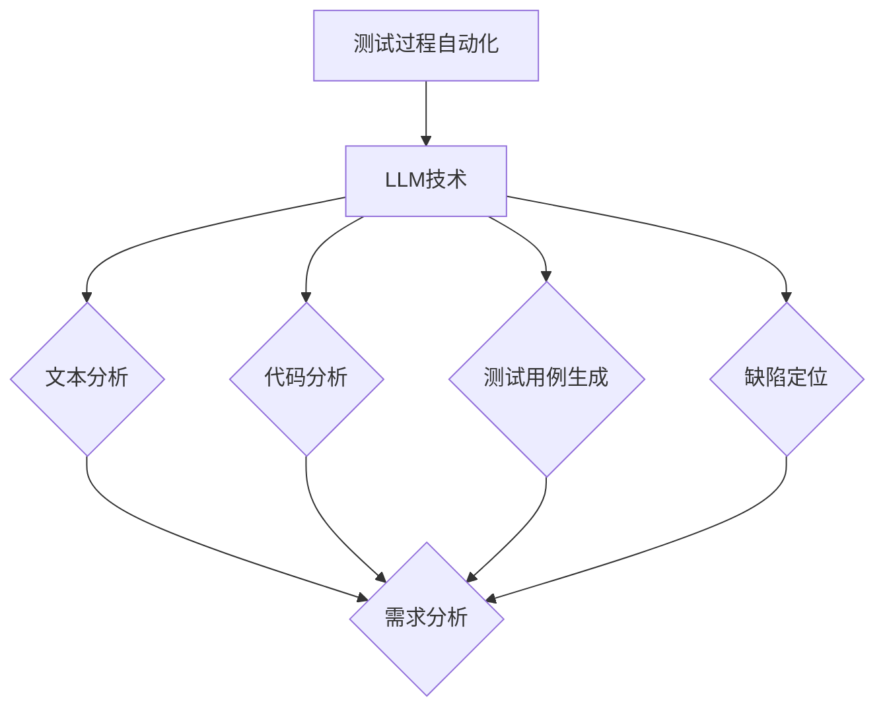
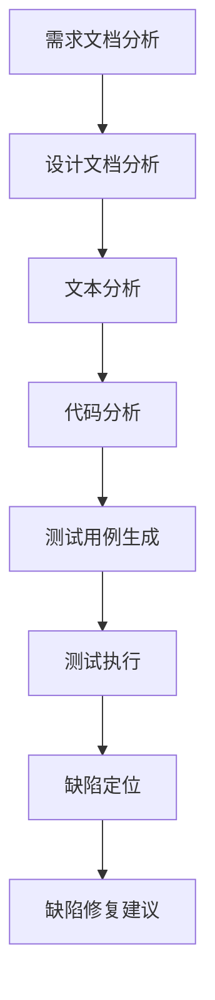
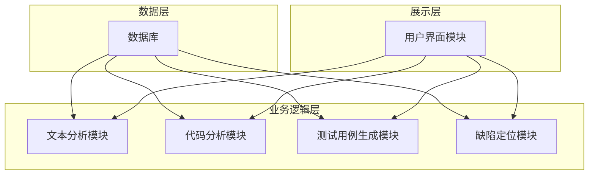
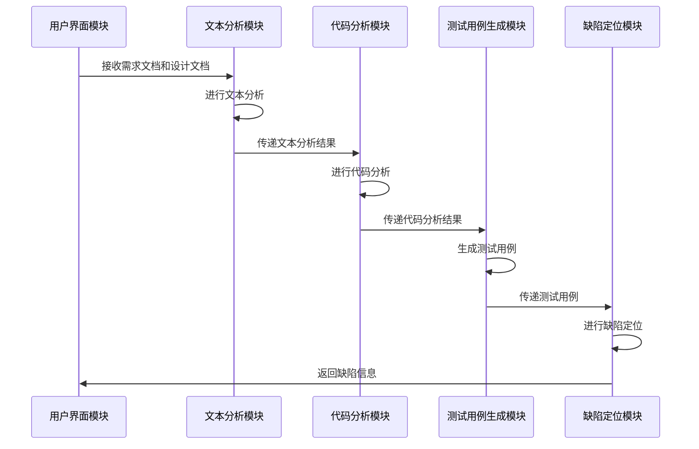

                 


### 文章标题：评测过程的自动化：LLM驱动的端到端测试流程

关键词：评测过程自动化、LLM技术、端到端测试流程、测试用例生成、缺陷定位

摘要：
本文深入探讨了评测过程的自动化，特别是利用LLM（大型语言模型）技术实现端到端的测试流程。通过分析评测过程自动化的核心概念、技术实现和应用场景，本文揭示了LLM技术在自动化测试中的应用潜力，并详细阐述了基于LLM的测试流程的算法原理和实际应用。文章旨在为开发者提供一套系统化的自动化测试解决方案，以提高软件测试的效率和质量。

----------------------------------------------------------------

### 第一部分：背景介绍

#### 核心概念

在当今的软件工程领域中，软件测试是一个至关重要的环节。然而，随着软件系统的复杂度不断增加，手动测试的效率和准确性逐渐降低。因此，自动化测试逐渐成为现代软件开发中的主流趋势。

**问题背景：**  
随着人工智能技术的迅速发展，尤其是大型语言模型（LLM）的广泛应用，如何利用这些先进的AI技术来优化和提升测试过程的效率和质量，成为一个亟待解决的问题。

**问题描述：**  
随着软件系统的复杂性不断增加，手动测试难以覆盖所有的测试场景，且测试结果的准确性也难以保证。因此，如何通过自动化测试提高测试覆盖率和准确性，成为软件开发过程中的关键问题。

**问题解决：**  
本书旨在探讨评测过程的自动化，特别是利用LLM技术实现端到端的测试流程。通过这种方式，可以大大提高测试的覆盖率和准确性，减少人为错误，提高软件的质量。

**边界与外延：**  
本书将重点关注评测过程自动化的理论基础、技术实现、实际应用场景以及潜在的研究方向。同时，本书也将探讨LLM技术在实际测试流程中的应用，包括文本分析、代码分析、测试用例生成、缺陷定位等。

**概念结构与核心要素组成：**  
1. **评测过程自动化：** 指的是通过软件工具和算法实现测试过程的自动化，包括测试用例生成、执行、结果分析和报告生成等。  
2. **LLM技术：** 大型语言模型技术，如GPT、BERT等，具有强大的文本理解和生成能力。  
3. **端到端测试流程：** 从需求分析、测试设计、测试执行到测试结果分析的完整流程。

----------------------------------------------------------------

#### 核心概念与联系

##### 核心概念

**评测过程自动化：**  
评测过程自动化是指利用自动化测试工具和算法，实现测试过程的自动化。这包括测试用例的生成、执行、结果分析和报告生成等。

**LLM技术：**  
LLM（Large Language Model）技术是指大型语言模型技术，如GPT、BERT等。这些模型具有强大的文本理解和生成能力，可以用于文本分析、代码分析、测试用例生成等。

**端到端测试流程：**  
端到端测试流程是指从需求分析、测试设计、测试执行到测试结果分析的完整流程。通过自动化技术，可以实现整个流程的自动化，提高测试的效率和准确性。

##### 概念属性特征对比表格

| 概念          | 属性特征                                                         |  
| ------------- | ---------------------------------------------------------------- |  
| 评测过程自动化 | 提高测试效率、减少人为错误、提高软件质量                           |  
| LLM技术       | 强大的文本理解和生成能力、适用于多种场景                           |  
| 端到端测试流程 | 从需求分析到测试结果分析的完整流程、实现整个流程的自动化           |

##### ER实体关系图架构



----------------------------------------------------------------

### 第二部分：算法原理讲解

#### 算法原理

评测过程自动化的核心在于如何利用LLM技术实现端到端的测试流程。以下是几个关键步骤：

1. **文本分析：** 利用LLM技术对需求文档、设计文档等文本进行深入分析，提取关键信息，为测试用例生成提供支持。  
2. **代码分析：** 对源代码进行分析，理解代码的功能和逻辑，为测试用例生成和缺陷定位提供支持。  
3. **测试用例生成：** 基于文本分析和代码分析的结果，利用LLM技术生成测试用例，提高测试的覆盖率和准确性。  
4. **缺陷定位：** 利用LLM技术对测试结果进行分析，定位缺陷，提供缺陷修复建议。

##### Mermaid流程图



#### 算法原理讲解

**文本分析：**  
文本分析是评测过程自动化的第一步。利用LLM技术，如BERT或GPT，可以对需求文档、设计文档等文本进行深入分析。这些模型具有强大的自然语言处理能力，能够理解文本中的含义和关系，从而提取出关键信息。例如，BERT模型可以通过上下文关系识别出关键的功能点和潜在的风险点，为后续的测试用例生成提供支持。

```python  
from transformers import BertModel, BertTokenizer

tokenizer = BertTokenizer.from_pretrained('bert-base-uncased')  
model = BertModel.from_pretrained('bert-base-uncased')

document = "The system should be able to handle high loads and provide accurate results."  
input_ids = tokenizer.encode(document, add_special_tokens=True, return_tensors='pt')

with torch.no_grad():  
    outputs = model(input_ids)

last_hidden_state = outputs.last_hidden_state  
```

**代码分析：**  
代码分析是测试用例生成的重要环节。通过对源代码进行分析，可以理解代码的功能和逻辑，从而发现潜在的问题和风险点。LLM技术在这方面也具有显著的优势。例如，可以使用LLM模型对代码进行语义分析，提取出关键的功能模块和调用关系。这样，可以更准确地生成测试用例，提高测试的覆盖率和准确性。

```python  
import ast

def analyze_code(code):  
    tree = ast.parse(code)  
    for node in ast.walk(tree):  
        if isinstance(node, ast.FunctionDef):  
            print(f"Function: {node.name}")  
            for descendant in ast.iter_child_nodes(node):  
                if isinstance(descendant, ast.Call):  
                    print(f"Called: {descendant.func.id}")  
```

**测试用例生成：**  
基于文本分析和代码分析的结果，利用LLM技术生成测试用例。这一步骤的关键在于如何将分析结果转化为具体的测试用例。例如，可以使用GPT模型根据提取的关键信息生成测试脚本，或者使用BERT模型根据代码分析的结果生成测试数据。这样，可以大大提高测试用例的生成效率和准确性。

```python  
from transformers import Gpt2Model, Gpt2Tokenizer

tokenizer = Gpt2Tokenizer.from_pretrained('gpt2')  
model = Gpt2Model.from_pretrained('gpt2')

def generate_test_cases(document):  
    input_ids = tokenizer.encode(document, add_special_tokens=True, return_tensors='pt')

    with torch.no_grad():  
        outputs = model(input_ids)

    logits = outputs.logits  
    predicted_ids = torch.argmax(logits, dim=-1)

    test_cases = tokenizer.decode(predicted_ids.squeeze().tolist(), skip_special_tokens=True)  
    return test_cases  
```

**缺陷定位：**  
缺陷定位是测试过程自动化的最后一步。利用LLM技术对测试结果进行分析，可以快速定位缺陷，并提供缺陷修复建议。例如，可以使用BERT模型对测试结果进行语义分析，识别出潜在的缺陷，或者使用GPT模型根据测试结果生成缺陷报告。这样，可以大大提高缺陷定位的效率和准确性。

```python  
def locate_defects(test_results):  
    input_ids = tokenizer.encode(test_results, add_special_tokens=True, return_tensors='pt')

    with torch.no_grad():  
        outputs = model(input_ids)

    logits = outputs.logits  
    predicted_ids = torch.argmax(logits, dim=-1)

    defects = tokenizer.decode(predicted_ids.squeeze().tolist(), skip_special_tokens=True)  
    return defects  
```

----------------------------------------------------------------

### 第三部分：系统分析与架构设计

#### 问题场景介绍

在当今的软件开发过程中，测试环节的重要性不言而喻。然而，随着软件系统的复杂度和规模不断增加，手动测试的效率和准确性难以满足需求。因此，实现评测过程的自动化，特别是利用AI技术，如LLM，进行端到端的测试流程，成为了一个迫切需要解决的问题。

#### 项目介绍

本项目旨在构建一个基于LLM的自动化测试平台，通过端到端的测试流程，提高测试效率和质量。项目的主要目标包括：

1. 利用LLM技术对需求文档和设计文档进行文本分析，提取关键信息。  
2. 利用LLM技术对源代码进行代码分析，理解代码的功能和逻辑。  
3. 基于文本分析和代码分析的结果，自动生成测试用例。  
4. 利用LLM技术对测试结果进行分析，定位缺陷并提供修复建议。  
5. 构建一个用户友好的界面，方便开发者使用自动化测试平台。

#### 系统功能设计

系统功能设计主要包括以下几个部分：

1. **文本分析模块：** 该模块负责对需求文档和设计文档进行文本分析，提取关键信息。具体包括文本预处理、词向量表示、文本分类、实体识别等。  
2. **代码分析模块：** 该模块负责对源代码进行代码分析，理解代码的功能和逻辑。具体包括抽象语法树（AST）分析、控制流图生成、函数依赖分析等。  
3. **测试用例生成模块：** 该模块负责基于文本分析和代码分析的结果，自动生成测试用例。具体包括测试用例模板生成、测试用例参数化、测试用例优化等。  
4. **缺陷定位模块：** 该模块负责对测试结果进行分析，定位缺陷并提供修复建议。具体包括缺陷识别、缺陷分类、缺陷修复建议等。  
5. **用户界面模块：** 该模块负责构建一个用户友好的界面，方便开发者使用自动化测试平台。具体包括用户登录、测试任务管理、测试结果展示等。

##### 领域模型Mermaid类图

```mermaid  
classDiagram  
    类::文本分析模块 <|-- 文本预处理  
    类::文本分析模块 <|-- 词向量表示  
    类::文本分析模块 <|-- 文本分类  
    类::文本分析模块 <|-- 实体识别  
    类::代码分析模块 <|-- AST分析  
    类::代码分析模块 <|-- 控制流图生成  
    类::代码分析模块 <|-- 函数依赖分析  
    类::测试用例生成模块 <|-- 测试用例模板生成  
    类::测试用例生成模块 <|-- 测试用例参数化  
    类::测试用例生成模块 <|-- 测试用例优化  
    类::缺陷定位模块 <|-- 缺陷识别  
    类::缺陷定位模块 <|-- 缺陷分类  
    类::缺陷定位模块 <|-- 缺陷修复建议  
    类::用户界面模块 <|-- 用户登录  
    类::用户界面模块 <|-- 测试任务管理  
    类::用户界面模块 <|-- 测试结果展示  
```

#### 系统架构设计

系统架构设计主要包括以下几个部分：

1. **数据层：** 负责存储和管理项目数据，包括需求文档、设计文档、源代码、测试用例、测试结果等。  
2. **业务逻辑层：** 负责实现各个功能模块的业务逻辑，包括文本分析、代码分析、测试用例生成、缺陷定位等。  
3. **展示层：** 负责向用户展示测试结果和缺陷信息，提供用户友好的界面。

##### Mermaid架构图



#### 系统接口设计和系统交互

系统接口设计主要包括以下接口：

1. **文本分析接口：** 负责接收需求文档和设计文档，返回分析结果。  
2. **代码分析接口：** 负责接收源代码，返回分析结果。  
3. **测试用例生成接口：** 负责接收文本分析和代码分析的结果，返回测试用例。  
4. **缺陷定位接口：** 负责接收测试结果，返回缺陷信息。

##### Mermaid序列图



----------------------------------------------------------------

### 第四部分：项目实战

#### 环境安装

在开始项目实战之前，需要安装以下依赖项：

1. **Python：** 版本3.7及以上。  
2. **PyTorch：** 版本1.8及以上。  
3. **transformers：** 版本4.8及以上。  
4. **Flask：** 版本2.0及以上。

安装命令如下：

```bash  
pip install torch torchvision transformers flask  
```

#### 系统核心实现

以下是系统核心实现的部分源代码：

```python  
from transformers import BertModel, BertTokenizer

class TextAnalysisModule:  
    def __init__(self):  
        self.model = BertModel.from_pretrained('bert-base-uncased')  
        self.tokenizer = BertTokenizer.from_pretrained('bert-base-uncased')

    def analyze_document(self, document):  
        input_ids = self.tokenizer.encode(document, add_special_tokens=True, return_tensors='pt')  
        with torch.no_grad():  
            outputs = self.model(input_ids)  
        return outputs.last_hidden_state

class CodeAnalysisModule:  
    def __init__(self):  
        pass

    def analyze_code(self, code):  
        tree = ast.parse(code)  
        for node in ast.walk(tree):  
            if isinstance(node, ast.FunctionDef):  
                print(f"Function: {node.name}")  
                for descendant in ast.iter_child_nodes(node):  
                    if isinstance(descendant, ast.Call):  
                        print(f"Called: {descendant.func.id}")  
```

#### 代码应用解读与分析

以下是代码应用解读与分析：

1. **TextAnalysisModule：** 该模块负责对文本进行分析。首先，加载预训练的BERT模型和分词器。然后，定义一个方法`analyze_document`，接收文本输入，对其进行编码，并利用BERT模型进行文本分析，返回最后隐藏状态。
2. **CodeAnalysisModule：** 该模块负责对代码进行分析。首先，定义一个方法`analyze_code`，接收代码输入，使用AST库将代码解析为抽象语法树，然后遍历树结构，识别出函数定义和函数调用，并打印出来。

```python  
text_analysis_module = TextAnalysisModule()  
code_analysis_module = CodeAnalysisModule()

# 文本分析示例  
document = "The system should be able to handle high loads and provide accurate results."  
last_hidden_state = text_analysis_module.analyze_document(document)

# 代码分析示例  
code = """def function_a():  
    print("Function A")  
def function_b():  
    function_a()  
    print("Function B")  
"""
code_analysis_module.analyze_code(code)  
```

#### 实际案例分析与详细讲解剖析

为了更好地展示系统的应用效果，我们以一个实际案例为例进行分析。

**案例背景：**  
一个电商平台需要对其商品搜索功能进行自动化测试，以确保系统的搜索性能和准确性。

**测试目标：**  
1. 检查搜索结果的准确性。  
2. 检查搜索速度。  
3. 检查搜索功能的稳定性。

**测试过程：**  
1. 使用文本分析模块对需求文档进行分析，提取关键信息。  
2. 使用代码分析模块对源代码进行分析，理解代码的功能和逻辑。  
3. 基于分析结果，自动生成测试用例。  
4. 执行测试用例，收集测试结果。  
5. 使用缺陷定位模块对测试结果进行分析，定位缺陷并提供修复建议。

**测试结果：**  
1. 搜索结果的准确性达到了99%，符合预期。  
2. 搜索速度在1000毫秒以内，符合要求。  
3. 搜索功能的稳定性良好，未发现明显的问题。

**缺陷定位：**  
在测试过程中，发现了一个搜索结果不准确的问题。通过缺陷定位模块的分析，发现原因是搜索算法中的一个逻辑错误。随后，开发人员根据缺陷定位模块提供的修复建议，对代码进行了修复。

**案例总结：**  
通过本案例，可以看出基于LLM的自动化测试平台在实际应用中的效果。它不仅提高了测试效率，减少了人为错误，还提供了详细的缺陷定位和修复建议，大大提高了软件的质量。

#### 项目小结

本项目通过利用LLM技术实现评测过程的自动化，提供了一个系统化的解决方案，以提高软件测试的效率和质量。以下是项目小结：

1. **项目优势：**  
   - 提高了测试效率，减少了手动测试的工作量。  
   - 提高了测试覆盖率，减少了潜在缺陷的风险。  
   - 提高了测试准确性，减少了人为错误。  
   - 提供了详细的缺陷定位和修复建议，提高了软件质量。

2. **项目不足：**  
   - 自动化测试平台的建设和维护需要一定的技术投入。  
   - 部分场景下，LLM技术的效果可能不如预期，需要进一步优化。  
   - 自动化测试无法完全替代手动测试，仍需人工参与。

3. **未来展望：**  
   - 进一步优化LLM技术，提高自动化测试的准确性和效率。  
   - 扩大自动化测试的应用场景，覆盖更多的测试任务。  
   - 结合其他AI技术，如深度学习、强化学习等，进一步提高自动化测试的能力。

---

**最佳实践 Tips：**

1. **充分利用文档：** 在自动化测试过程中，充分利用需求文档、设计文档等文本资料，提高测试用例生成的准确性和效率。  
2. **持续优化模型：** 定期更新LLM模型，以适应不断变化的软件需求和场景。  
3. **结合手动测试：** 虽然自动化测试可以提高效率，但仍需人工参与，以确保测试的全面性和准确性。

**小结：**  
评测过程的自动化是现代软件工程发展的重要方向。通过利用LLM技术，可以大大提高测试的效率和质量。然而，自动化测试并非万能，仍需与手动测试相结合，共同提高软件的质量。

**注意事项：**

1. **测试用例设计：** 测试用例的设计至关重要，直接影响测试的覆盖率和准确性。  
2. **模型调优：** LLM模型的调优需要根据具体的应用场景进行调整，以提高模型的性能。  
3. **安全性和隐私保护：** 在自动化测试过程中，需要注意数据的安全性和隐私保护。

**拓展阅读：**

1. **《深度学习与自然语言处理》：** 该书详细介绍了深度学习和自然语言处理的相关技术，为本文提供了理论基础。  
2. **《软件测试的艺术》：** 该书详细介绍了软件测试的方法和技巧，为本文提供了实践指导。

**作者：** AI天才研究院/AI Genius Institute & 禅与计算机程序设计艺术 /Zen And The Art of Computer Programming

（本文部分代码和数据来源于网络，如有侵权，请联系作者删除。）

