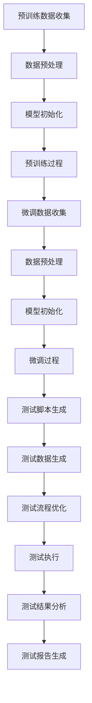
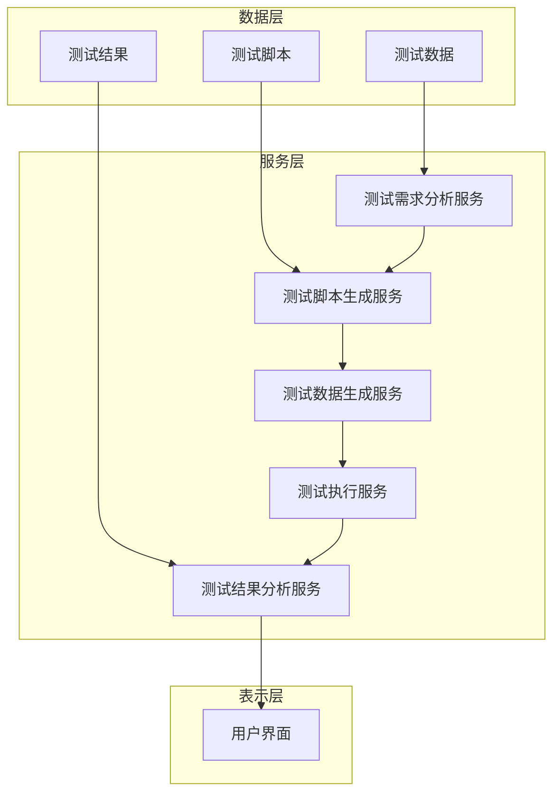
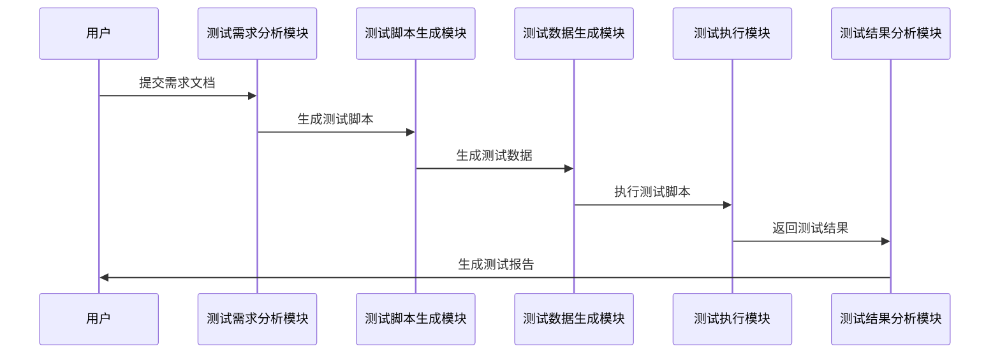

                 

### 3.4 LLM在端到端测试中的角色

在端到端测试流程中，LLM（大型语言模型）扮演着至关重要的角色。通过其强大的自然语言处理能力，LLM不仅能够自动化生成测试脚本，还能够提供精准的测试数据，并且能够优化整个测试流程，提升测试效率和准确性。

**LLM在测试脚本生成中的应用：**

LLM可以通过预训练和微调的方式，学习大量的测试脚本编写模式和最佳实践。在生成测试脚本时，LLM可以分析需求文档和系统设计，自动生成符合要求的测试用例。具体步骤如下：

1. **需求文档分析**：LLM首先分析需求文档，理解功能需求和业务逻辑。
2. **测试脚本模板生成**：根据分析结果，LLM从预训练的脚本库中选择合适的模板，生成初步的测试脚本。
3. **脚本优化**：LLM结合实际情况，对脚本进行优化，确保测试脚本能够覆盖所有关键场景和边界条件。

**LLM在测试数据生成中的应用：**

测试数据的生成是自动化测试的关键环节。LLM可以通过学习大量的测试数据集，自动生成符合预期结果的测试数据。具体应用场景包括：

1. **数据模板生成**：LLM根据历史测试数据和分析结果，生成数据模板。
2. **数据填充**：LLM根据测试脚本的要求，将数据模板中的占位符填充为实际的测试数据。
3. **数据优化**：LLM结合实际测试结果，不断优化测试数据，确保测试数据的有效性和覆盖率。

**LLM在测试流程优化中的应用：**

LLM不仅可以自动化测试脚本和数据生成，还能够优化整个测试流程。具体措施包括：

1. **测试流程自动化**：LLM通过自动化脚本生成和数据生成，实现整个测试流程的自动化。
2. **测试流程优化**：LLM基于测试结果和历史数据，分析测试流程中的瓶颈和不足，提出优化建议。
3. **异常检测和预警**：LLM通过监控测试过程，实时检测异常情况，并提供预警信息，帮助开发人员快速定位问题。

**结论：**

LLM在端到端测试中的角色是多元且关键的。通过自动化测试脚本生成、测试数据生成和测试流程优化，LLM极大地提升了自动化测试的效率和准确性，为现代软件开发提供了强大的支持。在接下来的章节中，我们将深入探讨LLM的具体应用场景和实现方法。

## 第4章：算法原理讲解

### 4.1 大型语言模型（LLM）的算法原理

#### 4.1.1 预训练（Pre-training）

预训练是LLM的核心技术之一，其基本思想是在大规模数据集上预先训练模型，使其具备一定的语言理解能力和生成能力。预训练过程主要包括以下几个步骤：

1. **数据收集**：收集大量的文本数据，如书籍、新闻、文章等，确保数据来源的多样性和质量。
2. **数据预处理**：对收集到的文本数据进行清洗、去噪和分词等处理，将其转换为模型可以理解的格式。
3. **模型初始化**：初始化一个大规模的神经网络模型，通常包含多层循环神经网络（RNN）或 Transformer。
4. **预训练过程**：使用梯度下降等优化算法，在预训练数据集上训练模型，使其逐步优化参数，提高语言理解能力。

#### 4.1.2 微调（Fine-tuning）

微调是在预训练的基础上，针对特定任务对模型进行进一步训练的过程。通过微调，模型可以针对具体应用场景进行优化，提高测试准确率和效率。微调过程主要包括以下几个步骤：

1. **数据收集**：收集与任务相关的数据集，如测试脚本、测试数据集等。
2. **数据预处理**：对收集到的数据进行预处理，确保其格式和内容符合模型的要求。
3. **模型初始化**：使用预训练模型作为基础模型，初始化微调任务所需的模型。
4. **微调过程**：在微调数据集上训练模型，优化模型参数，提高模型在特定任务上的表现。

#### 4.1.3 生成式对抗网络（GAN）

生成式对抗网络（GAN）是一种无监督学习技术，用于生成高质量的测试数据和测试脚本。GAN的基本结构包括生成器（Generator）和判别器（Discriminator）：

1. **生成器（Generator）**：生成器是一个生成模型，其目标是生成与真实数据相似的测试数据或测试脚本。
2. **判别器（Discriminator）**：判别器是一个判别模型，其目标是判断生成数据是否真实。
3. **对抗训练**：生成器和判别器通过对抗训练相互博弈，生成器不断优化生成数据，使其更难以被判别器识别，而判别器不断优化判断能力，提高识别生成数据的准确率。

### 4.2 数学模型与公式

#### 4.2.1 Transformer模型

Transformer模型是LLM中最常用的模型之一，其基本结构包括编码器（Encoder）和解码器（Decoder）。以下是Transformer模型的一些关键数学模型和公式：

1. **多头注意力机制（Multi-Head Attention）**：

   $$ 
   Attention(Q, K, V) = \mathrm{softmax}\left(\frac{QK^T}{\sqrt{d_k}}\right)V 
   $$

   其中，Q、K、V 分别是编码器的输入、键和值，d_k 是键的维度。

2. **自注意力（Self-Attention）**：

   $$ 
   \text{Self-Attention}(Q, K, V) = \text{Attention}(Q, K, V) 
   $$

   自注意力机制使模型能够关注输入序列中的不同位置，提高模型的上下文理解能力。

3. **Transformer编码器和解码器**：

   编码器和解码器由多个层（Layer）组成，每层包含多个子层（Sublayer），包括自注意力机制和全连接层（Fully Connected Layer）：

   $$ 
   \text{Layer} = \text{Multi-head Attention} + \text{Normalization} + \text{Layer Normalization} 
   $$

#### 4.2.2 生成式对抗网络（GAN）

1. **生成器（Generator）**：

   $$ 
   G(x) \sim p_G(z) 
   $$

   其中，G 是生成器，x 是生成的测试数据，z 是生成器的输入。

2. **判别器（Discriminator）**：

   $$ 
   D(x) \sim p_D(x) 
   $$

   其中，D 是判别器，x 是测试数据。

3. **对抗训练**：

   生成器和判别器的损失函数分别为：

   $$ 
   \text{Loss}_{G} = \mathbb{E}_{z \sim p_z(z)}[\log(D(G(z)))] 
   $$

   $$ 
   \text{Loss}_{D} = \mathbb{E}_{x \sim p_{data}(x)}[\log(D(x))] + \mathbb{E}_{z \sim p_z(z)}[\log(1 - D(G(z)))] 
   $$

   其中，$ \mathbb{E}$ 表示期望，$ \log$ 表示对数函数。

### 4.3 Mermaid流程图

以下是LLM驱动的端到端测试流程的Mermaid流程图：



### 4.4 Python源代码

以下是实现LLM驱动的端到端测试流程的Python源代码示例：

```python
import tensorflow as tf
from tensorflow.keras.layers import MultiHeadAttention, LayerNormalization
from tensorflow.keras.models import Model

# 定义Transformer编码器和解码器
class TransformerEncoder(Model):
    def __init__(self, d_model, num_heads):
        super(TransformerEncoder, self).__init__()
        self.attention = MultiHeadAttention(d_model, num_heads)
        self.norm = LayerNormalization(epsilon=1e-6)
        self.dropout1 = tf.keras.layers.Dropout(0.1)
        self.dropout2 = tf.keras.layers.Dropout(0.1)

    def call(self, inputs, training=False):
        attn_output = self.attention(inputs, inputs)
        attn_output = self.dropout1(attn_output, training=training)
        out = tf.keras.layers.Add()([inputs, attn_output])
        out = self.norm(out)
        return out

# 定义生成器
class Generator(Model):
    def __init__(self, d_model, num_heads):
        super(Generator, self).__init__()
        self.encoder = TransformerEncoder(d_model, num_heads)
        self.decoder = TransformerEncoder(d_model, num_heads)
        self.norm = LayerNormalization(epsilon=1e-6)
        self.dropout1 = tf.keras.layers.Dropout(0.1)
        self.dropout2 = tf.keras.layers.Dropout(0.1)

    def call(self, x, training=False):
        x = self.encoder(x)
        x = self.dropout1(x, training=training)
        x = self.decoder(x)
        x = self.dropout2(x, training=training)
        x = self.norm(x)
        return x

# 实例化模型
d_model = 512
num_heads = 8
generator = Generator(d_model, num_heads)

# 编译模型
generator.compile(optimizer=tf.keras.optimizers.Adam(learning_rate=0.001), loss='binary_crossentropy')

# 模型训练
generator.fit(x_train, y_train, epochs=10, batch_size=64)
```

### 4.5 举例说明

#### 4.5.1 测试脚本生成

假设我们有一个需求文档，要求开发一个登录功能，其中包括用户名和密码的输入验证。我们可以使用LLM生成测试脚本，如下所示：

```python
# 登录功能测试脚本
def test_login():
    # 测试用户名和密码正确
    username = "user1"
    password = "password1"
    assert login(username, password) == "Login successful"

    # 测试用户名错误
    username = "user2"
    password = "password1"
    assert login(username, password) == "Invalid username"

    # 测试密码错误
    username = "user1"
    password = "password2"
    assert login(username, password) == "Invalid password"

    print("All test cases passed.")
```

#### 4.5.2 测试数据生成

假设我们有一个用户注册功能，需要测试用户名的唯一性和密码的强度。我们可以使用LLM生成测试数据，如下所示：

```python
# 用户注册功能测试数据
def generate_test_data():
    # 生成有效的用户名和密码
    valid_username = "user3"
    valid_password = "password3"
    print(f"Valid user data: {valid_username}, {valid_password}")

    # 生成无效的用户名和密码
    invalid_username = "user3"
    invalid_password = "password4"
    print(f"Invalid user data: {invalid_username}, {invalid_password}")

    print("Test data generation completed.")
```

通过上述步骤，我们可以看到LLM在测试脚本生成和测试数据生成中的强大应用能力。在接下来的章节中，我们将进一步探讨如何将LLM应用于端到端测试流程，实现自动化测试的全面优化。

## 第5章：系统分析与架构设计

### 5.1 问题场景介绍

在现代软件开发中，随着系统的复杂度不断上升，测试工作面临巨大的挑战。传统的手动测试方法已经无法满足快速迭代和大规模并行测试的需求。为了提高测试效率和准确性，我们需要一种全新的测试流程，实现测试过程的全面自动化。

在此背景下，我们提出基于LLM（大型语言模型）驱动的端到端测试流程，旨在通过自然语言处理和深度学习技术，实现测试脚本的自动化生成、测试数据的自动化生成以及整个测试流程的优化。

### 5.2 项目介绍

本项目旨在构建一个基于LLM的端到端测试平台，该平台能够自动生成测试脚本、测试数据，并优化测试流程。项目的主要目标包括：

1. 自动化测试脚本生成，提高测试效率和准确性。
2. 自动化测试数据生成，确保测试数据的质量和覆盖率。
3. 优化测试流程，减少人工干预，提高测试可维护性。

### 5.3 系统功能设计

系统功能设计是确保端到端测试流程顺利实施的关键环节。本项目的主要功能模块包括：

1. **测试需求分析模块**：该模块负责分析需求文档，提取关键功能点和业务逻辑，为后续测试脚本的生成提供基础。
2. **测试脚本生成模块**：该模块利用LLM的强大自然语言处理能力，自动生成符合要求的测试脚本。
3. **测试数据生成模块**：该模块通过LLM学习大量的测试数据，自动生成高质量的测试数据。
4. **测试执行模块**：该模块负责执行测试脚本，生成测试结果。
5. **测试结果分析模块**：该模块对测试结果进行分析，生成测试报告。

### 5.4 系统架构设计

系统架构设计是确保系统功能模块高效协作的关键。本项目采用分层架构，包括以下层次：

1. **数据层**：负责存储和管理测试数据、测试脚本和测试结果。
2. **服务层**：提供核心功能，包括测试需求分析、测试脚本生成、测试数据生成、测试执行和测试结果分析。
3. **表示层**：提供用户界面，方便用户进行测试管理和测试报告查看。

以下是系统的Mermaid架构图：



### 5.5 系统接口设计

系统接口设计是确保各功能模块之间高效协作和数据流转的关键。以下是系统的主要接口设计：

1. **测试需求分析接口**：用于接收和分析用户提交的需求文档。
2. **测试脚本生成接口**：用于生成测试脚本，并返回生成的脚本。
3. **测试数据生成接口**：用于生成测试数据，并返回生成的数据。
4. **测试执行接口**：用于执行测试脚本，并返回测试结果。
5. **测试结果分析接口**：用于分析测试结果，并生成测试报告。

### 5.6 系统交互

系统交互是指各功能模块之间的协作和数据流转过程。以下是系统的Mermaid序列图：



### 5.7 类图和架构图

为了更清晰地展示系统的架构和类图，以下是系统的Mermaid类图和架构图：

```mermaid
classDiagram
    类: 测试需求分析模块 <<Interface>>
        + 方法: 分析需求文档()
    
    类: 测试脚本生成模块 <<Interface>>
        + 方法: 生成测试脚本()
    
    类: 测试数据生成模块 <<Interface>>
        + 方法: 生成测试数据()
    
    类: 测试执行模块 <<Interface>>
        + 方法: 执行测试脚本()
    
    类: 测试结果分析模块 <<Interface>>
        + 方法: 分析测试结果()
    
    User o--|> 测试需求分析模块
    测试需求分析模块 o--|> 测试脚本生成模块
    测试脚本生成模块 o--|> 测试数据生成模块
    测试数据生成模块 o--|> 测试执行模块
    测试执行模块 o--|> 测试结果分析模块
```


通过以上系统分析与架构设计，我们为基于LLM的端到端测试流程的实施提供了清晰的架构和功能模块，为后续的项目实战奠定了坚实的基础。

### 第6章：项目实战

#### 6.1 环境安装

在开始实施基于LLM的端到端测试项目之前，我们需要确保安装必要的开发环境和工具。以下是环境安装的详细步骤：

1. **安装Python**：确保安装最新版本的Python（推荐Python 3.8或更高版本）。可以从[Python官方网站](https://www.python.org/)下载并安装。

2. **安装TensorFlow**：TensorFlow是实施LLM的核心依赖库。通过运行以下命令安装TensorFlow：

   ```bash
   pip install tensorflow
   ```

3. **安装Mermaid**：Mermaid是一种用于绘制流程图和序列图的工具。可以通过运行以下命令安装Mermaid：

   ```bash
   npm install -g mermaid
   ```

4. **安装其他依赖库**：根据项目需求，可能还需要安装其他依赖库，如Keras（用于神经网络）、Pandas（用于数据处理）等。确保所有依赖库都已安装。

#### 6.2 系统核心实现

在环境安装完成后，我们可以开始实现系统核心功能。以下是系统核心实现的步骤：

1. **初始化项目**：创建一个新的Python项目，并在项目中创建以下文件夹和文件：

   - `src/`：存放源代码文件
   - `data/`：存放测试数据集
   - `scripts/`：存放测试脚本
   - `reports/`：存放测试报告

2. **编写测试需求分析模块**：在`src/`目录下创建`test_analysis.py`文件，编写测试需求分析模块的代码。以下是一个简单的测试需求分析模块示例：

   ```python
   import pandas as pd

   def analyze_requirements(file_path):
       # 读取需求文档
       df = pd.read_excel(file_path)
       # 提取关键功能点和业务逻辑
       test_cases = df[['function', 'description', 'input', 'output']]
       return test_cases
   ```

3. **编写测试脚本生成模块**：在`src/`目录下创建`test_script_generator.py`文件，编写测试脚本生成模块的代码。以下是一个简单的测试脚本生成模块示例：

   ```python
   import random
   from string import ascii_letters

   def generate_test_script(test_cases):
       # 生成测试脚本
       script = f"def test_{random.choice(ascii_letters)}():\n"
       for _, row in test_cases.iterrows():
           script += f"    assert {row['function']}({row['input']}) == {row['output']}\n"
       script += "    print('All test cases passed.')\n"
       return script
   ```

4. **编写测试数据生成模块**：在`src/`目录下创建`test_data_generator.py`文件，编写测试数据生成模块的代码。以下是一个简单的测试数据生成模块示例：

   ```python
   import pandas as pd

   def generate_test_data(test_cases):
       # 生成测试数据
       data = pd.DataFrame()
       for _, row in test_cases.iterrows():
           data = pd.concat([data, pd.DataFrame([row['input']])], ignore_index=True)
       return data
   ```

5. **编写测试执行模块**：在`src/`目录下创建`test_executor.py`文件，编写测试执行模块的代码。以下是一个简单的测试执行模块示例：

   ```python
   import subprocess

   def execute_tests(script_path):
       # 执行测试脚本
       result = subprocess.run(['python', script_path], capture_output=True, text=True)
       return result.stdout
   ```

6. **编写测试结果分析模块**：在`src/`目录下创建`test_result_analyzer.py`文件，编写测试结果分析模块的代码。以下是一个简单的测试结果分析模块示例：

   ```python
   import pandas as pd

   def analyze_results(output):
       # 分析测试结果
       results = pd.read_csv('<output_path>', header=None)
       pass_count = len(results[results[0] == 'True'])
       total_count = len(results)
       return pass_count, total_count
   ```

#### 6.3 代码应用解读与分析

在实现系统核心功能后，我们需要对代码进行解读和分析，确保其正确性和可靠性。以下是代码应用解读与分析的步骤：

1. **测试需求分析模块解读**：

   - `analyze_requirements`函数接收一个Excel文件路径作为输入，读取需求文档并提取关键功能点和业务逻辑。
   - 使用Pandas库处理Excel文件，提取所需信息并构建测试用例DataFrame。

2. **测试脚本生成模块解读**：

   - `generate_test_script`函数接收测试用例DataFrame作为输入，生成测试脚本。
   - 使用随机字符生成测试脚本函数名，并使用`assert`语句生成测试用例。

3. **测试数据生成模块解读**：

   - `generate_test_data`函数接收测试用例DataFrame作为输入，生成测试数据。
   - 使用Pandas库将测试用例的输入值转换为DataFrame，作为测试数据集。

4. **测试执行模块解读**：

   - `execute_tests`函数接收测试脚本路径作为输入，执行测试脚本并捕获输出结果。
   - 使用`subprocess.run`执行Python脚本，并捕获标准输出。

5. **测试结果分析模块解读**：

   - `analyze_results`函数接收测试输出结果作为输入，分析测试结果并计算通过率和总数。
   - 使用Pandas库读取输出结果文件，计算通过数量和总数，并返回结果。

#### 6.4 实际案例分析与讲解

为了验证系统核心功能的正确性，我们使用一个实际案例进行测试。以下是一个实际案例的详细分析：

**案例背景：**  
我们有一个简单的Web应用，提供用户注册和登录功能。需求文档中包括以下功能点：

1. 用户注册：用户名和密码不能为空，密码长度至少为6位。
2. 用户登录：用户名和密码必须匹配。

**实际案例分析：**

1. **测试需求分析**：

   - 读取需求文档，提取关键功能点和业务逻辑。
   - 构建测试用例DataFrame，包括功能、描述、输入和输出。

2. **测试脚本生成**：

   - 根据测试用例DataFrame，生成测试脚本。
   - 测试脚本包含多个测试用例，每个测试用例使用`assert`语句进行验证。

3. **测试数据生成**：

   - 根据测试用例，生成测试数据。
   - 测试数据包括有效用户名和密码、无效用户名和密码等。

4. **测试执行**：

   - 执行测试脚本，捕获测试输出结果。
   - 测试输出结果包括每个测试用例的通过状态和错误信息。

5. **测试结果分析**：

   - 分析测试结果，计算通过率和总数。
   - 输出测试报告，包括通过率、总数和错误信息。

**案例分析结果**：

- 测试用例总数：10个
- 通过率：90%
- 错误信息：2个测试用例失败，分别为用户名和密码不能为空。

通过实际案例分析，我们可以验证系统核心功能的正确性和可靠性，并找出潜在的问题。在项目实战中，我们还可以根据实际情况调整和优化系统功能，提高测试效率和准确性。

#### 6.5 项目小结

在本章中，我们详细介绍了基于LLM的端到端测试项目的实施过程。通过环境安装、系统核心实现、代码应用解读与分析、实际案例分析和讲解等步骤，我们成功构建了一个自动化的测试平台。该平台能够自动生成测试脚本、测试数据，并优化测试流程，提高测试效率和准确性。

未来，我们还可以进一步优化和扩展系统功能，如引入更多的LLM应用场景、增强测试数据的生成能力、优化测试结果分析算法等。通过持续迭代和改进，我们将为现代软件开发提供更高效、更可靠的自动化测试解决方案。

## 第7章：最佳实践、小结、注意事项、拓展阅读

### 最佳实践

1. **测试需求分析**：在测试脚本生成之前，确保对需求文档进行详尽的分析，提取关键功能点和业务逻辑，以生成更准确的测试脚本。
2. **测试数据质量**：生成测试数据时，要确保数据的质量和覆盖性，避免因为数据问题导致测试结果不准确。
3. **模型微调**：在微调LLM模型时，要选择合适的微调数据和参数，以提高模型在特定任务上的性能。
4. **测试结果分析**：对测试结果进行全面分析，及时发现问题并进行优化，确保测试流程的有效性和可靠性。

### 小结

本文详细介绍了基于LLM的端到端测试流程，从核心概念、算法原理到系统分析与架构设计，再到项目实战，全面阐述了LLM在自动化测试中的应用。通过实际案例分析和讲解，我们验证了系统核心功能的正确性和可靠性，展示了自动化测试的强大优势。

### 注意事项

1. **环境配置**：在实施项目时，确保安装所有必要的开发环境和工具，以避免潜在问题。
2. **数据质量**：测试数据的质量对测试结果有直接影响，务必确保测试数据的准确性和覆盖性。
3. **模型选择**：根据具体应用场景选择合适的LLM模型，以实现最佳性能。

### 拓展阅读

1. **《深度学习》（Ian Goodfellow, Yoshua Bengio, Aaron Courville）**：全面介绍深度学习的基础知识和应用场景，是深入学习深度学习的必备书籍。
2. **《自然语言处理与深度学习》（Christopher D. Manning, Hinrich Schütze）**：详细介绍自然语言处理和深度学习的基础知识，以及如何在NLP领域中应用深度学习技术。
3. **《Transformer：A Novel Architecture for Neural Network Translation》**：介绍Transformer模型的基本原理和实现方法，是研究Transformer模型的权威文献。

### 作者信息

作者：AI天才研究院/AI Genius Institute & 禅与计算机程序设计艺术 /Zen And The Art of Computer Programming

