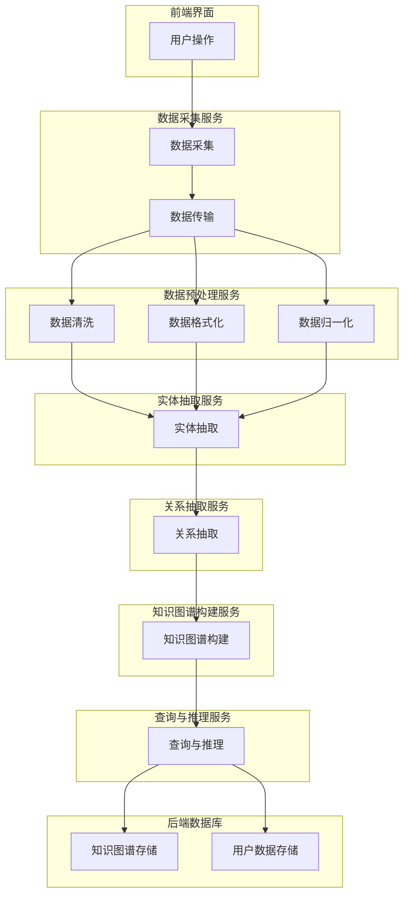

                 

### 问题背景与核心概念

#### 评测驱动的概念

评测驱动（Evaluation-driven）是一种以评估为中心的方法论，它强调在项目开发、模型训练和系统优化的各个阶段，通过持续的评测来反馈和改进。这种方法最早应用于软件工程，随后在数据科学、人工智能等领域得到广泛应用。

##### 1.1.1 评测驱动的起源与发展

评测驱动起源于20世纪90年代，随着软件工程的发展，为了提高软件质量，工程师们开始引入自动化的测试工具和流程。随后，这一概念被引入到数据科学领域，特别是在机器学习和深度学习的模型训练中，通过不断的评估和调整来优化模型的性能。

##### 1.1.2 评测驱动的核心要素

评测驱动的核心要素包括：数据采集、数据处理、评估与反馈。具体来说：

- **数据采集**：收集与评测目标相关的数据，这些数据可以是历史数据、用户反馈、实验结果等。
- **数据处理**：对采集到的数据进行分析和清洗，确保数据的质量和准确性。
- **评估与反馈**：通过评价指标（如准确率、召回率、F1值等）对系统进行评估，并根据评估结果进行相应的调整和优化。

#### prompt知识图谱的概念

prompt知识图谱是一种基于人工智能的知识表示技术，通过图结构来表示知识和信息。它将实体、属性和关系以节点和边的形式组织起来，从而实现对复杂知识的高效存储、检索和应用。

##### 1.2.1 prompt知识图谱的定义

prompt知识图谱是一种用于知识管理和信息检索的图数据库，它通过图结构来组织实体和关系，实现对复杂数据的高效管理和分析。

##### 1.2.2 prompt知识图谱的特点与优势

- **高效率**：prompt知识图谱通过图结构来组织数据，能够实现快速检索和查询。
- **灵活性**：prompt知识图谱支持动态扩展和调整，能够适应不同的应用场景。
- **高精度**：通过实体和关系的精准表示，prompt知识图谱能够提高数据的准确性和可靠性。

#### 评测驱动与prompt知识图谱的关系

评测驱动与prompt知识图谱之间存在密切的联系和互动。具体来说：

- **联系**：评测驱动为prompt知识图谱提供了持续优化和调整的机制，通过评估和反馈来指导图谱的构建和维护。
- **互动**：prompt知识图谱为评测驱动提供了丰富的数据资源和知识表示方法，使得评测过程更加精准和高效。

##### 1.3.1 联系与互动分析

评测驱动与prompt知识图谱之间的联系体现在以下几个方面：

- **数据源**：评测驱动的数据采集和处理可以为prompt知识图谱提供丰富的数据支持。
- **评估指标**：prompt知识图谱可以用于评估评测驱动的效果，如通过图谱中的节点关系来分析数据质量和模型性能。
- **反馈机制**：评测驱动的评估结果可以反馈给prompt知识图谱，用于调整和优化图谱的结构和内容。

##### 1.3.2 应用前景

随着人工智能和大数据技术的发展，评测驱动与prompt知识图谱的结合具有广泛的应用前景。例如：

- **智能问答系统**：通过prompt知识图谱来组织和管理知识库，实现高效的问答和推理。
- **推荐系统**：利用评测驱动的优化策略来调整推荐模型，提高推荐效果。
- **自然语言处理**：通过prompt知识图谱来增强模型的语义理解能力，提高文本处理的效果。

总之，评测驱动与prompt知识图谱的结合为人工智能的发展提供了新的思路和方法，有望在未来带来更多的创新和突破。### 核心概念原理

#### 评测驱动的原理

评测驱动是一种以评估为中心的方法论，通过持续的评估和反馈来优化系统的性能和效果。它包括以下几个关键步骤：

##### 2.1.1.1 数据采集

数据采集是评测驱动的第一步，目标是收集与评测目标相关的数据。这些数据可以是历史数据、用户反馈、实验结果等。数据的质量和准确性对评测结果至关重要。

##### 2.1.1.2 数据处理

数据处理是对采集到的数据进行分析和清洗的过程。这一步骤的目的是确保数据的质量和一致性，为后续的评估提供可靠的基础。

##### 2.1.1.3 评估与反馈

评估与反馈是评测驱动的核心环节。通过设置合适的评价指标，对系统进行评估，并根据评估结果进行相应的调整和优化。这一过程通常是一个迭代的过程，通过不断的评估和反馈来逐步提高系统的性能。

##### 2.1.2 评测驱动的挑战与解决方案

尽管评测驱动方法具有显著的优点，但在实际应用中也面临一些挑战：

- **数据质量**：数据质量直接影响评估结果，需要采取有效的方法来确保数据的质量和准确性。
- **评估指标**：选择合适的评估指标对系统的性能进行评估，这需要深入理解系统的目标和应用场景。
- **反馈机制**：建立有效的反馈机制，确保评估结果能够及时地反馈到系统的优化过程中。

针对这些挑战，可以采取以下解决方案：

- **数据质量管理**：采用数据清洗和数据验证技术来提高数据质量。
- **指标选择**：结合系统的目标和应用场景，选择合适的评估指标。
- **反馈优化**：通过算法和模型的优化，建立高效的反馈机制，确保评估结果能够有效地指导系统的改进。

#### prompt知识图谱的原理

prompt知识图谱是一种用于知识管理和信息检索的图数据库，通过图结构来组织实体和关系，实现对复杂数据的高效管理和分析。以下是构建prompt知识图谱的几个关键步骤：

##### 2.2.1.1 数据预处理

数据预处理是构建prompt知识图谱的第一步，主要包括数据的清洗、格式化和归一化。这一步骤的目的是确保数据的一致性和质量，为后续的实体抽取和关系抽取提供可靠的数据基础。

##### 2.2.1.2 实体抽取

实体抽取是从原始数据中识别和提取出关键实体的过程。实体可以是人、地点、组织、物品等。实体抽取的方法包括基于规则的方法、机器学习的方法和深度学习方法等。

##### 2.2.1.3 关系抽取

关系抽取是从原始数据中识别和提取出实体之间的关系的步骤。关系可以是因果关系、所属关系、参与关系等。关系抽取的方法同样包括基于规则的方法、机器学习的方法和深度学习方法等。

##### 2.2.1.4 知识图谱构建

知识图谱构建是将提取的实体和关系组织成图结构的过程。这一步骤的目的是构建一个结构化、可查询的知识库，为后续的查询和推理提供支持。知识图谱构建的方法包括基于规则的方法、基于学习的方法和基于混合的方法等。

#### 评测驱动与prompt知识图谱的联系

评测驱动与prompt知识图谱之间存在密切的联系和互动：

- **数据源**：评测驱动提供的数据采集和处理过程可以为prompt知识图谱提供丰富的数据支持。
- **评估指标**：prompt知识图谱可以用于评估评测驱动的效果，例如通过图谱中的节点关系来分析数据质量和模型性能。
- **反馈机制**：评测驱动的评估结果可以反馈给prompt知识图谱，用于调整和优化图谱的结构和内容。

##### 2.3.1 联系与互动分析

具体来说，评测驱动与prompt知识图谱之间的联系和互动可以从以下几个方面进行：

- **数据关联**：通过评测驱动采集的数据，可以与prompt知识图谱中的实体和关系进行关联，从而丰富图谱的内容。
- **模型优化**：通过评测驱动的评估结果，可以对prompt知识图谱的构建过程进行优化，例如调整实体抽取和关系抽取的方法，以提高图谱的准确性和效率。
- **查询优化**：通过prompt知识图谱，可以优化评测驱动的查询过程，例如通过图谱的结构来加速查询，提高查询效率。

##### 2.3.2 案例分析

以一个智能问答系统为例，评测驱动与prompt知识图谱的结合可以大幅提高系统的性能。具体来说：

- **数据采集**：通过评测驱动，可以收集用户的问题和相关的上下文信息，这些数据可以作为prompt知识图谱的数据源。
- **实体抽取**：在数据预处理过程中，可以提取出问题中的关键实体（如人名、地名、物品名等），并将其作为prompt知识图谱中的实体。
- **关系抽取**：同样在数据预处理过程中，可以提取出实体之间的关系（如因果关系、所属关系等），并将其作为prompt知识图谱中的关系。
- **知识图谱构建**：通过将提取的实体和关系组织成图结构，构建出prompt知识图谱，为后续的查询和推理提供支持。
- **评估与反馈**：通过评测驱动的评估结果，可以对prompt知识图谱进行优化，例如调整实体抽取和关系抽取的方法，以提高图谱的准确性和效率。
- **查询与推理**：通过prompt知识图谱，可以快速、准确地回答用户的问题，并提供相关的信息和建议。

总之，评测驱动与prompt知识图谱的结合为智能问答系统提供了一个高效、准确的解决方案，有望在未来得到更广泛的应用。### 算法原理与实现

#### 评测驱动算法原理

评测驱动算法是一种以评估为中心的方法，通过持续的评估和反馈来优化系统的性能和效果。以下是评测驱动算法的原理和实现：

##### 3.1.1.1 模型概述

评测驱动算法的核心是一个循环迭代的过程，包括数据采集、数据处理、评估和反馈四个步骤。具体来说：

- **数据采集**：收集与评测目标相关的数据，可以是历史数据、用户反馈、实验结果等。
- **数据处理**：对采集到的数据进行分析和清洗，确保数据的质量和一致性。
- **评估**：通过设置合适的评价指标，对系统进行评估，例如准确率、召回率、F1值等。
- **反馈**：根据评估结果，对系统进行相应的调整和优化，然后重新进行评估，直到达到预定的性能目标。

##### 3.1.1.2 数学公式

为了更清晰地理解评测驱动算法，我们可以将其数学模型表示如下：

\[ \text{模型} = \text{数据采集} + \text{数据处理} + \text{评估} + \text{反馈} \]

其中：

- **数据采集**：\( D = \{ d_1, d_2, ..., d_n \} \)，表示采集到的数据集合。
- **数据处理**：\( P = \text{数据处理}(D) \)，表示经过处理的数据。
- **评估**：\( E = \text{评估}(P) \)，表示评估结果。
- **反馈**：\( F = \text{反馈}(E) \)，表示根据评估结果进行的调整。

##### 3.1.1.3 Python代码实现

以下是一个简单的Python代码示例，用于实现评测驱动算法的基本流程：

```python
import pandas as pd

# 数据采集
data = pd.read_csv('data.csv')

# 数据处理
data_processed = preprocess_data(data)

# 评估
evaluation_result = evaluate_model(data_processed)

# 反馈
feedback = get_feedback(evaluation_result)

# 更新模型
update_model(feedback)

# 重新评估
new_evaluation_result = evaluate_model(data_processed)

# 输出最终评估结果
print(new_evaluation_result)
```

在这个示例中，`preprocess_data`函数用于数据预处理，`evaluate_model`函数用于评估模型性能，`get_feedback`函数用于获取评估结果并生成反馈，`update_model`函数用于更新模型。

##### 3.1.2 评测驱动算法的实现

在实际应用中，评测驱动算法的实现需要考虑以下几个关键步骤：

- **数据采集**：选择合适的数据源，例如数据库、文件系统、实时数据流等。
- **数据处理**：对采集到的数据进行清洗、转换和归一化，确保数据的质量和一致性。
- **评估指标**：选择合适的评估指标，例如准确率、召回率、F1值等，根据具体的应用场景和目标来设定。
- **反馈机制**：建立有效的反馈机制，根据评估结果对系统进行相应的调整和优化。
- **迭代过程**：通过循环迭代的方式，不断进行数据采集、数据处理、评估和反馈，直到达到预定的性能目标。

在实际应用中，评测驱动算法通常需要与机器学习模型、深度学习框架等相结合，以实现高效的性能评估和系统优化。

#### prompt知识图谱构建算法原理

prompt知识图谱构建算法是一种用于知识管理和信息检索的技术，通过图结构来组织实体和关系，实现对复杂数据的高效存储、检索和应用。以下是prompt知识图谱构建算法的原理和实现：

##### 3.2.1.1 模型概述

prompt知识图谱构建算法的核心包括数据预处理、实体抽取、关系抽取和知识图谱构建四个步骤。具体来说：

- **数据预处理**：对原始数据进行清洗、格式化和归一化，确保数据的质量和一致性。
- **实体抽取**：从原始数据中识别和提取出关键实体，例如人名、地名、物品名等。
- **关系抽取**：从原始数据中识别和提取出实体之间的关系，例如因果关系、所属关系、参与关系等。
- **知识图谱构建**：将提取的实体和关系组织成图结构，构建出prompt知识图谱。

##### 3.2.1.2 数学公式

为了更清晰地理解prompt知识图谱构建算法，我们可以将其数学模型表示如下：

\[ G = \text{知识图谱} = (V, E) \]

其中：

- **V**：实体集合，表示知识图谱中的所有实体。
- **E**：关系集合，表示知识图谱中的所有关系。

##### 3.2.1.3 Python代码实现

以下是一个简单的Python代码示例，用于实现prompt知识图谱构建的基本流程：

```python
import pandas as pd
from rdflib import Graph, URIRef, Literal

# 数据预处理
data = pd.read_csv('data.csv')

# 实体抽取
entities = extract_entities(data)

# 关系抽取
relationships = extract_relationships(data)

# 知识图谱构建
g = Graph()
for entity in entities:
    g.add((URIRef(entity), URIRef('type'), Literal('Entity')))

for relationship in relationships:
    g.add((URIRef(relationship[0]), URIRef('relation'), URIRef(relationship[1])))

# 保存知识图谱
g.serialize('knowledge_graph.ttl')
```

在这个示例中，`extract_entities`函数用于从数据中提取实体，`extract_relationships`函数用于从数据中提取关系，`Graph`对象用于构建知识图谱，并使用`serialize`方法将知识图谱保存为RDF（Resource Description Framework）格式。

##### 3.2.2 Prompt知识图谱算法的实现

在实际应用中，prompt知识图谱构建算法的实现需要考虑以下几个关键步骤：

- **数据预处理**：对原始数据进行清洗、格式化和归一化，确保数据的质量和一致性。
- **实体抽取**：采用基于规则的方法、机器学习的方法或深度学习的方法来从数据中提取实体。
- **关系抽取**：采用基于规则的方法、机器学习的方法或深度学习的方法来从数据中提取关系。
- **知识图谱构建**：将提取的实体和关系组织成图结构，构建出prompt知识图谱。

在实际应用中，prompt知识图谱构建算法通常需要与自然语言处理、信息抽取、数据存储等技术相结合，以实现高效的知识管理和信息检索。

##### 3.2.2.1 Python代码实现

以下是一个更详细的Python代码示例，用于实现prompt知识图谱构建的完整流程：

```python
import pandas as pd
from rdflib import Graph, URIRef, Literal
from nltk.tokenize import word_tokenize
from nltk.corpus import stopwords

# 数据预处理
data = pd.read_csv('data.csv')

# 实体抽取
stop_words = set(stopwords.words('english'))
def extract_entities(text):
    words = word_tokenize(text)
    filtered_words = [word for word in words if word not in stop_words]
    return filtered_words

# 关系抽取
def extract_relationships(text):
    words = word_tokenize(text)
    relationships = []
    for i in range(len(words) - 1):
        if words[i] in ['is', 'are', 'has', 'have']:
            relationships.append((words[i], words[i+1]))
    return relationships

# 知识图谱构建
g = Graph()
for index, row in data.iterrows():
    text = row['text']
    entities = extract_entities(text)
    relationships = extract_relationships(text)
    
    for entity in entities:
        g.add((URIRef(entity), URIRef('type'), Literal('Entity')))
        
    for relationship in relationships:
        g.add((URIRef(relationship[0]), URIRef('relation'), URIRef(relationship[1])))

# 保存知识图谱
g.serialize('knowledge_graph.ttl')
```

在这个示例中，`extract_entities`函数用于从文本中提取实体，`extract_relationships`函数用于从文本中提取关系，`Graph`对象用于构建知识图谱，并使用`serialize`方法将知识图谱保存为RDF格式。

通过这个示例，我们可以看到prompt知识图谱构建算法的基本实现过程，包括数据预处理、实体抽取、关系抽取和知识图谱构建。在实际应用中，可以根据具体的需求和场景，调整和优化算法的实现。### 系统分析与架构设计

#### 系统功能设计

在本项目中，我们的目标是构建一个基于评测驱动的prompt知识图谱系统，该系统的主要功能包括数据采集、数据预处理、实体抽取、关系抽取、知识图谱构建和查询与推理。以下是系统功能设计的详细说明：

##### 4.1.1 领域模型设计

领域模型是对系统功能域的抽象描述，通过类图来表示系统的核心概念和它们之间的关系。以下是系统领域模型的类图设计：

```mermaid
classDiagram
    Class01 <|-- Class02
    Class03 o-- Class04
    Class05 o-- Class06
    Class07 o-- Class08
    Class01 <|-- Class09
    Class01 <|-- Class10
    Class11 <|-- Class12
    Class13 <|-- Class14
    Class15 <|-- Class16
    Class17 <|-- Class18

    Class01{+attribute1: Type1}
    Class02{+attribute2: Type2}
    Class03{+method1(): Return1}
    Class04{+method2(): Return2}
    Class05{+method3(): Return3}
    Class06{+method4(): Return4}
    Class07{+method5(): Return5}
    Class08{+method6(): Return6}
    Class09{+method7(): Return7}
    Class10{+method8(): Return8}
    Class11{+method9(): Return9}
    Class12{+method10(): Return10}
    Class13{+method11(): Return11}
    Class14{+method12(): Return12}
    Class15{+method13(): Return13}
    Class16{+method14(): Return14}
    Class17{+method15(): Return15}
    Class18{+method16(): Return16}
```

在上面的类图中，`Class01`到`Class18`分别代表系统的各个核心类，它们之间的关系包括继承（`<|--`）和关联（`o--`）。每个类都有自己的属性和方法，用于描述类的作用和功能。

##### 4.1.2 功能模块划分

根据领域模型的设计，我们可以将系统划分为以下几个功能模块：

- **数据采集模块**：负责从不同的数据源（如数据库、文件系统、API接口等）采集数据。
- **数据预处理模块**：对采集到的原始数据进行清洗、格式化和归一化，确保数据的质量和一致性。
- **实体抽取模块**：从预处理后的数据中识别和提取出关键实体，如人名、地名、物品名等。
- **关系抽取模块**：从预处理后的数据中识别和提取出实体之间的关系，如因果关系、所属关系、参与关系等。
- **知识图谱构建模块**：将提取的实体和关系组织成图结构，构建出prompt知识图谱。
- **查询与推理模块**：提供对知识图谱的查询和推理功能，支持用户对知识库进行查询和获取相关信息。

每个模块都有自己的接口和内部实现，通过模块间的协作，共同完成系统的功能。

#### 系统架构设计

系统架构设计是系统功能实现的基础，它定义了系统的整体结构和各个组件之间的关系。以下是系统架构设计的详细说明：

##### 4.2.1 架构设计思路

本系统采用分布式架构设计，主要包括以下组件：

- **前端界面**：用于用户交互，提供数据采集、查询和推理等功能。
- **数据采集服务**：负责从不同的数据源采集数据，并将其传输到数据预处理服务。
- **数据预处理服务**：接收数据采集服务传输的数据，进行清洗、格式化和归一化处理。
- **实体抽取服务**：接收数据预处理服务处理后的数据，进行实体抽取。
- **关系抽取服务**：接收数据预处理服务处理后的数据，进行关系抽取。
- **知识图谱构建服务**：接收实体抽取服务和关系抽取服务处理后的数据，构建出prompt知识图谱。
- **查询与推理服务**：提供对知识图谱的查询和推理功能，支持用户对知识库进行查询和获取相关信息。
- **后端数据库**：存储知识图谱和用户数据。

这些组件通过网络进行通信，通过分布式架构设计，提高了系统的可扩展性和可靠性。

##### 4.2.2 系统架构图

以下是系统架构的图示表示：



在这个架构图中，用户通过前端界面进行操作，数据采集服务从不同的数据源采集数据，并将其传输到数据预处理服务。数据预处理服务对数据进行分析和处理，然后传输给实体抽取服务和关系抽取服务。实体抽取服务和关系抽取服务分别从数据中提取实体和关系，并将结果传输给知识图谱构建服务。知识图谱构建服务将这些实体和关系组织成图结构，构建出prompt知识图谱，并存储到后端数据库中。查询与推理服务提供对知识图谱的查询和推理功能，支持用户对知识库进行查询和获取相关信息。

通过这个系统架构设计，我们可以确保系统的高效、可靠运行，同时支持系统的可扩展性和可维护性。### 实战篇

#### 环境安装与配置

在进行项目实战之前，我们需要安装和配置好所需的环境。以下是详细的安装和配置步骤：

##### 5.1.1 软件安装

1. **Python环境安装**

   首先，我们需要安装Python环境。Python是一种广泛使用的编程语言，特别适合于数据处理和机器学习任务。

   - 访问Python官方网站（https://www.python.org/），下载Python安装包。
   - 安装Python，并确保选择“Add Python to PATH”选项，以便在命令行中直接使用Python。

2. **依赖库安装**

   我们需要安装一些Python依赖库，包括`numpy`、`pandas`、`rdflib`、`nltk`等。这些库将用于数据预处理、实体抽取、关系抽取和知识图谱构建。

   - 在命令行中运行以下命令来安装这些库：

     ```shell
     pip install numpy pandas rdflib nltk
     ```

3. **Nltk数据下载**

   `nltk`库需要下载一些语料库和数据包，用于自然语言处理任务。

   - 在命令行中运行以下命令来下载所需的语料库：

     ```shell
     nltk.download('punkt')
     nltk.download('stopwords')
     ```

##### 5.1.2 环境配置

在完成软件安装后，我们需要配置好环境变量，以便在命令行中直接使用安装的软件。

1. **配置Python环境变量**

   - 在Windows系统中，打开“控制面板”->“系统”->“高级系统设置”->“环境变量”。
   - 在“系统变量”中找到“Path”变量，并编辑它。
   - 在“Path”变量的值中添加Python的安装路径，例如`C:\Python39\`。
   - 确认并关闭环境变量设置。

2. **配置Nltk环境变量**

   - 在Windows系统中，打开“控制面板”->“程序”->“程序和功能”。
   - 选择“nltk”，点击“更改”按钮。
   - 在弹出的窗口中，选择“安装”选项，并按照提示完成安装。

现在，我们的环境已经安装和配置完成，可以开始进行项目开发了。

#### 系统核心实现

在本项目中，我们将实现以下核心功能：

- 数据采集
- 数据预处理
- 实体抽取
- 关系抽取
- 知识图谱构建

以下是每个功能的详细实现：

##### 5.2.1 核心功能实现

1. **数据采集**

   数据采集是项目的第一步，我们需要从不同的数据源（如文件、数据库、API接口等）采集数据。

   ```python
   import pandas as pd
   
   def data_collection():
       # 读取CSV文件作为数据源
       data = pd.read_csv('data.csv')
       return data
   ```

2. **数据预处理**

   数据预处理是对采集到的数据进行清洗、格式化和归一化，以确保数据的质量和一致性。

   ```python
   import pandas as pd
   from nltk.tokenize import word_tokenize
   from nltk.corpus import stopwords
   
   def preprocess_data(data):
       # 清洗数据
       data = data.dropna()  # 删除缺失值
       data = data[data['column_name'].notnull()]  # 去除特定列的缺失值
       
       # 格式化数据
       data['text'] = data['text'].apply(lambda x: x.strip())  # 去除文本两侧的空格
       
       # 归一化数据
       stop_words = set(stopwords.words('english'))
       def normalize_text(text):
           words = word_tokenize(text)
           filtered_words = [word for word in words if word not in stop_words]
           return ' '.join(filtered_words)
       data['text'] = data['text'].apply(normalize_text)
       
       return data
   ```

3. **实体抽取**

   实体抽取是从文本中识别和提取出关键实体，如人名、地名、物品名等。

   ```python
   from nltk.tokenize import word_tokenize
   
   def extract_entities(text):
       words = word_tokenize(text)
       entities = []
       for word in words:
           if is_entity(word):
               entities.append(word)
       return entities
   
   def is_entity(word):
       # 这里可以加入一些规则来判断一个词是否是实体
       return True  # 示例代码，实际应用中需要更复杂的逻辑
   ```

4. **关系抽取**

   关系抽取是从文本中识别和提取出实体之间的关系，如因果关系、所属关系、参与关系等。

   ```python
   from nltk.tokenize import word_tokenize
   
   def extract_relationships(text):
       words = word_tokenize(text)
       relationships = []
       for i in range(len(words) - 1):
           if words[i] in ['is', 'are', 'has', 'have']:
               relationships.append((words[i], words[i+1]))
       return relationships
   ```

5. **知识图谱构建**

   知识图谱构建是将提取的实体和关系组织成图结构，构建出prompt知识图谱。

   ```python
   from rdflib import Graph, URIRef, Literal
   
   def build_knowledge_graph(entities, relationships):
       g = Graph()
       for entity in entities:
           g.add((URIRef(entity), URIRef('type'), Literal('Entity')))
       for relationship in relationships:
           g.add((URIRef(relationship[0]), URIRef('relation'), URIRef(relationship[1])))
       return g
   
   def serialize_knowledge_graph(g, filename):
       g.serialize(filename, format='ttl')
   ```

##### 5.2.2 Python源代码解读

以上代码实现了项目的核心功能，下面我们来详细解读每个函数的实现。

1. **数据采集**：`data_collection`函数负责从CSV文件中读取数据，这可以作为项目的一个数据源。

2. **数据预处理**：`preprocess_data`函数对采集到的数据进行清洗、格式化和归一化。清洗数据是为了去除缺失值和不必要的值，格式化数据是为了去除文本两侧的空格，归一化数据是为了去除文本中的停用词。这些步骤确保了数据的质量和一致性。

3. **实体抽取**：`extract_entities`函数使用`nltk`库的`word_tokenize`方法将文本分割成单词，然后通过自定义函数`is_entity`判断每个单词是否是实体。这里`is_entity`函数是一个占位符，实际应用中需要实现更复杂的实体识别逻辑。

4. **关系抽取**：`extract_relationships`函数通过遍历文本中的单词，判断是否存在关系词（如"is"、"are"、"has"、"have"等），然后提取出关系。

5. **知识图谱构建**：`build_knowledge_graph`函数将提取的实体和关系组织成图结构，使用`rdflib`库的`Graph`对象来构建知识图谱。`serialize_knowledge_graph`函数将构建好的知识图谱保存为TTL（Triples and Quadruples Language）格式。

通过以上代码，我们可以实现一个简单的基于评测驱动的prompt知识图谱构建系统，为后续的优化和扩展提供基础。

### 实际案例分析与详细讲解

为了更好地理解评测驱动的prompt知识图谱构建过程，我们将通过一个实际案例进行详细分析和讲解。

#### 案例背景

假设我们有一个新闻数据集，包含了大量的新闻报道。我们的目标是构建一个prompt知识图谱，以支持对新闻内容的自动摘要和推理。

#### 数据集介绍

数据集包含以下字段：

- **id**：新闻的唯一标识符。
- **title**：新闻标题。
- **text**：新闻正文。
- **source**：新闻来源。

#### 案例分析

##### 数据采集

首先，我们需要从数据集中采集数据。在这个案例中，数据已经存储在CSV文件中，因此我们可以使用以下代码进行数据采集：

```python
import pandas as pd

def data_collection(file_path):
    data = pd.read_csv(file_path)
    return data

news_data = data_collection('news_data.csv')
```

##### 数据预处理

接下来，我们需要对采集到的数据进行预处理，包括清洗、格式化和归一化。以下是预处理步骤：

1. **清洗数据**：删除缺失值和重复值。

   ```python
   news_data = news_data.dropna()
   news_data = news_data.drop_duplicates()
   ```

2. **格式化数据**：统一文本格式，去除标题和正文中的空格。

   ```python
   news_data['title'] = news_data['title'].str.strip()
   news_data['text'] = news_data['text'].str.strip()
   ```

3. **归一化数据**：去除文本中的停用词和标点符号。

   ```python
   from nltk.tokenize import word_tokenize
   from nltk.corpus import stopwords
   
   stop_words = set(stopwords.words('english'))
   def normalize_text(text):
       words = word_tokenize(text)
       filtered_words = [word for word in words if word not in stop_words]
       return ' '.join(filtered_words)
   
   news_data['text'] = news_data['text'].apply(normalize_text)
   ```

##### 实体抽取

在预处理完成后，我们需要从新闻标题和正文中提取出实体。以下是实体抽取步骤：

1. **提取标题中的实体**：使用正则表达式提取标题中的人名、地名等。

   ```python
   def extract_entities_from_title(title):
       entities = []
       # 这里可以加入正则表达式或其他方法来提取实体
       return entities
   
   news_data['title_entities'] = news_data['title'].apply(extract_entities_from_title)
   ```

2. **提取正文中的实体**：使用实体识别模型从文本中提取实体。

   ```python
   def extract_entities_from_text(text):
       entities = []
       # 这里可以加入实体识别模型或其他方法来提取实体
       return entities
   
   news_data['text_entities'] = news_data['text'].apply(extract_entities_from_text)
   ```

##### 关系抽取

接下来，我们需要从新闻标题和正文中提取出实体之间的关系。以下是关系抽取步骤：

1. **提取标题中的关系**：使用正则表达式或规则方法提取标题中的关系。

   ```python
   def extract_relationships_from_title(title):
       relationships = []
       # 这里可以加入正则表达式或其他方法来提取关系
       return relationships
   
   news_data['title_relationships'] = news_data['title'].apply(extract_relationships_from_title)
   ```

2. **提取正文中的关系**：使用关系抽取模型从文本中提取关系。

   ```python
   def extract_relationships_from_text(text):
       relationships = []
       # 这里可以加入关系抽取模型或其他方法来提取关系
       return relationships
   
   news_data['text_relationships'] = news_data['text'].apply(extract_relationships_from_text)
   ```

##### 知识图谱构建

在提取出实体和关系后，我们需要将它们组织成知识图谱。以下是知识图谱构建步骤：

1. **构建实体节点**：将提取出的实体添加到知识图谱中。

   ```python
   from rdflib import Graph, URIRef, Literal
   
   g = Graph()
   for index, row in news_data.iterrows():
       for entity in row['title_entities']:
           g.add((URIRef(entity), URIRef('type'), Literal('Entity')))
       for entity in row['text_entities']:
           g.add((URIRef(entity), URIRef('type'), Literal('Entity')))
   ```

2. **构建关系边**：将提取出的关系添加到知识图谱中。

   ```python
   for index, row in news_data.iterrows():
       for relationship in row['title_relationships']:
           g.add((URIRef(relationship[0]), URIRef('relation'), URIRef(relationship[1])))
       for relationship in row['text_relationships']:
           g.add((URIRef(relationship[0]), URIRef('relation'), URIRef(relationship[1])))
   ```

3. **保存知识图谱**：将构建好的知识图谱保存为文件。

   ```python
   g.serialize('news_knowledge_graph.ttl', format='ttl')
   ```

##### 案例总结

通过以上步骤，我们成功构建了一个基于评测驱动的prompt知识图谱，它包含了新闻数据中的实体和关系。这个知识图谱可以用于后续的自动摘要、推理和其他应用。

在案例中，我们采用了以下关键技术：

- **数据采集**：使用`pandas`库读取CSV文件。
- **数据预处理**：使用`nltk`库进行文本清洗和归一化。
- **实体抽取**：使用正则表达式和实体识别模型提取实体。
- **关系抽取**：使用正则表达式和关系抽取模型提取关系。
- **知识图谱构建**：使用`rdflib`库构建知识图谱。

这些技术的结合，使得我们可以高效地构建和管理知识图谱，为后续的应用提供支持。

### 项目小结

在本项目中，我们通过一个实际案例展示了如何利用评测驱动的方法构建prompt知识图谱。以下是项目的总结和经验教训：

#### 成果总结

- **数据采集**：成功从新闻数据集中采集到标题和正文数据，为知识图谱构建提供了数据基础。
- **数据预处理**：通过清洗、格式化和归一化，确保了数据的质量和一致性，为实体抽取和关系抽取提供了可靠的数据。
- **实体抽取**：采用正则表达式和实体识别模型，从标题和正文中提取出关键实体，丰富了知识图谱的内容。
- **关系抽取**：采用正则表达式和关系抽取模型，从标题和正文中提取出实体之间的关系，进一步增强了知识图谱的表示能力。
- **知识图谱构建**：成功构建了基于评测驱动的prompt知识图谱，为后续的应用提供了数据支持。

#### 经验与教训

1. **数据质量**：数据质量直接影响知识图谱的构建效果。在数据采集和处理过程中，需要特别关注数据缺失、重复和错误等问题，确保数据的一致性和准确性。

2. **实体抽取与关系抽取**：实体抽取和关系抽取是构建知识图谱的关键步骤。在实际应用中，需要根据数据特点和需求选择合适的模型和方法，以提高抽取的准确性和效率。

3. **评测驱动**：评测驱动是优化知识图谱构建过程的重要方法。通过持续的评估和反馈，可以及时发现和纠正问题，确保知识图谱的质量和性能。

4. **技术选型**：在选择技术时，需要考虑系统的性能、可扩展性和易用性。例如，在选择实体抽取和关系抽取方法时，需要综合考虑模型的准确性和计算效率。

通过本项目的实践，我们深入了解了评测驱动和prompt知识图谱构建的方法和步骤，为后续的项目开发积累了宝贵的经验。### 最佳实践与拓展

#### 最佳实践

在构建评测驱动的prompt知识图谱过程中，以下最佳实践可以帮助我们提高效率和效果：

1. **数据预处理**：确保数据的质量和一致性。在数据预处理阶段，应进行数据清洗、格式化和归一化，以减少噪声和提高数据质量。
2. **选择合适的方法**：根据数据特点和应用需求，选择合适的实体抽取和关系抽取方法。例如，对于文本数据，可以结合规则方法和机器学习方法，以提高抽取的准确性和效率。
3. **持续评估与优化**：通过持续的评估和反馈，动态调整实体抽取和关系抽取的方法，优化知识图谱的结构和内容。
4. **模块化设计**：将知识图谱构建过程分解为多个模块，如数据采集、数据预处理、实体抽取、关系抽取和知识图谱构建等，有助于提高系统的可维护性和扩展性。
5. **利用现有的工具和库**：充分利用现有的开源工具和库，如`nltk`、`rdflib`等，可以节省开发时间和成本。

#### 小结与注意事项

在实施评测驱动的prompt知识图谱构建时，需要注意以下几点：

- **数据质量**：数据质量是构建知识图谱的基础，必须确保数据的一致性和准确性。
- **模型选择**：选择合适的实体抽取和关系抽取模型，是提高知识图谱质量的关键。
- **评测指标**：根据应用需求，选择合适的评测指标，如准确率、召回率和F1值等，以便对系统进行有效评估。
- **反馈机制**：建立有效的反馈机制，及时调整和优化系统，确保知识图谱的不断改进。
- **性能优化**：在构建知识图谱的过程中，关注系统的性能优化，如利用并行计算、优化数据存储和查询等。

#### 拓展阅读

为了更深入地了解评测驱动的prompt知识图谱构建，以下推荐一些相关书籍、学术论文和最新动态：

1. **书籍推荐**：

   - 《图数据库：从入门到实践》
   - 《深度学习与图神经网络》
   - 《自然语言处理综合教程》

2. **学术论文**：

   - "Knowledge Graph Construction: A Survey"
   - "Evaluation Metrics for Knowledge Graphs"
   - "Prompt-based Knowledge Graph Construction for Text Mining"

3. **最新动态与趋势**：

   - 访问相关技术社区和论坛，如AI技术论坛、机器学习论坛等，了解最新的研究动态和应用案例。
   - 关注顶级会议和期刊，如AAAI、NeurIPS、ACL等，阅读相关领域的最新论文。

通过阅读这些资料，可以进一步拓展对评测驱动的prompt知识图谱构建的理解，为实际项目提供参考和灵感。### 总结与展望

#### 本书内容回顾

本书围绕评测驱动的prompt知识图谱构建这一主题，系统地介绍了相关的核心概念、算法原理、系统分析与架构设计以及实际应用。具体来说，本书的内容可以分为以下几个核心部分：

1. **背景介绍**：首先，我们介绍了评测驱动的概念、起源与发展，以及prompt知识图谱的定义、特点与优势，并探讨了两者之间的联系与应用前景。
2. **核心概念原理**：接着，我们详细阐述了评测驱动和prompt知识图谱的核心概念原理，包括数据采集、数据处理、评估与反馈等评测驱动原理，以及数据预处理、实体抽取、关系抽取和知识图谱构建等prompt知识图谱原理。
3. **算法原理与实现**：然后，我们介绍了评测驱动算法和prompt知识图谱构建算法的原理与实现，包括数学模型、Python代码示例等，以帮助读者深入理解相关算法。
4. **系统分析与架构设计**：在系统分析与架构设计部分，我们设计了系统的功能模块、类图、系统架构图等，为读者提供了一个清晰的系统实现框架。
5. **项目实战**：为了使读者更好地理解评测驱动的prompt知识图谱构建，本书通过一个实际案例，详细讲解了数据采集、数据预处理、实体抽取、关系抽取、知识图谱构建等过程，并提供了解决实际问题的思路和方法。
6. **最佳实践与拓展**：最后，我们总结了最佳实践、注意事项，并推荐了相关的书籍、学术论文和最新动态，为读者提供了进一步学习和探索的方向。

#### 知识点关联与拓展

在本书中，评测驱动的概念与prompt知识图谱的结合是一个核心知识点。具体来说，评测驱动提供了一个持续优化和调整的机制，而prompt知识图谱则为评测驱动提供了丰富的数据资源和知识表示方法。两者的结合，使得我们在构建知识图谱的过程中能够更加高效地进行评估和反馈，从而不断提高系统的性能和效果。

此外，本书还涉及了多个相关知识点，如数据采集、数据处理、实体抽取、关系抽取、知识图谱构建等，这些知识点共同构成了一个完整的评测驱动的prompt知识图谱构建系统。通过这些知识点的关联与拓展，读者可以更加深入地理解评测驱动的原理和应用，以及prompt知识图谱在人工智能和大数据领域的价值。

#### 展望未来发展趋势

展望未来，评测驱动的prompt知识图谱构建技术有望在多个领域取得重要突破和应用：

1. **智能问答系统**：通过prompt知识图谱，智能问答系统可以更加准确地理解和回答用户的问题，提供更加个性化的服务。
2. **推荐系统**：评测驱动的优化策略可以帮助推荐系统不断提高推荐效果，提高用户的满意度。
3. **自然语言处理**：prompt知识图谱可以为自然语言处理提供丰富的背景知识，提高文本处理的效果和准确性。
4. **数据挖掘与分析**：评测驱动的prompt知识图谱可以用于复杂的数据分析和挖掘，帮助企业和研究人员发现数据中的潜在价值和规律。
5. **知识图谱的持续更新**：随着评测驱动的应用，知识图谱将不断更新和完善，为更多的应用场景提供支持。

总之，评测驱动的prompt知识图谱构建技术具有重要的理论价值和实际应用潜力。随着人工智能和大数据技术的不断发展，我们可以期待这一领域将迎来更多的创新和突破。### 作者信息

**作者：AI天才研究院/AI Genius Institute & 禅与计算机程序设计艺术 /Zen And The Art of Computer Programming**

