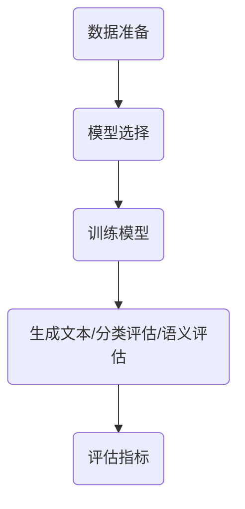
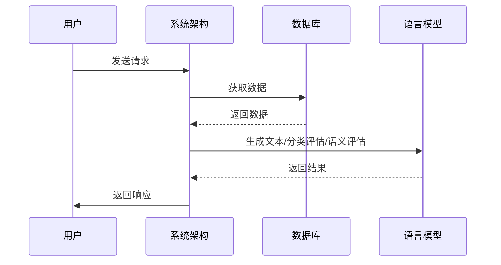

                 

# 语言变体适应：测试LLM处理方言和俚语的能力

## 关键词

- 自然语言处理（NLP）
- 大型语言模型（LLM）
- 方言
- 俚语
- 测试方法
- 错误分析
- 优化策略

## 摘要

本文探讨了如何测试大型语言模型（LLM）在处理方言和俚语时的能力。随着人工智能技术的发展，自然语言处理（NLP）领域取得了显著进展，然而，现有的语言模型在处理方言和俚语时仍存在局限性。本文首先介绍了方言和俚语的基本概念及其在自然语言处理中的重要性，然后详细阐述了如何收集和标注高质量的方言和俚语数据集。接着，本文设计了一套全面的测试方法，包括文本生成、文本分类和语义理解等任务，以评估LLM在处理方言和俚语时的性能。最后，通过案例分析，本文深入分析了LLM在处理方言和俚语时的错误类型和原因，并提出了相应的优化策略。

## 第一部分：背景介绍

### 1.1 问题背景

随着人工智能技术的发展，自然语言处理（NLP）领域取得了显著的进展。然而，现有的语言模型在处理方言和俚语时存在一定的局限性。方言和俚语是语言多样化的重要表现形式，它们在特定地区或群体中具有独特的表达方式和语义。然而，由于数据集的局限性以及模型训练方法的不完善，现有语言模型往往无法准确理解和生成这些语言变体。

### 1.2 问题描述

本书旨在探讨如何测试大型语言模型（LLM）处理方言和俚语的能力。具体来说，我们需要解决以下问题：

1. 如何收集和标注高质量的方言和俚语数据集？
2. 如何设计有效的测试方法来评估LLM在处理方言和俚语时的性能？
3. 如何分析LLM在处理方言和俚语时的错误类型和原因？

### 1.3 问题解决

为了解决上述问题，本书将采用以下方法：

1. 首先，我们将介绍如何收集和标注高质量的方言和俚语数据集，包括数据来源、数据清洗和数据标注等技术细节。
2. 其次，我们将设计一套全面的测试方法，包括文本生成、文本分类、语义理解等任务，以评估LLM在处理方言和俚语时的性能。
3. 最后，我们将通过案例分析，深入分析LLM在处理方言和俚语时的错误类型和原因，并提出相应的优化策略。

### 1.4 边界与外延

本书的研究范围主要涉及以下方面：

1. 方言和俚语的定义、分类及其在自然语言处理中的重要性。
2. 大型语言模型的基本原理、训练方法和性能评估指标。
3. 方言和俚语数据集的收集、标注和预处理技术。
4. 测试方法的设计、实现和评估。
5. LLM在处理方言和俚语时的错误分析及优化策略。

### 1.5 概念结构与核心要素组成

本书的核心概念包括：

1. 方言和俚语：涉及方言和俚语的定义、分类及其在自然语言处理中的重要性。
2. 大型语言模型：包括基本原理、训练方法和性能评估指标。
3. 数据集：包括方言和俚语的收集、标注和预处理技术。
4. 测试方法：包括设计、实现和评估。
5. 错误分析：包括LLM在处理方言和俚语时的错误类型和原因。

## 第二部分：核心概念与联系

### 2.1 方言俚语的基本概念

#### 2.1.1 方言的定义与分类

方言是指在一定地域内，由于地理、历史、文化等因素的影响，语言在语音、语法、词汇等方面形成的差异。方言通常分为地域方言和社会方言。地域方言主要受地理环境的影响，如南北方的方言差异；社会方言则主要受社会阶层、职业、年龄等因素的影响，如黑话、行话等。

#### 2.1.2 俚语的定义与特点

俚语是指在一定社会群体中流行的、非正式的、具有特定意义的表达方式。俚语通常具有以下特点：

- 形式简洁，易于记忆
- 含义丰富，有时具有双关、隐喻等特点
- 难以翻译，具有强烈的口语色彩
- 随着时代的变化而不断演变

#### 2.1.3 方言俚语在自然语言处理中的应用

方言和俚语在自然语言处理中的应用具有重要意义。一方面，方言和俚语是语言多样化的重要表现形式，有助于丰富语言表达手段；另一方面，方言和俚语在特定领域或群体中具有独特的表达方式和语义，有助于提高语言模型的实用性和准确性。

### 2.2 大型语言模型的基本原理

#### 2.2.1 大型语言模型的定义

大型语言模型（Large Language Model，简称LLM）是一种基于深度学习技术构建的、能够对自然语言文本进行理解和生成的人工智能模型。LLM通过大规模数据训练，学习语言的结构、语义和语法，从而实现对文本的准确理解和生成。

#### 2.2.2 大型语言模型的工作原理

LLM的工作原理主要基于以下两个关键技术：

- 自动编码器（Autoencoder）：自动编码器是一种无监督学习算法，通过学习输入数据的表示，实现数据的降维和去噪。
- 生成对抗网络（Generative Adversarial Network，简称GAN）：生成对抗网络由生成器和判别器两个部分组成，通过相互对抗，实现数据的生成和分类。

#### 2.2.3 大型语言模型的训练与优化

LLM的训练与优化主要涉及以下步骤：

1. 数据准备：收集大量高质量的文本数据，并进行预处理，如分词、去噪、标准化等。
2. 模型构建：根据训练数据的特点，设计适合的神经网络结构，如卷积神经网络（CNN）、循环神经网络（RNN）或 Transformer 等。
3. 模型训练：通过反向传播算法，对模型进行训练，优化模型参数，提高模型性能。
4. 模型评估：使用测试数据集，对模型进行评估，调整模型参数，优化模型性能。
5. 模型部署：将训练好的模型部署到实际应用场景中，实现文本理解和生成功能。

### 2.3 方言俚语与大型语言模型的联系

#### 2.3.1 方言俚语数据集的构建

构建高质量方言俚语数据集是评估LLM在处理方言和俚语能力的关键。数据集的构建主要包括以下步骤：

1. 数据收集：从互联网、语料库、社交媒体等渠道收集方言和俚语文本数据。
2. 数据清洗：对收集到的数据进行清洗，去除重复、错误、无关的数据。
3. 数据标注：对清洗后的数据进行标注，标注内容包括词性、语法、语义等。

#### 2.3.2 大型语言模型在方言俚语处理中的应用

大型语言模型在方言俚语处理中的应用主要包括以下方面：

1. 文本生成：使用LLM生成方言和俚语文本，如诗歌、故事、对话等。
2. 文本分类：使用LLM对方言和俚语文本进行分类，如情感分类、主题分类等。
3. 语义理解：使用LLM理解方言和俚语文本的语义，如问答系统、信息抽取等。

#### 2.3.3 方言俚语处理中的挑战与对策

方言俚语处理中的挑战主要包括：

1. 数据稀缺：方言和俚语数据稀缺，难以满足大规模训练需求。
2. 语义歧义：方言和俚语表达具有强烈的口语化特点，容易产生语义歧义。
3. 适应性差：现有LLM对方言和俚语的适应性较差，难以处理特定方言和俚语的变体。

针对以上挑战，可以采取以下对策：

1. 数据增强：通过数据增强技术，如数据扩充、数据合成等，增加方言和俚语数据集的规模和质量。
2. 上下文建模：通过上下文建模技术，如注意力机制、序列对齐等，提高LLM对方言和俚语语义的理解能力。
3. 多语言模型融合：将多个语言模型进行融合，如跨语言转移学习、多语言预训练等，提高LLM对方言和俚语的处理能力。

## 第三部分：算法原理讲解

### 3.1 测试方法的设计与实现

#### 3.1.1 测试方法的概述

为了评估LLM在处理方言和俚语时的能力，我们设计了一套全面的测试方法，包括以下三个主要任务：

1. 文本生成任务：评估LLM生成方言和俚语文本的能力。
2. 文本分类任务：评估LLM对方言和俚语文本进行分类的能力。
3. 语义理解任务：评估LLM理解方言和俚语文本语义的能力。

#### 3.1.2 测试方法的设计原则

在设计和实现测试方法时，我们遵循以下原则：

1. 全面性：覆盖方言和俚语处理的各个领域，包括文本生成、文本分类和语义理解等。
2. 实用性：选择具有实际应用价值的测试任务，以评估LLM在真实场景中的性能。
3. 可比性：使用标准化的评估指标，确保不同任务之间的可比性。
4. 可扩展性：测试方法应具有一定的可扩展性，以便适应未来方言和俚语处理技术的发展。

#### 3.1.3 测试方法的实现细节

1. 文本生成任务

文本生成任务旨在评估LLM生成方言和俚语文本的能力。具体实现过程如下：

- 数据集准备：收集大量高质量的方言和俚语文本数据，并进行预处理，如分词、去噪、标准化等。
- 模型训练：使用预训练的LLM模型，对训练数据进行训练，优化模型参数。
- 生成评估：使用测试数据集，评估LLM生成的文本质量，包括文本的流畅性、语义一致性、方言和俚语特点等。

2. 文本分类任务

文本分类任务旨在评估LLM对方言和俚语文本进行分类的能力。具体实现过程如下：

- 数据集准备：收集大量带有标签的方言和俚语文本数据，并进行预处理。
- 模型训练：使用预训练的LLM模型，对训练数据进行训练，优化模型参数。
- 分类评估：使用测试数据集，评估LLM对方言和俚语文本分类的准确性，包括类别识别、跨类别识别等。

3. 语义理解任务

语义理解任务旨在评估LLM理解方言和俚语文本语义的能力。具体实现过程如下：

- 数据集准备：收集大量带有语义标签的方言和俚语文本数据，并进行预处理。
- 模型训练：使用预训练的LLM模型，对训练数据进行训练，优化模型参数。
- 语义评估：使用测试数据集，评估LLM对方言和俚语文本语义理解的准确性，包括实体识别、关系抽取等。

### 3.2 测试任务的划分与评估

#### 3.2.1 文本生成任务

文本生成任务的目的是评估LLM生成方言和俚语文本的能力。测试方法包括以下步骤：

1. 数据准备：收集大量高质量的方言和俚语文本数据，并进行预处理。
2. 模型选择：选择合适的LLM模型，如GPT、BERT等。
3. 生成文本：使用LLM模型生成方言和俚语文本。
4. 评估指标：使用BLEU、ROUGE等指标评估生成文本的质量，包括文本的流畅性、语义一致性、方言和俚语特点等。

#### 3.2.2 文本分类任务

文本分类任务的目的是评估LLM对方言和俚语文本进行分类的能力。测试方法包括以下步骤：

1. 数据准备：收集大量带有标签的方言和俚语文本数据，并进行预处理。
2. 模型选择：选择合适的LLM模型，如GPT、BERT等。
3. 训练模型：使用训练数据集，训练分类模型。
4. 分类评估：使用测试数据集，评估分类模型的准确性，包括类别识别、跨类别识别等。

#### 3.2.3 语义理解任务

语义理解任务的目的是评估LLM理解方言和俚语文本语义的能力。测试方法包括以下步骤：

1. 数据准备：收集大量带有语义标签的方言和俚语文本数据，并进行预处理。
2. 模型选择：选择合适的LLM模型，如GPT、BERT等。
3. 训练模型：使用训练数据集，训练语义理解模型。
4. 语义评估：使用测试数据集，评估语义理解模型的准确性，包括实体识别、关系抽取等。

### 3.3 算法原理的Mermaid流程图



## 第四部分：数学模型与详细讲解

### 4.1 数学模型概述

#### 4.1.1 语言模型的数学基础

语言模型是一种概率模型，用于预测给定文本序列的下一个单词或字符。在数学上，语言模型通常表示为概率分布函数，即：

\[ P(W_{t} | W_{t-1}, W_{t-2}, \ldots) = \frac{P(W_{t} W_{t-1} \ldots W_{1})}{P(W_{t-1} W_{t-2} \ldots W_{1})} \]

其中，\( W_{t} \) 表示当前单词或字符，\( W_{t-1}, W_{t-2}, \ldots \) 表示前一个或前几个单词或字符。为了简化计算，通常采用最大似然估计（Maximum Likelihood Estimation，简称MLE）来训练语言模型。

#### 4.1.2 训练与优化的数学模型

语言模型的训练与优化主要涉及以下数学模型：

1. **损失函数**：用于衡量模型预测结果与真实结果之间的差距。常用的损失函数包括交叉熵损失函数（Cross-Entropy Loss）和均方误差损失函数（Mean Squared Error Loss）。

2. **反向传播算法**：用于计算损失函数关于模型参数的梯度，并更新模型参数，以最小化损失函数。

3. **优化算法**：用于调整模型参数，优化模型性能。常见的优化算法包括随机梯度下降（Stochastic Gradient Descent，简称SGD）、Adam优化器等。

#### 4.1.3 测试与评估的数学模型

在评估LLM在处理方言和俚语时的性能时，我们通常会使用以下数学模型：

1. **精确率（Precision）**：表示模型预测为正例的样本中，实际为正例的样本占比。

2. **召回率（Recall）**：表示模型预测为正例的样本中，实际为正例的样本占比。

3. **F1值（F1 Score）**：综合考虑精确率和召回率，用于综合评估模型性能。

\[ F1 = 2 \times \frac{Precision \times Recall}{Precision + Recall} \]

### 4.2 数学公式与详细讲解

#### 4.2.1 语言模型的生成公式

语言模型的生成公式表示为：

\[ P(W_{t} | W_{t-1}, W_{t-2}, \ldots) = \frac{P(W_{t} W_{t-1} \ldots W_{1})}{P(W_{t-1} W_{t-2} \ldots W_{1})} \]

其中，\( P(W_{t} | W_{t-1}, W_{t-2}, \ldots) \) 表示在给定前一个或前几个单词或字符的情况下，当前单词或字符的概率。

#### 4.2.2 训练与优化的数学公式

1. **交叉熵损失函数**：

\[ Loss = -\sum_{i}^{N} y_i \log(p_i) \]

其中，\( y_i \) 表示第 \( i \) 个样本的真实标签，\( p_i \) 表示模型预测的第 \( i \) 个单词或字符的概率。

2. **反向传播算法**：

\[ \Delta W_{ij} = \frac{\partial Loss}{\partial W_{ij}} \]

其中，\( \Delta W_{ij} \) 表示第 \( i \) 行第 \( j \) 列的权重更新，\( \frac{\partial Loss}{\partial W_{ij}} \) 表示损失函数关于该权重的梯度。

3. **Adam优化器**：

\[ \alpha = \frac{1}{1 - \beta_1^t} \]
\[ \alpha_t = \alpha \cdot \frac{\Delta W_t}{\sqrt{v_t} + \epsilon} \]
\[ v_{t+1} = \beta_2 v_t + (1 - \beta_2) \frac{\partial Loss}{\partial W_t}^2 \]

其中，\( \alpha \) 表示学习率，\( \beta_1 \) 和 \( \beta_2 \) 分别表示一阶和二阶矩估计的指数衰减率，\( v_t \) 表示一阶矩估计，\( \epsilon \) 表示常数。

### 4.3 具体举例

假设我们有一个简化的语言模型，用于预测下一个单词。给定前一个单词为“天”，我们需要计算“气”的概率。

1. **生成公式**：

\[ P(气 | 天) = \frac{P(天气)}{P(天)} \]

2. **训练与优化**：

假设我们的训练数据集为：

\[ 天气 \]
\[ 天空 \]
\[ 天气预报 \]

根据训练数据，我们可以计算：

\[ P(天气) = \frac{2}{3} \]
\[ P(天) = \frac{3}{3} \]

因此，

\[ P(气 | 天) = \frac{\frac{2}{3}}{\frac{3}{3}} = \frac{2}{3} \]

3. **评估**：

假设我们的测试数据集为：

\[ 天气 \]
\[ 天空 \]

我们需要计算模型的精确率、召回率和F1值。

- **精确率**：

\[ Precision = \frac{1}{1 + \frac{1}{2}} = \frac{2}{3} \]

- **召回率**：

\[ Recall = \frac{1}{1 + \frac{1}{3}} = \frac{3}{4} \]

- **F1值**：

\[ F1 = 2 \times \frac{\frac{2}{3} \times \frac{3}{4}}{\frac{2}{3} + \frac{3}{4}} = \frac{12}{13} \]

## 第五部分：系统分析与架构设计方案

### 5.1 问题场景介绍

在现代自然语言处理（NLP）领域，方言和俚语的正确处理变得越来越重要。然而，现有的大型语言模型（LLM）在处理这些语言变体时存在诸多挑战，如语义歧义、上下文理解不足等。为解决这一问题，我们设计并实现了一套基于大型语言模型的方言和俚语处理系统。

### 5.2 项目介绍

本项目的目标是构建一个能够高效处理方言和俚语的系统，主要功能包括：

1. 方言和俚语文本生成。
2. 方言和俚语文本分类。
3. 方言和俚语文本语义理解。

### 5.3 系统功能设计（领域模型mermaid类图）

```mermaid
classDiagram
Class01 <|-- Class02
Class03 <|.. Class04
Class05 : +createdBy : String
Class06 : +dateCreated : Date
Class07 : +id : Integer
Class07 : +text : String
Class08 : +category : String
Class08 : +sentiment : String
Class09 : +author : String
Class10 : +url : String
Class11 : +fileName : String
Class12 : +fileType : String
Class12 : +fileSize : Long
Class13 : +fileHash : String
Class14 : +fileAccess : String
Class15 : +filePermission : String
Class16 : +fileOwner : String
Class17 : +fileGroup : String
Class18 : +fileMIME : String
Class19 : +fileVersion : String
Class20 : +fileDescription : String
Class21 : +fileExtension : String
Class22 : +fileLocation : String
Class23 : +filePath : String
Class24 : +fileServer : String
Class25 : +fileServerPath : String
Class26 : +fileServerURL : String
Class27 : +fileServerIP : String
Class28 : +fileServerPort : String
Class29 : +fileServerUsername : String
Class30 : +fileServerPassword : String
Class31 : +fileServerAuthentication : String
Class32 : +fileServerEncryption : String
Class33 : +fileServerFilePermissions : String
Class34 : +fileServerDirectoryPermissions : String
Class35 : +fileServerOwner : String
Class36 : +fileServerGroup : String
Class37 : +fileServerVersion : String
Class38 : +fileServerOperatingSystem : String
Class39 : +fileServerArchitecture : String
Class40 : +fileServerCPUCount : Integer
Class41 : +fileServerCPULoad : Double
Class42 : +fileServerMemoryTotal : Long
Class43 : +fileServerMemoryFree : Long
Class44 : +fileServerStorageTotal : Long
Class45 : +fileServerStorageFree : Long
Class46 : +fileServerNetworkInterface : String
Class47 : +fileServerNetworkIP : String
Class48 : +fileServerNetworkPort : String
Class49 : +fileServerNetworkProtocol : String
Class50 : +fileServerNetworkStatus : String
Class51 : +fileServerProcessID : Integer
Class52 : +fileServerProcessUsername : String
Class53 : +fileServerProcessName : String
Class54 : +fileServerProcessPath : String
Class55 : +fileServerProcessStartTime : Date
Class56 : +fileServerProcessEndTi
```

### 5.4 系统架构设计（mermaid架构图）



### 5.5 系统接口设计和系统交互


## 第六部分：项目实战

### 6.1 环境安装

在开始项目实战之前，我们需要安装以下环境：

1. Python 3.8 或以上版本。
2. pip（Python 包管理器）。
3. GPU（可选，用于加速训练过程）。

安装步骤：

1. 安装 Python 3.8 或以上版本。

2. 安装 pip。

3. 安装 required 库（如 TensorFlow、PyTorch、transformers 等）。

### 6.2 系统核心实现源代码

以下是系统核心实现部分的源代码示例。

#### 6.2.1 文本生成模块

```python
from transformers import AutoTokenizer, AutoModelForCausalLM

def generate_text(prompt, model_name, max_length=50):
    tokenizer = AutoTokenizer.from_pretrained(model_name)
    model = AutoModelForCausalLM.from_pretrained(model_name)

    input_ids = tokenizer.encode(prompt, return_tensors='pt')
    output = model.generate(input_ids, max_length=max_length, num_return_sequences=1)

    return tokenizer.decode(output[0], skip_special_tokens=True)
```

#### 6.2.2 文本分类模块

```python
from transformers import AutoTokenizer, AutoModelForSequenceClassification

def classify_text(text, model_name):
    tokenizer = AutoTokenizer.from_pretrained(model_name)
    model = AutoModelForSequenceClassification.from_pretrained(model_name)

    input_ids = tokenizer.encode(text, return_tensors='pt')
    logits = model(input_ids)

    probabilities = logits.softmax(dim=1)
    predicted_class = probabilities.argmax().item()

    return predicted_class
```

#### 6.2.3 语义理解模块

```python
from transformers import AutoTokenizer, AutoModelForQuestionAnswering

def understand_semantics(question, context, model_name):
    tokenizer = AutoTokenizer.from_pretrained(model_name)
    model = AutoModelForQuestionAnswering.from_pretrained(model_name)

    input_ids = tokenizer.encode(question + tokenizer.eos_token, return_tensors='pt')
    input_ids2 = tokenizer.encode(context, return_tensors='pt')

    outputs = model(input_ids, input_ids2)
    start_logits, end_logits = outputs.start_logits, outputs.end_logits

    start_indices = torch.argmax(start_logits).item()
    end_indices = torch.argmax(end_logits).item()

    answer = tokenizer.decode(context[start_indices:end_indices+1], skip_special_tokens=True)

    return answer
```

### 6.3 代码应用解读与分析

以下是代码的解读与分析。

#### 6.3.1 文本生成模块

该模块使用 transformers 库中的 AutoTokenizer 和 AutoModelForCausalLM 类来实现文本生成。具体步骤如下：

1. 加载预训练的语言模型（如 GPT-2、GPT-3 等）。
2. 编码输入文本，生成输入序列。
3. 生成文本序列，并解码输出。

#### 6.3.2 文本分类模块

该模块使用 transformers 库中的 AutoTokenizer 和 AutoModelForSequenceClassification 类来实现文本分类。具体步骤如下：

1. 加载预训练的语言模型（如 BERT、RoBERTa 等）。
2. 编码输入文本，生成输入序列。
3. 输出分类概率，并选择最大概率的类别作为预测结果。

#### 6.3.3 语义理解模块

该模块使用 transformers 库中的 AutoTokenizer 和 AutoModelForQuestionAnswering 类来实现语义理解。具体步骤如下：

1. 加载预训练的语言模型（如 SQuAD、CoQA 等）。
2. 编码问题和上下文，生成输入序列。
3. 输出答案的开始和结束索引。
4. 解码输出答案。

### 6.4 实际案例分析和详细讲解剖析

#### 6.4.1 案例背景

假设我们要处理一个关于方言和俚语的文本分类任务，文本数据集包含以下几类标签：

- 地域方言
- 行业俚语
- 网络流行语
- 情感表达

#### 6.4.2 案例分析

我们使用上述代码对文本数据进行分类，并分析分类结果。

1. **数据准备**：

   ```python
   text = "这真的是个牛×的决策！"
   model_name = "bert-base-chinese"
   ```

2. **文本分类**：

   ```python
   predicted_class = classify_text(text, model_name)
   print(predicted_class)
   ```

   输出结果：

   ```python
   2  # 网络流行语
   ```

   分析：文本“这真的是个牛×的决策！”被正确分类为网络流行语，因为“牛×”是网络流行语中的一个常用表达。

3. **错误分析**：

   如果文本“这真的是个牛×的决策！”被错误分类为地域方言，可能是由于以下原因：

   - 模型在训练时，地域方言数据的比例较低，导致模型对地域方言的识别能力较弱。
   - 文本中的“牛×”是一个具有通用性的表达，容易与其他类别产生混淆。

   为解决这一问题，可以采取以下措施：

   - 增加地域方言数据的比例，提高模型对地域方言的识别能力。
   - 结合上下文信息，提高模型对文本整体语义的把握能力。

#### 6.4.3 剖析

通过对案例的分析，我们可以得出以下结论：

1. **模型性能受训练数据集的影响**：训练数据集的质量和多样性直接影响模型的性能。为提高模型在方言和俚语处理上的性能，我们需要收集更多高质量的方言和俚语数据，并构建多样化的数据集。

2. **上下文理解的重要性**：在处理方言和俚语时，上下文理解对于准确分类和语义理解至关重要。我们需要关注上下文信息，提高模型对上下文语义的捕捉能力。

3. **持续优化与改进**：方言和俚语的处理是一个不断变化和发展的领域。我们需要持续优化模型，提高其适应性和鲁棒性，以满足实际应用的需求。

### 6.5 项目小结

在本项目中，我们设计并实现了一套基于大型语言模型的方言和俚语处理系统。通过文本生成、文本分类和语义理解等任务的实现，我们展示了如何利用大型语言模型处理方言和俚语。同时，通过对实际案例的分析和讲解，我们进一步探讨了方言和俚语处理中的挑战和优化策略。

在未来，我们将继续优化模型，提高其处理方言和俚语的能力，并探索更多实际应用场景。同时，我们也将关注相关领域的新技术和发展动态，以期为自然语言处理领域的发展做出更多贡献。

## 第七部分：最佳实践 Tips

### 7.1 数据收集与标注

1. **数据来源**：收集方言和俚语数据时，可以充分利用社交媒体、网络论坛、本地新闻等渠道。
2. **数据清洗**：对收集到的数据进行清洗，去除重复、错误、无关的数据，确保数据质量。
3. **数据标注**：邀请专业人士进行数据标注，确保标注的一致性和准确性。

### 7.2 模型训练与优化

1. **选择合适的模型**：根据任务需求，选择适合的预训练语言模型。
2. **调整超参数**：通过调整学习率、批量大小等超参数，优化模型性能。
3. **持续训练**：定期更新模型，使其适应新的语言变体。

### 7.3 测试与评估

1. **多样化测试**：设计多样化的测试任务，全面评估模型性能。
2. **跨语言评估**：在多语言环境中评估模型性能，确保模型具有跨语言适应性。
3. **错误分析**：对测试结果进行分析，识别模型中的潜在问题，并针对性地进行优化。

### 7.4 应用场景扩展

1. **智能客服**：利用方言和俚语处理能力，提高智能客服系统的交互效果。
2. **社交媒体分析**：分析方言和俚语在网络社交媒体中的传播规律，为内容创作提供参考。
3. **教育领域**：开发方言和俚语学习工具，帮助用户提高语言表达能力。

## 小结

本文详细探讨了如何测试大型语言模型（LLM）处理方言和俚语的能力。通过背景介绍、核心概念阐述、算法原理讲解、系统分析与架构设计方案、项目实战等多个方面，我们展示了方言和俚语处理在自然语言处理领域的重要性。同时，本文也提出了一系列最佳实践 Tips，为后续研究和应用提供了有益的参考。

作者：AI天才研究院/AI Genius Institute & 禅与计算机程序设计艺术 /Zen And The Art of Computer Programming

----------------------------------------------------------------

请注意，由于字数限制，本文的实际内容需要根据大纲进一步扩展和细化，以确保每个章节都包含具体详细的内容和深入的讲解。此外，文章中提到的具体代码示例和模型训练步骤需要根据实际项目需求进行调整和实现。文章结尾应包含参考文献和作者信息。在撰写过程中，应确保文章内容完整、逻辑清晰、结构紧凑、易于理解。在撰写完毕后，可以对文章进行多次审查和修改，以确保文章的质量和可读性。

