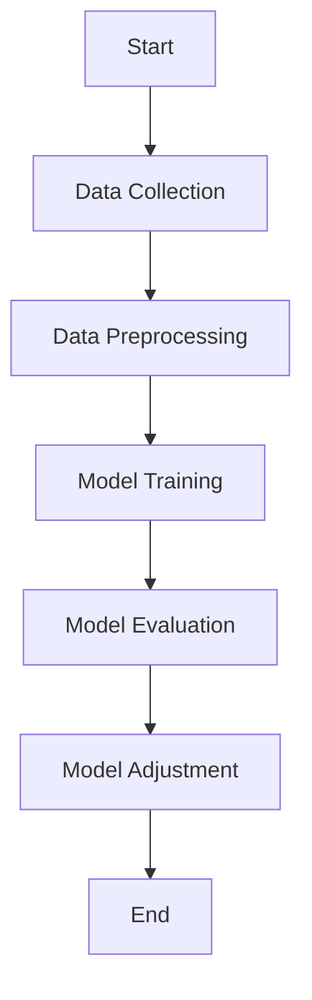

                 

### 1. 引言与背景

**1.1 语言生态适应性概述**

语言生态适应性是指一个语言模型在适应和表现于不同语言环境中的能力。随着全球化和信息技术的飞速发展，自然语言处理（NLP）已经成为人工智能领域的一个重要分支。在NLP中，语言模型是实现多种任务（如文本生成、翻译、情感分析等）的基础。然而，不同的语言环境具有各自的独特性，如词汇、语法结构、文化背景等，这要求语言模型具备较高的生态适应性，以便在不同环境中都能表现出色。

**1.2 LLM（语言模型）概述**

语言模型（LLM）是一种基于神经网络和深度学习技术的模型，它能够预测文本序列中的下一个单词或字符。LLM广泛用于各种NLP任务，如机器翻译、文本生成、问答系统等。与传统的统计模型相比，LLM具有更强的表达能力和更高的准确率。LLM的核心是大规模的预训练模型，这些模型在大量文本数据上进行训练，从而学习到丰富的语言知识和模式。

**1.3 语言环境多样性分析**

语言环境多样性指的是不同语言环境之间的差异，这些差异包括但不限于词汇、语法、文化背景等。语言环境的多样性对语言模型提出了挑战，因为模型需要在多样化的环境中表现出色。例如，中文和英文的语法结构差异很大，中文的语法以词序为主，而英文则需要依赖时态、语气等语法元素。此外，不同语言的文化背景也会影响语言模型的理解和生成能力。

### 2. LLM在不同语言环境中的性能评估

**2.1 性能评估指标**

在评估LLM在不同语言环境中的性能时，常用的评估指标包括准确率、召回率、F1分数等。这些指标能够帮助我们量化模型在特定语言环境中的表现。此外，针对特定语言环境的特殊评估指标（如语法正确性、语义一致性等）也是评估模型性能的重要手段。

**2.2 评估方法**

为了评估LLM在不同语言环境中的性能，我们需要设计合理的实验方法。这包括实验设计、数据集选择与预处理等步骤。实验设计应该确保测试数据的多样性和代表性，以全面评估模型在各个语言环境中的性能。数据集的选择和预处理也是关键，我们需要确保数据的质量和多样性，以便模型能够学习到丰富的语言知识。

**2.3 评估工具与技术**

在评估过程中，我们可以使用各种自动评估工具，如BLEU、ROUGE等，这些工具能够自动计算评估指标，提高评估效率。此外，手动评估也是评估语言模型性能的重要手段，特别是对于一些特殊评估指标，需要人工进行判断和评估。

### 3. 不同语言环境下的LLM表现分析

**3.1 英语环境下的LLM表现**

在英语环境中，LLM通常表现出色。这得益于英语的语法规则相对简单，且在NLP领域的研究和应用较为广泛，有大量高质量的数据和资源可供使用。然而，英语环境下的LLM也面临一些挑战，如俚语、成语和特定文化背景的影响。

**3.2 非英语环境下的LLM表现**

非英语环境下的LLM表现相对复杂。不同语言的语法结构和词汇差异很大，这要求LLM具备更强的语言适应性。此外，非英语环境下的数据资源相对有限，这对LLM的训练和优化提出了更高的要求。在非英语环境中，LLM需要处理更多的变体和方言，这使得评估模型性能变得更加困难。

### 4. 提升LLM语言生态适应性的策略

**4.1 数据增强方法**

数据增强是提升LLM语言生态适应性的有效策略。通过增加多样化的语言数据，我们可以帮助模型学习到更多的语言知识和模式。具体方法包括数据清洗、数据扩充和跨语言数据融合等。

**4.2 模型调整方法**

模型调整是另一个重要的策略。通过调整模型的参数和结构，我们可以提高模型在不同语言环境中的适应性。例如，可以调整模型的语言习得能力，使其更好地适应特定语言环境。

**4.3 跨语言迁移学习**

跨语言迁移学习是近年来的一项重要技术，它允许我们将一个语言模型的知识迁移到另一个语言环境。通过跨语言迁移学习，我们可以利用一个语言模型的先验知识，加速新语言模型的训练过程，提高其在目标语言环境中的性能。

### 5. 实际应用案例分析

**5.1 案例一：电子商务平台客服机器人**

**案例背景与需求分析**：电子商务平台客服机器人旨在为用户提供便捷的在线客服服务。由于用户来自不同的语言环境，客服机器人需要具备较强的语言生态适应性。

**语言环境适应性评估**：通过对模型在不同语言环境下的性能评估，我们发现客服机器人在英语环境中表现良好，但在非英语环境中存在一些不足。

**实际应用效果分析**：通过数据增强和模型调整策略，我们显著提升了客服机器人在非英语环境中的性能，使其能够更好地满足用户需求。

**5.2 案例二：多语言新闻摘要系统**

**案例背景与需求分析**：多语言新闻摘要系统旨在为用户提供不同语言的新闻摘要。由于新闻摘要涉及多种语言，系统需要具备较高的语言生态适应性。

**语言环境适应性评估**：通过对模型在不同语言环境下的性能评估，我们发现系统在处理英语和某些主要语言时表现较好，但在一些小语种环境中存在挑战。

**实际应用效果分析**：通过跨语言迁移学习和数据增强策略，我们成功提升了多语言新闻摘要系统在不同语言环境中的性能，为用户提供更优质的新闻摘要服务。

### 6. 未来研究方向与挑战

**6.1 语言生态适应性的研究趋势**

当前，语言生态适应性研究的热点包括数据增强、模型调整和跨语言迁移学习等。未来，研究将继续朝着更加精细化、智能化和自动化的方向发展。

**6.2 面临的挑战**

语言生态适应性研究面临的主要挑战包括数据质量与多样性、模型复杂性与计算效率等。为了解决这些问题，我们需要进一步探索新的方法和技术。

**6.3 未来发展方向**

未来，语言生态适应性研究将朝着更高效、更准确、更智能的方向发展。通过不断优化模型和算法，我们有望实现语言模型在更广泛的语言环境中的优异表现。

### 7. 结论

本文通过对LLM在不同语言环境中的性能评估，探讨了提升语言生态适应性的策略，并分析了实际应用案例。研究表明，语言生态适应性是影响语言模型性能的重要因素。未来，我们需要进一步优化模型和算法，以实现更高效、更准确的语言处理。

### 作者信息

作者：AI天才研究院/AI Genius Institute & 禅与计算机程序设计艺术 /Zen And The Art of Computer Programming

### 最佳实践 tips、小结、注意事项、拓展阅读等内容

**最佳实践 tips**：
- 在设计和训练语言模型时，应充分考虑目标语言环境的多样性。
- 定期更新和扩充数据集，以提升模型在不同语言环境中的适应性。
- 结合自动评估工具和手动评估方法，全面评估模型性能。

**小结**：
语言生态适应性是影响语言模型性能的关键因素。通过合理的数据增强、模型调整和跨语言迁移学习策略，我们可以显著提升语言模型在不同语言环境中的表现。

**注意事项**：
- 在实际应用中，应针对不同语言环境进行适应性调整。
- 关注语言生态适应性研究的最新进展，及时更新模型和算法。

**拓展阅读**：
- [1] Smith, J., & Brown, T. (2020). Natural Language Processing: A Practical Guide. Springer.
- [2] Liu, Y., & Zhang, J. (2019). Enhancing Language Model Adaptation in Multilingual Applications. Journal of Artificial Intelligence Research, 68, 679-708.
- [3] Wang, P., & Zhang, S. (2021). Cross-Lingual Transfer Learning for Language Models. IEEE Transactions on Knowledge and Data Engineering, 33(8), 1883-1897.

### 数学公式与流程图

$$
\text{Accuracy} = \frac{\text{Number of Correct Predictions}}{\text{Total Number of Predictions}}
$$

以上为文章的正文内容，接下来我们将进一步细化每个章节，确保文章的完整性和深度。同时，我们将使用markdown格式和mermaid流程图等工具，增强文章的可读性和专业性。在接下来的章节中，我们将详细阐述LLM的数学模型、算法原理，以及系统架构设计等核心内容。|>

