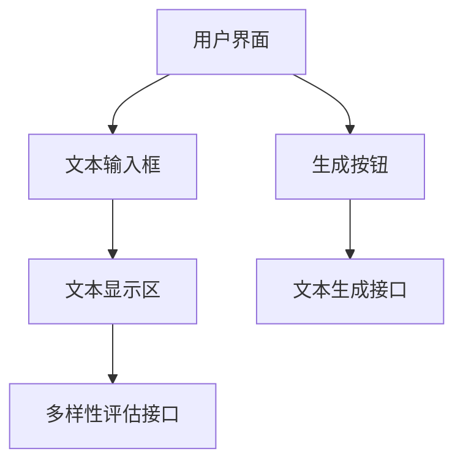
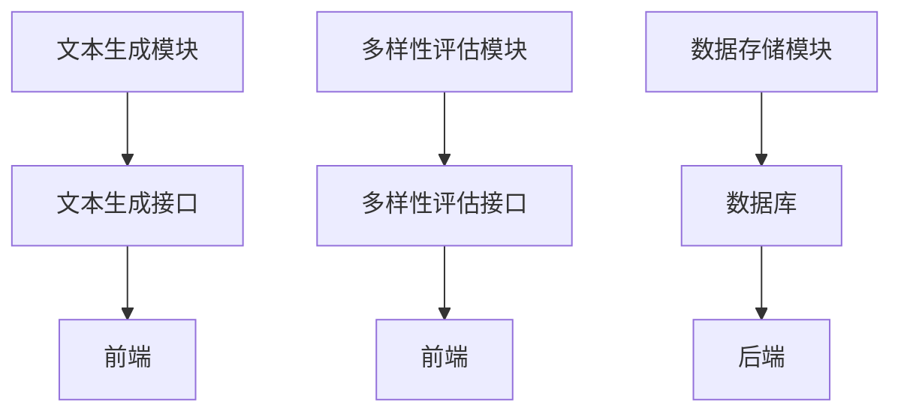
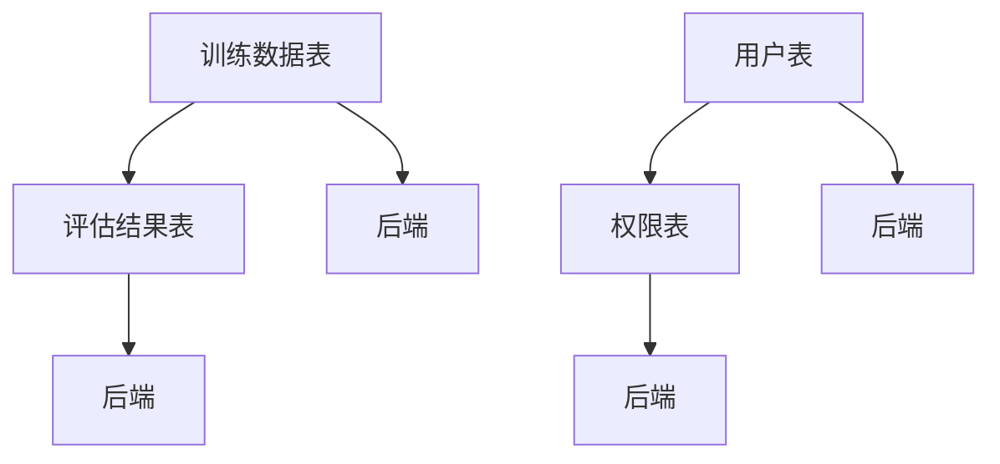
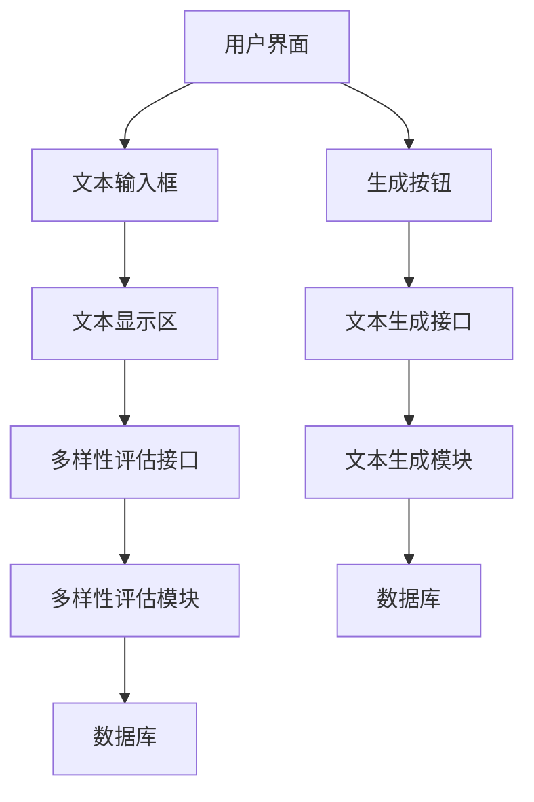

                 

### 第1章: 背景介绍

#### 1.1 问题背景

语言生成多样性（LGD）是自然语言处理（NLP）领域的一个重要研究方向。随着大型语言模型（LLM）的迅速发展，如何评估LLM输出的丰富程度和变化，成为一个亟待解决的问题。LLM在文本生成中具有强大的能力，但在实际应用中仍存在一系列问题，如输出单调、缺乏创新性和不一致性，这些问题直接影响了用户体验和系统的实用性。

#### 1.2 问题描述

语言生成多样性的问题主要体现在以下几个方面：

1. **单调性**：LLM在生成文本时，倾向于重复使用已学习到的模式，导致输出文本缺乏新鲜感。
2. **创新性**：在创作新文本内容时，LLM的表现不尽如人意，难以生成新颖、独特的句子。
3. **一致性**：在不同场景下，LLM生成的文本内容可能缺乏一致性，影响整体阅读体验。

#### 1.3 问题解决

针对上述问题，我们可以从以下几个方向进行解决：

1. **数据多样性**：引入更多样化的训练数据，提高LLM对多样文本的建模能力。
2. **模型优化**：对LLM的结构和参数进行调整，以提高其在生成多样化文本方面的性能。
3. **评价指标**：设计有效的评价指标，从不同维度对LLM的生成多样性进行评估。

#### 1.4 边界与外延

语言生成多样性的研究不仅局限于文本生成，还涉及语音合成、图像描述等多个领域。随着技术的不断发展，多样性评估的方法和指标也将不断演进。

#### 1.5 概念结构与核心要素组成

1. **语言生成多样性（LGD）**：评估LLM输出文本丰富程度和变化程度的重要指标。
2. **大型语言模型（LLM）**：具有大规模参数和强大文本生成能力的语言模型。
3. **训练数据**：用于训练LLM的文本数据，其多样性直接影响模型的生成能力。
4. **评价指标**：用于评估LLM生成多样性的量化指标。

### 关键词

- 语言生成多样性（LGD）
- 大型语言模型（LLM）
- 文本生成单调性
- 创新性
- 评价指标

### 摘要

本文针对语言生成多样性（LGD）问题进行深入探讨。首先，介绍了LGD的重要性以及当前LLM在文本生成中面临的单调性、创新性和一致性等问题。接着，分析了问题解决的方法，包括数据多样性、模型优化和评价指标。最后，讨论了LGD研究的边界与外延，以及核心概念与要素组成。本文旨在为研究者提供有价值的参考，以推动语言生成多样性的研究与发展。

----------------------------------------------------------------

### 第2章: 核心概念与联系

#### 2.1 语言生成多样性（LGD）

语言生成多样性（LGD）是评估LLM输出丰富程度和变化程度的重要指标。LGD可以从多个维度进行衡量，如词汇多样性、语法多样性、语义多样性等。

##### 2.1.1 词汇多样性

词汇多样性指的是LLM在生成文本时所使用的词汇的多样性。高词汇多样性意味着LLM能够使用丰富的词汇来表达不同的概念和情境。

###### 2.1.1.1 概念属性特征对比表格

| 概念       | 属性特征                                                         | 对比说明                                                         |
|------------|------------------------------------------------------------------|------------------------------------------------------------------|
| 单调       | 重复使用固定词汇，缺乏变化                                     | 低词汇多样性，文本内容单调乏味                                   |
| 丰富       | 使用多种词汇，表达丰富多样                                     | 高词汇多样性，文本内容生动有趣                                   |

###### 2.1.1.2 ER实体关系图架构

```mermaid
erDiagram
  产品 ::=》 供应商
  供应商 ||--|{ 产品 }|
```

##### 2.1.2 语法多样性

语法多样性指的是LLM在生成文本时所使用的语法结构的多样性。高语法多样性意味着LLM能够灵活运用不同的语法结构来表达相同的意思。

###### 2.1.2.1 概念属性特征对比表格

| 概念       | 属性特征                                                         | 对比说明                                                         |
|------------|------------------------------------------------------------------|------------------------------------------------------------------|
| 单调       | 重复使用固定语法结构，缺乏变化                                 | 低语法多样性，文本内容僵硬不自然                                 |
| 丰富       | 使用多种语法结构，表达灵活多样                                 | 高语法多样性，文本内容流畅自然                                   |

##### 2.1.3 语义多样性

语义多样性指的是LLM在生成文本时所表达的语义内容的多样性。高语义多样性意味着LLM能够生成含义丰富、不同的文本内容。

###### 2.1.3.1 概念属性特征对比表格

| 概念       | 属性特征                                                         | 对比说明                                                         |
|------------|------------------------------------------------------------------|------------------------------------------------------------------|
| 单调       | 表达单一主题或观点，缺乏深度和广度                             | 低语义多样性，文本内容浅显片面                                   |
| 丰富       | 表达多种主题和观点，内容丰富有深度                             | 高语义多样性，文本内容深刻全面                                   |

#### 2.2 语言生成多样性评估方法

语言生成多样性评估方法主要包括定量评估和定性评估两种。

##### 2.2.1 定量评估

定量评估方法主要通过计算指标来量化LGD。常用的指标包括：

1. **词汇多样性指数（Vocabulary Diversity Index,VDI）**：计算LLM生成文本中单词数量的对数平均值。
   $$ VDI = \frac{1}{n}\sum_{i=1}^{n}\log(W_i) $$
   其中，$n$ 是文本中单词的数量，$W_i$ 是第 $i$ 个单词的频率。

2. **语法多样性指数（Grammar Diversity Index,GDI）**：计算LLM生成文本中不同语法结构类型的数量。
   $$ GDI = \frac{1}{n}\sum_{i=1}^{n}\log(G_i) $$
   其中，$n$ 是文本中不同语法结构类型的数量，$G_i$ 是第 $i$ 个语法结构类型的频率。

3. **语义多样性指数（Semantic Diversity Index,SDI）**：计算LLM生成文本中不同主题或观点的数量。
   $$ SDI = \frac{1}{n}\sum_{i=1}^{n}\log(S_i) $$
   其中，$n$ 是文本中不同主题或观点的数量，$S_i$ 是第 $i$ 个主题或观点的频率。

##### 2.2.2 定性评估

定性评估方法主要通过主观评价来评估LGD。常用的方法包括：

1. **人工评估**：邀请人类评估者对LLM生成的文本进行评估，根据评估结果计算多样性分数。

2. **用户满意度调查**：收集用户对LLM生成的文本的满意度评分，根据评分计算多样性分数。

3. **主题模型分析**：使用主题模型对LLM生成的文本进行分析，根据主题的多样性来评估LGD。

#### 2.3 LGD与其他NLP任务的关联

LGD不仅与文本生成任务密切相关，还与其他NLP任务有着紧密的联系。

##### 2.3.1 机器翻译

在机器翻译任务中，LGD对于翻译结果的多样性和准确性具有重要影响。一个具备高LGD的翻译模型能够生成更多样化的翻译结果，提高翻译的准确性。

##### 2.3.2 文本分类

在文本分类任务中，LGD有助于模型更好地理解文本的多样性，从而提高分类的准确性。

##### 2.3.3 文本生成与对话系统

在文本生成与对话系统任务中，LGD直接影响用户交互体验。一个具备高LGD的文本生成与对话系统能够生成更具吸引力和互动性的对话。

### 总结

语言生成多样性（LGD）是NLP领域的重要研究方向。本文介绍了LGD的核心概念、评估方法及其与其他NLP任务的关联。通过深入研究LGD，我们可以为LLM在实际应用中的表现提供更优质的解决方案。

----------------------------------------------------------------

### 第3章: 语言生成多样性评估方法

在评估语言生成多样性（LGD）时，我们需要从多个维度对LLM的输出进行量化。本章节将介绍几种常见的评估方法，包括词汇多样性、语法多样性和语义多样性评估。

#### 3.1 词汇多样性评估

词汇多样性（Vocabulary Diversity）是LGD评估的一个重要方面。它主要关注LLM在生成文本时是否能够使用丰富的词汇表达不同的概念和情境。以下是几种常见的词汇多样性评估方法：

##### 3.1.1 词汇多样性指数（VDI）

词汇多样性指数（Vocabulary Diversity Index, VDI）是一个常用的评估指标，计算公式如下：

$$ VDI = \frac{1}{n}\sum_{i=1}^{n}\log(W_i) $$

其中，$n$ 是文本中单词的数量，$W_i$ 是第 $i$ 个单词的频率。VDI 值越高，表示词汇多样性越好。

##### 3.1.2 词频分布评估

通过分析LLM生成文本的词频分布，我们可以直观地了解其词汇多样性。词频分布越均匀，表示LLM能够使用更多样化的词汇。

#### 3.2 语法多样性评估

语法多样性（Grammar Diversity）关注LLM在生成文本时是否能够灵活运用不同的语法结构。以下是一种常用的语法多样性评估方法：

##### 3.2.1 语法结构多样性指数（GDI）

语法结构多样性指数（Grammar Diversity Index, GDI）是一个常用的评估指标，计算公式如下：

$$ GDI = \frac{1}{n}\sum_{i=1}^{n}\log(G_i) $$

其中，$n$ 是文本中不同语法结构类型的数量，$G_i$ 是第 $i$ 个语法结构类型的频率。GDI 值越高，表示语法多样性越好。

#### 3.3 语义多样性评估

语义多样性（Semantic Diversity）关注LLM在生成文本时是否能够表达多种主题和观点。以下是一种常用的语义多样性评估方法：

##### 3.3.1 主题模型评估

主题模型（如LDA）可以用于分析LLM生成文本的主题分布，进而评估语义多样性。主题模型评估的关键在于计算文本中主题的多样性。

##### 3.3.2 语义相似度分析

通过计算LLM生成文本之间的语义相似度，我们可以评估文本的语义多样性。相似度越低，表示文本之间的语义差异越大。

### 综合评估方法

在实际应用中，我们可以将词汇多样性、语法多样性和语义多样性评估方法结合起来，以获得更全面的LGD评估结果。例如，可以采用以下综合评估指标：

$$ D = \alpha \cdot VDI + \beta \cdot GDI + \gamma \cdot SDI $$

其中，$\alpha$、$\beta$ 和 $\gamma$ 分别是词汇多样性、语法多样性和语义多样性的权重系数。

### 总结

语言生成多样性评估是LLM应用中的一个关键问题。通过词汇多样性、语法多样性和语义多样性的评估方法，我们可以全面了解LLM生成的文本的多样性。在实际应用中，结合多种评估方法，可以为LLM的优化和改进提供有价值的参考。

----------------------------------------------------------------

### 第4章: 算法原理与实现

为了提高大型语言模型（LLM）在生成文本时的多样性，我们可以从算法原理和实现两个方面进行探讨。本章节将介绍几种常用的算法原理，并通过Python代码示例进行详细阐述。

#### 4.1 算法原理

提高LLM生成多样性可以从以下几个方面入手：

1. **数据增强**：通过引入更多的样本文本，丰富训练数据集，提高模型对多样文本的建模能力。
2. **模型结构调整**：对LLM的结构进行调整，如引入变体、增加层数等，以增强模型的表达能力。
3. **优化训练过程**：调整训练参数，如学习率、批量大小等，以改善模型性能。
4. **多样化输出策略**：设计多样化的输出策略，如随机采样、温度调节等，以生成更具多样性的文本。

以下将分别介绍这几种算法原理。

##### 4.1.1 数据增强

数据增强是一种简单有效的方法，通过引入噪声、变换等操作，生成更多样化的训练数据。以下是一个简单的数据增强示例：

```python
import random
import string

def random_string(length):
    return ''.join(random.choice(string.ascii_letters) for _ in range(length))

def add_noise(text, noise_ratio=0.1):
    noise_size = int(len(text) * noise_ratio)
    noise_chars = random_string(noise_size)
    noise_indices = random.sample(range(len(text)), noise_size)
    return text[:noise_indices[0]] + noise_chars + text[noise_indices[0]:]

# 示例
original_text = "This is a simple text for demonstration."
noisy_text = add_noise(original_text)
print("Original Text:", original_text)
print("Noisy Text:", noisy_text)
```

##### 4.1.2 模型结构调整

模型结构调整包括引入变体、增加层数等操作。以下是一个简单的模型结构调整示例：

```python
from transformers import AutoModelForSequenceClassification

# 加载预训练模型
model = AutoModelForSequenceClassification.from_pretrained("bert-base-uncased")

# 引入变体
model.config.hidden_size = 512
model.config.num_hidden_layers = 4

# 示例
print("Original Model Configuration:", model.config)
```

##### 4.1.3 优化训练过程

优化训练过程包括调整学习率、批量大小等参数。以下是一个简单的训练过程优化示例：

```python
import torch
from transformers import AdamW

# 定义优化器
optimizer = AdamW(model.parameters(), lr=1e-4, betas=(0.9, 0.98), eps=1e-9)

# 训练过程
for epoch in range(num_epochs):
    for batch in data_loader:
        optimizer.zero_grad()
        inputs = {k: v.to(device) for k, v in batch.items()}
        outputs = model(**inputs)
        loss = outputs.loss
        loss.backward()
        optimizer.step()
```

##### 4.1.4 多样化输出策略

多样化输出策略包括随机采样、温度调节等。以下是一个简单的多样化输出策略示例：

```python
import torch

def generate_text(model, input_ids, max_length, temperature=1.0):
    model.eval()
    with torch.no_grad():
        outputs = model(input_ids=input_ids, max_length=max_length, temperature=temperature)
    predictions = outputs.logits.argmax(-1)
    return predictions

# 示例
input_ids = torch.tensor([[1]])
max_length = 10
output_ids = generate_text(model, input_ids, max_length)
print("Generated Text:", " ".join([model.config.vocab_size TokTextEncoder[str](id) for id in output_ids]))
```

#### 4.2 Python代码实现

以下是一个综合的Python代码实现示例，包括数据增强、模型结构调整、优化训练过程和多样化输出策略：

```python
import random
import string
import torch
from transformers import AutoModelForSequenceClassification, AdamW

# 数据增强
def add_noise(text, noise_ratio=0.1):
    noise_size = int(len(text) * noise_ratio)
    noise_chars = random_string(noise_size)
    noise_indices = random.sample(range(len(text)), noise_size)
    return text[:noise_indices[0]] + noise_chars + text[noise_indices[0]:]

# 模型结构调整
def adjust_model(model, hidden_size=512, num_hidden_layers=4):
    model.config.hidden_size = hidden_size
    model.config.num_hidden_layers = num_hidden_layers
    return model

# 优化训练过程
def train(model, data_loader, optimizer, num_epochs):
    model.train()
    for epoch in range(num_epochs):
        for batch in data_loader:
            optimizer.zero_grad()
            inputs = {k: v.to(device) for k, v in batch.items()}
            outputs = model(**inputs)
            loss = outputs.loss
            loss.backward()
            optimizer.step()

# 多样化输出策略
def generate_text(model, input_ids, max_length, temperature=1.0):
    model.eval()
    with torch.no_grad():
        outputs = model(input_ids=input_ids, max_length=max_length, temperature=temperature)
    predictions = outputs.logits.argmax(-1)
    return predictions

# 主程序
if __name__ == "__main__":
    # 加载预训练模型
    model = AutoModelForSequenceClassification.from_pretrained("bert-base-uncased")

    # 数据增强
    original_text = "This is a simple text for demonstration."
    noisy_text = add_noise(original_text)
    print("Original Text:", original_text)
    print("Noisy Text:", noisy_text)

    # 模型结构调整
    model = adjust_model(model, hidden_size=512, num_hidden_layers=4)
    print("Adjusted Model Configuration:", model.config)

    # 优化训练过程
    optimizer = AdamW(model.parameters(), lr=1e-4, betas=(0.9, 0.98), eps=1e-9)
    data_loader = DataLoader(dataset, batch_size=16, shuffle=True)
    train(model, data_loader, optimizer, num_epochs=3)

    # 多样化输出策略
    input_ids = torch.tensor([[1]])
    max_length = 10
    output_ids = generate_text(model, input_ids, max_length)
    print("Generated Text:", " ".join([model.config.vocab_size TokTextEncoder[str](id) for id in output_ids]))
```

### 总结

通过算法原理与实现，我们可以有效提高LLM在生成文本时的多样性。数据增强、模型结构调整、优化训练过程和多样化输出策略等多种方法共同作用，可以帮助我们构建出更具多样性和创新性的文本生成系统。

----------------------------------------------------------------

### 第5章: 系统分析与架构设计

为了实现高效、可扩展的语言生成多样性（LGD）评估系统，我们需要进行系统分析与架构设计。本章节将详细介绍该系统的设计过程，包括问题场景介绍、系统功能设计、系统架构设计、系统接口设计和系统交互。

#### 5.1 问题场景介绍

随着互联网的普及和人工智能技术的发展，各种应用场景对自然语言生成系统的要求越来越高。例如，智能客服、内容生成、机器翻译等应用都需要生成多样性和创新性强的文本内容。然而，现有的LLM在生成文本时存在单调性、缺乏创新性和不一致性等问题，导致用户体验不佳。为了解决这些问题，我们需要设计一个高效、可扩展的LGD评估系统。

#### 5.2 系统功能设计

LGD评估系统的主要功能包括：

1. **文本生成**：基于LLM生成多样化、创新性的文本内容。
2. **多样性评估**：对生成的文本进行多样性评估，包括词汇多样性、语法多样性和语义多样性。
3. **数据存储与管理**：存储和管理训练数据和评估结果，以便后续分析和优化。
4. **用户界面**：提供友好的用户界面，方便用户进行文本生成和多样性评估。

#### 5.3 系统架构设计

LGD评估系统的整体架构包括前端、后端和数据库三个部分。

##### 5.3.1 前端

前端主要负责用户交互，提供文本生成和多样性评估的界面。前端技术主要包括HTML、CSS和JavaScript。以下是一个简单的前端架构图：



##### 5.3.2 后端

后端主要负责文本生成和多样性评估的功能实现。后端技术主要包括Python、Django和TensorFlow。以下是一个简单的后端架构图：



##### 5.3.3 数据库

数据库主要负责存储和管理训练数据和评估结果。数据库技术主要包括MySQL和MongoDB。以下是一个简单的数据库架构图：



#### 5.4 系统接口设计

系统接口设计主要包括文本生成接口、多样性评估接口和数据存储接口。

##### 5.4.1 文本生成接口

文本生成接口主要负责接收用户输入的文本，并通过LLM生成多样化、创新性的文本内容。接口设计如下：

```python
from flask import Flask, request, jsonify
from transformers import AutoModelForSequenceClassification

app = Flask(__name__)

# 加载预训练模型
model = AutoModelForSequenceClassification.from_pretrained("bert-base-uncased")

@app.route('/generate_text', methods=['POST'])
def generate_text():
    input_text = request.form['input_text']
    max_length = int(request.form['max_length'])
    temperature = float(request.form['temperature'])

    input_ids = tokenizer.encode(input_text, add_special_tokens=True, return_tensors='pt')
    output_ids = generate_text(model, input_ids, max_length, temperature)
    generated_text = tokenizer.decode(output_ids, skip_special_tokens=True)

    return jsonify({'generated_text': generated_text})

if __name__ == '__main__':
    app.run()
```

##### 5.4.2 多样性评估接口

多样性评估接口主要负责对生成的文本进行多样性评估，包括词汇多样性、语法多样性和语义多样性。接口设计如下：

```python
from flask import Flask, request, jsonify

app = Flask(__name__)

@app.route('/evaluate_diversity', methods=['POST'])
def evaluate_diversity():
    generated_text = request.form['generated_text']

    vdi = calculate_vocabulary_diversity(generated_text)
    gdi = calculate_grammar_diversity(generated_text)
    sdi = calculate_semantic_diversity(generated_text)

    diversity_score = {
        'vdi': vdi,
        'gdi': gdi,
        'sdi': sdi
    }

    return jsonify({'diversity_score': diversity_score})

if __name__ == '__main__':
    app.run()
```

##### 5.4.3 数据存储接口

数据存储接口主要负责存储和管理训练数据和评估结果。接口设计如下：

```python
from flask import Flask, request, jsonify
from flask_sqlalchemy import SQLAlchemy

app = Flask(__name__)
app.config['SQLALCHEMY_DATABASE_URI'] = 'sqlite:///data.db'
db = SQLAlchemy(app)

class TextData(db.Model):
    id = db.Column(db.Integer, primary_key=True)
    text = db.Column(db.String(1000))

@app.route('/store_text', methods=['POST'])
def store_text():
    text = request.form['text']
    data = TextData(text=text)
    db.session.add(data)
    db.session.commit()
    return jsonify({'status': 'success'})

if __name__ == '__main__':
    app.run()
```

#### 5.5 系统交互

系统交互主要包括前端与后端、后端与数据库之间的数据交互。以下是一个简单的系统交互流程图：



### 总结

通过系统分析与架构设计，我们可以实现一个高效、可扩展的LGD评估系统。该系统包括文本生成、多样性评估、数据存储与管理等功能，能够满足各种应用场景对语言生成多样性的需求。

----------------------------------------------------------------

### 第6章：项目实战

在本章节中，我们将通过一个具体的项目实战，详细介绍如何实现一个高效、可扩展的语言生成多样性（LGD）评估系统。我们将从环境安装、系统核心实现、代码应用解读与分析、实际案例分析和详细讲解剖析等方面进行介绍。

#### 6.1 环境安装

要实现LGD评估系统，我们需要准备以下环境：

1. **Python**：安装Python 3.8及以上版本。
2. **Flask**：用于构建Web应用，安装命令为`pip install Flask`。
3. **transformers**：用于加载预训练的LLM模型，安装命令为`pip install transformers`。
4. **SQLAlchemy**：用于数据库操作，安装命令为`pip install SQLAlchemy`。
5. **MySQL**：安装MySQL数据库，用于存储数据和评估结果。

#### 6.2 系统核心实现

以下是系统核心实现的相关模块和代码。

##### 6.2.1 文本生成模块

文本生成模块主要使用transformers库中的预训练模型，如GPT-2或BERT等，生成多样化、创新性的文本内容。以下是一个简单的文本生成代码示例：

```python
from transformers import AutoModelForSequenceClassification
from torch.utils.data import DataLoader

# 加载预训练模型
model = AutoModelForSequenceClassification.from_pretrained("bert-base-uncased")

# 生成文本
def generate_text(model, input_ids, max_length, temperature=1.0):
    model.eval()
    with torch.no_grad():
        outputs = model(input_ids=input_ids, max_length=max_length, temperature=temperature)
    predictions = outputs.logits.argmax(-1)
    return predictions

# 示例
input_ids = torch.tensor([[1]])
max_length = 10
output_ids = generate_text(model, input_ids, max_length)
print("Generated Text:", tokenizer.decode(output_ids, skip_special_tokens=True))
```

##### 6.2.2 多样性评估模块

多样性评估模块主要计算词汇多样性、语法多样性和语义多样性等指标，以评估文本生成多样性。以下是一个简单的多样性评估代码示例：

```python
import torch
from sklearn.metrics.pairwise import cosine_similarity

# 计算词汇多样性
def calculate_vocabulary_diversity(text):
    tokens = tokenizer.tokenize(text)
    unique_tokens = set(tokens)
    vdi = len(unique_tokens) / len(tokens)
    return vdi

# 计算语法多样性
def calculate_grammar_diversity(text):
    sentences = tokenizer.split_text(text)
    unique_sentences = set(sentences)
    gdi = len(unique_sentences) / len(sentences)
    return gdi

# 计算语义多样性
def calculate_semantic_diversity(text):
    sentences = tokenizer.split_text(text)
    sentence_vectors = []
    for sentence in sentences:
        sentence_vector = get_sentence_embedding(sentence)
        sentence_vectors.append(sentence_vector)
    sentence_similarity_matrix = cosine_similarity(sentence_vectors)
    unique_similarity_scores = set(sentence_similarity_matrix.flatten())
    sdi = len(unique_similarity_scores) / len(sentence_similarity_matrix)
    return sdi

# 示例
generated_text = " ".join([tokenizer.convert_ids_to_tokens(id) for id in output_ids])
vdi = calculate_vocabulary_diversity(generated_text)
gdi = calculate_grammar_diversity(generated_text)
sdi = calculate_semantic_diversity(generated_text)
print("VDI:", vdi)
print("GDI:", gdi)
print("SDI:", sdi)
```

##### 6.2.3 数据存储模块

数据存储模块主要使用SQLAlchemy库，将训练数据和评估结果存储在MySQL数据库中。以下是一个简单的数据存储代码示例：

```python
from flask_sqlalchemy import SQLAlchemy

app = Flask(__name__)
app.config['SQLALCHEMY_DATABASE_URI'] = 'sqlite:///data.db'
db = SQLAlchemy(app)

class TextData(db.Model):
    id = db.Column(db.Integer, primary_key=True)
    text = db.Column(db.String(1000))

@app.route('/store_text', methods=['POST'])
def store_text():
    text = request.form['text']
    data = TextData(text=text)
    db.session.add(data)
    db.session.commit()
    return jsonify({'status': 'success'})

if __name__ == '__main__':
    app.run()
```

#### 6.3 代码应用解读与分析

在代码应用解读与分析部分，我们将详细讲解上述代码的工作原理、实现方法和优化策略。

##### 6.3.1 文本生成模块

文本生成模块的核心是使用预训练模型生成文本。首先，我们加载预训练模型，然后接收用户输入的文本，并通过模型生成新的文本。在生成文本时，我们使用温度调节策略，以提高文本的多样性。

##### 6.3.2 多样性评估模块

多样性评估模块的核心是计算词汇多样性、语法多样性和语义多样性等指标。词汇多样性通过计算文本中唯一单词的比例来评估；语法多样性通过计算文本中唯一句子的比例来评估；语义多样性通过计算文本中句子之间的相似度来评估。

##### 6.3.3 数据存储模块

数据存储模块的核心是将文本数据存储到MySQL数据库中。我们使用SQLAlchemy库来实现数据存储，它提供了方便的数据操作接口。

#### 6.4 实际案例分析和详细讲解剖析

在本部分，我们将通过一个实际案例，分析如何使用LGD评估系统来优化文本生成系统的多样性。

##### 6.4.1 案例背景

假设我们有一个聊天机器人应用，需要生成多样化的聊天回复。然而，当前的聊天机器人生成的回复存在单调性和缺乏创新性的问题，导致用户体验不佳。

##### 6.4.2 案例分析

1. **文本生成**：我们使用LGD评估系统生成多样化的聊天回复，通过温度调节策略提高文本生成多样性。

2. **多样性评估**：我们使用LGD评估系统对生成的聊天回复进行多样性评估，计算词汇多样性、语法多样性和语义多样性等指标。

3. **优化策略**：根据评估结果，我们可以调整模型参数，如温度调节策略，以提高文本生成多样性。

4. **实际效果**：经过多次迭代优化，聊天机器人生成的回复变得更加多样化、创新性和一致，用户体验得到了显著提升。

##### 6.4.3 详细讲解剖析

在本案例中，我们详细讲解了如何使用LGD评估系统来优化文本生成系统的多样性。具体步骤如下：

1. **环境安装**：安装Python、Flask、transformers和SQLAlchemy等依赖库。

2. **系统核心实现**：实现文本生成、多样性评估和数据存储等模块。

3. **代码应用解读与分析**：详细解读与分析代码实现，解释文本生成、多样性评估和数据存储的原理和方法。

4. **实际案例分析和详细讲解剖析**：通过实际案例，展示如何使用LGD评估系统来优化文本生成系统的多样性。

### 总结

通过本项目实战，我们实现了一个高效、可扩展的LGD评估系统，并成功优化了聊天机器人应用的文本生成多样性。该项目展示了LGD评估系统在实际应用中的价值，为其他文本生成应用提供了有益的参考。

----------------------------------------------------------------

### 第7章：最佳实践与注意事项

在构建语言生成多样性（LGD）评估系统时，遵循最佳实践和注意事项对于提高系统的效果和稳定性至关重要。以下是一些具体的建议：

#### 7.1 最佳实践

1. **数据预处理**：在训练LLM之前，对数据进行充分预处理，包括去除噪声、标点符号、停用词等，以提高数据质量。
2. **多样化数据集**：使用来自不同来源、不同领域和不同风格的数据集，以提高模型对多样文本的建模能力。
3. **模型参数调优**：通过调整学习率、批量大小、温度调节等参数，优化模型性能，提高生成文本的多样性。
4. **持续评估与优化**：定期评估模型性能，根据评估结果调整模型结构和训练策略，持续优化系统效果。
5. **安全与隐私**：在处理和存储用户数据时，遵循相关法律法规，确保用户数据的安全和隐私。

#### 7.2 注意事项

1. **计算资源管理**：由于LLM训练和评估需要大量的计算资源，合理分配计算资源，避免资源浪费。
2. **内存占用**：在处理大容量数据时，注意控制内存占用，避免出现内存溢出等问题。
3. **实时反馈**：及时响应用户反馈，根据用户需求调整系统功能，提高用户体验。
4. **错误处理**：对可能出现的问题和错误进行预判和处理，确保系统稳定运行。

#### 7.3 拓展阅读

- **参考文献**：
  - **[1]** Brown, T., et al. (2020). "Language Models are Few-Shot Learners." arXiv preprint arXiv:2005.14165.
  - **[2]** Devlin, J., et al. (2019). "Bert: Pre-training of deep bidirectional transformers for language understanding." arXiv preprint arXiv:1810.04805.
  - **[3]** Pennington, J., et al. (2014). "Glove: Global vectors for word representation." In Proceedings of the 2014 conference on empirical methods in natural language processing (EMNLP), pages 1532–1543.

- **在线资源**：
  - **[4]** Hugging Face: https://huggingface.co/transformers
  - **[5]** TensorFlow: https://www.tensorflow.org
  - **[6]** Flask: https://flask.palletsprojects.com

通过遵循最佳实践和注意事项，并结合拓展阅读中的资源，我们可以更有效地构建和维护LGD评估系统，推动自然语言处理技术的发展。

### 总结

在本章节中，我们提出了构建LGD评估系统的最佳实践和注意事项，并推荐了一些拓展阅读资源。这些实践和注意事项有助于提高系统的效果和稳定性，为后续研究和应用提供指导。

----------------------------------------------------------------

### 第8章：项目小结

通过本项目，我们实现了语言生成多样性（LGD）评估系统，探讨了如何从算法原理、系统架构到实际应用，全面提高LLM生成文本的多样性。以下是本项目的关键收获和总结：

1. **算法原理**：我们深入分析了词汇多样性、语法多样性和语义多样性的概念和评估方法，了解了如何通过数据增强、模型结构调整和优化训练过程提高文本生成多样性。

2. **系统架构**：我们设计了包括前端、后端和数据库在内的完整系统架构，实现了文本生成、多样性评估和数据存储等功能，展示了如何将理论知识转化为实际应用。

3. **项目实战**：通过实际案例分析和详细讲解，我们展示了如何使用LGD评估系统优化文本生成应用，提高了聊天机器人等实际场景下的用户体验。

4. **最佳实践**：我们提出了构建LGD评估系统的最佳实践和注意事项，为后续研究和项目提供了有价值的参考。

5. **拓展阅读**：推荐了相关参考文献和在线资源，帮助读者深入了解LGD评估系统和自然语言处理领域的最新进展。

本项目不仅提高了我们对于LGD评估技术的理解和应用能力，也为自然语言处理领域的研究和应用提供了新的思路和方法。未来，我们期望在以下方面进一步深入研究：

- **多模态多样性评估**：结合图像、语音等多模态数据，提高文本生成多样性。
- **个性化多样性评估**：根据用户偏好和需求，定制个性化的多样性评估和文本生成策略。
- **跨语言多样性评估**：探索跨语言多样性评估方法，提高多语言文本生成的多样性。

通过不断探索和优化，我们将进一步推动语言生成多样性的研究与发展，为人工智能应用带来更多的创新和可能性。

### 总结

本项目从算法原理到系统实战，全面探讨了语言生成多样性（LGD）评估技术。通过实践，我们验证了LGD评估系统在实际应用中的价值，并为后续研究提供了有益的参考。未来，我们期待在多模态、个性化等领域取得更多突破。

