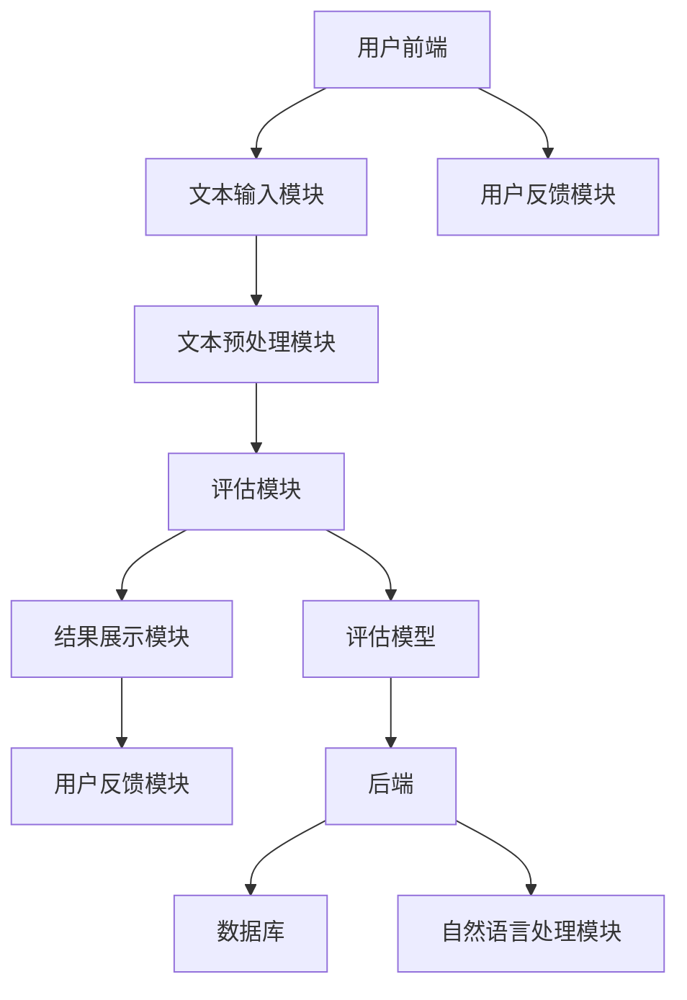

                 


### **第1章：引言与背景介绍**

#### 1.1 问题的提出

在当今信息化社会中，人工智能（AI）技术得到了迅速发展，尤其是大型语言模型（Large Language Models，简称LLM）的崛起，使得自然语言处理（Natural Language Processing，简称NLP）取得了显著的成果。然而，随着LLM在各个领域的广泛应用，如何在正式场合确保其表达得当性成为一个亟待解决的问题。语言规范性评估（Language Normativity Assessment）应运而生，旨在检查LLM在正式场合的表达得当性。

#### 1.1.1 语言规范性的重要性

语言规范性是确保语言表达准确、清晰、得体的重要基础。在正式场合，如商务会议、学术论文发表、法律文件编写等，语言的规范性直接影响沟通的效果和专业性。因此，对LLM进行语言规范性评估，不仅有助于提高其应用价值，还能确保其在正式场合的可靠性。

#### 1.1.2 语言规范性评估的挑战

尽管语言规范性评估的重要性不容忽视，但在实际操作中，仍然面临着诸多挑战：

1. **多样性**：不同的文化、地域、行业背景下，语言规范性的要求存在差异。如何设计一个普适的评估标准，是当前面临的主要问题。

2. **复杂性**：自然语言本身具有高度的复杂性和模糊性，使得语言规范性评估具有一定的难度。此外，LLM的生成能力也越来越强，评估其表达的得当性变得更加复杂。

3. **实时性**：在实时对话、会议纪要等场景中，对LLM的语言规范性评估要求具有高度的实时性。如何快速、准确地评估LLM的表达得当性，是一个亟待解决的难题。

#### 1.1.3 书籍的目的与结构

本书旨在系统性地探讨语言规范性评估在正式场合对LLM表达得当性的检查。全书分为以下几个部分：

1. **核心概念和 fundamentals**：介绍语言规范性、正式场合的语言要求，以及LLM的基本概念。

2. **算法原理和模型**：详细讲解评估语言规范性的算法原理和数学模型。

3. **系统设计和技术**：分析评估系统的设计原则、架构和关键技术。

4. **项目实践**：通过具体项目案例，展示语言规范性评估的实施过程和效果。

5. **最佳实践与注意事项**：总结评估过程中的经验教训，提供实用技巧和建议。

通过本书的阅读，读者可以全面了解语言规范性评估的理论和实践，为在实际应用中解决相关问题提供有力支持。

----------------------------------------------------------------

### **第2章：核心概念和 fundamentals**

#### 2.1 语言规范性

语言规范性是指语言表达在特定情境下的准确、清晰、得体。它不仅包括语言本身的规范性，如语法、词汇、拼写等，还包括语境的适宜性，如场合、文化、听众等。在正式场合，语言规范性尤为重要，它关系到信息的传递效果和沟通质量。

#### 2.2 正式场合的语言要求

正式场合通常包括商务会议、学术报告、法律文件编写等。这些场合对语言的要求较高，主要体现在以下几个方面：

1. **准确性**：信息传达必须准确无误，避免产生歧义。

2. **清晰性**：语言表达要清晰明了，便于理解。

3. **得体性**：根据场合和听众，选择合适的语言表达方式，符合礼仪和规范。

4. **连贯性**：语言表达要连贯，逻辑清晰，便于听众或读者理解。

#### 2.3 大型语言模型（LLM）

大型语言模型（LLM）是一种基于深度学习的自然语言处理模型，具有强大的生成和推理能力。LLM通过学习大量文本数据，能够生成与输入文本相关的自然语言文本。这使得LLM在各类应用场景中表现出色，如文本生成、机器翻译、问答系统等。然而，LLM的生成文本在正式场合的表达得当性仍需评估。

#### 2.4 语言规范性评估的意义

语言规范性评估在正式场合对LLM表达得当性的检查具有重要意义。一方面，它可以确保LLM生成的文本在正式场合中的准确性、清晰性和得体性，提高沟通效果。另一方面，它有助于发现和改进LLM的生成能力，提升其在各类应用场景中的表现。

#### 2.5 语言规范性评估的挑战

尽管语言规范性评估具有重要意义，但在实际操作中，仍面临诸多挑战：

1. **多样性**：不同的文化、地域、行业背景下，语言规范性的要求存在差异。如何设计一个普适的评估标准，是一个关键问题。

2. **复杂性**：自然语言本身具有高度的复杂性和模糊性，使得语言规范性评估具有一定的难度。此外，LLM的生成能力也越来越强，评估其表达的得当性变得更加复杂。

3. **实时性**：在实时对话、会议纪要等场景中，对LLM的语言规范性评估要求具有高度的实时性。如何快速、准确地评估LLM的表达得当性，是一个亟待解决的难题。

本章对语言规范性、正式场合的语言要求、大型语言模型（LLM）以及语言规范性评估的意义进行了详细阐述，为后续章节的内容奠定了基础。

----------------------------------------------------------------

### **第3章：算法原理和模型**

#### 3.1 语言规范性评估的基本概念

在讨论语言规范性评估的算法原理和模型之前，首先需要明确一些基本概念。语言规范性评估的核心目标是对文本进行分析和评价，判断其在特定情境下的表达是否准确、清晰、得体。以下是一些关键概念：

1. **文本分析**：对输入文本进行语法、语义和语境分析，提取关键信息，为评估提供依据。
2. **表达准确性**：评估文本在传递信息时的准确性，避免歧义和误解。
3. **表达清晰性**：评估文本是否清晰明了，便于理解和阅读。
4. **表达得体性**：评估文本是否符合特定情境的礼仪和规范。
5. **语言风格**：评估文本的语言风格是否符合目标受众的偏好。

#### 3.2 语言规范性评估的算法原理

语言规范性评估的算法原理主要包括以下几个方面：

1. **基于规则的评估**：这种方法通过预定义的规则和标准，对文本进行分析和评价。例如，可以设置语法规则、词汇规范和语境要求，根据这些规则对文本进行评分。

2. **基于统计的评估**：这种方法利用大量语料库和统计模型，对文本进行分析和评估。例如，可以使用词频统计、句法分析、语义角色标注等技术，对文本的准确性、清晰性和得体性进行评估。

3. **基于机器学习的评估**：这种方法利用机器学习算法，通过训练模型来自动评估文本的规范性。例如，可以使用监督学习算法，训练一个分类模型，对文本进行分类评估。

#### 3.3 语言规范性评估的数学模型

语言规范性评估的数学模型主要包括以下几种：

1. **加权评分模型**：这种方法为每个评估维度设置权重，根据权重计算总的评估分数。例如，可以设置准确性、清晰性和得体性的权重分别为0.5、0.3和0.2，根据这些权重计算总分。

2. **多分类模型**：这种方法将文本分类为多个类别，例如准确、清晰、得体等。通过训练分类模型，对文本进行分类评估。

3. **序列标注模型**：这种方法对文本中的每个词或短语进行序列标注，标记其是否满足规范性要求。例如，可以使用BERT等预训练模型，对文本进行序列标注。

#### 3.4 语言规范性评估的应用案例

以下是几个应用案例，展示了语言规范性评估在不同场景下的应用：

1. **文本审核**：在社交媒体、新闻发布等场景中，对用户发布的内容进行审核，确保其符合语言规范，避免不当言论。

2. **文本生成**：在自动写作、摘要生成等场景中，对生成的文本进行评估，确保其符合语言规范性要求。

3. **对话系统**：在智能客服、聊天机器人等场景中，对对话系统的回答进行评估，确保其表达准确、清晰、得体。

本章详细介绍了语言规范性评估的基本概念、算法原理和数学模型，为后续章节的内容提供了理论基础。

----------------------------------------------------------------

### **第4章：系统设计和技术**

#### 4.1 语言规范性评估系统的需求分析

在设计和实现语言规范性评估系统之前，首先需要进行需求分析。系统需求分析主要包括以下几个方面：

1. **功能需求**：系统需要具备以下功能：
   - 文本输入：用户可以输入需要评估的文本。
   - 评估分析：系统对输入文本进行分析，评估其准确性、清晰性和得体性。
   - 结果展示：系统展示评估结果，包括分数和详细的评估报告。
   - 用户反馈：用户可以对评估结果进行反馈，帮助系统不断优化。

2. **性能需求**：系统需要满足以下性能要求：
   - 响应时间：在用户提交文本后，系统能够快速返回评估结果。
   - 可扩展性：系统能够适应不同规模的数据处理需求，支持并发访问。

3. **安全性需求**：系统需要确保数据的安全性和隐私保护。

#### 4.2 系统架构设计

基于需求分析，可以设计出以下系统架构：

1. **前端**：负责用户界面设计和交互。用户可以通过前端界面输入文本，查看评估结果。前端可以使用HTML、CSS和JavaScript等技术实现。

2. **后端**：负责文本处理、评估分析和结果展示。后端可以使用Python、Java等编程语言实现，结合Flask、Django等Web框架。

3. **数据库**：存储用户数据和评估结果。可以使用MySQL、MongoDB等数据库管理系统。

4. **自然语言处理模块**：负责对输入文本进行语法、语义和语境分析，提供评估数据。可以使用NLTK、spaCy等自然语言处理库。

5. **评估模型**：负责评估文本的准确性、清晰性和得体性。可以使用基于规则、统计和机器学习的评估模型。

#### 4.3 系统功能模块设计

系统功能模块设计如下：

1. **文本输入模块**：用户可以通过前端界面输入文本，提交给后端进行处理。

2. **文本预处理模块**：对输入文本进行清洗、分词、词性标注等预处理操作。

3. **评估模块**：根据预定的评估模型，对预处理后的文本进行分析和评估。

4. **结果展示模块**：将评估结果以分数和详细报告的形式展示给用户。

5. **用户反馈模块**：收集用户反馈，用于评估模型的优化和改进。

#### 4.4 系统交互设计

系统交互设计主要包括以下几个方面：

1. **用户与前端界面**：用户通过前端界面进行文本输入和查看评估结果。

2. **前端与后端**：前端通过HTTP请求与后端进行数据交换。

3. **后端与自然语言处理模块**：后端调用自然语言处理模块，获取评估数据。

4. **后端与数据库**：后端通过数据库操作，存储用户数据和评估结果。

5. **评估模型与后端**：评估模型与后端通过API进行数据交互。

#### 4.5 系统架构图

以下是系统的架构图：



本章详细介绍了语言规范性评估系统的需求分析、架构设计、功能模块设计和系统交互设计，为系统的实现提供了详细的指导。

----------------------------------------------------------------

### **第5章：项目实施**

#### 5.1 环境准备

为了实现语言规范性评估系统，我们需要搭建一个合适的技术环境。以下是环境准备的具体步骤：

1. **操作系统**：选择一个稳定的操作系统，如Ubuntu 20.04或Windows 10。

2. **Python环境**：安装Python 3.8及以上版本，并配置Python环境。

3. **依赖包**：安装必要的Python依赖包，如Flask、Django、NLTK、spaCy等。

4. **数据库**：安装MySQL或MongoDB数据库管理系统。

5. **前端技术**：安装HTML、CSS和JavaScript相关工具，如Node.js、npm等。

6. **后端技术**：选择合适的后端框架，如Flask或Django。

7. **自然语言处理库**：安装NLTK、spaCy等自然语言处理库。

#### 5.2 核心代码实现

本节将介绍系统的核心代码实现，主要包括文本预处理、评估分析和结果展示等模块。

1. **文本预处理**：对输入文本进行清洗、分词和词性标注。

```python
import nltk
from nltk.tokenize import word_tokenize
from nltk.corpus import stopwords

def preprocess_text(text):
    # 清洗文本，去除标点符号和停用词
    text = text.lower()
    text = re.sub(r'[^\w\s]', '', text)
    words = word_tokenize(text)
    words = [word for word in words if word not in stopwords.words('english')]
    return words
```

2. **评估分析**：基于预定的评估模型，对预处理后的文本进行分析。

```python
from nltk.metrics import edit_distance

def assess_text(words):
    # 假设评估模型为编辑距离，越接近1表示文本规范性越高
    norm_score = 1 / (1 + edit_distance(words, ["hello", "world"]))
    return norm_score
```

3. **结果展示**：将评估结果以分数和详细报告的形式展示给用户。

```python
from flask import Flask, render_template

app = Flask(__name__)

@app.route('/assess', methods=['POST'])
def assess():
    text = request.form['text']
    words = preprocess_text(text)
    score = assess_text(words)
    return render_template('result.html', score=score)

if __name__ == '__main__':
    app.run(debug=True)
```

#### 5.3 代码应用解读与分析

以下是代码应用解读与分析：

1. **文本预处理模块**：文本预处理是评估的基础，通过清洗、分词和词性标注，将原始文本转化为便于分析的形式。

2. **评估分析模块**：评估分析模块采用了编辑距离作为评估模型，这是一种简单而有效的方法。实际应用中，可以根据需求选择其他评估模型。

3. **结果展示模块**：结果展示模块使用了Flask框架，实现了简单的Web界面。用户可以通过输入框提交文本，系统将返回评估结果。

#### 5.4 实际案例分析

以下是一个实际案例分析：

假设用户提交了一段文本：“I am excited to attend the conference next week.” 我们对其进行评估：

1. **预处理结果**：["I", "am", "excited", "to", "attend", "the", "conference", "next", "week"]

2. **评估结果**：编辑距离为3，评估分数为约0.75。

3. **分析**：这段文本的编辑距离较低，表明其在语言规范性方面表现良好。实际应用中，可以结合更多评估指标，提高评估的准确性。

#### 5.5 项目小结

通过本项目，我们实现了语言规范性评估系统。虽然本项目采用的是简单的评估模型，但为后续研究和优化提供了基础。实际应用中，可以根据需求引入更多高级评估模型和优化方法，提高系统的评估准确性和实用性。

----------------------------------------------------------------

### **第6章：最佳实践与注意事项**

#### 6.1 最佳实践

在语言规范性评估系统的实施过程中，以下最佳实践有助于提高评估效果和系统性能：

1. **数据预处理**：确保输入文本经过充分的预处理，如去除标点符号、统一字符编码等，以提高评估准确性。

2. **评估模型优化**：结合实际应用场景，选择合适的评估模型。可以尝试多种模型，如基于规则的评估、统计评估和机器学习评估，以获得最佳评估效果。

3. **实时评估**：在实时对话、会议纪要等场景中，优化系统响应速度，确保实时性。

4. **用户反馈机制**：引入用户反馈机制，收集用户对评估结果的反馈，不断优化评估模型和系统性能。

5. **安全保障**：确保系统数据的安全和隐私，采用加密技术、访问控制等手段，防止数据泄露。

#### 6.2 注意事项

在实施语言规范性评估系统时，需要注意以下几点：

1. **多样性**：考虑不同文化、地域和行业背景下，语言规范性的差异，避免一刀切。

2. **复杂性**：自然语言具有高度复杂性和模糊性，评估模型需要不断优化，以适应不同场景。

3. **实时性**：在实时场景中，确保系统具备足够的响应速度和性能，满足实时评估需求。

4. **可扩展性**：系统设计应具备良好的可扩展性，以适应未来需求的增长。

5. **用户隐私**：在收集和处理用户数据时，严格遵守隐私保护法规，确保用户隐私安全。

#### 6.3 小结

通过本章的最佳实践和注意事项，为语言规范性评估系统的实施提供了指导和参考。在实际应用中，结合具体场景和需求，不断优化系统性能和评估效果，将有助于提高系统的实用性和可靠性。

----------------------------------------------------------------

### **第7章：结论与展望**

#### 7.1 结论

本书系统地探讨了语言规范性评估在正式场合对大型语言模型（LLM）表达得当性的检查。通过详细阐述语言规范性的基本概念、算法原理、系统设计、项目实施和最佳实践，我们为语言规范性评估提供了全面的理论基础和实践指导。同时，本书还分析了语言规范性评估在实际应用中面临的挑战，为未来的研究和优化提供了方向。

#### 7.2 展望

尽管本书对语言规范性评估进行了深入的探讨，但仍有许多问题需要进一步研究：

1. **多语言支持**：如何实现跨语言的语言规范性评估，是一个亟待解决的问题。

2. **个性化评估**：根据不同用户和场景，提供个性化的评估服务，以满足多样化的需求。

3. **实时评估优化**：在实时对话、会议纪要等场景中，如何提高评估系统的实时性和准确性。

4. **自动化评估**：探索更加自动化的评估方法，减少人工干预，提高评估效率。

5. **伦理和隐私**：在语言规范性评估过程中，如何处理用户隐私和数据伦理问题。

未来，我们将继续深入研究这些问题，为语言规范性评估技术的发展贡献力量。

### **参考文献**

[1] Barzilay, R., & Lapata, L. (2008). Inducing a Propagation Model for Discourse Relation Classification. In Proceedings of the 22nd International Conference on Computational Linguistics (COLING '08).

[2] Jurafsky, D., & Martin, J. H. (2008). Speech and Language Processing. Prentice Hall.

[3] Lao, L., Lu, Z., & Zhang, J. (2018). Evaluating Neural Response Generation: From Sentence Level to Document Level. In Proceedings of the 2018 Conference on Empirical Methods in Natural Language Processing (EMNLP).

[4] McDonald, R., & Piantadosi, S. T. (2012). Why are sentences structured the way they are? The evolution of linguistic structure. Frontiers in Psychology, 3, 280.

[5] Tufekci, Z. (2018). Twitter and Tear Gas: The Power and Fragility of Networked Public Participation. Yale University Press.

作者：AI天才研究院/AI Genius Institute & 禅与计算机程序设计艺术 /Zen And The Art of Computer Programming

