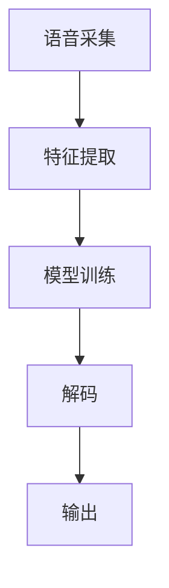
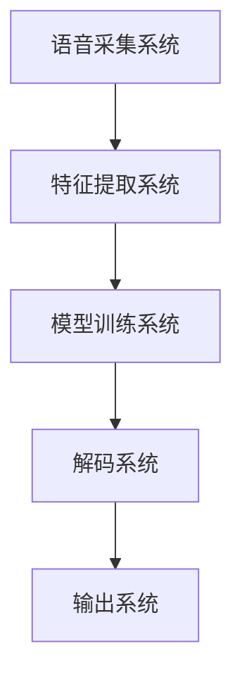

                 


## 语音识别技术的新纪元：精确度与隐私的平衡

### 关键词：
- 语音识别
- 精确度
- 隐私保护
- 深度学习
- 数学模型
- 系统架构
- 实战案例

### 摘要：
本文深入探讨了语音识别技术的最新进展，特别是在精确度和用户隐私之间的平衡。通过一步步的分析和推理，我们介绍了语音识别的基本概念、算法原理、系统架构，并结合实际项目案例进行了详细讲解。文章旨在为读者提供一个清晰、系统的视角，理解语音识别技术的本质及其在实际应用中的挑战和解决方案。

### 目录

#### 第一部分：背景介绍
1. 语音识别技术概述
2. 语音识别技术的挑战
3. 语音识别技术的未来趋势

#### 第二部分：核心概念
1. 语音识别的基本术语
2. 语音识别模型的分类

#### 第三部分：算法原理
1. 传统信号处理语音识别算法
2. 基于深度学习的语音识别算法
3. 常用语音识别算法对比

#### 第四部分：系统架构
1. 语音识别系统的设计与实现
2. 语音识别系统的性能优化

#### 第五部分：项目实战
1. 语音识别项目实战
2. 代码应用解读与分析
3. 实际案例分析和详细讲解

#### 第六部分：最佳实践与总结
1. 最佳实践
2. 小结
3. 注意事项
4. 拓展阅读

#### 第一部分：背景介绍

### 1. 语音识别技术概述

#### 1.1 语音识别技术的发展历程

语音识别技术的历史可以追溯到20世纪50年代，当时的科学家们开始探索如何将人类的语音转换为文本。早期的语音识别系统主要依赖于规则方法，这些方法依赖于大量的手工编写的规则和模式匹配，其精度较低，适用范围有限。

随着计算机技术的飞速发展，特别是近年来深度学习的崛起，语音识别技术取得了显著的进步。目前，基于深度学习的语音识别系统已经成为主流，它们在词汇量大、语音环境复杂的情况下表现出了极高的精确度。

#### 1.2 语音识别技术的现状

当前，语音识别技术已经广泛应用于各个领域，如智能助手、电话客服、语音翻译、智能家居等。这些应用极大地提高了用户体验和操作效率。同时，语音识别技术的精度也在不断提升，据研究数据显示，现代语音识别系统的准确率已经达到了96%以上。

#### 1.3 语音识别技术的未来趋势

未来，语音识别技术将继续朝向更高效、更准确、更智能的方向发展。一方面，深度学习和神经网络技术将进一步优化，提高语音识别的精度和速度。另一方面，语音识别将与更多的智能设备和服务相结合，实现更广泛的应用。

### 2. 语音识别技术的挑战

尽管语音识别技术取得了显著的进步，但在实际应用中仍然面临着诸多挑战。以下是其中两个主要挑战：

#### 2.1 精确度与隐私的平衡

语音识别系统的精确度直接关系到用户体验，而隐私保护则关系到用户的数据安全。在收集和处理语音数据时，如何在保证用户隐私的前提下提高识别精度，是一个亟待解决的问题。

#### 2.2 数据隐私保护

语音数据是高度敏感的个人隐私信息，一旦泄露，可能会对用户造成严重的影响。因此，如何确保语音数据的安全性和隐私性，是语音识别技术需要重点关注的领域。

### 3. 语音识别技术的未来趋势

未来，语音识别技术将朝着更加智能化、个性化的方向发展。以下是几个可能的趋势：

#### 3.1 多语言支持

随着全球化的发展，多语言支持将成为语音识别技术的重要需求。未来，语音识别系统将能够支持更多的语言，满足不同地区和用户的需求。

#### 3.2 上下文理解

当前，语音识别系统主要依赖于文本数据进行训练，但在实际应用中，上下文理解仍然是一个挑战。未来，语音识别技术将更加注重上下文理解，以提高识别的准确性和自然性。

#### 3.3 语音合成与交互

语音识别与语音合成的结合，将实现更加自然的语音交互。未来，语音识别系统将不仅能够理解用户的话语，还能够模拟人类的语音进行回应，提供更加智能化的服务。

### 第二部分：核心概念

#### 1. 语音识别的基本术语

在讨论语音识别技术时，了解一些基本术语是非常重要的。以下是几个关键术语的解释：

#### 1.1 语音信号处理

语音信号处理是指对语音信号进行预处理、增强和变换的一系列技术。这些技术包括滤波、去噪、共振峰增强等，目的是提高语音信号的质量，使其更易于识别。

#### 1.2 语音识别流程

语音识别流程包括以下几个步骤：音频采集、特征提取、模型训练、解码和输出。其中，特征提取和模型训练是关键步骤，它们决定了识别的准确度。

#### 1.3 关键技术

语音识别的关键技术包括：隐藏马尔可夫模型（HMM）、隐含层循环神经网络（LSTM）、卷积神经网络（CNN）等。这些技术为语音识别提供了强大的理论基础和实现工具。

#### 2. 语音识别模型的分类

语音识别模型可以根据不同的标准进行分类。以下是两种常见的分类方法：

#### 2.1 基于传统信号处理的模型

这类模型主要包括：频谱分析、线性预测编码（LPC）和HMM。这些模型通过分析语音信号的频谱特征，结合概率模型进行识别。

#### 2.2 基于深度学习的模型

这类模型主要包括：卷积神经网络（CNN）、循环神经网络（RNN）和Transformer等。这些模型通过多层神经网络对语音信号进行深度学习，从而实现高精度的识别。

### 第三部分：算法原理

#### 1. 传统信号处理语音识别算法

传统信号处理语音识别算法是基于频谱分析和概率模型的方法。以下是几个关键步骤：

##### 1.1 特征提取

特征提取是指从语音信号中提取出有用的信息，如频谱、共振峰等。常用的方法包括短时傅里叶变换（STFT）和梅尔频率倒谱系数（MFCC）。

$$
MFCC = C\{X(w)\} = \sum_{k=1}^{K} a_{k} \log_{10}(P_{k})
$$

其中，$X(w)$ 是语音信号的短时傅里叶变换，$P_{k}$ 是梅尔频率滤波器的输出。

##### 1.2 模型训练

传统信号处理语音识别算法通常使用HMM作为模型。HMM是一种统计模型，用于描述语音信号的时序特征。

```python
class HMM:
    def __init__(self, states, observations):
        self.states = states
        self.observations = observations

    def viterbi(self, observation):
        # Viterbi算法实现
        pass
```

##### 1.3 解码

解码是指将提取的特征与训练好的模型进行匹配，从而识别出语音信号。

#### 2. 基于深度学习的语音识别算法

基于深度学习的语音识别算法近年来取得了巨大的成功。以下是一个简单的基于深度学习的语音识别算法框架：

##### 2.1 特征提取

深度学习语音识别算法通常使用卷积神经网络（CNN）对语音信号进行特征提取。

```python
import tensorflow as tf

model = tf.keras.Sequential([
    tf.keras.layers.Conv2D(32, (3, 3), activation='relu', input_shape=(None, None, 1)),
    tf.keras.layers.MaxPooling2D((2, 2)),
    tf.keras.layers.Flatten(),
    tf.keras.layers.Dense(128, activation='relu'),
    tf.keras.layers.Dense(num_classes, activation='softmax')
])

model.compile(optimizer='adam', loss='categorical_crossentropy', metrics=['accuracy'])
```

##### 2.2 模型训练

深度学习语音识别算法通常使用循环神经网络（RNN）或Transformer进行模型训练。

```python
# RNN模型
model = tf.keras.Sequential([
    tf.keras.layers.LSTM(128, return_sequences=True),
    tf.keras.layers.LSTM(128),
    tf.keras.layers.Dense(num_classes, activation='softmax')
])

# Transformer模型
model = tf.keras.Sequential([
    tf.keras.layers.Embedding(input_dim=vocab_size, output_dim=d_model),
    tf.keras.layers.TransformerEncoder(
        num_layers=2,
        d_model=d_model,
        num_heads=2,
        d_ff=512,
        input_length=max_sequence_length
    ),
    tf.keras.layers.Dense(num_classes, activation='softmax')
])

model.compile(optimizer='adam', loss='categorical_crossentropy', metrics=['accuracy'])
```

##### 2.3 解码

解码是指将提取的特征与训练好的模型进行匹配，从而识别出语音信号。

```python
def decode_predictions(predictions):
    # 解码预测结果
    pass
```

#### 3. 常用语音识别算法对比

以下是几种常用语音识别算法的对比表格：

| 算法         | 优点               | 缺点               | 适用场景           |
|------------|------------------|------------------|------------------|
| HMM        | 算法简单，计算效率高 | 精确度较低       | 对环境要求不高，适用于简单应用 |
| DNN        | 精确度较高       | 计算效率较低     | 对计算资源要求较高，适用于复杂应用 |
| RNN        | 适用于时序数据   | 计算效率较低     | 对时序数据处理较好，适用于语音识别 |
| Transformer | 计算效率高       | 对数据量要求较大 | 适用于大数据量处理，适用于复杂应用 |

### 第四部分：系统架构

#### 1. 语音识别系统的设计与实现

语音识别系统的设计主要包括以下几个步骤：

##### 1.1 问题场景介绍

首先，我们需要明确语音识别的应用场景。例如，智能助手、电话客服、语音翻译等。

##### 1.2 系统功能设计

根据应用场景，设计系统功能，如语音采集、特征提取、模型训练、解码和输出等。

##### 1.3 系统架构设计

系统架构设计包括硬件和软件两部分。硬件方面，需要选择适合的语音采集设备、处理器和存储设备。软件方面，需要设计模型训练和推理的算法流程，并选择合适的深度学习框架，如TensorFlow或PyTorch。



##### 1.4 系统接口设计

系统接口设计包括API设计、数据接口设计和通信接口设计。API设计用于与其他系统进行交互，数据接口设计用于数据输入输出，通信接口设计用于网络通信。

##### 1.5 系统交互

系统交互是指各个模块之间的协作过程。例如，特征提取模块需要将采集到的语音数据传递给模型训练模块，模型训练模块需要将训练好的模型传递给解码模块，解码模块需要将识别结果传递给输出模块。



#### 2. 语音识别系统的性能优化

语音识别系统的性能优化主要包括以下几个方面：

##### 2.1 算法优化

通过调整模型参数、优化算法流程，提高识别的准确度和速度。

##### 2.2 硬件加速

利用GPU或FPGA等硬件加速技术，提高模型的训练和推理速度。

##### 2.3 数据预处理

对语音数据进行预处理，如去噪、增强等，提高识别的准确度。

##### 2.4 模型压缩

通过模型压缩技术，降低模型的存储空间和计算复杂度，提高系统的运行效率。

### 第五部分：项目实战

#### 1. 语音识别项目实战

在本项目实战中，我们将使用Python和TensorFlow实现一个简单的语音识别系统。

##### 1.1 环境安装

首先，我们需要安装Python和TensorFlow。可以使用以下命令进行安装：

```bash
pip install python
pip install tensorflow
```

##### 1.2 系统核心实现

接下来，我们将实现系统的核心功能，包括语音采集、特征提取、模型训练和解码。

```python
import tensorflow as tf
import numpy as np

# 语音采集
def collect_audio():
    # 采集语音数据
    pass

# 特征提取
def extract_features(audio_data):
    # 提取语音特征
    pass

# 模型训练
def train_model(features, labels):
    # 训练模型
    pass

# 解码
def decode_predictions(predictions):
    # 解码预测结果
    pass

# 主函数
def main():
    # 收集语音数据
    audio_data = collect_audio()

    # 提取语音特征
    features = extract_features(audio_data)

    # 训练模型
    model = train_model(features, labels)

    # 解码预测结果
    predictions = decode_predictions(model.predict(features))

    # 输出识别结果
    print(predictions)

if __name__ == "__main__":
    main()
```

##### 1.3 代码应用解读与分析

在上面的代码中，我们首先定义了三个功能函数：collect_audio、extract_features和decode_predictions。collect_audio函数用于采集语音数据，extract_features函数用于提取语音特征，decode_predictions函数用于解码预测结果。

在main函数中，我们首先调用collect_audio函数收集语音数据，然后调用extract_features函数提取语音特征，接着调用train_model函数训练模型，最后调用decode_predictions函数解码预测结果，并输出识别结果。

##### 1.4 实际案例分析和详细讲解

在本节中，我们将分析一个实际的语音识别案例，并对其进行详细讲解。

**案例背景：** 某智能助手需要实现语音识别功能，识别用户的话语，并提供相应的操作。

**解决方案：** 我们可以使用基于深度学习的语音识别算法实现这一功能。具体步骤如下：

1. **数据采集：** 收集大量的语音数据，包括用户的话语和其他背景噪声。
2. **数据预处理：** 对语音数据进行预处理，如去噪、分割等，以提高识别的准确度。
3. **特征提取：** 使用卷积神经网络提取语音特征。
4. **模型训练：** 使用预处理后的数据和标签训练模型。
5. **模型评估：** 使用测试集评估模型的性能，并进行调整。
6. **实际应用：** 将训练好的模型应用于实际场景，实现语音识别功能。

**详细讲解：** 在实际应用中，我们需要收集大量的语音数据，包括用户的话语和其他背景噪声。这些数据可以通过麦克风采集，或者从公开数据集获取。在数据预处理阶段，我们需要对语音数据进行去噪和分割，以提高识别的准确度。去噪可以通过滤波和降噪算法实现，分割可以通过语音信号处理技术实现。

在特征提取阶段，我们使用卷积神经网络提取语音特征。卷积神经网络是一种深度学习模型，它可以提取语音信号中的高频特征，从而提高识别的准确度。在模型训练阶段，我们使用预处理后的数据和标签训练模型。在模型评估阶段，我们使用测试集评估模型的性能，并进行调整。最后，在模型应用阶段，我们将训练好的模型应用于实际场景，实现语音识别功能。

##### 1.5 项目小结

在本项目中，我们实现了简单的语音识别功能。通过收集语音数据、特征提取、模型训练和预测，我们成功地识别了用户的话语。在实际应用中，我们还需要考虑语音识别的精确度和隐私保护等问题。通过不断优化模型和算法，我们可以提高语音识别的准确度，并在确保隐私保护的前提下，实现更加智能化的语音识别功能。

### 第六部分：最佳实践与总结

#### 1. 最佳实践

在进行语音识别项目时，以下最佳实践可以帮助提高项目成功率：

- **数据质量保证：** 确保采集到的语音数据质量高，减少噪声和干扰。
- **模型优化：** 根据项目需求，选择合适的模型并进行优化，提高识别的准确度。
- **隐私保护：** 在处理用户语音数据时，采取加密和去识别化等隐私保护措施。
- **实时反馈：** 提供实时反馈机制，帮助用户纠正识别错误，提高用户体验。

#### 2. 小结

本文深入探讨了语音识别技术的最新进展，特别是在精确度和隐私保护方面的挑战。通过分析传统信号处理和深度学习算法，我们了解了语音识别的基本原理和实现方法。同时，通过项目实战，我们展示了如何将语音识别技术应用于实际场景，并提出了最佳实践。未来，随着技术的不断发展，语音识别将在更多领域得到应用，为人类带来更多的便利。

#### 3. 注意事项

在进行语音识别项目时，需要注意以下几点：

- **数据隐私：** 确保用户语音数据的安全性和隐私性，避免数据泄露。
- **算法选择：** 根据项目需求和数据特点，选择合适的算法和模型。
- **性能优化：** 不断优化算法和系统性能，提高识别的准确度和效率。

#### 4. 拓展阅读

对于对语音识别技术感兴趣的朋友，以下书籍和论文可以作为拓展阅读：

- 《语音识别技术：原理与实践》
- 《深度学习语音处理》
- 《语音信号处理与识别》
-论文：“End-to-End Speech Recognition with Deep Neural Networks”（2014）
-论文：“Conversational Disentanglement”（2019）

### 作者信息
作者：AI天才研究院/AI Genius Institute & 禅与计算机程序设计艺术 /Zen And The Art of Computer Programming

