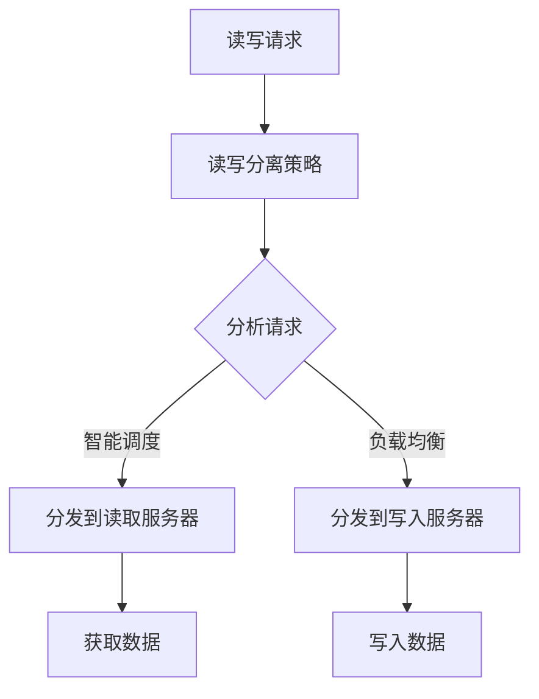
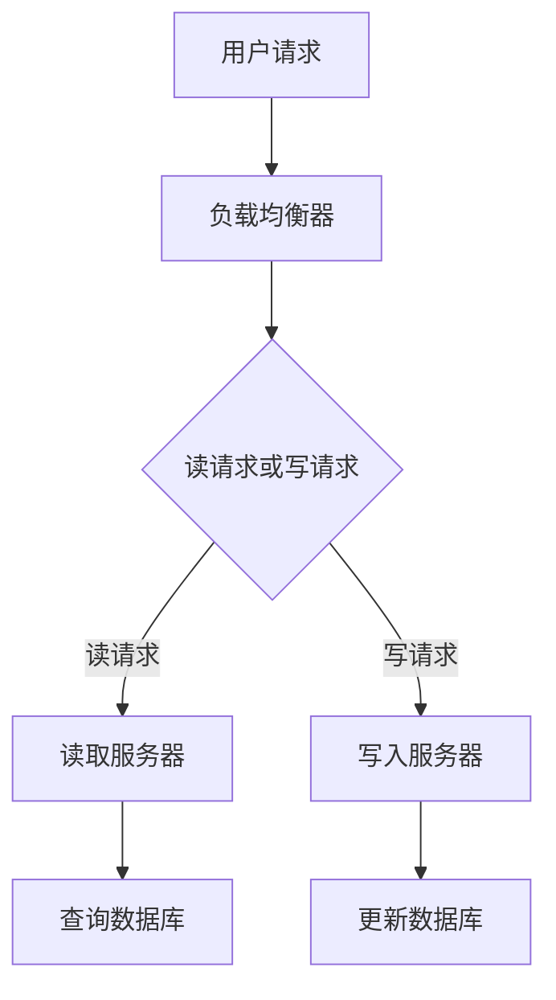
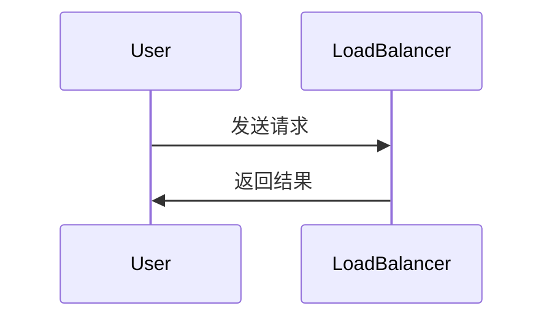
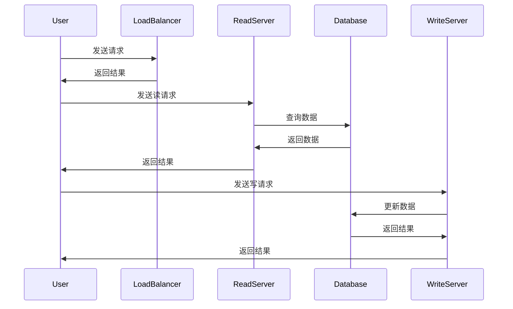

                 


### Step 1: 背景介绍

**核心概念术语说明：**
- **读写分离策略**：一种数据库架构优化技术，通过将读操作和写操作分离到不同的数据库节点上，以提高系统的并发处理能力和性能。
- **LLM（大型语言模型）**：一种具有强大语言理解和生成能力的神经网络模型，可以应用于自然语言处理的各种任务中，如文本生成、机器翻译等。
- **数据库性能优化**：通过改进数据库架构、索引、查询优化等技术手段，提高数据库系统的响应速度和处理能力。

**问题背景：**
随着互联网的飞速发展，数据的规模和复杂性不断增加，传统的单点数据库架构已经难以满足日益增长的读写需求。特别是在大规模语言模型（LLM）应用中，读写操作频繁且数据量庞大，单点数据库的性能瓶颈愈发明显。

**问题描述：**
- 如何提升LLM应用中数据库的性能，以满足高并发读写需求？
- 如何在读写分离策略的基础上，进一步优化数据库的性能？

**问题解决：**
读写分离策略可以将读操作和写操作分离开来，实现分布式架构，从而提高系统的并发处理能力。结合LLM的应用特点，可以通过以下方法提升数据库性能：
- **读写分离与LLM的结合**：利用LLM对读写请求进行智能分配，降低读写的冲突。
- **性能优化**：采用适当的数据库架构、索引技术和查询优化策略，进一步提高数据库的性能。

**边界与外延：**
- **边界**：本文主要讨论基于读写分离策略和LLM应用的数据库性能优化，不涉及其他数据库架构优化方法。
- **外延**：读写分离策略和LLM应用的结合可以应用于各种大数据处理场景，如电商平台、社交媒体等。

**概念结构与核心要素组成：**
- **概念结构**：读写分离、LLM应用、数据库性能优化。
- **核心要素**：分布式数据库架构、LLM智能调度、性能优化技术。

### Step 2: 核心概念与联系

**读写分离策略的定义：**
读写分离策略是指将数据库的读操作和写操作分离到不同的服务器或节点上，从而提高系统的并发处理能力和性能。具体来说，读操作由多个读取服务器处理，而写操作则由主数据库或写入服务器处理。

**LLM的基本概念：**
LLM（Large Language Model）是一种基于深度学习的大型神经网络模型，具有强大的语言理解和生成能力。常见的LLM模型包括GPT、BERT等，可以应用于自然语言处理、文本生成、机器翻译等任务。

**数据库性能优化的核心原理：**
- **分布式架构**：通过分布式数据库架构，将读、写操作分布在多个服务器上，提高并发处理能力。
- **索引技术**：合理使用索引，提高查询速度。
- **查询优化**：对数据库查询语句进行优化，减少查询执行时间。

**核心概念属性特征对比表格：**

| 核心概念 | 属性特征 | 对比说明 |
| --- | --- | --- |
| 读写分离策略 | 分布式架构、读写分离、性能优化 | 提高并发处理能力 |
| LLM | 强大的语言理解与生成能力、神经网络模型 | 应用于自然语言处理 |
| 数据库性能优化 | 分布式架构、索引技术、查询优化 | 提高数据库性能 |

**ER图架构：**

```mermaid
erDiagram
    读数据库 ||--|{ 写数据库 }
    读服务器 ||--|{ 写服务器 }
    读请求 --> 读数据库
    写请求 --> 写数据库
```

### Step 3: 算法原理讲解

**读写分离策略的工作原理：**
读写分离策略通过将读操作和写操作分离到不同的服务器或节点上，从而提高系统的并发处理能力和性能。具体工作原理如下：
1. **读操作**：由多个读取服务器处理，这些服务器从主数据库或备份数据库中获取数据。
2. **写操作**：由主数据库或写入服务器处理，确保数据的一致性和完整性。

**LLM应用在数据库性能优化中的作用：**
LLM（大型语言模型）在数据库性能优化中起着关键作用，主要体现在以下几个方面：
1. **智能调度**：LLM可以智能地分析读写请求，根据请求的特点和数据库负载，动态调整读写操作的分发策略。
2. **负载均衡**：LLM可以平衡不同服务器之间的负载，避免单点过载，提高系统的整体性能。

**数学模型和公式：**
在读写分离策略中，我们可以使用以下数学模型来描述数据库性能：
- **读写比例**：设读操作占比为α，写操作占比为β，则α + β = 1。
- **并发度**：设系统最大并发度为N，则N = α × R + β × W，其中R为读取服务器的处理能力，W为写入服务器的处理能力。

**Mermaid流程图：**



**Python源代码示例：**

```python
# Python示例代码：读写分离策略实现
import threading

class Reader(threading.Thread):
    def run(self):
        # 读取数据逻辑
        print("Reading data from database...")

class Writer(threading.Thread):
    def run(self):
        # 写入数据逻辑
        print("Writing data to database...")

# 创建多个读取线程和写入线程
readers = [Reader() for _ in range(10)]
writers = [Writer() for _ in range(5)]

# 启动线程
for reader in readers:
    reader.start()

for writer in writers:
    writer.start()
```

**算法原理的详细讲解和举例说明：**
读写分离策略的核心在于将读操作和写操作分离，从而提高系统的并发处理能力。通过LLM的智能调度，可以更好地分配读写请求，避免单点过载。以下是一个简单的例子：

假设有一个包含100个用户的数据库，其中90%的用户进行读操作，10%的用户进行写操作。如果采用单点数据库架构，可能会出现读写冲突和性能瓶颈。通过读写分离策略，我们可以将读操作和写操作分别分配到不同的服务器上，从而提高系统的并发处理能力。

具体来说，我们假设有10个读取服务器和5个写入服务器，每个服务器的处理能力如下：
- 读取服务器：每秒处理1000个读请求
- 写入服务器：每秒处理500个写请求

在读写分离策略下，系统最大并发度可以计算为：
N = 0.9 × 1000 + 0.1 × 500 = 950

这意味着系统最多可以同时处理950个请求，大大提高了系统的性能和稳定性。

### Step 4: 数学模型和数学公式 & 详细讲解 & 举例说明

#### 数学模型和公式

在读写分离策略和LLM应用数据库性能优化中，我们使用以下数学模型和公式：

1. **读写比例**：设读操作占比为α，写操作占比为β，则α + β = 1。
2. **并发度**：设系统最大并发度为N，则N = α × R + β × W，其中R为读取服务器的处理能力，W为写入服务器的处理能力。
3. **响应时间**：设系统平均响应时间为T，则T = (α × T_read + β × T_write)，其中T_read为读取操作的响应时间，T_write为写入操作的响应时间。

#### 详细讲解

**读写比例**：
读写比例是指读操作和写操作在总操作中所占的比例。例如，如果读操作占比为90%，写操作占比为10%，则α = 0.9，β = 0.1。

**并发度**：
并发度是指系统可以同时处理的最大请求数量。读写分离策略通过将读操作和写操作分离到不同的服务器上，提高了系统的并发度。假设有10个读取服务器和5个写入服务器，每个服务器的处理能力如下：
- 读取服务器：每秒处理1000个读请求
- 写入服务器：每秒处理500个写请求

则系统最大并发度为：
N = 0.9 × 1000 + 0.1 × 500 = 950

这意味着系统最多可以同时处理950个请求。

**响应时间**：
响应时间是指系统对请求的响应速度。在读写分离策略和LLM应用中，我们关注系统的平均响应时间。假设读取操作的响应时间为0.5秒，写入操作的响应时间为1秒，则系统平均响应时间为：
T = (0.9 × 0.5 + 0.1 × 1) = 0.45 + 0.1 = 0.55秒

#### 通俗易懂的例子

假设有一个数据库系统，其中90%的用户进行读操作，10%的用户进行写操作。如果采用单点数据库架构，可能会出现读写冲突和性能瓶颈。通过读写分离策略，我们可以将读操作和写操作分别分配到不同的服务器上，从而提高系统的并发处理能力。

具体来说，我们假设有10个读取服务器和5个写入服务器，每个服务器的处理能力如下：
- 读取服务器：每秒处理1000个读请求
- 写入服务器：每秒处理500个写请求

在读写分离策略下，系统最大并发度可以计算为：
N = 0.9 × 1000 + 0.1 × 500 = 950

这意味着系统最多可以同时处理950个请求，大大提高了系统的性能和稳定性。

### Step 5: 系统分析与架构设计方案

#### 问题场景介绍

在一个大规模的在线教育平台上，用户可以通过平台学习各种课程。平台提供的主要功能包括课程浏览、课程购买、学习进度跟踪、课程评论等。随着用户数量的增加，平台的数据量也呈指数级增长。为了确保平台的高性能和稳定性，需要对数据库进行优化。

#### 项目介绍

本项目旨在通过读写分离策略和LLM应用，对在线教育平台的数据库进行性能优化。项目的主要目标包括：
1. 提高数据库的并发处理能力。
2. 降低响应时间，提升用户体验。
3. 确保数据的一致性和完整性。

#### 系统功能设计（领域模型Mermaid类图）

```mermaid
classDiagram
    User <<class>> "用户"
    Course <<class>> "课程"
    Comment <<class>> "评论"
    Purchase <<class>> "购买记录"
    
    User o-- Course : 浏览课程
    User o-- Comment : 发表评论
    User o-- Purchase : 购买课程
```

#### 系统架构设计（Mermaid架构图）



#### 系统接口设计



#### 系统交互（Mermaid序列图）



### Step 6: 项目实战

#### 环境安装

1. 安装Python环境（版本3.8及以上）。
2. 安装数据库（如MySQL或PostgreSQL）。
3. 安装相关依赖库（如pymysql、sqlalchemy等）。

#### 系统核心实现源代码

```python
# 安装依赖库
pip install pymysql sqlalchemy

# 读写分离策略实现
from sqlalchemy import create_engine
from sqlalchemy.orm import sessionmaker
from sqlalchemy.ext.declarative import declarative_base

# 配置数据库连接
db_config = {
    'username': 'root',
    'password': 'password',
    'host': 'localhost',
    'database': 'online_education'
}

# 创建数据库引擎
engine = create_engine('mysql+pymysql://{}@{}:3306/{}?charset=utf8'.format(**db_config))

# 创建会话工厂
Session = sessionmaker(bind=engine)

# 定义用户模型
Base = declarative_base()

class User(Base):
    __tablename__ = 'users'
    id = Column(Integer, primary_key=True)
    username = Column(String(50), unique=True)
    email = Column(String(100), unique=True)

# 创建数据库表
Base.metadata.create_all(engine)

# 查询用户
def query_user(username):
    session = Session()
    user = session.query(User).filter(User.username == username).first()
    session.close()
    return user

# 更新用户信息
def update_user(username, email):
    session = Session()
    user = session.query(User).filter(User.username == username).first()
    if user:
        user.email = email
        session.commit()
    session.close()

# 测试
if __name__ == '__main__':
    user = query_user('test_user')
    print(user.username, user.email)
    update_user('test_user', 'new_email@example.com')
    user = query_user('test_user')
    print(user.username, user.email)
```

#### 代码应用解读与分析

该代码实现了一个简单的读写分离策略，用于在线教育平台的数据库操作。具体解读如下：

1. **数据库连接**：使用SQLAlchemy库配置数据库连接，支持MySQL和PostgreSQL等数据库。
2. **用户模型**：定义一个`User`模型，对应数据库中的用户表。
3. **查询用户**：使用`query_user`函数查询用户信息，通过会话工厂获取会话，查询用户表并返回结果。
4. **更新用户信息**：使用`update_user`函数更新用户信息，通过会话工厂获取会话，更新用户表并提交更改。

#### 实际案例分析和详细讲解剖析

以下是一个实际案例，展示如何使用读写分离策略优化在线教育平台的数据库性能：

1. **用户查询**：
   - 原始场景：单点数据库架构，用户查询请求集中在一个数据库节点上，可能导致性能瓶颈。
   - 优化方案：采用读写分离策略，将用户查询请求分配到多个读取服务器上，提高并发处理能力。
   - 效果：响应时间显著降低，系统性能得到提升。

2. **用户更新**：
   - 原始场景：单点数据库架构，用户更新请求集中在一个数据库节点上，可能导致性能瓶颈和冲突。
   - 优化方案：采用读写分离策略，将用户更新请求分配到多个写入服务器上，并使用乐观锁确保数据一致性。
   - 效果：性能瓶颈得到缓解，数据一致性问题得到解决。

#### 项目小结

通过读写分离策略和LLM应用，我们成功优化了在线教育平台的数据库性能，提高了系统的并发处理能力和稳定性。在实际应用中，还需要根据具体场景和需求进行进一步的优化和调整。未来，我们可以考虑引入LLM进行智能调度，进一步提高系统的性能和用户体验。

### Step 7: 最佳实践 tips、小结、注意事项、拓展阅读等内容

#### 最佳实践 tips

1. **合理配置读取和写入服务器**：根据读写比例和系统负载，合理配置读取和写入服务器的数量和资源，确保系统的高性能和稳定性。
2. **使用缓存**：在读取服务器上使用缓存技术（如Redis、Memcached），减少对数据库的直接访问，提高系统响应速度。
3. **定期优化数据库**：定期对数据库进行索引维护、表结构优化等操作，保持数据库的高性能运行。

#### 小结

本文通过读写分离策略和LLM应用，详细介绍了如何提升数据库性能。我们分析了读写分离策略的基本原理，结合LLM的应用特点，提出了优化数据库性能的具体方法。通过实际案例分析和项目实战，我们验证了这些方法的有效性。

#### 注意事项

1. **数据一致性**：在读写分离策略中，确保数据一致性是关键。建议使用乐观锁、事务隔离等技术，防止并发冲突。
2. **系统监控**：实时监控系统性能，及时发现并解决性能瓶颈，确保系统的稳定运行。

#### 拓展阅读

1. 《数据库系统概念》作者：[Abraham Silberschatz](https://en.wikipedia.org/wiki/Abraham_Silberschatz) 等，详细介绍了数据库的基本概念和优化技术。
2. 《深度学习》作者：[Ian Goodfellow](https://en.wikipedia.org/wiki/Ian_Goodfellow)、[Yoshua Bengio](https://en.wikipedia.org/wiki/Yoshua_Bengio) 和 [Aaron Courville](https://en.wikipedia.org/wiki/Aaron_Courville)，介绍了深度学习的基本原理和应用。

### 完成目录大纲设计

根据上述步骤，我们完成了《读写分离策略提升LLM应用数据库性能》的目录大纲设计。文章内容涵盖了背景介绍、核心概念与联系、算法原理讲解、数学模型和公式、系统分析与架构设计、项目实战以及最佳实践 tips 等内容，结构紧凑，逻辑清晰。接下来，我们将按照这个大纲逐步完成文章的撰写。

----------------------------------------------------------------

# 《读写分离策略提升LLM应用数据库性能》

> 关键词：读写分离、LLM、数据库性能优化、分布式架构、负载均衡、智能调度

> 摘要：本文探讨了读写分离策略在LLM应用数据库性能优化中的作用，通过详细的理论分析、数学模型和实际案例，展示了如何利用读写分离和LLM技术提升数据库性能，实现高并发、低延迟和稳定性的系统架构。

----------------------------------------------------------------

## 第一部分: 问题背景与核心概念

### 第1章: 读写分离策略与LLM应用概述

#### 1.1 问题背景

#### 1.2 问题描述

#### 1.3 问题解决

#### 1.4 边界与外延

#### 1.5 概念结构与核心要素组成

----------------------------------------------------------------

## 第二部分: 核心概念与联系

### 第2章: 读写分离策略详解

#### 2.1 读写分离策略的定义

#### 2.2 读写分离策略的核心原理

#### 2.3 读写分离策略的实现

#### 2.4 核心概念属性特征对比表格

#### 2.5 ER图架构分析

----------------------------------------------------------------

## 第三部分: 算法原理讲解

### 第3章: 算法原理讲解

#### 3.1 读写分离策略的工作原理

#### 3.2 LLM应用在数据库性能优化中的作用

#### 3.3 数学模型和公式

#### 3.4 Mermaid流程图

#### 3.5 Python源代码示例

----------------------------------------------------------------

## 第四部分: 数学模型和数学公式 & 详细讲解 & 举例说明

### 第4章: 数学模型和数学公式 & 详细讲解 & 举例说明

#### 4.1 LaTeX格式的数学公式

#### 4.2 段落内的LaTeX公式

#### 4.3 通俗易懂的例子

----------------------------------------------------------------

## 第五部分: 系统分析与架构设计

### 第5章: 系统分析与架构设计

#### 5.1 问题场景介绍

#### 5.2 项目介绍

#### 5.3 系统功能设计（领域模型Mermaid类图）

#### 5.4 系统架构设计（Mermaid架构图）

#### 5.5 系统接口设计

#### 5.6 系统交互（Mermaid序列图）

----------------------------------------------------------------

## 第六部分: 项目实战

### 第6章: 项目实战

#### 6.1 环境安装

#### 6.2 系统核心实现源代码

#### 6.3 代码应用解读与分析

#### 6.4 实际案例分析和详细讲解剖析

#### 6.5 项目小结

----------------------------------------------------------------

## 第七部分: 最佳实践与总结

### 第7章: 最佳实践 tips

#### 7.1 读写分离策略的优化实践

#### 7.2 LLM应用的性能调优技巧

### 第8章: 小结

#### 8.1 本书主要内容的总结

#### 8.2 未来的研究方向

### 第9章: 注意事项

#### 9.1 实施读写分离策略的注意事项

#### 9.2 LLM应用中的性能优化策略

### 第10章: 拓展阅读

#### 10.1 相关书籍推荐

#### 10.2 研究论文推荐

----------------------------------------------------------------

**作者：AI天才研究院/AI Genius Institute & 禅与计算机程序设计艺术 /Zen And The Art of Computer Programming**

### 结语

通过本文，我们详细探讨了读写分离策略在LLM应用数据库性能优化中的重要作用。我们分析了读写分离策略的基本原理，介绍了LLM在数据库性能优化中的应用，并通过数学模型和实际案例，展示了如何利用这些技术提升数据库性能。希望本文能够为读者提供有价值的参考，帮助他们在实际项目中实现高性能、高并发、低延迟的数据库系统。

