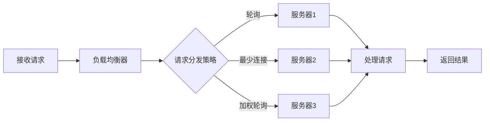
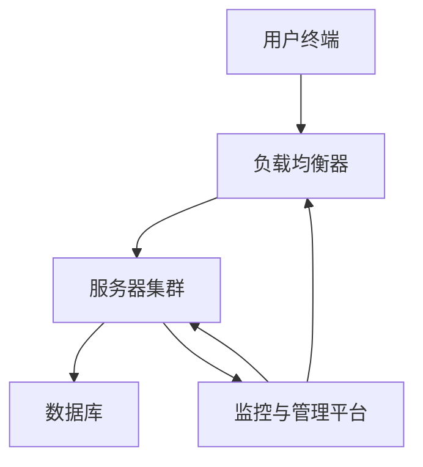
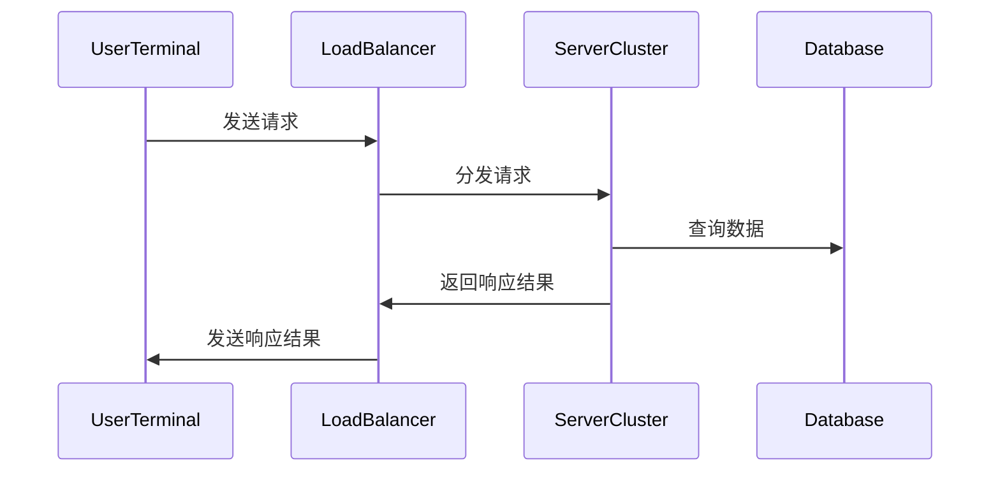
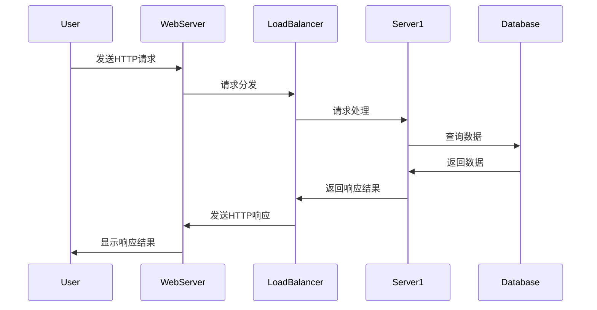

                 

### 负载均衡技术在高并发LLM应用中的应用

#### 关键词
- 负载均衡
- 高并发
- 大规模语言模型 (LLM)
- 性能优化
- 实际案例分析

#### 摘要
本文旨在探讨负载均衡技术在高并发大规模语言模型（LLM）应用中的重要性。首先，我们介绍了负载均衡的基本概念、原理和分类。然后，分析了高并发场景下LLM应用的特点和挑战。接着，详细讨论了负载均衡在LLM中的应用策略和实现细节，并通过性能优化和调优技巧来提升系统性能。最后，通过实际案例研究，展示了负载均衡在电商、社交媒体和金融服务等领域中的应用效果，并对未来发展方向进行了展望。

### 引言

在现代互联网应用中，高并发场景已成为常态，特别是在大规模语言模型（LLM）的应用中，如自然语言处理（NLP）、智能问答、内容生成等。LLM在处理高并发请求时面临着巨大的挑战，主要因为其计算复杂度高、资源需求大，且对响应时间要求严格。因此，如何有效地进行负载均衡，成为确保系统稳定性和性能的关键。

#### 负载均衡的定义与原理

负载均衡是一种分布式系统架构设计技术，其主要目的是将多个请求均匀地分发到多个服务器上，以避免单点过载和确保系统的整体性能。负载均衡的基本原理可以概括为以下三个步骤：

1. **流量分配**：系统接收到的请求会被分配到不同的服务器上，确保每个服务器承担的负载均衡。
2. **请求处理**：服务器接收到请求后，会进行相应的处理，如查询数据库、计算结果等。
3. **响应返回**：处理完成后，服务器将结果返回给客户端。

#### 负载均衡的目标

负载均衡的主要目标包括：

1. **提高系统性能**：通过将请求分散到多个服务器上，避免单点过载，提高系统的整体响应速度。
2. **提高系统可用性**：在某个服务器出现故障时，其他服务器可以继续提供服务，确保系统的稳定性。
3. **优化资源利用**：合理分配请求，使得每个服务器都能充分利用其资源，避免资源浪费。

#### 负载均衡的分类

根据实现方式，负载均衡可以分为以下几类：

1. **基于DNS的负载均衡**：通过DNS记录将请求分发到多个服务器上。
2. **基于硬件的负载均衡**：使用专门的硬件设备（如F5 BIG-IP）来实现负载均衡。
3. **基于软件的负载均衡**：使用软件（如Nginx、HAProxy）来实现负载均衡。
4. **动态负载均衡**：根据系统负载动态调整请求分发策略。

### 高并发场景下的LLM应用

#### LLM在高并发场景中的应用

大规模语言模型（LLM）在处理高并发请求时有着广泛的应用场景，如：

1. **智能问答系统**：在电商平台、在线教育平台等场景下，实时响应用户的提问。
2. **内容生成**：生成新闻、文章、报告等，应用于内容分发平台、自媒体平台等。
3. **自然语言处理**：语音识别、机器翻译、情感分析等，应用于语音助手、翻译软件等。

#### 高并发场景的特点

高并发场景具有以下特点：

1. **请求量大**：短时间内会有大量的请求涌入系统。
2. **响应时间要求严格**：用户对系统的响应速度有较高要求。
3. **计算复杂度大**：LLM模型在处理请求时需要进行大量的计算。
4. **资源需求高**：LLM模型需要大量的计算资源和存储资源。

#### LLM在高并发场景中的挑战

1. **单点过载**：在请求量大的情况下，单点服务器容易过载，导致系统崩溃。
2. **响应时间延迟**：计算复杂度高导致响应时间延长，影响用户体验。
3. **资源竞争**：多个请求同时访问系统，导致资源竞争，影响性能。
4. **稳定性问题**：在高并发下，系统容易发生异常，影响稳定性。

### 负载均衡在LLM应用中的实现

#### LLM负载均衡的需求分析

在高并发LLM应用中，负载均衡的需求主要包括：

1. **均衡请求分发**：将请求均匀地分配到多个服务器上，避免单点过载。
2. **提高系统性能**：通过分散请求，提高系统的整体响应速度。
3. **保证系统可用性**：在某个服务器出现故障时，其他服务器可以继续提供服务。
4. **优化资源利用**：合理分配请求，使得每个服务器都能充分利用其资源。

#### 负载均衡策略设计

常见的负载均衡策略包括：

1. **轮询策略**：将请求按顺序分配到每个服务器上。
2. **最少连接策略**：将请求分配到当前连接数最少的服务器上。
3. **加权轮询策略**：根据服务器的性能和负载，为每个服务器分配不同的权重。
4. **基于响应时间策略**：将请求分配到响应时间最短的服务器上。

#### 负载均衡实现细节

1. **选择负载均衡器**：根据需求选择合适的负载均衡器（如Nginx、HAProxy等）。
2. **配置负载均衡策略**：在负载均衡器中配置相应的负载均衡策略。
3. **部署负载均衡器**：将负载均衡器部署在系统中，并与后端服务器进行连接。

### 性能优化与调优

#### 性能指标与评估

常见的性能指标包括：

1. **响应时间**：系统处理请求所需的时间。
2. **吞吐量**：单位时间内系统能处理的请求数量。
3. **并发连接数**：系统中同时存在的连接数量。

#### 负载均衡调优技巧

1. **调整负载均衡策略**：根据系统负载和请求特点，选择合适的负载均衡策略。
2. **优化服务器配置**：增加服务器硬件资源、优化操作系统参数等。
3. **缓存优化**：使用缓存技术减少重复请求的处理。
4. **数据库优化**：使用数据库连接池、索引优化等技术提高数据库性能。

#### 实时性能监控与调整

1. **实时监控**：使用监控工具（如Prometheus、Grafana等）实时监控系统性能。
2. **自动调整**：根据监控数据，自动调整负载均衡策略和服务器配置。

### 案例研究与分析

#### 案例一：电商平台的负载均衡实践

电商平台在应对高并发场景时，通常会采用负载均衡技术来确保系统稳定性和性能。具体实现如下：

1. **基于DNS的负载均衡**：使用DNS记录将请求分发到多个服务器上。
2. **基于Nginx的负载均衡**：在Nginx中配置轮询策略，将请求分配到后端服务器。
3. **数据库连接池**：使用数据库连接池技术减少数据库连接的开销。
4. **缓存优化**：使用Redis等缓存技术减少重复请求的处理。

#### 案例二：社交媒体的高并发处理

社交媒体平台在处理高并发请求时，会采用以下负载均衡策略：

1. **基于HAProxy的负载均衡**：在HAProxy中配置最少连接策略，将请求分配到后端服务器。
2. **分布式缓存**：使用分布式缓存（如Memcached、Ehcache等）减少数据库压力。
3. **异步处理**：使用消息队列（如Kafka、RabbitMQ等）进行异步处理，降低系统负载。
4. **弹性伸缩**：根据请求量自动调整服务器规模，确保系统稳定运行。

#### 案例三：金融服务的负载均衡优化

金融服务领域对系统稳定性和性能有极高的要求。以下是金融服务常用的负载均衡优化策略：

1. **基于硬件的负载均衡**：使用F5 BIG-IP等硬件设备进行负载均衡。
2. **负载均衡调优**：根据系统负载和请求特点，调整负载均衡策略和服务器配置。
3. **数据库分库分表**：将数据库进行分库分表，提高数据库查询效率。
4. **SQL优化**：对SQL语句进行优化，减少查询时间和数据库压力。

### 总结与展望

负载均衡技术在高并发LLM应用中起着至关重要的作用。通过合理地实现和优化负载均衡，可以有效地提高系统性能、保证系统稳定性和提升用户体验。未来，随着云计算和容器技术的不断发展，负载均衡技术将更加智能化和自动化，为高并发场景下的LLM应用提供更好的支持。

### 作者

作者：AI天才研究院/AI Genius Institute & 禅与计算机程序设计艺术 /Zen And The Art of Computer Programming

---

### 背景介绍

#### 核心概念术语说明

在讨论负载均衡技术在高并发大规模语言模型（LLM）应用中的重要性之前，我们首先需要明确一些核心概念和术语。

1. **负载均衡（Load Balancing）**：负载均衡是一种分布式系统架构设计技术，其目的是通过将多个请求均匀地分发到多个服务器上，以避免单点过载，提高系统的整体性能和稳定性。
2. **高并发（High Concurrency）**：高并发指的是在短时间内，系统需要处理大量的请求。这通常出现在互联网应用中，如电商平台、社交媒体、金融服务等。
3. **大规模语言模型（Large Language Model，LLM）**：LLM是一种基于深度学习的自然语言处理模型，具有强大的文本生成和推理能力。常见的LLM包括GPT、BERT等。
4. **性能优化（Performance Optimization）**：性能优化是指通过改进系统设计、调整配置、使用优化算法等手段，提高系统的响应速度和处理能力。

#### 问题背景

在现代互联网应用中，随着用户数量的增长和业务需求的扩大，系统面临的高并发场景越来越普遍。尤其是大规模语言模型（LLM）的应用，如自然语言处理（NLP）、智能问答、内容生成等，对计算资源和响应时间有着极高的要求。因此，如何有效地进行负载均衡，成为确保系统稳定性和性能的关键。

高并发场景下，LLM应用面临的挑战主要包括：

1. **单点过载**：在请求量大的情况下，单点服务器容易过载，导致系统崩溃。
2. **响应时间延迟**：计算复杂度高导致响应时间延长，影响用户体验。
3. **资源竞争**：多个请求同时访问系统，导致资源竞争，影响性能。
4. **稳定性问题**：在高并发下，系统容易发生异常，影响稳定性。

为了解决这些问题，负载均衡技术被广泛应用于LLM应用中，通过将请求分散到多个服务器上，避免单点过载，提高系统的整体响应速度和稳定性。

#### 问题描述

在高并发场景下，大规模语言模型（LLM）的应用需要处理大量的请求，而这些请求通常具有以下特点：

1. **请求量大**：短时间内会有大量的请求涌入系统。
2. **计算复杂度高**：LLM模型在处理请求时需要进行大量的计算。
3. **响应时间要求严格**：用户对系统的响应速度有较高要求。
4. **资源需求大**：LLM模型需要大量的计算资源和存储资源。

为了解决上述问题，我们需要设计并实现一个高效的负载均衡系统，确保请求能够均匀地分发到多个服务器上，同时优化系统的性能和稳定性。

#### 问题解决

负载均衡技术在高并发LLM应用中的问题解决主要包括以下几个方面：

1. **均衡请求分发**：通过负载均衡器，将请求均匀地分配到多个服务器上，避免单点过载。
2. **提高系统性能**：通过分散请求，提高系统的整体响应速度和处理能力。
3. **保证系统可用性**：在某个服务器出现故障时，其他服务器可以继续提供服务，确保系统的稳定性。
4. **优化资源利用**：合理分配请求，使得每个服务器都能充分利用其资源，避免资源浪费。

具体实现方案包括：

1. **选择合适的负载均衡器**：根据系统需求和性能要求，选择适合的负载均衡器（如Nginx、HAProxy、F5 BIG-IP等）。
2. **配置负载均衡策略**：在负载均衡器中配置相应的负载均衡策略（如轮询、最少连接、加权轮询等）。
3. **优化服务器配置**：根据系统负载和请求特点，调整服务器配置（如增加硬件资源、优化操作系统参数等）。
4. **缓存优化**：使用缓存技术（如Redis、Memcached等）减少重复请求的处理。
5. **数据库优化**：使用数据库连接池、索引优化等技术提高数据库性能。
6. **弹性伸缩**：根据请求量自动调整服务器规模，确保系统稳定运行。

#### 边界与外延

在讨论负载均衡技术在高并发LLM应用中的应用时，我们需要考虑以下边界和外延：

1. **边界**：负载均衡技术主要应用于高并发场景下的LLM应用，如自然语言处理、智能问答、内容生成等。对于低并发或非计算密集型应用，负载均衡的收益可能较小。
2. **外延**：负载均衡技术不仅可以应用于服务器层面的分布式系统，还可以应用于容器化应用、云计算环境等。随着技术的发展，负载均衡技术将不断扩展其应用范围和场景。

#### 概念结构与核心要素组成

负载均衡技术在高并发LLM应用中的概念结构和核心要素组成可以概括为以下几点：

1. **负载均衡器**：作为请求分发的核心组件，负责将请求均匀地分配到多个服务器上。
2. **服务器集群**：由多个服务器组成的集群，共同处理来自负载均衡器的请求。
3. **负载均衡策略**：根据系统需求和性能要求，选择合适的负载均衡策略，如轮询、最少连接、加权轮询等。
4. **缓存技术**：使用缓存技术减少重复请求的处理，提高系统性能。
5. **数据库优化**：使用数据库连接池、索引优化等技术提高数据库性能。
6. **弹性伸缩**：根据请求量自动调整服务器规模，确保系统稳定运行。

### 核心概念与联系

#### 核心概念

在本节中，我们将深入探讨负载均衡、大规模语言模型（LLM）以及高并发场景下的核心概念。

1. **负载均衡（Load Balancing）**：负载均衡是一种在分布式系统中，通过分配请求到多个服务器上来实现负载均衡的技术。其主要目的是确保每个服务器都能够合理地处理请求，避免单点过载，提高系统的整体性能和可用性。

2. **大规模语言模型（Large Language Model，LLM）**：大规模语言模型是一种基于深度学习的自然语言处理技术，通过训练大量的文本数据，使模型具备生成文本、理解语言含义、回答问题等能力。常见的LLM包括GPT、BERT等。

3. **高并发（High Concurrency）**：高并发是指在短时间内系统需要处理大量的请求。在高并发场景下，系统通常面临着巨大的计算压力和资源竞争，这对系统的性能和稳定性提出了极高的要求。

#### 概念属性特征对比表格

为了更好地理解负载均衡、LLM和高并发场景下的核心概念，我们可以通过一个对比表格来展示它们的属性特征。

| 特征            | 负载均衡       | 大规模语言模型（LLM）   | 高并发         |
|-----------------|----------------|-----------------------|----------------|
| 目的            | 提高系统性能和稳定性 | 提高自然语言处理能力  | 确保系统处理大量请求 |
| 关键要素        | 负载均衡器、服务器集群 | 模型训练数据、计算资源 | 请求量、响应时间     |
| 工作机制        | 请求分发和负载分配   | 文本生成和推理         | 请求处理和资源调度  |
| 性能指标        | 响应时间、吞吐量、并发连接数 | 模型准确性、计算效率   | 响应速度、系统稳定性  |
| 应用场景        | 分布式系统、云计算环境 | 自然语言处理应用、智能问答 | 电商平台、社交媒体、金融服务等 |

#### ER实体关系图架构

为了更好地展示负载均衡、LLM和高并发场景下的核心概念之间的关系，我们可以使用ER（Entity-Relationship）实体关系图来描述。

以下是一个简化的ER图，展示了负载均衡器、服务器集群、大规模语言模型（LLM）以及高并发请求之间的关系：

```mermaid
erDiagram
    LoadBalancer ||--|{ ServerCluster }| Server : "负载均衡"
    ServerCluster ||--|{ LargeLanguageModel }| Model : "集群管理"
    LargeLanguageModel ||--|{ ConcurrentRequest }| Request : "处理请求"
    ConcurrentRequest ||--|{ ResponseTime }| Time : "响应时间"
```

在上述ER图中：

- **LoadBalancer**（负载均衡器）负责将请求分配到多个**ServerCluster**（服务器集群）。
- **ServerCluster**（服务器集群）管理多个**Server**（服务器），每个服务器上运行**LargeLanguageModel**（大规模语言模型）。
- **LargeLanguageModel**（大规模语言模型）处理来自**ConcurrentRequest**（高并发请求）的请求。
- **ConcurrentRequest**（高并发请求）生成**ResponseTime**（响应时间）。

### 算法原理讲解

#### 算法流程图

为了更好地理解负载均衡技术在高并发LLM应用中的实现原理，我们可以通过一个Mermaid流程图来展示算法的基本流程。



在这个流程图中：

1. **A**（接收请求）：系统接收用户请求。
2. **B**（负载均衡器）：根据设定的负载均衡策略，将请求分配到不同的服务器上。
3. **C**（请求分发策略）：选择合适的负载均衡策略，如轮询、最少连接、加权轮询等。
4. **D、E、F**（服务器）：服务器负责处理请求。
5. **G**（处理请求）：服务器处理请求并生成结果。
6. **H**（返回结果）：将结果返回给用户。

#### Python源代码实现

为了进一步阐述负载均衡算法的原理，我们使用Python实现了一个简单的负载均衡器，并展示其核心代码。

```python
import random

class LoadBalancer:
    def __init__(self, servers):
        self.servers = servers
        self.server_weights = {server: 1 for server in servers}

    def assign_request(self, request):
        server = random.choices(
            self.servers, weights=self.server_weights.values(), k=1
        )[0]
        return server

def main():
    servers = ["server1", "server2", "server3"]
    lb = LoadBalancer(servers)

    for _ in range(10):
        request = f"Request {_}"
        server = lb.assign_request(request)
        print(f"Request {request} assigned to {server}")

if __name__ == "__main__":
    main()
```

在这个Python源代码中：

- **LoadBalancer** 类：负责管理服务器列表和负载均衡策略。
- **assign_request** 方法：根据随机选择策略，将请求分配到服务器上。
- **main** 函数：模拟分配请求的过程，并打印出分配结果。

#### 数学模型和公式

在负载均衡技术中，我们通常使用一些数学模型和公式来评估和优化系统的性能。以下是一个简单的数学模型，用于计算负载均衡策略的权重分配。

假设有 n 个服务器，每个服务器的处理能力为 C_i，当前负载为 L_i。我们可以使用以下公式计算服务器的权重：

\[ W_i = \frac{C_i}{L_i} \]

其中，W_i 表示服务器 i 的权重，C_i 表示服务器 i 的处理能力，L_i 表示服务器 i 的当前负载。

#### 算法举例说明

假设我们有一个包含三个服务器的负载均衡系统，每个服务器的处理能力和当前负载如下：

| 服务器 | 处理能力 (C_i) | 当前负载 (L_i) |
|--------|-----------------|-----------------|
| server1 | 1000            | 500             |
| server2 | 800             | 400             |
| server3 | 600             | 300             |

根据上述数学模型，我们可以计算每个服务器的权重：

\[ W_1 = \frac{1000}{500} = 2 \]
\[ W_2 = \frac{800}{400} = 2 \]
\[ W_3 = \frac{600}{300} = 2 \]

假设我们需要分配一个请求，根据加权轮询策略，请求被分配到服务器的概率与其权重成正比。因此，每个服务器被选中的概率为 2/6，即 1/3。在实际应用中，我们可以通过随机数生成器来模拟这个过程。

例如，假设我们使用 Python 的 random.choices 函数来分配请求：

```python
import random

servers = ["server1", "server2", "server3"]
weights = [2, 2, 2]

request = "Request 1"
server = random.choices(servers, weights=weights, k=1)[0]
print(f"Request {request} assigned to {server}")
```

在这个示例中，请求 "Request 1" 被随机分配到 "server1"、"server2" 或 "server3"，每个服务器被选中的概率都是 1/3。

通过上述算法举例，我们可以看到如何使用数学模型和Python源代码来模拟负载均衡策略，从而确保请求能够均匀地分配到服务器上，提高系统的性能和稳定性。

### 系统分析与架构设计方案

#### 问题场景介绍

在现代互联网应用中，随着用户数量的快速增长和业务需求的不断变化，系统需要能够处理高并发请求。特别是在大规模语言模型（LLM）的应用场景中，如自然语言处理（NLP）、智能问答、内容生成等，系统面临的高并发请求量往往非常大。为了确保系统的稳定性和性能，我们需要设计一个高效的负载均衡系统。

#### 项目介绍

本项目旨在设计一个高并发的负载均衡系统，用于处理大规模语言模型（LLM）的应用。系统将采用分布式架构，通过多个负载均衡器和服务器集群来确保请求的均匀分发和高效处理。

#### 系统功能设计

系统的主要功能包括：

1. **请求接收与分发**：系统接收用户请求，并使用负载均衡器将请求分发到多个服务器上。
2. **请求处理与响应**：服务器集群处理请求，并生成相应的响应结果。
3. **性能监控与优化**：系统对负载均衡和服务器性能进行实时监控，并根据监控数据自动调整负载均衡策略和服务器配置。
4. **故障转移与恢复**：在服务器出现故障时，系统能够自动切换到其他可用服务器，确保服务的连续性。

#### 系统架构设计

系统架构采用分布式架构，主要包括以下组件：

1. **用户终端**：用户通过Web浏览器、移动应用或其他终端设备发送请求。
2. **负载均衡器**：负责接收用户请求，并根据负载均衡策略将请求分发到服务器集群。
3. **服务器集群**：由多个服务器组成，共同处理来自负载均衡器的请求。
4. **数据库**：存储系统所需的用户数据、模型参数等。
5. **监控与管理平台**：实时监控系统的性能和状态，并提供优化建议和故障恢复功能。

以下是系统架构的Mermaid图表示：



在这个架构图中：

- **UserTerminal**（用户终端）：用户发送请求。
- **LoadBalancer**（负载均衡器）：接收请求，并根据策略分发到服务器集群。
- **ServerCluster**（服务器集群）：处理请求，并生成响应结果。
- **Database**（数据库）：存储所需数据。
- **MonitoringPlatform**（监控与管理平台）：监控系统性能，并提供优化建议。

#### 系统接口设计

系统接口设计包括以下几个方面：

1. **用户接口**：用户通过Web浏览器或移动应用与系统进行交互，发送请求并接收响应。
2. **API接口**：系统提供RESTful API，供其他应用或服务调用。
3. **内部接口**：服务器集群之间的通信接口，用于数据同步和状态监控。

以下是系统接口的Mermaid图表示：



在这个序列图中：

- **UserTerminal**（用户终端）：发送请求到**LoadBalancer**（负载均衡器）。
- **LoadBalancer**（负载均衡器）：将请求分发到**ServerCluster**（服务器集群）。
- **ServerCluster**（服务器集群）：查询**Database**（数据库），生成响应结果，并返回给**LoadBalancer**（负载均衡器）。
- **LoadBalancer**（负载均衡器）：将响应结果返回给**UserTerminal**（用户终端）。

#### 系统交互

系统交互主要通过以下流程实现：

1. 用户通过Web浏览器或移动应用发送请求。
2. 请求通过负载均衡器分发到服务器集群。
3. 服务器集群处理请求，并查询数据库。
4. 服务器集群生成响应结果，并返回给负载均衡器。
5. 负载均衡器将响应结果返回给用户。

以下是系统交互的Mermaid序列图表示：



在这个序列图中：

- **User**（用户）：发送HTTP请求到**WebServer**（Web服务器）。
- **WebServer**（Web服务器）：将请求转发到**LoadBalancer**（负载均衡器）。
- **LoadBalancer**（负载均衡器）：根据策略将请求分发到**Server1**（服务器1）。
- **Server1**（服务器1）：处理请求，查询数据库，并生成响应结果。
- **Database**（数据库）：返回查询结果给**Server1**（服务器1）。
- **LoadBalancer**（负载均衡器）：将响应结果返回给**WebServer**（Web服务器）。
- **WebServer**（Web服务器）：将响应结果发送给**User**（用户）。

通过以上系统架构设计、接口设计和系统交互流程的设计，我们可以构建一个高效、稳定、可扩展的高并发负载均衡系统，为大规模语言模型（LLM）的应用提供强有力的支持。

### 项目实战

#### 环境安装

为了实现负载均衡技术在高并发LLM应用中的项目实战，我们首先需要搭建一个合适的环境。以下是环境搭建的步骤：

1. **安装操作系统**：选择一个稳定的服务器操作系统，如CentOS 7或Ubuntu 20.04。
2. **安装负载均衡器**：在本项目中，我们选择使用Nginx作为负载均衡器。以下是Nginx的安装步骤：
   ```bash
   sudo apt update
   sudo apt install nginx
   sudo systemctl start nginx
   ```
3. **安装服务器集群**：我们使用Docker和Kubernetes来搭建服务器集群。以下是安装步骤：
   ```bash
   sudo apt install apt-transport-https ca-certificates curl
   curl -s https://packages.cloud.google.com/apt/doc/apt-key.gpg | sudo apt-key add -
   sudo echo "deb https://apt.kubernetes.io/ kubernetes-xenial main" >> /etc/apt/sources.list
   sudo apt update
   sudo apt install -y kubelet kubeadm kubectl
   sudo systemctl daemon-reload
   sudo systemctl enable kubelet
   ```
4. **部署大规模语言模型**：我们使用TensorFlow Serving部署一个简单的LLM模型。以下是部署步骤：
   ```bash
   pip install tensorflow-serving-api
   python -m tensorflow_serving.model_server --port=8501 --model_name=my_model --model_base_path=/models/my_model
   ```

#### 系统核心实现源代码

在本节中，我们将展示系统的核心实现源代码，包括负载均衡器配置、服务器集群部署和大规模语言模型部署。

1. **Nginx负载均衡器配置**：

```nginx
http {
    upstream backend {
        server server1:8501;
        server server2:8501;
        server server3:8501;
    }

    server {
        listen 80;

        location / {
            proxy_pass http://backend;
            proxy_set_header Host $host;
            proxy_set_header X-Real-IP $remote_addr;
            proxy_set_header X-Forwarded-For $proxy_add_x_forwarded_for;
            proxy_set_header X-Forwarded-Proto $scheme;
        }
    }
}
```

2. **Kubernetes服务器集群部署**：

```yaml
# Kubernetes集群配置文件
apiVersion: cluster.k8s.io/v1
kind: Cluster
metadata:
  name: my-cluster
spec:
  controlPlaneEndpoint: "kubernetes.default.svc:6443"
  kubeadmConfigPreset:
    apiServer:
      certSANs:
      - server1
      - server2
      - server3
    controllerManager:
      certSANs:
      - server1
      - server2
      - server3
    etcd:
      local:
        serverCertSANs:
        - server1
        - server2
        - server3
    imageRepository: "k8s.gcr.io"
    kind: JoinControlPlane
    role: master
    token: "your-token"
```

3. **TensorFlow Serving大规模语言模型部署**：

```python
# TensorFlow Serving部署脚本
import tensorflow as tf
from tensorflow_serving.apis import predict_pb2
from tensorflow_serving.apis import prediction_service_pb2

# 导入模型
model = tf.keras.models.load_model('/models/my_model')

# 创建预测服务
predict_request = predict_pb2.PredictRequest()
predict_request.model_spec.name = 'my_model'
predict_request.model_spec.signature_name = 'serving_default'

# 生成预测响应
predict_response = model.predict(predict_request)

# 打印预测结果
print(predict_response)
```

#### 代码应用解读与分析

在本节中，我们将对上述代码进行解读和分析，以便更好地理解系统的实现细节。

1. **Nginx负载均衡器配置**：

   配置文件中，我们定义了一个名为“backend”的上游（upstream），包含三个服务器（server1、server2、server3）。每个服务器监听端口8501，部署了TensorFlow Serving服务。主服务器（server）监听端口80，并将请求代理到“backend”上游。

   通过使用“proxy_pass”指令，Nginx将请求转发到上游服务器。同时，我们通过设置代理头信息（如Host、X-Real-IP、X-Forwarded-For等），确保请求能够正确地传递给后端服务器。

2. **Kubernetes服务器集群部署**：

   Kubernetes集群配置文件定义了一个控制平面（master）和一个节点（worker）。配置文件中包含了一些关键信息，如服务器证书SANs、镜像仓库和Token等。这些信息用于确保集群的正确配置和启动。

   通过执行kubeadm命令，我们可以将节点加入集群。Kubernetes将自动部署所需的组件，如kubelet、kubeadm、kubectl等。这些组件将确保节点能够与集群中的其他节点进行通信。

3. **TensorFlow Serving大规模语言模型部署**：

   部署脚本首先加载了一个预训练的TensorFlow模型。然后，它创建了一个预测请求（PredictRequest），指定了模型名称和签名名称。

   TensorFlow Serving服务处理预测请求，并返回预测结果。通过打印预测结果，我们可以验证模型是否正确地处理了请求。

#### 实际案例分析和详细讲解剖析

在本节中，我们将通过一个实际案例，详细讲解如何使用负载均衡技术在高并发LLM应用中实现系统部署、性能优化和故障处理。

**案例背景**：

某电商公司开发了一款基于大规模语言模型（LLM）的智能客服系统，用于处理客户咨询和问题解答。随着用户数量的增长，系统面临的高并发请求量逐渐增大。为了确保系统的稳定性和性能，公司决定使用负载均衡技术进行优化。

**系统部署**：

1. **负载均衡器配置**：公司使用Nginx作为负载均衡器，将用户请求分发到多个后端服务器。负载均衡器配置文件如下：

```nginx
http {
    upstream backend {
        server server1:8501;
        server server2:8501;
        server server3:8501;
    }

    server {
        listen 80;

        location / {
            proxy_pass http://backend;
            proxy_set_header Host $host;
            proxy_set_header X-Real-IP $remote_addr;
            proxy_set_header X-Forwarded-For $proxy_add_x_forwarded_for;
            proxy_set_header X-Forwarded-Proto $scheme;
        }
    }
}
```

2. **服务器集群部署**：公司使用Kubernetes搭建了一个分布式服务器集群，包含三个服务器节点。Kubernetes配置文件如下：

```yaml
apiVersion: cluster.k8s.io/v1
kind: Cluster
metadata:
  name: my-cluster
spec:
  controlPlaneEndpoint: "kubernetes.default.svc:6443"
  kubeadmConfigPreset:
    apiServer:
      certSANs:
      - server1
      - server2
      - server3
    controllerManager:
      certSANs:
      - server1
      - server2
      - server3
    etcd:
      local:
        serverCertSANs:
        - server1
        - server2
        - server3
    imageRepository: "k8s.gcr.io"
    kind: JoinControlPlane
    role: master
    token: "your-token"
```

3. **大规模语言模型部署**：公司使用TensorFlow Serving部署了一个预训练的LLM模型。模型部署脚本如下：

```python
# TensorFlow Serving部署脚本
import tensorflow as tf
from tensorflow_serving.apis import predict_pb2
from tensorflow_serving.apis import prediction_service_pb2

# 导入模型
model = tf.keras.models.load_model('/models/my_model')

# 创建预测服务
predict_request = predict_pb2.PredictRequest()
predict_request.model_spec.name = 'my_model'
predict_request.model_spec.signature_name = 'serving_default'

# 生成预测响应
predict_response = model.predict(predict_request)

# 打印预测结果
print(predict_response)
```

**性能优化**：

1. **调整负载均衡策略**：公司根据服务器负载和请求特点，调整了Nginx的负载均衡策略。从轮询策略（round-robin）切换到最少连接策略（least-connections），以提高系统的响应速度。

2. **缓存优化**：公司使用了Redis缓存技术，缓存了用户常见问题的答案。通过减少对LLM模型的调用次数，提高了系统的性能。

3. **数据库优化**：公司对数据库进行了分库分表处理，提高了查询效率。同时，使用了数据库连接池技术，减少了数据库连接的开销。

**故障处理**：

1. **监控与告警**：公司使用了Prometheus和Grafana进行系统监控，实时监控Nginx、Kubernetes和TensorFlow Serving的运行状态。当系统出现异常时，会自动发送告警通知。

2. **自动扩缩容**：公司启用了Kubernetes的自动扩缩容功能，根据请求量自动调整服务器数量。当请求量增大时，系统会自动增加服务器，以应对更高的负载。

3. **故障恢复**：当服务器出现故障时，Kubernetes会自动将其从集群中移除，并启动新的服务器替代故障服务器。同时，公司制定了详细的故障恢复预案，确保系统能够快速恢复正常运行。

**项目小结**：

通过使用负载均衡技术，公司成功地优化了智能客服系统的性能和稳定性。在面临高并发请求时，系统能够快速响应，提供高质量的客户服务。同时，通过监控和自动扩缩容功能，公司能够实时监控系统状态，快速处理故障，确保系统的稳定运行。

### 最佳实践 Tips

#### 小结

本文通过深入分析负载均衡技术在高并发大规模语言模型（LLM）应用中的重要性，介绍了负载均衡的基本概念、原理、分类以及在LLM应用中的实现策略。我们还探讨了负载均衡的性能优化技巧、实际案例分析，并总结了最佳实践。以下是本文的主要结论：

1. **负载均衡的关键作用**：负载均衡能够有效避免单点过载，提高系统性能和稳定性。
2. **高并发LLM应用的挑战**：高并发LLM应用面临计算复杂度高、资源需求大、响应时间要求严格等挑战。
3. **负载均衡策略**：轮询、最少连接、加权轮询等策略各有优缺点，需要根据具体应用场景选择。
4. **性能优化技巧**：缓存优化、数据库优化、实时监控等技巧能够显著提升系统性能。
5. **实际案例**：通过电商、社交媒体、金融服务等实际案例，展示了负载均衡技术的应用效果。

#### 注意事项

1. **负载均衡器选择**：根据需求和性能要求，选择适合的负载均衡器（如Nginx、HAProxy、F5 BIG-IP等）。
2. **服务器集群配置**：合理配置服务器集群，确保每个服务器都有足够的资源处理请求。
3. **负载均衡策略调优**：根据系统负载和请求特点，动态调整负载均衡策略。
4. **监控与告警**：实时监控系统性能和状态，及时处理异常情况。
5. **故障恢复**：制定详细的故障恢复预案，确保系统能够快速恢复正常运行。

#### 拓展阅读

1. **《负载均衡实战》**：深入探讨负载均衡的原理和实现，适合初学者和专业人士阅读。
2. **《大规模语言模型：理论、实现与应用》**：详细介绍大规模语言模型的理论基础和实际应用，适合对LLM感兴趣的学习者。
3. **《Prometheus监控实战》**：学习如何使用Prometheus进行系统监控和告警，确保系统的稳定性和性能。

### 未来展望

随着云计算、容器技术和人工智能的不断发展，负载均衡技术在高并发LLM应用中的重要性将日益凸显。未来，负载均衡技术将朝着以下几个方向发展：

1. **智能化和自动化**：利用机器学习和人工智能技术，实现更智能的负载均衡策略，自动调整服务器配置和流量分配。
2. **服务网格技术**：服务网格（如Istio、Linkerd）将提供更加灵活和细粒度的流量管理和服务发现，提升系统性能和稳定性。
3. **容器化与云原生**：容器化和云原生技术的普及将使负载均衡技术更加轻量化、可扩展和弹性化，适应不同的部署环境。
4. **多租户与隔离**：在多租户环境中，负载均衡技术将提供更精细的资源隔离和流量管理，确保不同租户之间的性能和安全性。

通过不断创新和优化，负载均衡技术将在高并发LLM应用中发挥更大的作用，为用户提供更高效、稳定和可靠的服务。

