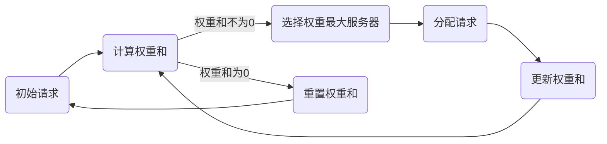

                 

### 文章标题

# 负载均衡：确保AI服务高可用性的技术手段

## 关键词

- 负载均衡
- AI服务
- 高可用性
- 算法原理
- 架构设计
- 实践案例

## 摘要

本文将深入探讨负载均衡在确保AI服务高可用性方面的关键作用。首先，我们介绍了负载均衡的基本概念和重要性，并通过多种负载均衡算法的详细解析，帮助读者理解其工作原理。接着，我们讨论了硬件与软件负载均衡技术，以及分布式环境中的负载均衡实现。特别地，本文将重点阐述容器化环境中负载均衡的实践，以及AI服务在负载均衡应用中的挑战与解决方案。最后，我们展望了负载均衡技术的发展趋势，并提供了最佳实践和未来展望。希望通过本文，读者能对负载均衡技术有一个全面且深入的理解。

### 目录大纲

----------------------------------------------------------------

# 负载均衡：确保AI服务高可用性的技术手段

> 关键词：负载均衡、AI服务、高可用性、算法原理、架构设计、实践案例

> 摘要：本文将深入探讨负载均衡在确保AI服务高可用性方面的关键作用，通过详细解析各种负载均衡算法、技术以及最佳实践，帮助读者全面理解负载均衡在AI服务中的应用。

----------------------------------------------------------------

## 第一部分: 负载均衡概述

### 第1章: 负载均衡的基本概念

#### 1.1 负载均衡的定义

负载均衡是一种在多台服务器之间分配网络请求、工作负载或数据流的技术。其目的是确保系统能够高效地处理大量的请求，避免任何一台服务器过载，从而提高整个系统的性能和可靠性。

#### 1.2 负载均衡的重要性

在现代IT基础设施中，负载均衡具有至关重要的作用。它不仅可以提高系统的响应速度，还可以减少单点故障的风险，增强系统的弹性和容错能力。

#### 1.3 负载均衡的分类

根据实现方式的不同，负载均衡可以分为硬件负载均衡和软件负载均衡。硬件负载均衡通常使用专门的设备，如负载均衡器，来处理流量；软件负载均衡则通过在服务器上安装特定的软件来实现。

#### 1.4 负载均衡的挑战

负载均衡面临的主要挑战包括流量分配的公平性、实时性能监控、动态调整策略以及安全性的保障。

### 第2章: 负载均衡算法

#### 2.1 负载均衡算法概述

负载均衡算法是负载均衡系统的核心，其目的是根据一定的策略将流量分配到不同的服务器上。

#### 2.2 常见的负载均衡算法

- **轮询算法**：将请求依次分配给服务器，是最简单也是最常用的负载均衡算法。
- **加权轮询算法**：根据服务器的处理能力分配不同的权重，处理能力强的服务器会接收更多的请求。
- **最少连接算法**：选择当前连接数最少的服务器进行分配。
- **随机算法**：随机选择服务器进行流量分配。
- **最小带宽算法**：选择当前带宽剩余量最大的服务器进行分配。

## 第二部分: 负载均衡技术

### 第3章: 硬件负载均衡

#### 3.1 硬件负载均衡器

硬件负载均衡器是一种专门用于处理网络流量的设备，具有高效、稳定的特点。

#### 3.2 硬件负载均衡的实现原理

硬件负载均衡器通过在网络流量进入目标服务器之前，将流量分配到不同的服务器上，从而实现负载均衡。

#### 3.3 硬件负载均衡的优势与局限性

硬件负载均衡的优势包括高性能、高可靠性等，但其成本较高，适用范围有限。

### 第4章: 软件负载均衡

#### 4.1 软件负载均衡简介

软件负载均衡通过在服务器上安装特定的软件来实现，具有灵活、易扩展的特点。

#### 4.2 常见的软件负载均衡器

- **Nginx**：高性能的Web服务器/反向代理服务器，也可以作为负载均衡器使用。
- **HAProxy**：一个开源的高性能负载均衡器，广泛应用于企业级环境中。
- **LVS**：Linux虚拟服务器，是一种基于Linux内核的虚拟负载均衡解决方案。

### 第5章: 分布式负载均衡

#### 5.1 分布式负载均衡的概念

分布式负载均衡是将负载均衡算法和策略分布到多个节点上，从而实现更高效、可靠的负载均衡。

#### 5.2 分布式负载均衡的优势

分布式负载均衡具有更高的扩展性、容错性和灵活性。

#### 5.3 分布式负载均衡的实现原理

分布式负载均衡通过在多个节点上部署负载均衡代理，实现流量分配和路由。

### 第6章: 容器化环境中的负载均衡

#### 6.1 容器化环境概述

容器化技术如Docker和Kubernetes，使得应用部署和运维更加灵活和高效。

#### 6.2 Kubernetes中的负载均衡

Kubernetes提供了内置的负载均衡器，可以实现服务之间的流量分配。

#### 6.3 Istio中的服务网格与负载均衡

Istio是一种服务网格框架，提供了灵活、可扩展的负载均衡和服务管理功能。

### 第7章: 负载均衡最佳实践

#### 7.1 负载均衡策略的选择

根据应用场景选择合适的负载均衡策略，如轮询、加权轮询等。

#### 7.2 负载均衡性能优化

通过优化配置和算法，提高负载均衡的性能。

#### 7.3 负载均衡的安全性与稳定性

确保负载均衡系统的安全性和稳定性，如防范DDoS攻击等。

#### 7.4 负载均衡的监控与故障处理

通过监控和故障处理机制，确保负载均衡系统的正常运行。

### 第8章: AI服务高可用性与负载均衡

#### 8.1 AI服务的高可用性需求

AI服务对可用性有较高的要求，需要确保其持续、稳定地提供服务。

#### 8.2 负载均衡在AI服务中的应用

负载均衡在AI服务中的应用，可以确保服务的稳定性和可靠性。

#### 8.3 负载均衡在AI服务高可用性中的关键角色

负载均衡在AI服务高可用性中扮演着关键角色，如流量分配、故障转移等。

#### 8.4 AI服务的负载均衡挑战与解决方案

探讨AI服务在负载均衡过程中面临的挑战及解决方案。

### 第9章: 未来展望

#### 9.1 负载均衡技术的发展趋势

分析负载均衡技术的发展趋势，如容器化、智能负载均衡等。

#### 9.2 AI与负载均衡的深度融合

探讨AI与负载均衡的深度融合，如基于AI的动态负载均衡。

#### 9.3 负载均衡在智能服务中的应用前景

展望负载均衡在智能服务中的应用前景，如物联网、自动驾驶等。

## 总结

本文全面介绍了负载均衡技术及其在AI服务高可用性方面的应用。通过详细解析负载均衡的基本概念、算法原理、技术实现及最佳实践，帮助读者深入理解负载均衡的重要性及其在AI服务中的应用。随着技术的不断发展，负载均衡将在未来的智能服务中扮演更加重要的角色。

### 作者

作者：AI天才研究院/AI Genius Institute & 禅与计算机程序设计艺术 /Zen And The Art of Computer Programming

----------------------------------------------------------------

### 第1章: 负载均衡的基本概念

#### 1.1 负载均衡的定义

负载均衡是一种通过在多台服务器之间分配请求、工作负载或数据流的技术，以实现系统性能和可靠性的提升。它旨在确保每一台服务器都能在其处理能力范围内高效运行，避免单点过载或资源浪费。简单来说，负载均衡就像是交通警察，在高峰时段合理分配交通流量，以减少交通拥堵，提高道路通行效率。

#### 1.2 负载均衡的重要性

在现代互联网架构中，负载均衡扮演着至关重要的角色。随着用户需求的不断增长和复杂应用场景的增多，单台服务器已经很难满足大规模和高并发的服务需求。负载均衡能够有效地分散流量，确保系统能够持续、稳定地提供服务。具体来说，负载均衡的重要性体现在以下几个方面：

- **性能优化**：通过均匀分配请求，避免单点过载，提高整体系统的响应速度和处理能力。
- **高可用性**：通过冗余设计，确保在服务器故障时能够迅速切换到其他服务器，减少系统停机时间。
- **可扩展性**：方便系统根据需求动态增加或减少服务器数量，灵活应对流量波动。
- **成本效益**：合理利用服务器资源，减少硬件投入和维护成本。

#### 1.3 负载均衡的分类

负载均衡可以根据实现方式的不同分为硬件负载均衡和软件负载均衡：

- **硬件负载均衡**：硬件负载均衡器是一种专门用于处理网络流量的设备，通常具有高性能、高可靠性的特点。常见的硬件负载均衡器有F5 BIG-IP、AWS ELB等。硬件负载均衡器通过在网络流量进入目标服务器之前，将流量分配到不同的服务器上，从而实现负载均衡。

- **软件负载均衡**：软件负载均衡是通过在服务器上安装特定的软件来实现负载均衡。常见的软件负载均衡器有Nginx、HAProxy、LVS等。软件负载均衡具有灵活、易扩展的特点，适用于各种规模的应用场景。

#### 1.4 负载均衡的挑战

尽管负载均衡在提高系统性能和可用性方面具有显著优势，但在实际应用中仍面临一些挑战：

- **流量分配的公平性**：如何确保流量分配公平，避免某些服务器长时间过载而其他服务器空闲。
- **实时性能监控**：如何实时监控系统性能，及时调整负载均衡策略。
- **动态调整策略**：如何根据系统负载动态调整负载均衡策略，以应对突发流量。
- **安全性**：如何确保负载均衡系统的安全性，防范恶意流量攻击。

#### 1.5 负载均衡的核心概念与联系

为了更好地理解负载均衡的原理和应用，我们需要明确一些核心概念：

- **请求**：用户发起的HTTP请求或其他类型的请求。
- **服务器**：处理请求的物理或虚拟服务器。
- **负载均衡器**：分配请求到不同服务器的设备或软件。
- **会话保持**：确保用户的会话在同一个服务器上维持，以提高用户体验。
- **健康检查**：定期检查服务器的状态，确保其正常运行。

以下是一个简单的ER实体关系图，展示了负载均衡系统中的主要实体及其关系：

```mermaid
erDiagram
  User ||--o{ Request : 发起请求 }
  Server ||--o{ Response : 返回响应 }
  LoadBalancer ||--o{ Request : 分配请求 }  
  LoadBalancer ||--|{ HealthCheck : 健康检查 }  
  User ..|> { SessionMaintain : 会话保持 }
```

#### 1.6 负载均衡算法原理讲解

负载均衡算法是负载均衡系统的核心，其目的是根据一定的策略将流量分配到不同的服务器上。以下是一些常见的负载均衡算法及其原理：

1. **轮询算法**：将请求依次分配给服务器，是最简单也是最常用的负载均衡算法。优点是简单易懂，缺点是可能导致某些服务器长时间过载。
2. **加权轮询算法**：根据服务器的处理能力分配不同的权重，处理能力强的服务器会接收更多的请求。优点是能够更公平地分配流量，缺点是配置较为复杂。
3. **最少连接算法**：选择当前连接数最少的服务器进行分配。优点是能够更好地利用服务器资源，缺点是可能对新的请求响应时间较长。
4. **随机算法**：随机选择服务器进行流量分配。优点是简单易实现，缺点是可能导致某些服务器过载。
5. **最小带宽算法**：选择当前带宽剩余量最大的服务器进行分配。优点是能够确保服务器有足够的带宽处理请求，缺点是带宽估算较为复杂。

以下是一个使用Mermaid绘制的加权轮询算法的流程图：



#### 1.7 负载均衡算法的Python实现

为了更好地理解加权轮询算法的原理，我们使用Python实现了一个简单的示例：

```python
import random

# 服务器类
class Server:
    def __init__(self, name, weight):
        self.name = name
        self.weight = weight
        self.connections = 0

    def process_request(self):
        self.connections += 1
        print(f"{self.name}处理请求，当前连接数：{self.connections}")

    def update_weight(self):
        self.weight = self.connections // 10  # 每10个连接更新一次权重

# 负载均衡器类
class LoadBalancer:
    def __init__(self, servers):
        self.servers = servers
        self.total_weight = sum(server.weight for server in servers)

    def select_server(self):
        if self.total_weight == 0:
            return None
        
        rand = random.uniform(0, self.total_weight)
        current = 0
        for server in self.servers:
            current += server.weight
            if current >= rand:
                return server
        return None

    def balance_load(self):
        selected_server = self.select_server()
        if selected_server:
            selected_server.process_request()
            selected_server.update_weight()
        else:
            print("无可用服务器")

# 测试
servers = [
    Server("Server1", 5),
    Server("Server2", 3),
    Server("Server3", 2),
]

load_balancer = LoadBalancer(servers)
for _ in range(10):
    load_balancer.balance_load()
```

运行上述代码，可以看到每个服务器处理请求的过程及其权重的动态调整。

#### 1.8 数学模型和公式

为了更深入地理解加权轮询算法，我们引入一些数学模型和公式：

1. **权重计算公式**：服务器的权重 = 处理能力系数 × 初始权重
2. **随机数生成公式**：用于生成一个在0到总权重之间的随机数，以确定请求分配给哪个服务器。

$$
\text{rand} = \text{random.uniform}(0, \text{total\_weight})
$$

#### 1.9 通俗易懂的举例说明

假设我们有3台服务器，其初始权重分别为5、3、2。在某个时刻，我们需要将一个请求分配给这三台服务器。首先，我们计算总权重：

$$
\text{total\_weight} = 5 + 3 + 2 = 10
$$

然后，我们生成一个在0到10之间的随机数，假设生成的随机数为3.5。接下来，我们依次检查每台服务器的权重：

- 第一台服务器权重为5，当前权重为5，3.5在范围内，请求分配给第一台服务器。
- 第二台服务器权重为3，当前权重为8（上一轮已分配5），3.5不在范围内。
- 第三台服务器权重为2，当前权重为10（上一轮已分配8），3.5不在范围内。

因此，本次请求被分配给了第一台服务器。

#### 1.10 负载均衡在实际应用中的案例

在实际应用中，负载均衡广泛应用于各种场景，以下是一些典型的案例：

- **电子商务网站**：通过负载均衡技术，将大量用户请求分配到多台服务器上，确保网站在高并发情况下稳定运行。
- **视频流媒体平台**：为了提供高质量的观看体验，流媒体平台使用负载均衡技术，将用户请求分配到最优的播放服务器上。
- **金融交易系统**：金融交易系统对实时性和稳定性要求极高，通过负载均衡技术，确保交易请求能够快速、稳定地处理。

#### 1.11 本章小结

本章介绍了负载均衡的基本概念、重要性、分类及挑战，详细解析了负载均衡算法原理，并通过Python代码和示例说明了加权轮询算法的实现。通过本章的学习，读者应能理解负载均衡的核心概念和基本原理，为后续章节的学习打下坚实基础。

### 第2章: 负载均衡算法

#### 2.1 负载均衡算法概述

负载均衡算法是负载均衡系统的核心组成部分，负责根据一定的策略将流量分配到不同的服务器上，以确保整个系统的性能和可靠性。合理的负载均衡算法能够有效分配资源，提高系统的响应速度和稳定性，同时降低服务器的负载和过载风险。常见的负载均衡算法包括轮询算法、加权轮询算法、最少连接算法、随机算法和最小带宽算法等。

#### 2.2 常见的负载均衡算法

**1. 轮询算法**

轮询算法（Round Robin）是最简单的负载均衡算法。它按照顺序将请求分配给服务器，类似于排队购物。每次请求都会被分配到下一个服务器，当轮到最后一台服务器后，请求重新分配到第一台服务器。

轮询算法的优点是实现简单，易于理解和部署。缺点是可能导致某些服务器长时间过载，而其他服务器资源闲置。

**2. 加权轮询算法**

加权轮询算法（Weighted Round Robin）是在轮询算法的基础上，根据服务器的处理能力分配不同的权重。处理能力较强的服务器会分配更多的请求，从而更合理地利用服务器资源。

加权轮询算法的优点是能够根据服务器的处理能力进行流量分配，提高系统的整体性能。缺点是配置较为复杂，需要根据实际情况调整权重。

**3. 最少连接算法**

最少连接算法（Least Connections）选择当前连接数最少的服务器进行分配。这种方式能够更公平地利用服务器资源，确保每个服务器都承担相近的负载。

最少连接算法的优点是能够更好地平衡服务器负载，提高系统的稳定性。缺点是可能对新的请求响应时间较长，因为需要查找当前连接数最少的服务器。

**4. 随机算法**

随机算法（Random）通过随机选择服务器进行流量分配。这种方法实现简单，但可能会导致某些服务器过载，其他服务器资源闲置。

随机算法的优点是实现简单，易于部署。缺点是流量分配不够公平，可能导致某些服务器长时间过载。

**5. 最小带宽算法**

最小带宽算法（Minimum Bandwidth）选择当前带宽剩余量最大的服务器进行分配。这种方式能够确保服务器有足够的带宽处理请求，提高系统的响应速度。

最小带宽算法的优点是能够确保服务器有足够的带宽，提高系统的响应速度。缺点是带宽估算较为复杂，需要实时监控服务器带宽使用情况。

#### 2.3 负载均衡算法的对比分析

以下是几种常见负载均衡算法的对比分析：

| 算法          | 优点                                             | 缺点                                           |
| ------------- | ------------------------------------------------ | ---------------------------------------------- |
| 轮询算法      | 简单易懂，易于实现                               | 可能导致某些服务器长时间过载                     |
| 加权轮询算法   | 根据服务器处理能力分配流量，更合理地利用资源       | 配置复杂，需要根据实际情况调整权重               |
| 最少连接算法   | 更公平地平衡服务器负载，提高系统稳定性           | 可能对新的请求响应时间较长                       |
| 随机算法      | 实现简单，易于部署                             | 流量分配不够公平，可能导致某些服务器长时间过载 |
| 最小带宽算法   | 确保服务器有足够的带宽，提高系统响应速度         | 带宽估算复杂，需要实时监控服务器带宽使用情况   |

#### 2.4 加权轮询算法的详细解析

**1. 加权轮询算法原理**

加权轮询算法通过给每个服务器分配一个权重，根据权重比例来分配请求。权重越高，服务器接收的请求就越多。具体实现如下：

1. 计算所有服务器的权重总和。
2. 随机生成一个0到权重总和之间的随机数。
3. 从第一个服务器开始，依次累加权重，直到累加的权重大于随机数，则选择当前服务器进行请求分配。

**2. 加权轮询算法的Python实现**

```python
import random

class Server:
    def __init__(self, name, weight):
        self.name = name
        self.weight = weight
        self.connections = 0

    def process_request(self):
        self.connections += 1
        print(f"{self.name}处理请求，当前连接数：{self.connections}")

    def update_weight(self):
        self.weight = self.connections // 10  # 每10个连接更新一次权重

def weighted_round_robin(servers):
    total_weight = sum(server.weight for server in servers)
    while True:
        rand = random.uniform(0, total_weight)
        current = 0
        for server in servers:
            current += server.weight
            if current >= rand:
                server.process_request()
                server.update_weight()
                break

servers = [
    Server("Server1", 5),
    Server("Server2", 3),
    Server("Server3", 2),
]

weighted_round_robin(servers)
```

**3. 加权轮询算法的应用场景**

加权轮询算法适用于处理能力差异较大的服务器环境，可以根据服务器的实际处理能力动态调整权重，从而更公平地分配流量。以下是一些典型的应用场景：

- **网站集群**：网站集群中，不同的服务器可能承担不同的业务模块，处理能力差异较大。使用加权轮询算法，可以确保高性能服务器承担更多的请求，提高整体性能。
- **数据库集群**：在数据库集群中，主从数据库的处理能力可能不同。使用加权轮询算法，可以确保主数据库承担更多的读写请求，从数据库承担备份和读请求，提高数据库集群的稳定性和性能。

#### 2.5 本章小结

本章介绍了常见的负载均衡算法，包括轮询算法、加权轮询算法、最少连接算法、随机算法和最小带宽算法，详细解析了加权轮询算法的原理和实现。通过对比分析，读者可以了解不同算法的优缺点，并根据实际需求选择合适的算法。本章内容为后续章节的深入探讨奠定了基础。

### 第3章: 硬件负载均衡

#### 3.1 硬件负载均衡器

硬件负载均衡器是一种专门用于处理网络流量的设备，其主要功能是在多台服务器之间分配请求，从而确保系统的性能和可靠性。硬件负载均衡器通常具有高性能、高可靠性、低延迟和易管理性等特点，广泛应用于大型企业级应用场景。

#### 3.2 硬件负载均衡的实现原理

硬件负载均衡器通过在网络流量进入目标服务器之前，对流量进行过滤、处理和分配，实现负载均衡。其实现原理主要包括以下几个方面：

1. **流量捕获**：硬件负载均衡器捕获进入目标服务器的网络流量，并将其导向负载均衡器进行处理。
2. **流量分析**：负载均衡器对捕获的流量进行分析，识别出请求的目的服务器。
3. **流量分配**：根据预设的负载均衡策略，如轮询、加权轮询等，将流量分配到不同的服务器上。
4. **流量转发**：负载均衡器将流量转发到目标服务器，确保请求能够被正确处理。
5. **健康检查**：定期对服务器进行健康检查，确保服务器能够正常工作，并在服务器出现故障时自动切换到其他健康服务器。

#### 3.3 硬件负载均衡的优势

硬件负载均衡器具有以下优势：

1. **高性能**：硬件负载均衡器采用专门的硬件设备，处理速度更快，延迟更低。
2. **高可靠性**：硬件负载均衡器具有冗余设计，能够在服务器故障时自动切换，确保系统的持续运行。
3. **低延迟**：硬件负载均衡器位于网络链路层，能够快速处理和转发流量，降低网络延迟。
4. **易管理性**：硬件负载均衡器通常提供图形化界面和丰富的管理功能，便于管理员进行配置和管理。

#### 3.4 硬件负载均衡的局限性

虽然硬件负载均衡器具有许多优势，但也有一些局限性：

1. **成本较高**：硬件负载均衡器价格昂贵，需要大量的资金投入。
2. **适用范围有限**：硬件负载均衡器主要适用于大型企业级应用场景，对于中小型企业可能不太适用。
3. **扩展性有限**：硬件负载均衡器扩展性较差，需要增加额外的设备才能支持更大的流量。

#### 3.5 硬件负载均衡器的类型

硬件负载均衡器根据不同的实现方式和功能特点，可以分为以下几类：

1. **专用负载均衡器**：如F5 BIG-IP、Citrix ADC等，这些负载均衡器专门用于处理网络流量，具有高性能和高可靠性。
2. **多用途设备**：如Cisco ASA、Fortinet等，这些设备不仅具有负载均衡功能，还具备防火墙、VPN等其他网络功能。
3. **硬件插件**：如AWS Elastic Load Balancing，这些负载均衡器作为云服务的一部分，提供硬件级别的负载均衡功能。

#### 3.6 硬件负载均衡器的实际应用

硬件负载均衡器在大型企业级应用中有着广泛的应用，以下是一些典型的应用场景：

1. **电子商务网站**：大型电子商务网站需要处理海量的用户请求，通过硬件负载均衡器可以实现流量的高效分配，确保网站稳定运行。
2. **金融交易系统**：金融交易系统对性能和可靠性要求极高，通过硬件负载均衡器可以实现流量均衡和故障切换，确保交易的稳定性和安全性。
3. **视频流媒体平台**：视频流媒体平台需要处理大规模的流媒体请求，通过硬件负载均衡器可以实现流量优化和负载均衡，提高视频播放的稳定性和质量。

#### 3.7 本章小结

本章介绍了硬件负载均衡器的基本概念、实现原理、优势、局限性以及类型。通过实际应用场景的分析，展示了硬件负载均衡器在大型企业级应用中的重要作用。了解硬件负载均衡器的原理和应用，有助于我们更好地设计和部署高性能、高可靠性的网络系统。

### 第4章: 软件负载均衡

#### 4.1 软件负载均衡简介

软件负载均衡是通过在服务器上安装特定的软件来实现的，它具有灵活、易扩展的特点，适用于各种规模的应用场景。与硬件负载均衡器相比，软件负载均衡器不需要额外的硬件设备，降低了成本，同时具有更高的灵活性和可定制性。常见的软件负载均衡器包括Nginx、HAProxy和LVS等。

#### 4.2 常见的软件负载均衡器

**1. Nginx**

Nginx是一款高性能的Web服务器和反向代理服务器，也可以作为负载均衡器使用。Nginx具有低资源消耗、高并发处理能力和良好的扩展性，广泛应用于互联网公司。

**Nginx作为负载均衡器的原理：** Nginx通过监听80端口，接收客户端请求，然后根据配置的负载均衡策略，将请求转发到不同的后端服务器。Nginx支持轮询、加权轮询、最少连接和IP哈希等多种负载均衡算法，可以根据具体需求进行选择。

**Nginx配置示例：**

```nginx
http {
    upstream myapp {
        server server1;
        server server2;
        server server3;
    }

    server {
        listen 80;

        location / {
            proxy_pass http://myapp;
        }
    }
}
```

**2. HAProxy**

HAProxy（High Availability Proxy）是一款高性能、可扩展的负载均衡器，适用于企业级应用。HAProxy具有高可用性、高并发处理能力和强大的功能，支持多种负载均衡算法，如轮询、最小连接、IP哈希等。

**HAProxy作为负载均衡器的原理：** HAProxy通过监听80端口，接收客户端请求，并根据配置的负载均衡策略，将请求转发到不同的后端服务器。HAProxy支持健康检查，可以自动检测后端服务器的状态，确保流量只分配到健康的服务器。

**HAProxy配置示例：**

```haproxy
global
    maxconn 1000
    user haproxy

defaults
    mode http
    balance roundrobin
    timeout connect 5000
    timeout client 50000
    timeout server 50000

http
    frontend main
        bind *:80
        default_backend myapp

backend myapp
    server server1
    server server2
    server server3
```

**3. LVS（Linux Virtual Server）**

LVS（Linux Virtual Server）是一款基于Linux内核的虚拟服务器解决方案，具有高扩展性、高可用性和高性能。LVS通过IP伪装和 NAT实现负载均衡，支持多种负载均衡算法，如轮询、加权轮询、最少连接等。

**LVS作为负载均衡器的原理：** LVS通过在内核中实现一个虚拟的IP地址，将客户端请求转发到实际的后端服务器。LVS可以有效地隐藏后端服务器的真实IP地址，从而实现负载均衡。

**LVS配置示例：**

```ipvsadm
# 配置虚拟服务器
ipvsadm -A -t 192.168.1.10:80 -s rr

# 配置后端服务器
ipvsadm -a -t 192.168.1.10:80 -r 192.168.1.11:80 -m
ipvsadm -a -t 192.168.1.10:80 -r 192.168.1.12:80 -m
```

#### 4.3 软件负载均衡的优势

软件负载均衡具有以下优势：

1. **低成本**：软件负载均衡不需要额外的硬件设备，降低了成本。
2. **高可定制性**：软件负载均衡可以根据需求进行定制，灵活配置负载均衡策略。
3. **高扩展性**：软件负载均衡易于扩展，可以支持大规模的应用场景。
4. **高并发处理能力**：软件负载均衡可以处理大量的并发请求，提高系统的性能。

#### 4.4 软件负载均衡的局限性和挑战

软件负载均衡也存在一些局限性和挑战：

1. **性能瓶颈**：软件负载均衡依赖于服务器资源，当流量过大时，可能成为性能瓶颈。
2. **安全性**：软件负载均衡器可能成为网络攻击的目标，需要加强安全防护。
3. **运维管理**：软件负载均衡器的配置和管理相对复杂，需要专业的运维人员。

#### 4.5 软件负载均衡器的选择原则

在选择软件负载均衡器时，需要考虑以下原则：

1. **性能需求**：根据应用场景选择具有高性能的负载均衡器。
2. **可定制性**：选择具有高可定制性的负载均衡器，以满足不同场景的需求。
3. **扩展性**：选择支持高扩展性的负载均衡器，以适应业务规模的增长。
4. **社区支持**：选择社区支持良好的负载均衡器，便于获取技术支持和资源。

#### 4.6 本章小结

本章介绍了软件负载均衡的基本概念和常见负载均衡器，包括Nginx、HAProxy和LVS，详细讲解了它们的工作原理和配置方法。通过对比分析，展示了软件负载均衡的优势和局限性，并提出了选择原则。了解软件负载均衡器，有助于我们更好地实现系统的负载均衡，提高系统的性能和可靠性。

### 第5章: 分布式负载均衡

#### 5.1 分布式负载均衡的概念

分布式负载均衡是一种将负载均衡算法和策略分布到多个节点上，以实现高效、可靠负载均衡的技术。在分布式负载均衡中，多个节点协同工作，共同承担系统的负载，从而提高系统的性能和可靠性。分布式负载均衡广泛应用于大型分布式系统，如云计算平台、大数据处理、企业级应用等。

#### 5.2 分布式负载均衡的优势

分布式负载均衡具有以下优势：

1. **高扩展性**：分布式负载均衡可以水平扩展，增加更多的节点以应对更高的负载。
2. **高可用性**：通过冗余设计和故障转移机制，确保系统在节点故障时仍能正常运行。
3. **高性能**：分布式负载均衡能够充分利用各个节点的资源，提高系统的整体性能。
4. **灵活性**：分布式负载均衡可以根据不同的负载情况，动态调整负载均衡策略。

#### 5.3 分布式负载均衡的实现原理

分布式负载均衡的实现原理主要包括以下几个方面：

1. **节点通信**：分布式负载均衡节点之间通过网络进行通信，共享负载信息和负载均衡策略。
2. **负载分配**：根据节点状态和负载情况，将流量分配到不同的节点上，确保负载均衡。
3. **故障检测与恢复**：定期检测节点的状态，当节点出现故障时，自动将流量切换到其他健康节点。
4. **动态调整**：根据实时负载情况，动态调整负载均衡策略，优化系统的性能和可靠性。

#### 5.4 分布式负载均衡的关键技术

分布式负载均衡涉及多项关键技术，包括：

1. **一致性算法**：如ZooKeeper、Raft等，用于保证分布式系统的数据一致性。
2. **数据同步**：通过Gossip协议、Paxos算法等实现节点间的数据同步。
3. **故障检测**：通过心跳机制、健康检查等手段，实时监测节点的状态。
4. **负载均衡策略**：如轮询、加权轮询、最少连接等，根据节点状态和负载情况，动态调整流量分配。

#### 5.5 分布式负载均衡的实际应用

分布式负载均衡在实际应用中具有广泛的应用，以下是一些典型的应用场景：

1. **云服务平台**：如AWS、Azure等，通过分布式负载均衡技术，实现海量服务器的流量分配，提高系统的性能和可靠性。
2. **大数据处理**：如Hadoop、Spark等，分布式负载均衡可以高效地分配计算任务，提高数据处理效率。
3. **企业级应用**：如电子商务平台、金融交易系统等，通过分布式负载均衡，确保系统在高并发、高负载情况下稳定运行。

#### 5.6 本章小结

本章介绍了分布式负载均衡的概念、优势、实现原理和关键技术，以及其在实际应用中的重要性。通过本章的学习，读者可以了解分布式负载均衡的基本原理和实现方法，为后续章节的深入探讨打下基础。

### 第6章: 容器化环境中的负载均衡

#### 6.1 容器化环境概述

容器化是一种轻量级、可移植、自给自足的软件打包方式，通过将应用程序及其依赖项封装在一个独立的容器中，实现应用程序的分布式部署和运行。常见的容器化技术包括Docker和Kubernetes，它们为容器化环境的负载均衡提供了强大的支持。

**1. Docker**

Docker是一种开源的容器化技术，它允许开发人员将应用程序及其依赖项打包成一个独立的容器，确保应用程序在不同的环境中运行一致。Docker通过提供轻量级、高性能的容器实现，简化了应用程序的部署和运维。

**2. Kubernetes**

Kubernetes是一种开源的容器编排平台，它提供了强大的容器管理功能，包括部署、扩展、监控和自动化等。Kubernetes通过自动化容器操作，确保应用程序在多节点集群中稳定、可靠地运行。

#### 6.2 Kubernetes中的负载均衡

Kubernetes提供了内置的负载均衡器，用于实现服务之间的流量分配。Kubernetes中的负载均衡主要分为以下几种类型：

**1. Service**

Service是Kubernetes中最基本的负载均衡机制，它通过虚拟IP地址（VIP）和端口号，将流量分配到后端容器。Service支持多种负载均衡策略，如轮询、加权轮询等。

**2. Ingress**

Ingress是一种基于HTTP的负载均衡器，它通过定义路由规则，将外部流量转发到后端服务。Ingress支持多种HTTP协议和域名解析，便于管理外部流量。

**3. LoadBalancer**

LoadBalancer是一种外部负载均衡器，它通过云服务提供商提供的负载均衡服务，将外部流量分配到后端容器。LoadBalancer通常用于将Kubernetes集群暴露到互联网中。

#### 6.3 Istio中的服务网格与负载均衡

Istio是一种服务网格框架，它提供了灵活、可扩展的负载均衡和服务管理功能。Istio通过在服务之间插入代理（Envoy），实现流量的动态路由、负载均衡、故障检测和安全防护。

**1. 动态路由**

Istio支持多种动态路由策略，如最少连接、优先级路由等，可以根据实际需求灵活调整流量分配。

**2. 负载均衡**

Istio通过Envoy代理实现负载均衡，支持轮询、加权轮询、最少连接等多种算法。Istio还可以根据服务器的状态和性能，动态调整负载均衡策略。

**3. 安全防护**

Istio提供了丰富的安全防护功能，包括TLS加密、身份验证和授权等，确保服务之间的通信安全可靠。

#### 6.4 容器化环境中负载均衡的挑战与解决方案

在容器化环境中，负载均衡面临以下挑战：

**1. 流量管理**

容器化环境中的流量管理较为复杂，需要支持多种协议和负载均衡策略。解决方案是使用Kubernetes Ingress和Istio等工具，实现灵活的流量管理。

**2. 服务发现**

容器化环境中，服务发现是一个关键问题。解决方案是使用Kubernetes的Service发现机制，结合Istio的服务发现功能，实现高效的服务发现。

**3. 故障转移**

容器化环境中的故障转移需要快速、可靠。解决方案是使用Kubernetes的自动扩缩容和故障检测机制，结合Istio的故障转移功能，实现快速故障转移。

#### 6.5 本章小结

本章介绍了容器化环境的基本概念、Kubernetes中的负载均衡机制以及Istio的服务网格与负载均衡。通过分析容器化环境中负载均衡的挑战和解决方案，展示了容器化环境中负载均衡的重要性。了解容器化环境中的负载均衡技术，有助于我们更好地设计和部署高可用、高可靠性的容器化应用。

### 第7章: 负载均衡最佳实践

#### 7.1 负载均衡策略的选择

在设计和部署负载均衡系统时，选择合适的负载均衡策略至关重要。以下是一些常见的负载均衡策略及其适用场景：

**1. 轮询算法**

轮询算法是最简单的负载均衡策略，它按照顺序将请求分配给服务器。优点是实现简单，适用于负载较为均匀的场景。

**2. 加权轮询算法**

加权轮询算法根据服务器的处理能力分配不同的权重，处理能力强的服务器接收更多的请求。优点是能够更合理地利用服务器资源，适用于处理能力差异较大的场景。

**3. 最少连接算法**

最少连接算法选择当前连接数最少的服务器进行分配。优点是能够更好地平衡服务器负载，适用于高并发场景。

**4. 随机算法**

随机算法通过随机选择服务器进行分配。优点是实现简单，适用于负载较为均匀的场景。

**5. 最小带宽算法**

最小带宽算法选择当前带宽剩余量最大的服务器进行分配。优点是确保服务器有足够的带宽处理请求，适用于带宽要求较高的场景。

在选择负载均衡策略时，需要根据实际应用场景进行权衡，以达到最佳的负载均衡效果。

#### 7.2 负载均衡性能优化

负载均衡系统的性能优化是确保系统高效运行的关键。以下是一些常用的性能优化方法：

**1. 优化网络配置**

- 确保网络带宽足够，避免网络瓶颈影响负载均衡性能。
- 使用高带宽、低延迟的网络设备，提高网络传输效率。

**2. 缓存策略**

- 利用缓存技术减少服务器响应时间，如使用CDN、Redis等缓存服务器。
- 根据业务需求，合理配置缓存策略，提高系统的缓存命中率。

**3. 优化服务器配置**

- 根据服务器的处理能力，合理配置CPU、内存、磁盘等硬件资源。
- 使用服务器集群，实现负载均衡，提高系统的处理能力。

**4. 线程池和异步处理**

- 使用线程池技术，提高服务器并发处理能力。
- 采用异步处理机制，减少服务器等待时间，提高系统响应速度。

**5. 监控和日志分析**

- 实时监控系统的性能指标，如CPU利用率、内存使用率、网络流量等。
- 分析日志数据，发现系统瓶颈，及时调整优化。

#### 7.3 负载均衡的安全性与稳定性

确保负载均衡系统的安全性和稳定性是系统设计和运维的重要环节。以下是一些关键措施：

**1. 安全防护**

- 实施网络防火墙，防止恶意流量攻击。
- 使用SSL/TLS加密，保障数据传输安全。
- 防范DDoS攻击，采用流量清洗、黑名单等措施。

**2. 健康检查**

- 定期对服务器进行健康检查，确保服务器正常运行。
- 自动检测服务器故障，及时进行故障转移。

**3. 冗余设计**

- 采用冗余设计，确保系统在单点故障时仍能正常运行。
- 配备备用服务器和备份系统，提高系统的容错能力。

**4. 系统监控**

- 实时监控系统性能和负载，及时发现和解决问题。
- 使用日志分析工具，对系统运行状况进行全面分析。

#### 7.4 负载均衡的监控与故障处理

负载均衡系统的监控与故障处理是确保系统稳定运行的关键。以下是一些关键步骤：

**1. 监控指标**

- 监控系统的关键性能指标，如CPU利用率、内存使用率、网络流量等。
- 监控服务器状态，如运行进程、磁盘空间等。

**2. 故障检测**

- 定期进行健康检查，确保服务器和负载均衡器正常运行。
- 实时监控流量和响应时间，及时发现异常情况。

**3. 故障处理**

- 出现故障时，自动切换到备用服务器或备份系统。
- 对故障进行记录和分析，总结经验教训，优化系统设计。

**4. 日志分析**

- 分析系统日志，发现潜在问题和性能瓶颈。
- 制定日志分析报告，为系统优化提供依据。

#### 7.5 本章小结

本章介绍了负载均衡策略的选择、性能优化方法、安全性与稳定性措施以及监控与故障处理。通过最佳实践，帮助读者更好地设计和部署负载均衡系统，确保系统的高性能、高可用性和高安全性。了解这些最佳实践，对提高系统质量和用户体验具有重要意义。

### 第8章: AI服务高可用性与负载均衡

#### 8.1 AI服务的高可用性需求

随着人工智能（AI）技术的不断发展，AI服务在各个领域得到了广泛应用。然而，AI服务对高可用性有较高的要求，因为任何服务中断都可能带来严重的后果。以下是AI服务高可用性需求的关键要素：

1. **连续性**：确保AI服务能够持续、稳定地运行，避免因故障导致服务中断。
2. **容错性**：在服务器或系统组件出现故障时，系统能够自动切换到其他健康节点，确保服务不中断。
3. **快速恢复**：当系统发生故障时，能够快速恢复服务，降低服务中断时间。
4. **弹性扩展**：根据业务需求和流量变化，能够快速调整服务器资源，确保系统具备弹性扩展能力。

#### 8.2 负载均衡在AI服务中的应用

负载均衡在AI服务中发挥着关键作用，通过合理分配流量，确保AI服务的高可用性和高性能。以下是负载均衡在AI服务中的应用场景：

1. **分布式AI计算**：在分布式AI计算环境中，负载均衡可以将计算任务分配到不同的服务器上，提高计算效率和资源利用率。
2. **实时预测服务**：在实时预测服务中，负载均衡可以确保每个请求都被高效处理，避免单点过载导致服务延迟或中断。
3. **模型训练与部署**：在模型训练和部署过程中，负载均衡可以合理分配训练任务和数据加载，提高训练效率。
4. **高并发处理**：在处理高并发请求时，负载均衡能够将流量均匀分配到多个服务器上，确保服务器的稳定运行。

#### 8.3 负载均衡在AI服务高可用性中的关键角色

负载均衡在AI服务高可用性中扮演着关键角色，主要体现在以下几个方面：

1. **流量分配**：通过负载均衡，可以确保每个服务器接收的流量合理，避免单点过载，从而提高系统的整体性能和稳定性。
2. **故障转移**：当服务器或系统组件出现故障时，负载均衡能够自动将流量切换到其他健康节点，确保服务不中断。
3. **动态扩展**：根据实时负载情况，负载均衡可以动态调整服务器资源，确保系统具备弹性扩展能力。
4. **健康检查**：负载均衡可以对服务器进行健康检查，确保只将流量分配给健康的服务器，从而提高系统的可用性。

#### 8.4 AI服务的负载均衡挑战与解决方案

在AI服务中，负载均衡面临一些特殊的挑战，以下是其中的几个主要挑战及解决方案：

**1. 数据依赖性**

AI服务的处理通常依赖于大量数据，数据依赖性可能导致负载不均衡。解决方案是：

- **数据缓存**：使用缓存技术，如Redis，减少对数据存储的依赖，提高数据访问速度。
- **数据复制**：将数据复制到多个节点，减少数据访问延迟，确保数据的一致性。

**2. 实时性要求**

AI服务对实时性有较高的要求，负载均衡可能导致延迟。解决方案是：

- **预分配资源**：提前预测流量，预分配资源，确保实时性要求得到满足。
- **动态调整策略**：根据实时流量情况，动态调整负载均衡策略，如使用基于实时性能的权重调整。

**3. 服务器差异化**

不同服务器的性能差异可能导致负载不均衡。解决方案是：

- **加权轮询**：根据服务器的性能差异，为服务器分配不同的权重，确保负载均衡。
- **动态性能监控**：实时监控服务器性能，根据性能变化动态调整权重。

**4. 模型更新与迁移**

AI模型更新和迁移可能导致负载不均衡。解决方案是：

- **灰度发布**：在更新模型时，采用灰度发布策略，逐步将流量切换到新模型，降低风险。
- **迁移管理**：在模型迁移过程中，使用负载均衡器监控流量，确保迁移过程平稳进行。

#### 8.5 本章小结

本章分析了AI服务高可用性的需求，介绍了负载均衡在AI服务中的应用及其关键角色，并探讨了AI服务中负载均衡面临的挑战及解决方案。通过本章的学习，读者可以更好地理解和应对AI服务中的负载均衡问题，确保AI服务的高可用性和高性能。

### 第9章: 未来展望

#### 9.1 负载均衡技术的发展趋势

随着云计算、大数据、物联网和人工智能等技术的快速发展，负载均衡技术也在不断演进。以下是一些负载均衡技术的发展趋势：

**1. 容器化与微服务架构**

容器化技术和微服务架构的广泛应用，推动了负载均衡技术的演进。容器化环境中的负载均衡更加灵活，支持动态扩缩容和自动化部署。微服务架构下的负载均衡可以针对不同的服务进行精细化管理和优化。

**2. 智能负载均衡**

智能负载均衡利用机器学习和人工智能技术，实现更精准的流量分配和资源调度。通过分析实时流量和服务器状态，智能负载均衡可以动态调整负载均衡策略，提高系统的性能和可靠性。

**3. 边缘计算与分布式负载均衡**

随着边缘计算的发展，负载均衡逐渐向网络边缘延伸。分布式负载均衡在边缘计算场景中具有更高的灵活性和可靠性，可以更好地满足实时性和低延迟的要求。

**4. 负载均衡安全**

随着网络安全威胁的增多，负载均衡技术也在加强安全性。未来的负载均衡将集成更多安全功能，如DDoS防护、TLS加密和身份验证等，以保护系统的安全和稳定运行。

#### 9.2 AI与负载均衡的深度融合

AI与负载均衡的深度融合将带来更多的可能性。以下是一些可能的融合方向：

**1. 智能流量预测**

通过AI技术，可以实时预测流量模式，为负载均衡提供更准确的流量分配策略。智能流量预测可以降低系统的延迟和响应时间，提高用户体验。

**2. 自适应负载均衡**

自适应负载均衡利用AI技术，根据服务器性能和流量变化，动态调整负载均衡策略。这种自适应机制可以更好地应对突发流量和负载波动，提高系统的弹性。

**3. 预测性维护**

通过AI技术，可以预测服务器的故障和性能瓶颈，提前进行维护和优化。预测性维护可以减少系统停机时间，提高系统的可用性。

#### 9.3 负载均衡在智能服务中的应用前景

负载均衡在智能服务中具有广泛的应用前景。以下是一些典型应用：

**1. 物联网**

物联网（IoT）设备数量庞大，负载均衡可以确保物联网平台能够高效处理海量设备的数据请求。在物联网场景中，负载均衡可以提高系统的稳定性和响应速度。

**2. 自动驾驶**

自动驾驶系统对实时性和可靠性有极高的要求，负载均衡可以确保自动驾驶平台在高并发情况下稳定运行。通过分布式负载均衡，可以降低自动驾驶系统的延迟和响应时间。

**3. 虚拟现实（VR）与增强现实（AR）**

VR和AR技术对网络传输速度和延迟要求较高，负载均衡可以优化网络资源分配，确保VR和AR服务的流畅性和用户体验。

**4. 云计算与大数据**

云计算和大数据场景中，负载均衡可以优化计算资源的分配，提高数据处理效率。通过智能负载均衡，可以实现更高效的计算任务调度和资源利用。

#### 9.4 未来发展的挑战与机遇

尽管负载均衡技术已经取得了显著进展，但未来仍然面临一些挑战和机遇：

**1. 挑战**

- **流量爆炸性增长**：随着互联网应用的普及，流量增长速度远超硬件处理能力，如何应对流量爆炸性增长是一个挑战。
- **网络复杂性**：网络环境的复杂性和多样性，使得负载均衡策略的设计和实现变得更加复杂。
- **安全性**：随着网络安全威胁的增多，负载均衡技术需要不断提升安全性，以应对各种攻击。

**2. 机遇**

- **人工智能**：AI技术的引入，使得负载均衡可以实现更智能的流量预测和资源调度，提高系统的性能和可靠性。
- **5G技术**：5G技术的普及，将带来更高速、更稳定的网络环境，为负载均衡技术提供更广阔的发展空间。
- **边缘计算**：边缘计算的发展，将推动负载均衡向网络边缘延伸，实现更高效的流量管理和资源利用。

#### 9.5 本章小结

本章探讨了负载均衡技术的发展趋势、AI与负载均衡的深度融合以及负载均衡在智能服务中的应用前景。同时，分析了未来发展的挑战与机遇。通过本章的学习，读者可以更好地了解负载均衡技术的未来发展趋势，为未来的研究和应用做好准备。

### 总结

本文从多个角度全面探讨了负载均衡技术，从基本概念、算法原理到技术实现和应用场景，深入剖析了负载均衡在确保AI服务高可用性方面的关键作用。通过详细解析各种负载均衡算法、技术以及最佳实践，读者可以更好地理解负载均衡的核心概念和应用方法。

本文的核心内容包括：

1. **负载均衡的基本概念和重要性**：介绍了负载均衡的定义、分类和挑战，强调了其在提升系统性能和可靠性方面的重要作用。
2. **常见的负载均衡算法**：详细解析了轮询、加权轮询、最少连接、随机和最小带宽等算法，并通过Python代码和Mermaid流程图展示了算法原理。
3. **硬件和软件负载均衡技术**：探讨了硬件负载均衡器和软件负载均衡器的实现原理、优势和应用。
4. **分布式负载均衡**：介绍了分布式负载均衡的概念、优势和关键技术，分析了其在云计算和大数据场景中的应用。
5. **容器化环境中的负载均衡**：重点讨论了Kubernetes和Istio等容器化环境中的负载均衡技术，展示了其在AI服务中的应用。
6. **负载均衡最佳实践**：提供了负载均衡策略选择、性能优化、安全性与稳定性保障等方面的最佳实践。
7. **AI服务高可用性与负载均衡**：探讨了AI服务的高可用性需求，分析了负载均衡在AI服务中的应用和挑战。
8. **未来展望**：展望了负载均衡技术的发展趋势、AI与负载均衡的深度融合以及负载均衡在智能服务中的应用前景。

通过本文的学习，读者应能深入理解负载均衡技术的核心概念和应用方法，为实际项目中的负载均衡设计和优化提供有力支持。同时，本文也为未来研究和应用负载均衡技术指明了方向，为读者在智能服务领域的发展提供了借鉴和启示。

### 拓展阅读

1. **《Distributed Systems: Concepts and Design》**：详细介绍分布式系统设计和实现，包括负载均衡、分布式存储和通信等内容。
2. **《Mastering Kubernetes》**：Kubernetes权威指南，涵盖Kubernetes的架构、部署、监控和负载均衡等主题。
3. **《Large Scale System Design》**：分析大型分布式系统的设计原则和实践，包括负载均衡、缓存和容错等关键技术。
4. **《AI in Production》**：探讨人工智能在工业生产中的应用，包括AI服务的高可用性和性能优化。
5. **《The Art of Scalability》**：讨论系统扩展性和性能优化，包括负载均衡、缓存和微服务架构。

通过阅读这些资料，读者可以进一步拓展对负载均衡和AI服务高可用性的理解，为实际项目提供更深入的指导和支持。

