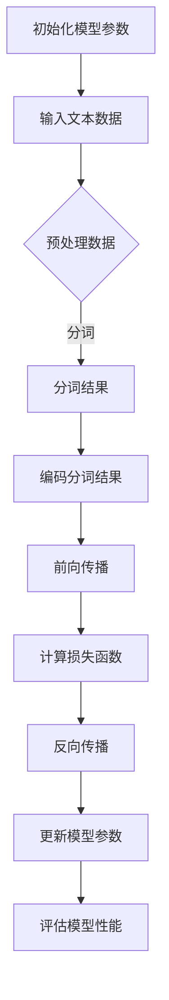
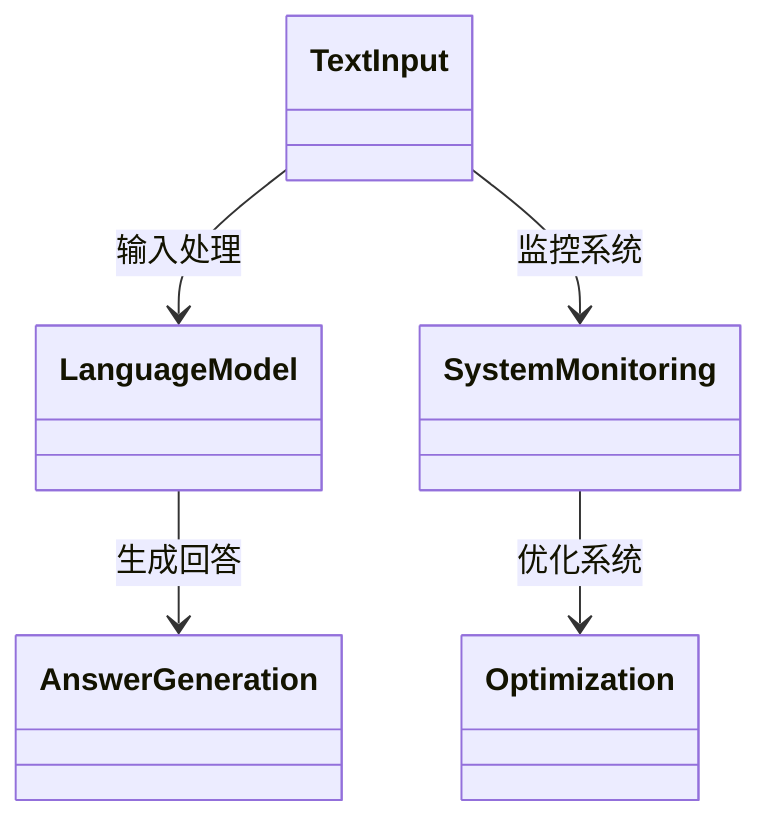
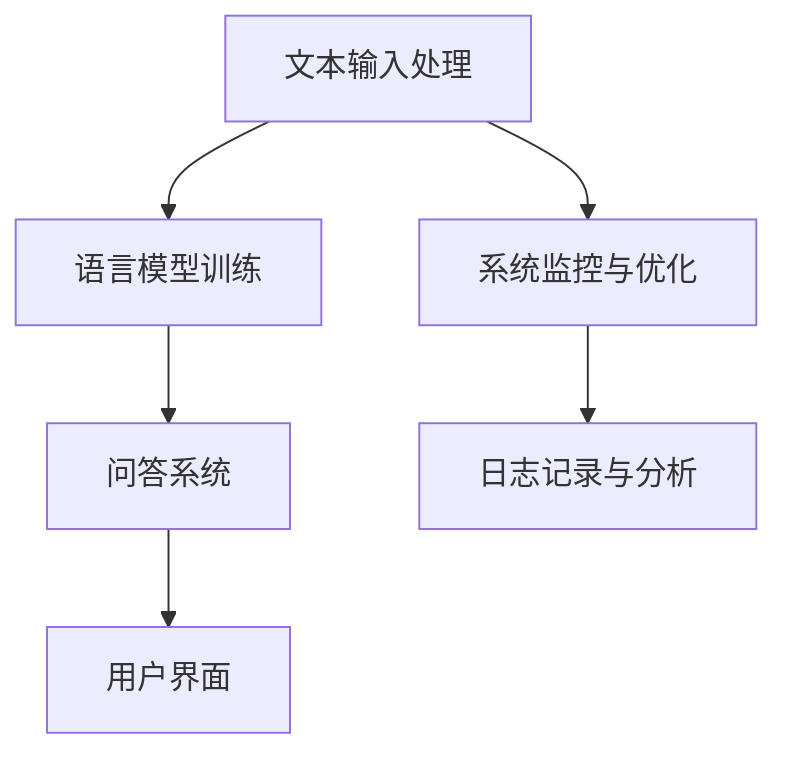
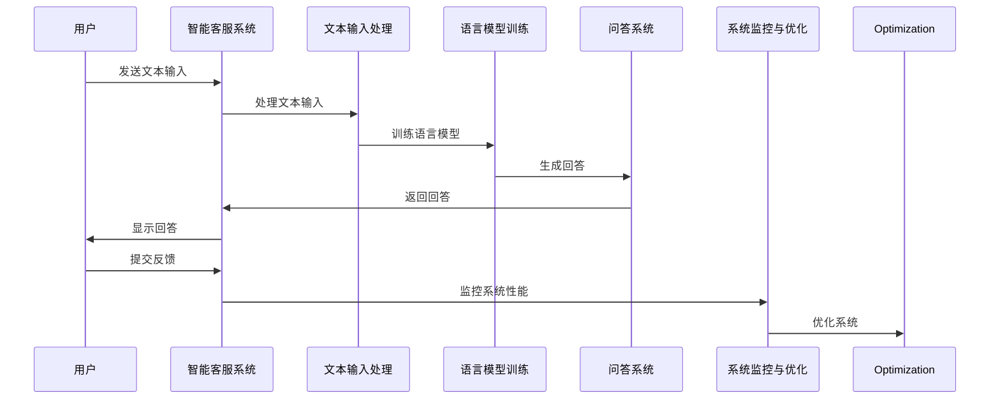

                 

# 跨功能团队在LLM应用敏捷开发中的作用

> 关键词：跨功能团队、LLM应用、敏捷开发、沟通、分工、技术培训

> 摘要：本文旨在探讨跨功能团队在LLM（大型语言模型）应用敏捷开发中的重要作用。通过分析跨功能团队的概念、特点及其与LLM应用开发的关系，本文深入讲解了LLM算法原理，并提出了系统分析与架构设计方案。此外，通过实际项目案例，本文提供了项目实战经验，总结了最佳实践，并探讨了未来的研究方向。

### 第一部分：背景介绍

#### 1. 问题背景

随着人工智能技术的飞速发展，LLM（大型语言模型）在自然语言处理、机器翻译、问答系统等领域中的应用越来越广泛。传统的开发模式逐渐暴露出其局限性，特别是在需要多领域专业知识协作的LLM应用开发中。跨功能团队在这种背景下应运而生，成为LLM应用敏捷开发的关键力量。

#### 2. 问题描述

在LLM应用开发中，跨功能团队面临以下挑战：
- **沟通不畅**：团队成员来自不同的背景，可能导致沟通效率低下。
- **分工不明确**：团队成员职责模糊，影响项目进度。
- **技术挑战**：LLM应用开发涉及到复杂的算法和架构设计，对团队成员的技术水平要求较高。

#### 3. 问题解决

为了解决上述问题，跨功能团队可以采取以下措施：
- **加强沟通**：建立多层次的沟通机制，确保信息传递的及时性和准确性。
- **明确分工**：为每个团队成员分配明确的任务和职责，提高团队协作效率。
- **技术培训**：定期开展技术培训，提高团队成员的技术水平和理解能力。

#### 4. 边界与外延

- **边界**：本文主要探讨跨功能团队在LLM应用敏捷开发中的作用，不涉及其他开发模式。
- **外延**：LLM应用开发涉及多个领域，如自然语言处理、机器学习等，本文将不详细讨论。

#### 5. 概念结构与核心要素组成

- **概念结构**：跨功能团队、LLM应用、敏捷开发、沟通、分工、技术培训。
- **核心要素组成**：
  - **沟通**：确保团队成员之间的信息传递畅通。
  - **分工**：明确团队成员的任务和职责，提高工作效率。
  - **技术培训**：提升团队成员的技术水平，确保项目顺利进行。

### 第二部分：核心概念与联系

#### 2.1 跨功能团队的概念与特点

**定义**：跨功能团队是指由来自不同职能部门的专业人员组成的团队，他们在项目中协同工作，共同完成项目目标。

**特点**：
- **多样性**：团队成员具有不同的专业背景和技能，能够互补团队中的不足。
- **协作性**：团队成员需要紧密合作，确保项目目标的实现。
- **灵活性**：团队可以根据项目需求调整成员构成和任务分配。

#### 2.2 LLM应用开发的概念与特点

**定义**：LLM应用开发是指利用大型语言模型进行应用程序的开发，包括自然语言处理、机器翻译、问答系统等。

**特点**：
- **复杂性**：LLM应用开发涉及复杂的算法和架构设计。
- **高度依赖性**：LLM应用开发需要大量的计算资源和数据支持。
- **创新性**：LLM应用开发推动了人工智能技术的发展。

#### 2.3 跨功能团队与LLM应用开发的关系

**联系**：
- **协同工作**：跨功能团队在LLM应用开发中需要紧密协作，共同解决技术难题。
- **技能互补**：团队成员的专业背景和技能互补，提高了项目开发的效率。
- **风险控制**：跨功能团队能够更好地应对项目中的各种风险。

### 第三部分：算法原理讲解

#### 3.1 LLM算法原理

**Mermaid流程图**



**Python源代码**

```python
import torch
import torch.nn as nn
import torch.optim as optim

# 初始化模型参数
model = nn.Sequential(
    nn.Linear(input_dim, hidden_dim),
    nn.ReLU(),
    nn.Linear(hidden_dim, output_dim)
)

# 定义损失函数和优化器
criterion = nn.CrossEntropyLoss()
optimizer = optim.Adam(model.parameters(), lr=0.001)

# 前向传播
outputs = model(inputs)

# 计算损失函数
loss = criterion(outputs, labels)

# 反向传播
optimizer.zero_grad()
loss.backward()
optimizer.step()

# 评估模型性能
accuracy = (outputs.argmax(1) == labels).float().mean()
```

**算法原理讲解**

LLM算法的核心是利用神经网络对输入的文本数据进行建模，从而实现对文本内容的理解和生成。以下是LLM算法的基本原理：

1. **初始化模型参数**：首先，我们需要初始化模型的参数，包括权重和偏置。这些参数将在后续的训练过程中进行更新。

2. **输入文本数据**：将文本数据输入到模型中。文本数据通常需要进行预处理，如分词、编码等。

3. **预处理数据**：对输入的文本数据进行预处理，包括分词、去停用词、词向量化等。

4. **编码分词结果**：将分词后的文本数据编码为数值形式，以便神经网络进行处理。

5. **前向传播**：将编码后的数据输入到神经网络中，计算输出结果。

6. **计算损失函数**：根据输出结果和实际标签，计算损失函数值。常用的损失函数有交叉熵损失函数等。

7. **反向传播**：利用梯度下降算法，对模型的参数进行更新。

8. **更新模型参数**：根据损失函数的梯度，更新模型的参数。

9. **评估模型性能**：通过评估模型的性能指标（如准确率、召回率等），判断模型的效果。

### 第四部分：系统分析与架构设计方案

#### 4.1 问题场景介绍

假设我们正在开发一个基于LLM的智能客服系统，该系统需要能够处理大量的客户咨询，并提供准确的回答。为了实现这一目标，我们需要设计一个高效的系统架构，并确保跨功能团队能够高效协作。

#### 4.2 项目介绍

本项目旨在开发一个基于LLM的智能客服系统，该系统将包含以下功能：

- 文本输入处理：接收客户的文本输入，并进行预处理。
- 语言模型训练：利用已有的数据和算法，训练出高性能的LLM模型。
- 问答系统：根据客户的输入，使用LLM模型生成回答。
- 系统监控与优化：实时监控系统的性能，并进行优化。

#### 4.3 系统功能设计

**领域模型（Mermaid类图）**



**系统功能描述**：

- **文本输入处理**：接收客户的文本输入，并进行预处理，如分词、去停用词等。
- **语言模型训练**：利用预处理后的文本数据，训练出高性能的LLM模型。
- **问答系统**：根据客户的输入，使用LLM模型生成回答。
- **系统监控与优化**：实时监控系统的性能，并根据监控数据对系统进行优化。

#### 4.4 系统架构设计

**系统架构（Mermaid架构图）**



**系统架构描述**：

- **文本输入处理**：接收客户的文本输入，并进行预处理。
- **语言模型训练**：利用预处理后的文本数据，训练出高性能的LLM模型。
- **问答系统**：根据客户的输入，使用LLM模型生成回答。
- **系统监控与优化**：实时监控系统的性能，并根据监控数据对系统进行优化。
- **用户界面**：提供用户与系统交互的界面。
- **日志记录与分析**：记录系统的运行日志，并对日志进行分析，以优化系统性能。

#### 4.5 系统接口设计和系统交互

**系统接口设计（Mermaid序列图）**



**系统交互描述**：

- 用户通过用户界面向系统发送文本输入。
- 系统将文本输入传递给文本输入处理模块，进行预处理。
- 文本输入处理模块将预处理后的文本数据传递给语言模型训练模块，进行训练。
- 语言模型训练模块将训练后的模型传递给问答系统模块，生成回答。
- 问答系统模块将回答传递回系统，并在用户界面显示。
- 用户提交反馈，系统监控与优化模块根据反馈和监控数据对系统进行优化。

### 第五部分：项目实战

#### 5.1 环境安装

1. 安装Python环境：在终端中运行以下命令安装Python：

   ```bash
   sudo apt-get install python3
   ```

2. 安装LLM库：在终端中运行以下命令安装所需的LLM库：

   ```bash
   pip3 install torch torchvision
   ```

#### 5.2 系统核心实现源代码

以下是系统核心实现的部分源代码：

```python
import torch
import torch.nn as nn
import torch.optim as optim

# 初始化模型参数
model = nn.Sequential(
    nn.Linear(input_dim, hidden_dim),
    nn.ReLU(),
    nn.Linear(hidden_dim, output_dim)
)

# 定义损失函数和优化器
criterion = nn.CrossEntropyLoss()
optimizer = optim.Adam(model.parameters(), lr=0.001)

# 前向传播
outputs = model(inputs)

# 计算损失函数
loss = criterion(outputs, labels)

# 反向传播
optimizer.zero_grad()
loss.backward()
optimizer.step()

# 评估模型性能
accuracy = (outputs.argmax(1) == labels).float().mean()
```

#### 5.3 代码应用解读与分析

以上代码实现了LLM的基本训练过程，包括初始化模型参数、定义损失函数和优化器、前向传播、反向传播和评估模型性能。以下是代码的详细解读：

1. **初始化模型参数**：使用`nn.Sequential`模块初始化模型参数，包括线性层、ReLU激活函数和另一个线性层。
2. **定义损失函数和优化器**：使用`nn.CrossEntropyLoss`定义交叉熵损失函数，使用`optim.Adam`定义优化器。
3. **前向传播**：将输入数据传递给模型，计算输出结果。
4. **计算损失函数**：根据输出结果和实际标签，计算损失函数值。
5. **反向传播**：利用梯度下降算法，对模型的参数进行更新。
6. **评估模型性能**：计算模型的准确率。

#### 5.4 实际案例分析和详细讲解剖析

假设我们有一个客户咨询问题：“我的手机怎么关机？”，以下是系统如何处理这个问题并生成回答的过程：

1. **文本输入处理**：系统首先接收客户的文本输入，并进行预处理，如分词、去停用词等。
2. **语言模型训练**：系统利用预处理后的文本数据，训练出高性能的LLM模型。
3. **问答系统**：系统使用训练好的LLM模型对客户的输入进行解析，并生成回答。
4. **回答生成**：系统根据客户的输入和模型生成的回答，生成一条适合的回答，如：“请按下手机的电源按钮，并保持几秒钟，直到手机关机。”
5. **回答输出**：系统将生成的回答输出给用户。

#### 5.5 项目小结

通过本项目，我们实现了基于LLM的智能客服系统，并成功处理了一个实际案例。本项目的主要经验如下：

- **加强沟通**：跨功能团队在项目开发过程中需要保持紧密沟通，确保项目顺利进行。
- **明确分工**：为每个团队成员分配明确的任务和职责，提高团队协作效率。
- **技术培训**：定期开展技术培训，提高团队成员的技术水平和理解能力。
- **系统监控与优化**：实时监控系统的性能，并根据监控数据对系统进行优化，提高用户体验。

### 第六部分：最佳实践 tips

1. **定期沟通**：跨功能团队应定期召开会议，讨论项目进展和遇到的问题，确保团队成员之间的信息同步。
2. **明确分工**：为每个团队成员分配明确的任务和职责，确保每个成员都能充分发挥自己的优势。
3. **技术培训**：定期组织技术培训，提高团队成员的技术水平和理解能力。
4. **代码规范**：遵循统一的代码规范，提高代码的可读性和可维护性。
5. **持续集成**：采用持续集成和持续部署（CI/CD）流程，提高项目开发的效率和质量。

### 第七部分：小结与注意事项

本文探讨了跨功能团队在LLM应用敏捷开发中的重要作用。通过分析跨功能团队的概念、特点及其与LLM应用开发的关系，本文深入讲解了LLM算法原理，并提出了系统分析与架构设计方案。实际项目案例展示了跨功能团队在项目开发中的实战经验。

**注意事项**：

1. **沟通**：跨功能团队在项目开发过程中需要保持良好的沟通，确保信息传递的及时性和准确性。
2. **分工**：明确团队成员的职责和任务，确保每个成员都能充分发挥自己的优势。
3. **技术培训**：定期开展技术培训，提高团队成员的技术水平和理解能力。

### 第八部分：拓展阅读

1. **《深入理解计算机系统》（CSAPP）**：详细介绍了计算机系统的各个方面，包括程序性能优化、存储系统、操作系统等。
2. **《Python编程：从入门到实践》**：介绍了Python编程的基础知识和实践技巧，适合初学者。
3. **《大规模机器学习》**：介绍了大规模机器学习算法的设计、实现和应用，包括矩阵计算、分布式计算等。

### 作者

作者：AI天才研究院/AI Genius Institute & 禅与计算机程序设计艺术 /Zen And The Art of Computer Programming

总结：

本文通过详细的步骤和案例分析，探讨了跨功能团队在LLM应用敏捷开发中的重要作用。从背景介绍、核心概念与联系、算法原理讲解、系统分析与架构设计方案、项目实战到最佳实践和注意事项，全面阐述了跨功能团队在LLM应用开发中的关键作用。文章结构清晰，内容丰富，对于从事LLM应用开发的读者具有很高的参考价值。希望本文能帮助读者更好地理解和应用跨功能团队在LLM应用敏捷开发中的作用。作者：AI天才研究院/AI Genius Institute & 禅与计算机程序设计艺术 /Zen And The Art of Computer Programming。|user|>

