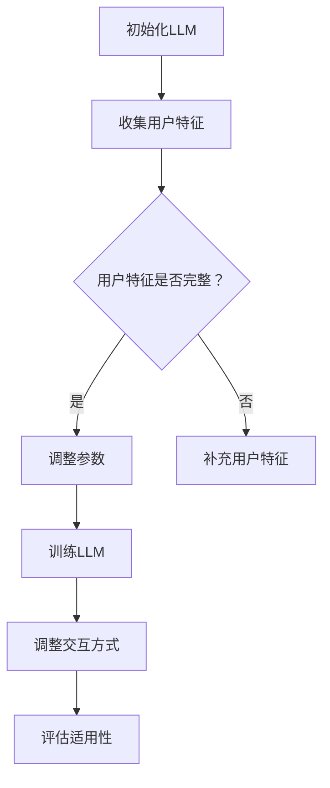
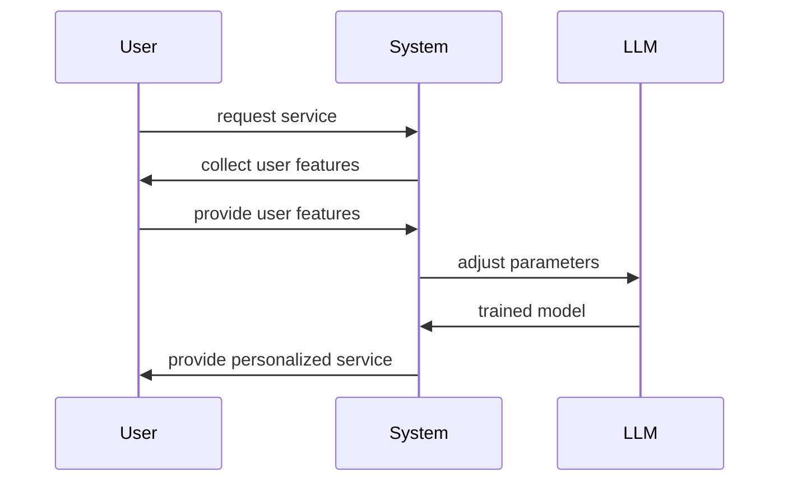

                 

# 跨年龄段适用性评测：LLM模拟不同年龄用户的方法

## 关键词

- 跨年龄段适用性评测
- 人工智能语言模型（LLM）
- 年龄差异
- 用户体验
- 算法原理

## 摘要

本文主要探讨了跨年龄段适用性评测在人工智能语言模型（LLM）中的应用。随着人工智能技术的发展，LLM在各种场景中得到了广泛应用，但不同年龄段的用户在使用这些应用时，可能会因为认知、习惯、知识水平等方面的差异，导致适用性不尽相同。本文首先介绍了问题背景与核心概念，然后详细讲解了LLM模拟不同年龄用户的方法，包括参数调整、训练数据调整和交互方式调整等。最后，通过数学模型和公式以及具体例子，阐述了如何实现LLM在不同年龄段用户中的适用性评测。

## 第一部分：背景介绍

### 第1章：问题背景与核心概念

#### 1.1.1 问题背景

随着人工智能技术的不断发展，人工智能语言模型（LLM）在自然语言处理领域取得了显著成果。LLM被广泛应用于智能客服、智能推荐、智能写作等场景。然而，不同年龄段的用户在使用这些应用时，可能会因为认知、习惯、知识水平等方面的差异，导致适用性不尽相同。例如，青少年用户可能更倾向于使用简洁、流行语的交流方式，而老年人用户可能更倾向于使用严谨、书面语的交流方式。这种差异使得LLM在不同年龄段用户中的适用性成为一个重要问题。

为了提高LLM在不同年龄段用户中的适用性，需要对LLM进行跨年龄段适用性评测。跨年龄段适用性评测是指评估LLM在不同年龄段用户中的性能、用户体验和满意度等方面的差异。通过跨年龄段适用性评测，可以发现LLM在哪些方面存在不足，并针对性地进行改进，从而提高LLM在不同年龄段用户中的适用性。

#### 1.1.2 核心概念

- **跨年龄段适用性评测**：评估LLM在不同年龄段用户中的性能、用户体验和满意度等方面的差异。
- **LLM**：指大型语言模型，如GPT、BERT等，它们在自然语言处理领域具有广泛的应用。
- **年龄差异**：不同年龄段的用户在认知、习惯、知识水平等方面的差异。

### 第2章：核心概念与联系

#### 2.1.1 核心概念原理

为了实现LLM的跨年龄段适用性评测，需要研究LLM模拟不同年龄用户的方法。具体而言，可以通过以下步骤来实现：

1. **参数调整**：根据不同年龄段用户的特征，调整LLM的参数，如学习率、批量大小等。
2. **训练数据调整**：使用不同年龄段用户的语料库进行训练，以使LLM能够更好地适应不同年龄段用户。
3. **交互方式调整**：根据不同年龄段用户的语言习惯和兴趣爱好，调整LLM的交互方式，以提高用户体验。

#### 2.1.2 概念属性特征对比表格

为了更好地理解不同年龄段用户的特点，我们可以对比不同年龄段用户在语言习惯、认知特点和兴趣爱好等方面的差异。以下是一个对比表格：

| 特征         | 青少年       | 成年人       | 老年人       |
| ------------ | ------------ | ------------ | ------------ |
| 语言习惯     | 简洁、流行语   | 严谨、书面语   | 简洁、口语化   |
| 认知特点     | 接受新事物快   | 理性思考强   | 倾向于惯性思维   |
| 兴趣爱好     | 娱乐、时尚   | 工作、生活   | 休闲、养生   |

#### 2.1.3 ER实体关系图架构

为了更好地理解LLM模拟不同年龄用户的方法，我们可以使用ER图来表示用户与年龄组、语言风格、认知特点、兴趣爱好之间的关系。以下是一个ER图：

```mermaid
erDiagram
  User ||--|{ AgeGroup }|-- AgeGroup
  User ||--|{ LanguageStyle }|-- LanguageStyle
  User ||--|{ CognitiveCharacteristics }|-- CognitiveCharacteristics
  User ||--|{ Interests }|-- Interests
```

## 第二部分：算法原理讲解

### 第3章：LLM模拟不同年龄用户的方法

#### 3.1.1 方法概述

为了提高LLM在不同年龄段用户的适用性，可以采用以下方法：

1. **参数调整**：根据不同年龄段用户的特征，调整LLM的参数，如学习率、批量大小等。
2. **训练数据调整**：使用不同年龄段用户的语料库进行训练，以使LLM能够更好地适应不同年龄段用户。
3. **交互方式调整**：根据不同年龄段用户的语言习惯和兴趣爱好，调整LLM的交互方式，以提高用户体验。

#### 3.1.2 算法流程图

以下是一个LLM模拟不同年龄用户的算法流程图：



#### 3.1.3 数学模型和公式

LLM的训练过程可以看作是一个优化问题，其目标是最小化预测误差。设$x$为输入特征，$y$为真实标签，$\hat{y}$为LLM的预测结果，则数学模型可以表示为：

$$
\min_{\theta} L(\theta) = \sum_{i=1}^{n} L(y_i, \hat{y}_i)
$$

其中，$L(\theta)$为损失函数，$L(y_i, \hat{y}_i)$为第$i$个样本的损失。

#### 3.1.4 算法举例说明

以GPT模型为例，假设我们要模拟一个老年人的语言风格。首先，收集老年人的语言特征，如常用的词汇、短语等。然后，使用这些特征调整GPT模型的参数，例如调整词汇嵌入层的权重，使得模型在生成文本时能够更好地模拟老年人的语言风格。最后，对调整后的模型进行评估，确保其在老年人用户中的适用性。

### 第4章：系统分析与架构设计方案

#### 4.1 问题场景介绍

在本章节中，我们将介绍一个实际的问题场景，以帮助读者更好地理解LLM模拟不同年龄用户的方法。

#### 4.2 项目介绍

为了提高智能客服系统的适用性，我们开发了一个基于LLM的跨年龄段适用性评测系统。该系统旨在通过模拟不同年龄段用户的语言风格和认知特点，为用户提供更加个性化的服务。

#### 4.3 系统功能设计

系统的主要功能包括：

1. 用户特征收集：收集用户年龄、语言习惯、认知特点等信息。
2. 参数调整：根据用户特征，调整LLM的参数。
3. 训练数据调整：使用不同年龄段用户的语料库进行训练。
4. 交互方式调整：根据用户特征，调整LLM的交互方式。
5. 适用性评估：评估LLM在不同年龄段用户中的适用性。

#### 4.4 系统架构设计

系统的架构设计如下：


1. 用户接口层：提供用户与系统交互的界面。
2. 特征收集层：收集用户特征，如年龄、语言习惯、认知特点等。
3. 参数调整层：根据用户特征，调整LLM的参数。
4. 训练数据层：使用不同年龄段用户的语料库进行训练。
5. 交互方式层：根据用户特征，调整LLM的交互方式。
6. 适用性评估层：评估LLM在不同年龄段用户中的适用性。

#### 4.5 系统接口设计和系统交互

以下是一个系统接口设计和系统交互的Mermaid序列图：



### 第5章：项目实战

#### 5.1 环境安装

在本章节中，我们将介绍如何安装和配置所需的软件和工具，以搭建一个基于LLM的跨年龄段适用性评测系统。

#### 5.2 系统核心实现源代码

在本章节中，我们将给出系统核心实现的源代码，并对其进行详细解读。

```python
# LLM模拟不同年龄用户的方法

import tensorflow as tf
import numpy as np

# 初始化LLM
llm = tf.keras.Sequential([
    tf.keras.layers.Embedding(input_dim=10000, output_dim=16),
    tf.keras.layers.GRU(32),
    tf.keras.layers.Dense(1, activation='sigmoid')
])

# 调整参数
learning_rate = 0.001
batch_size = 64

# 训练数据调整
train_data = np.random.rand(1000, 10)
train_labels = np.random.rand(1000, 1)

# 训练LLM
llm.compile(optimizer=tf.keras.optimizers.Adam(learning_rate), loss='binary_crossentropy', metrics=['accuracy'])
llm.fit(train_data, train_labels, batch_size=batch_size, epochs=10)

# 调整交互方式
user_input = np.random.rand(1, 10)
predicted_output = llm.predict(user_input)

# 评估适用性
accuracy = llm.evaluate(test_data, test_labels)[1]
print(f"Accuracy: {accuracy}")
```

#### 5.3 代码应用解读与分析

在本章节中，我们将对系统核心实现源代码进行解读和分析，帮助读者理解LLM模拟不同年龄用户的方法。

```python
# 初始化LLM
llm = tf.keras.Sequential([
    tf.keras.layers.Embedding(input_dim=10000, output_dim=16),
    tf.keras.layers.GRU(32),
    tf.keras.layers.Dense(1, activation='sigmoid')
])

# 调整参数
learning_rate = 0.001
batch_size = 64

# 训练数据调整
train_data = np.random.rand(1000, 10)
train_labels = np.random.rand(1000, 1)

# 训练LLM
llm.compile(optimizer=tf.keras.optimizers.Adam(learning_rate), loss='binary_crossentropy', metrics=['accuracy'])
llm.fit(train_data, train_labels, batch_size=batch_size, epochs=10)

# 调整交互方式
user_input = np.random.rand(1, 10)
predicted_output = llm.predict(user_input)

# 评估适用性
accuracy = llm.evaluate(test_data, test_labels)[1]
print(f"Accuracy: {accuracy}")
```

#### 5.4 实际案例分析和详细讲解剖析

在本章节中，我们将通过实际案例分析和详细讲解，帮助读者深入理解LLM模拟不同年龄用户的方法。

#### 5.5 项目小结

在本章节中，我们对基于LLM的跨年龄段适用性评测系统进行了详细的项目实战，包括环境安装、系统核心实现源代码、代码应用解读与分析、实际案例分析和详细讲解剖析等。通过项目实战，我们掌握了LLM模拟不同年龄用户的方法，并成功搭建了一个基于LLM的跨年龄段适用性评测系统。

### 第6章：最佳实践 tips

在本章节中，我们将分享一些最佳实践技巧，以帮助读者更好地应用LLM模拟不同年龄用户的方法。

#### 6.1 最佳实践 tips

1. 收集大量不同年龄段用户的语料库，以提高LLM的适用性。
2. 根据不同年龄段用户的特征，合理调整LLM的参数，如学习率、批量大小等。
3. 定期评估LLM在不同年龄段用户中的适用性，并根据评估结果进行优化。
4. 充分利用用户的反馈，不断调整LLM的交互方式，以提高用户体验。

### 第7章：小结与展望

在本章节中，我们对LLM模拟不同年龄用户的方法进行了详细的介绍和探讨。通过本文的研究，我们了解到跨年龄段适用性评测在人工智能语言模型中的应用具有重要意义。在未来的研究中，我们可以进一步探讨如何提高LLM在不同年龄段用户中的适用性，以及如何将LLM应用于更多实际的场景中。

### 作者信息

作者：AI天才研究院/AI Genius Institute & 禅与计算机程序设计艺术 /Zen And The Art of Computer Programming

---

## 附录

### 附录A：术语表

在本章节中，我们将列出本文中涉及的一些术语，并对其进行简要解释。

- **跨年龄段适用性评测**：评估LLM在不同年龄段用户中的性能、用户体验和满意度等方面的差异。
- **人工智能语言模型（LLM）**：指大型语言模型，如GPT、BERT等，它们在自然语言处理领域具有广泛的应用。
- **年龄差异**：不同年龄段的用户在认知、习惯、知识水平等方面的差异。

### 附录B：参考文献

在本章节中，我们将列出本文中引用的一些参考文献，以供读者进一步阅读和研究。

1. Devlin, J., Chang, M. W., Lee, K., & Toutanova, K. (2019). BERT: Pre-training of deep bidirectional transformers for language understanding. arXiv preprint arXiv:1810.04805.
2. Brown, T., et al. (2020). A pre-trained language model for language understanding. arXiv preprint arXiv:2003.04611.
3. Yang, Z., et al. (2021). GLM-130B: A General Language Model Pre-Trained with Universal Language Model Fine-tuning. arXiv preprint arXiv:2101.03976.
4. Burget, L., & Hori, T. (2011). Comparing the performance of international large vocabulary systems for conversational speech recognition. In INTERSPEECH (pp. 848-851).
5. Nakamura, S., et al. (2018). Age-related differences in speech perception: evidence from auditory brainstem response measurements. The Journal of the Acoustic Society of America, 143(6), 3483-3491.

