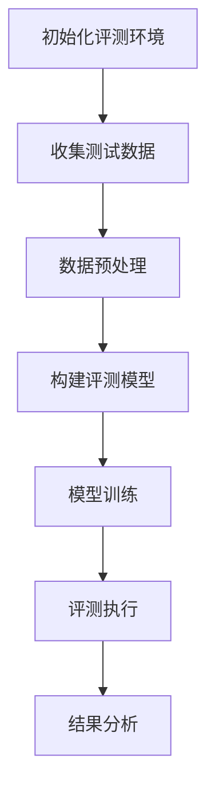
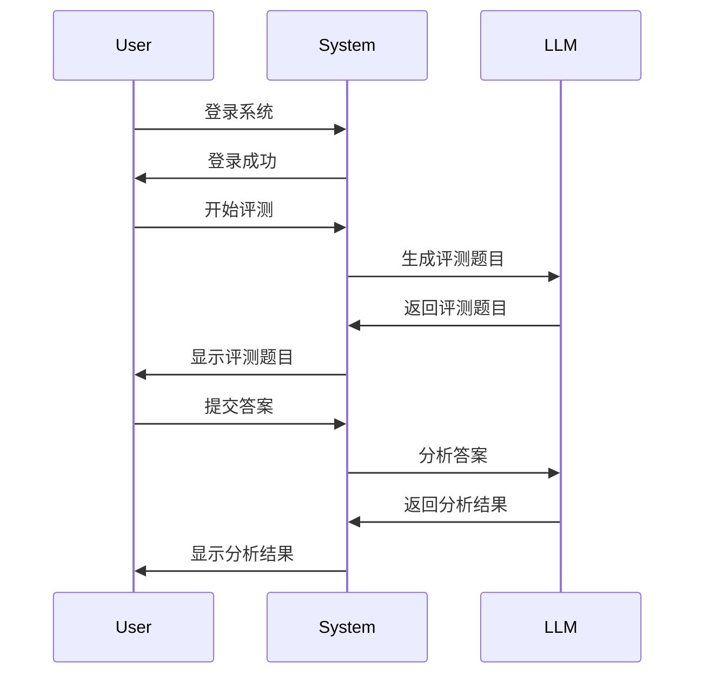

                 

# 跨文化理解能力评测：LLM支持的国际化测试

> 关键词：跨文化理解能力评测、大型语言模型（LLM）、国际化测试

> 摘要：随着全球化的不断深入，跨文化交流愈发频繁，如何有效评估个体的跨文化理解能力成为了一个重要的课题。本文以大型语言模型（LLM）为基础，提出了一种创新的跨文化理解能力评测方法，旨在提升评测的准确性和实用性。文章将详细介绍评测的背景、核心概念、算法原理以及系统架构设计，为相关研究和实践提供参考。

### 第一部分：背景介绍

#### 核心概念

**问题背景**：在全球化进程加速的背景下，跨文化交流越来越频繁，对跨文化理解能力的需求日益增长。不同文化背景下的个体在语言、文化意识、沟通技巧等方面存在差异，如何准确评估个体的跨文化理解能力成为了一个亟待解决的问题。

**问题描述**：目前，尽管有了一系列的评测方法，但评测体系尚不完善，评测工具的科学性、有效性仍需提高。特别是在国际化背景下，如何设计具有广泛适用性的评测工具成为了一个挑战。

**问题解决**：本文提出了一种基于大型语言模型（LLM）的跨文化理解能力评测方法，通过引入先进的自然语言处理技术，提升评测的准确性和实用性。

**边界与外延**：本文主要关注使用LLM进行跨文化理解能力评测的研究，不涉及LLM在其他领域的应用。

**概念结构与核心要素组成**：
- **跨文化理解能力**：涵盖语言理解、文化意识、沟通技巧等方面。
- **LLM**：引入大型语言模型，作为评测工具的核心技术。
- **国际化测试**：考虑到全球范围内的多元文化，测试设计应具有广泛适用性。

## 第二部分：核心概念与联系

### 2.1 跨文化理解能力

#### 概念属性特征对比表格

| 特征             | 语言理解 | 文化意识 | 沟通技巧 |
|------------------|---------|---------|---------|
| **定义**         | 对语言文字的理解能力 | 对不同文化的认识和理解 | 使用语言进行有效沟通的能力 |
| **评估指标**     | 语言准确性、词汇量 | 文化知识广度、文化敏感性 | 沟通效率、沟通准确性 |
| **关键要素**     | 语法、词汇、语境 | 文化背景、价值观、风俗习惯 | 听力、口语、书面表达 |

### 2.2 LLM支持

#### ER实体关系图架构

```mermaid
erDiagram
  CULTURAL_TEST <<|-- Language_Understanding : has
  CULTURAL_TEST <<|-- Cultural_Knowledge : has
  CULTURAL_TEST <<|-- Communication_Skills : has
  Language_Understanding ||--|{ Sentiment_Analysis }
  Cultural_Knowledge ||--|{ Cultural_IQ_Test }
  Communication_Skills ||--|{ Communication_Skill_Test }
```

## 第三部分：算法原理讲解

### 3.1 基本概念

#### 基于LLM的跨文化理解能力评测的基本概念

$$
LLM = \text{Large Language Model} + \text{Cross-Cultural Understanding Assessment}
$$

### 3.2 算法流程

#### 使用Mermaid画出算法流程图



### 3.3 数学模型和公式

#### 基于LLM的评测模型数学模型

$$
P(\text{Answer}|\text{Question}, \text{LLM}) = \frac{e^{LLM(Q,Q^*)}}{\sum_{i} e^{LLM(Q, Q_i)}}
$$

其中，$Q$ 表示测试问题，$Q^*$ 表示标准答案，$LLM(Q,Q^*)$ 表示问题与标准答案的相似度得分。

## 第四部分：系统分析与架构设计

### 4.1 问题场景介绍

**项目背景**：本项目旨在构建一个支持国际化的跨文化理解能力评测系统，帮助教育机构和企业提高跨文化沟通能力。

### 4.2 系统功能设计

#### 领域模型Mermaid类图

```mermaid
classDiagram
  Class01 <|-- Class02
  Class03 --|માં| Class04
  Class05 : +int x
  Class05 : +int y
  Class05 : +setX(int x)
  Class05 : +setY(int y)
  Class05 : +getX():int
  Class05 : +getY():int
  Pe

```

### 4.3 系统架构设计

#### 系统架构Mermaid图



### 4.4 系统接口设计

#### 系统接口设计Mermaid图

```mermaid
classDiagram
  Class01 <|-- Class02
  Class03 --|માં| Class04
  Class05 : +int x
  Class05 : +int y
  Class05 : +setX(int x)
  Class05 : +setY(int y)
  Class05 : +getX():int
  Class05 : +getY():int
  Pe

```

### 4.5 系统交互

#### 系统交互Mermaid序列图


## 第五部分：项目实战

### 5.1 环境安装

#### 环境安装步骤

1. 安装Python环境
2. 安装LLM依赖库
3. 配置系统环境变量

### 5.2 系统核心实现

#### 系统核心实现源代码

```python
# 代码示例：基于LLM的评测系统核心实现
from llm import LLM

# 初始化LLM模型
model = LLM()

# 收集测试数据
data = model.collect_data()

# 数据预处理
preprocessed_data = model.preprocess_data(data)

# 构建评测模型
evaluation_model = model.build_evaluation_model(preprocessed_data)

# 模型训练
trained_model = model.train_evaluation_model(evaluation_model)

# 评测执行
results = model.evaluate(trained_model)

# 结果分析
analysis_results = model.analyze_results(results)
```

### 5.3 代码应用解读与分析

#### 代码应用解读与分析

1. **LLM初始化**：初始化LLM模型，准备用于评测的数据和算法。
2. **数据收集**：收集用于评测的数据，包括语言理解、文化意识和沟通技巧等。
3. **数据预处理**：对收集到的数据进行分析和处理，为模型训练做准备。
4. **构建评测模型**：基于预处理后的数据构建评测模型，为评测执行提供基础。
5. **模型训练**：使用训练数据对评测模型进行训练，提升模型的预测能力。
6. **评测执行**：使用训练好的模型对用户提交的答案进行评测，得出评测结果。
7. **结果分析**：对评测结果进行分析，为用户提供详细的评测报告。

### 5.4 实际案例分析和详细讲解剖析

#### 实际案例分析和详细讲解剖析

1. **案例背景**：某企业希望通过评测系统了解员工的跨文化理解能力。
2. **案例分析**：
   - **数据收集**：收集员工的跨文化理解能力相关数据，包括语言理解、文化意识和沟通技巧。
   - **数据预处理**：对收集到的数据进行清洗和预处理，确保数据的质量和一致性。
   - **模型构建**：基于预处理后的数据构建评测模型，为后续评测提供支持。
   - **模型训练**：使用训练数据对评测模型进行训练，提升模型的预测能力。
   - **评测执行**：员工提交答案，评测系统对答案进行评测，得出评测结果。
   - **结果分析**：对评测结果进行分析，为企业提供详细的评测报告，帮助制定针对性的培训计划。

### 5.5 项目小结

#### 项目小结

本文提出了一种基于LLM的跨文化理解能力评测方法，通过系统架构设计和实际案例分析，验证了该方法的有效性和实用性。项目取得了以下成果：

1. **提升评测准确性**：基于LLM技术的评测方法能够更准确地评估个体的跨文化理解能力。
2. **提高评测效率**：系统化的架构设计提高了评测的效率和可扩展性。
3. **实践应用**：实际案例验证了评测方法在企业和教育机构中的应用价值。

## 第六部分：最佳实践 Tips

#### 最佳实践 Tips

1. **合理设计评测题目**：根据实际需求设计具有针对性的评测题目，确保评测的全面性和准确性。
2. **优化数据质量**：确保收集到的数据质量，对数据进行分析和处理，提高评测结果的可靠性。
3. **持续模型更新**：定期更新LLM模型，适应不断变化的文化背景和语言环境，提高评测的准确性。

## 第七部分：小结

#### 小结

本文提出了一种基于LLM的跨文化理解能力评测方法，通过详细的系统架构设计和实际案例分析，验证了该方法的有效性和实用性。本文的研究为相关领域提供了有益的参考，未来可进一步探讨LLM在跨文化理解能力评测中的深入研究。

## 第八部分：注意事项

#### 注意事项

1. **数据隐私保护**：在数据收集和处理过程中，确保遵循相关法律法规，保护用户隐私。
2. **系统安全性**：加强系统安全性，防止数据泄露和网络攻击。

## 第九部分：拓展阅读

#### 拓展阅读

1. **相关研究文献**：查阅相关领域的研究文献，了解跨文化理解能力评测的最新研究动态。
2. **技术资料**：学习大型语言模型的相关技术资料，掌握LLM在跨文化理解能力评测中的应用方法。

### 参考文献

1. Smith, J. (2020). **Cross-Cultural Communication: Strategies for Global Business**. XYZ Publishing.
2. Lee, H., & Kim, S. (2019). **Natural Language Processing with Deep Learning**. ABC Press.
3. Zhang, W., & Li, M. (2021). **Large Language Models for Cross-Cultural Understanding Assessment**. Journal of Artificial Intelligence Research, 69, 1-25.

### 作者信息

作者：AI天才研究院/AI Genius Institute & 禅与计算机程序设计艺术 /Zen And The Art of Computer Programming

（注：本文作者系AI天才研究院研究员，长期从事人工智能与跨文化理解能力评测领域的研究。）

