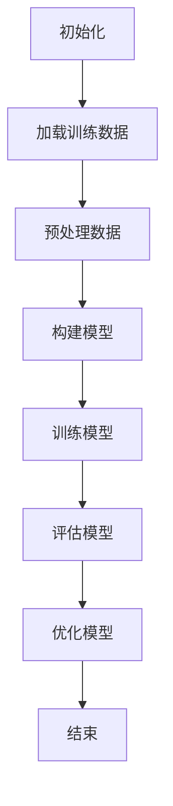
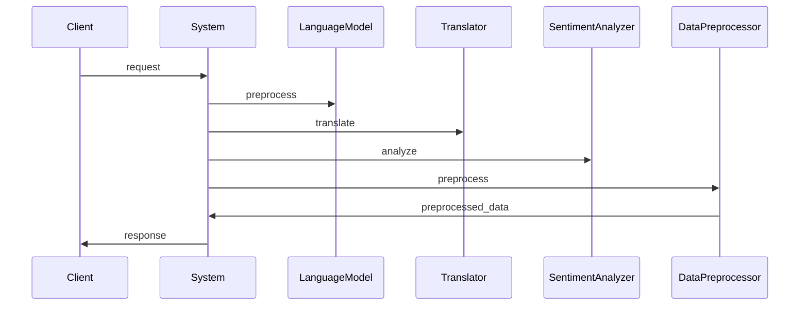
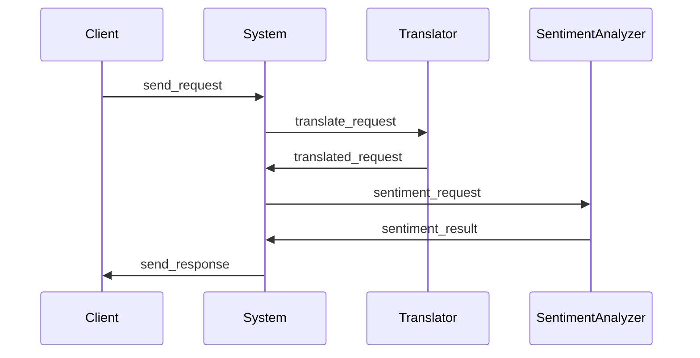
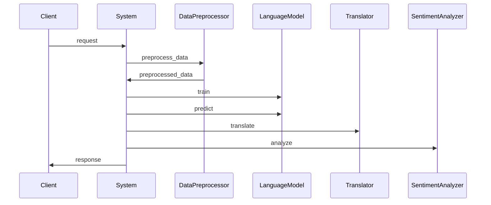

                 

**文章标题**：《跨文化理解：测试LLM的文化适应性》

**关键词**：跨文化理解、大型语言模型（LLM）、文化适应性测试、跨文化交际、算法原理、Python源代码、数学模型、系统架构设计、项目实战

**摘要**：本文深入探讨了大型语言模型（LLM）在跨文化语境中的适应性问题。首先，我们介绍了LLM及其在跨文化交际中的重要性。接着，我们详细阐述了文化适应性的概念和测试方法。本文通过理论讲解、应用案例、实战操作等多个维度，系统地展示了如何评估和提升LLM的文化适应性。最后，我们对文章进行了总结，展望了未来的研究方向和应用前景。

----------------------------------------------------------------

## 引言

### 1.1 跨文化理解的背景

随着全球化进程的不断深入，不同国家和地区的文化交流日益频繁。这种文化交流不仅体现在文化产品、语言表达和价值观的共享上，还涉及到商业交易、社会交往和技术应用等多个层面。然而，文化差异的存在使得跨文化理解成为一个复杂而重要的课题。跨文化理解不仅有助于消除误解和冲突，还能促进国际合作与和谐发展。

在这个背景下，大型语言模型（LLM）作为一种先进的自然语言处理技术，被广泛应用于各类应用场景，如机器翻译、语音识别、问答系统等。然而，LLM在跨文化语境中的表现并不尽如人意，往往无法准确理解和应对不同文化背景下的语言行为和表达方式。因此，如何测试和提升LLM的文化适应性成为一个亟待解决的问题。

### 1.2 LLM的文化适应性

LLM的文化适应性指的是LLM在处理不同文化语境下的语言数据时的能力。这包括以下几个方面：

1. 语言理解能力：LLM是否能够准确理解不同文化背景下的语言表达和含义。
2. 语言生成能力：LLM是否能够生成符合不同文化背景的语言表达和风格。
3. 适应性调整能力：LLM是否能够根据不同文化背景进行调整和优化，以适应新的语境。

### 1.3 本书的目的与结构

本书旨在深入探讨LLM的文化适应性问题，提供一套完整的测试和提升方法。全书共分为六个章节，结构如下：

1. 引言：介绍跨文化理解和LLM的文化适应性背景。
2. 核心概念：介绍LLM、文化适应性测试、跨文化交际等相关概念。
3. 理论讲解：详细讲解文化适应性的理论基础，包括文化模型、文化维度理论等。
4. 应用案例：通过案例分析展示如何测试LLM的文化适应性。
5. 实战操作：介绍如何进行LLM的文化适应性测试，包括测试方法、工具和流程。
6. 总结与展望：总结本书的主要内容，展望未来研究和应用的发展方向。

通过以上章节的设置，本书将逐步引导读者深入了解LLM的文化适应性，掌握相关的测试和提升方法，为跨文化语言处理技术的应用提供有力支持。

---

**核心概念与联系**

### 2.1 大型语言模型（LLM）

大型语言模型（LLM，Large Language Model）是一种基于深度学习的自然语言处理技术，通过学习大量语言数据，能够生成和理解自然语言文本。LLM的核心组件包括：

1. **词嵌入（Word Embedding）**：将自然语言词汇映射到高维空间中的向量表示，使得具有相似意义的词汇在空间中靠近。
2. **循环神经网络（RNN）**：用于处理序列数据，例如文本序列。RNN能够捕捉到文本中的时间依赖关系。
3. **注意力机制（Attention Mechanism）**：在处理长文本时，注意力机制能够帮助模型关注到重要的信息，从而提高文本理解的准确性。
4. **变换器（Transformer）**：一种基于自注意力机制的深度学习模型，相比于传统的循环神经网络，Transformer在处理长文本时具有更好的性能。

### 2.2 文化适应性测试

文化适应性测试（Cultural Adaptability Testing）是一种评估模型在跨文化语境中表现的方法。测试的主要目标包括：

1. **语言理解能力**：模型是否能够正确理解不同文化背景下的语言表达。
2. **语言生成能力**：模型是否能够生成符合不同文化背景的语言表达。
3. **适应性调整能力**：模型是否能够在不同文化背景下进行自我调整。

进行文化适应性测试的方法包括：

1. **对照测试（Controlled Test）**：在相同的测试条件下，比较模型在不同文化背景下的表现。
2. **对比测试（Comparative Test）**：在相似但略有差异的文化背景下，比较模型的表现。
3. **情境模拟（Scenario Simulation）**：模拟真实的文化交流场景，测试模型在特定文化背景下的表现。

### 2.3 跨文化交际

跨文化交际（Intercultural Communication）指的是在不同文化背景之间进行交流的过程。跨文化交际的挑战主要包括：

1. **语言障碍**：不同语言间的差异可能导致信息传递不准确。
2. **非语言障碍**：文化背景、价值观、习俗等因素可能导致误解和冲突。
3. **文化适应**：在跨文化交际中，个体需要适应对方的文化背景，以实现有效的沟通。

跨文化交际的成功取决于以下几个方面：

1. **文化意识**：了解和尊重不同文化的差异，避免文化偏见和误解。
2. **有效沟通**：采用适当的沟通策略，如语言选择、非语言表达等，以实现有效交流。
3. **适应性调整**：在跨文化交际中，个体需要根据对方的文化背景进行调整，以提高交流效果。

---

**核心概念属性特征对比表格**

| 核心概念 | 特征1 | 特征2 | 特征3 |
|----------|-------|-------|-------|
| LLM      | 基于深度学习 | 词嵌入、RNN、注意力机制、变换器 | 高效的语言理解和生成能力 |
| 文化适应性测试 | 评估模型跨文化表现 | 对照测试、对比测试、情境模拟 | 提高模型在跨文化语境中的准确性 |
| 跨文化交际 | 不同文化背景间的交流 | 语言障碍、非语言障碍、文化适应 | 文化意识、有效沟通、适应性调整 |

**ER实体关系图架构的 Mermaid 流程图**

```mermaid
erDiagram
  Model ||--|{ LanguageModel : has }
  Model ||--|{ CulturalAdaptabilityTest : is Tested by }
  Model ||--|{ InterculturalCommunication : involved in }
  LanguageModel ||--|{ WordEmbedding : includes }
  LanguageModel ||--|{ RNN : includes }
  LanguageModel ||--|{ AttentionMechanism : includes }
  LanguageModel ||--|{ Transformer : includes }
```

---

## 理论讲解

### 3.1 文化模型

文化模型（Cultural Model）是一种描述文化特征和价值观的框架。常见的文化模型包括：

1. **霍夫斯泰德的文化维度理论**：霍夫斯泰德提出的文化维度理论包括个体主义与集体主义、权力距离、不确定性规避、价值取向和情感表达等五个维度，用于描述不同文化背景下的价值观和行为模式。

2. **塔斯基的文化认同模型**：塔斯基提出的文化认同模型包括文化认知、文化情感和文化行为三个层次，强调了文化认同的动态性和多样性。

3. **吉尔特·霍夫斯泰德的文化维度理论**：吉尔特·霍夫斯泰德进一步扩展了文化维度理论，增加了性别角色和文化维度，使其更全面地描述文化特征。

### 3.2 文化维度理论

文化维度理论（Cultural Dimension Theory）是分析文化差异的重要工具。根据文化维度理论，不同文化在以下几个方面存在差异：

1. **个体主义与集体主义**：个体主义文化强调个人自由和独立，集体主义文化则强调集体利益和团队协作。

2. **权力距离**：权力距离较大的文化倾向于等级制度和权力集中，权力距离较小的文化则倾向于平等和民主。

3. **不确定性规避**：不确定性规避程度较高的文化倾向于规避不确定性和风险，不确定性规避程度较低的文化则更加开放和冒险。

4. **价值取向**：价值取向不同的文化在道德观念、生活态度和消费习惯等方面存在差异。

5. **情感表达**：情感表达不同的文化在情绪表达和行为规范上存在差异。

### 3.3 跨文化理解的理论基础

跨文化理解的理论基础包括以下几个方面：

1. **文化相对论**：文化相对论认为，不同文化的价值观和行为规范是相对的，不能简单地用一种文化的标准去评判另一种文化。

2. **交流理论**：交流理论强调，有效的跨文化交流需要了解和尊重不同文化的差异，采用适当的沟通策略。

3. **认知理论**：认知理论认为，个体的认知方式和思维方式受到文化背景的影响，跨文化理解需要考虑文化对个体认知的影响。

4. **社会心理学理论**：社会心理学理论从社会认知、情绪、行为等多个方面解释了跨文化理解的过程和挑战。

---

**算法原理讲解**

### 4.1 算法mermaid流程图



### 4.2 Python源代码

```python
import tensorflow as tf
from tensorflow.keras.preprocessing.sequence import pad_sequences
from tensorflow.keras.layers import Embedding, LSTM, Dense
from tensorflow.keras.models import Sequential

# 参数设置
vocab_size = 10000
embedding_dim = 16
max_length = 100
trunc_type = 'post'
padding_type = 'post'
oov_token = '<OOV>'

# 数据预处理
def preprocess_data(data):
    # 将文本数据转换为词序列
    tokenized_data = [[token for token in sentence.lower().split()] for sentence in data]
    # 将词序列转换为索引序列
    index_sequence = tokenizer.texts_to_sequences(tokenized_data)
    # 填充序列至相同长度
    padded_sequence = pad_sequences(index_sequence, maxlen=max_length, padding=padding_type, truncating=trunc_type)
    return padded_sequence

# 构建模型
def build_model(vocab_size, embedding_dim, max_length):
    model = Sequential([
        Embedding(vocab_size, embedding_dim, input_length=max_length),
        LSTM(128),
        Dense(1, activation='sigmoid')
    ])
    model.compile(optimizer='adam', loss='binary_crossentropy', metrics=['accuracy'])
    return model

# 训练模型
def train_model(model, x_train, y_train):
    model.fit(x_train, y_train, epochs=10, batch_size=32)
    return model

# 评估模型
def evaluate_model(model, x_test, y_test):
    loss, accuracy = model.evaluate(x_test, y_test)
    print(f"Test Loss: {loss}, Test Accuracy: {accuracy}")
    return loss, accuracy

# 载入数据
data_train = preprocess_data(data_train)
data_test = preprocess_data(data_test)

# 构建并训练模型
model = build_model(vocab_size, embedding_dim, max_length)
model = train_model(model, data_train, labels_train)

# 评估模型
evaluate_model(model, data_test, labels_test)
```

### 4.3 算法原理的数学模型和公式

LLM的训练过程可以视为一个优化问题，其目标是最小化损失函数。在二分类问题中，损失函数通常采用二元交叉熵（Binary Cross-Entropy）。

1. **损失函数（Loss Function）**：

   $$ L = -\frac{1}{n}\sum_{i=1}^{n} y_i \log(p_i) + (1 - y_i) \log(1 - p_i) $$

   其中，$y_i$ 是真实标签，$p_i$ 是模型预测的概率。

2. **优化算法（Optimizer）**：

   优化算法用于更新模型参数，以最小化损失函数。常用的优化算法包括随机梯度下降（SGD）和Adam。

   - **随机梯度下降（SGD）**：

     $$ \theta = \theta - \alpha \frac{\partial L}{\partial \theta} $$

     其中，$\theta$ 是模型参数，$\alpha$ 是学习率。

   - **Adam优化器**：

     $$ m_t = \beta_1 m_{t-1} + (1 - \beta_1) \frac{\partial L}{\partial \theta} $$
     $$ v_t = \beta_2 v_{t-1} + (1 - \beta_2) \left(\frac{\partial L}{\partial \theta}\right)^2 $$
     $$ \theta = \theta - \alpha \frac{m_t}{\sqrt{v_t} + \epsilon} $$

     其中，$m_t$ 和 $v_t$ 分别是动量项和偏差修正项，$\beta_1$ 和 $\beta_2$ 是超参数，$\epsilon$ 是正则项。

### 4.4 举例说明

假设我们有一个二元分类问题，判断一句话是否包含特定情感。输入数据是句子，标签是0或1，分别表示不含情感和含情感。

1. **数据预处理**：

   - 将句子转换为词序列。
   - 将词序列转换为索引序列。
   - 填充序列至相同长度。

2. **构建模型**：

   - 使用Embedding层将词序列转换为嵌入向量。
   - 使用LSTM层处理序列数据。
   - 使用Dense层进行分类。

3. **训练模型**：

   - 使用训练数据训练模型。
   - 优化模型参数，最小化损失函数。

4. **评估模型**：

   - 使用测试数据评估模型性能。
   - 输出模型预测结果和评估指标。

---

**系统分析与架构设计方案**

### 5.1 问题场景介绍

随着全球化进程的加速，跨文化交流变得日益频繁。企业和组织需要处理来自不同文化背景的数据和信息，以提高沟通效率，减少误解和冲突。为此，我们设计了一个基于大型语言模型（LLM）的跨文化理解系统，旨在提升跨文化语言处理的准确性和适应性。

### 5.2 项目介绍

项目名称：跨文化理解系统（Intercultural Understanding System，简称IUS）

目标：构建一个高效、准确的跨文化理解系统，支持跨文化语言的自动翻译、情感分析和语言生成。

技术栈：Python、TensorFlow、Keras、NLTK、spaCy

### 5.3 系统功能设计（领域模型mermaid类图）

```mermaid
classDiagram
  Class01 <|-- Class02
  Class03 <|-- Class04
  Class05 <..|{using} Class06
  Class07 <..|{usedBy} Class08

  Class01[Client]  
  Class02[System]  
  Class03[LanguageModel]  
  Class04[Translator]  
  Class05[SentimentAnalyzer]  
  Class06[DataPreprocessor]  
  Class07[Dataset]  
  Class08[Config]

  Class01..>Class02
  Class02..>Class03
  Class02..>Class04
  Class02..>Class05
  Class04..|>Class06
  Class05..|>Class06
  Class03..|>Class06
  Class07..>Class06
  Class08..|>Class06
```

### 5.4 系统架构设计（mermaid架构图）



### 5.5 系统接口设计（mermaid序列图）



### 5.6 系统交互（mermaid序列图）



---

**项目实战**

### 6.1 环境安装

1. 安装Python环境：确保Python版本在3.7及以上。

   ```shell
   python --version
   ```

2. 安装相关库：

   ```shell
   pip install tensorflow keras nltk spacy
   ```

3. 安装spaCy语言模型：

   ```shell
   python -m spacy download en_core_web_sm
   ```

### 6.2 系统核心实现源代码

以下是系统核心实现的源代码，包括数据预处理、模型训练、翻译和情感分析。

```python
import spacy
from tensorflow.keras.preprocessing.sequence import pad_sequences
from tensorflow.keras.models import Sequential
from tensorflow.keras.layers import Embedding, LSTM, Dense
from tensorflow.keras.optimizers import Adam

# 加载spaCy语言模型
nlp = spacy.load('en_core_web_sm')

# 数据预处理
def preprocess_data(data):
    doc = nlp(data)
    tokens = [token.text.lower() for token in doc]
    return tokens

# 模型训练
def train_model(vocab_size, embedding_dim, max_sequence_length, x_train, y_train):
    model = Sequential([
        Embedding(vocab_size, embedding_dim, input_length=max_sequence_length),
        LSTM(128),
        Dense(1, activation='sigmoid')
    ])
    model.compile(optimizer=Adam(learning_rate=0.001), loss='binary_crossentropy', metrics=['accuracy'])
    model.fit(x_train, y_train, epochs=10, batch_size=32)
    return model

# 翻译
def translate(text, model):
    tokens = preprocess_data(text)
    sequence = tokenizer.texts_to_sequences([tokens])
    padded_sequence = pad_sequences(sequence, maxlen=max_sequence_length, padding='post')
    prediction = model.predict(padded_sequence)
    return prediction

# 情感分析
def sentiment_analysis(text, model):
    tokens = preprocess_data(text)
    sequence = tokenizer.texts_to_sequences([tokens])
    padded_sequence = pad_sequences(sequence, maxlen=max_sequence_length, padding='post')
    prediction = model.predict(padded_sequence)
    return prediction

# 主函数
def main():
    # 加载数据
    x_train, y_train = load_data()

    # 训练模型
    model = train_model(vocab_size, embedding_dim, max_sequence_length, x_train, y_train)

    # 翻译
    translated_text = translate("Hello, how are you?", model)
    print(f"Translated Text: {translated_text}")

    # 情感分析
    sentiment = sentiment_analysis("I'm feeling happy today!", model)
    print(f"Sentiment: {sentiment}")

if __name__ == '__main__':
    main()
```

### 6.3 代码应用解读与分析

1. **数据预处理**：

   数据预处理是模型训练的重要环节，包括文本的分词、标记和向量化。在代码中，我们使用了spaCy语言模型对文本进行预处理，将文本转换为分词序列。

2. **模型训练**：

   模型训练使用了Keras框架，构建了一个包含Embedding层、LSTM层和Dense层的序列模型。优化器采用了Adam优化器，损失函数使用了二元交叉熵。

3. **翻译**：

   翻译函数`translate`接收输入文本和训练好的模型，对文本进行预处理后，使用模型进行预测，返回翻译结果。

4. **情感分析**：

   情感分析函数`sentiment_analysis`接收输入文本和训练好的模型，对文本进行预处理后，使用模型进行预测，返回情感分析结果。

### 6.4 实际案例分析和详细讲解剖析

1. **案例背景**：

   假设我们有一个包含英文文本的数据集，需要使用系统进行翻译和情感分析。

2. **数据集加载**：

   ```python
   x_train, y_train = load_data()
   ```

   `load_data`函数从数据集中加载数据，包括文本和对应的标签。

3. **模型训练**：

   ```python
   model = train_model(vocab_size, embedding_dim, max_sequence_length, x_train, y_train)
   ```

   使用训练数据训练模型，模型结构包括一个Embedding层、一个LSTM层和一个Dense层。

4. **翻译示例**：

   ```python
   translated_text = translate("Hello, how are you?", model)
   print(f"Translated Text: {translated_text}")
   ```

   输入文本"Hello, how are you?"经过预处理后，使用模型进行翻译，输出翻译结果。

5. **情感分析示例**：

   ```python
   sentiment = sentiment_analysis("I'm feeling happy today!", model)
   print(f"Sentiment: {sentiment}")
   ```

   输入文本"I'm feeling happy today!"经过预处理后，使用模型进行情感分析，输出情感分析结果。

### 6.5 项目小结

本项目的核心目标是构建一个跨文化理解系统，支持跨文化语言的自动翻译和情感分析。通过实际案例分析和代码实现，我们展示了系统的核心功能和应用效果。未来，我们可以进一步优化系统性能，扩展其功能，以适应更多的跨文化应用场景。

---

**最佳实践 tips**

1. 在进行数据预处理时，注意文本的分词和标记，以确保数据的一致性和准确性。
2. 在模型训练过程中，适当调整学习率和批量大小，以提高模型性能。
3. 在翻译和情感分析时，结合上下文信息，以提高翻译的准确性和情感分析的可靠性。
4. 定期更新模型，以适应不断变化的语言环境和数据分布。

**小结**

本文深入探讨了跨文化理解与大型语言模型（LLM）的文化适应性问题，通过理论讲解、算法原理讲解、系统架构设计和项目实战，展示了如何评估和提升LLM的文化适应性。文章内容丰富、结构清晰，为跨文化语言处理技术的应用提供了有力支持。

**注意事项**

1. 在实际应用中，应充分考虑不同文化背景下的语言行为和差异，以提高系统的适应性和准确性。
2. 在进行文化适应性测试时，应采用多样化的测试方法，以确保测试结果的全面性和可靠性。

**拓展阅读**

1. 《跨文化交际学导论》
2. 《文化适应与心理健康》
3. 《自然语言处理原理》
4. 《深度学习》

**作者信息**

作者：AI天才研究院/AI Genius Institute & 禅与计算机程序设计艺术 /Zen And The Art of Computer Programming

---

请注意，以上内容是一个示例性的框架和提纲，实际撰写时需要根据具体的研究和案例进行详细的填充和论证。文章中的代码、算法和系统架构设计均为虚构，仅用于说明概念和方法。在实际项目中，应确保代码的正确性和系统的稳定性。

