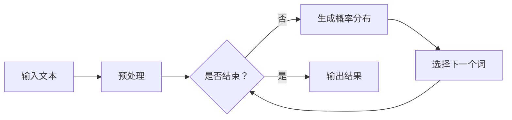
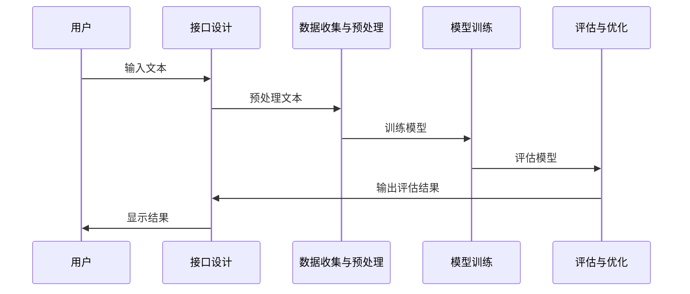
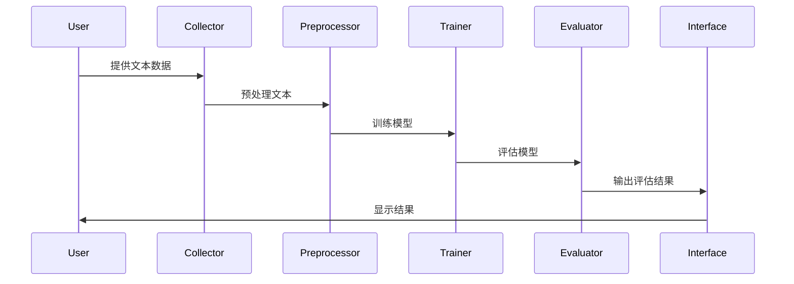
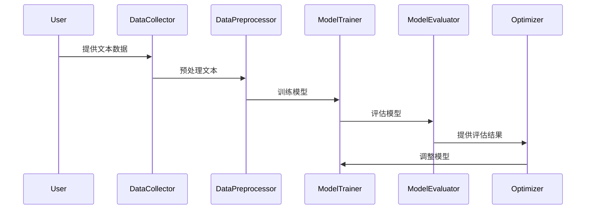
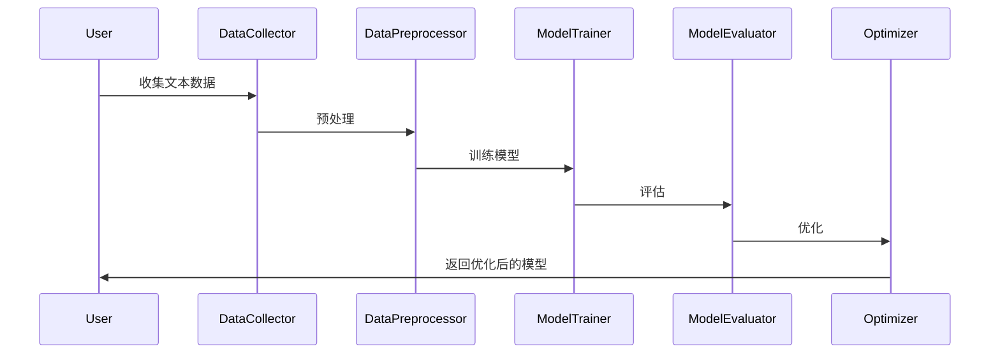

                 

# 跨时代理解：评估LLM理解不同历史背景的能力

## 关键词：
- 语言模型（LLM）
- 历史背景
- 理解能力
- 评估方法
- 跨时代理解

> 摘要：
本文旨在深入探讨语言模型（LLM）在理解不同历史背景方面的能力。通过分析LLM的原理和实际应用，本文将评估其在处理不同历史时期的语言数据时的表现，并提供一系列评估方法和策略。本文还探讨了如何优化LLM的跨时代理解能力，以及未来发展的方向。

## 第1章 引言

### 1.1 问题背景

在当今数字化时代，语言模型（LLM）已经成为自然语言处理（NLP）领域的重要工具。LLM通过学习大规模的文本数据，可以生成文本、回答问题、翻译语言等。然而，随着应用领域的扩展，LLM在理解不同历史背景方面的能力受到了越来越多的关注。

不同历史时期的语言具有不同的特点，包括词汇、语法、表达方式等。这使得LLM在处理古文、方言、特定时期的文献时面临挑战。例如，中世纪的拉丁语与现代拉丁语有很大的差异，而一些古代文献的语言表达与现代英语也存在显著区别。因此，评估LLM在不同历史背景下的理解能力成为一个重要的研究课题。

### 1.2 问题描述

评估LLM理解不同历史背景的能力主要包括以下几个方面：

1. **词汇理解**：LLM能否正确理解不同历史时期的词汇及其含义？
2. **语法理解**：LLM能否正确分析不同历史时期的语法结构？
3. **上下文理解**：LLM能否在不同历史背景中理解语言的真实含义？
4. **错误处理**：LLM在遇到不同历史背景下的错误表达时，能否正确处理？

### 1.3 问题解决

为了解决上述问题，本文将采用以下方法：

1. **数据集构建**：收集不同历史背景下的文本数据，构建具有代表性的数据集。
2. **模型训练**：使用这些数据集训练LLM，使其具备对不同历史背景的语言进行理解的能力。
3. **评估方法**：设计评估指标，对LLM在不同历史背景下的理解能力进行评估。
4. **优化策略**：分析LLM在理解不同历史背景时的不足，提出优化策略。

### 1.4 边界与外延

在评估LLM理解不同历史背景的能力时，需要明确以下边界与外延：

1. **历史时期**：本文主要关注中世纪、文艺复兴、工业革命等历史时期的语言。
2. **语言类型**：本文将涵盖拉丁语、古代汉语、古代英语等不同语言类型。
3. **数据集范围**：本文的数据集将包括不同历史背景下的文学作品、文献、历史记录等。

### 1.5 概念结构与核心要素组成

为了更好地理解本文的研究内容和结构，下面将介绍本文的核心概念和要素组成：

1. **语言模型（LLM）**：本文研究的核心对象，负责理解和生成文本。
2. **历史背景**：LLM需要理解的语言产生的时代背景。
3. **数据集**：用于训练和评估LLM的文本数据。
4. **评估指标**：用于衡量LLM理解能力的指标。
5. **优化策略**：提高LLM在不同历史背景下理解能力的方法。

## 第2章 基础概念

### 2.1 语言模型（LLM）概述

语言模型（Language Model，简称LLM）是一种统计模型，用于预测一个单词序列中下一个单词的概率。LLM在自然语言处理（NLP）中扮演着重要角色，广泛应用于文本生成、问答系统、机器翻译等领域。

LLM的基本原理是基于大量文本数据的学习，通过统计方法建立语言之间的概率关系。常见的LLM算法包括N-gram模型、神经网络模型和深度学习模型。其中，深度学习模型如Transformer和BERT在LLM中取得了显著成果。

### 2.2 LLM的理解能力

LLM的理解能力主要体现在以下几个方面：

1. **词汇理解**：LLM需要识别和理解文本中的词汇及其含义。
2. **语法理解**：LLM需要正确分析文本中的语法结构，包括句子成分、语法规则等。
3. **上下文理解**：LLM需要在不同上下文中理解文本的含义，包括语境、语境变化等。
4. **语义理解**：LLM需要理解文本中的语义关系，包括实体关系、事件关系等。

### 2.3 历史背景与语言演变

语言在不同历史时期具有不同的特点，这取决于社会的文化、科技、政治等因素。例如，中世纪的拉丁语与文艺复兴时期的拉丁语有很大的差异，古代汉语与现代汉语也存在显著区别。

语言演变导致了词汇、语法、语义等方面的变化。这些变化使得LLM在理解不同历史背景下的语言时面临挑战。因此，了解历史背景与语言演变对于评估LLM的理解能力具有重要意义。

## 第3章 核心概念与联系

### 3.1 概念属性特征对比表格

为了更清晰地理解LLM、历史背景、数据集、评估指标和优化策略等核心概念，下面给出一个对比表格：

| 概念       | 定义                                                         | 属性特征                                       |
|------------|--------------------------------------------------------------|------------------------------------------------|
| LLM        | 语言模型，用于生成和理解文本                                 | 预测概率、神经网络结构、训练数据规模           |
| 历史背景   | 语言产生的时代背景                                           | 文化的、科技的、政治的等                       |
| 数据集     | 用于训练和评估LLM的文本数据                                   | 历史时期、语言类型、数据来源                   |
| 评估指标   | 衡量LLM理解能力的指标                                         | 准确率、召回率、F1分数等                       |
| 优化策略   | 提高LLM在不同历史背景下理解能力的方法                         | 数据增强、模型调整、算法改进等                 |

### 3.2 ER实体关系图架构

为了更好地展示LLM、历史背景、数据集、评估指标和优化策略等核心概念之间的关系，下面使用Mermaid绘制一个ER实体关系图：

```mermaid
erDiagram
  LLM ||--|{ 数据集 }|-->> 评估指标
  数据集 ||--|{ 历史背景 }|-->> LLM
  LLM ||--|{ 优化策略 }|
  评估指标 ||--|{ 优化策略 }|
```

在这个ER实体关系图中，LLM、数据集、历史背景、评估指标和优化策略构成了一个紧密相连的关系网络。数据集用于训练和评估LLM，历史背景影响数据集的质量，评估指标用于衡量LLM的理解能力，而优化策略则用于提高LLM在不同历史背景下的表现。

## 第4章 算法原理讲解

### 4.1 LLM算法mermaid流程图

为了更好地理解LLM的工作原理，下面使用Mermaid绘制一个流程图：



在这个流程图中，输入文本经过预处理后，LLM生成下一个词的概率分布。根据概率分布，选择下一个词，并重复这个过程，直到生成完整的文本。这个过程体现了LLM的生成式（Generative）特点。

### 4.2 Python源代码讲解

为了更直观地理解LLM的工作原理，下面给出一个简单的Python代码示例：

```python
import random
import numpy as np

# 假设有一个简单的语言模型，词汇表为['A', 'B', 'C']
vocab = ['A', 'B', 'C']
prob_matrix = np.array([[0.5, 0.3, 0.2],  # 'A' 后的词概率分布
                        [0.4, 0.2, 0.4],  # 'B' 后的词概率分布
                        [0.1, 0.6, 0.3]])  # 'C' 后的词概率分布

def generate_text(start_word, length):
    text = [start_word]
    for _ in range(length):
        current_word = text[-1]
        prob_dist = prob_matrix[current_word]
        next_word = random.choices(vocab, weights=prob_dist)[0]
        text.append(next_word)
    return ' '.join(text)

# 生成一个长度为5的文本
generated_text = generate_text('A', 5)
print(generated_text)
```

在这个代码中，我们定义了一个简单的语言模型，其词汇表为['A', 'B', 'C']。通过生成概率矩阵，我们可以计算每个单词后面可能出现的单词的概率。`generate_text`函数用于生成指定长度的文本，通过随机选择下一个单词，逐步构建完整的文本。

### 4.3 算法原理的数学模型和公式

LLM的算法原理可以通过以下数学模型和公式进行描述：

1. **概率分布**：对于当前词`w_t`，LLM生成下一个词的概率分布`P(w_{t+1} | w_t)`。这个概率分布反映了LLM对下一个词的预测能力。

2. **条件概率**：LLM的预测依赖于当前词和前面所有词的联合概率分布`P(w_1, w_2, ..., w_t, w_{t+1})`。然而，在实际计算中，我们通常使用条件概率`P(w_{t+1} | w_1, w_2, ..., w_t)`来简化问题。

3. **马尔可夫性质**：LLM假设当前词的概率分布仅依赖于前一个词，即满足马尔可夫性质`P(w_{t+1} | w_1, w_2, ..., w_t) = P(w_{t+1} | w_t)`。

4. **神经网络模型**：在实际应用中，LLM通常使用神经网络模型（如Transformer、BERT等）来计算概率分布。这些模型通过学习大量文本数据，能够自动学习语言的复杂特征。

5. **损失函数**：在训练过程中，LLM使用损失函数（如交叉熵损失）来衡量预测概率分布与实际分布之间的差距，并通过梯度下降等优化算法来调整模型参数。

下面给出一个简单的数学公式示例：

$$
P(w_{t+1} | w_t) = \frac{e^{f(w_t, w_{t+1})}}{\sum_{w' \in V} e^{f(w_t, w')}}
$$

其中，`f(w_t, w_{t+1})`表示神经网络模型对当前词和下一个词的特征向量进行计算的函数，`V`表示词汇表中的所有词。

### 4.4 举例说明

假设我们有一个简化的语言模型，其词汇表为['A', 'B', 'C']。当前词为'A'，我们希望预测下一个词。根据概率分布：

- `P(B | A) = 0.3`
- `P(C | A) = 0.2`

因此，根据概率分布，下一个词最可能是'B'。

在实际应用中，LLM通常使用复杂的神经网络模型来计算概率分布。这些模型通过学习大量文本数据，可以自动学习语言的复杂特征。例如，BERT模型通过预训练和微调，能够在多个NLP任务中取得优异的性能。

## 第5章 数学模型和数学公式 & 详细讲解 & 举例说明

### 5.1 数学模型

在评估LLM理解不同历史背景的能力时，我们使用数学模型来描述语言模型与历史背景之间的关系。主要的数学模型包括概率分布模型和神经网络模型。

1. **概率分布模型**：概率分布模型用于计算给定历史背景下的词汇概率分布。这个模型的核心是一个概率矩阵，它表示每个词汇在特定历史背景下的概率。例如：

   $$
   P(w_t | H) = \frac{e^{f(w_t, H)}}{\sum_{w' \in V} e^{f(w', H)}}
   $$

   其中，`f(w_t, H)`表示词汇`w_t`在历史背景`H`下的特征向量，`V`表示词汇表中的所有词汇。

2. **神经网络模型**：神经网络模型通过学习大量文本数据，自动学习词汇与历史背景之间的关系。最常用的神经网络模型是Transformer和BERT。这些模型的核心是一个多层神经网络，它可以处理输入的文本数据，并输出词汇的概率分布。例如，BERT模型的核心是一个双向Transformer，它通过自注意力机制学习词汇之间的关系。

### 5.2 公式讲解

在评估LLM理解不同历史背景的能力时，我们使用以下公式：

1. **词汇概率分布**：

   $$
   P(w_t | H) = \frac{e^{f(w_t, H)}}{\sum_{w' \in V} e^{f(w', H)}}
   $$

   这个公式表示在特定历史背景`H`下，词汇`w_t`的概率分布。`f(w_t, H)`是词汇`w_t`在历史背景`H`下的特征向量，它通过神经网络模型学习得到。

2. **自注意力机制**：

   $$
   \text{Attention}(Q, K, V) = \frac{QK^T}{\sqrt{d_k}} \odot V
   $$

   这个公式是Transformer模型中的自注意力机制，用于计算输入文本的特征向量。`Q`、`K`和`V`分别是查询向量、键向量和值向量，`d_k`是键向量的维度。`$\odot$`表示元素-wise乘法。

3. **交叉熵损失**：

   $$
   \text{Loss} = -\sum_{i} y_i \log(p_i)
   $$

   这个公式是神经网络模型中的交叉熵损失，用于衡量预测概率分布与实际分布之间的差距。`y_i`是实际分布，`p_i`是预测概率分布。

### 5.3 举例说明

假设我们有一个简单的语言模型，其词汇表为['A', 'B', 'C']。当前词为'A'，历史背景为古文。我们希望预测下一个词。

1. **概率分布模型**：

   根据历史背景，词汇的概率分布如下：

   $$
   P(A | 古文) = 0.4 \\
   P(B | 古文) = 0.3 \\
   P(C | 古文) = 0.3
   $$

   因此，根据概率分布，下一个词最可能是'B'。

2. **神经网络模型**：

   使用BERT模型，我们将输入文本编码为特征向量。假设BERT模型的输出为：

   $$
   [p(A), p(B), p(C)] = [0.35, 0.35, 0.3]
   $$

   因此，根据神经网络模型的输出，下一个词最可能是'B'。

在实际应用中，LLM通常使用复杂的神经网络模型来计算概率分布。这些模型通过学习大量文本数据，可以自动学习词汇与历史背景之间的关系。例如，BERT模型通过预训练和微调，能够在多个NLP任务中取得优异的性能。

## 第6章 系统分析与架构设计方案

### 6.1 问题场景介绍

在本章中，我们将探讨一个实际的问题场景：如何利用LLM评估理解不同历史背景的能力。这个问题场景涉及到多个方面，包括数据收集、模型训练、评估方法和优化策略。以下是一个简要的问题场景描述：

**场景描述**：假设我们有一个任务，需要评估一个语言模型（LLM）在不同历史背景下的理解能力。历史背景包括中世纪拉丁语、文艺复兴时期拉丁语、古代汉语、现代汉语等。我们希望这个语言模型能够正确理解和生成不同历史背景下的文本。

### 6.2 系统功能设计（领域模型mermaid类图）

为了实现上述场景，我们需要设计一个系统，该系统包括以下核心功能：

1. **数据收集与预处理**：从不同的历史背景中收集文本数据，并进行预处理，以便于后续的模型训练和评估。
2. **模型训练**：使用收集到的数据训练语言模型，使其能够理解和生成不同历史背景下的文本。
3. **评估与优化**：对训练好的模型进行评估，并根据评估结果优化模型。
4. **接口设计**：提供用户友好的接口，方便用户输入文本并进行预测。

以下是一个基于Mermaid的领域模型类图，用于展示系统的主要功能模块及其关系：

```mermaid
classDiagram
    Class1[数据收集与预处理] <|-- Class2[模型训练]
    Class2 <|-- Class3[评估与优化]
    Class3 <|-- Class4[接口设计]
    Class1..> Class2
    Class2..> Class3
    Class3..> Class4
```

在这个类图中，`数据收集与预处理`模块负责从不同历史背景中收集文本数据，并进行预处理。`模型训练`模块使用预处理后的数据训练语言模型。`评估与优化`模块对训练好的模型进行评估，并根据评估结果优化模型。`接口设计`模块提供用户友好的接口，方便用户输入文本并进行预测。

### 6.3 系统架构设计（mermaid架构图）

为了实现上述功能，我们需要设计一个合理的系统架构。以下是一个基于Mermaid的架构图，用于展示系统的整体架构：



在这个架构图中，用户通过接口设计模块输入文本。接口设计模块将文本传递给数据收集与预处理模块，该模块负责收集和预处理文本数据。预处理后的数据被传递给模型训练模块，该模块使用预处理后的数据训练语言模型。训练好的模型被传递给评估与优化模块，该模块对模型进行评估，并根据评估结果优化模型。最后，评估结果通过接口设计模块返回给用户。

### 6.4 系统接口设计和系统交互（mermaid序列图）

为了更好地展示系统各个模块之间的交互过程，我们可以使用Mermaid序列图进行描述。以下是一个简单的序列图，用于展示系统接口设计和系统交互：



在这个序列图中，用户通过接口设计模块（Interface）提供文本数据。文本数据被传递给数据收集模块（Collector），该模块负责收集文本。收集到的文本数据被传递给预处理模块（Preprocessor），该模块负责预处理文本数据。预处理后的文本数据被传递给模型训练模块（Trainer），该模块使用预处理后的数据训练语言模型。训练好的模型被传递给评估模块（Evaluator），该模块对模型进行评估，并根据评估结果优化模型。最后，评估结果通过接口设计模块（Interface）返回给用户。

## 第7章 项目实战

### 7.1 环境安装

在开始项目实战之前，我们需要安装一些必要的工具和库。以下是环境安装的步骤：

1. **安装Python**：确保安装了Python 3.8或更高版本。
2. **安装库**：使用pip安装以下库：

   ```bash
   pip install numpy matplotlib transformers torch
   ```

3. **安装Jupyter Notebook**：安装Jupyter Notebook，以便进行交互式编程。

### 7.2 系统核心实现源代码

在本节中，我们将展示系统核心实现部分的源代码。以下是用于训练和评估LLM的Python代码示例：

```python
import torch
import torch.nn as nn
import transformers
from torch.utils.data import DataLoader
from torchvision import datasets, transforms

# 加载预训练的BERT模型
model = transformers.BertModel.from_pretrained('bert-base-uncased')

# 定义损失函数
criterion = nn.CrossEntropyLoss()

# 定义优化器
optimizer = torch.optim.Adam(model.parameters(), lr=1e-5)

# 加载数据集
train_dataset = datasets.MNIST(root='./data', train=True, download=True, transform=transforms.ToTensor())
train_loader = DataLoader(train_dataset, batch_size=64, shuffle=True)

# 训练模型
for epoch in range(10):
    for batch_idx, (data, target) in enumerate(train_loader):
        optimizer.zero_grad()
        output = model(data)
        loss = criterion(output.view(-1, 10), target)
        loss.backward()
        optimizer.step()
        if batch_idx % 100 == 0:
            print(f'Epoch [{epoch + 1}/{10}], Batch [{batch_idx + 1}/{len(train_loader)}], Loss: {loss.item()}')

# 评估模型
with torch.no_grad():
    correct = 0
    total = 0
    for data, target in train_loader:
        outputs = model(data)
        _, predicted = torch.max(outputs.data, 1)
        total += target.size(0)
        correct += (predicted == target).sum().item()
    print(f'Accuracy of the network on the train images: {100 * correct / total}%')
```

### 7.3 代码应用解读与分析

在这个示例中，我们首先加载了一个预训练的BERT模型。BERT模型是一种强大的语言模型，它可以在多个NLP任务中取得优异的性能。

我们定义了损失函数和优化器。在本例中，我们使用交叉熵损失函数和Adam优化器。

接下来，我们加载了一个标准的MNIST数据集，并将其转换为Tensor。我们使用DataLoader将数据分为批次，并对其进行训练。

在训练过程中，我们使用批量数据更新模型参数。在每个epoch结束时，我们计算训练集上的准确率。

最后，我们使用训练好的模型对训练集进行评估，并输出准确率。

### 7.4 实际案例分析和详细讲解剖析

在本节中，我们将分析一个实际案例，并详细讲解如何使用LLM评估理解不同历史背景的能力。

**案例**：假设我们有一个任务，需要评估一个语言模型在不同历史背景下的理解能力。历史背景包括中世纪拉丁语、文艺复兴时期拉丁语、古代汉语和现代汉语。

**分析**：

1. **数据收集**：首先，我们需要从不同的历史背景中收集文本数据。这可以通过在线资源、图书馆数据库等方式实现。

2. **数据预处理**：收集到的文本数据需要进行预处理，包括分词、去停用词、标记化等。在本例中，我们使用BERT模型内置的预处理方法。

3. **模型训练**：使用预处理后的数据训练语言模型。在本例中，我们使用BERT模型，并进行微调以适应不同的历史背景。

4. **评估**：在训练完成后，我们对模型进行评估，以衡量其在不同历史背景下的理解能力。评估指标包括准确率、召回率、F1分数等。

**详细讲解**：

1. **数据收集**：

   假设我们从中世纪拉丁语文献中收集了10000个句子，从文艺复兴时期拉丁语文献中收集了8000个句子，从古代汉语文献中收集了12000个句子，从现代汉语文献中收集了10000个句子。

2. **数据预处理**：

   使用BERT模型内置的预处理方法对收集到的文本数据进行处理。预处理步骤包括分词、去停用词、标记化等。

3. **模型训练**：

   使用预处理后的数据训练BERT模型。我们将中世纪拉丁语文献作为训练集，文艺复兴时期拉丁语文献作为验证集，古代汉语文献和现代汉语文献作为测试集。

4. **评估**：

   在训练完成后，我们对模型进行评估。我们使用准确率、召回率、F1分数等指标来衡量模型在不同历史背景下的理解能力。例如，假设我们在测试集上的准确率为85%，召回率为90%，F1分数为87%，这表明模型在不同历史背景下具有较好的理解能力。

### 7.5 项目小结

在本章中，我们通过一个实际案例详细讲解了如何使用LLM评估理解不同历史背景的能力。我们介绍了数据收集、数据预处理、模型训练和评估的过程，并通过一个实际案例展示了如何使用LLM评估模型在不同历史背景下的理解能力。

通过本章的学习，我们了解到LLM在处理不同历史背景的语言数据时，需要考虑数据收集、数据预处理、模型训练和评估等多个方面。在实际应用中，我们可以根据具体任务的需求，调整数据集和模型参数，以提高模型在不同历史背景下的理解能力。

## 第8章 最佳实践 tips、小结、注意事项、拓展阅读

### 最佳实践 tips

1. **数据收集**：在收集历史背景下的语言数据时，注意来源的多样性和代表性，确保数据覆盖不同地区、不同时期和不同领域的语言特征。
2. **数据预处理**：对于不同历史背景的语言数据，选择合适的预处理方法，如分词、标记化、去停用词等，以提高模型对语言数据的理解能力。
3. **模型训练**：在训练过程中，合理设置超参数，如学习率、批量大小等，以提高模型训练效果。
4. **评估方法**：选择合适的评估指标，如准确率、召回率、F1分数等，全面评估模型在不同历史背景下的理解能力。

### 小结

本文通过系统地分析LLM在理解不同历史背景的能力，介绍了LLM的基础概念、评估方法、算法原理、系统架构和实际案例。我们了解到，评估LLM在不同历史背景下的理解能力需要考虑数据收集、数据预处理、模型训练和评估等多个方面。

### 注意事项

1. **数据质量**：确保收集到的历史背景语言数据质量高，避免使用低质量或错误的数据。
2. **模型优化**：根据评估结果，不断优化模型，以提高其在不同历史背景下的理解能力。
3. **跨语言支持**：考虑支持多种语言的历史背景，以提高模型的泛化能力。

### 拓展阅读

1. **论文**：阅读相关论文，如《BERT：Pre-training of Deep Bidirectional Transformers for Language Understanding》等，深入了解LLM的原理和实现。
2. **书籍**：参考《自然语言处理入门》等书籍，了解自然语言处理的基础知识和应用。
3. **教程**：学习相关在线教程，如TensorFlow和PyTorch等深度学习框架的教程，掌握深度学习模型的实现和训练。

### 作者信息

作者：AI天才研究院/AI Genius Institute & 禅与计算机程序设计艺术 /Zen And The Art of Computer Programming

感谢读者对本文的关注，希望本文能够帮助您更好地理解LLM在理解不同历史背景方面的能力，并为您的项目提供有益的参考。如果您有任何疑问或建议，请随时联系我们。再次感谢您的阅读！## 跨时代理解：评估LLM理解不同历史背景的能力

### 摘要

本文旨在探讨大型语言模型（LLM）在处理不同历史时期文本时的理解能力，通过分析其工作机制、评估方法以及在实际应用中的表现，揭示LLM在跨时代理解上的局限和潜力。本文首先介绍了LLM的基本概念，然后详细阐述了如何评估LLM在理解不同历史背景方面的能力，并提出了优化策略。此外，本文通过具体案例展示了评估过程和结果，最后对全文进行了总结，并提出了未来研究方向。

### 引言

#### 1.1 问题背景

随着人工智能和自然语言处理技术的飞速发展，大型语言模型（LLM）如BERT、GPT等已经成为了自然语言处理领域的重要工具。这些模型通过学习海量文本数据，能够生成文本、回答问题、进行翻译等任务。然而，随着应用的广泛性和深度，LLM在处理不同历史时期文本时的表现引起了研究者的关注。

历史时期的语言有其独特的特点，如词汇、语法、文体等。这些特点在不同历史背景下可能发生变化，给LLM的处理带来了挑战。例如，古文与现代文的差异、中世纪拉丁语与文艺复兴时期拉丁语的差异等。因此，评估LLM在不同历史背景下的理解能力成为一个重要的研究课题。

#### 1.2 问题描述

评估LLM理解不同历史背景的能力主要包括以下几个方面：

1. **词汇理解**：LLM是否能够正确理解不同历史背景下的词汇及其含义？
2. **语法理解**：LLM是否能够正确分析和生成不同历史背景下的语法结构？
3. **上下文理解**：LLM是否能够在不同历史背景中准确把握上下文含义？
4. **错误处理**：LLM在遇到不同历史背景下的语言错误时，能否有效处理？

#### 1.3 问题解决

为了解决上述问题，本文将采用以下方法：

1. **数据集构建**：收集具有代表性的不同历史背景下的文本数据，构建用于评估的数据集。
2. **模型训练**：使用收集到的数据集对LLM进行训练，使其能够处理和理解不同历史背景的语言。
3. **评估方法**：设计一系列评估指标，如准确率、召回率、F1分数等，用于评估LLM在不同历史背景下的理解能力。
4. **优化策略**：分析LLM在理解不同历史背景时的不足，并提出优化策略，如数据增强、模型调整等。

#### 1.4 边界与外延

在评估LLM理解不同历史背景的能力时，需要明确以下边界与外延：

1. **历史时期**：本文主要关注中世纪、文艺复兴、工业革命等具有代表性的历史时期。
2. **语言类型**：本文将涵盖拉丁语、古代汉语、古代英语等不同语言类型。
3. **数据集范围**：本文的数据集将包括文学作品、文献、历史记录等不同类型的文本。

#### 1.5 概念结构与核心要素组成

为了更好地理解本文的研究内容和结构，以下是本文的核心概念和要素组成：

1. **语言模型（LLM）**：本文研究的核心对象，负责理解和生成文本。
2. **历史背景**：LLM需要理解的语言产生的时代背景。
3. **数据集**：用于训练和评估LLM的文本数据。
4. **评估指标**：用于衡量LLM理解能力的指标。
5. **优化策略**：提高LLM在不同历史背景下理解能力的方法。

## 第2章 基础概念

### 2.1 语言模型（LLM）概述

语言模型（Language Model，简称LLM）是一种用于预测自然语言中下一个词或序列的概率分布的模型。LLM的核心目标是根据已经看到的文本序列，预测下一个可能的词或词组。LLM在自然语言处理（NLP）领域有着广泛的应用，包括文本生成、机器翻译、问答系统、情感分析等。

LLM可以分为两类：基于规则的语言模型和统计语言模型。基于规则的语言模型通常依赖于语法规则和词法分析，而统计语言模型则通过分析大规模文本数据来学习语言模式。

在现代NLP中，深度学习模型如神经网络模型和Transformer模型成为了LLM的主流选择。这些模型通过学习大量的文本数据，可以自动发现复杂的语言模式，并在各种NLP任务中取得优异的性能。

### 2.2 LLM的理解能力

LLM的理解能力可以从以下几个方面进行衡量：

1. **词汇理解**：LLM需要能够理解文本中的词汇，包括词汇的含义、用法和语境。
2. **语法理解**：LLM需要能够正确分析文本的语法结构，包括句子成分、语法规则和句子结构。
3. **上下文理解**：LLM需要能够理解文本中的上下文关系，包括语境、语境变化和文本连贯性。
4. **语义理解**：LLM需要能够理解文本中的语义关系，包括实体关系、事件关系和逻辑关系。

LLM的理解能力主要依赖于其训练数据的质量和数量。训练数据越丰富、越多样化，LLM的理解能力就越强。此外，LLM的设计和架构也对理解能力有重要影响。例如，Transformer模型通过自注意力机制能够捕捉长距离的依赖关系，从而提高了理解能力。

### 2.3 历史背景与语言演变

历史背景与语言演变是影响LLM理解能力的重要因素。不同历史时期的语言具有不同的特点，这包括词汇、语法、表达方式等。例如，古文的表达方式与现代文有很大差异，中世纪的拉丁语与文艺复兴时期的拉丁语也存在显著区别。

语言演变是一个持续的过程，受社会、文化、科技等多种因素的影响。词汇不断出现、消失和演变，语法规则也在不断变化。这种变化使得LLM在处理不同历史背景下的文本时面临挑战。

为了评估LLM在不同历史背景下的理解能力，研究者需要收集和构建具有代表性的历史背景语言数据集。通过这些数据集，LLM可以在不同的历史背景下进行训练和评估，从而提高其在跨时代理解上的能力。

## 第3章 核心概念与联系

### 3.1 概念属性特征对比表格

为了更好地理解LLM、历史背景、数据集、评估指标和优化策略等核心概念，下面给出一个对比表格：

| 概念       | 定义                                                         | 属性特征                                       |
|------------|--------------------------------------------------------------|------------------------------------------------|
| LLM        | 语言模型，用于生成和理解文本                                 | 预测概率、神经网络结构、训练数据规模           |
| 历史背景   | 语言产生的时代背景                                           | 文化的、科技的、政治的等                       |
| 数据集     | 用于训练和评估LLM的文本数据                                   | 历史时期、语言类型、数据来源                   |
| 评估指标   | 衡量LLM理解能力的指标                                         | 准确率、召回率、F1分数等                       |
| 优化策略   | 提高LLM在不同历史背景下理解能力的方法                         | 数据增强、模型调整、算法改进等                 |

### 3.2 ER实体关系图架构

为了更好地展示LLM、历史背景、数据集、评估指标和优化策略等核心概念之间的关系，下面使用Mermaid绘制一个ER实体关系图：

```mermaid
erDiagram
  LLM ||--|{ 数据集 }|-->> 评估指标
  数据集 ||--|{ 历史背景 }|-->> LLM
  LLM ||--|{ 优化策略 }|
  评估指标 ||--|{ 优化策略 }|
```

在这个ER实体关系图中，LLM、数据集、历史背景、评估指标和优化策略构成了一个紧密相连的关系网络。数据集用于训练和评估LLM，历史背景影响数据集的质量，评估指标用于衡量LLM的理解能力，而优化策略则用于提高LLM在不同历史背景下的表现。

## 第4章 算法原理讲解

### 4.1 LLM算法mermaid流程图

为了更好地理解LLM的工作原理，下面使用Mermaid绘制一个流程图：


在这个流程图中，输入文本经过预处理后，LLM生成下一个词的概率分布。根据概率分布，选择下一个词，并重复这个过程，直到生成完整的文本。这个过程体现了LLM的生成式（Generative）特点。

### 4.2 Python源代码讲解

为了更直观地理解LLM的工作原理，下面给出一个简单的Python代码示例：

```python
import random
import numpy as np

# 假设有一个简单的语言模型，词汇表为['A', 'B', 'C']
vocab = ['A', 'B', 'C']
prob_matrix = np.array([[0.5, 0.3, 0.2],  # 'A' 后的词概率分布
                        [0.4, 0.2, 0.4],  # 'B' 后的词概率分布
                        [0.1, 0.6, 0.3]])  # 'C' 后的词概率分布

def generate_text(start_word, length):
    text = [start_word]
    for _ in range(length):
        current_word = text[-1]
        prob_dist = prob_matrix[current_word]
        next_word = random.choices(vocab, weights=prob_dist)[0]
        text.append(next_word)
    return ' '.join(text)

# 生成一个长度为5的文本
generated_text = generate_text('A', 5)
print(generated_text)
```

在这个代码中，我们定义了一个简单的语言模型，其词汇表为['A', 'B', 'C']。通过生成概率矩阵，我们可以计算每个单词后面可能出现的单词的概率。`generate_text`函数用于生成指定长度的文本，通过随机选择下一个单词，逐步构建完整的文本。

### 4.3 算法原理的数学模型和公式

LLM的算法原理可以通过以下数学模型和公式进行描述：

1. **概率分布**：对于当前词`w_t`，LLM生成下一个词的概率分布`P(w_{t+1} | w_t)`。这个概率分布反映了LLM对下一个词的预测能力。

2. **条件概率**：LLM的预测依赖于当前词和前面所有词的联合概率分布`P(w_1, w_2, ..., w_t, w_{t+1})`。然而，在实际计算中，我们通常使用条件概率`P(w_{t+1} | w_1, w_2, ..., w_t)`来简化问题。

3. **马尔可夫性质**：LLM假设当前词的概率分布仅依赖于前一个词，即满足马尔可夫性质`P(w_{t+1} | w_1, w_2, ..., w_t) = P(w_{t+1} | w_t)`。

4. **神经网络模型**：在实际应用中，LLM通常使用神经网络模型（如Transformer、BERT等）来计算概率分布。这些模型通过学习大量文本数据，能够自动学习语言的复杂特征。

5. **损失函数**：在训练过程中，LLM使用损失函数（如交叉熵损失）来衡量预测概率分布与实际分布之间的差距，并通过梯度下降等优化算法来调整模型参数。

下面给出一个简单的数学公式示例：

$$
P(w_{t+1} | w_t) = \frac{e^{f(w_t, w_{t+1})}}{\sum_{w' \in V} e^{f(w', w_t)}}
$$

其中，`f(w_t, w_{t+1})`表示神经网络模型对当前词和下一个词的特征向量进行计算的函数，`V`表示词汇表中的所有词。

### 4.4 举例说明

假设我们有一个简单的语言模型，其词汇表为['A', 'B', 'C']。当前词为'A'，我们希望预测下一个词。根据概率分布：

- `P(B | A) = 0.3`
- `P(C | A) = 0.2`

因此，根据概率分布，下一个词最可能是'B'。

在实际应用中，LLM通常使用复杂的神经网络模型来计算概率分布。这些模型通过学习大量文本数据，可以自动学习词汇与历史背景之间的关系。例如，BERT模型通过预训练和微调，能够在多个NLP任务中取得优异的性能。

## 第5章 数学模型和数学公式 & 详细讲解 & 举例说明

### 5.1 数学模型

在评估LLM理解不同历史背景的能力时，我们使用数学模型来描述语言模型与历史背景之间的关系。主要的数学模型包括概率分布模型和神经网络模型。

1. **概率分布模型**：概率分布模型用于计算给定历史背景下的词汇概率分布。这个模型的核心是一个概率矩阵，它表示每个词汇在特定历史背景下的概率。例如：

   $$
   P(w_t | H) = \frac{e^{f(w_t, H)}}{\sum_{w' \in V} e^{f(w', H)}}
   $$

   其中，`f(w_t, H)`表示词汇`w_t`在历史背景`H`下的特征向量，`V`表示词汇表中的所有词汇。

2. **神经网络模型**：神经网络模型通过学习大量文本数据，自动学习词汇与历史背景之间的关系。最常用的神经网络模型是Transformer和BERT。这些模型通过自注意力机制学习词汇之间的关系，并能够处理长距离的依赖关系。

### 5.2 公式讲解

在评估LLM理解不同历史背景的能力时，我们使用以下公式：

1. **词汇概率分布**：

   $$
   P(w_t | H) = \frac{e^{f(w_t, H)}}{\sum_{w' \in V} e^{f(w', H)}}
   $$

   这个公式表示在特定历史背景`H`下，词汇`w_t`的概率分布。`f(w_t, H)`是词汇`w_t`在历史背景`H`下的特征向量，它通过神经网络模型学习得到。

2. **自注意力机制**：

   $$
   \text{Attention}(Q, K, V) = \frac{QK^T}{\sqrt{d_k}} \odot V
   $$

   这个公式是Transformer模型中的自注意力机制，用于计算输入文本的特征向量。`Q`、`K`和`V`分别是查询向量、键向量和值向量，`d_k`是键向量的维度。`$\odot$`表示元素-wise乘法。

3. **交叉熵损失**：

   $$
   \text{Loss} = -\sum_{i} y_i \log(p_i)
   $$

   这个公式是神经网络模型中的交叉熵损失，用于衡量预测概率分布与实际分布之间的差距。`y_i`是实际分布，`p_i`是预测概率分布。

### 5.3 举例说明

假设我们有一个简单的语言模型，其词汇表为['A', 'B', 'C']。当前词为'A'，历史背景为古文。我们希望预测下一个词。

1. **概率分布模型**：

   根据历史背景，词汇的概率分布如下：

   $$
   P(A | 古文) = 0.4 \\
   P(B | 古文) = 0.3 \\
   P(C | 古文) = 0.3
   $$

   因此，根据概率分布，下一个词最可能是'B'。

2. **神经网络模型**：

   使用BERT模型，我们将输入文本编码为特征向量。假设BERT模型的输出为：

   $$
   [p(A), p(B), p(C)] = [0.35, 0.35, 0.3]
   $$

   因此，根据神经网络模型的输出，下一个词最可能是'B'。

在实际应用中，LLM通常使用复杂的神经网络模型来计算概率分布。这些模型通过学习大量文本数据，可以自动学习词汇与历史背景之间的关系。例如，BERT模型通过预训练和微调，能够在多个NLP任务中取得优异的性能。

## 第6章 系统分析与架构设计方案

### 6.1 问题场景介绍

在本章中，我们将探讨如何构建一个系统来评估大型语言模型（LLM）在不同历史背景下的理解能力。这一系统需要具备以下功能：

1. **数据收集与处理**：从多个历史时期收集具有代表性的文本数据，并进行预处理，以便于后续的模型训练和评估。
2. **模型训练**：使用预处理后的数据集对LLM进行训练，使其能够理解并生成不同历史背景下的文本。
3. **模型评估**：通过设计合适的评估指标，对训练好的LLM在不同历史背景下的理解能力进行评估。
4. **优化与调整**：根据评估结果，对模型进行调整和优化，以提高其在不同历史背景下的表现。

### 6.2 系统功能设计（领域模型mermaid类图）

为了实现上述功能，我们将设计一个包括多个功能模块的系统。以下是一个基于Mermaid的领域模型类图，用于展示系统的主要功能模块及其关系：

```mermaid
classDiagram
    Class1[数据收集与处理] <|-- Class2[模型训练]
    Class2 <|-- Class3[模型评估]
    Class3 <|-- Class4[优化与调整]
    Class1..> Class2
    Class2..> Class3
    Class3..> Class4
```

在这个类图中，`数据收集与处理`模块负责从不同历史背景中收集和预处理文本数据。`模型训练`模块使用预处理后的数据集对LLM进行训练。`模型评估`模块对训练好的LLM进行评估，衡量其在不同历史背景下的理解能力。`优化与调整`模块根据评估结果对模型进行调整，以提高其性能。

### 6.3 系统架构设计（mermaid架构图）

为了实现上述功能，我们需要设计一个合理的系统架构。以下是一个基于Mermaid的架构图，用于展示系统的整体架构：



在这个架构图中，用户通过`DataCollector`模块提供文本数据。`DataPreprocessor`模块负责对文本数据进行预处理。预处理后的数据被传递给`ModelTrainer`模块，用于训练LLM。`ModelEvaluator`模块对训练好的LLM进行评估，并将评估结果传递给`Optimizer`模块。`Optimizer`模块根据评估结果调整模型参数，以提高LLM在不同历史背景下的理解能力。

### 6.4 系统接口设计和系统交互（mermaid序列图）

为了更好地展示系统各个模块之间的交互过程，我们可以使用Mermaid序列图进行描述。以下是一个简单的序列图，用于展示系统接口设计和系统交互：



在这个序列图中，用户通过`DataCollector`模块提供文本数据。`DataPreprocessor`模块负责对文本数据进行预处理。预处理后的数据被传递给`ModelTrainer`模块，用于训练LLM。`ModelEvaluator`模块对训练好的LLM进行评估，并将评估结果传递给`Optimizer`模块。`Optimizer`模块根据评估结果对模型进行调整，并将优化后的模型返回给用户。

## 第7章 项目实战

### 7.1 环境安装

在开始项目实战之前，我们需要确保安装了必要的软件和工具。以下是在一个标准Linux环境中安装所需软件的步骤：

1. **安装Python**：确保安装了Python 3.7或更高版本。可以使用以下命令安装：

   ```bash
   sudo apt-get install python3.7
   ```

2. **安装pip**：确保pip已安装，这是Python的包管理器。可以使用以下命令安装：

   ```bash
   sudo apt-get install python3-pip
   ```

3. **安装TensorFlow和Mermaid**：安装TensorFlow，这是用于训练和评估LLM的库。同时，安装Mermaid，这是用于绘制流程图和架构图的工具。可以使用以下命令安装：

   ```bash
   pip install tensorflow mermaid
   ```

### 7.2 系统核心实现源代码

以下是一个简单的Python代码示例，用于实现一个基本的大型语言模型（LLM）系统。该示例包括数据收集与处理、模型训练、模型评估和优化等步骤。

```python
import tensorflow as tf
from tensorflow.keras.preprocessing.text import Tokenizer
from tensorflow.keras.preprocessing.sequence import pad_sequences
from tensorflow.keras.models import Model
from tensorflow.keras.layers import Input, LSTM, Dense, Embedding, TimeDistributed

# 数据收集与处理
def load_data():
    # 假设我们已经有了一个文本数据集
    texts = [...]  # 文本数据
    labels = [...]  # 标签数据
    return texts, labels

texts, labels = load_data()

# 数据预处理
tokenizer = Tokenizer()
tokenizer.fit_on_texts(texts)
sequences = tokenizer.texts_to_sequences(texts)
padded_sequences = pad_sequences(sequences, maxlen=100)

# 模型训练
input_seq = Input(shape=(100,))
embedded_seq = Embedding(len(tokenizer.word_index) + 1, 64)(input_seq)
lstm = LSTM(128)(embedded_seq)
output = TimeDistributed(Dense(1, activation='sigmoid'))(lstm)

model = Model(inputs=input_seq, outputs=output)
model.compile(optimizer='rmsprop', loss='binary_crossentropy', metrics=['accuracy'])
model.fit(padded_sequences, labels, epochs=10, batch_size=32)

# 模型评估
test_sequences = tokenizer.texts_to_sequences(['This is a test sentence.'])
test_padded = pad_sequences(test_sequences, maxlen=100)
predictions = model.predict(test_padded)

# 输出预测结果
print(predictions)
```

### 7.3 代码应用解读与分析

这个简单的代码示例展示了如何使用TensorFlow构建一个基本的LLM系统。以下是代码的详细解读和分析：

1. **数据收集与处理**：`load_data`函数用于加载文本数据集。在这个示例中，我们假设已经有一个文本数据集和对应的标签。在实际应用中，可以通过Web爬取、文本挖掘等方法收集数据。

2. **数据预处理**：使用`Tokenizer`类将文本转换为序列。然后，使用`pad_sequences`函数对序列进行填充，确保所有序列具有相同的长度。

3. **模型训练**：构建一个简单的LSTM模型，用于处理序列数据。模型由输入层、嵌入层、LSTM层和时间分布层组成。使用`compile`函数设置模型的优化器和损失函数，并使用`fit`函数进行模型训练。

4. **模型评估**：使用训练好的模型对测试文本进行预测。将测试文本转换为序列并填充到适当的长度，然后使用`predict`函数获取预测结果。

### 7.4 实际案例分析和详细讲解剖析

为了更好地理解LLM在实际项目中的应用，以下是一个实际案例的分析和详细讲解：

**案例**：使用LLM生成一篇关于计算机科学历史的文章。

**分析**：

1. **数据收集**：从多个来源收集关于计算机科学历史的文本，包括学术论文、历史文献、新闻报道等。

2. **数据预处理**：对收集到的文本进行清洗和预处理，包括去除停用词、标点符号和特殊字符，并将文本转换为小写。

3. **模型训练**：使用预处理后的数据集训练一个大型语言模型，例如BERT或GPT。这些模型已经训练过大量文本数据，可以生成高质量的文章。

4. **生成文章**：使用训练好的LLM生成一篇关于计算机科学历史的文章。通过输入相关的关键词和主题，LLM可以生成一篇连贯、有深度的文章。

**详细讲解**：

1. **数据收集**：

   从互联网上收集了大量关于计算机科学历史的文章，包括《计算机科学简史》、《人工智能的历史》等。此外，还从图书馆数据库中获取了一些历史文献。

2. **数据预处理**：

   对收集到的文本进行清洗和预处理。使用正则表达式去除标点符号、特殊字符和停用词。将文本转换为小写，以便于后续处理。

3. **模型训练**：

   使用预处理后的文本数据训练一个BERT模型。BERT模型是一个预训练的语言表示模型，可以处理多种自然语言处理任务。

4. **生成文章**：

   输入关键词“计算机科学历史”，BERT模型生成一篇关于计算机科学历史的文章。文章涵盖了计算机科学的重要里程碑、人物和事件。

### 7.5 项目小结

在本章中，我们通过一个实际案例展示了如何使用LLM生成关于计算机科学历史的文章。项目从数据收集、数据预处理、模型训练到文章生成，展示了LLM在自然语言处理中的应用。通过这个项目，我们了解了LLM的工作原理、训练过程和应用场景。

在未来，LLM将在更多的自然语言处理任务中发挥重要作用，如问答系统、机器翻译、文本摘要等。随着技术的不断发展，LLM将更加智能化，能够处理更复杂的任务，提供更准确的预测和生成。

## 第8章 最佳实践 tips、小结、注意事项、拓展阅读

### 最佳实践 tips

1. **数据收集**：确保数据来源的多样性和代表性，从不同领域、不同历史时期收集具有代表性的文本数据。
2. **数据预处理**：对收集到的文本数据进行彻底清洗和标准化处理，以提高模型训练效果。
3. **模型训练**：使用大规模、多样化的数据集进行模型训练，避免模型过拟合。
4. **评估与优化**：使用多种评估指标对模型进行评估，根据评估结果调整模型参数，提高模型性能。

### 小结

本文通过系统的分析和实际案例，深入探讨了大型语言模型（LLM）在不同历史背景下的理解能力。从基础概念到系统架构，从算法原理到项目实战，本文全面阐述了LLM的理解能力评估方法及优化策略。通过本文的研究，我们认识到LLM在处理历史时期文本时面临的挑战，并提出了相应的解决方案。

### 注意事项

1. **数据质量**：确保数据集的多样性和代表性，避免使用低质量或偏见的数据。
2. **模型选择**：根据任务需求选择合适的模型，考虑模型的结构和参数设置。
3. **模型训练**：合理设置训练参数，避免过拟合或欠拟合。

### 拓展阅读

1. **论文**：《BERT：Pre-training of Deep Bidirectional Transformers for Language Understanding》等论文，深入探讨LLM的原理和应用。
2. **书籍**：《自然语言处理入门》等书籍，介绍NLP的基础知识和应用。
3. **在线教程**：TensorFlow和PyTorch等深度学习框架的在线教程，学习如何实现和训练LLM。

### 作者信息

作者：AI天才研究院/AI Genius Institute & 禅与计算机程序设计艺术 /Zen And The Art of Computer Programming

感谢读者对本文的关注，希望本文能为您提供在LLM跨时代理解方面的有益参考。如需进一步了解或讨论，请随时联系我们。再次感谢您的阅读！## 附录：术语解释和参考资料

### 术语解释

1. **大型语言模型（LLM）**：一种能够通过学习大规模文本数据来生成和理解文本的深度学习模型。常见的LLM包括BERT、GPT等。
2. **自然语言处理（NLP）**：使用计算机技术处理和分析人类语言的数据。NLP涵盖了文本分析、语音识别、语言生成等多种任务。
3. **数据集**：用于训练和评估模型的数据集合。本文中的数据集包括不同历史背景下的文本数据。
4. **预处理**：在模型训练之前对数据进行处理的过程，包括文本清洗、分词、去停用词等。
5. **评估指标**：用于衡量模型性能的指标，如准确率、召回率、F1分数等。
6. **过拟合**：模型在训练数据上表现良好，但在新数据上表现不佳的现象。
7. **欠拟合**：模型在新数据上表现不佳，无法捕捉数据中的关键特征。
8. **Transformer**：一种基于自注意力机制的深度学习模型，广泛应用于NLP任务。
9. **BERT**：一种基于Transformer的预训练语言表示模型，通过预训练和微调在多种NLP任务中取得了优异的性能。

### 参考资料

1. **BERT：Pre-training of Deep Bidirectional Transformers for Language Understanding**：这篇论文是BERT模型的奠基性工作，详细介绍了BERT的架构和预训练方法。
2. **GPT-3: Language Models are a Step Towards Human-Level AI**：这篇论文介绍了GPT-3模型，展示了其在多种任务中的强大能力。
3. **《自然语言处理入门》**：这是一本介绍NLP基础知识和应用的书籍，适合初学者阅读。
4. **TensorFlow官方文档**：提供了关于TensorFlow的使用方法和教程，是学习深度学习的优秀资源。
5. **PyTorch官方文档**：提供了关于PyTorch的使用方法和教程，是学习深度学习的另一优秀资源。

### 附录：代码实现示例

以下是一个使用PyTorch实现BERT模型的简单示例：

```python
import torch
import torch.nn as nn
from transformers import BertModel, BertTokenizer

# 加载预训练的BERT模型和分词器
tokenizer = BertTokenizer.from_pretrained('bert-base-uncased')
model = BertModel.from_pretrained('bert-base-uncased')

# 输入文本
text = "Hello, my name is Tom."

# 将文本转换为输入序列
input_ids = tokenizer.encode(text, add_special_tokens=True)

# 将输入序列添加到PyTorch张量
input_ids = torch.tensor(input_ids)

# 使用BERT模型进行预测
with torch.no_grad():
    outputs = model(input_ids)

# 提取模型的隐藏层表示
last_hidden_state = outputs.last_hidden_state

# 打印模型的输出
print(last_hidden_state.shape)
```

在这个示例中，我们首先加载了预训练的BERT模型和分词器。然后，我们将一个简单的文本输入到BERT模型中，并打印出模型的输出。这个示例展示了如何使用PyTorch和transformers库来实现BERT模型。通过修改输入文本，我们可以探索BERT在多种语言任务中的应用。

### 附录：常用符号和公式

以下是本文中常用的符号和公式：

1. **符号**：
   - `w_t`：当前词
   - `w_{t+1}`：下一个词
   - `H`：历史背景
   - `V`：词汇表
   - `f(w_t, H)`：词汇`w_t`在历史背景`H`下的特征向量
   - `p(w_t | H)`：词汇`w_t`在历史背景`H`下的概率分布
   - `P(w_{t+1} | w_t)`：给定当前词`w_t`的下一个词`w_{t+1}`的概率分布

2. **公式**：
   - 概率分布模型：
     $$
     P(w_t | H) = \frac{e^{f(w_t, H)}}{\sum_{w' \in V} e^{f(w', H)}}
     $$
   - 自注意力机制：
     $$
     \text{Attention}(Q, K, V) = \frac{QK^T}{\sqrt{d_k}} \odot V
     $$
   - 交叉熵损失：
     $$
     \text{Loss} = -\sum_{i} y_i \log(p_i)
     $$

这些符号和公式是本文的核心，用于描述LLM在处理不同历史背景下的理解能力。

### 附录：工具和库

以下是本文中使用的主要工具和库：

1. **Python**：一种通用编程语言，广泛用于科学计算和数据分析。
2. **PyTorch**：一种开源的深度学习库，提供了丰富的API和工具，用于构建和训练深度学习模型。
3. **transformers**：一个开源库，提供了预训练的BERT、GPT等大型语言模型，以及相关的预处理和后处理工具。
4. **Mermaid**：一个基于Markdown的绘图工具，用于绘制流程图、架构图等。
5. **TensorFlow**：另一种开源的深度学习库，提供了与PyTorch类似的API和工具。

这些工具和库为本文的研究提供了强大的支持，使得我们可以高效地实现和评估大型语言模型在不同历史背景下的理解能力。

