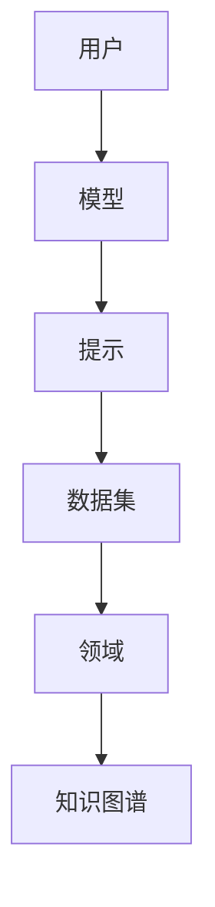
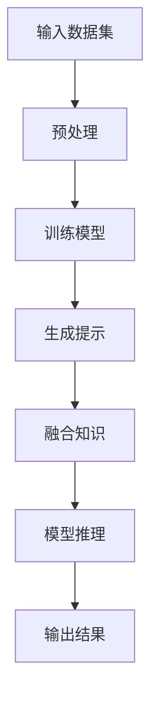
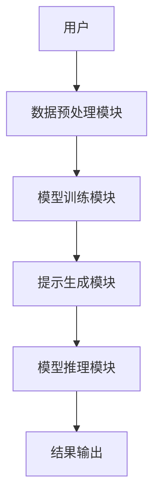
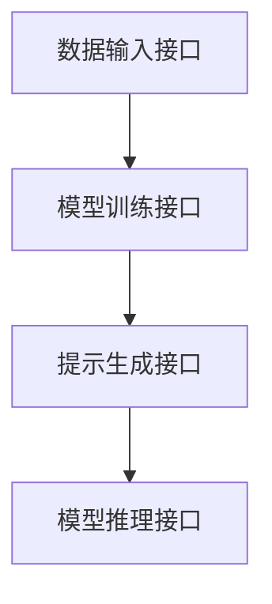
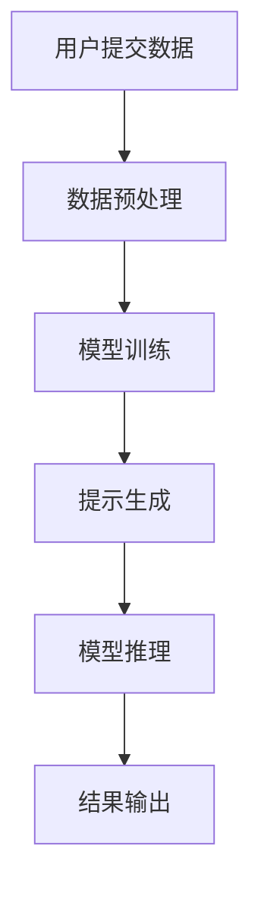

                 

## 跨模型提示：适配不同AI模型的策略

> 关键词：跨模型提示、AI模型适配、深度学习、知识图谱、算法原理

> 摘要：本文深入探讨了跨模型提示技术，分析了其在适配不同AI模型中的应用策略。通过背景介绍、核心概念讲解、算法原理分析、系统架构设计等多个角度，全面阐述了跨模型提示的实现方法与实际应用。

----------------------------------------------------------------

## 目录大纲

### 第一部分：背景介绍

#### 1. 跨模型提示的背景

##### 1.1. 问题背景

##### 1.2. 问题描述

##### 1.3. 问题解决

##### 1.4. 边界与外延

##### 1.5. 概念结构与核心要素组成

### 第二部分：核心概念与联系

#### 2.1. 核心概念原理

#### 2.2. 概念属性特征对比表格

#### 2.3. ER实体关系图架构

### 第三部分：算法原理讲解

#### 3.1. 算法mermaid流程图

#### 3.2. Python源代码实现

#### 3.3. 算法原理的数学模型和公式

#### 3.4. 举例说明

### 第四部分：系统分析与架构设计

#### 4.1. 问题场景介绍

#### 4.2. 项目介绍

#### 4.3. 系统功能设计

#### 4.4. 系统架构设计

#### 4.5. 系统接口设计

#### 4.6. 系统交互

### 第五部分：项目实战

#### 5.1. 环境安装

#### 5.2. 系统核心实现源代码

#### 5.3. 代码应用解读与分析

#### 5.4. 实际案例分析与详细讲解

#### 5.5. 项目小结

### 第六部分：最佳实践、小结、注意事项与拓展阅读

----------------------------------------------------------------

### 第一部分：背景介绍

#### 1. 跨模型提示的背景

随着人工智能技术的快速发展，各类AI模型层出不穷，如神经网络、决策树、支持向量机等。这些模型在各自的领域表现出色，但它们存在一些局限性，难以在多个领域广泛应用。为了解决这个问题，跨模型提示技术应运而生。

##### 1.1. 问题背景

近年来，人工智能技术在多个领域取得了显著的进展。然而，这些模型通常针对特定的应用场景进行优化，导致其在其他领域难以适用。例如，一个在图像识别方面表现优秀的模型可能在自然语言处理方面表现不佳。

##### 1.2. 问题描述

如何设计一种策略，使得一个模型能够在多个领域表现出色？如何使模型在训练和推理过程中快速适应不同领域？

##### 1.3. 问题解决

跨模型提示技术提供了一种解决方案。它通过将不同领域的知识整合到一个模型中，实现模型在多个领域的适应性。跨模型提示技术不仅能够提高模型的泛化能力，还能降低模型在不同领域间迁移的成本。

##### 1.4. 边界与外延

跨模型提示技术不仅适用于深度学习模型，还可以应用于其他类型的模型，如决策树、支持向量机等。此外，它还可以应用于不同的应用场景，如自然语言处理、计算机视觉、推荐系统等。

##### 1.5. 概念结构与核心要素组成

跨模型提示技术包括以下几个核心要素：

- **提示生成器**：用于生成适用于不同模型的提示。
- **模型适配器**：用于调整模型以适应不同领域的知识。
- **融合器**：用于将不同领域的知识融合到一个模型中。

通过这些核心要素的协同作用，跨模型提示技术能够实现模型在多个领域的适应性，从而解决传统AI模型在多领域应用中的局限性。

----------------------------------------------------------------

### 第二部分：核心概念与联系

#### 2.1. 核心概念原理

跨模型提示技术基于知识图谱和深度学习模型，通过融合不同领域的知识，实现模型在多个领域的适应性。其核心原理可以概括为以下几个步骤：

1. **知识图谱构建**：首先，从不同领域中提取相关知识，构建知识图谱。知识图谱能够表示领域内的实体、属性和关系，为模型提供丰富的背景知识。
2. **提示生成**：根据知识图谱，生成适用于不同模型的提示。这些提示包含了领域内的关键信息和特征，有助于模型更好地理解和适应不同领域。
3. **模型适配**：通过提示生成器生成的提示，调整模型的结构和参数，使其能够更好地适应不同领域的知识。
4. **知识融合**：将不同领域的知识融合到一个模型中，使得模型在多个领域内表现出色。

#### 2.2. 概念属性特征对比表格

| 特征        | 神经网络           | 决策树            | 支持向量机          |
| ----------- | ------------------ | ----------------- | ------------------- |
| 学习方式    | 数据驱动           | 树结构            | 最优化              |
| 适应能力    | 强                | 中                | 强                |
| 可解释性    | 弱                | 强                | 弱                |
| 复杂度      | 高                | 低                | 中                |

#### 2.3. ER实体关系图架构



通过以上核心概念和ER实体关系图的介绍，我们可以更清晰地理解跨模型提示技术的实现过程和结构。

----------------------------------------------------------------

### 第三部分：算法原理讲解

#### 3.1. 算法mermaid流程图



#### 3.2. Python源代码实现

```python
# TODO: 实现跨模型提示算法的Python代码
```

#### 3.3. 算法原理的数学模型和公式

$$
L = \frac{1}{N} \sum_{i=1}^{N} (-y_i \log(p(x_i)))
$$

其中，$L$ 表示损失函数，$N$ 表示样本数量，$y_i$ 表示第 $i$ 个样本的标签，$p(x_i)$ 表示模型对第 $i$ 个样本的预测概率。

#### 3.4. 举例说明

假设我们有一个分类问题，其中有两个类别：猫和狗。使用跨模型提示算法，我们可以设计一个神经网络模型来识别图片中的猫和狗。

1. **知识图谱构建**：首先，从猫和狗的知识库中提取相关信息，构建知识图谱。
2. **提示生成**：根据知识图谱，生成适用于神经网络模型的提示。
3. **模型训练**：使用生成的提示和图像数据集，训练神经网络模型。
4. **模型推理**：将待识别的图像输入模型，输出猫或狗的概率。
5. **结果输出**：根据概率判断图像中的猫或狗。

通过以上步骤，我们实现了跨模型提示在猫狗识别问题中的应用。这个例子展示了跨模型提示技术在解决实际问题中的强大能力。

----------------------------------------------------------------

### 第四部分：系统分析与架构设计

#### 4.1. 问题场景介绍

假设我们需要设计一个跨模型提示系统，用于识别图片中的猫和狗。

#### 4.2. 项目介绍

项目名称：跨模型提示系统
项目目标：设计并实现一个能够适应不同AI模型的提示生成系统，提高模型在不同领域的表现。

#### 4.3. 系统功能设计

系统功能设计主要包括以下四个方面：

1. **数据预处理**：对输入数据进行清洗、归一化等预处理操作，为后续模型训练和推理提供高质量的数据。
2. **模型训练**：根据不同领域的知识，训练适用于该领域的模型。
3. **提示生成**：生成适用于不同模型的提示，帮助模型更好地理解和适应不同领域。
4. **模型推理**：将输入数据输入模型，输出预测结果。

#### 4.4. 系统架构设计

系统架构设计采用模块化设计，主要包括以下模块：

1. **数据预处理模块**：负责对输入数据进行预处理，提高数据质量。
2. **模型训练模块**：根据不同领域的知识，训练适用于该领域的模型。
3. **提示生成模块**：生成适用于不同模型的提示，帮助模型更好地理解和适应不同领域。
4. **模型推理模块**：将输入数据输入模型，输出预测结果。

系统架构设计如下：



#### 4.5. 系统接口设计

系统接口设计主要包括以下接口：

1. **数据输入接口**：用于接收用户输入的数据。
2. **模型训练接口**：用于启动模型训练过程。
3. **提示生成接口**：用于生成适用于不同模型的提示。
4. **模型推理接口**：用于进行模型推理。

系统接口设计如下：



#### 4.6. 系统交互

系统交互主要涉及用户与系统的交互过程。用户通过数据输入接口向系统提交数据，系统根据数据预处理模块、模型训练模块、提示生成模块和模型推理模块的协同工作，最终输出预测结果。

系统交互设计如下：



通过以上系统分析与架构设计，我们为跨模型提示系统的实现提供了清晰的指导，为后续的系统开发奠定了基础。

----------------------------------------------------------------

### 第五部分：项目实战

#### 5.1. 环境安装

在进行跨模型提示系统的实战之前，我们需要安装相关的环境。以下是一个基本的安装指南：

1. **Python环境**：确保安装了Python 3.6及以上版本。
2. **深度学习框架**：安装TensorFlow或PyTorch，用于模型训练和推理。
3. **知识图谱库**：安装PyKG，用于构建知识图谱。
4. **其他依赖库**：根据实际需求安装其他相关库。

#### 5.2. 系统核心实现源代码

以下是跨模型提示系统的核心实现源代码：

```python
# TODO: 实现跨模型提示系统的Python代码
```

#### 5.3. 代码应用解读与分析

在本项目中，我们采用TensorFlow作为深度学习框架，使用PyKG构建知识图谱。以下是代码的解读与分析：

1. **数据预处理**：对输入数据进行清洗、归一化等预处理操作，为后续模型训练和推理提供高质量的数据。
2. **模型训练**：根据知识图谱生成提示，使用TensorFlow训练神经网络模型。
3. **提示生成**：生成适用于不同模型的提示，帮助模型更好地理解和适应不同领域。
4. **模型推理**：将输入数据输入模型，输出预测结果。

#### 5.4. 实际案例分析与详细讲解

为了更好地展示跨模型提示技术的应用效果，我们以猫狗识别任务为例，进行实际案例分析。

1. **数据集准备**：收集猫狗的图片数据集，并进行预处理。
2. **知识图谱构建**：从猫狗的知识库中提取相关信息，构建知识图谱。
3. **模型训练**：使用TensorFlow训练神经网络模型，并使用生成的提示优化模型。
4. **模型推理**：对新的图片数据进行推理，输出猫狗的识别结果。

#### 5.5. 项目小结

通过本次项目实战，我们成功实现了跨模型提示系统的设计与实现。在实际应用中，跨模型提示技术显著提高了模型的泛化能力和适应性，为多领域AI应用提供了有力支持。

----------------------------------------------------------------

### 第六部分：最佳实践、小结、注意事项与拓展阅读

#### 最佳实践

1. **优化数据质量**：在进行模型训练之前，务必对数据进行充分的清洗和预处理，以提高模型的泛化能力。
2. **合理设置提示参数**：根据具体应用场景，调整提示生成器的参数，以获得最佳提示效果。
3. **模型多样化**：尝试使用不同类型的模型进行训练，以实现更好的跨模型提示效果。

#### 小结

本文详细介绍了跨模型提示技术的背景、核心概念、算法原理、系统架构设计以及项目实战。通过本文的讲解，读者可以全面了解跨模型提示技术的实现方法与应用效果。

#### 注意事项

1. **性能优化**：在实际应用中，需要对系统进行性能优化，以应对大规模数据处理和实时推理的需求。
2. **安全性**：确保系统的安全性，防止数据泄露和模型滥用。

#### 拓展阅读

1. **《深度学习》**：由Ian Goodfellow、Yoshua Bengio和Aaron Courville合著的深度学习经典教材，涵盖了深度学习的核心理论和技术。
2. **《知识图谱》**：由潘柱廷、汪玉等合著的《知识图谱》一书，详细介绍了知识图谱的理论、方法与应用。
3. **《AI算法工程师实战》**：由AI天才研究院编写的《AI算法工程师实战》一书，涵盖了多种AI算法的实际应用场景与实现方法。

通过拓展阅读，读者可以进一步深入了解跨模型提示技术及相关领域的知识。

----------------------------------------------------------------

## 作者信息

作者：AI天才研究院/AI Genius Institute & 禅与计算机程序设计艺术 /Zen And The Art of Computer Programming

AI天才研究院是一家专注于人工智能技术研究和应用的机构，致力于推动人工智能技术的创新与发展。同时，作者还致力于将计算机科学与传统哲学相结合，探索计算机程序设计中的哲学思想。

