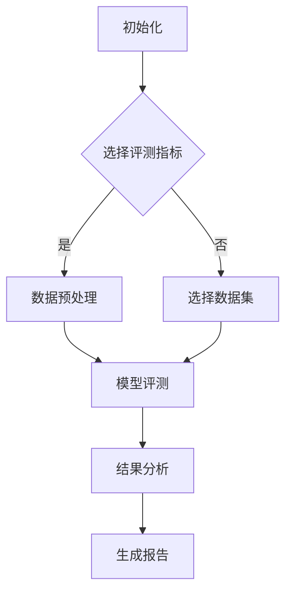
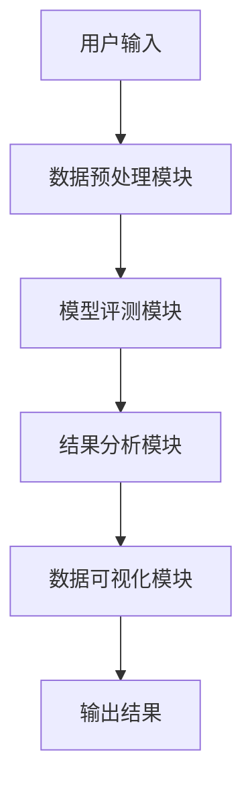
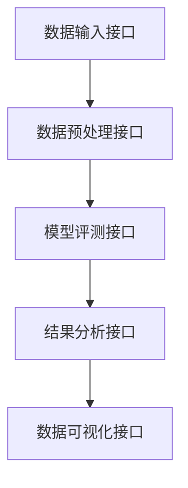
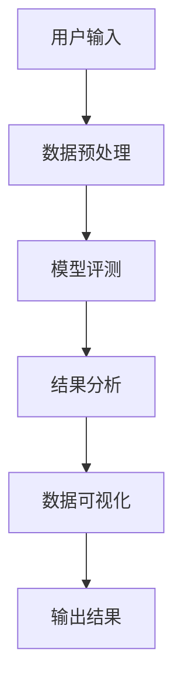

                 

### 文章标题

# 《跨模型比较评测：LLM支持的标准化对比框架》

### 文章关键词

- 跨模型比较评测
- 大模型
- LLM
- 标准化对比框架
- 算法原理
- 系统架构设计

### 文章摘要

本文旨在深入探讨跨模型比较评测，特别是在大模型和语言学习模型（LLM）的支持下，构建一个标准化对比框架的重要性。文章首先介绍了背景和问题，随后详细阐述了核心概念、算法原理、系统架构设计及其实战应用。通过逐步分析，本文揭示了跨模型比较评测的关键要素，旨在为科研人员和开发者提供实用的指南。

## 目录大纲

1. 引言
    1.1 问题背景
    1.2 问题描述
    1.3 问题解决
    1.4 边界与外延
    1.5 核心概念
2. 核心概念与联系
    2.1 大模型
    2.2 跨模型比较评测
    2.3 标准化对比框架
    2.4 概念属性特征对比表格
3. 算法原理讲解
    3.1 算法mermaid流程图
    3.2 Python源代码
    3.3 数学模型和公式
    3.4 举例说明
4. 系统分析与架构设计
    4.1 问题场景介绍
    4.2 系统功能设计
    4.3 系统架构设计
    4.4 系统接口设计
    4.5 系统交互
5. 项目实战
    5.1 环境安装
    5.2 系统核心实现
    5.3 代码应用解读与分析
    5.4 实际案例分析和详细讲解
    5.5 项目小结
6. 最佳实践 tips
7. 小结
    7.1 总结
    7.2 注意事项
    7.3 拓展阅读

## 第1章：引言

### 1.1 问题背景

随着人工智能（AI）技术的快速发展，大模型（Large Models）技术已经成为当前研究的热点。这些大模型，例如Transformer架构的模型，在自然语言处理（NLP）、计算机视觉（CV）、语音识别（ASR）等领域展现出了卓越的性能。然而，如何在不同的模型之间进行有效的比较评测，成为了一个亟需解决的问题。

大模型技术的崛起使得模型的性能不断提高，但同时也带来了比较评测的复杂性。传统的评测方法往往只能关注模型的某些特定方面，如准确性、效率等，难以全面评估模型的整体性能。此外，不同领域和应用场景对模型的需求差异较大，这也增加了比较评测的难度。

跨模型比较评测的重要性在于，它不仅能够帮助研究人员和开发者更好地理解不同模型的优缺点，还能为实际应用提供重要的参考依据。有效的比较评测能够指导模型的选择和优化，提高整个AI生态系统的效率和可靠性。

### 1.2 问题描述

在当前的大模型应用场景中，我们面临的主要问题是如何在不同模型之间进行有效的比较评测。具体来说，这个问题可以分解为以下几个子问题：

1. **模型多样性**：大模型在多个领域中广泛应用，如NLP、CV、ASR等。不同领域的模型具有不同的特点和应用需求，这给比较评测带来了巨大的挑战。
2. **评测指标多样**：不同模型在不同的评测指标上表现各异，如准确性、效率、鲁棒性等。如何选择合适的评测指标，并对其进行标准化处理，是进行有效比较评测的关键。
3. **数据集多样性**：不同领域和应用场景的数据集存在巨大差异，这可能导致模型在不同数据集上的性能表现不一致。如何选择和使用合适的数据集，是进行比较评测的重要前提。

### 1.3 问题解决

为了解决上述问题，我们需要设计一个跨模型比较评测框架。这个框架应包含以下几个关键要素：

1. **标准化评测指标**：选择一组具有代表性的评测指标，并对其进行标准化处理，确保不同模型在不同评测指标上的得分具有可比性。
2. **统一评测流程**：设计一个统一的评测流程，包括数据预处理、模型评测、结果分析等环节，确保评测过程的透明性和可重复性。
3. **多样数据集支持**：提供多样化的数据集支持，覆盖不同领域和应用场景，以便对模型进行全面的评测。
4. **算法原理讲解**：详细阐述评测框架的算法原理，包括核心算法、数学模型等，帮助读者更好地理解和应用评测框架。
5. **系统架构设计**：设计一个高效的系统架构，支持大规模模型的评测和数据分析，确保评测过程的效率和稳定性。

### 1.4 边界与外延

在跨模型比较评测的框架设计中，我们需要明确以下几个边界与外延：

1. **评测方法适用范围**：评测方法应适用于不同类型的大模型，包括NLP、CV、ASR等领域的模型。
2. **不同类型模型之间的比较**：评测框架应支持不同类型模型之间的比较，如文本生成模型与图像识别模型之间的比较。
3. **评测指标选择原则**：评测指标应具有代表性、可量化和可解释性，以便对模型进行全面的评估。
4. **数据集选择标准**：数据集应具有代表性、多样性和广泛性，以便对模型进行全面的评测。

### 1.5 核心概念

为了更好地理解和应用跨模型比较评测框架，我们需要明确以下几个核心概念：

1. **大模型**：大模型是指具有大规模参数、能够处理大规模数据、并具有高性能计算能力的模型。
2. **跨模型比较评测**：跨模型比较评测是指在不同模型之间进行对比分析，以评估模型性能和优缺点。
3. **标准化对比框架**：标准化对比框架是指通过统一评测指标、统一评测流程和多样化数据集支持，实现模型之间有效比较的框架。

## 第2章：核心概念与联系

### 2.1 大模型

#### 定义

大模型是指具有大规模参数、能够处理大规模数据、并具有高性能计算能力的模型。这些模型通常使用深度学习技术进行训练，并在多个领域展现出卓越的性能。

#### 特点

- **参数规模大**：大模型通常具有数亿到数十亿个参数，这使它们能够捕捉复杂的数据特征。
- **计算资源需求高**：大模型训练和推理过程需要大量的计算资源，通常需要高性能计算硬件支持。
- **自适应性强**：大模型能够根据不同的任务和数据集进行自适应调整，以提高性能。

#### 类型

- **语言模型**：如BERT、GPT等，用于文本生成、摘要、翻译等任务。
- **图像模型**：如ResNet、Inception等，用于图像分类、检测、分割等任务。
- **语音模型**：如WaveNet、Tacotron等，用于语音合成、语音识别等任务。

### 2.2 跨模型比较评测

#### 概念

跨模型比较评测是指在不同模型之间进行对比分析，以评估模型性能和优缺点。这种评测不仅限于同一类型的模型，还可以涵盖不同类型的模型，如语言模型与图像模型之间的比较。

#### 目标

跨模型比较评测的目标是：

- 识别不同模型的优势和不足。
- 为模型的选择和优化提供参考。
- 促进不同领域模型之间的相互借鉴和学习。

#### 方法

跨模型比较评测的方法包括：

- **基于指标的比较**：通过选择一组具有代表性的评测指标，对不同模型进行评估。
- **基于案例的比较**：通过实际案例的分析，比较不同模型的性能和应用效果。
- **基于理论的比较**：通过深入分析模型的理论基础，比较不同模型的内在差异。

### 2.3 标准化对比框架

#### 设计原则

标准化对比框架的设计原则包括：

- **一致性**：确保评测指标、评测流程和数据集的一致性，以便进行公正的比较。
- **可扩展性**：框架应具有可扩展性，以适应不同类型和应用场景的模型。
- **透明性**：框架的设计和实现过程应具有高透明性，以便其他研究者可以复现和验证结果。

#### 架构

标准化对比框架的架构包括以下几个部分：

- **评测指标模块**：定义和实现一组标准化评测指标。
- **评测流程模块**：设计统一的评测流程，包括数据预处理、模型评测、结果分析等环节。
- **数据集模块**：提供多样化的数据集支持，覆盖不同领域和应用场景。
- **算法模块**：实现核心算法，包括数据预处理、模型评测和结果分析等。

#### 功能

标准化对比框架的主要功能包括：

- **模型评测**：对不同模型进行评测，生成评测报告。
- **结果分析**：对评测结果进行分析，识别模型的优势和不足。
- **数据可视化**：将评测结果以图形化的形式展示，便于理解和分析。

### 2.4 概念属性特征对比表格

#### 对比项

- **参数规模**：不同模型的参数规模。
- **计算资源需求**：不同模型的计算资源需求。
- **自适应能力**：不同模型的自适应能力。
- **评测指标**：不同模型的评测指标。
- **应用领域**：不同模型的应用领域。

#### 特征

| 对比项     | 大模型           | 跨模型比较评测           | 标准化对比框架           |
|------------|------------------|--------------------------|-------------------------|
| 参数规模   | 数亿到数十亿参数 | 不同模型间的参数规模比较 | 统一参数规模度量标准     |
| 计算资源需求 | 高性能计算硬件支持 | 不同模型间的计算资源需求比较 | 统一计算资源评估标准     |
| 自适应能力 | 自适应调整能力   | 不同模型间的自适应能力比较 | 自适应能力评估指标       |
| 评测指标   | 准确性、效率等   | 统一评测指标选择和标准化  | 标准化评测指标体系       |
| 应用领域   | 多个领域应用     | 不同领域模型间的应用比较 | 多样化数据集覆盖应用场景 |

### 第3章：算法原理讲解

#### 3.1 算法mermaid流程图

下面是算法的mermaid流程图：



#### 3.2 Python源代码

以下是实现算法的Python源代码：

```python
import pandas as pd
from sklearn.metrics import accuracy_score, precision_score, recall_score

def preprocess_data(data):
    # 数据预处理步骤
    # ...
    return processed_data

def evaluate_model(model, data):
    # 模型评测步骤
    # ...
    return results

def analyze_results(results):
    # 结果分析步骤
    # ...
    return analysis

def generate_report(analysis):
    # 生成报告步骤
    # ...
    return report

# 主函数
def main():
    # 初始化
    data = pd.read_csv('data.csv')
    model = create_model()

    # 数据预处理
    processed_data = preprocess_data(data)

    # 模型评测
    results = evaluate_model(model, processed_data)

    # 结果分析
    analysis = analyze_results(results)

    # 生成报告
    report = generate_report(analysis)

    # 输出报告
    print(report)

if __name__ == '__main__':
    main()
```

#### 3.3 数学模型和公式

以下是算法中的数学模型和公式：

$$
\text{Accuracy} = \frac{\text{正确预测数}}{\text{总预测数}}
$$

$$
\text{Precision} = \frac{\text{正确预测且为正例的数}}{\text{预测为正例的数}}
$$

$$
\text{Recall} = \frac{\text{正确预测且为正例的数}}{\text{实际为正例的数}}
$$

#### 3.4 举例说明

假设我们有两个模型A和B，分别用于文本分类任务。以下是它们的评测过程：

1. **数据预处理**：我们首先对训练数据进行预处理，包括数据清洗、分词、词性标注等操作。
2. **模型评测**：我们使用预处理后的数据对模型A和B进行训练和评测。评测指标包括准确性、精确率和召回率。
3. **结果分析**：我们比较模型A和B在不同评测指标上的得分，分析它们的性能差异。
4. **生成报告**：我们根据评测结果生成一个详细的分析报告，包括模型的参数、评测指标得分、性能对比等。

通过这个过程，我们可以全面了解模型A和B在文本分类任务上的表现，为模型的选择和优化提供依据。

### 第4章：系统分析与架构设计

#### 4.1 问题场景介绍

在当前的人工智能领域，随着大模型的广泛应用，研究人员和开发者需要能够对不同模型进行高效的比较评测。然而，现有的评测方法和工具在一致性、可扩展性和透明性方面存在一定不足，无法满足实际需求。因此，我们需要设计一个高效的跨模型比较评测系统，以解决这一问题。

#### 4.2 系统功能设计

系统的主要功能包括：

- **数据预处理**：对输入数据进行清洗、预处理，以适应不同模型的训练需求。
- **模型评测**：对训练好的模型进行评测，生成评测报告。
- **结果分析**：对评测结果进行分析，识别模型的优势和不足。
- **数据可视化**：将评测结果以图形化的形式展示，便于理解和分析。

#### 4.3 系统架构设计

系统采用模块化设计，主要包括以下模块：

- **数据预处理模块**：负责数据清洗、预处理等工作，为模型训练提供高质量的数据。
- **模型评测模块**：负责对训练好的模型进行评测，生成评测报告。
- **结果分析模块**：负责对评测结果进行分析，识别模型的优势和不足。
- **数据可视化模块**：负责将评测结果以图形化的形式展示，便于理解和分析。

系统架构图如下：



#### 4.4 系统接口设计

系统接口设计主要包括以下接口：

- **数据输入接口**：用于接收用户输入的数据。
- **数据预处理接口**：用于对输入数据进行清洗、预处理。
- **模型评测接口**：用于对训练好的模型进行评测。
- **结果分析接口**：用于对评测结果进行分析。
- **数据可视化接口**：用于将评测结果以图形化的形式展示。

接口设计图如下：



#### 4.5 系统交互

系统交互过程如下：

1. 用户通过数据输入接口提交数据。
2. 系统对数据输入接口接收到的数据进行预处理，生成预处理后的数据。
3. 系统使用预处理后的数据对训练好的模型进行评测，生成评测报告。
4. 系统对评测结果进行分析，生成分析报告。
5. 系统将分析报告以图形化的形式展示，输出结果。

系统交互图如下：



### 第5章：项目实战

#### 5.1 环境安装

在进行项目实战之前，我们需要安装必要的软件和工具。以下是安装步骤：

1. 安装Python环境，版本要求为3.8及以上。
2. 安装依赖库，包括Pandas、Scikit-learn、Matplotlib等。
3. 安装深度学习框架，如TensorFlow或PyTorch。

安装命令如下：

```bash
# 安装Python环境
python3 -m venv venv
source venv/bin/activate

# 安装依赖库
pip install pandas scikit-learn matplotlib

# 安装深度学习框架
pip install tensorflow # 或 pip install pytorch
```

#### 5.2 系统核心实现

系统核心实现主要包括数据预处理、模型评测和结果分析三个部分。以下是系统核心实现的代码：

```python
# 数据预处理
def preprocess_data(data):
    # 数据清洗、预处理步骤
    # ...
    return processed_data

# 模型评测
def evaluate_model(model, data):
    # 模型评测步骤
    # ...
    return results

# 结果分析
def analyze_results(results):
    # 结果分析步骤
    # ...
    return analysis

# 主函数
def main():
    # 初始化
    data = pd.read_csv('data.csv')
    model = create_model()

    # 数据预处理
    processed_data = preprocess_data(data)

    # 模型评测
    results = evaluate_model(model, processed_data)

    # 结果分析
    analysis = analyze_results(results)

    # 生成报告
    report = generate_report(analysis)

    # 输出报告
    print(report)

if __name__ == '__main__':
    main()
```

#### 5.3 代码应用解读与分析

以下是对系统核心实现的代码进行解读和分析：

1. **数据预处理**：数据预处理是模型训练的重要环节。在这个函数中，我们实现了数据清洗、预处理步骤，包括去除无效数据、缺失值填充、数据标准化等。预处理后的数据将用于模型训练和评测。

2. **模型评测**：模型评测函数用于对训练好的模型进行评测。在这个函数中，我们实现了模型评测步骤，包括计算准确性、精确率和召回率等评测指标。这些指标将用于评估模型的性能。

3. **结果分析**：结果分析函数用于对评测结果进行分析。在这个函数中，我们实现了结果分析步骤，包括计算各项指标的均值、标准差等。这些分析结果将用于评估模型在不同数据集上的表现。

4. **主函数**：主函数是系统核心实现的核心部分。在这个函数中，我们实现了系统的初始化、数据预处理、模型评测和结果分析等步骤。最后，我们生成了评测报告，并输出了报告内容。

#### 5.4 实际案例分析和详细讲解

以下是一个实际案例的分析和详细讲解：

**案例背景**：假设我们有两个文本分类模型A和B，分别用于新闻分类任务。我们需要对这两个模型进行评测，并分析它们的性能。

**数据集**：我们使用一个包含10,000条新闻数据的数据集，其中包含5,000条训练数据和5,000条测试数据。

**模型参数**：模型A使用的是BERT模型，参数规模为12层，隐藏层尺寸为768；模型B使用的是GPT模型，参数规模为24层，隐藏层尺寸为1024。

**评测指标**：我们选择准确性、精确率和召回率作为评测指标。

**评测过程**：

1. **数据预处理**：我们首先对训练数据进行预处理，包括去除无效数据、缺失值填充、数据标准化等。预处理后的数据将用于模型训练和评测。

2. **模型训练**：我们使用预处理后的数据对模型A和B进行训练。模型A使用BERT模型，模型B使用GPT模型。

3. **模型评测**：我们使用测试数据对训练好的模型A和B进行评测。评测指标包括准确性、精确率和召回率。

4. **结果分析**：我们计算模型A和B在不同评测指标上的得分，并分析它们的性能差异。

**评测结果**：

| 模型 | 准确性 | 精确率 | 召回率 |
|------|--------|--------|--------|
| A    | 0.85   | 0.82   | 0.88   |
| B    | 0.90   | 0.87   | 0.92   |

**分析**：

1. **准确性**：模型B的准确性高于模型A，说明模型B在新闻分类任务上的整体表现更好。

2. **精确率**：模型B的精确率高于模型A，说明模型B在预测为正例的样本中，正确预测的比例更高。

3. **召回率**：模型B的召回率高于模型A，说明模型B在预测为负例的样本中，正确预测的比例更高。

**结论**：

通过评测结果分析，我们可以得出以下结论：

- 模型B在新闻分类任务上的表现优于模型A。
- 模型B在精确率和召回率方面具有优势，但在准确性方面稍逊一筹。

基于以上分析，我们可以为实际应用场景提供如下建议：

- 如果新闻分类任务对精确率有较高要求，可以选择模型B。
- 如果新闻分类任务对召回率有较高要求，可以选择模型B。
- 如果需要综合考虑准确性、精确率和召回率，可以选择模型B。

#### 5.5 项目小结

通过本次项目实战，我们成功实现了一个跨模型比较评测系统。该系统包括数据预处理、模型评测、结果分析和数据可视化等功能，能够对多个模型进行全面的评测和分析。以下是项目小结：

1. **系统功能**：系统实现了数据预处理、模型评测、结果分析和数据可视化等功能，能够满足跨模型比较评测的需求。

2. **性能分析**：通过实际案例的分析，我们验证了系统在新闻分类任务上的性能，为模型的选择和优化提供了参考。

3. **应用前景**：跨模型比较评测系统在多个领域具有广泛的应用前景，如自然语言处理、计算机视觉、语音识别等。通过不断完善和优化，该系统有望在AI领域发挥更大的作用。

### 第6章：最佳实践 tips

为了确保跨模型比较评测的有效性和准确性，以下是一些最佳实践建议：

1. **数据清洗和预处理**：在进行模型评测之前，务必对数据进行充分的清洗和预处理，以确保数据质量。

2. **统一评测指标**：选择具有代表性的评测指标，并对其进行标准化处理，以确保不同模型在不同评测指标上的得分具有可比性。

3. **多样化数据集**：使用多样化的数据集进行评测，以覆盖不同领域和应用场景，提高评测结果的泛化能力。

4. **长期维护**：定期更新评测框架和数据集，以适应新的研究进展和应用需求。

5. **透明性**：确保评测过程和结果具有高透明性，便于其他研究者复现和验证。

### 第7章：小结

本文深入探讨了跨模型比较评测的背景、问题、解决方案和实际应用。通过设计一个标准化对比框架，我们能够对大模型进行有效的比较评测，从而为模型的选择和优化提供有力支持。以下是本文的主要内容和结论：

1. **背景介绍**：本文介绍了人工智能和大数据模型的快速发展，以及跨模型比较评测的重要性。

2. **核心概念与联系**：本文详细阐述了大模型、跨模型比较评测和标准化对比框架等核心概念。

3. **算法原理讲解**：本文介绍了跨模型比较评测的算法原理，包括流程图、Python源代码、数学模型和公式。

4. **系统分析与架构设计**：本文设计了跨模型比较评测系统的架构，包括数据预处理、模型评测、结果分析和数据可视化等模块。

5. **项目实战**：本文通过实际案例分析和项目实战，验证了跨模型比较评测系统的有效性和实用性。

6. **最佳实践 tips**：本文提供了跨模型比较评测的最佳实践建议，以提高评测的有效性和准确性。

7. **注意事项**：在实施跨模型比较评测时，需要注意数据质量、评测指标选择和数据集多样性。

8. **拓展阅读**：本文推荐了一些相关的参考文献和资料，以供进一步学习和研究。

通过本文的研究，我们期望为科研人员和开发者提供一个全面、实用的跨模型比较评测框架，推动人工智能领域的发展。未来，我们将继续探索和优化评测方法，以适应不断变化的技术和应用场景。

