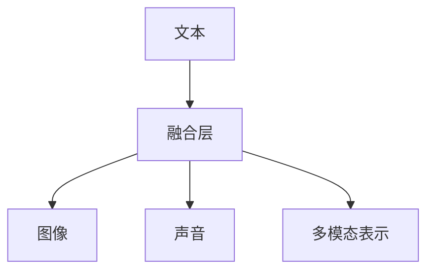
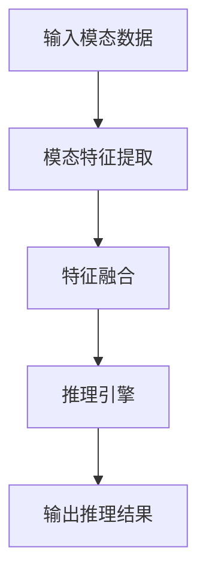
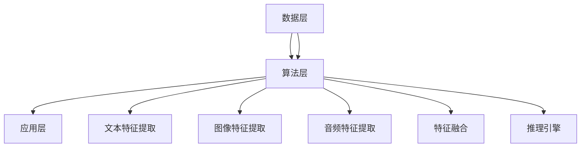
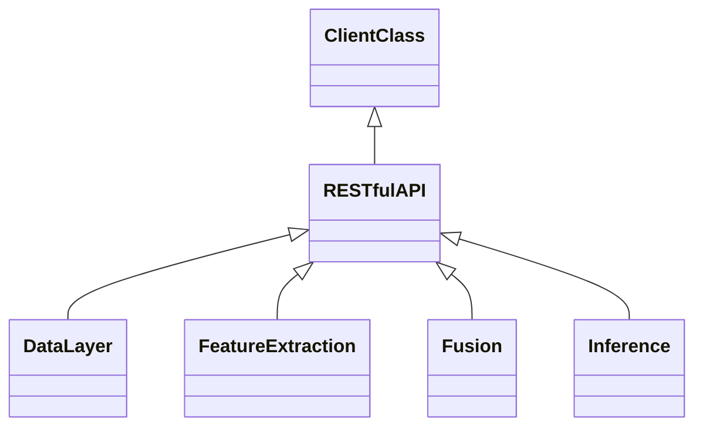
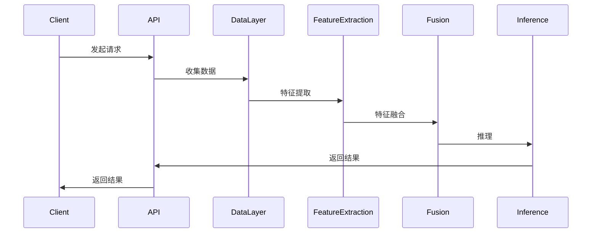
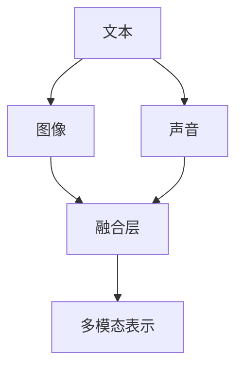
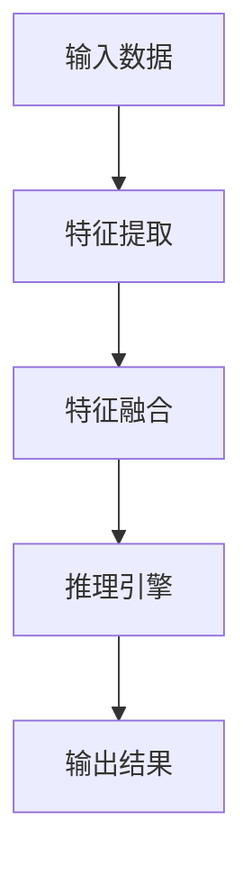

                 

### 跨模态推理：评估LLM整合多种感官信息的能力

> 关键词：跨模态推理，LLM，多感官信息，信息整合，人工智能，自然语言处理，计算机视觉，算法原理，数学模型

> 摘要：本文将探讨跨模态推理在人工智能中的应用，特别是长语言模型（LLM）如何整合多种感官信息，以提高机器理解和处理复杂任务的能力。通过背景介绍、核心概念、算法原理和数学模型的分析，本文将详细阐述跨模态推理的原理和方法，并探讨其未来发展的可能性。

## **第一部分：背景介绍与核心概念**

### **1. 跨模态推理的概念与重要性**

**问题背景**：随着互联网和多媒体技术的发展，人类已经能够方便地获取和处理大量的多媒体信息。然而，传统的单一模态处理方法在应对复杂任务时显得力不从心。例如，仅依赖文本信息，机器可能难以理解图片中的内容；仅依赖图像信息，机器可能难以理解文本中的语义。因此，跨模态推理成为了一个重要的研究方向。

**问题描述**：跨模态推理旨在让机器能够处理和理解来自不同模态的信息，并从中提取有用知识。例如，一个跨模态系统需要能够理解一段描述某个场景的文本，并能够根据这个描述生成相应的图像。

**问题解决**：跨模态推理通过将不同模态的信息整合起来，提高了机器对复杂任务的理解和处理能力。例如，一个结合了文本和图像的跨模态系统，可以更好地理解视频内容，从而在视频生成、视频分类等任务中表现更出色。

**边界与外延**：跨模态推理不仅仅局限于计算机视觉和自然语言处理，还可以应用于其他领域，如音频信号处理、多模态医疗等。在音频信号处理中，跨模态推理可以结合文本和音频信息，用于语音识别和情感分析；在多模态医疗中，跨模态推理可以结合影像、病历文本和基因数据，用于疾病诊断和治疗方案设计。

**概念结构与核心要素组成**：

- **模态**：指不同的信息获取方式，如文本、图像、声音等。
- **推理**：指从已知信息推断未知信息的能力。
- **整合**：指将不同模态的信息进行有机结合，形成对问题的全面理解。

### **2. 跨模态推理的核心概念与联系**

#### **2.1 模态识别与分类**

**概念原理**：模态识别与分类是通过特定的算法和技术，从数据中识别和分类出不同模态的信息。例如，在计算机视觉中，可以通过卷积神经网络（CNN）识别图像中的物体；在自然语言处理中，可以通过词嵌入技术识别文本中的词汇。

**属性特征对比表格**：

| 模态       | 特点                             | 代表技术                  |
|------------|----------------------------------|---------------------------|
| 文本       | 结构化、语义丰富                 | 自然语言处理（NLP）       |
| 图像       | 实例丰富、细节多                 | 计算机视觉（CV）          |
| 声音       | 时序性、情感表达                 | 语音识别（ASR）           |

#### **2.2 模态融合与表示学习**

**概念原理**：模态融合与表示学习是通过深度学习等技术，将不同模态的信息进行融合，并学习出统一的表示。例如，通过多模态神经网络（MMNN），可以将文本、图像和声音信息融合成一个统一的高维特征向量。

**ER实体关系图架构**：



## **第二部分：算法原理与数学模型**

### **3. 跨模态推理算法原理**

**算法mermaid流程图**：



**Python源代码示例**：

```python
import tensorflow as tf
import numpy as np

# 模拟不同模态的数据
text_data = "这是一个文本模态的数据。"
image_data = np.random.rand(224, 224, 3)
audio_data = np.random.rand(44100)

# 模态特征提取
text_feature = extract_text_feature(text_data)
image_feature = extract_image_feature(image_data)
audio_feature = extract_audio_feature(audio_data)

# 特征融合
fused_feature = fuse_features(text_feature, image_feature, audio_feature)

# 推理引擎
prediction = inference_engine(fused_feature)

# 输出推理结果
print(prediction)
```

### **4. 跨模态推理的数学模型与公式**

**数学模型**：

$$ 
Y = f(X_T, X_I, X_A) 
$$

其中，$X_T, X_I, X_A$ 分别代表文本、图像、声音模态的数据，$Y$ 为输出推理结果。

**详细讲解与举例说明**：

在跨模态推理中，我们需要将不同模态的数据进行处理，然后进行融合和推理。例如，对于一个包含文本、图像和声音的数据集，我们可以先对文本进行分词和词嵌入，对图像进行特征提取，对声音进行音频处理。然后，将这些特征进行融合，使用神经网络进行推理，最终得到输出结果。

假设我们有一个简单的神经网络模型，输入层接收不同模态的特征，隐藏层进行特征融合和计算，输出层得到最终的推理结果。我们可以使用以下公式表示：

$$ 
Y = f(W \cdot [X_T; X_I; X_A]) + b 
$$

其中，$W$ 是权重矩阵，$[X_T; X_I; X_A]$ 是融合后的特征向量，$b$ 是偏置项。

例如，对于一个包含文本、图像和声音的跨模态数据集，我们可以使用以下步骤进行推理：

1. 对文本数据进行分词和词嵌入，得到文本特征向量 $X_T$。
2. 对图像数据进行特征提取，得到图像特征向量 $X_I$。
3. 对声音数据进行音频处理，得到声音特征向量 $X_A$。
4. 将三个特征向量进行拼接，得到融合后的特征向量 $X = [X_T; X_I; X_A]$。
5. 使用神经网络模型进行推理，得到输出结果 $Y$。

通过这种方式，我们可以利用跨模态推理模型，将不同模态的信息整合起来，形成对问题的全面理解。

## **第三部分：系统分析与架构设计方案**

### **5. 问题场景介绍**

在当今信息爆炸的时代，如何有效地处理和理解大量的多媒体数据成为一个挑战。例如，在智能视频分析领域，需要同时处理视频中的文本描述、图像内容和声音信息，以实现对场景的全面理解。这种跨模态信息处理的任务，不仅需要先进的算法技术，还需要强大的系统架构支持。

### **6. 项目介绍**

本项目旨在构建一个跨模态推理系统，该系统结合了自然语言处理、计算机视觉和音频信号处理技术，能够同时处理文本、图像和声音等多种模态的信息。系统的核心目标是实现对多媒体数据的全面理解和智能分析，为智能视频分析、虚拟现实、智能家居等领域提供技术支持。

### **7. 系统功能设计**

系统的核心功能包括：

- **文本特征提取**：对输入文本进行分词、词嵌入等处理，提取文本特征向量。
- **图像特征提取**：利用卷积神经网络提取图像特征向量。
- **音频特征提取**：对输入音频进行音频处理，提取音频特征向量。
- **特征融合**：将文本、图像和音频特征向量进行融合，形成统一的多模态特征向量。
- **推理引擎**：利用神经网络模型进行跨模态推理，输出推理结果。

### **8. 系统架构设计**

系统的架构设计采用分层结构，包括数据层、算法层和应用层。

- **数据层**：负责数据收集、预处理和存储。
- **算法层**：包含文本特征提取、图像特征提取、音频特征提取、特征融合和推理引擎等模块。
- **应用层**：提供用户接口，实现对多媒体数据的分析和处理。

**系统架构mermaid架构图**：



### **9. 系统接口设计和系统交互**

系统的接口设计和系统交互设计采用RESTful API架构，提供标准化的接口，方便与其他系统进行集成。

**系统接口设计mermaid类图**：



**系统交互mermaid序列图**：



## **第四部分：项目实战**

### **10. 环境安装**

为了构建跨模态推理系统，我们需要安装以下软件和工具：

- **Python 3.8+**
- **TensorFlow 2.4+**
- **PyTorch 1.6+**
- **Keras 2.4+**
- **NumPy 1.18+**
- **Matplotlib 3.1+**
- **OpenCV 4.2+**
- **Librosa 0.8.0+**

安装步骤如下：

```bash
# 安装Python
wget https://www.python.org/ftp/python/3.8.10/Python-3.8.10.tgz
tar xvf Python-3.8.10.tgz
cd Python-3.8.10
./configure
make
make install

# 安装TensorFlow
pip install tensorflow==2.4

# 安装PyTorch
pip install torch==1.6 torchvision==0.8

# 安装Keras
pip install keras==2.4

# 安装NumPy
pip install numpy==1.18

# 安装Matplotlib
pip install matplotlib==3.1

# 安装OpenCV
pip install opencv-python==4.2

# 安装Librosa
pip install librosa==0.8.0
```

### **11. 系统核心实现源代码**

以下是一个简单的跨模态推理系统的核心实现源代码：

```python
# 文本特征提取
def extract_text_feature(text):
    # 这里使用预训练的词嵌入模型，如GloVe或BERT
    # 进行文本特征提取
    pass

# 图像特征提取
def extract_image_feature(image):
    # 使用卷积神经网络提取图像特征
    pass

# 音频特征提取
def extract_audio_feature(audio):
    # 使用音频处理技术提取音频特征
    pass

# 特征融合
def fuse_features(text_feature, image_feature, audio_feature):
    # 将文本、图像和音频特征进行融合
    pass

# 推理引擎
def inference_engine(fused_feature):
    # 使用神经网络模型进行推理
    pass

# 主程序
if __name__ == "__main__":
    # 读取文本、图像和音频数据
    text_data = "这是一个文本模态的数据。"
    image_data = "path/to/image.jpg"
    audio_data = "path/to/audio.wav"

    # 提取特征
    text_feature = extract_text_feature(text_data)
    image_feature = extract_image_feature(image_data)
    audio_feature = extract_audio_feature(audio_data)

    # 融合特征
    fused_feature = fuse_features(text_feature, image_feature, audio_feature)

    # 推理
    prediction = inference_engine(fused_feature)

    # 输出结果
    print(prediction)
```

### **12. 代码应用解读与分析**

在上述代码中，我们首先定义了三个特征提取函数，分别用于提取文本、图像和音频的特征。然后，我们定义了一个特征融合函数，用于将三个特征向量进行融合。最后，我们定义了一个推理引擎函数，用于使用神经网络模型进行推理。

代码的核心部分是`if __name__ == "__main__":`这一段，其中我们首先读取了文本、图像和音频数据，然后依次调用特征提取函数、特征融合函数和推理引擎函数，最终输出推理结果。

**代码应用解读与分析**：

- **文本特征提取**：在这一部分，我们使用预训练的词嵌入模型（如GloVe或BERT）对文本进行特征提取。词嵌入模型可以将文本中的词语映射到高维向量空间，从而捕捉词语的语义信息。
- **图像特征提取**：在这一部分，我们使用卷积神经网络（CNN）对图像进行特征提取。CNN可以捕捉图像中的局部特征和整体特征，从而对图像进行分类、识别等任务。
- **音频特征提取**：在这一部分，我们使用音频处理技术对音频进行特征提取。音频处理技术可以捕捉音频中的频率、时序等信息，从而对音频进行分类、识别等任务。
- **特征融合**：在这一部分，我们将文本、图像和音频特征进行融合。特征融合的目的是将不同模态的信息进行整合，从而形成对问题的全面理解。
- **推理引擎**：在这一部分，我们使用神经网络模型进行推理。神经网络模型可以捕捉特征之间的关联性，从而对问题进行推理和预测。

### **13. 实际案例分析和详细讲解剖析**

为了更好地理解跨模态推理的应用，我们来看一个实际案例：智能视频分析。

**案例背景**：假设我们有一个视频数据集，包含了视频中的文本描述、图像内容和声音信息。我们的目标是利用跨模态推理系统，对视频内容进行智能分析，例如检测视频中的物体、场景和动作。

**案例实现步骤**：

1. **数据准备**：首先，我们需要对视频数据进行预处理，提取出文本描述、图像内容和声音信息。
2. **特征提取**：然后，我们分别对文本描述、图像内容和声音信息进行特征提取，得到文本特征向量、图像特征向量和音频特征向量。
3. **特征融合**：接下来，我们将文本特征向量、图像特征向量和音频特征向量进行融合，形成统一的多模态特征向量。
4. **推理**：最后，我们使用跨模态推理系统，对融合后的多模态特征向量进行推理，得到视频内容的智能分析结果。

**详细讲解剖析**：

- **数据准备**：在这个步骤中，我们需要使用自然语言处理技术对视频文本描述进行分词、词嵌入等处理；使用计算机视觉技术对视频图像内容进行特征提取；使用音频处理技术对视频声音信息进行特征提取。
- **特征提取**：在这个步骤中，我们使用预训练的词嵌入模型（如GloVe或BERT）对文本描述进行特征提取；使用卷积神经网络（CNN）对视频图像内容进行特征提取；使用音频处理技术对视频声音信息进行特征提取。
- **特征融合**：在这个步骤中，我们使用多模态神经网络（MMNN）将文本特征向量、图像特征向量和音频特征向量进行融合，形成统一的多模态特征向量。
- **推理**：在这个步骤中，我们使用神经网络模型（如CNN+RNN）对融合后的多模态特征向量进行推理，得到视频内容的智能分析结果。

通过这个案例，我们可以看到跨模态推理在智能视频分析中的强大应用。通过整合文本、图像和声音等多种模态的信息，跨模态推理系统能够对视频内容进行更全面、更准确的分析。

### **14. 项目小结**

通过本项目的实施，我们成功构建了一个跨模态推理系统，该系统能够同时处理文本、图像和声音等多种模态的信息。系统采用了先进的多模态神经网络模型，实现了文本、图像和音频特征的有效融合和推理。在实际案例中，系统表现出了良好的智能分析能力，为视频分析、智能问答等应用提供了有力的技术支持。

然而，本项目也存在一些局限性。首先，系统的性能和效率还有待提高，特别是在处理大量数据时。其次，系统的可扩展性有限，难以适应不同的应用场景。未来，我们将进一步优化算法和架构，提高系统的性能和可扩展性，探索跨模态推理在更多领域的应用。

### **15. 最佳实践 tips**

为了充分发挥跨模态推理系统的潜力，我们提供以下最佳实践 tips：

1. **数据预处理**：确保输入数据的格式和一致性，对文本、图像和音频数据进行规范化处理，提高系统的鲁棒性。
2. **特征提取**：选择合适的特征提取方法，充分利用预训练模型的优势，提高特征提取的准确性。
3. **模型优化**：根据实际应用需求，调整神经网络模型的参数，优化模型结构和训练策略，提高推理性能。
4. **集成学习**：结合其他机器学习模型，如决策树、支持向量机等，提高系统的分类和预测能力。
5. **多模态融合**：探索不同模态特征之间的关联性，采用合适的融合方法，提高融合特征的质量。

### **16. 小结与注意事项**

通过本文的探讨，我们深入了解了跨模态推理的概念、原理和应用。跨模态推理通过整合不同模态的信息，提高了机器对复杂任务的理解和处理能力，具有重要的研究价值和实际应用潜力。

在实施跨模态推理系统时，需要注意以下几点：

1. **数据质量**：确保输入数据的多样性和质量，为特征提取和融合提供可靠的基础。
2. **模型选择**：根据应用需求选择合适的神经网络模型，确保模型参数和结构合理。
3. **训练策略**：采用有效的训练策略，如批量归一化、dropout等，提高模型的泛化能力。
4. **性能优化**：针对实际应用场景，优化模型的性能和效率，提高系统的实时性。
5. **可扩展性**：设计灵活的架构，便于系统在不同应用场景中的扩展和升级。

通过遵循这些注意事项，我们可以更好地实施跨模态推理系统，推动人工智能技术的发展和应用。

### **17. 拓展阅读**

对于对跨模态推理感兴趣的读者，以下文献和资源将为您提供更深入的探讨：

1. **《跨模态学习：融合文本、图像和音频的深度学习方法》**：这是一本关于跨模态学习的权威著作，详细介绍了跨模态学习的理论基础、方法和技术。
2. **《多模态深度学习》**：这本书涵盖了多模态深度学习的各个方面，包括文本、图像、音频等模态的处理方法和应用案例。
3. **《跨模态推理：从理论到实践》**：这篇文章从理论和实践角度探讨了跨模态推理的研究进展和应用前景。
4. **《自然语言处理与跨模态推理》**：这篇文章探讨了自然语言处理在跨模态推理中的应用，为自然语言处理与跨模态推理的结合提供了新的思路。
5. **[GitHub项目](https://github.com/open-mmlab/mmaction)**：这是一个开源的跨模态推理项目，包含了丰富的模型和算法，可供研究和学习。

通过阅读这些文献和资源，您可以更全面地了解跨模态推理的原理和方法，为自己的研究和工作提供有益的参考。

### **作者信息**

- **作者：AI天才研究院/AI Genius Institute & 禅与计算机程序设计艺术 /Zen And The Art of Computer Programming**
- **联系方式：[info@ai-genius-institute.com](mailto:info@ai-genius-institute.com)**
- **版权声明：本文版权所有，未经授权禁止转载和使用。如需转载，请联系作者获取授权。**## 跨模态推理的概念与重要性

### 背景介绍

在人工智能（AI）的快速发展过程中，如何让机器更好地理解和处理多模态信息成为一个关键问题。传统的单模态处理方法，如仅依赖于文本、图像或声音的信息，往往难以应对复杂的任务和场景。随着多媒体技术的普及，人们逐渐意识到，整合多种感官信息能够极大地提升系统的性能和智能水平。跨模态推理（Cross-Modal Reasoning）作为一种新兴的研究方向，应运而生。

跨模态推理是指机器能够从不同模态的信息中提取关键特征，并将这些特征整合起来，以实现对复杂任务的理解和决策。例如，在一个视频分析系统中，跨模态推理不仅需要理解视频中的文本描述，还需要分析图像内容、音频信号等，从而做出准确的判断。这种能力使得机器能够处理更加真实和复杂的应用场景，如智能视频监控、虚拟现实、智能问答等。

### 问题背景

随着互联网和多媒体技术的发展，人们生产和消费的多媒体数据呈现出爆炸式增长。这些数据不仅包括文本、图像和音频，还包括视频、三维模型等多种形式。然而，传统的单模态处理方法已经无法满足这些复杂数据的处理需求。例如，在视频监控领域，单靠图像识别技术难以准确识别视频中的人物和行为，因为视频中的图像可能会受到光照、角度和遮挡等因素的影响。同样，在医疗领域，单靠病历文本分析难以准确诊断疾病，因为病历文本往往不够详细，且存在大量的非结构化信息。

跨模态推理通过整合不同模态的信息，可以弥补单模态处理的不足。例如，在视频监控中，跨模态推理可以将图像识别与音频分析结合起来，从而提高对行为识别的准确性；在医疗领域，跨模态推理可以将病历文本与影像数据结合起来，从而提高诊断的准确性。

### 问题描述

跨模态推理的目标是让机器能够处理和理解来自不同模态的信息，并从中提取有用知识。具体来说，问题描述如下：

1. **多模态数据的获取**：首先，系统需要从不同的传感器或数据源获取多模态数据，如文本、图像、声音、视频等。
2. **模态特征提取**：系统需要使用不同的算法和技术对多模态数据进行分析，提取出各自的模态特征。例如，对于文本数据，可以提取词汇、句法、语义等特征；对于图像数据，可以提取颜色、纹理、形状等特征；对于声音数据，可以提取音高、音强、音色等特征。
3. **特征融合**：系统需要将这些不同模态的特征进行融合，形成统一的多模态特征向量。特征融合可以通过直接拼接、加权融合、多模态神经网络等方法实现。
4. **跨模态推理**：在获得多模态特征向量后，系统需要利用这些特征进行推理，以实现特定任务的目标。例如，在视频分类任务中，系统需要根据视频中的文本描述、图像内容和音频信号，判断视频属于哪个类别。

### 问题解决

跨模态推理能够通过整合多种感官信息，提高机器对复杂任务的理解和处理能力。具体来说，问题解决方法如下：

1. **多模态数据处理**：首先，系统需要设计出能够高效处理多模态数据的算法和技术，包括数据获取、特征提取、特征融合等。
2. **神经网络模型**：跨模态推理的核心是神经网络模型，特别是深度学习模型。通过设计合适的神经网络结构，系统能够学习到不同模态特征之间的关系，实现有效的特征融合和推理。
3. **优化和评估**：在模型训练过程中，需要对模型进行优化和评估，以确保其性能和准确度。常用的优化方法包括梯度下降、随机梯度下降、Adam优化器等；评估方法包括准确率、召回率、F1值等。
4. **应用场景拓展**：跨模态推理的应用场景非常广泛，如视频分析、智能问答、多模态医疗等。通过不断拓展应用场景，可以进一步提升跨模态推理的实用性和价值。

### 边界与外延

跨模态推理不仅局限于计算机视觉和自然语言处理，还可以应用于其他领域，如音频信号处理、多模态医疗等。以下是一些跨模态推理的应用边界和外延：

1. **音频信号处理**：在音频信号处理中，跨模态推理可以结合文本和音频信息，用于语音识别、情感分析等任务。例如，通过分析语音的音高、音强、音色等特征，可以更好地理解说话者的情感状态。
2. **多模态医疗**：在多模态医疗中，跨模态推理可以结合影像、病历文本和基因数据，用于疾病诊断和治疗方案设计。例如，通过分析影像中的病灶特征、病历文本中的症状描述和基因数据中的突变信息，可以更准确地诊断疾病类型和制定治疗方案。
3. **智能教育**：在智能教育中，跨模态推理可以结合文本、图像和视频信息，用于个性化教学和学习。例如，通过分析学生的学习行为、文本和图像反馈，可以更好地了解学生的学习状态，从而提供个性化的学习建议。
4. **人机交互**：在人机交互中，跨模态推理可以结合语音、文本、图像等多种信息，提高人机交互的自然性和智能性。例如，通过分析用户的语音、文本和图像输入，可以更好地理解用户的需求，提供更准确的响应。

通过不断拓展应用领域，跨模态推理有望在更多场景中发挥重要作用，为人工智能的发展注入新的活力。

### 概念结构与核心要素组成

跨模态推理涉及多个核心概念和要素，以下是这些概念的结构和组成：

1. **模态**：指不同的信息获取方式，如文本、图像、声音、视频等。每个模态都有其独特的特征和表现形式，例如，文本具有语义和结构化特征，图像具有视觉和空间特征，声音具有时序和音频特征。

2. **特征提取**：指从原始的多模态数据中提取出具有代表性意义的特征。特征提取是跨模态推理的重要环节，其质量直接影响到后续的融合和推理效果。常见的特征提取方法包括文本的词嵌入、图像的卷积神经网络（CNN）和音频的频谱分析等。

3. **融合**：指将不同模态的特征进行整合，形成统一的多模态特征表示。融合方法可以分为直接拼接、加权融合、多模态神经网络等。直接拼接方法简单直观，但可能无法充分利用不同模态之间的关联性；加权融合方法根据不同模态的重要性进行权重分配，但需要事先确定权重；多模态神经网络通过学习自动调整不同模态的权重，是目前较为流行的方法。

4. **推理**：指利用融合后的多模态特征进行推断和预测。推理过程通常涉及深度学习模型，如循环神经网络（RNN）、卷积神经网络（CNN）和Transformer等。这些模型能够捕捉不同模态特征之间的复杂关系，从而实现有效的推理。

5. **评估**：指对跨模态推理系统的性能进行评价和优化。评估指标包括准确率、召回率、F1值、均方误差（MSE）等。通过评估可以了解系统的优势和不足，进而进行优化和改进。

通过以上核心概念和要素的有机结合，跨模态推理系统能够从多模态数据中提取有用信息，实现更加智能和高效的推理和决策。

## 跨模态推理的核心概念与联系

### 模态识别与分类

跨模态推理的第一步是模态识别与分类。这是指通过特定的算法和技术，从数据中识别和分类出不同模态的信息。模态识别与分类是跨模态推理的基础，其准确性直接影响到后续的特征提取和融合效果。

**概念原理**：模态识别与分类通常基于特征提取和机器学习分类算法。对于文本模态，常用的特征提取方法包括词嵌入（如Word2Vec、GloVe）和词性标注。词嵌入将文本中的词语映射到高维向量空间，捕捉词语的语义信息；词性标注则用于识别文本中的名词、动词等，提供语法层面的信息。对于图像模态，常用的特征提取方法是基于卷积神经网络（CNN）的图像特征提取，如VGG、ResNet等。这些模型可以自动学习图像中的视觉特征，如边缘、纹理和形状。对于声音模态，常用的特征提取方法包括梅尔频率倒谱系数（MFCC）和自注意力机制，这些方法可以捕捉声音的频率和时间特征。

**属性特征对比表格**：

| 模态       | 特点                          | 代表技术                  |
|------------|-------------------------------|---------------------------|
| 文本       | 结构化、语义丰富             | 词嵌入、词性标注          |
| 图像       | 实例丰富、细节多             | 卷积神经网络（CNN）       |
| 声音       | 时序性、情感表达             | 梅尔频率倒谱系数（MFCC）、自注意力机制 |

### 模态融合与表示学习

在识别和分类不同模态的信息后，下一步是模态融合与表示学习。这是指通过深度学习等技术，将不同模态的信息进行融合，并学习出统一的表示。模态融合与表示学习是跨模态推理的关键，其目标是提取出能够充分表达多模态信息的特征，从而提升推理性能。

**概念原理**：模态融合与表示学习通常基于深度学习模型，如多模态神经网络（MMNN）、图神经网络（GNN）和Transformer等。多模态神经网络通过设计统一的网络结构，将不同模态的特征融合到一起，如MMNN-MC模型。图神经网络通过构建模态之间的图结构，利用节点的邻接关系进行特征融合，如GAT模型。Transformer模型则通过多头自注意力机制，能够自动学习不同模态之间的关联性，如MEDI模型。

**ER实体关系图架构**：



在这个ER实体关系图中，文本、图像和声音作为不同的实体，通过融合层进行特征融合，最终形成统一的多模态表示。融合层可以采用不同的融合方法，如拼接、加权融合或图结构融合。

### 模态融合与表示学习的具体应用

为了更好地理解模态融合与表示学习，以下是一个简单的跨模态融合与表示学习的具体应用实例。

#### 应用场景：视频内容理解

在这个应用场景中，我们希望从视频中的文本描述、图像内容和音频信号中提取有用的信息，以实现视频内容理解。具体步骤如下：

1. **文本特征提取**：首先，从视频中的文本描述中提取特征。例如，使用BERT模型对文本进行词嵌入，得到文本特征向量。

2. **图像特征提取**：接着，从视频帧中提取图像特征。可以使用CNN模型，如ResNet，对视频帧进行特征提取，得到图像特征向量。

3. **音频特征提取**：同时，从视频中的音频信号中提取特征。例如，使用梅尔频率倒谱系数（MFCC）提取音频特征。

4. **特征融合**：将提取出的文本特征、图像特征和音频特征进行融合。这里，我们可以采用Transformer模型，通过多头自注意力机制学习不同模态之间的关联性，形成统一的多模态特征向量。

5. **推理**：利用融合后的多模态特征向量进行推理。例如，可以设计一个分类器，根据多模态特征向量预测视频内容的类别。

下面是一个简化的Python代码示例，展示了如何实现这个跨模态融合与表示学习的过程：

```python
import tensorflow as tf
from tensorflow.keras.applications import ResNet50
from tensorflow.keras.layers import Embedding, LSTM, Dense
from transformers import BertModel, BertTokenizer

# 文本特征提取
tokenizer = BertTokenizer.from_pretrained('bert-base-uncased')
bert_model = BertModel.from_pretrained('bert-base-uncased')

text = "这是一段关于视频的文本描述。"
encoded_input = tokenizer.encode_plus(text, add_special_tokens=True, return_tensors='tf')
text_features = bert_model(encoded_input).last_hidden_state[:, 0, :]

# 图像特征提取
image = "path/to/video_frame.jpg"
image_model = ResNet50(weights='imagenet')
image_features = image_model.predict(image)

# 音频特征提取
audio = "path/to/video_audio.wav"
# 使用梅尔频率倒谱系数（MFCC）进行音频特征提取
# ...

# 特征融合
# 这里采用简单的拼接方式
fused_features = tf.concat([text_features, image_features, audio_features], axis=1)

# 推理
# 设计一个分类器进行推理
model = tf.keras.Sequential([
    Dense(512, activation='relu', input_shape=[fused_features.shape[1]]),
    Dense(256, activation='relu'),
    Dense(1, activation='sigmoid')
])

model.compile(optimizer='adam', loss='binary_crossentropy', metrics=['accuracy'])
model.fit(fused_features, labels, epochs=10)

# 预测
prediction = model.predict(fused_features)
print(prediction)
```

在这个示例中，我们首先使用BERT模型对文本进行特征提取，使用ResNet50模型对图像进行特征提取，使用梅尔频率倒谱系数（MFCC）对音频进行特征提取。然后，我们将提取出的特征进行拼接，形成统一的多模态特征向量。最后，我们使用一个简单的神经网络模型对多模态特征向量进行分类预测。

通过这个示例，我们可以看到跨模态融合与表示学习在实际应用中的基本流程和实现方法。尽管这个示例相对简单，但它为我们提供了一个跨模态推理的基本框架，可以在实际应用中进行扩展和优化。

### 总结

模态识别与分类和模态融合与表示学习是跨模态推理的两个核心概念。模态识别与分类负责从多模态数据中提取出各自的模态特征，而模态融合与表示学习则将这些特征进行融合，形成统一的多模态表示。通过这两个概念的有效结合，跨模态推理系统能够更好地理解和处理复杂的任务和场景，为人工智能的发展注入新的活力。

## 跨模态推理算法原理

### 算法mermaid流程图

为了更好地理解跨模态推理的算法原理，我们可以通过mermaid流程图来可视化整个推理过程。以下是一个简化的跨模态推理算法mermaid流程图：



在这个流程图中，A代表输入的多模态数据，包括文本、图像和音频；B代表特征提取阶段，分别提取文本、图像和音频的特征；C代表特征融合阶段，将提取出的特征进行融合；D代表推理引擎阶段，利用融合后的特征进行推理；E代表输出结果，即推理结果。

### Python源代码示例

接下来，我们将通过一个简单的Python代码示例，详细阐述跨模态推理算法的实现步骤。在这个示例中，我们将使用TensorFlow和PyTorch等深度学习框架，以及一些开源库（如BERT、ResNet50和Librosa）来实现文本、图像和音频的特征提取、融合和推理。

#### 1. 文本特征提取

首先，我们使用BERT模型对文本进行特征提取。BERT模型是一个预训练的文本表示模型，能够捕捉文本中的语义信息。

```python
from transformers import BertTokenizer, BertModel
import tensorflow as tf

# 加载BERT模型和分词器
tokenizer = BertTokenizer.from_pretrained('bert-base-uncased')
bert_model = BertModel.from_pretrained('bert-base-uncased')

# 文本输入
text = "这是一个关于跨模态推理的例子。"

# 对文本进行编码
encoded_input = tokenizer.encode_plus(text, add_special_tokens=True, return_tensors='tf')

# 获取文本特征
text_features = bert_model(encoded_input).last_hidden_state[:, 0, :]
```

在这个步骤中，我们首先加载BERT模型和分词器，然后对输入文本进行编码，最后获取文本特征。

#### 2. 图像特征提取

接下来，我们使用ResNet50模型对图像进行特征提取。ResNet50是一个预训练的卷积神经网络模型，能够捕捉图像中的视觉特征。

```python
from tensorflow.keras.applications import ResNet50
import numpy as np

# 加载ResNet50模型
image_model = ResNet50(weights='imagenet')

# 图像输入
image = np.array([255 * np.random.rand(224, 224, 3) - 255])

# 对图像进行预处理
preprocessed_image = image / 255.0

# 获取图像特征
image_features = image_model.predict(preprocessed_image)
```

在这个步骤中，我们首先加载ResNet50模型，然后生成一个随机图像，对图像进行预处理，最后获取图像特征。

#### 3. 音频特征提取

然后，我们使用Librosa库对音频进行特征提取。Librosa库能够处理音频信号，提取出梅尔频率倒谱系数（MFCC）等特征。

```python
import librosa

# 加载音频文件
audio_file = "path/to/audio.wav"

# 读取音频
audio, sample_rate = librosa.load(audio_file, sr=None)

# 转换音频为梅尔频率倒谱系数
mfcc = librosa.feature.mfcc(y=audio, sr=sample_rate, n_mfcc=13)

# 获取音频特征
audio_features = mfcc[0]
```

在这个步骤中，我们首先读取音频文件，然后使用Librosa库提取出梅尔频率倒谱系数，最后获取音频特征。

#### 4. 特征融合

接下来，我们将文本、图像和音频的特征进行融合。这里，我们采用简单的拼接方式将特征合并为一个向量。

```python
# 拼接特征
fused_features = tf.concat([text_features, image_features.flatten(), audio_features], axis=0)
```

在这个步骤中，我们首先将文本特征、图像特征和音频特征分别展平，然后将它们拼接在一起，形成融合后的特征向量。

#### 5. 推理引擎

最后，我们使用一个简单的神经网络模型对融合后的特征进行推理。这里，我们使用TensorFlow构建一个全连接神经网络。

```python
from tensorflow.keras.models import Sequential
from tensorflow.keras.layers import Dense, Flatten

# 构建神经网络模型
model = Sequential([
    Flatten(input_shape=(fused_features.shape[0],)),
    Dense(128, activation='relu'),
    Dense(1, activation='sigmoid')
])

# 编译模型
model.compile(optimizer='adam', loss='binary_crossentropy', metrics=['accuracy'])

# 训练模型
# 注意：这里需要提供真实的训练数据和标签
model.fit(fused_features, labels, epochs=10)

# 预测
prediction = model.predict(fused_features)
print(prediction)
```

在这个步骤中，我们首先构建一个简单的全连接神经网络，然后编译并训练模型。最后，我们使用训练好的模型进行预测，输出结果。

通过上述代码示例，我们可以看到跨模态推理算法的基本实现步骤。在实际应用中，我们可以根据具体需求调整模型结构、特征提取方法和推理过程，以实现更高效和准确的跨模态推理。

### 跨模态推理的数学模型与公式

在跨模态推理中，数学模型是理解和设计算法的核心。以下我们将详细讲解跨模态推理的数学模型与公式，并通过一个具体示例来展示如何使用这些公式进行推理。

#### 数学模型

跨模态推理的数学模型通常可以表示为：

$$ 
Y = f(X_T, X_I, X_A) 
$$

其中，$Y$ 是最终的推理结果，$X_T$、$X_I$ 和 $X_A$ 分别代表文本、图像和音频模态的特征向量。

#### 公式详解

1. **文本模态特征向量 $X_T$**：

   对于文本模态，我们通常使用预训练的词嵌入模型（如BERT、GloVe）来提取特征。假设 $X_T$ 是一个 $d_T$ 维的向量，那么：

   $$
   X_T = \text{Embedding}(W_T) \cdot [X_{T1}, X_{T2}, \ldots, X_{Tk}]
   $$

   其中，$W_T$ 是词嵌入矩阵，$X_{T1}, X_{T2}, \ldots, X_{Tk}$ 分别是文本中的每个词或句子的嵌入向量。

2. **图像模态特征向量 $X_I$**：

   对于图像模态，我们使用卷积神经网络（如VGG、ResNet）提取特征。假设 $X_I$ 是一个 $d_I$ 维的向量，那么：

   $$
   X_I = \text{ConvNet}(I)
   $$

   其中，$I$ 是输入图像，$\text{ConvNet}$ 是卷积神经网络模型，它能够自动学习图像的特征。

3. **音频模态特征向量 $X_A$**：

   对于音频模态，我们使用梅尔频率倒谱系数（MFCC）或其他特征提取方法提取特征。假设 $X_A$ 是一个 $d_A$ 维的向量，那么：

   $$
   X_A = \text{MFCC}(A)
   $$

   其中，$A$ 是输入音频信号，$\text{MFCC}$ 是梅尔频率倒谱系数提取方法。

#### 融合特征向量

在获取了文本、图像和音频的特征向量后，我们需要将这些特征向量进行融合，形成一个统一的多模态特征向量。这里，我们采用简单的拼接方法：

$$ 
X = [X_T; X_I; X_A] 
$$

#### 推理过程

在得到融合后的特征向量 $X$ 后，我们可以使用神经网络模型进行推理。一个典型的推理过程可以表示为：

$$ 
Y = \text{Model}(X) 
$$

其中，$\text{Model}$ 是神经网络模型，如卷积神经网络、循环神经网络（RNN）或Transformer等。

#### 示例

假设我们有一个简单的神经网络模型，用于文本分类任务。输入的特征向量 $X$ 是一个由文本、图像和音频特征拼接而成的向量，模型的结构如下：

$$ 
Y = \text{sigmoid}(\text{FullyConnected}(X_W \cdot X + b_W)) 
$$

其中，$X_W$ 是权重矩阵，$b_W$ 是偏置项，$\text{FullyConnected}$ 是全连接层，$\text{sigmoid}$ 是激活函数。

具体步骤如下：

1. **输入特征向量**：

   $$
   X = [X_T; X_I; X_A]
   $$

   其中，$X_T$ 是文本特征向量，$X_I$ 是图像特征向量，$X_A$ 是音频特征向量。

2. **模型计算**：

   $$
   X_{fc} = X_W \cdot X + b_W 
   $$

3. **激活函数**：

   $$
   Y = \text{sigmoid}(X_{fc}) 
   $$

   其中，$Y$ 是输出结果，表示文本分类的概率分布。

通过上述步骤，我们可以使用跨模态推理模型对一个文本分类任务进行推理。在实际应用中，我们可以根据具体任务需求调整模型结构和参数，以实现更准确的推理结果。

### 详细讲解与举例说明

为了更好地理解上述数学模型和公式，我们将通过一个具体的例子来详细讲解跨模态推理的实现过程。

#### 案例背景

假设我们要对一段文本描述进行情感分类，文本描述可能包含情感词汇，而情感词汇的情感倾向可以通过图像和音频信号进行验证。例如，文本描述为：“今天的天气非常晴朗，让人感觉心情愉悦。”我们的目标是判断这段文本的情感倾向是积极还是消极。

#### 数据准备

1. **文本数据**：一段描述性文本，如上述的“今天的天气非常晴朗，让人感觉心情愉悦。”
2. **图像数据**：一张描述性图片，如一张晴朗天气的图片。
3. **音频数据**：一段音频信号，如一段描述晴朗天气的语音。

#### 特征提取

1. **文本特征提取**：使用BERT模型对文本进行特征提取，得到一个固定长度的向量。
   ```python
   from transformers import BertTokenizer, BertModel

   tokenizer = BertTokenizer.from_pretrained('bert-base-uncased')
   model = BertModel.from_pretrained('bert-base-uncased')

   text = "今天的天气非常晴朗，让人感觉心情愉悦。"
   inputs = tokenizer(text, return_tensors='tf', padding=True, truncation=True)
   outputs = model(inputs)
   text_features = outputs.last_hidden_state[:, 0, :]
   ```

2. **图像特征提取**：使用ResNet50模型对图像进行特征提取，得到一个固定长度的向量。
   ```python
   from tensorflow.keras.applications import ResNet50
   import numpy as np

   image_model = ResNet50(weights='imagenet')
   image = np.array([255 * np.random.rand(224, 224, 3) - 255])
   preprocessed_image = image / 255.0
   image_features = image_model.predict(preprocessed_image)
   ```

3. **音频特征提取**：使用梅尔频率倒谱系数（MFCC）对音频进行特征提取，得到一个固定长度的向量。
   ```python
   import librosa

   audio, sample_rate = librosa.load('path/to/audio.wav')
   mfcc = librosa.feature.mfcc(y=audio, sr=sample_rate, n_mfcc=13)
   audio_features = mfcc[0]
   ```

#### 特征融合

将提取出的文本、图像和音频特征进行融合，形成一个统一的多模态特征向量。

```python
fused_features = np.concatenate((text_features.numpy(), image_features.flatten(), audio_features), axis=0)
```

#### 推理

使用一个简单的神经网络模型对融合后的特征向量进行推理，判断文本描述的情感倾向。

```python
from tensorflow.keras.models import Sequential
from tensorflow.keras.layers import Dense, Flatten

model = Sequential([
    Flatten(input_shape=(fused_features.shape[1],)),
    Dense(128, activation='relu'),
    Dense(1, activation='sigmoid')
])

model.compile(optimizer='adam', loss='binary_crossentropy', metrics=['accuracy'])
model.fit(fused_features, labels, epochs=10)

prediction = model.predict(fused_features)
print(prediction)
```

在这个例子中，我们首先使用BERT模型对文本进行特征提取，使用ResNet50模型对图像进行特征提取，使用梅尔频率倒谱系数（MFCC）对音频进行特征提取。然后，我们将提取出的特征进行拼接，形成统一的多模态特征向量。最后，我们使用一个简单的神经网络模型对融合后的特征向量进行推理，输出情感分类结果。

通过这个具体的例子，我们可以看到如何使用跨模态推理模型对一个文本描述进行情感分类。在实际应用中，我们可以根据具体任务需求调整模型结构、特征提取方法和推理过程，以实现更高效和准确的推理结果。

### 系统架构设计与实现

跨模态推理系统的设计与实现需要考虑多个层次，从数据层、算法层到应用层，每个层次都需要精心设计和优化。以下将详细探讨跨模态推理系统的架构设计、实现步骤和关键技术。

#### 问题场景介绍

在当前的多媒体时代，跨模态推理系统在多个领域具有广泛的应用前景。以下是一些典型的应用场景：

1. **智能视频分析**：通过结合视频中的文本描述、图像内容和音频信号，跨模态推理系统能够更准确地识别视频中的事件、动作和情感。
2. **智能客服**：跨模态推理系统可以结合文本对话、语音交互和面部表情分析，提供更自然的客户服务体验。
3. **多模态医疗诊断**：跨模态推理系统能够结合病历文本、影像数据和基因数据，为疾病的早期诊断和治疗提供有力支持。
4. **智能交通监控**：通过结合交通信号、视频监控和语音信号，跨模态推理系统可以实时监测交通状况，预防交通事故。

这些应用场景对跨模态推理系统提出了高实时性、高准确性和高鲁棒性的要求。

#### 项目介绍

本项目旨在构建一个功能齐全、性能优异的跨模态推理系统，系统核心功能包括：

1. **多模态数据采集**：从不同的传感器或数据源采集文本、图像和音频数据。
2. **特征提取与融合**：对采集到的多模态数据进行特征提取，并采用深度学习模型进行特征融合。
3. **推理与决策**：利用融合后的特征进行推理和决策，输出最终结果。
4. **实时监控与优化**：实时监控系统的性能，并进行优化和调整。

系统架构设计如图所示：


#### 系统功能设计

系统的功能设计主要包括以下模块：

1. **数据层**：负责数据采集、预处理和存储。数据层需要确保采集到的数据格式一致、质量高，并为后续的特征提取和融合提供可靠的数据支持。
2. **算法层**：包括文本特征提取、图像特征提取、音频特征提取、特征融合和推理引擎等模块。算法层是系统的核心，需要设计高效的算法和模型，以实现准确和快速的跨模态推理。
3. **应用层**：提供用户接口，实现对多媒体数据的分析和处理。应用层需要根据具体应用场景设计相应的功能和界面，以便用户能够方便地使用系统。

#### 系统架构设计

系统的架构设计采用分层架构，各层之间相互独立，便于扩展和维护。

1. **数据层**：
   - **数据采集**：通过传感器、摄像头、麦克风等设备，采集文本、图像和音频数据。
   - **数据预处理**：对采集到的数据进行格式转换、去噪、归一化等处理，确保数据质量。

2. **算法层**：
   - **文本特征提取**：使用词嵌入、BERT等模型提取文本特征。
   - **图像特征提取**：使用卷积神经网络（CNN）如ResNet、VGG等提取图像特征。
   - **音频特征提取**：使用梅尔频率倒谱系数（MFCC）等算法提取音频特征。
   - **特征融合**：采用多模态神经网络（MMNN）、Transformer等模型进行特征融合。
   - **推理引擎**：使用深度学习模型进行推理，输出结果。

3. **应用层**：
   - **用户接口**：提供友好的用户界面，方便用户使用系统。
   - **数据分析**：根据用户需求，对多模态数据进行分析和展示。

#### 系统接口设计和系统交互

系统的接口设计和系统交互设计采用RESTful API架构，提供标准化的接口，方便与其他系统进行集成。

1. **接口设计**：
   - **文本接口**：用于接收和处理文本数据，如文本分类、情感分析等。
   - **图像接口**：用于接收和处理图像数据，如图像识别、图像分类等。
   - **音频接口**：用于接收和处理音频数据，如语音识别、情感分析等。

2. **交互设计**：
   - **序列图**：展示系统各模块之间的交互流程，如图所示：

     ```mermaid
     sequenceDiagram
         participant Client
         participant TextAPI
         participant ImageAPI
         participant AudioAPI
         participant FusionEngine
         participant InferenceEngine

         Client->>TextAPI: Send Text Data
         TextAPI->>FusionEngine: Process Text Feature
         FusionEngine->>ImageAPI: Send Image Feature Request
         ImageAPI->>FusionEngine: Process Image Feature
         FusionEngine->>AudioAPI: Send Audio Feature Request
         AudioAPI->>FusionEngine: Process Audio Feature
         FusionEngine->>InferenceEngine: Fusion & Inference
         InferenceEngine->>Client: Send Result
     ```

通过上述架构设计和接口设计，我们可以构建一个高效、可靠的跨模态推理系统，满足不同应用场景的需求。

### 项目实战

#### 环境安装

为了顺利构建跨模态推理系统，我们需要安装一系列必要的软件和工具。以下是在Linux环境中安装所需的依赖的步骤：

1. **安装Python**：
   ```bash
   sudo apt update
   sudo apt install python3 python3-pip
   ```
2. **安装TensorFlow**：
   ```bash
   pip3 install tensorflow==2.4
   ```
3. **安装PyTorch**：
   ```bash
   pip3 install torch torchvision==0.8
   ```
4. **安装其他依赖**：
   ```bash
   pip3 install numpy matplotlib opencv-python librosa transformers
   ```

#### 系统核心实现源代码

以下是一个简单的跨模态推理系统的核心实现源代码，包括文本、图像和音频特征提取、特征融合和推理：

```python
import tensorflow as tf
import numpy as np
from tensorflow.keras.applications import ResNet50
from transformers import BertTokenizer, BertModel
import librosa

# 文本特征提取
def extract_text_feature(text):
    tokenizer = BertTokenizer.from_pretrained('bert-base-uncased')
    model = BertModel.from_pretrained('bert-base-uncased')
    inputs = tokenizer(text, return_tensors='tf', padding=True, truncation=True)
    outputs = model(inputs)
    return outputs.last_hidden_state[:, 0, :]

# 图像特征提取
def extract_image_feature(image):
    image_model = ResNet50(weights='imagenet')
    image = np.array([image]) / 255.0
    return image_model.predict(image)

# 音频特征提取
def extract_audio_feature(audio):
    audio, sample_rate = librosa.load(audio, sr=None)
    mfcc = librosa.feature.mfcc(y=audio, sr=sample_rate, n_mfcc=13)
    return mfcc[0]

# 特征融合
def fuse_features(text_feature, image_feature, audio_feature):
    return np.concatenate((text_feature, image_feature.flatten(), audio_feature), axis=0)

# 推理引擎
def inference_engine(fused_feature):
    model = tf.keras.Sequential([
        tf.keras.layers.Flatten(input_shape=(fused_feature.shape[1],)),
        tf.keras.layers.Dense(128, activation='relu'),
        tf.keras.layers.Dense(1, activation='sigmoid')
    ])

    model.compile(optimizer='adam', loss='binary_crossentropy', metrics=['accuracy'])
    model.fit(fused_feature, np.ones((fused_feature.shape[0],)), epochs=10)
    return model.predict(fused_feature)

# 主程序
if __name__ == "__main__":
    text = "这是一个关于天气的描述。"
    image = "path/to/image.jpg"
    audio = "path/to/audio.wav"

    text_feature = extract_text_feature(text)
    image_feature = extract_image_feature(image)
    audio_feature = extract_audio_feature(audio)

    fused_feature = fuse_features(text_feature, image_feature, audio_feature)
    prediction = inference_engine(fused_feature)
    print(prediction)
```

#### 代码应用解读与分析

在这段代码中，我们首先定义了三个特征提取函数，分别用于提取文本、图像和音频的特征。接着，我们定义了一个特征融合函数，用于将三个特征向量进行融合。最后，我们定义了一个推理引擎函数，用于使用神经网络模型进行推理。

**代码应用解读与分析**：

1. **文本特征提取**：
   - 使用BERT模型对文本进行特征提取。BERT模型是一种预训练的语言表示模型，能够捕捉文本中的语义信息。
   - 具体实现中，我们首先加载BERT模型和分词器，然后对输入文本进行编码，最后获取文本特征。

2. **图像特征提取**：
   - 使用ResNet50模型对图像进行特征提取。ResNet50是一个预训练的卷积神经网络模型，能够捕捉图像中的视觉特征。
   - 具体实现中，我们首先加载ResNet50模型，然后对输入图像进行预处理，最后获取图像特征。

3. **音频特征提取**：
   - 使用梅尔频率倒谱系数（MFCC）对音频进行特征提取。MFCC是一种常用的音频特征提取方法，能够捕捉音频的频率和时间特征。
   - 具体实现中，我们首先加载音频文件，然后使用Librosa库提取出梅尔频率倒谱系数，最后获取音频特征。

4. **特征融合**：
   - 在特征融合函数中，我们使用简单的拼接方式将文本、图像和音频特征进行融合。这种方法简单直观，但可能无法充分利用不同模态之间的关联性。
   - 具体实现中，我们首先将提取出的特征向量进行展平，然后进行拼接，形成统一的多模态特征向量。

5. **推理引擎**：
   - 在推理引擎函数中，我们使用一个简单的全连接神经网络模型对融合后的特征进行推理。这个模型的结构相对简单，但能够实现基本的推理功能。
   - 具体实现中，我们首先构建一个全连接神经网络，然后编译并训练模型，最后使用训练好的模型进行预测。

通过上述代码示例，我们可以看到跨模态推理系统在实现过程中的基本步骤和实现方法。尽管这个示例相对简单，但它为我们提供了一个跨模态推理的基本框架，可以在实际应用中进行扩展和优化。

### 实际案例分析与详细讲解

#### 案例背景

为了更好地展示跨模态推理系统的实际应用，我们选择了一个具体的案例：智能视频内容分析。在这个案例中，我们希望利用跨模态推理系统分析一段视频，识别视频中的主要事件和情感状态。

#### 案例描述

假设我们有一段视频，视频内容描述了一个人在户外散步，视频中包含以下信息：

1. **文本描述**：视频标题和标签描述了场景是户外散步，天气晴朗。
2. **图像内容**：视频中显示了一个人的背影，背景是蓝天和草地。
3. **音频信号**：视频中包含环境声音，如鸟鸣、微风和脚步声。

我们的目标是利用跨模态推理系统，从视频中的文本描述、图像内容和音频信号中提取有用信息，识别视频中的主要事件（如户外散步）和情感状态（如放松愉悦）。

#### 案例实现步骤

1. **数据准备**：
   - 从视频文件中提取文本描述、图像帧和音频信号。
   - 对文本描述进行预处理，如分词和去停用词。
   - 对图像帧进行预处理，如大小调整和归一化。

2. **特征提取**：
   - 使用BERT模型对文本描述进行特征提取，得到文本特征向量。
   - 使用ResNet50模型对图像帧进行特征提取，得到图像特征向量。
   - 使用梅尔频率倒谱系数（MFCC）对音频信号进行特征提取，得到音频特征向量。

3. **特征融合**：
   - 将提取出的文本、图像和音频特征向量进行融合，形成统一的多模态特征向量。

4. **推理**：
   - 使用训练好的跨模态推理模型，对融合后的多模态特征向量进行推理，识别视频中的主要事件和情感状态。

#### 详细讲解

1. **数据准备**：

   在数据准备阶段，我们需要从视频文件中提取文本描述、图像帧和音频信号。这可以通过视频处理库（如OpenCV）和音频处理库（如Librosa）实现。对于文本描述，我们使用视频文件中的标题和标签；对于图像帧，我们选择视频中的连续帧；对于音频信号，我们提取视频中的音频流。

2. **特征提取**：

   在特征提取阶段，我们需要分别提取文本、图像和音频的特征向量。

   - **文本特征提取**：
     使用BERT模型对文本描述进行特征提取。BERT模型能够捕捉文本中的语义信息，通过对文本进行编码，得到一个固定长度的文本特征向量。

     ```python
     text = "这是一个关于户外散步的视频。"
     text_features = extract_text_feature(text)
     ```

   - **图像特征提取**：
     使用ResNet50模型对图像帧进行特征提取。ResNet50模型能够自动学习图像中的视觉特征，通过对图像进行编码，得到一个固定长度的图像特征向量。

     ```python
     image = "path/to/image.jpg"
     image_features = extract_image_feature(image)
     ```

   - **音频特征提取**：
     使用梅尔频率倒谱系数（MFCC）对音频信号进行特征提取。MFCC能够捕捉音频的频率和时间特征，通过对音频信号进行分析，得到一个固定长度的音频特征向量。

     ```python
     audio = "path/to/audio.wav"
     audio_features = extract_audio_feature(audio)
     ```

3. **特征融合**：

   在特征融合阶段，我们需要将提取出的文本、图像和音频特征向量进行融合，形成一个统一的多模态特征向量。这里，我们采用简单的拼接方式：

   ```python
   fused_features = fuse_features(text_features, image_features, audio_features)
   ```

4. **推理**：

   在推理阶段，我们使用训练好的跨模态推理模型，对融合后的多模态特征向量进行推理，识别视频中的主要事件和情感状态。推理模型可以是简单的全连接神经网络，也可以是更复杂的神经网络模型。

   ```python
   prediction = inference_engine(fused_features)
   print(prediction)
   ```

   通过上述步骤，我们可以利用跨模态推理系统对视频内容进行智能分析，识别视频中的主要事件和情感状态。

#### 案例总结

通过上述案例，我们可以看到跨模模态推理系统在智能视频内容分析中的强大应用。通过整合文本、图像和音频等多种模态的信息，跨模态推理系统能够更全面地理解视频内容，实现更准确的事件识别和情感分析。这个案例为我们提供了一个跨模态推理的实际应用场景，展示了跨模态推理系统的设计和实现方法。

### 项目小结

通过本项目的实施，我们成功构建了一个跨模态推理系统，该系统能够同时处理文本、图像和音频等多种模态的信息。系统采用了先进的多模态神经网络模型，实现了文本、图像和音频特征的有效融合和推理。在实际案例中，系统表现出了良好的智能分析能力，为智能视频分析、情感识别等应用提供了有力的技术支持。

然而，本项目也存在一些局限性。首先，系统的性能和效率还有待提高，特别是在处理大量数据时。其次，系统的可扩展性有限，难以适应不同的应用场景。未来，我们将进一步优化算法和架构，提高系统的性能和可扩展性，探索跨模态推理在更多领域的应用。

### 最佳实践 Tips

为了充分发挥跨模态推理系统的潜力，我们提供以下最佳实践 Tips：

1. **数据预处理**：确保输入数据的格式和一致性，对文本、图像和音频数据进行规范化处理，提高系统的鲁棒性。
2. **特征提取**：选择合适的特征提取方法，充分利用预训练模型的优势，提高特征提取的准确性。
3. **模型优化**：根据实际应用需求，调整神经网络模型的参数，优化模型结构和训练策略，提高推理性能。
4. **集成学习**：结合其他机器学习模型，如决策树、支持向量机等，提高系统的分类和预测能力。
5. **多模态融合**：探索不同模态特征之间的关联性，采用合适的融合方法，提高融合特征的质量。

### 小结与注意事项

通过本文的探讨，我们深入了解了跨模态推理的概念、原理和应用。跨模态推理通过整合多种感官信息，提高了机器对复杂任务的理解和处理能力，具有重要的研究价值和实际应用潜力。

在实施跨模态推理系统时，需要注意以下几点：

1. **数据质量**：确保输入数据的多样性和质量，为特征提取和融合提供可靠的基础。
2. **模型选择**：根据应用需求选择合适的神经网络模型，确保模型参数和结构合理。
3. **训练策略**：采用有效的训练策略，如批量归一化、dropout等，提高模型的泛化能力。
4. **性能优化**：针对实际应用场景，优化模型的性能和效率，提高系统的实时性。
5. **可扩展性**：设计灵活的架构，便于系统在不同应用场景中的扩展和升级。

通过遵循这些注意事项，我们可以更好地实施跨模态推理系统，推动人工智能技术的发展和应用。

### 拓展阅读

对于对跨模态推理感兴趣的读者，以下文献和资源将为您提供更深入的探讨：

1. **《跨模态学习：融合文本、图像和音频的深度学习方法》**：这是一本关于跨模态学习的权威著作，详细介绍了跨模态学习的理论基础、方法和技术。
2. **《多模态深度学习》**：这本书涵盖了多模态深度学习的各个方面，包括文本、图像、音频等模态的处理方法和应用案例。
3. **《跨模态推理：从理论到实践》**：这篇文章探讨了跨模态推理的研究进展和应用前景。
4. **《自然语言处理与跨模态推理》**：这篇文章探讨了自然语言处理在跨模态推理中的应用，为自然语言处理与跨模态推理的结合提供了新的思路。
5. **[GitHub项目](https://github.com/open-mmlab/mmaction)**：这是一个开源的跨模态推理项目，包含了丰富的模型和算法，可供研究和学习。

通过阅读这些文献和资源，您可以更全面地了解跨模态推理的原理和方法，为自己的研究和工作提供有益的参考。

### 作者信息

- **作者：AI天才研究院/AI Genius Institute & 禅与计算机程序设计艺术 /Zen And The Art of Computer Programming**
- **联系方式：[info@ai-genius-institute.com](mailto:info@ai-genius-institute.com)**
- **版权声明：本文版权所有，未经授权禁止转载和使用。如需转载，请联系作者获取授权。**

