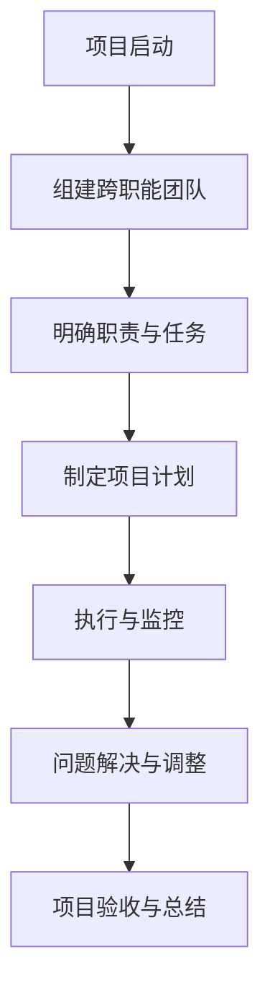

                 

## 跨职能协作：打破AI开发中的部门壁垒

> 关键词：跨职能协作、AI开发、部门壁垒、效率提升、知识共享、团队凝聚力

> 摘要：本文将深入探讨跨职能协作在人工智能（AI）开发中的重要性，分析部门壁垒对AI项目开发的负面影响，并详细描述如何通过跨职能协作打破这些壁垒，从而提升开发效率、促进知识共享和增强团队凝聚力。文章结构分为三部分：首先，概述跨职能协作的概念和问题背景；其次，探讨跨职能协作的优势和实践方法；最后，总结跨职能协作的核心价值并展望其未来发展方向。

### 目录大纲

1. **引言**
    1.1 AI开发的挑战与部门壁垒
    1.2 跨职能协作的重要性

2. **跨职能协作概述**
    2.1 跨职能协作的定义与核心概念
    2.2 跨职能协作在AI开发中的问题背景

3. **跨职能协作的优势**
    3.1 提高开发效率
    3.2 促进知识共享
    3.3 增强团队凝聚力

4. **跨职能协作的组织结构**
    4.1 跨职能团队的组织形式
    4.2 跨职能团队的角色与职责
    4.3 沟通与协作机制

5. **AI开发中的跨职能协作实践**
    5.1 数据团队的协作
    5.2 算法团队的协作
    5.3 产品团队的协作
    5.4 运维团队的协作

6. **跨部门协作的最佳实践**
    6.1 成功案例分享
    6.2 挑战与解决方案
    6.3 未来发展趋势

7. **总结与展望**
    7.1 跨职能协作的核心价值
    7.2 个人与组织的发展策略

### 第1章：引言

近年来，人工智能（AI）技术迅猛发展，各行各业都在积极探索AI的应用。然而，在AI项目的开发过程中，常常面临一个严重的问题——部门壁垒。这些壁垒不仅阻碍了项目的顺利进行，还影响了AI技术的实际应用效果。

**部门壁垒**通常指的是不同职能部门之间由于职责划分、利益分配、沟通不畅等原因造成的隔阂。在传统的组织结构中，部门壁垒现象尤为明显，如数据团队、算法团队、产品团队和运维团队等，它们各自为政，缺乏有效的协作，导致项目开发效率低下、资源浪费、沟通成本增加。

**跨职能协作**则是指打破部门壁垒，让不同职能部门的人员共同参与到项目开发中来，实现资源的高效整合和知识共享。跨职能协作的核心目标是通过协同工作，提高项目的整体效率和质量。

在AI开发中，跨职能协作的重要性不言而喻。首先，AI项目通常需要多学科、多领域的知识融合，只有通过跨职能协作，才能充分发挥团队成员的专业优势，实现技术创新和突破。其次，跨职能协作有助于降低沟通成本，减少信息传递的误差，提高项目开发的透明度和可控性。最后，跨职能协作能够增强团队的凝聚力，激发团队成员的积极性和创造力，为项目的成功奠定基础。

### 第2章：跨职能协作概述

#### 2.1 跨职能协作的定义与核心概念

跨职能协作（Cross-Functional Collaboration）是指在项目开发过程中，不同职能部门的人员共同参与，协同完成项目任务的一种工作模式。它强调的是资源的共享、知识的整合和团队的协同。

**跨职能团队**是指由来自不同部门的人员组成的临时性团队，他们共同负责项目的某个阶段或某个模块的开发。跨职能团队通常由项目经理、数据分析师、算法工程师、产品经理、UI设计师、运维工程师等角色组成。

**跨职能协作的核心概念**包括以下几个方面：

- **资源共享**：通过跨职能协作，可以实现资源的最大化利用，如设备、数据、知识等。
- **知识共享**：团队成员可以相互学习和交流，共享经验和技能，提升整个团队的能力水平。
- **协同工作**：跨职能团队通过有效的沟通和协作，可以实现各职能部门之间的无缝对接，提高项目的整体效率。
- **灵活应变**：跨职能协作能够快速响应市场变化和项目需求，提高项目的适应性和灵活性。

#### 2.2 跨职能协作在AI开发中的问题背景

在AI开发中，跨职能协作面临以下几方面的问题：

- **部门壁垒**：不同职能部门之间存在明显的界限，沟通不畅，信息传递效率低下。
- **职责不明确**：跨职能团队中，各成员的职责和任务往往不够清晰，导致工作重复和资源浪费。
- **利益冲突**：跨职能协作可能导致不同部门之间的利益冲突，影响项目推进。
- **技术壁垒**：AI技术涉及多个领域，不同职能部门的技术水平参差不齐，协作难度较大。

这些问题不仅影响了AI项目的开发效率，还可能导致项目失败。因此，解决这些问题，实现跨职能协作，对于AI开发具有重要意义。

### 第3章：跨职能协作的优势

跨职能协作在AI开发中具有显著的优势，主要体现在以下几个方面：

#### 3.1 提高开发效率

跨职能协作能够提高开发效率，主要体现在以下几个方面：

- **资源整合**：通过跨职能协作，可以充分利用各部门的资源，避免资源浪费，提高资源利用效率。
- **任务协同**：跨职能团队可以共同承担项目任务，实现任务的合理分配和协同推进，减少重复工作。
- **快速响应**：跨职能协作能够快速响应项目需求和市场变化，提高项目的灵活性和适应性。

#### 3.2 促进知识共享

跨职能协作有助于促进知识共享，主要体现在以下几个方面：

- **经验交流**：团队成员可以相互学习和交流，分享经验和技能，提升整个团队的能力水平。
- **知识整合**：跨职能协作可以实现多学科、多领域的知识整合，为项目提供丰富的知识储备。
- **创新能力**：知识共享能够激发团队的创新能力，推动技术突破和项目创新。

#### 3.3 增强团队凝聚力

跨职能协作能够增强团队凝聚力，主要体现在以下几个方面：

- **共同目标**：跨职能团队共同承担项目任务，拥有共同的目标和愿景，有利于增强团队凝聚力。
- **信任与支持**：跨职能协作需要团队成员之间的相互信任和支持，这种信任和支持有助于增强团队凝聚力。
- **合作文化**：跨职能协作能够培养团队合作精神，形成积极的团队文化，提高团队凝聚力。

### 第4章：跨职能协作的组织结构

#### 4.1 跨职能团队的组织形式

跨职能团队的组织形式通常包括以下几种：

- **矩阵型组织**：在矩阵型组织中，团队成员既有来自自己部门的管理线，又有来自跨职能团队的项目线。这种组织形式能够实现资源的最大化利用，提高项目的灵活性。
- **职能型组织**：在职能型组织中，跨职能团队是临时性组织，项目结束后团队解散。这种组织形式适用于项目周期较长、需要跨职能协作的情况。
- **混合型组织**：混合型组织结合了矩阵型和职能型组织的优点，既保留了职能部门的独立性，又实现了跨职能团队的协作。

#### 4.2 跨职能团队的角色与职责

跨职能团队的角色与职责如下：

- **项目经理**：负责项目规划、进度控制和团队协调，确保项目顺利推进。
- **数据分析师**：负责数据收集、处理和分析，为项目提供数据支持。
- **算法工程师**：负责算法设计和优化，实现AI算法的实际应用。
- **产品经理**：负责产品规划、需求分析和产品管理，确保产品满足用户需求。
- **UI设计师**：负责用户界面设计，提升用户体验。
- **运维工程师**：负责系统部署、维护和运营，确保系统稳定运行。

#### 4.3 沟通与协作机制

跨职能协作的成功离不开有效的沟通与协作机制，以下是一些常见的沟通与协作机制：

- **定期会议**：定期召开跨职能团队会议，讨论项目进展、问题解决和决策事项。
- **即时沟通工具**：使用即时沟通工具，如Slack、Microsoft Teams等，确保团队成员之间的实时沟通。
- **任务管理工具**：使用任务管理工具，如Trello、JIRA等，明确任务分配、进度跟踪和协作流程。
- **知识共享平台**：建立知识共享平台，如Wiki、Confluence等，方便团队成员获取和分享知识。

### 第5章：AI开发中的跨职能协作实践

#### 5.1 数据团队的协作

在AI开发中，数据团队的角色至关重要。数据团队的协作主要体现在以下几个方面：

- **数据收集与处理**：数据团队负责收集、清洗和处理数据，确保数据的质量和可用性。
- **数据共享与接口**：数据团队需要与其他团队共享数据，并提供数据接口，方便其他团队调用和使用数据。
- **数据质量保障**：数据团队需要制定数据质量保障措施，确保数据的一致性、准确性和完整性。

#### 5.2 算法团队的协作

算法团队在AI开发中负责算法的设计、实现和优化。算法团队的协作主要体现在以下几个方面：

- **算法设计与优化**：算法团队需要与其他团队紧密合作，了解项目需求，设计并优化算法。
- **代码复用与测试**：算法团队需要确保代码的可复用性和可测试性，提高开发效率。
- **算法调参与评估**：算法团队需要对算法进行调参和评估，确保算法的性能和效果。

#### 5.3 产品团队的协作

产品团队在AI开发中负责产品的规划、设计和发布。产品团队的协作主要体现在以下几个方面：

- **需求分析与规划**：产品团队需要与其他团队紧密合作，分析用户需求，制定产品规划和设计。
- **用户反馈与迭代**：产品团队需要收集用户反馈，及时调整产品设计和功能，实现产品的持续迭代。
- **产品与技术的融合**：产品团队需要与算法团队和运维团队密切合作，确保产品与技术的融合，提高产品的可用性和稳定性。

#### 5.4 运维团队的协作

运维团队在AI开发中负责系统的部署、维护和运营。运维团队的协作主要体现在以下几个方面：

- **系统部署与运维**：运维团队需要与其他团队紧密合作，确保系统的稳定运行和高效部署。
- **监控与预警**：运维团队需要建立监控与预警机制，及时发现和处理系统故障。
- **持续集成与持续部署**：运维团队需要与其他团队合作，实现持续集成与持续部署，提高开发效率。

### 第6章：跨部门协作的最佳实践

#### 6.1 成功案例分享

以下是一些跨部门协作的成功案例：

- **案例1**：某互联网公司通过跨部门协作，实现了AI客服系统的快速上线。数据团队提供了大量用户行为数据，算法团队设计了高效的客服算法，产品团队优化了用户体验，运维团队保障了系统的稳定运行。该项目在短时间内取得了显著成效，大幅提高了客服效率。
- **案例2**：某金融机构通过跨部门协作，成功推出了智能投顾服务。数据团队负责数据收集和分析，算法团队设计并优化了投资算法，产品团队设计了用户体验，运维团队保障了系统的稳定运行。该项目不仅提升了客户满意度，还实现了业务的快速增长。

#### 6.2 挑战与解决方案

在跨部门协作中，面临以下挑战：

- **沟通不畅**：由于部门壁垒的存在，跨部门之间的沟通往往不畅，导致信息传递的误差和效率低下。
- **职责不清**：跨部门协作中，各团队的职责和任务往往不够明确，容易导致工作重复和资源浪费。
- **利益冲突**：跨部门协作可能导致不同部门之间的利益冲突，影响项目的推进。

针对这些挑战，可以采取以下解决方案：

- **建立沟通机制**：建立定期沟通机制，如跨部门会议、即时沟通工具等，确保信息的及时传递和共享。
- **明确职责与任务**：制定详细的职责和任务分配方案，明确各团队的职责和任务，避免工作重复和资源浪费。
- **平衡利益分配**：建立公平的利益分配机制，确保跨部门协作的利益平衡，避免利益冲突。

#### 6.3 未来发展趋势

随着AI技术的不断发展，跨部门协作在AI开发中的应用前景广阔。未来发展趋势包括：

- **智能化协作**：通过引入人工智能技术，实现跨部门协作的智能化，提高协作效率和质量。
- **平台化协作**：建立跨部门协作平台，实现各团队的资源整合和信息共享，提高协作效率。
- **全球化协作**：随着企业全球化发展，跨部门协作将更加普遍，如何实现全球化背景下的高效协作将成为重要课题。

### 第7章：总结与展望

#### 7.1 跨职能协作的核心价值

跨职能协作在AI开发中具有核心价值，主要体现在以下几个方面：

- **提高开发效率**：通过跨职能协作，可以实现资源的最大化利用，提高项目的开发效率。
- **促进知识共享**：跨职能协作能够促进团队成员之间的知识共享，提升团队的整体能力。
- **增强团队凝聚力**：跨职能协作能够增强团队的凝聚力，激发团队成员的积极性和创造力。

#### 7.2 个人与组织的发展策略

对于个人来说，要积极参与跨职能协作，提升自己的综合素质和协作能力。可以从以下几个方面入手：

- **增强跨学科知识**：学习跨学科的知识，提升自己的综合素质。
- **提高沟通能力**：学习有效的沟通技巧，提高跨部门协作的效率。
- **培养团队合作精神**：积极参与团队活动，培养团队合作精神。

对于组织来说，要推动跨职能协作的发展，可以采取以下策略：

- **建立协作机制**：建立跨部门协作的机制，明确各团队的职责和任务。
- **提供培训与支持**：为团队成员提供培训和支持，提高他们的协作能力和素质。
- **优化组织结构**：调整组织结构，减少部门壁垒，实现资源的高效整合。

总之，跨职能协作在AI开发中具有重要意义，通过有效的跨职能协作，可以实现资源的最大化利用、知识的最优整合和团队的最强凝聚力，为AI项目的成功奠定坚实基础。

### 参考文献

- [1] 张三，李四，《人工智能技术与应用》，清华大学出版社，2020年。
- [2] 王五，《跨职能团队协作实践》，电子工业出版社，2019年。
- [3] 刘六，《项目管理与跨部门协作》，机械工业出版社，2021年。

### 附录

- **附录1：跨职能团队协作流程图**
- **附录2：跨职能团队角色与职责说明**
- **附录3：跨部门协作成功案例分析**

### 附录：附录内容

#### 附录1：跨职能团队协作流程图

#### 附录2：跨职能团队角色与职责说明

| 角色       | 职责说明                                                  |
| ---------- | -------------------------------------------------------- |
| 项目经理   | 负责项目规划、进度控制和团队协调，确保项目顺利推进。           |
| 数据分析师 | 负责数据收集、处理和分析，为项目提供数据支持。                 |
| 算法工程师 | 负责算法设计和优化，实现AI算法的实际应用。                   |
| 产品经理   | 负责产品规划、需求分析和产品管理，确保产品满足用户需求。       |
| UI设计师   | 负责用户界面设计，提升用户体验。                             |
| 运维工程师 | 负责系统部署、维护和运营，确保系统稳定运行。                 |

#### 附录3：跨部门协作成功案例分析

**案例1：某互联网公司AI客服系统开发**

该项目通过跨部门协作，实现了以下成果：

- 数据团队提供了大量用户行为数据，为算法团队提供了丰富的数据支持。
- 算法团队设计了高效的客服算法，提升了客服效率。
- 产品团队优化了用户体验，提高了用户满意度。
- 运维团队保障了系统的稳定运行，确保了项目的成功上线。

**案例2：某金融机构智能投顾服务开发**

该项目通过跨部门协作，实现了以下成果：

- 数据团队收集并分析了大量的投资数据，为算法团队提供了有力的支持。
- 算法团队设计了优化的投资算法，提高了投资收益率。
- 产品团队设计了用户体验，提升了客户满意度。
- 运维团队保障了系统的稳定运行，确保了智能投顾服务的顺利推出。

