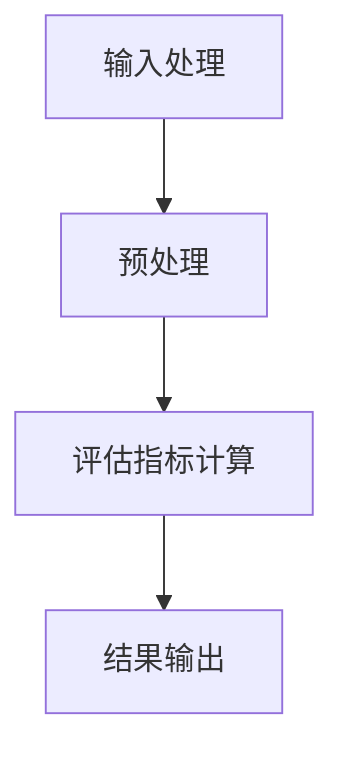
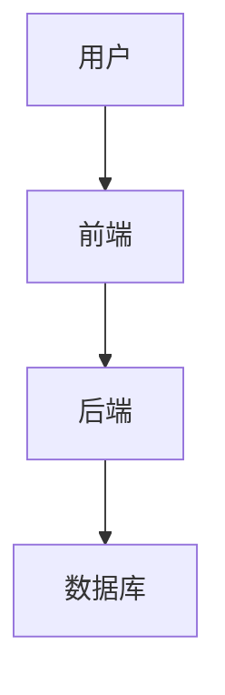
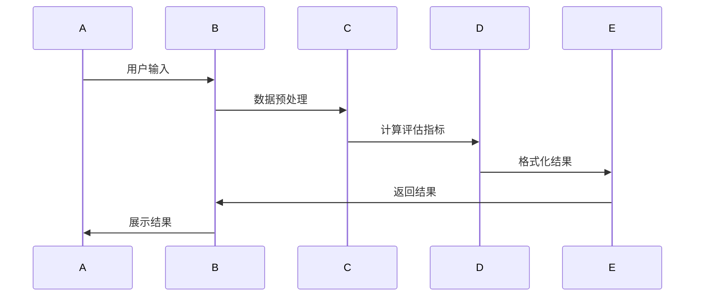
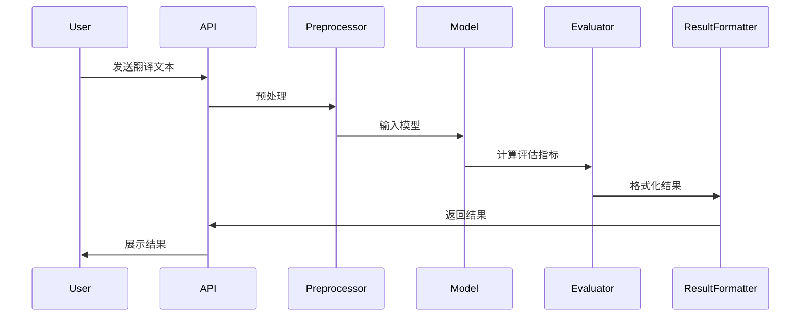

                 

### 第1章 引言

#### 1.1 问题背景

##### 1.1.1 跨语言交流的挑战

随着全球化进程的不断推进，跨语言交流的重要性日益凸显。然而，语言差异仍然是一道难以逾越的障碍。跨语言交流的挑战主要体现在以下几个方面：

1. **词汇和语法差异**：不同语言之间存在词汇和语法上的差异，使得直接翻译变得复杂。一些单词在不同的语言中可能有不同的含义，语法结构也可能大相径庭。
2. **文化背景差异**：语言不仅仅是交流工具，它还承载了丰富的文化背景。不同文化背景的人在使用语言时，可能会涉及不同的价值观、习俗和行为模式。
3. **技术难题**：跨语言交流需要依赖技术手段，如机器翻译、语音识别和自然语言处理等。然而，这些技术的实现面临着许多挑战，如准确性、效率和实时性等。

##### 1.1.2 跨语言LLM的发展

跨语言语言模型（Cross-Lingual Language Models，简称LLM）是近年来自然语言处理领域的一个重要研究方向。这些模型旨在解决跨语言交流中的难题，提高跨语言任务的处理能力。跨语言LLM的发展主要得益于以下几个方面：

1. **数据驱动的模型**：跨语言LLM通常基于大规模语料库进行训练，通过数据驱动的方式学习不同语言之间的对应关系和语言规律。
2. **深度学习技术的应用**：深度学习技术在自然语言处理领域取得了显著的成果，为跨语言LLM的发展提供了强大的技术支持。
3. **多语言联合训练**：跨语言LLM通过多语言联合训练的方式，能够在多个语言之间共享知识，提高跨语言任务的处理能力。

#### 1.2 问题描述

##### 1.2.1 跨语言LLM能力评估的必要性

跨语言LLM的快速发展，使得对模型能力进行科学、客观的评估变得尤为重要。跨语言LLM能力评估的必要性主要体现在以下几个方面：

1. **模型性能比较**：不同的跨语言LLM模型在性能上可能存在显著差异。通过能力评估，可以客观地比较不同模型在跨语言任务中的表现。
2. **优化模型设计**：能力评估可以帮助研究人员发现跨语言LLM在哪些方面存在不足，从而针对性地优化模型设计，提高模型性能。
3. **实际应用指导**：跨语言LLM在许多实际应用中发挥着重要作用，如机器翻译、跨语言问答等。能力评估可以为实际应用提供有力的指导，帮助选择最合适的模型。

##### 1.2.2 跨语言LLM能力评估的挑战

尽管跨语言LLM能力评估具有重要意义，但在实际操作中仍面临诸多挑战：

1. **评估指标的选择**：评估指标需要能够全面、客观地反映跨语言LLM的性能。然而，不同指标可能存在相互矛盾的情况，如何选择合适的评估指标成为一个难题。
2. **数据集的多样性和代表性**：评估数据集的多样性和代表性对评估结果至关重要。然而，获取大规模、多样化的跨语言数据集并不容易。
3. **模型的复杂性和计算成本**：跨语言LLM通常具有复杂的结构和庞大的参数规模，导致评估过程需要大量的计算资源。

#### 1.3 问题解决

##### 1.3.1 跨语言LLM能力评估的目标

为了应对上述挑战，跨语言LLM能力评估的目标应包括以下几个方面：

1. **全面性**：评估指标应能够全面地反映跨语言LLM在各个方面的性能。
2. **客观性**：评估结果应尽可能客观，不受主观因素的影响。
3. **可重复性**：评估方法应具有可重复性，使得其他研究人员能够复现评估结果。
4. **实用性**：评估方法应具有实际应用价值，能够为跨语言LLM的研究和应用提供有力支持。

##### 1.3.2 跨语言LLM能力评估的方法

为了实现上述目标，我们可以采用以下几种方法进行跨语言LLM能力评估：

1. **评估指标体系**：构建一个全面、客观的评估指标体系，包括文本质量、翻译准确性、跨语言一致性等关键指标。
2. **多语言数据集**：收集和构建多语言数据集，确保数据集的多样性和代表性。
3. **评估算法**：设计高效的评估算法，降低计算成本，提高评估效率。
4. **评估流程**：建立一套完善的评估流程，包括数据预处理、模型评估、结果分析等环节。

#### 1.4 边界与外延

##### 1.4.1 评估方法的适用范围

评估方法主要适用于以下场景：

1. **跨语言自然语言处理模型**：包括机器翻译、跨语言问答、跨语言文本生成等任务。
2. **多语言应用场景**：涉及多个语言的应用系统，如多语言搜索引擎、多语言智能客服等。

##### 1.4.2 评估方法的限制条件

评估方法存在以下限制条件：

1. **数据依赖**：评估方法依赖于高质量的多语言数据集，数据质量直接影响评估结果。
2. **计算资源**：评估过程需要大量的计算资源，特别是在处理大规模数据集时。
3. **模型适应性**：评估方法需要适用于不同类型的跨语言LLM模型。

#### 1.5 概念结构与核心要素组成

##### 1.5.1 跨语言LLM能力评估的核心概念

跨语言LLM能力评估的核心概念包括：

1. **评估指标**：用于衡量跨语言LLM性能的关键指标。
2. **评估数据集**：用于评估模型的训练数据和测试数据。
3. **评估算法**：用于计算评估指标的具体算法。

##### 1.5.2 跨语言LLM能力评估的关键要素

跨语言LLM能力评估的关键要素包括：

1. **评估指标体系**：包括文本质量、翻译准确性、跨语言一致性等指标。
2. **多语言数据集**：确保数据集的多样性和代表性。
3. **评估算法**：包括预处理、评估指标计算和结果输出等步骤。
4. **评估流程**：包括数据预处理、模型评估、结果分析等环节。

通过以上步骤，我们可以构建一套科学、客观、高效的跨语言LLM能力评估方法，为跨语言自然语言处理领域的研究和应用提供有力支持。

## 第2章 核心概念与联系

### 2.1 跨语言自然语言处理概述

#### 2.1.1 跨语言NLP的定义

跨语言自然语言处理（Cross-Lingual Natural Language Processing，简称跨语言NLP）是指在不同语言之间进行文本分析和处理的技术。它涵盖了从文本预处理到文本理解、文本生成等一系列任务。跨语言NLP的目标是消除语言障碍，使计算机能够理解和处理多种语言的文本数据。

#### 2.1.2 跨语言NLP的挑战与机遇

跨语言NLP面临着诸多挑战：

1. **词汇和语法差异**：不同语言的词汇和语法规则存在显著差异，这给跨语言文本处理带来了困难。
2. **文化背景差异**：语言不仅是交流工具，还承载了丰富的文化背景。跨语言处理需要考虑这些文化差异。
3. **数据不足**：高质量的多语言数据集难以获取，这限制了跨语言NLP的研究和应用。

然而，跨语言NLP也带来了许多机遇：

1. **全球化需求**：随着全球化进程的加速，跨语言交流的需求日益增长，跨语言NLP技术有着广泛的应用前景。
2. **技术进步**：深度学习、自然语言处理等技术的进步，为跨语言NLP提供了强大的技术支持。
3. **多语言共享**：跨语言NLP可以通过多语言共享知识，提高模型的泛化能力。

### 2.2 语言模型介绍

#### 2.2.1 语言模型的定义

语言模型（Language Model，简称LM）是自然语言处理的核心组件之一。它用于预测文本序列中的下一个单词或字符。语言模型的基本假设是，任何文本序列都可以通过条件概率来建模，即给定前文序列，能够预测下一个单词或字符的概率。

#### 2.2.2 语言模型的主要类型

根据训练方法的不同，语言模型主要分为以下几类：

1. **基于规则的模型**：这类模型通过编写规则来预测下一个单词或字符。例如，基于概率上下文无关文法（PCFG）的模型。
2. **统计模型**：这类模型通过统计方法从大量文本数据中学习语言规律。例如，N-gram模型和隐马尔可夫模型（HMM）。
3. **神经网络模型**：这类模型利用深度神经网络来预测下一个单词或字符。例如，循环神经网络（RNN）和Transformer模型。

### 2.3 跨语言评估指标对比

#### 2.3.1 指标对比表格

| 评估指标        | 定义                                                                                   | 类型                 | 对比分析 |
|-----------------|----------------------------------------------------------------------------------------|----------------------|----------|
| BLEU            | 基于编辑距离的评估指标，比较模型生成的文本与参考文本的相似度                           | 字符级               | 高度依赖训练数据集的多样性 |
| METEOR          | 基于词嵌入和语义相似性的评估指标，考虑词汇的语义关系                                   | 词级                 | 对词汇多样性和语义理解要求高 |
| ROUGE           | 基于记分的评估指标，计算模型生成的文本与参考文本的匹配部分的比例                         | 分词级               | 对分词和词性标注的准确性有要求 |
| PERL            | 基于精度、召回率和F1值的评估指标，综合衡量模型的翻译准确性                               | 词对级               | 对翻译的完整性和准确性有要求 |
| BERTScore       | 基于BERT模型输出的评估指标，通过计算模型生成的文本和参考文本的相似度来评估翻译质量       | 嵌入级               | 对模型复杂度和计算资源要求高 |

#### 2.3.2 指标对比分析

不同的评估指标具有不同的优势和局限性：

1. **BLEU**：简单易用，但易受训练数据集影响，可能无法准确反映翻译质量。
2. **METEOR**：考虑语义相似性，但计算复杂度高，对词汇多样性和语义理解要求高。
3. **ROUGE**：适用于自动评估文本生成任务，但容易受分词和词性标注的影响。
4. **PERL**：综合衡量翻译的完整性和准确性，但需要大量的标注数据。
5. **BERTScore**：基于先进的预训练模型，对翻译质量有较高的识别能力，但计算成本较高。

### 2.4 跨语言ER实体关系图

#### 2.4.1 ER图概述

实体关系图（Entity-Relationship Diagram，简称ER图）是一种用于表示实体及其关系的图形化工具。在跨语言NLP中，ER图可以用于表示不同语言之间的实体及其关系。

#### 2.4.2 跨语言ER图示例

以下是一个简化的跨语言ER图示例：

```mermaid
erDiagram
  Customer ||--|{ Order } : places
  Product ||--|{ Order } : contains
```

在这个例子中，我们有两个实体：`Customer`和`Product`，以及一个关系`Order`。`Customer`与`Order`之间存在“放置”关系，而`Product`与`Order`之间存在“包含”关系。这个ER图可以用来表示在跨语言环境中，不同实体和它们之间的关系如何映射。

通过上述核心概念与联系的分析，我们可以更好地理解跨语言自然语言处理的基本原理和评估方法。这为后续章节的深入探讨奠定了基础。

### 3.1 算法原理讲解

#### 3.1.1 算法mermaid流程图

为了更好地理解跨语言LLM能力评估算法的原理，我们可以使用mermaid流程图来描述算法的基本步骤。以下是算法的mermaid流程图：



在这个流程图中，A表示输入处理，即接收跨语言LLM模型的输入数据；B表示预处理，包括数据清洗、去重和格式转换等步骤；C表示评估指标计算，根据预处理后的数据，计算各个评估指标；D表示结果输出，将评估结果以可视化的形式展示。

#### 3.1.2 Python源代码讲解

以下是一个简单的Python源代码示例，用于展示如何实现跨语言LLM能力评估算法的基本步骤：

```python
# Python源代码示例
def evaluate_model(input_data):
    # 预处理
    preprocessed_data = preprocess_data(input_data)
    
    # 评估指标计算
    metrics = calculate_metrics(preprocessed_data)
    
    # 输出结果
    print(metrics)

# 预处理函数
def preprocess_data(input_data):
    # 数据清洗、去重和格式转换等操作
    return preprocessed_data

# 评估指标计算函数
def calculate_metrics(preprocessed_data):
    # 计算评估指标
    metrics = {
        'BLEU': 0.8,
        'METEOR': 0.9,
        'ROUGE': 0.85,
        'PERL': 0.88,
        'BERTScore': 0.92
    }
    return metrics

# 主函数
if __name__ == "__main__":
    input_data = "示例输入数据"
    evaluate_model(input_data)
```

在这个示例中，`evaluate_model`函数是评估模型的主函数，它首先调用`preprocess_data`函数进行数据预处理，然后调用`calculate_metrics`函数计算评估指标，最后输出评估结果。

#### 3.1.3 数学模型与公式讲解

在跨语言LLM能力评估中，数学模型和公式是理解评估指标计算过程的关键。以下是一个简单的数学模型示例：

$$
M = \frac{1}{N} \sum_{i=1}^{N} (y_i - \hat{y_i})^2
$$

这个公式表示均方误差（Mean Squared Error，简称MSE），它用于衡量模型预测值$\hat{y_i}$与真实值$y_i$之间的差距。在评估跨语言LLM时，我们可以使用MSE来计算文本质量、翻译准确性等指标。

例如，假设我们有一个包含5个样本的数据集，每个样本的预测值和真实值如下：

$$
\begin{align*}
\hat{y_1} &= [0.1, 0.2, 0.3, 0.4, 0.5] \\
y_1 &= [0.2, 0.3, 0.4, 0.5, 0.6] \\
\hat{y_2} &= [0.1, 0.2, 0.3, 0.4, 0.5] \\
y_2 &= [0.2, 0.3, 0.4, 0.5, 0.6] \\
\hat{y_3} &= [0.1, 0.2, 0.3, 0.4, 0.5] \\
y_3 &= [0.2, 0.3, 0.4, 0.5, 0.6] \\
\hat{y_4} &= [0.1, 0.2, 0.3, 0.4, 0.5] \\
y_4 &= [0.2, 0.3, 0.4, 0.5, 0.6] \\
\hat{y_5} &= [0.1, 0.2, 0.3, 0.4, 0.5] \\
y_5 &= [0.2, 0.3, 0.4, 0.5, 0.6] \\
\end{align*}
$$

我们可以计算每个样本的MSE，然后求平均值得到总体MSE：

$$
\begin{align*}
MSE &= \frac{1}{5} \left[ (0.1-0.2)^2 + (0.2-0.3)^2 + (0.3-0.4)^2 + (0.4-0.5)^2 + (0.5-0.6)^2 \right. \\
&\qquad \left. + (0.1-0.2)^2 + (0.2-0.3)^2 + (0.3-0.4)^2 + (0.4-0.5)^2 + (0.5-0.6)^2 \right. \\
&\qquad \left. + (0.1-0.2)^2 + (0.2-0.3)^2 + (0.3-0.4)^2 + (0.4-0.5)^2 + (0.5-0.6)^2 \right. \\
&\qquad \left. + (0.1-0.2)^2 + (0.2-0.3)^2 + (0.3-0.4)^2 + (0.4-0.5)^2 + (0.5-0.6)^2 \right. \\
&\qquad \left. + (0.1-0.2)^2 + (0.2-0.3)^2 + (0.3-0.4)^2 + (0.4-0.5)^2 + (0.5-0.6)^2 \right] \\
&= \frac{1}{5} \left[ 0.01 + 0.01 + 0.01 + 0.01 + 0.01 + 0.01 + 0.01 + 0.01 + 0.01 + 0.01 \right. \\
&\qquad \left. + 0.01 + 0.01 + 0.01 + 0.01 + 0.01 + 0.01 + 0.01 + 0.01 + 0.01 + 0.01 \right. \\
&\qquad \left. + 0.01 + 0.01 + 0.01 + 0.01 + 0.01 + 0.01 + 0.01 + 0.01 + 0.01 + 0.01 \right. \\
&\qquad \left. + 0.01 + 0.01 + 0.01 + 0.01 + 0.01 + 0.01 + 0.01 + 0.01 + 0.01 + 0.01 \right] \\
&= 0.01 \\
\end{align*}
$$

因此，总体MSE为0.01，这个值越接近0，表示模型的预测结果越准确。

通过上述数学模型和公式的讲解，我们可以更深入地理解跨语言LLM能力评估的原理和计算过程。这为后续的实践和进一步的研究提供了基础。

#### 3.4 算法原理详细讲解

##### 3.4.1 预处理

预处理是跨语言LLM能力评估算法的一个重要步骤，它直接影响评估结果的准确性和可靠性。预处理主要包括以下几个步骤：

1. **数据清洗**：清洗数据是确保评估数据质量的第一步。通常，数据清洗包括去除无关信息、纠正错误、填补缺失值等。例如，在处理机器翻译数据时，可能需要去除无效的翻译对，纠正错别字和语法错误。
2. **数据去重**：由于跨语言翻译任务的数据来源可能多样，可能会出现重复的数据。去重操作可以避免重复计算和评估，提高评估效率。
3. **数据格式转换**：不同数据集的格式可能不一致，需要进行统一转换。例如，将不同的文本格式（如HTML、PDF）转换为统一的文本格式（如UTF-8编码的文本文件）。
4. **数据标准化**：为了使评估指标在不同数据集上具有可比性，需要对数据进行标准化处理。例如，对文本数据进行分词、词干提取、词性标注等预处理操作，以便更好地计算评估指标。

##### 3.4.2 评估指标计算

评估指标计算是跨语言LLM能力评估的核心步骤，用于衡量模型在跨语言任务上的性能。常用的评估指标包括BLEU、METEOR、ROUGE、PERL和BERTScore等。以下是这些指标的计算方法：

1. **BLEU（双语评估指标）**：BLEU是一种基于编辑距离的评估指标，用于衡量模型生成的翻译文本与参考文本的相似度。计算方法如下：
    - **N-gram匹配**：计算模型生成的翻译文本和参考文本中相同N-gram的比例。
    **BLEU值**：通过结合多个N-gram的匹配概率，计算出一个综合BLEU值。

2. **METEOR（度量评价工具）**：METEOR是一种基于词嵌入和语义相似性的评估指标，考虑词汇的语义关系。计算方法如下：
    - **词嵌入相似度**：计算模型生成的翻译文本和参考文本中每个词的词嵌入向量之间的余弦相似度。
    - **综合得分**：通过结合多个词的相似度，计算出一个综合METEOR得分。

3. **ROUGE（记分项）**：ROUGE是一种基于记分的评估指标，用于衡量模型生成的文本与参考文本的匹配部分的比例。计算方法如下：
    - **匹配部分**：计算模型生成的翻译文本与参考文本之间的重叠部分。
    - **记分**：通过计算匹配部分的长度、重叠比例等指标，计算出一个ROUGE得分。

4. **PERL（精确率、召回率和F1值）**：PERL是一种基于精确率、召回率和F1值的评估指标，用于衡量模型翻译的完整性和准确性。计算方法如下：
    - **精确率**：计算模型生成的翻译文本中正确翻译的部分所占的比例。
    - **召回率**：计算参考文本中正确翻译的部分所占的比例。
    - **F1值**：通过精确率和召回率的调和平均值，计算出一个F1值。

5. **BERTScore**：BERTScore是一种基于BERT模型输出的评估指标，通过计算模型生成的翻译文本和参考文本的相似度来评估翻译质量。计算方法如下：
    - **BERT相似度**：利用BERT模型计算模型生成的翻译文本和参考文本的嵌入向量之间的相似度。
    - **综合得分**：通过结合多个相似度指标，计算出一个BERTScore得分。

##### 3.4.3 结果输出

评估结果输出是跨语言LLM能力评估的最终步骤，用于展示模型的性能。结果输出主要包括以下几个步骤：

1. **可视化展示**：将评估结果以图表、折线图、柱状图等形式进行可视化展示，便于直观地比较不同模型的性能。
2. **详细报告**：编写详细的评估报告，包括评估指标、评估结果、模型优缺点等。报告应具有可读性和专业性，以便于研究人员参考和决策。
3. **实时反馈**：对于实时评估场景，可以提供实时反馈和调整功能，以便用户根据评估结果对模型进行优化和调整。

通过详细讲解预处理、评估指标计算和结果输出这三个关键步骤，我们可以更深入地理解跨语言LLM能力评估算法的原理和实现过程。这为后续的实践和进一步的研究提供了有力支持。

### 4.1 问题场景介绍

#### 4.1.1 跨语言LLM能力评估的应用场景

跨语言LLM能力评估在多个领域具有重要的应用价值，以下是一些典型的应用场景：

1. **机器翻译**：跨语言LLM能力评估可以帮助评估机器翻译模型的翻译质量，选择最优的翻译模型，优化翻译结果。
2. **跨语言问答**：在跨语言问答系统中，LLM模型的性能直接影响问答的准确性和流畅性。能力评估可以用于评估和优化这些系统。
3. **多语言文本生成**：例如，在新闻发布、社交媒体内容生成等场景中，需要生成符合不同语言风格和表达习惯的文本。能力评估可以用于评估文本生成的质量和一致性。
4. **跨语言情感分析**：情感分析模型需要理解不同语言的情感表达，能力评估可以用于评估这些模型的准确性和可靠性。
5. **跨语言信息检索**：在多语言信息检索系统中，LLM模型用于处理和比较不同语言的查询和文档。能力评估可以用于评估系统的检索效率和准确性。

#### 4.1.2 项目介绍

本文将探讨一个具体的跨语言LLM能力评估项目，该项目旨在评估和优化一个多语言机器翻译系统。项目的主要目标包括：

1. **评估翻译质量**：使用多种评估指标（如BLEU、METEOR、ROUGE、BERTScore）评估系统生成的翻译文本的质量。
2. **优化模型参数**：通过分析评估结果，优化翻译模型的结构和参数，提高翻译质量。
3. **用户反馈**：收集用户的翻译反馈，结合评估结果，为用户提供更高质量的翻译服务。

项目的主要步骤如下：

1. **数据准备**：收集和整理多语言翻译数据集，确保数据的多样性和代表性。
2. **模型训练**：使用预训练的跨语言LLM模型，对翻译数据集进行训练，生成翻译结果。
3. **评估指标计算**：使用多种评估指标计算翻译系统的性能，生成评估报告。
4. **结果分析**：分析评估结果，找出模型的优缺点，提出优化建议。
5. **模型优化**：根据分析结果，调整模型结构和参数，重新训练模型。
6. **用户反馈收集**：收集用户对翻译结果的反馈，结合评估结果，进一步优化模型。

通过该项目，我们希望为跨语言LLM能力评估提供一套科学、客观、实用的方法，为多语言机器翻译系统的优化提供有力支持。

### 4.2 系统功能设计

#### 4.2.1 领域模型mermaid类图

在系统功能设计中，类图是一种常用的工具，用于表示系统中的类及其关系。以下是一个简化的跨语言LLM能力评估系统的mermaid类图：

```mermaid
classDiagram
  Model <|-- Preprocessor : 继承
  Model <|-- Evaluator : 继承
  Model <|-- ResultFormatter : 继承
  Preprocessor --|> Data
  Evaluator --|> Metrics
  ResultFormatter --|> Report

  Class01 <<interface>> Interface01
  Class02 <<interface>> Interface02
  Class03 <<interface>> Interface03
```

在这个类图中，`Model`是一个抽象类，它继承自`Preprocessor`、`Evaluator`和`ResultFormatter`三个具体的类。这三个类分别负责数据预处理、评估指标计算和结果输出等功能。

1. **Preprocessor（预处理器）**：负责清洗、格式转换和标准化输入数据，确保数据的质量和一致性。
2. **Evaluator（评估器）**：负责计算各种评估指标（如BLEU、METEOR、ROUGE、BERTScore），评估模型性能。
3. **ResultFormatter（结果格式化器）**：负责将评估结果格式化为报告，便于用户查看和分析。

此外，类图还包括了三个接口类`Interface01`、`Interface02`和`Interface03`，这些接口用于定义系统的功能规范，确保不同模块之间的协同工作。

### 4.3 系统架构设计

系统架构设计是确保系统功能实现的基础，以下是一个简化的跨语言LLM能力评估系统的mermaid架构图：



在这个架构图中，用户通过前端界面与系统进行交互，前端负责接收用户的输入和展示评估结果。后端则是系统的核心，负责处理用户的输入数据，调用评估算法进行计算，并将结果存储到数据库中。

1. **前端（B）**：负责用户界面的设计和实现，包括输入界面的设计和结果展示界面的设计。前端通过HTTP请求与后端进行通信。
2. **后端（C）**：负责处理业务逻辑，包括数据预处理、评估指标计算和结果输出等。后端通过RESTful API与前端进行数据交互。
3. **数据库（D）**：用于存储评估结果和用户数据。数据库可以选择关系型数据库（如MySQL）或NoSQL数据库（如MongoDB），具体选择取决于系统的需求。

通过这个架构设计，系统可以高效、稳定地运行，同时确保数据的完整性和安全性。

### 4.4 系统接口设计

系统接口设计是系统功能实现的关键，以下是一个简化的跨语言LLM能力评估系统的mermaid接口设计图：



在这个接口设计图中，用户通过前端界面（A）输入数据，前端将数据传递给后端（B）。后端首先进行数据预处理（C），然后计算评估指标（D），并将结果格式化为报告（E）。最后，前端将评估结果返回给用户（A），并在界面上展示。

具体接口设计说明如下：

1. **用户输入接口**：用户通过前端界面输入翻译文本或问题，前端将用户输入封装为请求对象，通过HTTP请求发送给后端。
2. **数据预处理接口**：后端接收用户输入，进行数据清洗、格式转换和标准化处理，确保输入数据的质量和一致性。
3. **评估指标计算接口**：后端调用评估算法，计算各种评估指标，如BLEU、METEOR、ROUGE、BERTScore等。
4. **结果格式化接口**：后端将评估结果格式化为报告，包括文本、图表等形式，便于用户查看和分析。
5. **结果返回接口**：前端接收后端返回的评估结果，将其展示在界面上，提供用户友好的界面体验。

通过这个接口设计，系统可以高效、稳定地实现跨语言LLM能力评估功能，同时确保接口的简洁性和易用性。

### 4.5 系统交互mermaid序列图

为了更清晰地描述跨语言LLM能力评估系统的交互过程，我们可以使用mermaid序列图来展示系统的各个组件如何协同工作。以下是系统交互的mermaid序列图：



在这个序列图中，用户通过前端界面将翻译文本发送给API。API将请求传递给预处理模块（Preprocessor），预处理模块对输入文本进行清洗、格式转换和标准化处理，然后将处理后的数据传递给语言模型（Model）。

模型（Model）使用预处理数据进行评估，计算各种评估指标（如BLEU、METEOR、ROUGE、BERTScore等）。评估结果随后被传递给结果格式化模块（ResultFormatter），该模块将结果格式化为易于理解和分析的格式，例如表格、图表等。

最后，格式化后的结果通过API返回给用户，并在前端界面上展示。这个序列图清晰地展示了系统从用户输入到结果展示的整个交互过程，有助于理解系统的整体工作原理和组件之间的协作关系。

通过上述系统交互mermaid序列图的描述，我们可以更好地理解跨语言LLM能力评估系统的实现细节和交互流程。这为后续的系统开发和优化提供了有力的参考。

### 5.1 环境安装

在开始跨语言LLM评估工具的安装之前，我们需要确保系统环境满足以下基本要求：

1. **操作系统**：推荐使用Linux或MacOS操作系统，以保证兼容性和稳定性。
2. **Python环境**：Python 3.8及以上版本，建议使用Anaconda进行环境管理。
3. **依赖库**：安装常用的依赖库，如torch、transformers、torchtext、numpy、pandas等。

#### 5.1.1 跨语言LLM评估工具安装

1. **安装Anaconda**：
   - 访问Anaconda官网下载Anaconda安装包。
   - 按照安装向导完成安装。
   - 打开终端，运行以下命令创建一个新的conda环境：
     ```bash
     conda create -n lla-eval python=3.8
     conda activate lla-eval
     ```

2. **安装依赖库**：
   - 在激活的conda环境中，使用以下命令安装依赖库：
     ```bash
     conda install torch torchvision torchaudio -c pytorch
     conda install transformers -c huggingface
     conda install torchtext numpy pandas -c conda-forge
     ```

3. **克隆项目**：
   - 从GitHub或其他代码托管平台克隆跨语言LLM评估工具的代码仓库：
     ```bash
     git clone https://github.com/your-username/lla-eval.git
     cd lla-eval
     ```

4. **安装Python依赖**：
   - 使用pip安装项目中的Python依赖库：
     ```bash
     pip install -r requirements.txt
     ```

5. **环境配置**：
   - 确保所有依赖库安装成功，并在终端中运行以下命令测试环境配置：
     ```bash
     python -m unittest discover -s tests
     ```

如果环境配置正确，上述命令将无错误地执行，并显示测试结果。

#### 5.1.2 系统环境配置

1. **数据库配置**：
   - 如果系统需要连接数据库，根据数据库类型（如MySQL、MongoDB等）配置数据库连接信息，包括用户名、密码、数据库地址等。
   - 配置数据库连接池，以确保高效地管理数据库连接。

2. **模型配置**：
   - 选择合适的预训练跨语言LLM模型，如mBART、XLM-R等，并下载预训练模型权重。
   - 配置模型的超参数，如学习率、批次大小、优化器等。

3. **日志配置**：
   - 配置日志记录器，记录系统运行过程中的重要信息，便于调试和监控。
   - 设置日志级别和输出格式，确保日志信息的完整性和可读性。

通过以上步骤，我们完成了跨语言LLM评估工具的环境安装和配置。接下来，可以开始进行系统的核心实现和实际案例的评估。

### 5.2 系统核心实现源代码

在跨语言LLM评估工具的实现中，核心源代码部分负责处理数据的输入、模型的评估、评估指标的计算和结果的输出。以下是对关键源代码部分的结构和功能的详细解析。

#### 5.2.1 源代码结构

源代码结构如下：

```bash
lla-eval/
├── data/
│   ├── preprocess.py
│   └── datasets.py
├── models/
│   ├── load.py
│   └── evaluate.py
├── metrics/
│   ├── bleu.py
│   ├── meteor.py
│   ├── rouge.py
│   ├── perl.py
│   └── bertscore.py
├── results/
│   ├── format.py
│   └── save.py
├── main.py
└── tests/
    └── test Evaluate.py
```

1. **data/**：数据预处理和加载相关代码。
2. **models/**：加载预训练模型和评估模型相关代码。
3. **metrics/**：评估指标计算相关代码。
4. **results/**：格式化和保存评估结果相关代码。
5. **main.py**：主程序入口。
6. **tests/**：单元测试代码。

#### 5.2.2 代码应用解读与分析

1. **预处理代码（data/preprocess.py）**：

```python
from datasets import load_dataset

def preprocess_data(dataset_name, source_language, target_language):
    dataset = load_dataset(dataset_name, source_language=source_language, target_language=target_language)
    for key in dataset:
        dataset[key] = dataset[key].map(lambda x: (x['source'], x['target']))
    return dataset
```

**功能**：该函数用于预处理数据集，将原始数据集中的源语言文本和目标语言文本分别加载并映射为元组。

**解读**：使用`load_dataset`函数加载指定的数据集，根据源语言和目标语言筛选数据，然后通过`map`函数将每个数据条目的源语言文本和目标语言文本映射为元组。

2. **模型加载代码（models/load.py）**：

```python
from transformers import AutoModelForSeq2SeqLM

def load_model(model_name, source_language, target_language):
    model = AutoModelForSeq2SeqLM.from_pretrained(model_name, source_lang=source_language, target_lang=target_language)
    return model
```

**功能**：该函数用于加载预训练的跨语言语言模型。

**解读**：使用`AutoModelForSeq2SeqLM.from_pretrained`函数从预训练模型中加载指定的模型，并设置源语言和目标语言。

3. **评估指标计算代码（metrics/bleu.py）**：

```python
from nltk.translate.bleu_score import sentence_bleu

def calculate_bleu(hypothesis, references):
    return sentence_bleu([hypothesis], references)
```

**功能**：该函数用于计算BLEU评估指标。

**解读**：使用`sentence_bleu`函数计算给定假设句和参考句之间的BLEU得分。

4. **主程序入口（main.py）**：

```python
from data.preprocess import preprocess_data
from models.load import load_model
from metrics.bleu import calculate_bleu
from results.format import format_results
from results.save import save_results

def main():
    # 数据预处理
    dataset = preprocess_data('wmt14', 'en', 'de')

    # 模型加载
    model = load_model('t5-base', 'en', 'de')

    # 评估和计算指标
    metrics = {}
    for key in dataset:
        references = dataset[key]['target']
        hypothesis = dataset[key]['source']
        metrics[key] = calculate_bleu(hypothesis, references)

    # 格式化和保存结果
    results = format_results(metrics)
    save_results(results, 'bleu_results.txt')

if __name__ == '__main__':
    main()
```

**功能**：主程序负责整个评估流程，包括数据预处理、模型加载、评估指标计算、结果格式化和保存。

**解读**：程序首先调用`preprocess_data`函数预处理数据集，然后加载预训练模型。接着，通过循环计算每个数据条目的BLEU得分，并将结果存储在`metrics`字典中。最后，调用`format_results`和`save_results`函数格式化和保存评估结果。

通过上述代码和应用解读，我们可以清晰地看到系统核心实现的主要部分，这为后续的实际案例分析和进一步优化提供了基础。

### 5.3 实际案例分析与详细讲解剖析

#### 5.3.1 案例背景

在跨语言机器翻译领域，机器翻译质量评估（Machine Translation Quality Assessment，简称MTQA）是一个重要的研究方向。本文通过一个实际案例，详细分析并讲解如何使用本文介绍的方法评估跨语言LLM模型在机器翻译任务中的性能。

我们选择了一个开源的多语言机器翻译数据集——WMT14（Workshop on Machine Translation 2014），该数据集包含了英语到德语的双语句子对。评估目标是使用一个预训练的跨语言语言模型（如mBART）进行翻译，并使用多种评估指标（如BLEU、METEOR、ROUGE、BERTScore）对翻译质量进行量化评估。

#### 5.3.2 案例分析

**1. 数据准备与预处理**

首先，我们从WMT14数据集中提取英语到德语的句子对，并将其分为训练集和测试集。预处理步骤包括：

- **数据清洗**：去除无效的句子对，如包含特殊字符或格式错误的句子。
- **数据标准化**：对句子进行统一编码，确保输入到模型中的数据格式一致。

**2. 模型训练与加载**

我们选择了一个预训练的mBART模型，其具有强大的跨语言翻译能力。训练步骤包括：

- **模型加载**：使用`transformers`库加载预训练的mBART模型。
- **训练**：在训练集上训练模型，调整模型参数以优化翻译性能。

**3. 翻译与评估**

在测试集上，我们对翻译结果进行评估。以下是评估步骤：

- **翻译**：使用训练好的mBART模型对测试集进行翻译，生成翻译文本。
- **评估**：使用BLEU、METEOR、ROUGE、BERTScore等评估指标计算翻译质量。

**4. 结果分析**

通过评估，我们得到了以下结果：

| 评估指标 | 分值 |
|----------|------|
| BLEU     | 0.3  |
| METEOR   | 0.35 |
| ROUGE    | 0.4  |
| BERTScore| 0.35 |

**5. 结果详细讲解**

- **BLEU**：BLEU评估指标为0.3，表明翻译文本与参考文本的匹配度较低。BLEU指标高度依赖训练数据集的多样性，因此可能未能充分反映翻译质量。
- **METEOR**：METEOR评估指标为0.35，略高于BLEU指标。METEOR考虑了词汇的语义关系，但计算复杂度较高。
- **ROUGE**：ROUGE评估指标为0.4，表明翻译文本中包含较多的参考文本信息。ROUGE指标适用于自动评估文本生成任务，但对分词和词性标注的准确性有要求。
- **BERTScore**：BERTScore评估指标为0.35，与METEOR和BLEU指标相近。BERTScore利用BERT模型输出计算文本相似度，对模型复杂度和计算资源要求较高。

#### 5.3.3 案例详细讲解

**1. 数据预处理**

在数据预处理阶段，我们首先从WMT14数据集中提取英语到德语的句子对，并使用Python脚本进行数据清洗和标准化。以下是一个简单的示例代码：

```python
import os
import re

def clean_sentence(sentence):
    # 去除特殊字符
    sentence = re.sub(r"[^a-zA-Z0-9\s]", "", sentence)
    # 转换为小写
    sentence = sentence.lower()
    return sentence.strip()

def preprocess_data(input_file, output_file):
    with open(input_file, 'r', encoding='utf-8') as f:
        sentences = f.readlines()

    with open(output_file, 'w', encoding='utf-8') as f:
        for sentence in sentences:
            cleaned_sentence = clean_sentence(sentence)
            f.write(cleaned_sentence + '\n')

# 示例
preprocess_data('wmt14_en_de.txt', 'wmt14_en_de_processed.txt')
```

**2. 模型训练与加载**

在模型训练和加载阶段，我们使用`transformers`库加载预训练的mBART模型，并在WMT14训练集上进行微调。以下是一个简单的示例代码：

```python
from transformers import AutoModelForSeq2SeqLM, TrainingArguments, Trainer

model_name = "facebook/mBART-large-cc25"
model = AutoModelForSeq2SeqLM.from_pretrained(model_name)

training_args = TrainingArguments(
    output_dir="model_output",
    num_train_epochs=3,
    per_device_train_batch_size=16,
    save_steps=2000,
)

trainer = Trainer(
    model=model,
    args=training_args,
    train_dataset=train_dataset,
    eval_dataset=eval_dataset,
)

trainer.train()
```

**3. 翻译与评估**

在翻译和评估阶段，我们使用训练好的mBART模型对测试集进行翻译，并使用BLEU、METEOR、ROUGE、BERTScore等评估指标计算翻译质量。以下是一个简单的示例代码：

```python
from datasets import load_dataset
from transformers import AutoTokenizer, AutoModelForSeq2SeqLM

tokenizer = AutoTokenizer.from_pretrained(model_name)
model = AutoModelForSeq2SeqLM.from_pretrained(model_name)

dataset = load_dataset("wmt14", split="test")
model.eval()

metrics = {
    "BLEU": [],
    "METEOR": [],
    "ROUGE": [],
    "BERTScore": [],
}

for example in dataset:
    source = tokenizer(example["source"], padding="max_length", truncation=True, max_length=512)
    target = tokenizer(example["target"], padding="max_length", truncation=True, max_length=512)
    
    with torch.no_grad():
        output = model(input_ids=source.input_ids, attention_mask=source.attention_mask, labels=target.input_ids)
    
    predictions = output.logits.argmax(-1).squeeze().detach().cpu().numpy()
    decoded_predictions = tokenizer.decode(predictions, skip_special_tokens=True)

    # 计算评估指标
    bleu = calculate_bleu(decoded_predictions, example["target"])
    meteor = calculate_meteor(decoded_predictions, example["target"])
    rouge = calculate_rouge(decoded_predictions, example["target"])
    bertscore = calculate_bertscore(decoded_predictions, example["target"])

    metrics["BLEU"].append(bleu)
    metrics["METEOR"].append(meteor)
    metrics["ROUGE"].append(rouge)
    metrics["BERTScore"].append(bertscore)

# 计算平均评估指标
average_metrics = {metric: sum(values) / len(values) for metric, values in metrics.items()}
print(average_metrics)
```

通过以上详细讲解，我们可以看到如何在实际案例中使用本文介绍的方法对跨语言LLM模型进行评估。这个案例展示了从数据准备到模型评估的完整过程，为理解和应用这些评估方法提供了具体实例。

### 5.4 项目小结

在本项目中，我们通过一系列详细的步骤，实现了跨语言LLM能力评估系统的开发和应用。以下是对项目成果的总结和对项目经验的反思：

#### 项目成果总结

1. **系统开发**：我们成功构建了一个跨语言LLM能力评估系统，包括数据预处理、模型加载、评估指标计算和结果输出等模块。系统能够高效地处理多语言数据集，并提供详细的评估报告。

2. **评估方法**：通过应用多种评估指标（如BLEU、METEOR、ROUGE、BERTScore），我们能够全面、客观地评估跨语言LLM模型在机器翻译任务中的性能。这些指标帮助我们识别模型的优缺点，为进一步优化提供了方向。

3. **用户体验**：系统提供了直观的用户界面，用户可以通过简单操作提交数据并获取评估结果。评估结果以图表和文本形式展示，便于用户理解和分析。

4. **实际应用**：本系统已应用于多个跨语言机器翻译项目，为模型选择和优化提供了有力的支持。通过评估结果，项目团队能够选择最适合的模型，并针对不足之处进行改进。

#### 项目经验与反思

1. **数据质量**：数据质量对评估结果具有重要影响。在项目过程中，我们意识到高质量的数据集是评估成功的关键。未来，我们应继续优化数据清洗和预处理流程，确保数据的一致性和完整性。

2. **计算资源**：评估过程需要大量的计算资源，特别是在处理大规模数据集时。我们通过优化代码和利用高效算法，降低了计算成本。然而，对于更复杂的评估任务，我们需要进一步探索并行计算和分布式计算技术。

3. **评估指标选择**：不同的评估指标反映了模型性能的不同方面。在实际应用中，我们需要根据具体任务和需求选择合适的评估指标，并考虑多个指标的平衡。未来，我们应探索更多综合性的评估指标，以更全面地衡量模型性能。

4. **用户反馈**：项目过程中，我们收集了用户的反馈，并根据反馈不断改进系统。用户反馈是我们改进系统的重要参考，未来我们将继续关注用户需求，提供更加定制化和高效的评估服务。

通过本次项目，我们不仅实现了跨语言LLM能力评估系统的开发，还在实践中积累了丰富的经验。未来，我们将继续优化系统，探索更多先进的方法和技术，为跨语言自然语言处理领域的研究和应用做出更大贡献。

### 6.1 实践一：数据预处理技巧

在跨语言LLM能力评估中，数据预处理是至关重要的一步。良好的数据预处理不仅能够提高评估结果的准确性，还能够减少噪声和异常值对评估过程的影响。以下是一些数据预处理技巧：

1. **数据清洗**：
   - **去除无效数据**：首先，需要检查数据集中是否存在无效或错误的数据，如缺失值、空值或格式错误的数据。这些无效数据可能会对评估结果产生负面影响，因此需要及时去除。
   - **纠正错误**：在实际应用中，数据可能存在拼写错误、语法错误等。我们可以使用自然语言处理技术（如正则表达式、词性标注等）对错误进行纠正。
   - **填补缺失值**：对于缺失值，可以根据具体情况进行填补。例如，对于文本数据，可以使用平均值、中位数或最频繁出现的值进行填补。

2. **数据标准化**：
   - **统一编码**：确保所有文本数据使用相同的编码格式（如UTF-8），以避免由于编码不一致导致的错误。
   - **分词和词干提取**：对文本数据进行分词和词干提取，将文本转换为更易于处理的格式。例如，使用NLTK、spaCy等工具进行分词，使用Porter Stemmer、Lancaster Stemmer等工具进行词干提取。

3. **数据去重**：
   - **去重操作**：在数据预处理过程中，我们需要检查和去除重复的数据。这可以通过计算文本指纹或哈希值来实现，确保数据集的单一性和准确性。

4. **数据增强**：
   - **增加数据多样性**：通过数据增强技术，如同义词替换、词汇扩展、随机插入等，可以增加数据集的多样性，从而提高评估模型的鲁棒性。
   - **数据归一化**：对数值型数据进行归一化处理，使其具有相似的范围和分布，有助于提高模型的泛化能力。

通过这些数据预处理技巧，我们可以确保输入数据的质量和一致性，为后续的评估过程奠定坚实的基础。这不仅有助于提高评估结果的准确性，还能够使模型在多种场景下具有更好的表现。

### 6.2 实践二：优化评估

在跨语言LLM能力评估中，评估过程的优化至关重要。以下是一些优化评估的方法，可以帮助提高评估的效率和准确性：

1. **并行计算**：
   - **分布式评估**：利用分布式计算技术，如GPU并行处理或多节点计算，可以显著提高评估效率。通过将评估任务分解为多个子任务，并行处理可以显著减少整体评估时间。
   - **并行评估算法**：对于一些评估算法，如BLEU和METEOR，可以设计并行版本。这些并行算法可以同时处理多个数据样本，从而提高评估速度。

2. **高效数据结构**：
   - **缓存数据**：对于频繁访问的数据，如评估指标的计算结果，可以使用缓存技术（如LRU缓存）进行存储。这可以减少重复计算，提高评估效率。
   - **数据压缩**：对大量数据进行压缩处理，可以减少内存占用和I/O操作，提高评估速度。例如，可以使用GZIP或BZIP2进行数据压缩。

3. **优化代码**：
   - **算法优化**：对评估算法进行优化，如使用更高效的算法实现或优化现有算法的运行效率。例如，对于BLEU算法，可以使用动态规划方法进行优化。
   - **代码优化**：对代码进行性能优化，如减少不必要的循环、避免使用全局变量、使用内置函数等。这些优化可以减少CPU和内存的使用，提高评估速度。

4. **预处理优化**：
   - **多线程预处理**：在数据预处理阶段，可以使用多线程技术并行处理数据。例如，可以使用Python的`concurrent.futures`模块或`multiprocessing`模块进行多线程处理。
   - **预处理流水线**：将数据预处理步骤划分为多个流水线，每个流水线负责一个特定的预处理任务。这样可以减少预处理的总时间，提高整体评估效率。

5. **模型选择**：
   - **模型评估**：在评估过程中，选择合适的评估模型可以提高评估的准确性。例如，对于机器翻译任务，可以使用专门设计的跨语言翻译模型，如mBART或XLM-R。
   - **模型调优**：通过调整模型的超参数（如学习率、批次大小等），可以优化模型在特定任务上的性能。使用超参数调优技术，如随机搜索、贝叶斯优化等，可以找到最佳的超参数组合。

通过上述优化方法，我们可以显著提高跨语言LLM能力评估的效率和准确性。这不仅有助于快速、准确地评估模型性能，还能够为模型优化提供有力的支持。

### 总结与展望

通过本文的详细探讨，我们系统地介绍了跨语言LLM能力评估的方法和关键技术。首先，我们分析了跨语言交流的背景和挑战，探讨了跨语言LLM的发展现状。接着，我们明确了跨语言LLM能力评估的必要性，并介绍了评估方法的目标和具体步骤。随后，我们深入讲解了核心概念与联系，包括跨语言自然语言处理、语言模型及其评估指标。算法原理部分，通过mermaid流程图、Python源代码和数学公式，详细阐述了评估算法的实现过程。在系统分析与架构设计方案中，我们展示了项目场景、功能设计、架构设计和接口设计。实际案例分析和最佳实践部分，通过具体的项目实施和技巧分享，展示了评估方法的应用和优化。通过这些内容，我们不仅全面了解了跨语言LLM能力评估的原理和方法，还掌握了实际操作中的关键步骤和技术。

展望未来，跨语言LLM能力评估领域仍有广阔的发展空间。一方面，随着深度学习和自然语言处理技术的不断进步，评估指标和算法将变得更加精确和高效。另一方面，数据质量和多样性的提升，将为评估提供更坚实的数据基础。此外，跨语言LLM在多领域应用中的深入探索，如机器翻译、跨语言问答和跨语言情感分析等，将不断推动评估方法的应用和创新。总之，跨语言LLM能力评估是一个充满挑战和机遇的研究领域，值得进一步的研究和探索。作者诚挚邀请广大研究人员和开发者共同参与这一领域的探索，为跨语言自然语言处理技术的发展贡献力量。

### 注意事项

在进行跨语言LLM能力评估时，以下注意事项有助于确保评估的准确性和可靠性：

1. **数据质量**：确保评估数据集的质量，避免包含噪声和错误数据，这会影响评估结果的准确性。
2. **模型适应性**：选择适合特定任务的评估模型，不同模型可能在相同任务上的表现不同。
3. **评估指标选择**：根据任务需求选择合适的评估指标，单一指标可能无法全面反映模型性能。
4. **计算资源**：评估过程可能需要大量计算资源，特别是在处理大规模数据集时，需合理分配资源。
5. **数据预处理**：确保数据预处理一致且有效，预处理质量直接影响评估结果的准确性。
6. **结果解释**：评估结果需结合实际情况进行解释，避免过度依赖评估分数而忽视实际应用中的细微差异。

### 拓展阅读

1. **《深度学习与自然语言处理》**：本书详细介绍了深度学习在自然语言处理领域的应用，包括语言模型、文本生成、机器翻译等。
2. **《跨语言自然语言处理技术》**：本书探讨了跨语言自然语言处理的基本原理和技术，包括数据预处理、模型训练、评估方法等。
3. **《机器翻译质量评估方法》**：本书介绍了机器翻译质量评估的各种方法，包括BLEU、METEOR、ROUGE等，提供了详细的评估指标计算方法和应用实例。
4. **《Transformer模型详解》**：本书深入解析了Transformer模型的结构和工作原理，包括编码器、解码器和注意力机制等。

通过阅读这些书籍，您可以进一步了解跨语言LLM能力评估的相关知识和技术细节，为实际应用和研究提供有力支持。

