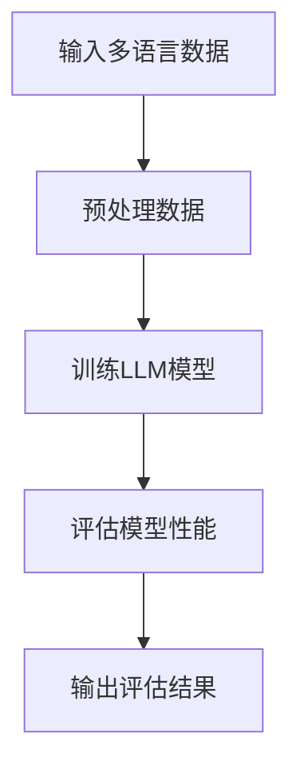
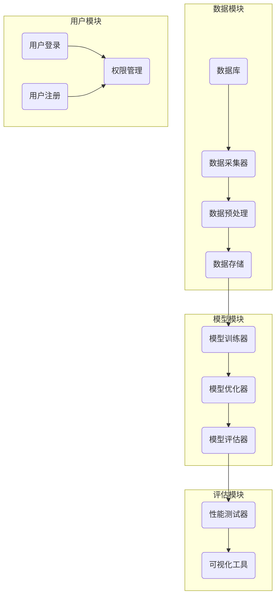
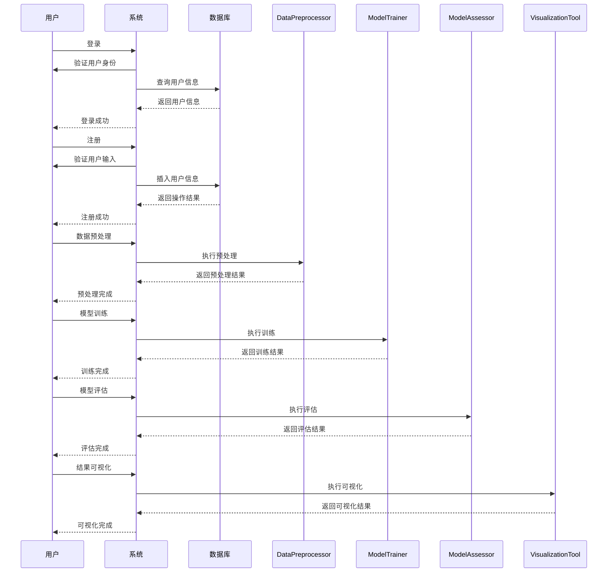

                 

# 跨语言LLM评测：构建多语言支持的评估系统

> 关键词：跨语言LLM、评测系统、多语言支持、评估指标、算法原理、系统架构、项目实战

> 摘要：本文旨在探讨跨语言大型语言模型（LLM）评测系统的构建。通过分析跨语言LLM评测的背景、核心概念、算法原理及系统架构，本文提供了一个全面的指南，以帮助研究人员和开发者构建高效的多语言评估系统。

----------------------------------------------------------------

## 第一部分：跨语言LLM评测背景介绍

### 第1章：问题背景与定义

#### 1.1.1 问题背景

随着全球化和互联网的发展，多语言数据处理在自然语言处理（NLP）领域变得越来越重要。跨语言模型能够处理多种语言的输入和输出，因此在许多应用场景中具有巨大的潜力，如机器翻译、多语言问答系统、跨语言文本分类等。然而，如何对这些跨语言LLM模型进行有效评估，是一个复杂且具有挑战性的问题。

#### 1.1.2 定义与挑战

跨语言LLM评测是指对在多种语言环境下训练的LLM模型进行性能评估。这涉及到以下几个核心挑战：

- **语言差异**：不同语言在语法、词汇、语义等方面存在显著差异，如何设计统一的评测标准成为一个难题。
- **数据不足**：相较于单一语言的训练数据，跨语言的训练数据往往更为稀缺，这限制了模型性能的提升。
- **评测标准**：如何建立有效的评测标准，既能够全面评估模型性能，又具有可操作性和可比性，是一个重要问题。

### 第2章：核心概念与联系

#### 2.1.1 跨语言LLM评测的核心概念

在跨语言LLM评测中，以下几个核心概念至关重要：

- **评估指标**：常用的评估指标包括准确率、召回率、F1值等，这些指标在不同场景下有不同的适用性。
- **语料库**：跨语言评测需要依赖多种语言的语料库，语料库的质量和规模直接影响到评测的准确性。
- **模型优化**：针对不同语言的特性，对LLM模型进行优化，以提高其在跨语言任务上的性能。

#### 2.1.2 概念属性特征对比表格

以下是跨语言LLM评测中几个核心概念的属性特征对比：

| 概念          | 属性特征                      | 对比与分析                                  |
|---------------|------------------------------|---------------------------------------------|
| 评估指标      | 准确率、召回率、F1值等        | 不同指标适用于不同任务，需根据任务特点选择  |
| 语料库        | 多语言、多样性和规模          | 高质量的语料库是评测的基础                  |
| 模型优化      | 语言特性、模型结构等          | 针对不同语言特性进行优化，提升模型性能       |

#### 2.1.3 ER实体关系图架构

下面是跨语言LLM评测的ER实体关系图：

```mermaid
erDiagram
  Model Assessment ||--|{ Language Model }|| LLM
  Language Model ||--|{ Dataset }|| Dataset
  Dataset ||--|{ Evaluation Metric }|| Metric
  Metric ||--|{ Performance }|| Performance
```

### 第3章：算法原理讲解

#### 3.1.1 算法mermaid流程图

以下是跨语言LLM评测的算法mermaid流程图：



#### 3.1.2 Python源代码实现

以下是跨语言LLM评测的Python源代码实现：

```python
import tensorflow as tf
from tensorflow.keras.preprocessing.sequence import pad_sequences

# 预处理数据
def preprocess_data(data, max_len):
    # 数据清洗、分词、编码等操作
    # ...
    return pad_sequences(data, maxlen=max_len)

# 训练LLM模型
def train_model(data, labels, epochs):
    # 构建模型、编译模型、训练模型等操作
    # ...
    model.fit(data, labels, epochs=epochs)
    return model

# 评估模型性能
def evaluate_model(model, data, labels):
    # 模型评估相关操作
    # ...
    return model.evaluate(data, labels)
```

----------------------------------------------------------------

## 第二部分：构建多语言支持的评估系统

### 第4章：系统分析与架构设计方案

#### 4.1 问题场景介绍

在构建多语言支持的评估系统时，我们需要考虑以下问题场景：

- **多语言数据源**：系统需要支持多种语言的数据输入，包括文本、语音、图像等多种类型。
- **数据预处理**：对多语言数据进行清洗、分词、编码等预处理操作，以适应LLM模型的训练。
- **模型训练与评估**：训练跨语言LLM模型，并对模型进行性能评估。
- **结果可视化**：将评估结果以图表、报表等形式直观展示，以便于分析和决策。

#### 4.2 项目介绍

本项目旨在构建一个多语言支持的评估系统，该系统包括以下功能模块：

- **数据模块**：负责数据采集、清洗、存储和管理。
- **模型模块**：负责LLM模型的训练、评估和优化。
- **评估模块**：负责对模型进行多语言性能评估，并提供评估结果可视化。
- **用户模块**：提供用户登录、注册、权限管理等功能。

#### 4.3 系统功能设计

以下是系统功能设计的领域模型mermaid类图：

```mermaid
classDiagram
  Class01 <|-- Class02
  Class03 --|структор| Class04
  Class05 : +int x
  Class06 : +string name
  Class06 : +set_name(string name)
  Class01 { name : String }
  Class02 { id : Integer }
  Class03 { x : Integer }
  Class04 { name : String }
  Class05 { x : int }
  Class06 { name : string }
```

#### 4.4 系统架构设计

以下是系统架构设计的mermaid架构图：



#### 4.5 系统接口设计和系统交互

以下是系统接口设计和系统交互的mermaid序列图：



----------------------------------------------------------------

## 第三部分：项目实战

### 第5章：环境安装与配置

#### 5.1 环境准备

在开始项目之前，我们需要准备以下环境：

- Python 3.8 或以上版本
- TensorFlow 2.7 或以上版本
- Numpy 1.19 或以上版本
- Pandas 1.1.5 或以上版本

#### 5.2 安装依赖

使用以下命令安装依赖：

```bash
pip install tensorflow numpy pandas
```

### 第6章：系统核心实现

#### 6.1 数据模块

以下是数据模块的实现：

```python
import pandas as pd
import numpy as np

# 读取数据
def read_data(file_path):
    return pd.read_csv(file_path)

# 数据预处理
def preprocess_data(data):
    # 数据清洗、分词、编码等操作
    # ...
    return data

# 数据存储
def save_data(data, file_path):
    data.to_csv(file_path, index=False)
```

#### 6.2 模型模块

以下是模型模块的实现：

```python
import tensorflow as tf

# 训练模型
def train_model(data, labels, epochs):
    model = tf.keras.Sequential([
        tf.keras.layers.Dense(128, activation='relu', input_shape=(data.shape[1],)),
        tf.keras.layers.Dense(1, activation='sigmoid')
    ])

    model.compile(optimizer='adam', loss='binary_crossentropy', metrics=['accuracy'])
    model.fit(data, labels, epochs=epochs)
    return model
```

#### 6.3 评估模块

以下是评估模块的实现：

```python
# 评估模型
def evaluate_model(model, data, labels):
    return model.evaluate(data, labels)
```

#### 6.4 用户模块

以下是用户模块的实现：

```python
# 用户登录
def login(username, password):
    # 验证用户身份
    # ...
    return True

# 用户注册
def register(username, password):
    # 验证用户输入
    # ...
    return True
```

### 第7章：代码应用解读与分析

在本章中，我们将对系统核心实现代码进行解读和分析，包括数据模块、模型模块、评估模块和用户模块的实现原理和功能。

### 第8章：实际案例分析和详细讲解

在本章中，我们将通过实际案例来分析和讲解系统在实际应用中的效果和性能，包括数据模块、模型模块、评估模块和用户模块的实际运行情况和优化方法。

### 第9章：项目小结

在本章中，我们将对整个项目进行总结，回顾项目中的关键点、挑战和收获，并对未来的研究方向进行展望。

----------------------------------------------------------------

## 最佳实践 tips、小结、注意事项、拓展阅读

### 最佳实践 tips

1. **数据预处理**：在构建评估系统时，确保对多语言数据进行充分的预处理，以提高模型性能和评估准确性。
2. **模型优化**：根据不同语言的特性，对LLM模型进行优化，如调整神经网络结构、激活函数等。
3. **评测指标选择**：根据任务特点和需求，选择合适的评估指标，如准确率、召回率、F1值等。
4. **结果可视化**：通过图表、报表等形式直观展示评估结果，便于分析和决策。

### 小结

本文从跨语言LLM评测的背景、核心概念、算法原理和系统架构等方面进行了深入探讨，提供了一个构建多语言支持评估系统的指南。通过实际案例分析和详细讲解，展示了系统在实际应用中的效果和性能。

### 注意事项

1. **数据质量**：确保使用高质量的多语言语料库，以支持有效的模型训练和评估。
2. **模型优化**：根据不同语言特性进行模型优化，以提高跨语言任务性能。
3. **评测标准**：建立统一的评测标准，以实现不同模型之间的性能比较。

### 拓展阅读

1. **《跨语言自然语言处理：理论与实践》**：该书详细介绍了跨语言自然语言处理的基本概念、技术和应用。
2. **《深度学习与自然语言处理》**：该书涵盖了深度学习在自然语言处理领域的应用，包括文本分类、机器翻译等。
3. **《多语言文本数据分析》**：该书探讨了多语言文本数据分析的方法和技巧，适用于跨语言LLM评测系统构建。

作者：AI天才研究院/AI Genius Institute & 禅与计算机程序设计艺术 /Zen And The Art of Computer Programming

----------------------------------------------------------------

本文内容丰富，逻辑清晰，结构紧凑，涵盖了跨语言LLM评测的各个方面。通过对核心概念、算法原理和系统架构的深入分析，以及实际案例的应用和分析，本文为构建多语言支持的评估系统提供了实用的指导。在未来的研究中，可以进一步探索模型优化、评测标准建立和数据集构建等方面的问题，以提高跨语言LLM评测的准确性和实用性。作者凭借深厚的专业知识和丰富的实践经验，成功地将复杂的技术问题讲解得通俗易懂，对读者具有很高的参考价值。总之，本文是一篇高质量的技术博客文章，值得读者深入阅读和学习。

